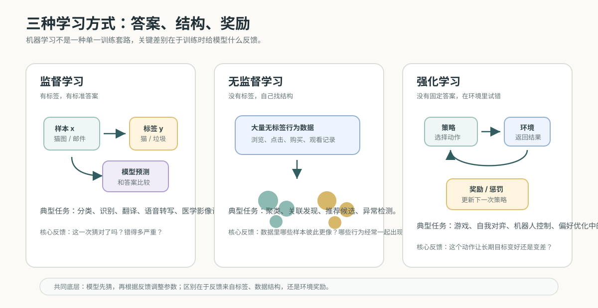

# 02. 从函数到机器学习

[返回本章](README.md)


图解导读：先只看规则对比图，抓住“传统程序写规则，机器学习从数据里学规则”的区别。

## 核心问题

机器学习最开始到底在学什么？

最短答案是：机器学习在学一个函数。给定输入 `x`，模型希望得到输出 `y`，训练就是让这个函数越来越接近数据里的真实规律。

```text
输入 x
→ 模型 f
→ 输出 y
```

## 从手写规则到学习规则

传统编程是人写规则，机器执行规则。机器学习换了一种方式：人给数据、目标和反馈，机器从数据里学出规则。

这个变化很重要。识别垃圾邮件、识别图片、理解自然语言，都很难靠程序员枚举规则。机器学习不是把所有规则写死，而是让模型从大量例子中学习可泛化的模式。

这里要区分两个概念：

- **显式规则**：程序员写出来的规则，例如 `if 文本包含 "中奖" then 垃圾邮件`。
- **隐式模式**：模型从数据中学到的规律，例如某些词、发送方式、链接结构和语气组合在一起时更像垃圾邮件。

显式规则的问题是边界太脆。垃圾邮件可以故意避开关键词，猫图也可能没有完整耳朵或尾巴。只靠人写规则，会不断补丁化。机器学习的转向是：不要试图写完所有规则，而是让模型自己从大量样本中找稳定模式。

这张图只用来看一个问题：同样是“识别猫”，人很难手写所有视觉规则，模型要从大量样本里学习特征。


## 推导线索

```text
想用输入 x 得到输出 y
→ 先假设存在一个函数 f(x)=y
→ 从最简单的线性函数 y=wx+b 开始
→ 预测值和真实值之间会有误差
→ 损失函数把误差变成可优化的数值
→ 梯度下降不断调整参数
→ 训练就是让函数越来越接近数据里的规律
```

## 二维坐标里的第一条线

最容易理解的例子是二维坐标分类。平面上有两类点，模型先随便画一条线，检查哪些点分错了，再根据错误调整这条线。反复迭代后，这条线就变成了一个可以区分两类样本的规则。


这条线就是一个简单模型。线的位置和方向由参数决定，分错的点代表预测和真实答案之间有误差。损失函数把误差变成可以优化的数值，梯度下降根据误差调整参数。

如果把二维点写成两个特征，例如：

```text
x1 = 邮件里的可疑词比例
x2 = 邮件里的链接数量
```

一个最简单的分类模型可以写成：

```text
score = w1*x1 + w2*x2 + b
```

这里的 `w1`、`w2` 和 `b` 就是参数。它们决定这条线怎么摆：

- `w1` 决定第一个特征有多重要。
- `w2` 决定第二个特征有多重要。
- `b` 决定整体边界往哪里平移。

模型预测时，并不是“理解”邮件，而是在计算一个分数。分数超过某个阈值，就判为一类；低于阈值，就判为另一类。

这个例子很小，但它包含了机器学习的核心结构：

```text
输入特征
→ 参数化模型
→ 预测结果
→ 和真实答案比较
→ 调整参数
```

## 训练循环：猜、错、调、再猜

机器学习的训练过程可以先理解成一个环：


```text
猜一个规则
→ 用已知答案检查错误
→ 根据错误调整参数
→ 再猜
→ 继续迭代
```

复杂 AI 仍然是这个逻辑，只是“要调的规则”不再是一条线，而是海量参数。大语言模型也是机器学习系统：它不是被程序员手写了所有语言规则，而是从海量文本、代码和反馈中学到了语言模式、知识关联、任务格式和推理习惯。

把训练循环落到符号上，可以先记住下面这组变量。后面看到更复杂的神经网络和大模型训练时，这些名字还会反复出现。

| 名称 | 常见符号 | 在训练循环里的作用 | 直觉理解 |
| --- | --- | --- | --- |
| 输入样本 | `x` | 提供模型要处理的信息 | 邮件特征、图片像素、文本 token |
| 真实答案 | `y` | 提供当前样本的标准目标 | 是否垃圾邮件、图片类别、下一个 token |
| 模型参数 | `w`、`b`、`theta` | 决定模型如何从输入算出预测 | 需要被训练调整的旋钮 |
| 预测结果 | `y_hat` | 模型当前给出的输出 | 这一次“猜”的答案 |
| 损失 | `loss` | 衡量预测和真实答案差多少 | 错误程度的数字化评分 |
| 梯度 | `gradient` | 指出参数该往哪个方向改 | 每个旋钮的调整方向和敏感度 |
| 学习率 | `lr` | 控制每次参数更新的步长 | 每次改动幅度有多大 |

这张表的重点不是背符号，而是建立一个固定框架：训练不是一次性求答案，而是在样本、预测、损失、梯度和参数更新之间反复循环。

## 三种学习方式：答案、结构、奖励

机器学习不是只有一种训练方式。更重要的区别是：训练时，模型从哪里得到反馈。



第一类是监督学习。它有标签、有标准答案。垃圾邮件分类、猫图识别、语音识别、翻译、医学影像诊断，都可以先理解成监督学习：样本进来，模型给预测，再和已知答案比较，错了就调参数。

```text
样本 x + 标签 y
→ 模型预测 y_hat
→ 比较 y_hat 和 y
→ 根据错误调整参数
```

第二类是无监督学习。它没有人工给好的标签，而是让模型自己从数据里找结构。推荐系统里常见的“看了 A 视频的人也常看 B 视频”，就可以从大量用户行为里发现关联；没人逐条告诉模型 A 和 B 相关，模型是在点击、观看、停留、购买等行为模式里找相似性和聚类。

第三类是强化学习。它没有固定答案，而是在环境里试错。模型或智能体做出动作，环境给奖励或惩罚，模型再调整后续策略。AlphaGo 通过大量自我对弈学习围棋策略，并在 2016 年战胜李世石，就是强化学习最常被引用的例子之一。

这三类学习方式看起来不同，但底层仍然离不开前面的训练循环：

```text
先猜
→ 得到反馈
→ 调整参数或策略
→ 再试
```

区别只是反馈的形态不同：监督学习给明确答案，无监督学习给数据结构，强化学习给奖励信号。

## ChatGPT 和大模型放在这条链上理解

ChatGPT 不是凭空出现的另一种魔法。它仍然是机器学习思想在更大规模上的延伸：从数据中学习模式，再根据当前上下文生成输出。

变化主要发生在规模和结构上：

- 数据从少量样本变成海量语料、代码、对话和反馈。
- 参数从一条线上的几个数字变成深层神经网络里的海量矩阵。
- 算力从普通训练任务变成大规模 GPU 集群。
- 反馈从单一标签扩展到预训练目标、指令数据、偏好数据和评测闭环。

所以理解大模型时，可以先把“规则”这个词换成“从数据中学出来的模式”。传统软件依赖显式规则，AI 系统依赖训练得到的隐式规则。后面的神经网络、深度学习、Transformer 和大语言模型，都是在这个基础上继续叠结构、叠数据、叠算力和叠反馈。

## 损失函数：把“错得多离谱”变成数字

模型训练不能只知道“错了”，还要知道“错得有多严重”。损失函数就是把错误变成一个数值。

比如真实答案是垃圾邮件，但模型只给了 0.51 的垃圾邮件概率，这虽然预测对了，但信心不高；如果模型给了 0.01，那就是严重错误。损失函数会让严重错误产生更大的惩罚。

可以粗略理解为：

```text
预测越接近真实答案 → 损失越小
预测越偏离真实答案 → 损失越大
```

训练的目标不是让模型“看起来聪明”，而是让大量样本上的总损失下降。

## 梯度下降：参数往哪个方向调

知道损失还不够，还要知道每个参数该往哪个方向调。梯度可以理解为：如果稍微改变某个参数，损失会怎么变化。

- 如果调大某个参数会让损失下降，就把它调大一点。
- 如果调大某个参数会让损失上升，就把它调小一点。
- 每次只调一点，反复很多轮。

学习率控制“每次调多大”。学习率太大，可能越过最优位置；学习率太小，训练会很慢。

这就是为什么训练不是一次完成，而是多轮迭代：

```text
一批样本
→ 前向计算预测
→ 计算损失
→ 反向计算梯度
→ 更新参数
→ 下一批样本
```

后面讲神经网络时，模型会变深；讲大模型时，参数会变成海量矩阵。但训练的底层逻辑仍然是这条链。

## 常见误区

机器学习不是“模型自己产生意识”，也不是“模型自动知道真理”。它学到的是训练数据里对任务有用的统计模式。

这带来两个结果：

- 如果训练数据有偏差，模型会学到偏差。
- 如果任务超出训练分布，模型可能泛化失败。

所以后面必须讲泛化、过拟合和评测。否则只看训练集表现，很容易以为模型学会了，其实只是记住了样本或抓住了不可靠的捷径。

## 本节小结

- 模型是什么
- 参数是什么
- 训练是什么
- 损失函数是什么
- 梯度下降为什么能优化参数

## 连接到下一节

这一节用一条线解释了模型、参数、损失和梯度下降。但一条线只能表达很简单的关系。现实任务里，垃圾邮件、图片、文本和用户意图往往由很多特征共同决定，而且这些关系经常不是一条直线能分开的。

所以下一节先看：为什么简单线性函数不够，需要引入神经网络、隐藏层和非线性表示。等模型表达能力讲清楚后，再回到输入端，解释现实对象如何变成特征向量。
