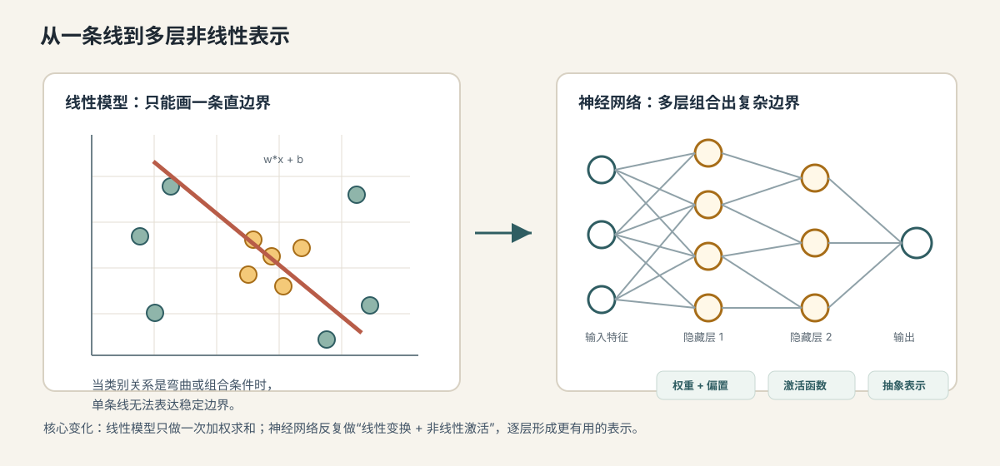

# 03. 从线性模型到神经网络

[返回本章](README.md)



图解导读：先只看多层神经网络图，抓住“多层非线性组合让模型表达能力超过一条线”的主线。

## 核心问题

为什么一条线不够？上一节用最简单的机器学习例子说明了模型可以从数据中学习一条分类边界。这个例子很重要，因为它把“学习”压缩成了一个可计算过程：

```text
输入特征
→ 线性模型
→ 预测结果
→ 根据错误调整参数
```

但现实任务通常不是一条直线、一张平面或一个简单规则能解决的。判断一封邮件是否诈骗，可能同时取决于发件域名、语气、链接结构、金额表达和上下文；识别一张图片是不是猫，可能取决于边缘、纹理、局部形状和更高层的整体结构。单个**线性模型**只能表达“特征加权相加后做判断”，也就是用一组权重把输入特征加起来形成输出，它很难自动组合出复杂概念。

**神经网络**是由多个可训练计算单元按层连接而成的模型。它就是为了解决表达能力问题出现的：把很多简单的计算单元连接起来，并在中间加入**非线性**，也就是让输出不再只是输入的简单加权和，从而让模型可以一层一层学习更复杂的**表示**，即模型内部用数字结构描述输入的方式。

## 从哪里来：线性模型的边界

**线性模型**是指用输入特征的加权和来产生输出的模型。对于两个特征，它可以写成：

```text
score = w1*x1 + w2*x2 + b
```

这里有三个第一次必须讲清楚的术语：

- **权重**：`w1`、`w2` 这样的参数，表示某个特征对结果的影响强弱和方向。
- **偏置**：`b` 这样的参数，表示即使所有输入为 0，模型也可以有一个基础倾向；在几何上，它会平移分类边界。
- **参数**：模型在训练中会被调整的数值，权重和偏置都是参数。

如果输入只有两个维度，线性分类器在平面上画出的是一条直线；如果输入有更多维度，它画出的是高维空间里的一个超平面。它的优点是简单、可解释、容易训练；它的问题是表达能力有限。

这张图只用来回看上一节的起点：线性模型本质上是在找一条能分开样本的边界。


比如有一类数据呈现“中间一圈是一类，外面一圈是另一类”的结构。无论你怎么移动一条直线，都无法把内外两圈分开。线性模型不是训练不够努力，而是它的模型形状不允许它表达这种边界。

这就是机器学习里的第一个重要判断：

```text
训练失败可能不是优化没做好
也可能是模型本身表达不了目标规律
```

把线性模型和神经网络放在一起看，差异不在于“有没有参数”，而在于模型能不能逐层组合出新的表示。

| 对比维度 | 线性模型 | 神经网络 |
| --- | --- | --- |
| 基本计算 | 对输入特征加权求和 | 多层加权求和加激活函数 |
| 表达形状 | 直线、平面或高维超平面 | 可以形成弯曲边界和组合条件 |
| 特征依赖 | 更依赖人工设计好的特征 | 可以在隐藏层学习中间表示 |
| 优点 | 简单、稳定、容易解释 | 表达能力强，适合复杂模式 |
| 主要风险 | 表达能力不足，欠拟合复杂关系 | 训练成本高，可能过拟合或难解释 |

所以神经网络不是否定线性模型，而是在保留“参数化可训练”这件事的基础上，增加了多层非线性组合能力。

## 直觉层：从一条线到很多个小判断

可以先把神经网络理解成很多个“小判断器”的组合。

一个线性模型只能问一个大问题：

```text
这些特征加起来，整体更像 A 还是 B？
```

神经网络则可以在中间拆出很多小问题：

```text
有没有可疑链接？
语气是否像诱导点击？
域名是否异常？
金额表达是否夸张？
这些迹象组合起来，是否像诈骗邮件？
```

每个小判断本身仍然很简单，但多层组合后就能形成更复杂的判断。识别图片时也是类似逻辑：

```text
像素
→ 边缘
→ 纹理
→ 局部形状
→ 耳朵、眼睛、脸部轮廓
→ 猫
```

这条链可以理解成逐层抽象：越靠前的层越接近原始输入，越靠后的层越接近任务需要的概念。

这张图只用来看“原始输入”和“模型特征”之间的距离：图片像素要逐步变成可用于判断的向量表示。


| 层级 | 可能学到的表示 | 对任务的帮助 |
| --- | --- | --- |
| 输入层 | 原始像素、词 ID、结构化特征 | 把现实对象转成模型能计算的数字 |
| 低层隐藏层 | 边缘、局部纹理、常见词形或短语搭配 | 提取局部、稳定、可复用的小模式 |
| 中层隐藏层 | 局部形状、语义片段、关系线索 | 把小模式组合成更有意义的中间结构 |
| 高层隐藏层 | 类别相关概念、任务格式、上下文意图 | 为最终分类、生成或决策提供抽象依据 |
| 输出层 | 类别分数、数值预测、下一个 token 分布 | 把内部表示转成任务需要的结果 |

这也是为什么深度学习常被称为表示学习：模型不只是在最后一步做判断，也在前面的层里持续改写输入的表达方式。

这里的关键不是某一层“懂猫”，而是每一层都把上一层的信息重新组合，形成更适合任务的中间表示。

**表示**是指模型内部用来描述输入的数字结构。原始输入可能是像素、词、特征值；中间表示则是神经网络自己学出来的抽象特征。表示越有用，后面的判断越容易。

## 机制层：神经元、激活函数和隐藏层

神经网络里最小的计算单元常被称为**神经元**。它不是生物神经元的真实模拟，而是一个数学计算节点。一个神经元做三件事：

```text
接收多个输入
→ 用权重加权求和，再加偏置
→ 经过激活函数得到输出
```

可以写成：

```text
z = w1*x1 + w2*x2 + ... + wn*xn + b
a = activation(z)
```

这里 `z` 是加权和，`a` 是神经元的输出。

**激活函数**是把加权和变成输出的函数。它最重要的作用是引入非线性。常见激活函数包括：

- **ReLU**：小于 0 的值变成 0，大于 0 的值保持不变，常写作 `max(0, z)`。
- **Sigmoid**：把数值压到 0 到 1 之间，早期常用于概率式输出。
- **Tanh**：把数值压到 -1 到 1 之间。

这些激活函数的共同目标是引入非线性，但它们的输出范围和工程用途不同：

| 激活函数 | 直觉形式 | 输出范围 | 常见用途或注意点 |
| --- | --- | --- | --- |
| ReLU | 负数截断为 0，正数保留 | `[0, +∞)` | 深度网络中常用，计算简单，能缓解部分梯度消失问题 |
| Sigmoid | 把数值压成概率式曲线 | `(0, 1)` | 适合二分类输出层，但深层隐藏层里容易梯度变小 |
| Tanh | 把数值压到正负之间 | `(-1, 1)` | 输出以 0 为中心，早期循环网络中常见 |
| Softmax | 把多个分数归一化成概率分布 | 每项 `(0, 1)`，总和为 1 | 常用于多分类输出层，不通常作为隐藏层激活 |

选择激活函数时，核心不是记名字，而是看它是否给网络带来了合适的非线性和稳定的训练信号。

**非线性**是指输出不是输入的简单线性加权结果。没有非线性，多层网络看起来很深，本质上仍然等价于一个线性模型。比如：

```text
第一层：h = W1*x + b1
第二层：y = W2*h + b2
代入后：y = W2*(W1*x + b1) + b2
       = (W2*W1)*x + (W2*b1 + b2)
```

这仍然是 `W*x + b` 的形式。也就是说，只有线性层叠加，不能真正增加表达能力。激活函数让每一层不再只是线性变换，模型才有能力表达弯曲边界、组合条件和复杂模式。

**隐藏层**是输入层和输出层之间的中间层。它叫“隐藏”，不是因为它神秘，而是因为训练数据只直接给输入和目标答案，中间层应该学什么没有人工标签。模型会在训练中自己调整隐藏层参数，让这些中间表示对最终任务有用。

## 形式层：一层网络到多层网络

把多个神经元排成一组，就得到一层。每层可以用矩阵形式表示：

```text
z1 = W1*x + b1
a1 = activation(z1)

z2 = W2*a1 + b2
a2 = activation(z2)

output = W3*a2 + b3
```

这里：

- `x` 是输入向量。
- `W1`、`W2`、`W3` 是权重矩阵。
- `b1`、`b2`、`b3` 是偏置向量。
- `a1`、`a2` 是隐藏层输出，也就是中间表示。
- `output` 是最终预测前的结果。

从函数角度看，神经网络是很多函数的嵌套：

```text
f(x) = f3(f2(f1(x)))
```

每一层都把输入空间重新变换一次。浅层网络可能只能形成简单边界；更深的网络可以逐层组合特征，形成更抽象的表示。

但“更深”不自动等于“更好”。深度带来表达能力，也带来训练难度、过拟合风险、计算成本和调参复杂度。大模型之所以强，不只是因为层数多，还因为有合适的结构、足够的数据、稳定的训练方法和明确的目标函数。

## 工程层：神经网络为什么改变了开发方式

线性模型时代，很多工程工作集中在人工特征工程：人先想清楚哪些特征有用，再把这些特征输入模型。神经网络尤其是深度学习的变化是：模型可以从原始或半原始输入中自动学习表示。

这会改变工程决策：

- 你不只是在选一个模型，也是在选一种表示学习方式。
- 输入信息的组织方式会影响模型能学到什么。
- 网络越大，越需要更多数据、算力和正则化手段。
- 模型表达能力变强后，更容易把训练数据里的偶然相关也学进去。

在大语言模型里，这个逻辑会继续放大。Transformer 不是一条手写语言规则，而是一个巨大的神经网络。它的隐藏层会把 token 序列变成一层层上下文表示，底层可能更接近词形和局部搭配，高层更接近语义、任务格式、推理步骤和输出风格。

所以理解神经网络，不是为了记住“神经元像大脑”，而是为了抓住这个核心：

```text
神经网络通过多层非线性变换
把原始输入逐步变成对任务有用的抽象表示
```

## 常见误区

**误区一：神经网络就是模拟人脑。**  
神经网络借用了“神经元”这个名字，但现代深度学习主要是数学优化系统，不是对人脑的精确复刻。把它当作可训练函数，比把它当作人脑模型更准确。

**误区二：层数越多一定越好。**  
层数增加会提高表达能力，但也可能导致训练更难、推理更慢、过拟合更严重。真实工程里要在效果、成本、延迟、数据规模和可维护性之间取舍。

**误区三：激活函数只是一个小细节。**  
激活函数决定网络是否真的拥有非线性表达能力。没有激活函数，多层线性网络仍然可以合并成一层线性模型。

**误区四：隐藏层学到的东西一定可解释。**  
隐藏层可能学到有用表示，但这些表示不一定能被人直接命名。工程上可以通过可视化、探针任务、消融实验和评测去理解它们，但不能假设每个神经元都对应一个清晰概念。

**误区五：模型大就会自动学到正确规律。**  
模型越大，越能拟合复杂关系，也越可能记住噪声、偏见和错误相关。表达能力只是前提，不等于泛化能力。

## 连接到下一节

现在我们知道，神经网络可以通过权重、偏置、激活函数和隐藏层表达复杂关系。但还有一个关键问题没有解决：模型怎么知道当前参数好不好？它怎么把一次预测的错误传回到每一层、每一个参数上？

下一张图只需要先看三段职责：前向传播算预测，损失函数判分，反向传播把错误分配给参数。


下一节要讲前向传播、损失函数与反向传播。前向传播解释模型如何算出预测，损失函数解释如何衡量错误，反向传播解释错误如何沿着网络被分配给参数。
