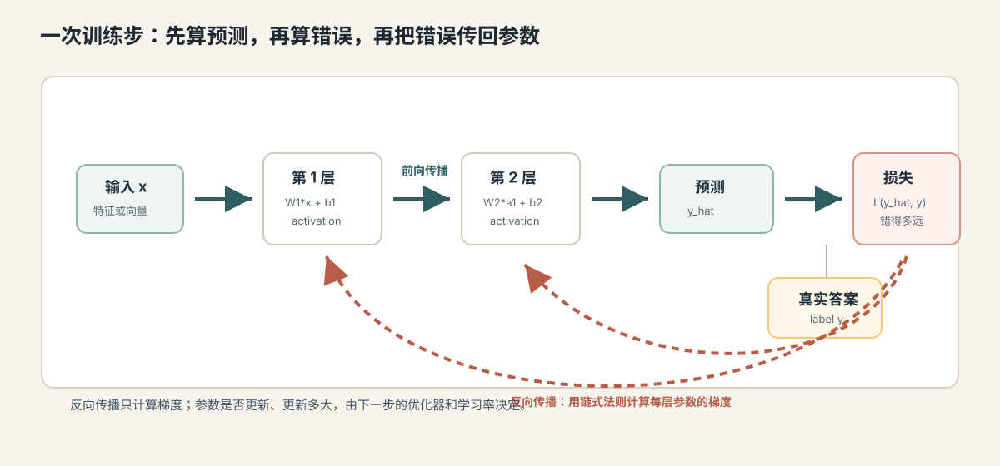
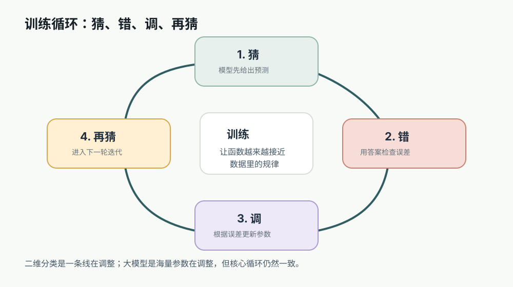

# 04. 前向传播、损失函数与反向传播

[返回本章](README.md)



图解导读：先只看前向、损失、反向三段职责，抓住“模型怎样把一次错误变成可计算的梯度”。

## 核心问题

神经网络怎么知道自己错在哪里？

上一节讲到，神经网络由很多层组成，每一层都有权重、偏置和激活函数。它能把输入逐层变换成更抽象的表示，最后给出预测。但“能预测”不等于“能学习”。学习需要回答三个问题：

```text
模型如何算出预测？
预测和答案差多少？
每个参数应该为这个错误承担多少责任？
```

这三个问题分别对应：

- **前向传播**：输入从第一层流到最后一层，算出预测。
- **损失函数**：把预测和真实答案之间的差距变成一个数。
- **反向传播**：把损失产生的错误信号，从输出层往前传回每一层，计算每个参数的**梯度**，也就是损失对参数的变化率。

先把这三段的职责分清楚，后面的公式会更容易读：

| 阶段 | 输入是什么 | 产出是什么 | 回答的问题 |
| --- | --- | --- | --- |
| 前向传播 | 样本 `x` 和当前参数 | 预测值 `y_hat` 或 logits | 当前模型会给出什么答案？ |
| 损失函数 | 预测值 `y_hat` 和真实答案 `y` | 一个损失值 `loss` | 这个答案错得有多严重？ |
| 反向传播 | 损失值和前向计算图 | 每个参数的梯度 | 哪些参数该往哪个方向调整？ |
| 优化器更新 | 梯度、学习率和优化器状态 | 新一轮参数 | 参数这次实际改多少？ |

注意最后一行不属于反向传播本身，但它紧接着发生。区分“算梯度”和“改参数”，能避免把训练过程混成一个黑箱。

这里的**真实答案**是训练数据给出的标准目标，例如正确类别、真实数值或下一个正确 token。

理解这三件事，才能理解神经网络训练为什么不是“玄学试错”，而是一个可计算、可重复、可优化的过程。

## 从哪里来：预测本身不会自动带来学习

假设模型看到一封邮件，输出：

```text
垃圾邮件概率 = 0.82
```

如果真实答案也是垃圾邮件，这个预测看起来不错；如果真实答案是正常邮件，这个预测就很糟。但模型不能只听到一句“你错了”。它需要更精确的反馈：

```text
错得有多严重？
最后一层哪些权重导致了错误？
前面隐藏层的哪些表示放大了错误？
更早的参数应该往哪个方向调整？
```

神经网络里可能有成千上万、上亿甚至更多参数。训练不能靠人手动指出每个参数的问题。反向传播的意义，就是用微积分里的链式法则，把最终错误自动拆分到所有相关参数上。

这张图只用来回看训练闭环的位置：本节负责解释“算错”和“回传”，下一节再讲“更新”和“继续迭代”。



**链式法则**是微积分中的规则，用来计算复合函数的导数。神经网络正是很多函数一层层嵌套而成，所以链式法则天然适合计算“某个早期参数如何影响最终损失”。

不懂微积分也可以先抓住一个参数的小例子。假设模型里有一个权重 `w`：

```text
w 调大一点，loss 从 0.80 变成 0.70
→ 调大 w 让错误变小
→ 下一步可以继续把 w 往大的方向调一点

w 调大一点，loss 从 0.80 变成 0.95
→ 调大 w 让错误变大
→ 下一步应该把 w 往小的方向调一点
```

梯度要回答的就是这个问题：某个参数稍微变化时，损失会往哪个方向变、变化有多敏感。反向传播是在多层网络里自动、批量地回答这个问题。

## 直觉层：先做题，再判分，再追责

可以把一次训练理解成考试流程：

```text
做题：模型根据输入算出预测
判分：损失函数比较预测和标准答案
追责：反向传播判断每一步计算对扣分贡献了多少
```

前向传播像是学生从题目推导到答案。损失函数像是评分标准，不只说对错，还给出扣分程度。反向传播像是把扣分原因沿着解题步骤往回追：最后一步算错了多少，倒数第二步对最后一步影响多大，更早的步骤又对倒数第二步影响多大。

这个类比要注意边界：模型没有主观理解，也没有真正“反思”。它只是用数学方式计算每个参数对损失的影响方向和大小。

## 机制层：前向传播如何产生预测

**前向传播**是指输入数据从网络第一层开始，逐层经过计算，最后得到输出的过程。它叫“前向”，是因为计算方向从输入指向输出。

对于一个两层隐藏层网络，可以写成：

```text
a0 = x

z1 = W1*a0 + b1
a1 = activation(z1)

z2 = W2*a1 + b2
a2 = activation(z2)

logits = W3*a2 + b3
prediction = output_function(logits)
```

这里每个符号都有明确含义：

- `x` 是输入向量。
- `a0` 是第 0 层激活值，也就是原始输入。
- `W` 是权重矩阵。
- `b` 是偏置向量。
- `z` 是激活函数之前的线性计算结果。
- `a` 是激活函数之后的输出。
- **logits** 是输出层还没有转成概率之前的原始分数。
- **预测值**是模型最终给出的结果，可能是一个连续数值，也可能是一组类别概率。

如果是分类任务，常见做法是用 **softmax** 把多个 logits 转成概率分布。概率分布是指所有类别的概率都在 0 到 1 之间，并且总和为 1。

```text
logits = [2.1, 0.4, -1.2]
softmax(logits) = [0.79, 0.15, 0.06]
```

这表示模型认为第一个类别最可能。

## 机制层：损失函数如何衡量错误

**损失函数**是把预测和真实答案之间的差距转成一个可优化数值的函数。这个数值叫**损失**。损失越小，表示模型在当前样本或当前 batch 上表现越好。

**真实答案**也叫标签，是训练数据里给出的目标结果。比如邮件是否垃圾、图片类别、房价真实数值、下一 token 的正确 id。

不同任务常用不同损失函数：

- **均方误差**：常用于回归任务，也就是预测连续数值的任务，例如房价预测。
- **交叉熵损失**：常用于分类任务，也就是从多个类别中选一个或多个类别的任务。

更具体地看，损失函数要和任务输出形式匹配。选错损失函数，模型可能仍然能训练，但优化目标会偏离真正任务。

| 损失函数 | 常见任务 | 惩罚方式 | 大模型相关理解 |
| --- | --- | --- | --- |
| 均方误差 MSE | 回归任务，例如预测价格或温度 | 预测值和真实值差距越大，平方惩罚越大 | 更适合连续数值，不适合直接衡量文本质量 |
| 二元交叉熵 | 二分类或多标签分类 | 真实标签的概率越低，损失越大 | 可用于安全分类器、过滤器、偏好判断的子任务 |
| 多分类交叉熵 | 单标签多分类 | 正确类别概率越低，损失越大 | next-token prediction 本质上是在词表上做多分类 |
| 序列级奖励损失 | 偏好优化、强化学习式对齐 | 根据整段输出的偏好反馈调整 | 用来补充“只预测下一个 token”无法表达的偏好目标 |

因此，“损失下降”首先表示模型更符合这个数学目标，而不是自动等于更符合所有业务目标。

均方误差的直觉很简单：

```text
loss = (预测值 - 真实值)^2
```

平方让大错误受到更大惩罚，也避免正负误差相互抵消。

交叉熵损失的直觉是：真实类别的预测概率越高，损失越小；真实类别的预测概率越低，损失越大。

```text
真实类别 = 猫
模型给猫的概率 = 0.90 → 损失小
模型给猫的概率 = 0.01 → 损失大
```

大语言模型预训练时，最常见目标是预测下一个 token。它本质上也是分类：在词表里的大量 token 中，为下一个正确 token 分配更高概率。

## 机制层：反向传播如何分配错误

**反向传播**是计算梯度的算法。它从损失开始，沿着前向传播的计算路径反向走，计算每个参数对损失的影响。

**梯度**是损失函数对参数的导数，可以理解为“如果这个参数稍微变大一点，损失会怎么变”。梯度包含两个信息：

- 方向：参数应该增大还是减小，才可能让损失下降。
- 大小：这个参数对损失变化有多敏感。

最小的例子可以写成：

```text
z = w*x + b
y_hat = activation(z)
loss = L(y_hat, y)
```

要知道 `w` 应该怎么调，就要计算：

```text
d loss / d w
```

由于 `loss` 不是直接由 `w` 得到，而是经过 `z` 和 `y_hat` 多步计算得到，所以用链式法则：

```text
d loss / d w
= d loss / d y_hat
  * d y_hat / d z
  * d z / d w
```

这句话的意思是：

```text
w 影响 z
z 影响 y_hat
y_hat 影响 loss
所以 w 通过这条链影响 loss
```

可以把这条链路拆成几个责任节点。反向传播做的事，就是把最终损失沿这些节点逐段传回去。

| 链路节点 | 前向时做什么 | 反向时传什么 | 直觉含义 |
| --- | --- | --- | --- |
| `w` | 参与加权输入 | `d loss / d w` | 这个权重该增大还是减小 |
| `z` | 汇总加权和与偏置 | `d loss / d z` | 当前神经元的线性结果对错误有多敏感 |
| `y_hat` | 表示模型预测 | `d loss / d y_hat` | 预测值偏离答案造成多大损失 |
| `loss` | 汇总错误程度 | 反向链路的起点 | 所有梯度都从最终错误开始追溯 |

链路越深，早期参数对损失的影响越间接；链式法则保证这种间接影响仍然可以被系统地计算出来。

深层网络只是这条链更长。反向传播会复用已经算过的中间结果，把每一层的梯度高效地算出来，而不是对每个参数都重新试一遍。

## 形式层：一次训练步里的三段计算

一次训练步通常包含三段：

```text
1. 前向传播
   y_hat = model(x)

2. 计算损失
   loss = loss_fn(y_hat, y)

3. 反向传播
   gradients = backward(loss)
```

如果展开成参数层面，可以理解为：

```text
给定参数 theta
模型产生预测 y_hat = f_theta(x)
损失为 L(y_hat, y)
反向传播计算梯度 grad = dL / dtheta
```

这里 `theta` 表示所有参数的集合，包括每一层的权重和偏置。

反向传播只负责算梯度。它本身并不直接更新参数。参数真正怎么改，是下一节要讲的优化器和梯度下降负责的事情。

这张图只用来预告下一节：梯度指出方向，学习率和优化器决定每次沿这个方向走多远。


这个区分很重要：

```text
反向传播：算出每个参数的梯度
优化器：根据梯度更新参数
```

很多初学者会把这两个过程混在一起。严格说，`backward()` 只是让模型知道“往哪里改”；`optimizer.step()` 才是实际“改参数”。

## 工程层：为什么损失下降不等于模型可靠

工程里经常会看到训练日志：

```text
step=1200, train_loss=0.82
step=1300, train_loss=0.76
step=1400, train_loss=0.71
```

训练损失下降通常说明模型正在更好地拟合训练数据。但这不自动意味着模型在真实场景中可靠。原因包括：

- 损失函数只衡量你定义的目标，不衡量所有业务质量。
- 训练数据可能有偏差，模型会认真学习这些偏差。
- 模型可能靠捷径降低损失，例如记住格式、关键词或数据泄漏。
- 某些重要能力很难被单一损失函数完整表达，例如事实准确性、可解释性和安全性。

在大模型工程里，这个问题尤其明显。预训练损失下降可以提升语言建模能力，但用户真正关心的是回答是否正确、是否遵守指令、是否调用工具、是否拒绝危险请求、是否能在业务约束下完成任务。这些都需要额外的训练、对齐和评测。

这张图只用来看本节机制在大模型训练里的位置：预训练仍然依赖前向计算、损失和参数更新，只是规模放大了很多。


## 常见误区

**误区一：损失函数就是准确率。**  
准确率只统计预测是否正确，损失函数衡量错得多严重。一个模型准确率可能一样，但损失不同，因为置信度不同。

**误区二：反向传播是在“理解错误原因”。**  
反向传播计算的是数学梯度，不是语义解释。它知道某个参数怎样影响损失，但不一定能给人类语言层面的原因。

**误区三：梯度越大越好。**  
梯度大表示参数对损失敏感，但过大的梯度可能导致训练不稳定。工程上常用梯度裁剪、归一化和合适学习率来控制。

**误区四：前向传播只在训练时发生。**  
训练和推理都会前向传播。区别是训练时还要计算损失、反向传播和更新参数；推理时通常只做前向传播，然后生成输出。

**误区五：损失低就说明业务效果好。**  
损失低只说明模型在某个数据和目标函数上表现好。真实业务还要看验证集、测试集、人工评估、线上指标、延迟、成本和安全边界。

## 连接到下一节

到这里，模型已经能算预测、算损失，也能通过反向传播算出每个参数的梯度。但梯度只是方向信息，参数还没有真正改变。

下一节要讲梯度下降与模型训练：学习率决定每次走多大，batch 决定每次看多少样本，epoch 决定完整看几遍数据，optimizer 决定如何根据梯度更新参数。训练循环就是把这些步骤反复执行，让损失逐步下降。
