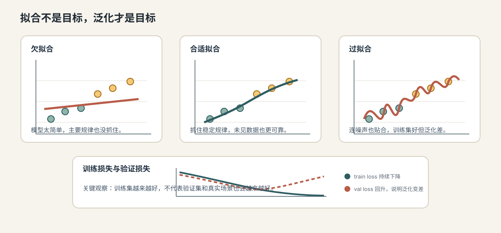
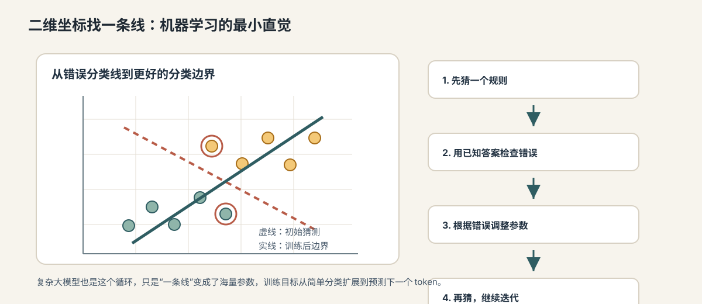
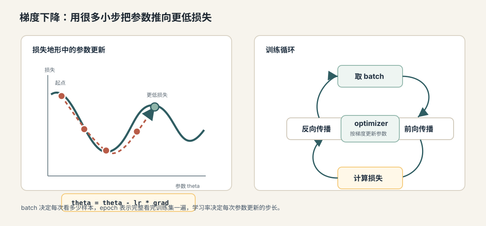

# 06. 拟合、泛化与过拟合

[返回本章](README.md)



图解导读：先只看拟合对比图，抓住“训练集变好不等于未见数据也可靠”的主线。

## 核心问题

模型是在学规律，还是在背答案？

上一节讲到，训练循环会让模型不断降低损失。问题是，**训练损失**，也就是模型在用于学习的数据上的错误程度，下降并不等于模型真正学会了任务。一个模型可能在**训练集**，也就是用于更新参数的数据上表现极好，却在新数据上表现很差。它看起来“学会了”，其实只是记住了训练样本里的细节、噪声或偶然规律。

这一节要讲的核心判断是：

```text
训练效果好
不等于
真实场景效果好
```

机器学习真正追求的不是把已知样本答对，而是在未见过的数据上也能做出可靠预测。这种能力叫**泛化**。

## 从哪里来：训练集表现为什么会骗人

**拟合**是指模型调整参数，让自己的预测尽量贴近训练数据中的输入和答案关系。拟合本身不是坏事，训练就是在拟合。

这张图只用来回看最小分类例子：同一批点可以被不同复杂度的边界拟合，边界太粗或太贴样本都会出问题。



问题在于，训练数据里既有真实规律，也有噪声和偶然相关。模型表达能力越强，越有可能把这些细节也学进去。

举一个房价预测例子。真正稳定的规律可能是：

```text
面积、地段、楼层、房龄会影响价格
```

但训练数据里也可能存在偶然现象：

```text
某个中介录入的房源价格普遍偏高
某个月采集的数据集中在热门小区
某些字段缺失刚好和高价房同时出现
```

如果模型把这些偶然现象当作规律，训练集表现会变好，但换到新数据就会失效。

这就是为什么需要把数据分成训练集、验证集和测试集。

## 直觉层：做练习题、模拟题和正式考试

可以把数据划分理解成学习考试：

```text
训练集 = 平时练习题，用来学习
验证集 = 模拟考试，用来调方法
测试集 = 最终考试，用来估计真实水平
```

如果学生只反复背练习题答案，练习题得分会很高，但正式考试可能很差。模型也是一样。训练集上的高分只能说明它适应了训练集，不能证明它掌握了可迁移规律。

**泛化**是模型在未参与训练的数据上仍然表现良好的能力。泛化能力强，说明模型学到的模式比较稳定；泛化能力弱，说明模型可能依赖了训练数据里的偶然细节。

## 机制层：训练集、验证集、测试集

**训练集**是用来更新模型参数的数据。前向传播、损失计算、反向传播和优化器更新都发生在训练集或训练 batch 上。

**验证集**是不参与参数更新、用于训练过程中评估和调参的数据。它帮助我们选择学习率、训练轮数、模型大小、正则化强度等配置。

**测试集**是最终评估用的数据。理想情况下，测试集只在模型和调参流程确定后使用，用来估计模型在未来未见数据上的表现。

三者的边界很重要：

数据划分的核心不是“切成三份”这么简单，而是让每一份承担不同职责：

| 数据部分 | 是否更新参数 | 主要用途 | 使用边界 |
| --- | --- | --- | --- |
| 训练集 | 是 | 学习参数，降低训练损失 | 可以反复使用，但要避免重复样本放大偏差 |
| 验证集 | 否 | 选择模型、学习率、训练轮数和正则化强度 | 可以用于调参，但反复使用会逐渐被适配 |
| 测试集 | 否 | 在方案确定后做最终评估 | 不应用来日常调参，否则报告会虚高 |

这个表的关键是“谁参与决策”。训练集参与参数学习，验证集参与方案选择，测试集只用于最终估计。

```text
训练集：用来学参数
验证集：用来选方案
测试集：用来做最终报告
```

如果你反复根据测试集结果修改模型，测试集就不再是干净的最终考试，而会逐渐变成新的验证集。最终报告会过于乐观。

## 机制层：欠拟合、合适拟合与过拟合

**欠拟合**是模型连训练数据中的主要规律都没学好。表现通常是训练损失高，验证损失也高。原因可能是模型太简单、训练不够、特征不够、学习率不合适或数据表示有问题。

**合适拟合**是模型学到了训练数据中的稳定规律，并且在验证集上也表现好。训练损失和验证损失都较低，两者差距不大。

**过拟合**是模型过度适应训练数据，在训练集上表现很好，但验证集或测试集表现变差。常见表现是训练损失继续下降，验证损失停止下降甚至上升。

可以用一条曲线直观理解：

工程上通常不是直接看到“规律”和“噪声”，而是通过训练损失、验证损失和样本错误来判断模型处在哪种状态：

| 状态 | 训练损失 | 验证损失 | 常见原因 | 调整方向 |
| --- | --- | --- | --- | --- |
| 欠拟合 | 高 | 高 | 模型太简单、训练不足、特征缺失、学习率不合适 | 增大模型或训练轮数，改进特征和数据表示 |
| 合适拟合 | 较低 | 较低且接近训练损失 | 学到稳定规律，噪声没有被过度记住 | 保持评测，关注真实业务样本 |
| 过拟合 | 很低 | 明显更高或开始上升 | 模型太复杂、训练太久、数据重复或泄漏 | 早停、正则化、数据增强、重新划分数据 |

如果只看训练损失，过拟合会被误判成“训练越来越好”。因此验证曲线不是附属指标，而是判断泛化的核心证据。

```text
模型太简单
→ 边界太粗，欠拟合

模型复杂度合适
→ 抓住主要规律，泛化较好

模型太复杂或训练太久
→ 连噪声也贴合，过拟合
```

注意，过拟合不是“模型训练得太好”，而是“模型对训练集太专门化”。真实目标不是训练集最优，而是未来数据表现好。

## 形式层：泛化差距与评估指标

工程上常用**泛化差距**观察模型是否过拟合。泛化差距是训练表现和验证表现之间的差距。

例如用损失衡量：

```text
generalization_gap = val_loss - train_loss
```

如果训练损失很低，验证损失明显更高，说明模型在训练数据和未见数据之间表现差距大，需要警惕过拟合。

不同任务有不同**评估指标**。评估指标是用来判断模型效果的数值，不一定等同于训练损失。

常见指标包括：

- **accuracy**：准确率，分类任务中预测正确的比例。
- **precision**：精确率，被模型判为正例的样本中有多少是真的正例。
- **recall**：召回率，真实正例中有多少被模型找到了。
- **F1**：精确率和召回率的综合指标。
- **AUC**：衡量模型排序能力的指标，常用于二分类。
- **MAE/MSE**：回归任务中衡量数值误差的指标。

如果用垃圾邮件识别做例子：

| 指标 | 先这样理解 | 垃圾邮件例子 |
| --- | --- | --- |
| accuracy | 所有邮件里判对的比例 | 100 封邮件里 92 封判对，准确率就是 92% |
| precision | 被判为垃圾邮件的邮件里，有多少真是垃圾邮件 | 判了 20 封垃圾邮件，其中 18 封真是垃圾邮件，precision 是 90% |
| recall | 所有真实垃圾邮件里，有多少被找出来 | 实际有 30 封垃圾邮件，模型找出 18 封，recall 是 60% |

F1 和 AUC 可以先理解成进阶指标：F1 用来综合 precision 和 recall，AUC 更关注排序能力。后面评测章节会把指标选择放到更完整的工程验证里讲。

选择指标要贴合业务目标。垃圾邮件识别里，误杀正常邮件和漏掉垃圾邮件的代价不同；医疗筛查里，召回率可能比准确率更关键；大模型应用里，还要看事实性、格式遵循、工具调用正确率、延迟和成本。

## 数据泄漏：最危险的虚假高分

**数据泄漏**是指训练过程看到了本不该看到的信息，导致评估结果虚高。它是机器学习工程里非常危险的问题，因为它会让模型看起来很好，实际上上线后崩掉。

常见数据泄漏包括：

- 测试集样本混入训练集。
- 同一个用户、同一篇文档或同一条对话的相似样本同时出现在训练集和测试集。
- 特征里包含了未来信息，例如用“是否退款成功”预测“是否会退款”。
- 数据预处理在全量数据上 fit，再切分训练集和测试集。
- 调参时反复看测试集，把测试集变成了验证集。

大模型场景也有数据泄漏。比如评测题出现在预训练语料里，模型可能不是推理出来答案，而是记住了题目。RAG 系统里，如果把标准答案或评测标签放进检索上下文，也会得到虚假高分。

避免数据泄漏的基本原则是：

```text
任何在真实预测时不可获得的信息
都不能进入训练特征或评估上下文
```

## 正则化、早停和数据增强

**正则化**是限制模型过度复杂或过度依赖某些参数的技术。它的目标不是让训练集损失最低，而是让模型更可能学到稳定规律。

常见正则化方法包括：

- **权重衰减**：惩罚过大的权重，让模型不要过度依赖少数特征。
- **Dropout**：训练时随机丢弃一部分神经元输出，迫使模型不要依赖单一路径。
- **数据增强**：对训练样本做合理变换，扩大数据多样性，例如图片裁剪、旋转、颜色扰动。
- **限制模型容量**：使用更小模型、更少层数或更少参数。

这些方法的共同目标是让模型少记偶然细节，多学稳定规律。可以按“约束哪里”来理解：

| 方法 | 约束对象 | 主要作用 | 可能代价 |
| --- | --- | --- | --- |
| 权重衰减 | 参数大小 | 减少模型对少数大权重的依赖 | 过强会让模型表达不足 |
| Dropout | 网络路径 | 迫使模型不要依赖固定神经元组合 | 训练更慢，推理时行为要正确切换 |
| 数据增强 | 输入样本 | 增加训练分布多样性 | 增强不合理会引入错误标签 |
| 早停 | 训练轮数 | 在验证集变差前停止 | 需要稳定验证集和 checkpoint 管理 |
| 限制模型容量 | 模型结构 | 降低记住噪声的能力 | 容量过小会欠拟合 |

正则化不是让训练集分数最高的工具，而是用一点训练集表现换取更可靠的未见数据表现。

**早停**是指当验证集表现不再提升时停止训练。它很实用，因为很多过拟合发生在训练后期：训练损失还在下降，但验证损失已经开始变差。

早停的基本逻辑是：

这张图只用来看训练继续进行时的风险：优化还会推动损失变化，但验证表现可能已经不再变好。



```text
持续记录验证集指标
如果连续若干轮没有提升
停止训练并回到验证集表现最好的 checkpoint
```

**checkpoint** 是训练过程中保存的模型参数快照。它让我们可以恢复训练，也可以选择验证表现最好的一版模型。

## 工程层：如何做可靠评测

可靠评测不是只跑一次测试集。更完整的工程流程通常包括：

这张图只用来看大模型应用里的延伸：离线评测、回归测试、上线监控要形成闭环，而不是只看一次演示。


- 明确任务目标和错误代价。
- 按时间、用户、文档或业务实体做合理切分，避免相似样本泄漏。
- 保留独立测试集，不参与日常调参。
- 同时记录训练指标、验证指标和最终测试指标。
- 用人工抽检或案例分析理解指标背后的错误类型。
- 对关键场景建立固定评测集，防止模型升级后回归。
- 在线上通过灰度、监控和反馈继续验证。

对于大模型应用，评测还要覆盖：

- 是否遵守指令和输出格式。
- 是否基于给定上下文回答，而不是编造。
- 工具调用参数是否正确。
- 检索结果不足时是否能表达不确定性。
- 多轮对话中是否保持状态一致。
- 延迟、成本和失败恢复是否可接受。

这也是为什么后面的 Agent 工程必须有评测系统。模型输出具有概率性，单靠一次演示无法证明可靠。

## 常见误区

**误区一：训练集准确率高就说明模型好。**  
训练集准确率高只能说明模型适应了训练数据。是否真正好，要看验证集、测试集和真实业务数据。

**误区二：过拟合只会发生在小数据上。**  
小数据更容易过拟合，但大数据也会过拟合，尤其当数据有重复、泄漏、偏差或评测集过窄时。

**误区三：验证集可以随便用。**  
验证集用于调参，反复使用会让方案逐渐适配验证集。重要项目需要保留独立测试集，甚至保留最后一次才打开的 holdout 集。

**误区四：正则化一定会提高训练集表现。**  
正则化常常会让训练集表现略差，但可能让验证集和真实场景表现更好。它追求的是泛化，不是训练集极限分数。

**误区五：测试集分数就是上线效果。**  
测试集只能代表它覆盖的数据分布。上线后如果用户行为、输入格式、业务规则或外部环境变化，模型仍然可能失效。

## 连接到下一节

到这里，我们已经从线性模型讲到神经网络，从前向传播讲到反向传播，再从梯度下降讲到泛化和过拟合。机器学习的基本闭环已经完整：

```text
模型表达能力
→ 预测与损失
→ 梯度与训练
→ 泛化与评测
```

但还有一个更基础的问题要回到输入端：现实世界的文字、图片、声音并不是天然的数字向量。模型要学习，首先要把现实输入变成可计算的表示。

下一节自然进入“现实输入需要向量化”：什么是特征，什么是向量，为什么表示方式会决定模型能看到什么，以及为什么文本还要进一步变成 token 和 embedding。
