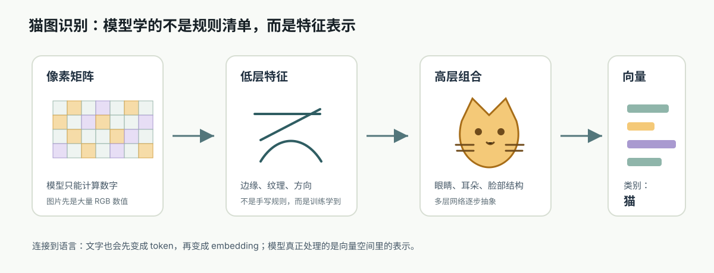
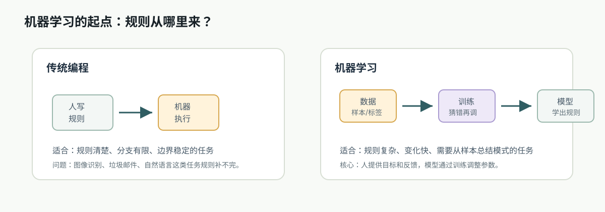
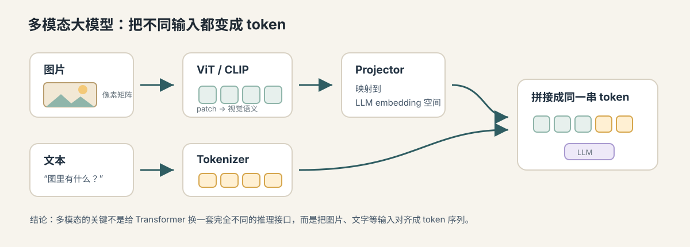

# 07. 从现实世界到向量表示

[返回本章](README.md)



图解导读：先只看猫图特征向量图，抓住“现实对象要先被表示成数字结构，模型才有东西可学”的主线。

## 核心问题

机器怎么处理图片、声音、文字这些现实对象？

前面几节已经讲清楚：模型可以通过前向传播得到预测，通过损失函数发现错误，再用反向传播和梯度下降调整参数；训练表现还必须经过泛化和过拟合的检验。

但这些讨论都默认输入 `x` 已经是模型能计算的数字。现实世界并不是这样。房子、图片、声音、文字都不是模型天然能计算的东西。计算机最终只能处理数字，所以进入模型之前，现实对象必须先被表示成数字结构。

```text
输入 x
→ 模型 f
→ 输出 y
```

这一节要讲的就是：现实对象如何变成特征，特征如何组成向量，为什么“好的表示”会决定模型能学到什么。

## 推导线索

```text
机器只能计算数字
→ 现实对象要先变成特征
→ 多个特征组成向量
→ 向量保留了对象中对任务有用的信息
→ 传统机器学习依赖人工设计特征
→ 深度学习让模型自动学习表示
→ 文字还需要进一步切成 token，再变成 embedding
```

## 1. 为什么必须把现实对象变成数字

人看到一套房子，会自然理解“地段不错、面积大、楼层高、装修新”。但模型不能直接理解这些自然语言。它需要的是可计算的数值，例如：

```text
面积 = 89
楼层 = 12
距离地铁 = 0.8
房龄 = 6
```

这些数值就是特征。多个特征放在一起，就形成一个向量：

```text
x = [89, 12, 0.8, 6]
```

这个向量不是房子本身，而是房子的一个数字化表示。模型学习的不是“房子”这个现实对象，而是这个向量和目标之间的关系，例如：

```text
[面积, 楼层, 距离地铁, 房龄] → 房价
```

不同现实对象需要不同表示方式。下面的表不是标准答案，而是展示“对象、特征、目标”之间要对齐：

| 现实对象 | 可用数字表示 | 可能预测的目标 | 容易丢失的信息 |
| --- | --- | --- | --- |
| 房子 | 面积、楼层、地铁距离、房龄、经纬度 | 房价、租金、成交周期 | 小区口碑、采光感受、临街噪声 |
| 图片 | 像素矩阵、颜色通道、边缘或深层特征 | 类别、物体位置、相似图片 | 拍摄意图、遮挡物背后的内容 |
| 声音 | 波形、频谱、音高、能量变化 | 语音文字、说话人、情绪 | 现场语境、说话人的真实意图 |
| 文本 | token id、embedding、段落结构 | 分类、摘要、问答、生成 | 未写出的背景知识、讽刺语气 |

表格里的最后一列提醒我们：向量化一定是有损的。模型只能利用被保留下来的信息，不能可靠地学习没有进入表示的事实。

这一步很重要，因为它把机器学习从现实世界拉回到数学世界：模型只能在数字空间里寻找规律。

这张图只用来回看前几节的转折：传统程序直接写规则，机器学习要先把对象变成特征，再从数据里学规则。



## 2. 特征不是越多越好

特征的关键不是数量，而是对任务是否有用。

预测房价时，面积、位置、楼层可能很重要；墙面颜色可能没那么重要。判断垃圾邮件时，可疑词、链接数量、发件域名可能有用；邮件正文的某些无关标点可能只是噪声。

如果特征缺失，模型看不到关键信息；如果特征太噪，模型可能学到错误关联。比如训练数据里很多垃圾邮件刚好都来自某个时间段，模型可能误以为“发送时间”就是垃圾邮件的核心规律，但换一个数据分布就失效。

判断特征质量时，可以先问它是否稳定、可获得、和任务有因果或可靠统计关系：

| 特征类型 | 表现 | 对模型的影响 | 工程判断 |
| --- | --- | --- | --- |
| 关键信号 | 与目标稳定相关，预测时也能获得 | 帮助模型学到可迁移规律 | 应优先保留并保证采集质量 |
| 弱信号 | 有一定相关，但单独不够可靠 | 可能在组合中有用 | 结合验证集和消融实验判断 |
| 噪声特征 | 与目标无关或随机波动 | 增加学习难度，可能降低泛化 | 尽量清洗、压缩或移除 |
| 泄漏特征 | 包含真实预测时不可获得的信息 | 离线分数虚高，上线失效 | 必须从训练和评估中剔除 |

所以，特征工程不是把能收集到的字段全部塞进模型，而是控制模型“看见什么”和“不要看见什么”。

这也解释了为什么后面要讲泛化和过拟合：模型不一定学到真正稳定的规律，它也可能学到训练数据里的偶然相关。

## 3. 例子：从猫图到特征向量

图片最开始只是像素矩阵。比如一张 RGB 图片，每个像素有红、绿、蓝三个数值。模型不能直接理解“猫”，只能处理这些数字。

早期方法常依赖人工设计特征，例如边缘、角点、纹理。深度学习的变化是：不再让人手写所有视觉规则，而是让多层神经网络自己从数据里学习特征。

```text
像素
→ 边缘
→ 纹理
→ 局部形状
→ 眼睛、耳朵、脸部结构
→ 猫这个类别
```

这条链路体现了“抽象化”：

- 底层特征更接近原始输入，例如颜色、亮度、边缘。
- 中层特征开始组合局部模式，例如纹理、轮廓、形状。
- 高层特征更接近任务语义，例如猫脸、猫耳朵、动物类别。

模型最后用的不是“猫”这个词，而是一组向量表示。这个向量压缩了模型认为对判断有用的信息。

## 4. 表示学习：让模型自己学特征

传统机器学习里，很多能力依赖人工特征工程。工程师要先决定哪些特征可能有用，再把它们喂给模型。

深度学习的核心变化之一，是让模型自动学习表示。也就是说，模型不仅学习“特征到答案”的映射，还学习“原始输入应该被表示成什么特征”。

可以把它理解成两层问题：

```text
传统机器学习：
人设计特征 → 模型学习规律

深度学习：
模型学习特征 → 模型学习规律
```

两种路线并不是绝对对立，而是在“谁负责构造表示”上分工不同：

| 路线 | 表示从哪里来 | 适合场景 | 风险 |
| --- | --- | --- | --- |
| 人工特征工程 | 人根据领域知识设计字段和规则 | 表格数据、规则清晰、样本较少的业务问题 | 依赖专家经验，难覆盖复杂模式 |
| 表示学习 | 模型从原始或半原始数据中学习中间表示 | 图像、语音、文本等高维复杂输入 | 需要更多数据和算力，可解释性较弱 |
| 混合方式 | 人提供结构化输入，模型继续学习表示 | RAG、推荐、风控、多模态系统 | 输入组织不当会放大噪声或泄漏 |

在大模型工程里，Prompt、检索结果和工具返回也属于“表示设计”。它们虽然是文本，但本质上仍是在决定模型接下来能利用哪些信息。

这就是为什么深度学习在图像、语音、文本上都很重要。现实对象太复杂，人很难手写完所有特征；多层网络可以在训练中逐步形成对任务有用的表示。

## 5. 为什么文字比图片更麻烦

图片天然就是数字矩阵，虽然维度很高，但每个像素本身就是数值。这里不要误解成“图片比文本已经被理解了”：像素只是低层数字，模型仍然要从中学习边缘、纹理、形状、部件和语义类别。文字不一样。文字是离散符号：

```text
猫
cat
ChatGPT
function
}
```

这些符号不能直接做加减乘除。即使给每个词编号，也会遇到问题：

```text
猫 = 17
狗 = 18
汽车 = 19
```

这个编号只表示身份，不表示语义。编号 17 和 18 很接近，并不代表“猫”和“狗”在语义上一定接近；编号 19 更大，也不代表“汽车”比“狗”更高级。

所以文字需要更特殊的表示过程：

这张图只用来看下一节的入口：文本要先切成 token，再通过 token id 查到 embedding。


```text
文本
→ token
→ token id
→ embedding 向量
```

这就是下一节要讲的内容。`token` 解决“文字怎么切分”，`embedding` 解决“离散符号怎么变成有语义结构的向量”。

## 6. 工程意义：表示决定模型能看到什么

模型只能学习输入表示里存在的信息。表示方式会直接影响工程效果。

如果做房价预测，没有把地理位置放进特征，模型很难学到地段影响。如果做图片识别，图片被压得太小，细节丢失，模型可能看不到关键特征。如果做大模型应用，把关键文档截断在上下文之外，模型就无法基于那部分信息回答。

这和后面的 Prompt、RAG、长上下文、工具调用都有关系：

- Prompt 是把任务、约束和示例表示成模型能看到的 token。
- RAG 是把外部知识检索出来，再表示成上下文。
- 工具结果要被组织成清晰文本或结构化数据，模型才容易利用。
- 长上下文不是越长越好，关键是信息如何被表示、排序和压缩。

这张图只用来看多模态的同一条原则：图片也要先编码成模型可处理的 token 或向量，再进入统一上下文。



工程上不要只问“模型强不强”，还要问：

```text
模型需要的信息有没有进入输入？
这些信息是否被表示成模型容易利用的形式？
无关噪声是否干扰了关键特征？
```

## 常见误区

特征向量不是现实对象本身，而是对现实对象的有损表示。任何表示都会保留一部分信息，也丢掉一部分信息。

这带来两个边界：

- 向量里没有的信息，模型无法凭空可靠恢复。
- 向量里带有偏差或噪声，模型可能学到错误模式。

大模型也是这样。它看起来在理解语言，但底层仍然是在处理 token embedding 和上下文表示。理解这一点，后面才容易理解为什么上下文、检索结果、工具返回和格式设计会强烈影响模型输出。

## 本节小结

- 特征是什么。
- 向量是什么。
- 为什么图片天然适合变成矩阵。
- 为什么表示不是现实对象本身，而是有损压缩。
- 为什么文字比图片更麻烦。
- 表示学习解决的是什么问题。
- 表示方式为什么会影响大模型工程效果。

## 连接到下一节

图片的像素本身就是数字，但文字是离散符号。接下来要解决：词、字或 token 怎么变成模型能计算的向量。
