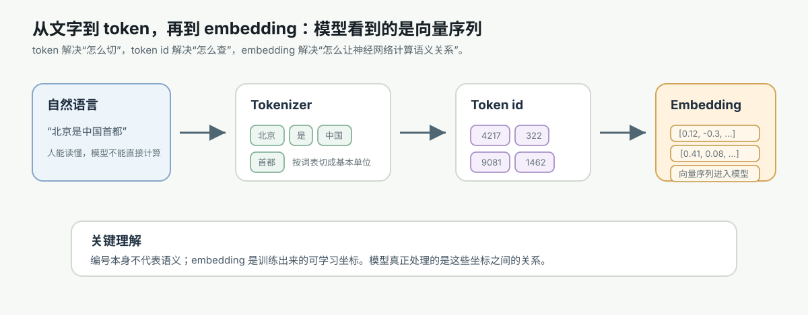

# 08. 从文字到 token 和 embedding

[返回本章](README.md)



图解导读：token 和 embedding 是语言进入大模型的入口，后面会接到 next-token 预测、Transformer 计算和上下文装配。

## 核心问题

一句话为什么不能直接输入大模型？它是怎样一步步变成模型可以计算、训练和预测的东西的？

这一节的目标不是背下 token、tokenizer、embedding 这些术语，而是看清一条因果链：

```text
人读的是文字
→ 机器只能计算数字
→ 简单编号能表示身份，但不能表示语义关系
→ one-hot 避免了编号大小的误导，但太稀疏、不能表达相似性
→ tokenizer 把文本切成模型词表里的基本单位
→ token id 查表得到 embedding
→ embedding 在训练中被不断调整，逐渐形成有用的向量空间
→ 模型基于这些向量预测下一个 token
```

第一次读，本节先带走三件事：

- 模型看到的不是文字，而是 token id 查表得到的向量序列。
- token id 只是索引，embedding 才是可训练的连续表示。
- token 数会影响上下文窗口、成本、截断和后续 RAG / Agent 的输入组织。

## 先抓住直觉：模型看到的不是文字，而是坐标

人看到“北京是中国的首都”，会直接联想到地点、国家、首都关系和事实判断。模型不能直接处理这些人类意义。计算机底层能稳定处理的是数字、矩阵和向量运算。

所以文本进入大模型前，必须先完成两次转换：

```text
文字序列
→ token 序列
→ 向量序列
```

例如：

```text
原始文本：北京是中国的首都
token：  ["北京", "是", "中国", "的", "首都"]
token id：[15320, 210, 9876, 45, 23101]
embedding：
[
  [0.12, -0.31, ..., 0.08],
  [0.04,  0.27, ..., -0.19],
  ...
]
```

可以把这条链路拆成三层看：token 负责切分，token id 负责索引，embedding 负责变成可计算的连续向量。

| 层级 | 示例 | 它表达什么 | 它不表达什么 |
| --- | --- | --- | --- |
| token | `"北京"`、`"是"`、`"首都"` | 文本被切成词表里的片段 | 不直接提供向量运算能力 |
| token id | `15320`、`210`、`23101` | 片段在词表中的索引位置 | id 大小本身没有语义距离 |
| embedding | `[0.12, -0.31, ..., 0.08]` | 训练得到的连续坐标，可进入神经网络 | 不是人工词典，也不保证事实正确 |

因此，看到 token id 时要把它理解成“查表用的键”，而不是可以直接比较大小的语义数值。

这里的数字只是示意。真正重要的是：模型后续的 Attention、前馈网络、logits 和概率分布，全部都建立在这些向量上，而不是直接建立在人类可读的汉字或单词上。

## 文字为什么不能直接进模型

### 直觉层

文字像标签，数字像坐标。标签能让人识别，坐标才能让机器计算距离、方向、加权和变化。

“猫”和“狗”对人来说很接近，“猫”和“微积分”比较远。但如果模型只看到三个字符串：

```text
猫
狗
微积分
```

它没有天然办法知道前两个更相近。字符串本身只是符号，不自带可计算的语义距离。

### 机制层

神经网络的基本操作是矩阵乘法、加法、非线性变换和归一化。它需要输入形如：

```text
x = [x1, x2, x3, ..., xd]
```

而不是输入一个不可直接相乘的字符对象。文本必须被编码成固定结构的数字表示，才能进入网络层。

### 形式层

一个 Transformer 层大致会处理矩阵：

```text
X ∈ R^(n × d)
```

其中：

- `n` 是序列长度，也就是 token 数。
- `d` 是每个 token 的向量维度。
- `X` 的每一行是一个 token 的向量表示。

如果文本还停留在原始字符或字符串状态，就无法形成这个矩阵，也就无法进行后续的 Attention 计算。

### 工程层

这件事直接影响三个工程判断：

- 你传给模型的不是“字数”，而是 token 数。上下文窗口、费用和截断都按 token 计。
- 不同模型的 tokenizer 不一样，同一句话在不同模型里可能切出不同 token 数。
- Prompt、RAG 文档切分、日志压缩和长文本摘要，都必须考虑 token 预算，而不能只看字符数或单词数。

## 最朴素的办法：给每个词或字编号

### 它从哪里来

既然模型需要数字，一个自然想法是：给每个词、字或符号分配一个编号。

```text
猫 → 1
狗 → 2
微积分 → 3
北京 → 4
```

这样文本就能变成数字序列：

```text
猫 喜欢 鱼 → [1, 18, 72]
```

### 它是什么

编号是符号身份的索引。它回答的是“这是词表里的哪一个项目”，而不是“这个词是什么意思”。

### 它怎么工作

系统维护一个词表 vocabulary：

```text
id  token
1   猫
2   狗
3   微积分
4   北京
```

tokenizer 找到文本片段对应的 token，再把 token 映射成 id。

### 它解决什么

编号至少解决了“文字无法变成数字”的第一步问题。模型可以存储、传输和查找这些离散符号。

### 它解决不了什么

编号有一个危险误导：数字大小会暗示不存在的关系。

如果：

```text
猫 = 1
狗 = 2
微积分 = 3
```

从数字上看，狗离猫比微积分离猫更近。但这只是编号碰巧如此，不是语义规律。换一种编号：

```text
猫 = 8001
狗 = 17
微积分 = 8002
```

数字距离又会暗示猫和微积分更近。这个结论显然不可靠。

所以 token id 不能直接当成语义数值输入模型。它更像数据库主键：可以定位对象，但主键大小本身没有业务含义。

## one-hot 为什么不够

### 直觉层

为了避免编号大小带来的误导，可以用 one-hot 表示身份。

如果词表有 5 个 token：

```text
猫     → [1, 0, 0, 0, 0]
狗     → [0, 1, 0, 0, 0]
微积分 → [0, 0, 1, 0, 0]
北京   → [0, 0, 0, 1, 0]
首都   → [0, 0, 0, 0, 1]
```

one-hot 的意思是：只在自己的位置上点亮，其余位置全是 0。

### 机制层

one-hot 把“身份”表达得很干净。每个 token 都有一个独立维度，因此不会把 `id=1` 和 `id=2` 误解成数值接近。

### 形式层

如果词表大小是 `V`，one-hot 向量就是：

```text
e_i ∈ R^V
```

第 `i` 个位置是 1，其余位置是 0。

两个不同 token 的 one-hot 向量点积为 0：

```text
e_i · e_j = 0, i ≠ j
```

这表示它们在这个空间里彼此正交。问题也在这里：所有不同 token 都一样“不相似”。

### 工程层

one-hot 有三个严重问题：

- 太大：现代模型词表可能有几万到十几万个 token。每个 token 都用这么长的向量，绝大多数位置还是 0，存储和计算都浪费。
- 太硬：它只能表达“是不是同一个 token”，不能表达“猫”和“狗”比“猫”和“微积分”更接近。
- 不能泛化：训练中学到“猫喜欢吃鱼”，并不会自然帮助模型理解“狗喜欢吃肉”这类相似结构。

one-hot 是一个很好的过渡概念：它说明模型需要表示 token 身份，但也暴露出“身份不等于意义”。

## tokenizer 为什么会出现

### 它从哪里来

如果按字切，中文还勉强可行，但英文、代码、数字、表情、标点和多语言文本会很麻烦。如果按词切，又会遇到更多问题：

- 新词、拼写变化和专有名词几乎无限多。
- 英文有 `run`、`running`、`runner` 等形态变化。
- 代码里有 `getUserProfileById`、`user_id`、`HTTPResponse` 这类组合。
- 中文没有天然空格分词边界。
- 罕见词如果都进词表，词表会膨胀；如果不进词表，模型又无法表示。

tokenizer 就是在“字符太碎”和“词太粗”之间寻找工程折中。

### 它是什么

tokenizer 是把原始文本切分成模型词表中 token 的规则或算法。

token 是模型处理文本的最小离散单位，但它不等于人类语言里的“词”。token 可能是：

- 一个汉字：`的`
- 一个词：`北京`
- 一个词的一部分：`ing`
- 一个空格加单词：` hello`
- 一个标点：`,`
- 一段代码片段：`_id`
- 一个罕见字符或字节片段

不同切分会改变序列长度和信息边界。下面的表用工程视角说明切分方式为什么会影响模型使用体验：

| 切分情况 | 例子 | 直接影响 | 工程风险 |
| --- | --- | --- | --- |
| 常见词被合成一个 token | `北京` | token 数少，表示稳定 | 对罕见新词不一定适用 |
| 罕见词被拆成多个 token | `un` + `believe` + `able` | 序列变长，但仍能表示未知组合 | 长词、专有名词会消耗更多上下文 |
| 代码标识符被拆开 | `get` + `User` + `Profile` | 模型能复用子片段模式 | 截断时可能破坏变量名或结构 |
| JSON 或代码被中途截断 | `{ "id": 1, "name"` | 语法结构不完整 | 工具调用、解析和生成更容易失败 |

所以 tokenizer 不是纯理论细节。它会影响上下文窗口、费用、截断位置和模型是否容易利用输入结构。

### 它怎么工作

常见 tokenizer 会从大量语料中学习高频片段，把常见组合保留下来，把罕见内容拆成更小单位。直觉上，它会倾向于这样做：

```text
常见片段：直接作为一个 token
罕见片段：拆成多个 token
未知字符：退回到更小的字符或字节单位
```

例如英文单词 `unbelievable` 可能不是一个完整 token，而可能被拆成：

```text
un + believable
```

或者：

```text
un + believe + able
```

具体结果取决于模型使用的 tokenizer 和词表。

### 它解决什么

tokenizer 解决的是“如何让开放文本落进有限词表”的问题。它让模型能处理没见过的名字、代码变量、拼写变体和多语言混合文本，而不必为每个完整词都准备一个独立词表项。

### 它解决不了什么

tokenizer 不理解文本。它只是按词表和切分规则做编码。

常见误解是：“token 就是词。”这不对。token 是模型词表里的片段单位，它和语言学里的词经常重合，但没有必然关系。一个词可能被切成多个 token，一个 token 也可能包含空格、标点或词的一部分。

### 工程层

tokenizer 会影响很多真实开发决策：

- 中文、英文、代码的 token 密度不同，同样字符长度的内容费用可能不同。
- RAG 切块不能只按字符数切，否则可能超出模型 token 上限。
- 截断可能截掉半个结构，例如 JSON 后半段、代码函数尾部或引用来源。
- Prompt 模板里的重复说明会持续消耗 token 预算。
- 选择模型时，不能只看“支持多少字”，要看上下文窗口是多少 token，以及该 tokenizer 对你的数据是否高效。

## embedding：把 token 放进连续向量空间

### 直觉层

embedding 可以理解成给每个 token 分配一个可学习的坐标。这个坐标不是人工填写的词典释义，而是在训练任务中慢慢调整出来的。

如果训练数据里经常出现：

```text
猫 会 喵喵叫
狗 会 汪汪叫
猫 和 狗 都 是 动物
```

模型为了更好预测下一个 token，会逐渐把“猫”和“狗”的表示调整到某些相似方向上。它们不需要完全相同，但会共享一些和动物、行为、常见上下文有关的特征。

### 机制层

模型内部有一个 embedding matrix，可以把 token id 映射成向量。

```text
token id
→ 查 embedding 表
→ 得到 d 维向量
```

如果词表大小是 `V`，embedding 维度是 `d`，那么 embedding matrix 是：

```text
E ∈ R^(V × d)
```

第 `i` 个 token 的向量就是：

```text
x_i = E[i]
```

这一步像查字典，但查出来的不是文字解释，而是一串可训练参数。

### 形式层

对于 token 序列：

```text
t = [t1, t2, ..., tn]
```

输入向量序列可以写成：

```text
X = [E[t1], E[t2], ..., E[tn]]
X ∈ R^(n × d)
```

随后 Transformer 会在 `X` 上叠加位置表示、Attention 和前馈网络，得到上下文化后的表示，再输出下一个 token 的概率分布。

这张图可以放在这里回看：本节前半段解释 token 和 embedding，后半段会把它们接到 Transformer 的上下文计算里。


### 工程层

embedding 影响的是“模型能不能把离散符号变成可泛化的连续表示”。它不是可随意替换的小细节，而是整个语言模型的入口。

在工程上要区分两种常见 embedding：

- 模型内部的 token embedding：用于把输入 token 喂给语言模型，是训练模型的一部分。
- 检索系统里的 text embedding：用于把一段文本编码成向量，做相似度搜索、聚类或推荐，常见于 RAG。

这两者都叫 embedding，但用途不同。前者服务于 next-token prediction，后者服务于文本相似度检索。

如果想看这一层如何落到代码，可以先看源码实现里的 [token id 如何查出 embedding 向量矩阵](../07-source-implementation/llm-from-zero/01-token-embedding-matrix.md)。那里用小词表演示 `one_hot_matrix @ embedding_table` 和直接查表 `E[token_ids]` 为什么等价。

## embedding 是怎么从训练中学出来的

### 它从哪里来

embedding 不是工程师手工规定“猫的第 3 维表示动物，第 8 维表示可爱”。它来自训练目标。

语言模型的训练目标是：给定前面的 token，预测下一个 token。

```text
北京 是 中国 的 → 首都
```

如果模型预测错了，就会产生损失。反向传播会把误差信号传回所有相关参数，包括 embedding matrix。

### 它怎么工作

训练循环可以简化成：

```text
1. tokenizer 把文本变成 token id
2. token id 查表得到 embedding
3. Transformer 根据上下文计算隐藏表示
4. 输出层给每个候选 token 一个分数 logits
5. softmax 把 logits 变成概率分布
6. 用真实下一个 token 计算损失
7. 反向传播更新参数，包括 embedding
```

embedding 的来源可以从训练链路里拆开看。它不是先验写好的语义表，而是在大量预测错误和梯度更新中被塑造出来的：

| 来源或信号 | 对 embedding 的作用 | 直觉例子 | 边界 |
| --- | --- | --- | --- |
| 初始随机参数 | 给每个 token 一个起点 | 训练刚开始时，“猫”和“狗”未必接近 | 初始值本身没有可靠语义 |
| 共现上下文 | 让相似语境中的 token 收到相近更新 | “猫”“狗”常和“动物”“叫声”一起出现 | 共现可能包含偏见和噪声 |
| 预测损失 | 告诉模型哪些表示有助于预测下一个 token | “北京 是 中国 的”后面应提高“首都”的概率 | 预测好不等于事实永远正确 |
| 反向传播 | 把误差信号传回 embedding matrix | 错误越影响损失，相关向量越会被调整 | 低频 token 更新少，表示可能较弱 |

这张表也解释了为什么训练数据质量会影响表示质量。embedding 学到的是数据和目标共同塑造的统计结构，而不是独立于训练过程的纯粹概念。

如果“猫”和“狗”经常出现在相似上下文里，它们在训练中会收到相似方向的梯度更新。长期下来，它们的向量会在某些维度和方向上变得更接近。

### 形式层

next-token prediction 的训练目标可以简化写成：

```text
最大化 P(t_k | t_1, t_2, ..., t_(k-1))
```

或最小化负对数损失：

```text
L = -log P(真实下一个 token | 前面的 tokens)
```

embedding 的学习不是单独发生的，而是在最小化这个损失的过程中和模型其他参数一起被更新。

### 它解决什么

embedding 让模型不再只知道“这是哪个 token”，而能学习“这个 token 在大量上下文中通常怎样发挥作用”。这给泛化提供了基础。

如果模型见过很多类似结构：

```text
巴黎 是 法国 的 首都
东京 是 日本 的 首都
```

它更容易学习到：

```text
北京 是 中国 的 → 首都
```

这不是因为 embedding 单独存储了所有事实，而是因为 embedding、Attention 和训练目标共同塑造了可利用的统计结构。

### 它解决不了什么

embedding 不是人类概念本身，也不是可靠知识库。它有几个边界：

- 它表达的是训练任务中有用的统计关系，不保证等于真实世界关系。
- 单个 token 的初始 embedding 还没有完整上下文含义。
- 罕见 token、混乱切分和低质量训练数据会影响表示质量。
- embedding 相近不等于两个词在任何语境下都可互换。

例如“苹果”在不同上下文里可以是水果，也可以是公司。单靠一个静态 token embedding 不能彻底解决歧义，后续的上下文化表示才会根据句子环境调整含义。

## 向量空间如何表达相似性

### 直觉层

在向量空间里，相似性不是靠字面是否相同，而是靠方向和位置关系。

可以把每个 token 想象成高维空间里的一个点：

```text
猫、狗、兔子 可能在动物相关区域更近
北京、东京、巴黎 可能在城市和首都相关方向上更接近
if、else、return 可能在代码语法相关区域更接近
```

真实模型的维度可能是几千甚至更多，人不能直接画出来，但可以用二维地图做直觉类比。

### 机制层

向量相似性通常用点积或余弦相似度衡量。余弦相似度关注两个向量方向是否接近：

```text
cos(a, b) = (a · b) / (||a|| ||b||)
```

方向越接近，值越大。模型内部并不一定显式把每个判断都解释成“余弦相似度”，但点积、加权求和和矩阵乘法让方向关系可以参与计算。

### 形式层

如果两个 token 的表示分别是：

```text
x_cat ∈ R^d
x_dog ∈ R^d
```

它们在训练中可以学到某些相似方向：

```text
cos(x_cat, x_dog) > cos(x_cat, x_calculus)
```

这表达的是“在模型学到的表示空间里，猫和狗更相似”。它不是词典定义，而是训练数据和训练目标共同塑造出的几何关系。

### 工程层

向量空间的相似性解释了为什么 embedding 能用于检索和聚类，也解释了 RAG 的基本直觉：把问题和文档都放进向量空间，找方向接近的文本片段。

但工程上不能把“向量相似”当成“答案正确”。相似度检索只能找候选上下文，不能保证候选文本真实、完整、最新或足以回答问题。后续还需要重排、引用、验证和模型生成。

## 上下文含义：同一个 token 在不同句子里会变

### 直觉层

“苹果发布了新手机”和“苹果削皮后很甜”里的“苹果”不是同一个意思。输入层的 token embedding 可能相同，但经过上下文计算后，它们的表示会变得不同。

### 机制层

token embedding 是进入模型前的初始坐标。Transformer 的 Attention 会让每个 token 看见上下文中的其他 token，然后生成上下文化表示。

```text
初始 embedding：苹果
上下文 A：发布、新手机、公司
→ 更偏向科技公司含义

上下文 B：削皮、很甜、水果
→ 更偏向水果含义
```

### 形式层

可以把过程简化为：

```text
X0 = token embeddings + position embeddings
X1 = TransformerBlock1(X0)
X2 = TransformerBlock2(X1)
...
XL = TransformerBlockL(X_(L-1))
```

`X0` 是初始 token 表示，`XL` 是经过多层上下文交互后的表示。模型最后用这些上下文化表示预测下一个 token。

### 工程层

这解释了为什么 Prompt 上下文很重要。模型不是只看某个词本身，而是在上下文里解释它。

同一个问题，加上不同系统指令、示例、检索片段或历史对话，都会改变 token 的上下文化表示，进而改变下一个 token 的概率分布。

## token 对上下文窗口、成本和截断的影响

进入工程系统后，token 不只影响模型能不能读懂文本，也影响上下文装配、检索结果放入方式、历史对话保留方式和成本控制。第 14 节会系统展开 context window、prefill、decode 和推理成本；本节只保留和 token 直接相关的判断。


这张图只用来看 token 预算在一次真实请求里的位置：系统指令、历史消息、RAG 文档、工具结果和用户输入都会挤进同一个上下文窗口。

token 预算会影响：

- Prompt 模板要短而明确，避免无意义重复。
- RAG 切块要按 token 估算，并保留段落边界和引用信息。
- 长对话要做摘要、状态抽取或关键事实记忆。
- 工具返回结果要结构化压缩，而不是原样塞入所有日志。
- 需要设置 `max output tokens`，避免输出挤占预算或提前停止。
- 对需要完整上下文的任务，要选择足够长上下文窗口的模型。

这里的关键不是“窗口越大越好”，而是相关 token 是否被清晰、完整、低噪声地放进窗口。超过窗口的内容必须被截断、压缩、检索替换或分批处理；没有进入上下文的内容，模型不能在这次推理中可靠使用。

## 常见误区

先把几个容易混在一起的“向量”放在同一张表里：

| 名称 | 它表示什么 | 是否随上下文变化 | 常见用途 |
| --- | --- | --- | --- |
| token id | 词表里的离散编号 | 不变 | 查 embedding 表 |
| token embedding | 单个 token 的初始向量 | 通常不随句子变化 | 送入 Transformer |
| 上下文化表示 | token 在当前句子里的状态 | 会变 | 预测下一个 token |
| text embedding | 一段文本的检索向量 | 随整段文本变化 | RAG、相似度搜索、聚类 |

这张表的重点是：RAG 里常说的 text embedding，不等于语言模型输入层的 token embedding；经过 Transformer 之后的上下文化表示，也不再只是某个 token 的固定“词义坐标”。

### 误解一：token 就是词

token 不是词。它是 tokenizer 词表里的片段单位。一个词可能对应多个 token，一个 token 也可能包含空格、标点、词缀或代码片段。

### 误解二：token id 越接近，语义越接近

token id 是索引，不是语义坐标。语义关系主要体现在 embedding 和后续上下文化表示里。

### 误解三：one-hot 已经能表达语义

one-hot 只能表达身份。它能告诉模型“这是第几个 token”，但不能告诉模型“它和哪些 token 相似”。

### 误解四：embedding 是人工设计的词义表

embedding 是训练出来的参数。它被 next-token prediction 的损失函数不断塑造，而不是工程师手工写出来的概念表。

### 误解五：向量相似就等于事实正确

向量相似只说明表示空间里接近，不保证事实真实、结论可靠或答案完整。RAG 和问答系统仍然需要来源、约束和验证。

### 误解六：上下文窗口大就一定更好

长上下文能放更多内容，但也带来成本、延迟和信息干扰。工程上要关注“相关 token 是否被清晰放入上下文”，而不是单纯堆更多文本。

## 回到主线：从 token 到 next-token prediction

现在可以把整条链路连起来：

```text
原始文本
→ tokenizer 切成 token
→ token 映射成 token id
→ token id 查 embedding matrix
→ 得到向量序列
→ Transformer 结合位置和上下文计算表示
→ 输出下一个 token 的概率分布
```

这说明 token 和 embedding 不是孤立概念。它们是语言模型能做 next-token prediction 的输入基础。

到这里，输入端已经准备好。下一张图就是后续章节的核心循环：模型不断基于当前 token 上下文预测下一个 token。


模型并不是先“理解整句话”再生成答案，而是在每一步都根据当前上下文中的 token 向量，计算下一个 token 的概率分布。预测得越好，模型就越需要在参数中吸收语言结构、世界知识、任务模式和上下文关系。

## 本节小结

- 文字不能直接进模型，因为神经网络处理的是数字向量和矩阵。
- 编号能表示 token 身份，但编号大小没有语义意义。
- one-hot 避免了编号大小误导，但稀疏、昂贵，且无法表达相似性。
- tokenizer 把开放文本切成有限词表里的 token，token 不等于词。
- embedding 是 token 的可学习向量表示，来自训练过程中的梯度更新。
- 向量空间用方向和位置关系表达相似性，但相似不等于事实正确。
- 初始 token embedding 会被上下文改造，形成更具体的上下文化含义。
- token 数决定上下文窗口、成本、延迟和截断风险，是 Prompt、RAG 和 Agent 工程的基础约束。

## 连接到下一节

文字已经能变成向量了。接下来要问：模型到底要用这些向量完成什么任务？语言模型的答案是预测下一个 token。

下一节会继续解释：为什么一个看似简单的目标 `P(下一个 token | 前面的 tokens)`，会成为现代大模型训练和生成的核心。
