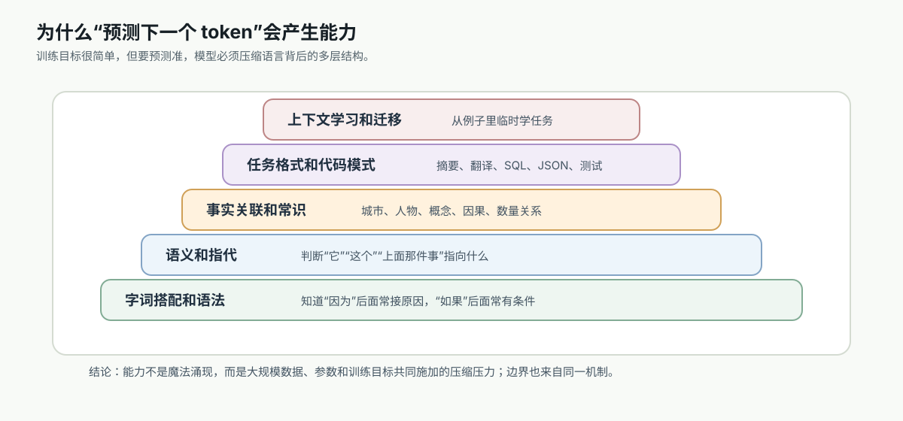

# 10. 为什么预测下一个 token 会产生能力

[返回本章](README.md)



图解导读：能力来自预测压力、规模训练和上下文生成，但边界也来自同一个概率生成机制。

## 核心问题

只是续写文本，为什么会出现理解、知识和推理？

上一节讲了 next-token prediction 的机制：模型根据上下文输出下一个 token 的概率分布，再通过自回归循环生成完整文本。

这一节要回答更关键的问题：如果训练目标只是“预测下一个 token”，为什么模型后来能翻译、总结、写代码、抽取信息、遵循格式，甚至在上下文中学会新任务？

这里说的“产生能力”，指模型在参数和上下文表示里学到可迁移的语言结构、事实关联和任务模式；它不等于在具体业务中稳定、可验证、可负责地完成任务。后者还需要 Prompt、RAG、工具、评测、权限和状态系统补齐。

本章说“理解”时，也采用工程含义：模型能利用上下文和模式完成任务。它不指人类意识、主观体验或对事实的最终责任。

核心答案是：

> 下一个 token 看似局部，想预测准却必须压缩大量全局结构。

语言不是随机字符流。一个 token 是否合理，背后受语法、语义、事实、语境、风格、任务格式、代码规则和交互意图共同约束。训练任务越大、数据越广、模型容量越强，模型为了降低预测损失，就越被迫学习这些结构。

## 推导线索

```text
要预测好下一个 token
→ 必须学会语法和搭配
→ 必须理解上下文里的指代和关系
→ 必须记住大量事实和常见模式
→ 必须学会不同任务的文本格式
→ 数据、参数和训练规模扩大后，能力逐步增强
```

## 本节目标

- 语言能力从哪里来
- 知识为什么会被压进参数
- in-context learning 是什么
- 为什么规模变大会出现更强泛化
- 为什么模型仍然会幻觉
- 为什么预测压力会逼迫模型学习格式和任务模式
- 这种能力如何连接到 Attention

第一次读，本节先带走三件事：

- “预测下一个 token”看似局部，但要预测准就必须压缩语法、事实、格式和上下文关系。
- 这里的“理解”是工程意义上的可用模式能力，不是人类意识，也不保证事实可靠。
- 能力来源和产品可靠性不是一回事，真实应用仍要靠 RAG、工具、权限、状态和评测补齐。

## 1. 从哪里来：预测压力不是背答案，而是压缩规律

### 直觉层

看下面这句话：

```text
因为外面下雨了，所以我出门前带上了 ____
```

要预测下一个词，模型只靠最近一个词“了”几乎没用。它需要知道：

- “下雨”通常和“伞”有关。
- “出门前带上”后面常接某个物品。
- 句子的因果关系是“下雨 -> 带伞”。
- “雨衣”“雨伞”也可能合理，但“键盘”概率低。

所以，预测一个 token 表面上是局部任务，本质上会逼迫模型学习上下文中的关系。

### 机制层

训练时，模型会不断遇到这样的样本：

```text
前文: 因为外面下雨了，所以我出门前带上了
目标: 伞
```

如果模型预测“手机”“电脑”“红绿灯”，损失就会变大。为了降低损失，它必须调整参数，让与“下雨、出门、带上”相关的 token 获得更高概率。

当这种训练在海量文本上重复发生，模型就会逐步形成很多内部规律：

- 哪些词能搭配。
- 哪些句法结构常见。
- 哪些概念有因果、属性、类别或时序关系。
- 哪些任务通常用什么输出格式。
- 哪些上下文模式暗示用户希望得到什么。

这些规律不一定以人能直接读懂的规则形式存在，而是分布在大量参数和中间表示里。

### 形式层

训练目标仍然是最小化预测损失：

```text
loss = -log P(x(t+1) | x1, x2, ..., xt)
```

整个语料上的训练目标可以写成：

```text
minimize Σ_t -log P(x(t+1) | x1, ..., xt)
```

如果模型只记住少量表面搭配，在简单句子上可能有效，但在复杂语境中会失败。要让总损失持续下降，模型需要学到更可迁移的结构。

这就是能力出现的基础：能力不是单独写进模型的模块，而是在大规模预测任务中，为了减少错误，被参数化地压缩进模型。

### 工程层

这会改变我们对大模型的工程定位：

- 大模型不是手写规则系统，但能表现出规则感。
- 大模型不是传统知识库，但能压缩大量常见事实关联。
- 大模型不是任务专用程序，但能从任务文本中模仿和迁移任务模式。
- 大模型不是可靠验证器，所以需要外部测试、工具和约束系统补上确定性。

可以把“预测压力”和“外显能力”的关系先整理成一张表。它强调的是同一个训练目标在不同文本分布上产生的不同压力，而不是模型内部有一组手写能力模块。

| 预测时遇到的压力 | 模型被迫压缩的结构 | 外显出来的能力 | 工程上要记住的边界 |
| --- | --- | --- | --- |
| 下一个词要合语法 | 词性、搭配、句法边界 | 写出通顺句子、补全代码 | 通顺不等于正确 |
| 下一个词要合事实语境 | 实体、属性、关系、常识共现 | 常识问答、解释概念 | 事实可能过时或混淆 |
| 下一个词要合任务格式 | 指令、示例、输入输出模板 | 翻译、总结、JSON 抽取 | 格式仍需 schema 校验 |
| 下一个词要合长距离关系 | 指代、引用、变量作用域 | 读上下文、跨段整合 | 信息在窗口内不等于一定会用 |
| 下一个词要合交互意图 | 对话角色、请求类型、风格约束 | 指令跟随、改写和协作 | 复杂任务仍需分解和验证 |

后面的几节会分别展开这些能力来源，以及每种能力为什么都有边界。

## 2. 语法能力：为什么模型能写出通顺句子

### 直觉层

如果看到：

```text
这个问题非常 ____
```

合理续写可能是：

```text
重要
复杂
清楚
```

不太合理的是：

```text
跑步
因为
一个
```

模型要预测好下一个 token，就必须知道词性、搭配、短语结构和句子边界。

### 机制层

语法能力来自大量局部和长距离约束的叠加。

例如：

```text
如果你已经完成了测试，请把结果发给 ____
```

这里后面大概率是“我”“团队”“负责人”这类宾语。模型要知道：

- “发给”后面通常接对象。
- “请”引导的是请求。
- “测试结果”是被发送的内容。

在代码中也类似：

```text
if (user.isAdmin) {
  return
```

后面可能是 `true`、某个组件、某个权限结果，而不是随意字符。代码语法比自然语言更严格，因此 next-token prediction 也会迫使模型学习括号、缩进、关键字、作用域和常见 API 调用模式。

### 形式层

从概率角度看，语法规则会让某些 token 的条件概率接近零，让另一些 token 的概率显著升高：

```text
P("重要" | "这个问题非常") 高
P("因为" | "这个问题非常") 低
```

模型没有显式保存一棵传统语法树，但它的中间表示会编码足够多的句法信息，使得输出分布符合语言结构。

### 工程层

这解释了模型为什么适合：

- 改写和润色文本。
- 补全代码和配置。
- 把非结构化描述转成结构化草稿。
- 根据已有风格继续生成。

但也要注意：语法正确不等于事实正确，也不等于业务逻辑正确。模型能写出“看起来正确”的 SQL、代码和政策说明，但仍可能有隐藏错误。

## 3. 事实关联：知识为什么会被压进参数

### 直觉层

如果训练语料里大量出现：

```text
巴黎是法国的首都
法国首都是巴黎
Paris is the capital of France
```

模型在看到：

```text
法国的首都是
```

时，就会给“巴黎”很高概率。

这看起来像知识问答，但机制上仍然是条件概率。

### 机制层

事实通常不是孤立出现的，而是以许多语言形式反复出现：

```text
乔布斯创立了苹果公司
Apple was co-founded by Steve Jobs
苹果公司的联合创始人包括乔布斯
```

模型在训练中见到这些共现模式，会把实体、属性和关系压缩进参数：

- 实体：乔布斯、苹果公司。
- 关系：创立、联合创始人。
- 属性：公司、人物、时间、地点。
- 多语言映射：Steve Jobs 与乔布斯相关。

这种压缩不是数据库记录，而是分布式表示。一个事实可能分散在很多参数和表示方向中，并且和相似事实共享结构。

### 形式层

事实关联体现在条件概率中：

```text
P("巴黎" | "法国的首都是") 高
P("柏林" | "法国的首都是") 低
```

但如果上下文发生变化：

```text
请写一个错误示例：法国的首都是 ____
```

合理 token 可能变成“柏林”或其他错误答案，因为任务语境改变了条件概率。

所以模型不是简单映射：

```text
法国 -> 巴黎
```

而是：

```text
P(next_token | 全部上下文, 模型参数)
```

### 工程层

事实关联能力让模型适合做常识性解释和候选生成，但不适合单独承担事实真值：

- 模型可能知道训练时常见事实，但不知道训练后发生的变化。
- 模型可能混淆相似实体。
- 模型可能在缺少证据时生成听起来合理的答案。
- 模型不能天然提供可靠来源。

所以事实型应用通常要接 RAG、搜索、数据库或业务 API。模型负责理解问题和组织答案，事实来源由外部系统提供。

从工程边界看，能力失败常常不是单一“幻觉”问题，而是事实、实时性、私有知识、上下文、执行、权限、成本和责任边界共同作用。


## 4. 格式和任务模式：为什么模型能翻译、总结、写 JSON

### 直觉层

很多任务本质上都是文本模式。

翻译语料常长这样：

```text
中文：我喜欢机器学习。
英文：I like machine learning.
```

总结语料常长这样：

```text
文章：...
摘要：...
```

结构化抽取常长这样：

```text
输入：张三，电话 138...
输出：{"name": "张三", "phone": "138..."}
```

当模型见过足够多类似模式，它会学到“这种输入后面应该生成那种输出”。

### 机制层

任务能力不是只来自事实记忆，而来自模式迁移：

- 翻译：学习两种语言表达之间的对应关系。
- 总结：学习从长文本中保留核心信息、压缩细节。
- 分类：学习标签与文本特征的对应关系。
- 抽取：学习从输入中复制或改写指定字段。
- 代码生成：学习需求描述、API、语法和常见实现之间的映射。

这些任务都可以统一成：

```text
给定上下文，预测符合任务模式的下一个 token
```

### 形式层

如果 Prompt 是：

```text
把中文翻译成英文：
中文：我喜欢机器学习。
英文：
```

模型要学习的分布是：

```text
P("I" | Prompt) 高
P("我" | Prompt) 低
P("{" | Prompt) 低
```

如果 Prompt 变成：

```text
把句子转成 JSON：
句子：我喜欢机器学习。
JSON：
```

同一内容下，`{` 的概率就会升高。

这说明任务指令、示例和格式提示会改变概率分布。

### 工程层

这直接影响 Prompt 和接口设计：

- 给出明确输入输出格式，比只说“帮我处理一下”更稳定。
- 少样本示例能显著增强格式一致性。
- JSON、XML、表格、代码块等边界要清晰。
- 对生产系统，结构化输出必须用解析器和 schema 校验。
- 当任务模式和上下文冲突时，模型可能混合格式，所以要减少无关文本。

## 5. In-context learning：为什么模型能从上下文里临时学会任务

### 直觉层

给模型几个例子，它常常能照着做：

```text
把情绪分类成 positive / negative。

文本：这个产品非常好用。
标签：positive

文本：物流太慢了，很失望。
标签：negative

文本：客服回复很及时。
标签：
```

模型可能输出：

```text
positive
```

它没有在这次对话中更新参数，但它利用上下文中的示例推断出了任务规则。

### 机制层

in-context learning 指模型在推理阶段仅通过上下文示例适配任务，而不修改参数。

它能发生，是因为预训练中有大量“从上下文推断模式”的场景：

- 文章前文定义了缩写，后文继续使用。
- 表格前几行展示格式，后面延续格式。
- 代码前面定义函数，后面调用函数。
- 教程先给例子，再让读者完成类似任务。

为了预测这些文本里的下一个 token，模型必须学会在当前上下文中识别临时规律。

### 形式层

参数学习可以写成：

```text
训练阶段：更新 θ，使 P(next_token | context; θ) 更准
```

in-context learning 不更新 `θ`，而是改变 `context`：

```text
推理阶段：P(next_token | instruction + examples + input; θ)
```

示例改变了条件概率分布，让目标格式和任务规则在当前上下文里变得更明确。

### 工程层

in-context learning 是 Prompt 工程的重要基础：

- 对新任务，先给 2-5 个高质量示例，通常比长篇解释更有效。
- 示例要覆盖边界情况，否则模型会学到过窄模式。
- 示例格式要和期望输出完全一致。
- 上下文窗口有限，示例太多会挤占真实输入。
- 示例中的错误会被模型模仿，所以 few-shot Prompt 要像测试夹具一样维护。

它也解释了为什么 RAG 有效：检索文档放进上下文后，模型可以临时利用这些材料生成答案，而不需要把新知识写入参数。

## 6. 规模与泛化：为什么模型变大后能力增强

### 直觉层

小模型像只见过少量题型的学生，能背一些常见搭配，但遇到复杂题就容易崩。

大模型见过更多文本，有更多参数容量，也经历更多训练步骤。它不只记住“雨天带伞”这种局部关系，还能学习更抽象的结构：

- 因果关系。
- 类比关系。
- 多步指令。
- 代码依赖。
- 论文写作格式。
- 对话中的角色和意图。

### 机制层

模型能力受几个因素共同影响：

- 数据规模：覆盖更多语言、领域、任务和风格。
- 参数规模：有更多容量压缩规律。
- 计算规模：有更多训练步骤优化损失。
- 架构能力：Attention 和 Transformer 让长距离关系更容易被建模。
- 对齐训练：指令微调和偏好优化让模型更符合人类交互习惯。

当这些因素同时增长，模型会在更多任务上表现出泛化能力。

这些因素不是彼此替代的关系，而是共同决定模型能吸收多少模式、能否稳定表达出来。可以用下面的表判断某个能力变化大致来自哪里。

| 规模因素 | 主要带来的收益 | 常见不足 | 对应用开发的影响 |
| --- | --- | --- | --- |
| 数据规模 | 覆盖更多领域、语言和任务模式 | 数据噪声和偏见也会被学习 | 需要评估目标领域覆盖度 |
| 参数规模 | 有更多容量压缩复杂规律 | 成本、延迟和部署门槛上升 | 强模型适合复杂推理和开放任务 |
| 计算规模 | 让参数在更多样本上被充分优化 | 训练不足会浪费参数容量 | 不只看参数量，也看模型质量 |
| 架构能力 | 更好建模长距离和多关系依赖 | 上下文成本仍可能很高 | 长文任务要测稳定性和成本 |
| 对齐训练 | 更符合指令、偏好和安全约束 | 可能改变风格或拒答边界 | 模型升级要做回归测试 |

所以“更大”通常意味着上限更高，但产品选择仍要看任务、成本、延迟和可验证性。

有时大家会把这种现象叫“涌现能力”。对初学者来说，可以先这样理解：很多能力并不是从无到有的魔法，而是模型、数据和计算逐步变强后，终于跨过了某个可用门槛。门槛以下看起来像“不会”，门槛以上才被指标或用户明显感知到。工程上仍然要用评测确认具体任务是否真的可用。

规模、训练目标和对齐训练之间的关系，可以先通过这张流程图建立全局感。下一章会专门讲预训练、指令微调和对齐。


### 形式层

可以粗略理解为：模型在优化一个统一目标，但这个目标覆盖了大量不同类型的上下文。

```text
minimize 总预测损失
= 语言损失 + 事实损失 + 格式损失 + 代码损失 + 对话损失 + ...
```

这里的“损失”不是人为分开的多个模块，而是同一个 next-token loss 在不同数据分布上的表现。模型为了降低总体损失，会形成可复用的内部表示。

### 工程层

规模增强不等于所有问题都自动解决：

- 大模型更强，但成本和延迟更高。
- 小模型可能更适合固定格式、低成本、高吞吐任务。
- 复杂任务可以用强模型做规划，小模型做分类或抽取。
- 模型能力要用评测集验证，不能只凭体感。
- 模型升级可能改变输出风格和边界，需要回归测试。

## 7. 幻觉和边界：能力为什么会失败

模型的目标是生成高概率文本，不是保证每句话都经过事实验证。

当用户问：

```text
请列出某个不存在论文的作者和 DOI。
```

模型可能生成看起来很像真实论文的信息。因为在学术语料中，“论文标题 -> 作者 -> 期刊 -> DOI”是一种强模式。即使具体事实不存在，这个格式仍然很容易被续写出来。

这就是幻觉的重要来源：模型学会了“像真的答案”的分布，但没有天然连接到事实校验系统。

幻觉常来自几类情况：

- 参数知识不足：训练中没有相关事实，或事实覆盖很弱。
- 知识过时：训练后世界发生变化。
- 上下文缺证据：用户要求具体事实，但没有提供来源。
- 概率补全压力：模型倾向于继续生成流畅文本，而不是停下来。
- 指令冲突：用户要求“必须回答”，但事实不足。
- 相似模式干扰：相似姓名、公司、论文、API 被混淆。

从 next-token prediction 看，幻觉不是异常现象，而是概率生成模型在缺少约束时的自然风险。

模型生成的是：

```text
P(next_token | context, parameters)
```

而不是：

```text
truth(next_statement) = true
```

如果某个错误答案在语言模式上很像真实答案，它仍然可能获得较高概率。

例如：

```text
P("10.1234/..." | "论文 DOI：") 可能不低
```

但这不代表 DOI 真实存在。

本节到这里先停在机制层：能力来自预测压力，失败也来自同一个概率生成机制。工程补法不要在本节展开成完整清单，后面第 16 节会集中讲能力边界和系统分工。

这里只先带走一个判断：涉及事实、实时性、权限、状态和外部动作时，模型只能参与理解和生成，最终判断应由数据库、检索、权限层、状态系统、工具层和评测系统完成。

## 8. 连接到 Attention：能力需要上下文关系建模

### 直觉层

要预测下一个 token，模型经常要回看很远的信息：

```text
小王把蓝色文件夹放进左边柜子，把红色文件夹放进右边柜子。
后来同事问蓝色文件夹在哪里，小王说在 ____
```

正确续写需要找到“蓝色文件夹”和“左边柜子”的关系。只看最近几个 token，“在”后面可以接很多地点；只有利用前文关系，才能提高“左边柜子”的概率。

### 机制层

这说明 next-token prediction 提出了目标，但还需要一种机制来利用上下文。

模型必须能回答：

- 当前 token 和前文哪个 token 有关？
- 指代词“它”“他”“这个”指向谁？
- 代码里的变量在哪定义？
- 表格里当前行应该延续哪一列格式？
- 长文总结时哪些句子是核心信息？

Attention 的作用，就是让每个 token 根据相关性去参考其他 token。它不是另一个训练目标，而是实现 next-token prediction 的关键结构能力。

### 形式层

可以把两节的关系压缩成：

```text
next-token prediction 定义目标：
P(x(t+1) | x1, ..., xt)

Attention 提供上下文选择机制：
当前 token 应该从哪些历史 token 取信息？
```

如果没有有效的上下文关系建模，模型只能依赖短距离搭配；有了 Attention，模型可以在更长范围内建立 token 之间的依赖。

### 工程层

理解这点后，很多工程现象会更清楚：

- Prompt 中相关信息要尽量靠近问题，减少无关干扰。
- 长上下文不等于所有信息都被同等利用。
- RAG 文档要切分、排序和压缩，否则模型可能关注不到关键段落。
- few-shot 示例要和当前任务相似，否则会把注意力引向错误模式。
- 多轮对话要管理历史，避免过期信息影响当前回答。

## 9. 常见误解

### 误解一：模型真的“理解”了吗？

如果把理解定义成“拥有人的意识和经验”，模型没有。
如果把理解定义成“能利用上下文、概念关系和任务模式产生合适输出”，模型确实表现出某种功能性理解。

工程上更重要的问题不是争论词义，而是判断：这个任务所需的理解能否通过模型输出可靠完成？如果不能，就要加工具、检索、规则或人工审核。

### 误解二：模型只是背训练数据

模型会记住一部分高频或重复文本，但能力不只来自记忆。它还能把训练中学到的模式迁移到新组合中，例如用没见过的变量名写代码、按新示例抽取字段、用新风格改写文本。

### 误解三：模型能回答就说明它知道事实

能流畅回答只说明生成路径顺畅，不说明事实已验证。事实型输出必须区分“模型参数中可能有印象”和“外部证据已经确认”。

### 误解四：更多 Prompt 就一定更好

上下文能教模型临时任务，但无关信息也会干扰注意力。高质量、短而准的上下文通常比冗长堆料更稳定。

### 误解五：大模型越大就越不用工程

大模型能减少一些手写规则，但会增加成本、延迟、评测、治理和安全问题。能力越强，越需要清楚边界。

## 工程小结

- 用 few-shot 示例教格式和任务模式，但要维护示例质量。
- 事实问题默认接外部知识源，不把参数知识当唯一依据。
- 结构化输出必须校验，不把“看起来像 JSON”当成功。
- 长上下文要做检索、排序和压缩，让关键信息更容易被模型利用。
- 对多步任务要拆解、检查中间结果，降低自回归错误累积。
- 模型选择要基于任务评测：不要只看模型大小或主观体验。
- 把幻觉当系统风险处理：设计拒答、查证、重试、人工审核和监控。

## 连接到下一节

预测下一个 token 需要理解上下文。接下来要问：模型怎么知道前文里哪些 token 更重要？这会引出 Attention。
