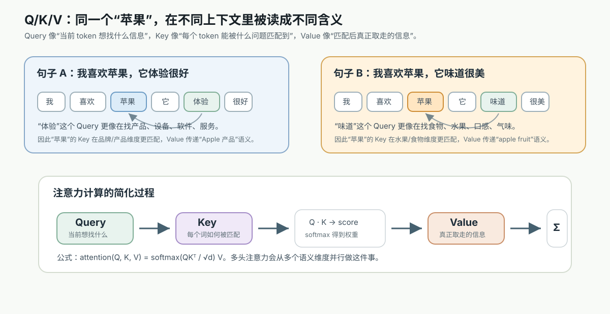
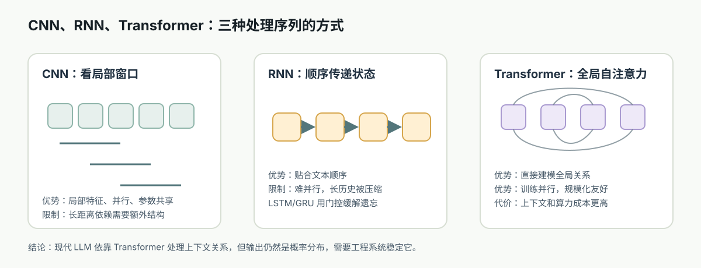
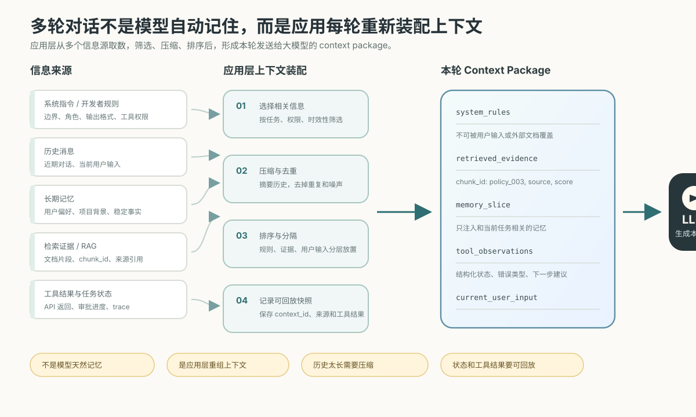
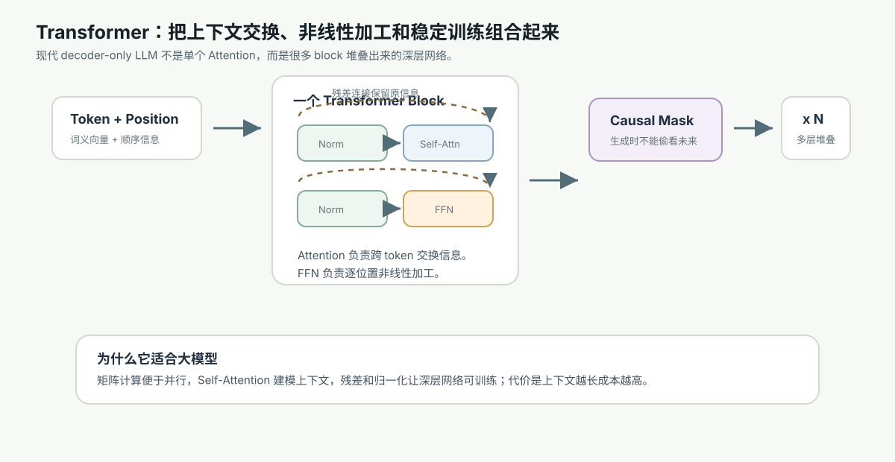

# 11. 从上下文问题到 Attention

[返回本章](README.md)



图解导读：Attention 是为了解决序列上下文关系问题；可以先对比 CNN/RNN/Transformer，再看 QKV 和上下文装配。

## 核心问题

模型怎么在一长串文字里找到相关信息？

更具体地说：当模型看到“张三把书递给李四，因为他明天要考试”时，它怎么判断“他”更可能指向谁？当用户在很长的对话前面给过约束，后面又问一个细节时，模型怎么把远处的信息拿回来用？Attention 要解决的不是“模型有没有记忆”这个抽象问题，而是“当前 token 在生成或理解时，应该优先参考上下文里的哪些 token”。

## 从哪里来：RNN / LSTM 的上下文瓶颈

RNN / LSTM 在这里不是新的学习主线，只是用来说明旧的序列处理方式为什么难以支撑长上下文和大规模并行训练。读者不需要先掌握它们的全部细节，只要看懂“逐步压缩历史状态”这个限制即可。

早期处理序列的主流方式是 RNN。它像一个人从左到右读句子：读到第 1 个词，更新一次内部状态；读到第 2 个词，再把新词和旧状态合并；一直读到末尾。LSTM / GRU 在 RNN 上加入门控机制，试图让重要信息保留得更久，减少长距离信息被冲淡的问题。

直觉层看，RNN 的问题像“只带一张不断被改写的小纸条读一本长书”。读到后面时，前面很多细节只能压缩在这张纸条里。即使 LSTM 的门控能决定保留什么、忘掉什么，这张纸条仍然是一个固定大小的中间状态，远处信息必须经过很多步传递才到达当前位置。

机制层看，RNN 的状态转移是串行的：

```text
h1 = f(x1, h0)
h2 = f(x2, h1)
h3 = f(x3, h2)
...
ht = f(xt, h(t-1))
```

这带来两个瓶颈：

- 长距离依赖瓶颈：第 1 个 token 的信息要影响第 1000 个 token，必须穿过 999 次状态更新。即使有门控，也容易衰减、混杂或被覆盖。
- 串行训练瓶颈：第 1000 步必须等第 999 步算完，难以充分利用 GPU / TPU 的大规模并行能力。

把 RNN / LSTM 和 Attention 放在一起看，可以更清楚地看到架构重心的变化：从“不断压缩历史状态”变成“按需检索上下文表示”。

这张图适合在这里看：它把 CNN、RNN 和 Transformer 的信息流差异放到同一层比较，帮助理解为什么 Attention 能成为后续 Transformer 的核心。



| 对比维度 | RNN / LSTM | Attention | 对大模型的影响 |
| --- | --- | --- | --- |
| 上下文表示 | 历史被压进一个隐藏状态 | 每个 token 都保留可被访问的表示 | 远处信息更容易被直接使用 |
| 计算路径 | 信息逐步传递 | token 间可在一层内建立连接 | 长距离依赖路径更短 |
| 训练并行度 | 时间步强依赖，天然串行 | 关系矩阵可并行计算 | 更适合大规模 GPU / TPU 训练 |
| 主要成本 | 长序列难保留细节 | 注意力矩阵随长度变大 | 长上下文需要额外优化 |
| 工程直觉 | 像滚动摘要 | 像带索引的回看 | Prompt 和 RAG 要组织好可检索信息 |

这个对比不是说 RNN 完全无用，而是说明现代大模型为什么更依赖 Attention 这类可并行、可检索的上下文机制。

形式层看，RNN 把上下文压进单一隐藏状态；Attention 则把上下文保留为一组可被检索的向量。前者更像“不断摘要”，后者更像“带索引地回看原文”。

工程层看，这直接影响模型规模。现代大模型要在海量 token 上训练，计算必须能被拆成大矩阵并行执行。RNN 的时间步依赖让吞吐受限；Attention 虽然有自己的计算和显存成本，但它允许同一层里大量 token 之间的关系并行计算，这成为 Transformer 能扩大的关键前提。

## Attention 是什么

Attention 的核心思想很简单：当前 token 不必平均看所有上下文，也不必只依赖一个压缩状态；它可以给上下文里的每个 token 分配一个“相关性权重”，然后按权重汇总信息。

直觉层可以把它想成开卷考试。回答当前问题时，你不会从第一页到最后一页平均读一遍，而是根据问题去找最相关的段落。问题是 query，目录和段落标题像 key，真正被取回的内容像 value。

在语言模型里，一个 token 的向量会被变换成三类向量：

- Query：我现在想找什么信息。
- Key：我这里提供的信息适合被什么问题找到。
- Value：如果别人关注我，我实际贡献什么内容。

Q / K / V 的职责可以压缩成一张检索表。注意这里的“问题、标签、内容”是帮助理解的类比，实际计算中它们都是由同一个 token 表示线性变换得到的向量。

| 向量 | 类比 | 在 attention 中的职责 | 例子中的直觉 |
| --- | --- | --- | --- |
| Query | 当前问题 | 主动去匹配上下文里哪些信息相关 | “我现在要判断它指谁” |
| Key | 可检索标签 | 被其他 token 用来判断是否相关 | “我这里是一个候选实体” |
| Value | 可取回内容 | 一旦被关注，实际贡献给当前表示 | “把实体、属性、语境信息传过去” |

有了这组三分法，模型就能把“该看谁”和“看到了拿什么信息”分开建模。

这三个名字容易显得抽象，但它们表达的是一种检索关系。当前 token 用自己的 query 去和其他 token 的 key 比较，得到相关性分数；分数越高，说明越应该读取那个 token 的 value。

## 相关性分数怎么工作

机制层上，Attention 通常分三步：

1. 为每个 token 生成 Q、K、V 三个向量。
2. 用当前 token 的 Q 与上下文中每个 token 的 K 计算相关性分数。
3. 把分数转成权重，再用这些权重对 V 做加权求和，得到当前 token 的新表示。

可以用不堆公式的方式理解这个过程：

```text
当前 token 的问题 Q
  对比 每个上下文 token 的标签 K
  得到 “该看谁” 的分数
  分数经过 softmax 变成权重
  权重乘以各 token 的内容 V
  汇总成当前 token 的上下文表示
```

形式层上，常见的 scaled dot-product attention 可以写成：

```text
Attention(Q, K, V) = softmax(QK^T / sqrt(d)) V
```

这里不需要把公式当成重点，但要知道每一部分的含义：

- `QK^T`：所有 query 和所有 key 两两比较，得到相关性矩阵。
- `/ sqrt(d)`：避免向量维度变大后点积分数过大，导致 softmax 过早变得极端。
- `softmax`：把分数变成总和为 1 的权重。
- `V`：被加权汇总的内容。

一个容易误解的点是：Attention 权重不是人类可完全信任的“解释”。它显示了某一层、某一头在一次计算里如何混合信息，但模型最终行为来自很多层、很多头、FFN 和训练分布的共同作用。权重有参考价值，却不能简单等同于“模型真正的理由”。

如果公式太抽象，可以只看一个 3-token 的极小例子。假设当前 token 是“它”，上下文里有三个候选位置：

| 候选 token | Key 代表的线索 | 与“它”的 Query 打分 | softmax 后权重 | 被取回的 Value 直觉 |
| --- | --- | ---: | ---: | --- |
| 苹果 | 物品、水果、前文实体 | 2.4 | 0.70 | 苹果这个候选对象的信息 |
| 书包 | 容器、前文实体 | 1.1 | 0.20 | 书包这个候选对象的信息 |
| 放进 | 动作关系 | 0.4 | 0.10 | 动作线索 |

加权汇总时，模型不是只复制某一个 token，而是按权重混合各自的 Value：`0.70 * V_苹果 + 0.20 * V_书包 + 0.10 * V_放进`。`/ sqrt(d)` 的作用可以先理解成“给分数降温”，防止维度很高时点积分数过大，让 softmax 一下子过于极端。

## Self-attention 是什么

Self-attention 指 Q、K、V 都来自同一段输入序列。也就是说，句子内部的每个 token 都可以看同一句子里的其他 token，并重新形成自己的上下文表示。

直觉层看，它像让一句话里的每个词都问一遍：“为了理解我，其他词里谁最重要？”例如：

```text
小明把苹果放进书包，因为它太重了。
```

“它”需要参考前文候选对象；“重”也会影响指代判断；“苹果”和“书包”都可能被关注。Self-attention 允许这些关系在同一层里被显式计算出来，而不是只靠从左到右传递的隐藏状态。

机制层看，每一层 Self-attention 都会更新每个 token 的表示。第一层可能学到局部搭配，后面的层可能把指代、句法、任务格式、引用关系、代码作用域等更复杂的关系组合起来。一个 token 的向量不再只是“这个词本身”，而是“这个词在当前上下文中的状态”。

形式层看，如果序列长度是 `n`，Self-attention 会形成一个大致 `n x n` 的关系矩阵：每个位置都对每个位置打分。这个结构让任意两个 token 在一层内就能建立直接路径，而 RNN 中远距离 token 需要跨越许多时间步。

工程层看，这解释了为什么上下文窗口有价值。只要 token 在窗口内，理论上它就能被 attention 访问；窗口外的信息则不会自动出现，必须通过 RAG、摘要、记忆系统、工具调用或重新放入 Prompt 解决。

## 为什么 Attention 适合上下文建模

Attention 适合语言建模，主要因为语言理解经常不是线性的。

第一，语言有长距离依赖。主语和谓语可能隔很远，代词可能指向很早出现的实体，代码变量可能在几十行前定义，用户约束可能在对话开头出现。Attention 让远处 token 不必经过逐步传话，而是可以被当前位置直接参考。

第二，语言关系是动态的。同一个词在不同上下文里关注对象不同。“bank”在金融文本和河岸文本里要参考的线索不同；“它”在不同句子里指向不同对象。Attention 的权重由当前输入动态计算，而不是固定规则。

第三，语言任务需要多种关系同时存在。一个 token 可能同时需要句法信息、实体信息、格式信息、任务边界信息和风格信息。单一注意力视角不够，所以后续 Transformer 会引入 multi-head attention，让不同头学习不同类型的关系。

第四，训练需要并行化。Self-attention 在一层内可以用矩阵乘法同时计算许多 token 的关系，这非常适合现代加速硬件。大规模预训练不是只靠算法概念成立，还要靠工程上能高吞吐地跑起来。

## Attention 解决什么

Attention 主要解决三类问题。

第一，它缓解长距离依赖。远处信息可以在同一层中被直接读取，不必被压缩进单一隐藏状态。

第二，它提供动态上下文选择。模型不是对所有前文一视同仁，而是根据当前 token 和上下文内容计算“该看谁”。

第三，它改善并行训练条件。相比严格串行的 RNN，Self-attention 更容易组织成大矩阵计算，支撑更大的数据、更大的模型和更高效的训练。

这些能力共同改变了模型设计的重心：与其手写复杂特征或规则，不如给模型足够大的上下文表示能力，让它在预训练中学习哪些关系有用。

但 Attention 的收益总是伴随成本。工程上更有用的理解方式，是同时看它解决了什么、又把哪些压力转移到了系统设计里。

| Attention 带来的收益 | 同时带来的代价或边界 | 工程含义 |
| --- | --- | --- |
| 远距离 token 可以直接建立关系 | 标准注意力成本随序列长度快速增长 | 长上下文要控制片段长度、排序和预算 |
| 每个 token 动态选择相关上下文 | 相关不等于一定正确，权重也不等于解释 | 事实答案仍要证据和校验 |
| 一层内可并行计算关系矩阵 | 推理时长上下文会增加首 token 延迟 | 需要 KV cache、批处理和推理优化 |
| 多个头可学习不同关系 | 无关文本也会占用注意力容量 | RAG 要去噪、去重、保留高相关片段 |
| 上下文窗口内信息可被访问 | 窗口外信息不会自动进入模型 | 外部记忆、检索和摘要仍然必要 |

因此，Attention 是上下文建模的核心机制，但不是完整的知识管理或推理控制系统。

## Attention 解决不了什么

Attention 不是万能记忆系统。

第一，它不等于事实正确。Attention 可以从上下文里找相关信息，但如果上下文没有事实、事实冲突、训练中形成了错误模式，模型仍然可能幻觉。

第二，它不保证使用所有重要信息。长上下文里即使信息在窗口内，也可能因为位置、干扰、表述方式或训练偏差而没有被充分利用。工程上常见的“把文档塞进上下文”并不等于模型会稳定读取正确段落。

第三，它有计算成本。标准 Self-attention 对序列长度的关系通常是二次增长：token 数翻倍，注意力矩阵规模约变成四倍。这直接影响显存、延迟和上下文窗口成本。

第四，它缺少天然的顺序感。Attention 本身比较的是向量相关性，并不知道第几个 token 在前、第几个在后。Transformer 必须额外加入位置编码或位置嵌入，下一节会展开。

第五，它不替代推理控制。Attention 能混合上下文信息，但复杂问题仍可能需要分步推理、工具调用、检索、验证、规划和外部状态管理。

## 工程小结

理解 Attention 会直接影响 Agent 和 LLM 应用的设计。

在 Prompt 设计上，关键信息要靠近使用位置，并用清晰结构降低干扰。虽然 attention 能看远处 token，但模型对近处、格式清晰、语义直接的信息通常更稳定。

在 RAG 设计上，不应只追求召回更多文本。更重要的是把高相关片段放入上下文，并去掉噪声、重复和冲突。Attention 的容量会被无关内容占用，长上下文不是免费午餐。

在上下文管理上，需要区分“可访问”和“可用”。放进窗口只是让模型有机会注意到；要让模型稳定使用，还要靠排序、分段、标题、引用标记、摘要和必要的答案约束。

真实 Agent 或 RAG 系统里，Attention 能否用好信息，很大程度取决于上下文是怎样被装配进窗口的。



在模型选择上，长上下文模型适合读长文档、代码库片段和多轮对话，但延迟与成本会增加。短上下文模型配合检索、摘要或工具，有时更稳定也更便宜。

在评估上，要专门测试长距离引用、干扰信息、跨段整合和指令保持，而不是只看短问题回答。Attention 的优势和弱点都会在这些任务中暴露出来。

## 连接到下一节

Attention 解决了 token 之间“怎么互相看”的问题，但还没有形成完整的大模型结构。模型还需要：

- 把 token 变成向量。
- 给 token 加上位置信息。
- 用多个注意力头并行捕捉不同关系。
- 加入非线性变换，提升表达能力。
- 用残差连接和归一化让深层网络可训练。
- 在生成任务中限制模型只能看过去，避免偷看答案。

这些部件组合起来，就是下一节要讲的 Transformer block 和 decoder-only 架构。

下一节会把 Attention 放进完整 block 里，看它如何和位置、FFN、残差、归一化、causal mask 一起组成现代大模型主干。


