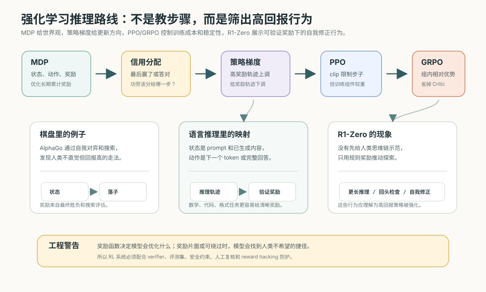

# 13. 预训练、指令微调与对齐

[返回本章](README.md)


图解导读：训练与对齐要把“预测损失下降”“参数更新”“评测验证”连成一条工程流水线。

## 核心问题

大模型一开始只是随机参数（模型内部可学习的数字），为什么经过训练后能写作、翻译、总结、编程和对话？又为什么一个会续写文本的模型，还要经过指令微调和对齐，才更像我们日常使用的助手？

这一节把训练过程拆成一条因果链：

> 预训练（pretraining，先用大规模通用数据学习语言规律）让模型获得能力基础；指令微调（instruction tuning，用指令和示范回答继续训练）让模型学会按任务回答；对齐（alignment，让行为符合人类意图、偏好和安全边界）让模型更适合被人使用。

这三件事相关，但不是同一件事。把它们混在一起，会误以为“模型更听话就是更聪明”，或者误以为“提示词写得好就能替代所有训练”。工程上，这两个判断都会带来问题。

先用一张分层表把“模型结构”和“训练阶段”分开：

| 层级 | 它是什么 | 解决的问题 |
| --- | --- | --- |
| Transformer | 模型骨架，决定信息如何在 token 之间流动 | 让模型能表示上下文并生成概率分布 |
| Pretraining | 用海量文本把随机参数训练成会续写的模型 | 获得语言、知识、格式和任务模式 |
| SFT / instruction tuning | 用指令和示范回答继续训练 | 让模型把能力接到“用户请求 -> 助手回答”的界面 |
| RLHF / PPO / GRPO / DPO | 用奖励或偏好数据继续优化行为选择 | 让回答更符合人类偏好、安全边界、可验证任务目标和产品目标 |
| Inference | 参数固定后实际服务用户 | 按上下文逐 token 生成输出 |

这样读后面的内容时，就不容易把 Transformer block、预训练、SFT、RLHF、PPO、GRPO、DPO 和 Prompt 技巧混成同一类东西。

## 推导线索

```text
模型参数初始是随机的
→ 随机参数只能给出近似随机的 token（词元）概率
→ 预训练用海量文本做 next-token prediction
→ tokenizer（分词器）把文本切成 token
→ batch（批次）把许多训练样本一起送入模型
→ cross entropy（交叉熵）衡量真实 token 的预测概率有多低
→ 反向传播计算每个参数该往哪个方向改
→ optimizer（优化器）根据梯度更新参数
→ 重复海量 token 后，模型学到语言、知识和任务模式
→ 但预训练目标仍然只是续写，不是服从用户意图
→ instruction tuning / SFT（监督式微调）把能力接到“指令 → 回答”的界面上
→ reward model（奖励模型）/ RLHF（基于人类反馈的强化学习）/ PPO / GRPO / DPO（直接偏好优化）进一步优化行为选择
→ 对齐改善行为选择，不等于凭空增加 capability（能力）
```

## 本节目标

- 为什么随机参数需要预训练。
- 预训练数据、token、batch、cross entropy、反向传播、optimizer 如何形成训练闭环。
- scaling law（规模定律）的直觉和边界。
- 为什么预训练模型只是“会续写”，不等于会按用户意图回答。
- instruction tuning、SFT、reward model、RLHF、PPO、GRPO、DPO 的区别和因果关系。
- alignment（对齐）与 capability（能力）的区别。
- 工程上何时用提示词、RAG（检索增强生成）、工具，何时才考虑微调。
- 为什么要保留评测集。

第一次读，本节先带走三件事：

- Transformer 是结构，pretraining / SFT / RLHF / PPO / GRPO / DPO 是训练或对齐阶段，inference 是使用阶段。
- 预训练让模型会续写，指令微调让它更会按请求回答，偏好优化让它更符合人类偏好和安全边界。
- 强化学习不是直接教模型推理步骤，而是用奖励信号把高回报的行为路径筛出来；训练是否有效必须用评测集验证。

## 1. 随机参数为什么不能直接使用

大模型可以先粗略理解为一个很大的函数：

```text
输入 token 序列 → 输出下一个 token 的概率分布
```

这里的参数，就是函数内部可学习的数字。Transformer 是一种基于 attention（注意力机制）的神经网络架构，里面有 attention 层、前馈网络层、归一化层等结构，但这些结构本身只规定了“怎么算”，不自动带来语言能力。真正决定模型输出倾向的，是数以亿计、百亿计甚至更多的参数值。

训练开始时，参数通常是随机初始化的。随机初始化不是因为随机参数有知识，而是为了让不同神经元、不同层从不同位置开始学习，避免所有参数完全对称。如果所有参数都一样，模型的很多部分会学成同一种东西，无法形成丰富分工。

但随机参数本身没有理解能力。给它一句话：

```text
法国的首都是
```

它不会天然知道后面应该更偏向“巴黎”，也不会天然知道“法国”“首都”“城市”之间的关系。它最多会根据随机权重生成一组看似数学上合法、但语义上没有意义的 logits（原始分数）。

logit 是模型给每个候选 token 的原始分数。logit 还不是概率，通常要经过 softmax 变成概率分布。随机参数输出的概率分布可能把“巴黎”“香蕉”“}”“运行时”都分得差不多，或者毫无理由地偏向某个 token。

所以，预训练不是锦上添花，而是把随机函数变成语言模型的第一步。

## 2. 预训练：先让模型学会续写世界

预训练（pretraining）是指：在模型被专门教会对话、遵循指令或完成某个业务任务之前，先用大规模通用数据训练它预测下一个 token。

token（词元）是模型处理文本的基本单位，可以是一个字、一个词的一部分、一个标点、一个空格模式，或者代码里的符号片段。模型不直接看“中文句子”或“英文单词”，而是看 token id 序列。

预训练通常采用自监督学习。自监督学习的意思是：训练标签不需要人工逐条标注，而是从数据本身自动构造。对语言模型来说，任何一段文本都能变成训练样本：

```text
文本:   今天天气很好，我们去公园散步。
输入:   今天天气很好，我们去公园
目标:   散步
```

更一般地，文本被切成：

```text
x1, x2, x3, ..., xt, x(t+1)
```

模型看到前面的 token：

```text
x1, x2, ..., xt
```

它要预测真实的下一个 token：

```text
x(t+1)
```

如果它给真实 token 的概率高，说明这一步预测好；如果真实 token 的概率低，说明这一步预测差。

预训练本质上仍然是前向计算、损失衡量、反向传播和参数更新的循环，只是样本规模、模型规模和工程复杂度都被放大了。


这个目标看起来很窄，但压力非常大。要预测好下一个 token，模型必须逐渐学会：

- 语法：什么词可以接在什么词后面。
- 语义：句子里的对象、属性、动作和关系。
- 事实：常见实体、事件、概念之间的关联。
- 风格：论文、新闻、代码、问答、邮件各自怎样展开。
- 任务模式：翻译、总结、补全、解释、列表、JSON 等文本形态。

预训练不是给模型显式写入规则，而是让模型在大量预测错误中不断调整参数。能力来自一个很朴素的压力：想把下一个 token 猜准，就必须压缩语言和世界中的统计结构。

参数更新落到训练工程里，就是反复沿着损失下降方向移动。下面这张图可以帮助把优化器、学习率、batch 和训练稳定性放回同一个训练循环里。


预训练数据的价值不在于“越多越好”，而在于让模型接触足够多的语言形态和任务形态。可以把常见数据类型先按贡献拆开看：

| 数据类型 | 主要提供的学习信号 | 需要控制的风险 |
| --- | --- | --- |
| 通用网页和论坛 | 日常语言、问答模式、常见事实和观点表达 | 噪声、重复内容、低质量回答、偏见 |
| 书籍、论文和长文档 | 长距离结构、概念解释、论证和专业表达 | 版权、领域分布失衡、过时知识 |
| 代码仓库和技术文档 | 语法模式、API 用法、调试思路和工程惯例 | 有漏洞的代码、废弃 API、许可证问题 |
| 多语言语料 | 跨语言表达、翻译模式、本地化知识 | 低资源语言数据不足、机器翻译噪声 |
| 结构化文本和表格 | 列表、JSON、配置、日志等格式规律 | 格式不一致、字段含义缺失、隐私数据 |

这张表也说明，数据清洗和配比本身就是训练的一部分；同样规模的数据，质量和结构不同，训练出来的行为会明显不同。

## 3. 训练闭环：LLM 训练特化复盘

这里不再完整重讲 tokenizer、forward pass、cross entropy、反向传播和 optimizer。它们已经分别在第 04、05、08、09 节铺过。本节只把这些基础概念放回 LLM 预训练里，看它们怎样连成一条工程流水线。

LLM 训练的特化之处有三点：

- 同一段文本会在很多位置产生训练信号：输入是前面的 token，目标是右移一位后的真实 token。
- 损失通常来自整段序列上许多 token 位置的平均 cross entropy，而不是只看一个最终分类标签。
- 参数规模、数据规模和序列长度都很大，所以训练稳定性、吞吐、显存、分布式通信和 checkpoint 恢复都会变成核心工程问题。

可以把闭环压缩成下面这段伪代码：

```text
for batch in training_data:
    tokens = tokenizer(batch)
    logits = model(tokens)
    loss = cross_entropy(logits, shifted_tokens)
    gradients = backpropagation(loss)
    optimizer.update(parameters, gradients)
```

这段代码里的每个词都可以回指前文：

| 环节 | 本节只需要记住 | 基础解释回看 |
| --- | --- | --- |
| tokenizer | 文本先变成 token id，训练和推理必须使用同一套切分规则 | 第 08 节 |
| shifted tokens | 每个位置都用“下一个 token”作为目标 | 第 09 节 |
| logits / cross entropy | 模型给词表打分，真实 token 概率越低，损失越大 | 第 04、09 节 |
| backpropagation | 损失通过计算图传回参数，得到梯度 | 第 04 节 |
| optimizer | 按学习率和更新规则改变参数 | 第 05 节 |

所以，预训练不是“把书读进模型”，而是让模型在海量 token 位置上反复经历：

```text
预测下一个 token
→ 发现真实 token 概率不够高
→ 计算梯度
→ 更新参数
→ 下一轮预测分布发生变化
```

真正的大模型训练还会加入数据去重、质量过滤、数据配比、混合精度、梯度累积、学习率调度、分布式训练和 checkpoint 恢复。这些工程细节会影响训练是否稳定，但主干仍然是：数据提供目标，loss 衡量错误，反向传播计算梯度，optimizer 更新参数。

## 4. scaling law：规模为什么有效，又为什么不是万能

scaling law（规模定律）是指在一定范围内，模型性能会随着数据量、参数量和计算量的扩大，呈现可预测的改善趋势。更直观地说：如果数据足够好、模型足够大、训练计算足够多，next-token prediction 的 loss 往往会下降，许多下游能力也会随之增强。

这背后有三个互相依赖的资源。

第一是数据量。更多高质量数据能让模型见到更多语言结构、领域知识、任务格式和边界情况。只在儿童故事上训练的模型，很难自然学会法律文本、医学表达和大型代码库的模式。

第二是参数量。参数可以理解为模型压缩规律的容量。模型太小，即使数据很多，也可能没有足够容量同时表示语法、事实、代码、推理步骤和多语言关系。

第三是计算量。计算量决定模型有多少机会在大规模数据上反复更新参数。参数多但训练不够，模型可能还没学充分；数据多但计算不够，模型也无法有效吸收。

规模带来的提升不是神秘现象。它可以从预测压力理解：

```text
更多数据 → 暴露更多规律和例外
更多参数 → 有更多容量压缩这些规律
更多计算 → 有更多步骤把参数调到可用位置
```

但 scaling law 有明确边界。

首先，数据质量会限制上限。重复、低质、错误、过时、带偏见或被污染的数据，会让模型学到不可靠模式。数据变多不等于有效信息变多。

其次，规模提升通常有边际收益递减。把模型从很小变到中等，提升可能非常明显；继续变大，单位算力带来的收益可能下降。工程上还要面对训练成本、推理成本、延迟、显存、部署复杂度和能耗。

再次，loss 下降不等于真实任务一定可靠。模型可能在常见模式上更流畅，却仍然会在事实更新、长链路推理、罕见边界条件、严谨数学证明、复杂工具调用中犯错。

最后，规模不会自动带来安全和可控。更大的预训练模型通常能力更强，但也可能更擅长生成有害内容、编造细节或迎合错误前提。能力扩大后，对齐和评测反而更重要。

所以，scaling law 的正确理解不是“越大越好，问题自然消失”，而是：

> 在数据、参数和算力平衡且质量可控时，规模能显著提高能力基础；但可靠性、安全性和工程可用性还需要后续训练、系统设计和评测约束。

## 5. 预训练模型为什么只是“会续写”

预训练的目标是：

```text
给定前文，预测下一个 token
```

它不是：

```text
理解用户真实意图，并给出最有帮助、最安全、最诚实的回答
```

这两个目标差别很大。

在互联网文本里，模型会看到很多种模式：

```text
用户: 怎么安装这个库？
回答: ...
```

也会看到：

```text
小说对白
论坛争吵
错误教程
营销文案
不完整代码
恶意请求
讽刺语气
```

预训练只要求模型学会这些文本如何延续。它可能学到问答格式，但并没有被明确训练成“当用户提问时，要站在用户目标上完成任务”。如果只拿预训练模型来对话，它可能出现几类问题：

- 把用户问题当作文章开头继续写，而不是回答问题。
- 模仿训练语料里的错误、偏见或攻击性表达。
- 在不知道答案时继续生成看似合理的内容。
- 不稳定地切换身份、格式和语气。
- 对安全边界没有一致处理。

这就是“会续写”和“会按用户意图回答”的差别。预训练提供的是能力底座，但它还没有被稳定地接到人类交互界面上。

## 6. instruction tuning 与 SFT：把能力接到指令界面

instruction tuning（指令微调）是用“指令 → 理想回答”形式的数据继续训练模型，让模型学会把用户输入看作任务要求，而不只是普通文本前缀。

instruction（指令）不是狭义的命令句，而是用户希望模型完成的任务描述，例如：

```text
请把下面这段话总结成三点。
把这个函数改成 TypeScript。
解释这段 SQL 为什么慢。
根据材料写一封礼貌的拒绝邮件。
```

SFT（Supervised Fine-Tuning，监督式微调）是 instruction tuning 最常见的形式之一。监督式的意思是：训练数据里有明确的示范答案。模型看到指令，学习提高示范答案中每个 token 的概率。

SFT 数据通常长这样：

```text
指令: 用通俗语言解释什么是梯度下降。
回答: 梯度下降可以理解为在山坡上找最低点...
```

和预训练相比，SFT 的数据规模通常小很多，但格式更集中、目标更明确。它主要教模型三件事：

- 用户输入是任务，不只是可续写文本。
- 回答应该直接、有用、结构清楚。
- 在特定场景下应该遵守格式、语气和边界。

SFT 不是凭空创造能力。一个完全没有学过代码的模型，仅靠少量“写代码指令”很难变成优秀程序员。更常见的情况是：预训练已经让模型学到很多语言、知识和代码模式，SFT 把这些潜在能力组织成更可用的交互行为。

也就是说，因果关系更像这样：

```text
预训练：学到大量可迁移模式
SFT：把这些模式映射到指令和回答格式
```

SFT 后的模型通常已经能对话，但还不一定符合人类偏好。因为“示范答案”只能覆盖一部分行为，很多时候我们不是只有一个标准答案，而是在多个候选答案里判断哪个更好。

## 7. reward model、RLHF 与 DPO：从示范答案到偏好优化

人类偏好比“答案是否完全一致”复杂。对同一个问题，两个答案都可能语法正确，也都可能包含部分事实，但一个更有帮助、更诚实、更安全、更简洁，另一个更啰嗦、更武断或更容易误导。

为了训练这种偏好，常见做法是收集 preference data（偏好数据）。偏好数据通常不是单个标准答案，而是比较：

```text
给定同一个 Prompt：
答案 A
答案 B
人类标注：A 更好
```

这里的 Prompt 是给模型的输入，可以是用户问题、系统要求、多轮上下文或工具结果。

先看一个小例子。同一个用户问题下，两个回答都可能“能读”，但偏好不同：

```text
Prompt: 这个药能不能和酒一起吃？

答案 A: 不建议和酒一起吃，具体要看药名和医生说明。如果你告诉我药名，我可以帮你整理需要确认的问题。
答案 B: 一般没事，少喝点就行。

人类偏好: A 更好
```

偏好优化要做的不是背下 A 的原文，而是让模型以后在类似场景中更倾向于谨慎、说明边界、请求必要信息，而不是给出武断建议。

### 7.1 reward model：把偏好变成可计算分数

reward model（奖励模型，RM）是一个专门学习人类偏好的模型。它输入 Prompt 和候选回答，输出一个分数，表示这个回答有多符合标注者偏好。

训练奖励模型时，会让它给被偏好的回答更高分，给被拒绝的回答更低分：

```text
score(Prompt, chosen_answer) > score(Prompt, rejected_answer)
```

奖励模型本身不是最终助手。它更像一个可学习的评审器，用来替代一部分昂贵的人类实时打分。

### 7.2 RLHF：用奖励模型继续优化助手

RLHF（Reinforcement Learning from Human Feedback，基于人类反馈的强化学习）是用人类偏好训练模型的一类方法。

reinforcement learning（强化学习）是让模型根据奖励信号调整行为的训练范式。在 RLHF 里，当前助手模型生成回答，奖励模型给回答打分，然后训练算法提高高分回答的概率、降低低分回答的概率。

实际 RLHF 通常还会加入一个约束：新模型不要偏离 SFT 模型太远。原因是如果只追求奖励模型高分，模型可能钻奖励模型的空子，生成表面讨好但内容变差的答案。这类现象叫 reward hacking（奖励投机）：模型优化了分数，却没有真正优化人类想要的质量。

所以 RLHF 的链路通常是：

```text
预训练模型
→ SFT 模型
→ 收集偏好数据
→ 训练 reward model
→ 用强化学习优化 SFT 模型
→ 得到更符合偏好的对话模型
```

RLHF 的优点是表达能力强，可以直接优化“人类更喜欢什么”。缺点是系统复杂，训练不稳定，奖励模型质量会成为瓶颈，过度优化还可能让回答变得圆滑、保守或模板化。

### 7.3 从 MDP 到 GRPO：强化学习到底在优化什么

把强化学习放进大模型训练时，最容易误解的一点是：它不是把“正确推理步骤”逐条教给模型。更准确地说，强化学习定义什么结果更好，然后让模型在大量采样、试错和参数更新中，提高高回报行为的概率。

可以把这条路径压缩成：

```text
MDP
→ 信用分配
→ 策略梯度
→ PPO
→ GRPO
→ R1-Zero
```



MDP（Markov Decision Process，马尔可夫决策过程）是强化学习的世界观。它把任务拆成状态、动作和奖励。目标不是只让下一步看起来好，而是让长期累计奖励更高。

放到大模型里，可以这样类比：

| 强化学习概念 | 棋盘或游戏里的含义 | 大模型推理里的近似对应 |
| --- | --- | --- |
| 状态 state | 当前棋盘、分数、局面 | Prompt、已生成推理、工具观察、当前上下文 |
| 动作 action | 下一步落子或操作 | 下一个 token、下一段推理、一次工具调用候选 |
| 轨迹 trajectory | 从开局到终局的一串动作 | 从开始思考到最终答案的一整段输出 |
| 奖励 reward | 赢棋、得分、通关 | 答案正确、测试通过、格式正确、人类偏好更高 |
| 策略 policy | 在当前局面选哪个动作的概率 | 模型在当前上下文下输出 token 或答案的概率分布 |

难点是信用分配。围棋可能最后才知道输赢，数学题可能最后才知道答案对不对，代码可能跑完测试才知道是否通过。最后赢了或答对了，并不能直接告诉模型中间哪一步最关键；最后错了，也不能立刻知道是哪一步带偏了整条路径。

强化学习有两类常见思路。价值派给状态或动作打分，估计“这里往后能拿多少回报”；策略派直接学习“在这个状态下应该选什么动作的概率”。大模型天然更接近策略派，因为它每一步本来就输出下一个 token 的概率分布。

策略梯度的直觉很朴素：

```text
如果一条轨迹得到高奖励
→ 提高这条轨迹里相关动作的概率

如果一条轨迹得到低奖励
→ 降低这条轨迹里相关动作的概率
```

REINFORCE 是这种思想的朴素版本，但它的方差很大，更新容易不稳定。PPO（Proximal Policy Optimization）解决的是“步子不要迈太大”。它会比较新旧策略给同一动作的概率比，并用 clip 限制更新幅度，避免模型因为一批样本把策略推得太远。

典型 RLHF/PPO 链路很重，常常要同时维护几类组件：

| 组件 | 作用 | 成本问题 |
| --- | --- | --- |
| Actor | 当前要训练的助手模型 | 负责生成回答并被更新 |
| Critic | 估计状态或回答的价值 | 需要额外模型和显存，训练也不容易稳定 |
| Reference | 参考模型 | 用来约束新策略不要偏离太远 |
| Reward model | 给回答打奖励分 | 质量决定优化方向，也可能被模型钻空子 |

GRPO（Group Relative Policy Optimization）的关键简化，是不再训练 Critic。它对同一道题采样多个回答，让这些回答在组内互相比：高于组内平均的回答得到正相对优势，低于组内平均的回答得到负相对优势。组本身就成了 baseline。

简化理解：

```text
同一道题采样 G 个回答
→ 分别计算奖励 r1...rG
→ 用组内平均值和标准差做归一化
→ 得到每个回答的相对优势
→ 提高相对更好回答的概率，压低相对更差回答的概率
```

这对数学、代码、格式校验这类可验证任务尤其有吸引力。因为奖励可以直接来自最终答案是否正确、测试是否通过、格式是否满足要求，不一定需要单独训练一个神经奖励模型。

DeepSeek R1-Zero 就是这个机制的典型案例。论文口径里，R1-Zero 在 DeepSeek-V3 Base 上直接做大规模强化学习，没有先用人类思维链示范做 SFT；训练奖励主要来自答案正确性和格式约束。训练过程中，模型逐渐生成更长的推理，出现自我检查、反思、探索替代解法等行为。视频里提到的 “Aha moment”，可以理解成模型在奖励压力下发现：回头检查、重新评估、延长推理在某些可验证任务上能提高得分。

这和 AlphaGo 的第 37 手可以放在同一个抽象框架里理解：人没有逐条告诉模型“这里应该这样走”或“这里应该反悔检查”，而是给出环境、奖励和大量搜索/采样机会。训练把高回报路径的概率推高，于是模型可能找到不符合人类直觉、但在任务目标下更有效的行为。

但这不应该被神秘化。涌现行为有效，不等于模型具有和人一样的理解。它更稳妥的解释是：奖励信号、采样搜索、策略梯度和规模化训练共同筛出了高回报模式。

真正的问题会回到奖励设计。强化学习的能力来自奖励信号，风险也来自奖励信号。围棋胜负、数学答案、代码测试、JSON 格式这类奖励比较清晰；写作质量、陪伴体验、治理建议、价值判断这类任务奖励模糊得多。一旦奖励片面、滞后或可被钻空子，模型就可能 reward hacking（奖励投机）：优化了分数，却偏离了真实目标。

工程上可以先记住五条：

- 奖励函数比训练技巧更基础：奖励定义错，模型会稳定优化错目标。
- 可验证任务最适合 RL：数学、代码、格式、测试通过率都能提供清晰奖励。
- GRPO 的价值在工程成本：用组内比较替代 Critic，降低显存和训练复杂度。
- 涌现行为要谨慎解释：行为有效不等于模型具有人类式理解。
- RL 系统必须防 reward hacking：当奖励片面或可绕过时，模型会找到人类不希望的捷径。

### 7.4 DPO：更直接地使用偏好对

DPO（Direct Preference Optimization，直接偏好优化）也是使用偏好数据，但它不单独训练一个显式奖励模型，也不走完整强化学习循环。

DPO 的核心思想是：既然偏好数据已经告诉我们 chosen answer 比 rejected answer 更好，就直接调整模型，让它相对更倾向 chosen answer，更不倾向 rejected answer，同时保持不要偏离参考模型太远。

简化理解：

```text
同一个 Prompt 下：
提高模型生成 chosen answer 的相对概率
降低模型生成 rejected answer 的相对概率
```

DPO 通常比 RLHF 工程链路更简单，训练更像一个监督学习问题。但它仍然依赖偏好数据质量，也不能保证解决所有安全、事实和推理问题。

### 7.5 它们之间的关系

可以用一张因果图记住这些概念：

```text
pretraining
  ↓
SFT / instruction tuning
  ↓
偏好数据
  ├─ reward model → RLHF / PPO
  ├─ 可验证奖励 → GRPO / R1-Zero 类训练
  └─ DPO
```

instruction tuning 关注“模型是否知道要按指令回答”。SFT 是用示范答案实现指令微调的常见训练方式。reward model 是把人类偏好学成分数的评审器。RLHF/PPO 是用奖励模型继续优化助手行为。GRPO 是用组内相对优势简化 PPO 式训练，特别适合可验证奖励。DPO 是绕过显式奖励模型、直接用偏好对优化的一种方法。

把几个阶段放在同一张表里，会更容易看清它们分别在优化什么：

| 阶段 | 典型数据形态 | 训练目标 | 主要改善 | 不能解决 |
| --- | --- | --- | --- | --- |
| Pretraining | 大规模自然文本、代码、结构化文本 | 预测下一个 token | 语言、知识、模式和基础迁移能力 | 稳定遵循指令、明确安全边界 |
| SFT / instruction tuning | 指令和示范答案 | 模仿高质量回答 | 对话接口、格式遵循、任务表达 | 偏好排序、复杂安全取舍 |
| RLHF / PPO | Prompt、候选回答、偏好标注、奖励模型 | 提高更受偏好的回答概率，并约束策略更新幅度 | 有帮助性、诚实性、安全性和语气稳定性 | 奖励模型看不见的事实错误、训练链路重 |
| GRPO | 同题多回答、规则奖励或可验证奖励 | 用组内相对优势提高高奖励回答概率 | 降低 Critic 成本，适合数学、代码、格式等可验证任务 | 奖励设计片面时容易奖励投机 |
| DPO | Prompt、chosen answer、rejected answer | 直接拉开偏好答案和拒绝答案的相对概率 | 简化偏好优化链路，降低训练复杂度 | 偏好数据之外的能力缺口 |

这张表不是流水线的强制模板，而是帮助工程上定位问题：缺基础能力、缺指令行为、缺偏好排序，对应的训练手段并不一样。

它们不是互斥标签，也不是同一层概念。一个实际模型可能先预训练，再 SFT，再 RLHF/PPO；也可能先预训练，再 SFT，再 DPO；也可能在可验证任务上使用 GRPO 类训练，再用 SFT 或偏好数据改善可读性、语言一致性和安全边界。

## 8. 对齐与能力：更听话不等于更懂

capability（能力）指模型能不能完成某类任务，例如写代码、解数学题、阅读长文、理解图像、调用工具、做多步规划。

alignment（对齐）指模型的行为是否符合人类意图、产品目标和安全边界，例如是否诚实表达不确定性，是否拒绝明显有害请求，是否按用户格式输出，是否避免泄露隐私，是否不为了迎合用户而编造事实。

能力和对齐相关，但不是同一维度。

一个模型能力很强但对齐差，可能会非常流畅地完成不该完成的请求，也可能自信地编造来源。一个模型对齐更好但能力不足，可能很礼貌、很安全，但面对复杂任务只能给泛泛建议。

所以要记住两句话：

> 更听话不等于更懂。
>
> 更安全不等于更会做。

无论是预训练、SFT 还是偏好优化，最终都要回到评测闭环里确认：能力是否真的变好，行为是否更符合边界，成本和延迟是否可接受。


SFT 和偏好优化常常能让模型更有帮助、更稳定、更符合格式，但它们通常不能大幅补齐预训练阶段没有获得的深层能力。相反，如果对齐数据设计不好，还可能压制一部分能力表现，例如过度拒答、过度简化、为了显得安全而回避正常问题。

工程评估时，最好把这两类问题分开看：

- 能力问题：答案不会做、推理错、代码不能运行、检索材料没读懂。
- 对齐问题：答非所问、格式不遵守、该拒绝不拒绝、该承认不知道却编造。

一个产品上线前，不能只看“模型聪不聪明”，也不能只看“模型态度好不好”。两者都要测，而且要用不同评测集测。

## 9. 工程启发：什么时候不用微调

很多应用问题并不需要一上来就微调模型。微调会带来数据构造、训练成本、版本管理、评测、回滚和合规问题。更稳妥的顺序通常是先判断问题属于哪一类。

如果问题主要是“模型不知道当前上下文”，优先考虑 Prompt 和上下文组织。Prompt（提示词）是放进模型上下文里的任务说明、约束、示例和输入材料。很多格式要求、语气要求和简单流程要求，可以通过清晰 Prompt 解决。

如果问题主要是“模型缺少外部知识或知识会更新”，优先考虑 RAG。RAG（Retrieval-Augmented Generation，检索增强生成）是先从文档、数据库或搜索系统中检索相关材料，再把材料放进上下文让模型回答。企业制度、产品文档、最新价格、内部知识库，通常不应该靠模型参数记忆。

如果问题需要确定性计算、实时状态或外部动作，优先考虑工具。工具可以是计算器、数据库查询、代码执行器、搜索接口、工单系统或业务 API。模型负责理解任务、规划调用和组织结果，确定性部分交给工具。

更适合考虑微调的情况通常是：

- 有大量稳定、重复、同类型的输入输出样本。
- 目标行为很难靠 Prompt 稳定表达。
- 输出格式、领域术语、风格或工作流长期固定。
- 需要降低长 Prompt 成本，或把大量示例压进模型行为中。
- 已经用 Prompt、RAG、工具做过基线，仍有稳定缺口。

不适合只靠微调解决的问题包括：

- 事实频繁变化。
- 需要访问实时数据。
- 训练样本很少且质量不稳定。
- 需求本身还没定义清楚。
- 需要严格正确性的计算或执行。

实际做项目时，可以先把问题归因到更具体的缺口，再决定是否进入微调流程：

| 观察到的问题 | 优先工程手段 | 为什么不是先微调 | 验证方式 |
| --- | --- | --- | --- |
| 回答缺少用户刚提供的材料 | 改 Prompt、上下文拼接和历史裁剪 | 问题是上下文没给好，不是参数没学会 | 检查引用材料覆盖率和回答忠实性 |
| 回答不知道内部制度或最新信息 | 做 RAG、数据库查询或搜索工具 | 信息会更新，写进参数会过时 | 测 RAG 召回、引用命中和幻觉率 |
| 输出 JSON、SQL 或工具参数不稳定 | schema、解析器、重试和低随机性参数 | 格式可靠性需要执行时校验 | 测格式成功率和下游执行成功率 |
| 业务语气和固定流程长期不稳定 | 少量 SFT 或偏好优化 | 这是稳定行为模式，可以考虑参数化 | 用固定评测集比较风格、合规和回归 |
| 需要执行转账、发货、审批等动作 | 工具层、权限、幂等和审计 | 执行是系统责任，不是文本生成责任 | 测权限拦截、工具结果和 trace 完整性 |

这个表的重点是先建立便宜、可回滚、可评测的基线。只有当缺口长期稳定、样本充足，并且 Prompt、RAG、工具已经到达瓶颈时，微调才更像正确投资。

一句工程化判断是：

> 缺上下文，用 Prompt；缺知识来源，用 RAG；缺确定性操作，用工具；缺稳定行为模式，才认真考虑微调。

## 10. 为什么必须保留评测集

评测集是专门用来检查模型或系统表现的一组样例。保留评测集的意思是：不要把所有样例都拿去训练或写进 Prompt，必须留一部分从未参与优化的数据，用来判断系统是否真的泛化。

如果训练数据和评测数据混在一起，会出现一个危险错觉：模型看起来进步了，其实只是记住了题目或适配了测试方式。这叫数据泄漏。

保留评测集有几个直接价值。

第一，判断微调是否真的有效。训练 loss 下降不代表业务任务变好。模型可能更会模仿训练答案，却在新问题上退步。

第二，发现能力和对齐的回归。一次微调可能让格式更稳定，却让事实问答更差；一次安全对齐可能减少风险回答，却增加正常问题的误拒。

第三，支持版本比较。没有固定评测集，就很难判断新模型、新 Prompt、新 RAG 策略、新工具链到底谁更好。

第四，防止团队凭感觉上线。大模型输出自然语言，很容易让人被流畅表达说服。评测集能把“感觉不错”变成可复查的结果。

一个实用评测集至少应该覆盖：

- 常规成功路径。
- 边界输入和异常输入。
- 容易幻觉的问题。
- 必须拒绝或谨慎回答的问题。
- 真实用户高频任务。
- 业务上不能出错的关键场景。

更成熟的做法是把评测拆成几类：能力评测、事实评测、格式评测、安全评测、工具调用评测和端到端业务评测。这样才能知道问题到底出在模型能力、对齐行为、检索质量、工具接口，还是产品流程。

## 11. 小结：训练结束后，进入推理阶段

从训练视角看，大模型的成长路径可以概括为：

```text
随机参数
→ 预训练获得语言、知识和任务模式
→ SFT 学会按指令组织回答
→ RLHF / PPO / GRPO / DPO 学会更符合人类偏好或可验证奖励
→ 形成可部署的模型 checkpoint
```

checkpoint 是一次训练完成后保存下来的模型参数状态。部署时，我们不会在每个用户请求里重新训练这些参数，而是加载已经训练好的 checkpoint，让它根据当前上下文逐 token 生成输出。

也就是说，训练阶段解决的是“参数从哪里来”；下一阶段要理解的是“参数固定以后，模型如何在推理时一个 token 一个 token 地生成答案”。
