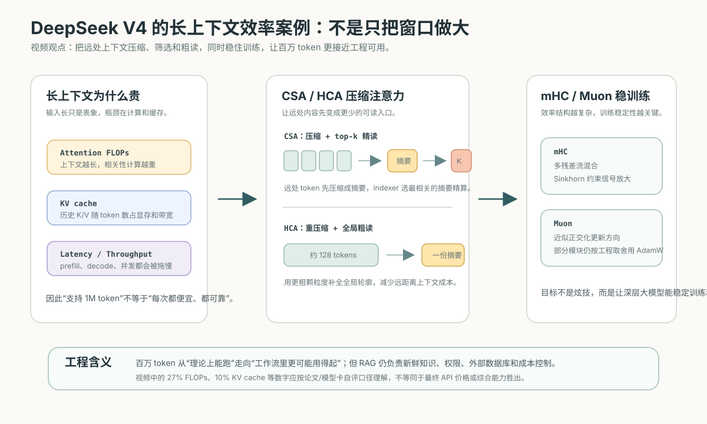

# 14. 推理机制与生成参数

[返回本章](README.md)


图解导读：推理阶段连接 Transformer、next-token 循环和上下文装配，最终还要进入评测闭环验证参数选择。

## 核心问题

模型训练好以后，服务用户时到底怎么生成答案？为什么同一个 Prompt 有时会得到不同输出？为什么长上下文、长答案、流式输出和生成参数都会影响体验、成本和可靠性？

这一节把两个问题放在一起讲：

- 推理机制：模型如何从输入上下文一步步生成 token。
- 生成参数：工程系统如何控制“从概率分布里选 token”的方式。

第 09 节讲采样，是为了理解 next-token prediction 的基本机制；本节重新讲采样，是把它放进真实推理服务里，连同 prefill、decode、KV cache、上下文窗口、延迟、成本和参数选择一起看。

理解这两件事以后，就能看懂很多真实工程现象：为什么首个 token 等很久，为什么后面输出变快，为什么长上下文贵，为什么 `temperature=0` 也不等于绝对正确，为什么调参不能只靠感觉。

## 推导线索

```text
输入 Prompt
→ prefill 处理完整上下文
→ 得到下一个 token 的概率分布
→ decode 阶段一个 token 一个 token 生成
→ KV cache 复用历史计算
→ context window 限制可见范围
→ TTFT、tokens/s、latency 和 throughput 描述推理体验
→ streaming 改善体感等待
→ 采样参数决定如何从概率分布中选 token
→ 参数选择影响稳定性、创造性、成本、延迟和可评测性
```

## 本节目标

- inference、prefill、decode、自回归生成
- KV cache、context window、长上下文成本
- TTFT、tokens/s、latency、throughput、streaming
- logits、采样、temperature、top_p、top_k
- max_tokens、stop、repetition / frequency / presence penalty
- seed、logprobs
- 不同任务如何选择参数

第一次读，本节先带走三件事：

- 推理分成 prefill 和 decode：输入越长越影响首个 token，输出越长越影响总耗时。
- KV cache 让生成不用反复重算全文，但会消耗显存，上下文窗口仍是稀缺资源。
- temperature、top_p、top_k、stop 等参数只控制选 token 的方式，不会给模型增加事实知识。

先把后面会出现的参数和性能词放进一张总表。它只解决一个问题：看到参数名时先知道它影响的是哪一层。

| 类别 | 代表项 | 主要影响 |
| --- | --- | --- |
| 上下文规模 | context window、输入 token 数 | 首个 token 延迟、显存、成本、可见信息范围 |
| 生成长度 | max_tokens、stop | 总耗时、费用、输出是否截断 |
| 采样方式 | temperature、top_p、top_k | 稳定性、多样性、格式风险 |
| 重复控制 | repetition / frequency / presence penalty | 复读、绕圈、风格漂移 |
| 观测与复现 | seed、logprobs | 调试、回归对比、置信度观察 |
| 服务体验 | TTFT、tokens/s、latency、throughput、streaming | 用户等待、吞吐、并发和成本 |

## 1. 推理是什么：训练后的模型被拿来使用

推理，英文是 inference，指模型参数已经固定以后，给它输入上下文，让它计算并生成输出的过程。

训练阶段的目标是调整参数。模型会看大量样本，算损失，反向传播，更新权重。推理阶段则不再改模型参数，而是把现有模型当成一个函数来用：

```text
输入上下文 + 模型参数 → 下一个 token 的概率分布
```

这里有一个容易误解的点：模型不是把 Prompt 读完以后，在内部“想好一整篇答案”，然后一次性发出来。更准确地说，模型每一步都只回答一个局部问题：

```text
在当前所有已知 token 后面，下一个 token 应该是什么？
```

生成一整段答案，就是反复执行这个问题。每选出一个新 token，就把它接回上下文，再预测下一个 token。这就是后面要讲的自回归生成。

工程上，推理阶段关心的不只是答案好不好，还关心：

- 首个 token 多久出来。
- 每秒能生成多少 token。
- 同时服务多少用户。
- 长上下文会占多少显存。
- 一次请求最多会花多少钱。
- 输出是否稳定、是否符合格式、是否容易复现。

所以，推理不是一个纯算法概念，而是模型能力、系统性能和产品体验的交汇点。

## 2. Prefill：先把完整上下文读进去

Prefill 指推理开始时，模型一次性处理完整输入上下文的阶段。这里的上下文包括系统指令、用户问题、历史对话、检索文档、工具返回结果，以及模型需要遵守的格式要求。

直觉层看，prefill 像“先读题”。如果用户给了很长的材料，模型必须先把这些 token 都编码进当前状态，才知道下一步该生成什么。

机制层看，prefill 会把输入 token 送入 Transformer。每一层 Self-attention 会计算当前位置和前面位置之间的关系，并为后续生成准备注意力状态。因为 Prompt 中的所有 token 已经存在，prefill 可以利用矩阵计算并行处理整段输入。

形式上，可以把输入写成：

```text
x1, x2, ..., xn
```

prefill 处理完后，模型得到：

```text
P(x(n+1) | x1...xn)
```

也就是“在完整 Prompt 之后，下一个 token 的概率分布”。

工程上，prefill 对长上下文特别敏感。输入 token 越多，模型要处理的上下文越长，attention 计算、显存占用和等待时间都会上升。很多请求首个 token 慢，并不是 decode 很慢，而是 prefill 正在处理很长的 Prompt、历史消息或检索材料。

这也解释了一个重要实践：不要把所有资料都无脑塞进 Prompt。上下文越长，成本越高，干扰也越多。RAG、摘要、裁剪历史、按需取文档，本质上都是在控制 prefill 阶段的输入质量和长度。

## 3. Decode：一个 token 一个 token 生成

Decode 指模型开始输出以后，逐步生成新 token 的阶段。

直觉层看，decode 像“边写边继续读自己刚写的内容”。模型生成第一个 token 后，第二个 token 的预测条件不再只是原始 Prompt，还包括刚生成的 token。

```text
原始 Prompt → 生成 y1
原始 Prompt + y1 → 生成 y2
原始 Prompt + y1 + y2 → 生成 y3
...
```

这叫自回归生成，英文是 autoregressive generation。自回归的意思是：当前输出依赖过去的输入和过去已经生成的输出。

形式上，完整回答 `y1...ym` 的概率可以拆成：

```text
P(y1...ym | Prompt)
= P(y1 | Prompt)
* P(y2 | Prompt, y1)
* P(y3 | Prompt, y1, y2)
* ...
* P(ym | Prompt, y1...y(m-1))
```

这个公式的工程含义很强：早期 token 一旦选错，后面的上下文就会被带偏。模型可能在一个错误假设上继续展开，看起来很流畅，但事实已经偏离。这也是为什么高风险任务不能只看最终文本是否“像那么回事”，还要校验中间依据和最终事实。

decode 通常比 prefill 更难完全并行，因为第 `t+1` 个 token 必须等第 `t` 个 token 生成后才能确定上下文。不过每一步内部仍然会使用 GPU 并行计算。工程优化的重点，是让每一步尽量快，并把多个用户请求组织成批处理，提高吞吐。

## 4. KV cache：为什么生成时不用每次重算全文

KV cache 是 Key-Value cache 的缩写，指推理时缓存历史 token 在每一层 attention 中的 Key 和 Value。前面讲 Transformer 时说过，attention 会用 Query、Key、Value 来计算“当前位置应该关注哪些历史位置”。

如果没有 KV cache，生成第 100 个 token 时，模型可能需要把 Prompt 加前面 99 个已生成 token 重新完整计算一遍。这样会大量重复计算。

有了 KV cache 后，流程变成：

```text
prefill 阶段：为 Prompt 中所有 token 计算并保存 K/V
decode 第一步：只为新 token 计算 Q/K/V，并复用历史 K/V
decode 第二步：继续追加新的 K/V
...
```

KV cache 来自 Transformer attention 里的 K/V。回看 Transformer block，可以把它理解成“把历史 token 的可检索标签和内容先保存下来”，新 token 只需要带着新的 Query 去读历史。


直觉上，KV cache 像读书时做的索引笔记。前文已经读过，不必每写一个字就把整本书重读一遍，只要拿出前面保存的关键信息。

它解决的是速度问题，但带来的是显存问题。上下文越长、batch 越大、模型层数和隐藏维度越大，KV cache 占用越高。服务端部署模型时，经常需要在这些目标之间权衡：

- 支持更长 context window。
- 支持更多并发用户。
- 保持更高 tokens/s。
- 控制 GPU 显存和成本。

所以“模型支持 128K 上下文”不等于“每个请求都应该用 128K”。长上下文是能力上限，不是免费空间。

## 5. context window：模型一次能看到的范围

context window，中文常说上下文窗口，指模型一次请求中能处理的最大 token 数。它通常包括输入 token 和输出 token 的总和。

例如一个模型的上下文窗口是 32K token，并不表示你可以输入 32K token 后还让它输出很长答案。更准确地说：

```text
输入 token 数 + 最大输出 token 数 <= context window
```

上下文窗口决定模型“当前可见的范围”。窗口之外的内容不会自动被模型记住，除非你再次把它放进上下文，或者用外部记忆、数据库、RAG、工具调用等机制取回来。

长上下文有三个常见误区。

第一，能放进去不代表能用好。长材料里如果有大量无关内容，模型可能被干扰，关键证据被稀释，回答反而变差。

第二，窗口大不代表事实更新。模型不会因为窗口大就自动知道今天的新闻、你的私有数据库或系统状态。它只能使用参数中学到的模式和上下文中给到的信息。

第三，长上下文不等于长期记忆。一次对话的上下文能影响当前请求，但超出窗口或新会话后，模型并不天然拥有稳定记忆。工程上要用明确的状态系统和记忆系统来管理。

工程启发是：上下文窗口要当作稀缺资源。把最相关、最新、最可信、最结构化的信息放进去，比单纯追求长度更重要。

这也是为什么真实系统会做上下文装配：系统指令、历史消息、RAG 文档、工具结果和用户输入都在争夺同一个窗口预算。


## 6. 长上下文效率案例：DeepSeek V4 不是只把窗口做大

前面说“长上下文贵”，不要只理解成输入 token 计费更高。更底层的问题是：上下文越长，attention 关系计算越重；同时 KV cache 会随 token 数增长，占用显存、带宽和推理调度空间。百万 token 如果只是“能塞进去”，但每次都慢、贵、占满显存，就很难进入真实工作流。

DeepSeek V4 视频里的核心观点，适合放在这里当案例：V4 的重点不是简单把模型做得更大，而是用更强的长上下文效率结构，把百万 token 从“理论上能跑”推进到“工程上更可能用得起”。



按视频和公开模型资料的口径，可以把它拆成两把“效率刀”和两类“稳定器”。

第一把效率刀是 CSA，Compressed Sparse Attention。它不是让每个位置都完整精算所有远处 token，而是先把远处 token 压缩成摘要，再用 indexer 选出最相关的 top-k 摘要做精算；同时保留最近窗口里的细节，用滑动窗口避免局部信息丢失。Hugging Face Transformers 文档里，CSA 默认压缩率是 `m=4`，并带有 Lightning Indexer；本地滑动窗口默认是 `128`。

第二把效率刀是 HCA，Heavily Compressed Attention。它压缩得更狠，默认可以理解成把每 `128` 个 token 汇成一份摘要，然后做全局粗读。CSA 更像“远处重点精读”，HCA 更像“远处全局扫一遍轮廓”。二者结合，是为了让模型既能保留局部细节，又能在百万 token 范围里抓住远距离信息。

两类稳定器分别是 mHC 和 Muon。mHC，Manifold-Constrained Hyper-Connections，可以理解成把残差信号放进多条流里混合，并通过双随机约束和 Sinkhorn-Knopp 归一化限制信号放大，降低深层训练的数值不稳风险。Muon 则用近似正交化的参数更新方向，让大矩阵更新更分散、更稳定。这里也要注意工程取舍：V4 采用 Muon，并不等于完全丢掉 AdamW；部分模块仍可能继续使用更传统的优化器配置。

视频里提到的性能数字，要按“论文/模型卡自评的 FLOPs 与 KV cache 估算”理解，不要直接等同于最终 API 价格。DeepSeek 模型卡称，在 1M token 场景下，V4-Pro 的单 token 推理 FLOPs 约为 V3.2 的 `27%`，KV cache 约为 V3.2 的 `10%`；相对常见 BF16 GQA8 基线，视频还强调 KV cache 可进一步降到很低比例。V4-Flash 的目标更激进，但这些数字首先说明的是架构和缓存效率，不自动推出“综合能力全面超过所有闭源模型”。

工程启发是：如果百万 token 真的明显便宜下来，AI 工作流会部分从“不断切块、检索、拼上下文”转向“把完整工作现场放进上下文”。但 RAG 不会消失。RAG 仍然负责新鲜知识、权限过滤、外部数据库、证据引用和成本控制；长上下文只是减少临时拼接和信息损耗，不替代事实系统和权限系统。

## 7. 推理性能指标：TTFT、tokens/s、latency、throughput

推理体验常被几个指标描述。它们看起来都在讲“快慢”，但含义不同。

TTFT 是 Time To First Token，中文可以叫首个 token 延迟。它指用户发出请求后，到第一个输出 token 出现之间的时间。TTFT 主要受 prefill、排队、调度、网络和服务端负载影响。

tokens/s 指每秒生成多少 token，通常描述 decode 阶段的输出速度。用户看到模型开始回答以后，答案往外冒得快不快，主要由它影响。

latency 是延迟，指一次请求从开始到结束的总耗时。对于非流式请求，用户体感到的就是完整 latency。对于流式请求，用户会先感受到 TTFT，再感受到 decode 速度，最后才是总 latency。

throughput 是吞吐量，指系统单位时间内能处理多少工作量。它可以用 requests/s、tokens/s、并发请求数等方式描述。单个用户的 latency 和系统总体 throughput 经常需要权衡：为了提高吞吐，服务端可能做批处理；批处理太激进，又可能增加某些请求的等待时间。

可以用一个简化公式理解总耗时：

```text
总耗时 ≈ 排队时间 + prefill 时间 + decode 步数 / decode 速度 + 网络传输时间
```

例如一次请求输入约 2000 个 token，服务端排队 0.2s，prefill 用 1.2s，所以 TTFT 约为 1.4s；如果模型接着输出 300 个 token，decode 速度约 50 tokens/s，那么 decode 约 6s；再加少量网络传输，总 latency 大约 7.5s。这个例子不是固定公式，而是帮助把 TTFT、tokens/s 和 latency 放到同一条时间线上。

其中 decode 步数大致等于输出 token 数。所以：

- 输入越长，prefill 越重，TTFT 往往越高。
- 输出越长，decode 步数越多，总 latency 越高。
- 并发越高，排队和调度越重要。
- 模型越大，单步计算通常越重，但质量可能更好。

工程上优化推理，不能只说“模型慢”。要先分清慢在哪里：是 Prompt 太长、输出太长、服务端排队、KV cache 显存不足、batch 策略不合适，还是网络和前端展示方式造成的体感问题。

把耗时拆成阶段后，优化动作会更清楚：

| 性能现象 | 更可能发生的阶段 | 常见原因 | 优先优化方向 |
| --- | --- | --- | --- |
| 首个 token 很慢 | 排队和 prefill | 并发高、Prompt 太长、RAG 塞入过多材料 | 降低输入 token、裁剪历史、优化检索、调整调度 |
| 开始输出后很慢 | decode | 模型大、输出长、batch 策略不合适 | 限制 max_tokens、换更快模型、优化批处理 |
| 显存容易打满 | KV cache 和 batch | 长上下文、大 batch、多并发 | 限制上下文、分层路由、控制并发和缓存策略 |
| 总耗时高但 TTFT 正常 | decode 和工具等待 | 输出太长、工具调用慢、重试多 | 缩短回答目标、设置超时、缓存工具结果 |
| 吞吐高但单用户变慢 | 调度和批处理 | 为了整体吞吐等待组 batch | 拆分服务等级、限制最大等待时间 |

这张表的用法是先定位瓶颈，再决定是改 Prompt、改参数、改服务调度，还是换模型和部署方案。

## 8. Streaming：流式输出改善体感，不减少计算量

Streaming，中文常说流式输出，指模型每生成一小段 token 就立刻返回给客户端，而不是等完整答案生成完再一次性返回。

流式输出的价值主要是体验：

- 用户能更早看到模型开始工作。
- 长答案不必等到最后才显示。
- 前端可以边显示边允许用户中断。
- 对话产品会显得更自然。

但要注意，streaming 通常不让模型少算。模型仍然要逐 token decode，只是把已经生成的 token 尽早发给用户。

这带来两个工程判断。

第一，如果问题是 TTFT 太高，流式输出只能在第一个 token 出来后改善体验，不能消除 prefill 的等待。要降低 TTFT，通常要减少输入 token、优化检索上下文、降低排队或换更快的模型。

第二，如果问题是总成本太高，流式输出本身也不解决。成本通常和输入 token、输出 token、模型规格、重试次数、工具调用和缓存策略有关。

## 9. 从 logits 到采样：模型先给分，再选 token

模型每一步输出的不是一个确定词，而是词表中每个候选 token 的分数。这个原始分数通常叫 logits。logits 经过 softmax 后，会变成概率分布：

```text
候选 token:   A      B      C      D
概率:        0.55   0.25   0.12   0.08
```

接下来必须决定：从这个分布里选哪个 token？

最简单的方法是贪心解码，也就是每一步都选概率最高的 token。它稳定、便宜、容易复现，但可能过于保守，遇到开放任务时容易模板化。

另一种方法是采样，也就是按概率随机抽取。概率高的 token 更容易被选中，概率低的 token 也有机会出现。采样能带来多样性，但也会增加不稳定性。

生成参数的本质，就是改变这个“从概率分布中选 token”的过程。它们不是给模型增加新知识，也不是让模型真正更懂事实，而是在控制输出的随机性、候选范围、长度边界和重复倾向。

这张 next-token 循环图可以在采样参数这里再看一次：参数影响的是每一步如何从概率分布里选 token，而不是改变训练好的模型参数。


## 10. Temperature：控制概率分布的尖锐程度

Temperature，中文常译为温度，是最常见的随机性参数。它会改变概率分布的尖锐程度。

直觉层看：

- 低 temperature 会让高概率 token 更突出，输出更稳定、更保守。
- 高 temperature 会拉近候选 token 之间的差距，输出更多样、更冒险。

形式层可以粗略理解为：

```text
softmax(logits / temperature)
```

很多实现会把 `temperature=0` 特殊处理成贪心或近似贪心解码，而不是直接代入这个公式做除法。公式主要用来理解温度大于 0 时分布如何变化。

当 temperature 小于 1 时，大 logits 的优势被放大，概率分布更尖锐。当 temperature 大于 1 时，概率分布更平，低概率候选更容易被采到。

常见经验是：

- 事实问答、抽取、分类、格式化输出：使用较低 temperature，例如 0 到 0.3。
- 总结、解释、代码修改：使用中低 temperature，例如 0.1 到 0.5。
- 头脑风暴、文案、创意写作：可以使用更高 temperature，例如 0.7 到 1.0 或更高。

但不要把 temperature 当成“正确率旋钮”。低 temperature 可以减少随机漂移，却不能保证事实正确。如果上下文里没有事实依据，模型仍然可能稳定地输出错误答案。

## 11. top_p 与 top_k：限制候选 token 的范围

top_p 和 top_k 都是控制候选范围的采样参数。

top_k 的意思是：每一步只在概率最高的前 `k` 个 token 中采样。比如 `top_k=20`，就只考虑排名前 20 的候选 token，其他 token 直接排除。

top_p 又叫 nucleus sampling，中文常说核采样。它不是固定保留多少个 token，而是从概率最高的 token 开始累加，直到累计概率达到 `p`。例如 `top_p=0.9`，表示只在累计概率约 90% 的候选集合中采样。

二者差别在于：

- top_k 固定候选数量。
- top_p 固定累计概率质量，候选数量会随分布变化。

如果某一步模型非常确定，top_p 可能只保留少数 token。如果某一步本来就开放，top_p 会保留更多候选。

工程上不要机械地同时把 temperature、top_p、top_k 都压得很低。多个限制叠加后，模型可能变得僵硬，甚至在开放任务中反复走向同一种表达。一般可以先调 temperature，再按需要调 top_p；top_k 在某些本地推理框架里常见，但不是每个 API 都暴露。

## 12. max_tokens 与 stop：控制输出边界

max_tokens 指这次请求最多允许模型生成多少输出 token。它是成本、安全和延迟控制中非常重要的参数。

如果 max_tokens 太小，模型可能被截断：

```json
{"name": "Alice", "age":
```

这类截断在结构化输出里尤其危险，因为下游解析会失败。

如果 max_tokens 太大，模型可能啰嗦、成本上升、总 latency 增加，还可能在任务已经完成后继续补充无关内容。

stop 指停止序列。模型生成到某个指定字符串或 token 序列时，服务端停止继续生成。例如你要求模型生成一段 SQL，可以把某些分隔符作为 stop，避免它继续输出解释文本。

使用 stop 时要注意两点。

第一，stop 是字符串边界控制，不是语义理解。模型不会因为你设置 stop 就天然知道任务应该在哪里结束，它只是生成到匹配内容时被截停。

第二，stop 可能和正常内容冲突。如果停止序列可能出现在正文、JSON 字符串或代码里，就会造成意外截断。

工程启发是：对结构化输出，最好同时使用清晰 Prompt、合适 max_tokens、schema 或解析校验、必要的 stop，以及失败重试策略，而不是只依赖某一个参数。

## 13. 重复惩罚：减少绕圈和复读

模型逐 token 生成时，可能出现重复表达、循环句式或反复使用同一关键词。重复惩罚类参数用于降低已经出现过的 token 或内容再次出现的倾向。

常见名字有三类。

repetition penalty 是通用重复惩罚。不同框架实现不完全一致，但目标都是让已经出现过的 token 不那么容易再次被选中。

frequency penalty 是频率惩罚。某个 token 出现次数越多，后续被惩罚越多。它更关注“重复了多少次”。

presence penalty 是存在惩罚。只要某个 token 已经出现过，就给它惩罚，和出现次数关系较弱。它更关注“是否已经说过”。

这些参数适合缓解：

- 创意写作中重复同一表达。
- 对话里绕着同一句话说。
- 列表生成时反复给相似项。
- 长答案末尾进入循环。

但惩罚不是越大越好。很多任务本来就需要重复关键词、字段名、变量名或专业术语。对代码、JSON、合同条款、医学术语、固定格式输出，过高的重复惩罚可能破坏正确性。

工程上，要把重复惩罚当作“风格和多样性修正”，不是事实性修正。模型重复不代表只要加惩罚就正确；它可能是 Prompt 目标不清、上下文矛盾、输出过长或采样太发散造成的。

到这里，可以把几个常见生成参数放在一起看。它们控制的是采样路径和输出边界，而不是模型知识本身：

| 参数 | 主要控制 | 调大或放宽通常会 | 调小或收紧通常会 | 典型风险 |
| --- | --- | --- | --- | --- |
| temperature | 概率分布尖锐程度 | 输出更多样、更冒险 | 输出更稳定、更保守 | 高了容易发散，低了仍可能稳定犯错 |
| top_p | 候选集合累计概率 | 保留更多低概率候选 | 候选范围更窄 | 与低 temperature 叠加后可能过度僵硬 |
| top_k | 候选 token 数量 | 候选更多 | 候选更少 | 过小会损失表达空间，过大接近无限制采样 |
| max_tokens | 最大输出长度 | 允许更完整回答 | 降低成本和延迟 | 太小会截断结构化输出，太大会啰嗦 |
| stop | 停止边界 | 更少使用时输出更自由 | 更早截停 | stop 和正文冲突会意外截断 |
| 重复惩罚 | 已出现内容的再次概率 | 更少复读，更容易换说法 | 更保留术语、字段和变量名 | 过高会破坏代码、JSON 和专业术语 |

这张表也提醒我们：调参前要先定义任务目标。稳定、事实、格式、成本和创意通常不能同时最大化。

## 14. seed：让随机采样尽量可复现

seed 是随机种子，用来控制采样时的随机数序列。给定相同模型、相同 Prompt、相同参数、相同 seed，系统有机会生成相同或接近相同的输出。

seed 的价值主要在评测和调试：

- 比较两个 Prompt 时，减少随机波动。
- 复现某次失败输出。
- 固定实验条件，便于回归测试。

但 seed 不等于绝对确定性。真实服务里还有很多变量：模型版本可能更新，推理后端可能变化，并发批处理可能不同，某些 GPU 运算可能不是完全确定。对外部 API 来说，还要看服务商是否承诺 seed 的稳定语义。

工程启发是：seed 可以提高复现实验的能力，但不能替代评测集。一个 seed 下表现好，不代表其他输入、其他随机路径、其他版本也好。

## 15. logprobs：观察模型对 token 的把握程度

logprobs 是 log probabilities 的缩写，意思是 token 的对数概率。概率通常在 0 到 1 之间，取 log 后会变成小于等于 0 的数。概率越高，logprob 越接近 0；概率越低，logprob 越小。

为什么要看 logprobs？

第一，它能帮助观察模型在某个位置是否犹豫。如果最高候选和第二候选概率接近，说明这一步选择不稳，换一个采样路径可能输出不同内容。

第二，它能帮助做分类任务。比如让模型只输出 `A`、`B`、`C`，可以看这些候选 token 的概率差距，而不只看最终文本。

第三，它能帮助发现格式风险。如果模型在 JSON 的某个结构字符上概率很低，可能说明格式约束没有被上下文充分建立。

但 logprobs 也有边界。token 级概率不是事实正确性的证明。模型可以非常自信地输出错误事实，也可以在多个合理措辞之间分散概率。logprobs 更适合做调试信号、置信度线索和候选比较，而不是直接当成“答案可信度”。

## 16. 参数如何按任务选择

调参不要从“哪个参数最强”开始，而要从任务目标开始。先判断任务更需要稳定、格式、事实约束，还是多样性、探索和风格。

| 任务类型 | 推荐倾向 | 关键原因 |
| --- | --- | --- |
| 信息抽取、分类、字段填充 | 低 temperature，较明确 max_tokens，强格式约束 | 目标是稳定和可解析，不是创意 |
| JSON、SQL、工具参数 | 低 temperature，schema 校验，合适 stop，避免高重复惩罚 | 下游系统需要可消费输出 |
| 事实问答、RAG 问答 | 低到中低 temperature，限制引用来源，关注 factuality | 正确性来自证据，不来自随机性 |
| 摘要、解释、教学 | 中低 temperature，适中 max_tokens | 需要清楚表达，也允许自然措辞 |
| 代码生成和修改 | 低到中 temperature，保留必要重复，增加测试验证 | 变量名、结构和语法需要稳定 |
| 头脑风暴、命名、文案 | 较高 temperature，适度 top_p，可生成多候选 | 目标是扩展候选空间 |
| 长文创作 | 中到较高 temperature，控制章节结构和 max_tokens | 需要风格，但也要避免跑题和循环 |

一个实用流程是：

```text
先固定模型、Prompt 和测试集
→ 用低随机性参数建立稳定基线
→ 根据任务需要逐步增加多样性
→ 记录每次参数变化
→ 用同一批样本比较质量、格式、延迟和成本
```

如果任务要求“每次都一样”，优先降低随机性，使用固定 seed，并加强格式校验。如果任务要求“给我 10 个不同方案”，就不要把 temperature 压得太低，可以多次采样并让后处理排序。

如果任务要求“不能编事实”，调参只是辅助手段。真正关键的是给足证据、要求引用、限制回答范围、允许模型说不知道，并在工程侧做事实校验。

最后把参数选择和故障诊断连起来看。很多线上问题看起来像“模型不行”，实际需要先分清是采样、上下文、格式约束还是服务性能出了问题：

| 故障现象 | 优先排查 | 参数层面的动作 | 工程侧动作 |
| --- | --- | --- | --- |
| 回答发散、跑题 | Prompt 目标是否明确，证据是否混乱 | 降低 temperature 或 top_p | 收紧任务说明，减少无关上下文 |
| JSON 或工具参数解析失败 | 是否缺 schema、示例或校验 | 降低随机性，设置合理 max_tokens 和 stop | 加 schema 校验、解析失败重试和错误样本回归 |
| 首个 token 延迟高 | 输入 token、RAG 材料、排队时间 | 参数通常不是主因 | 裁剪上下文、优化检索、调整并发调度 |
| 成本突然上升 | 输入输出 token、重试次数、模型路由 | 限制 max_tokens | 做缓存、预算阈值、按任务路由小模型 |
| 长答案末尾复读 | 输出目标是否过长或上下文矛盾 | 适度增加重复惩罚，降低 max_tokens | 拆分任务，增加中间校验和停止条件 |
| 同一任务结果波动大 | 模型版本、seed、采样参数、上下文顺序 | 降低 temperature，固定 seed | 固定评测集，记录完整请求配置 |

这张表的结论很朴素：参数能修正生成行为，但不能替代输入治理、格式校验、性能拆解和回归评测。

## 17. 常见误区

误区一：`temperature=0` 就一定正确。低温度只是让选择更接近高概率路径，不能让模型获得上下文之外的事实，也不能消除训练数据和提示词中的偏差。

误区二：上下文越长越好。长上下文会增加 prefill 成本和 KV cache 压力，也可能引入噪声。更好的做法是把相关信息筛出来，用结构化方式放进上下文。

误区三：流式输出让模型更快。流式输出让用户更早看到内容，但模型仍然要完成同样的 decode 计算。

误区四：参数可以替代 Prompt 和评测。参数只能改变采样行为，不能定义业务目标、补全缺失事实、保证格式成功或发现回归。

误区五：单次输出能说明配置好坏。大模型输出有概率性，单个样例的好坏很容易误导判断。真正可靠的判断要靠固定测试集和指标。

## 18. 工程落点：把模型当成概率生成组件

这一节讲完后，应该形成一个更精确的认识：

```text
大模型不是一次性给出答案的黑盒
而是在上下文窗口内
通过 prefill 建立状态
再通过 decode 自回归生成 token
并由采样参数决定输出路径
```

这带来两个关键工程结论。

第一，输出质量来自上下文、模型、参数和后处理的共同作用。只调 temperature，通常解决不了任务定义不清、证据不足、格式缺少校验、工具结果错误等问题。

第二，推理配置必须被评测。一个参数组合也许在演示问题上显得更聪明，但在固定测试集上可能更容易幻觉、格式失败、延迟增加或成本超标。

所以，推理和调参之后，自然要进入评测。评测不是为了证明模型完美，而是为了回答更工程化的问题：

```text
它在哪些任务上可靠？
在哪些边界上会失败？
这次改动有没有让旧能力回退？
上线后应该监控什么？
```

## 连接到下一节

大模型能生成语言、代码、结构化草稿和推理过程，但它不能自动保证事实、格式、成本、延迟和业务安全。下一节进入模型评测与工程验证：用固定样本、明确指标、回归测试和上线监控，判断模型、Prompt 和参数配置是否真的更适合当前任务。
