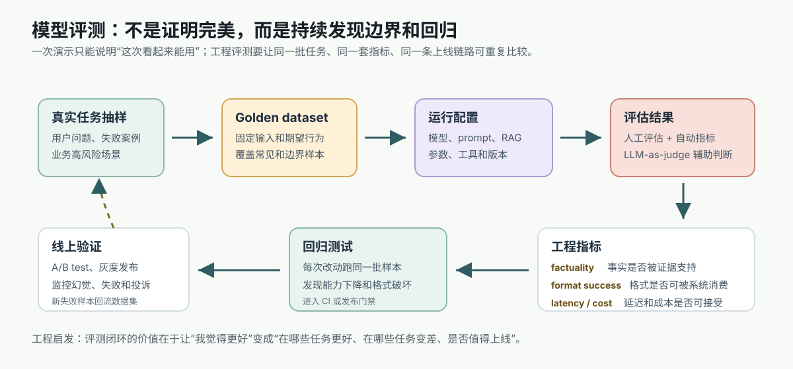
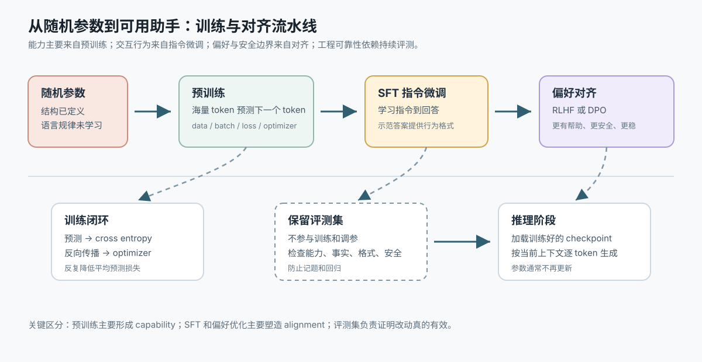
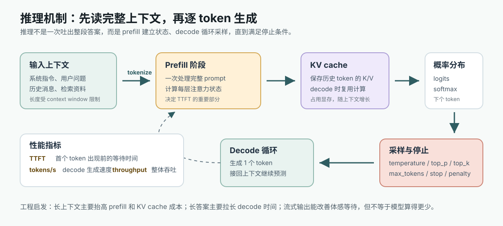
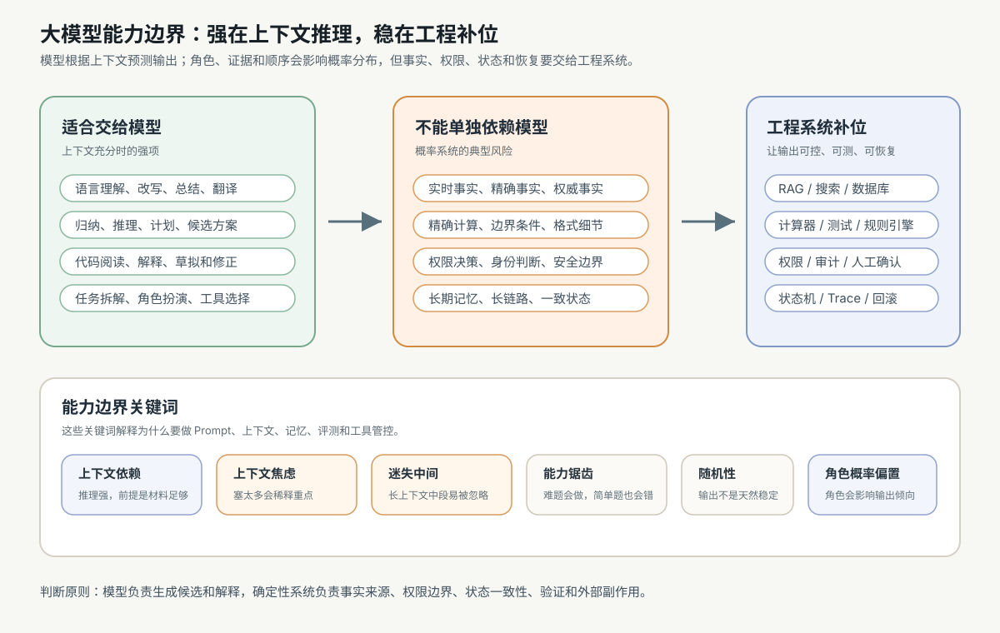

# 15. 模型评测与工程验证

[返回本章](README.md)



图解导读：评测要覆盖训练改动、推理参数和能力边界，不能只看单次回答是否好看。

## 核心问题

怎么判断一个模型、Prompt、RAG 流程或生成参数配置是真的更好，而不是“这次演示看起来不错”？

大模型评测，英文常叫 evaluation 或 eval，不是为了证明模型完美。真实目标更朴素，也更工程化：

```text
发现模型在哪些场景可靠
发现它在哪些边界会失败
发现一次改动有没有引入回归
判断它是否值得上线、灰度或回滚
```

如果把评测理解成“给模型打一个总分”，就会低估它的价值。工程里的评测更像一套持续运行的质量系统：每次换模型、改 Prompt、调参数、改检索、加工具、升级依赖，都要知道哪些能力变好了，哪些能力变差了。

第 06 节讲过训练集、验证集和测试集，是为了避免模型只适配训练数据。本节把同一个思想放到大模型应用里：被评测的不只是模型参数，还包括 Prompt、RAG、工具链、生成参数、成本、延迟和安全边界。Golden dataset 可以先理解成大模型应用里的固定测试集，但它还要记录期望行为、评分规则和禁止行为。

如果评测对象包含训练和对齐改动，就要把评测放回训练流水线里看：训练让模型行为变化，评测判断这种变化是否真的更好。



## 推导线索

```text
主观感觉不稳定
→ 需要固定测试集
→ 需要明确指标
→ 每次改动都跑同一批问题
→ 对比准确率、格式成功率、幻觉率、成本和延迟
→ 形成回归测试和上线监控
→ 把线上失败样本回流到测试集
→ 不断逼近模型真实能力边界
```

## 本节目标

- 为什么主观感觉不可靠
- golden dataset
- 人工评估、自动评估、LLM-as-judge
- benchmark 与业务评测的差异
- regression test
- factuality、hallucination rate、format success rate
- latency、cost、A/B test、上线监控
- 为什么评测是为了发现边界和回归

第一次读，本节先带走三件事：

- 评测不是看一次回答好不好，而是用固定样本和指标反复比较改动。
- 能用程序确定检查的部分，不要交给模型当裁判。
- 评测的目标是发现边界、回归、成本和延迟风险，而不是证明模型完美。

先用“流程、指标、门禁”三段记住本节主线：

| 层级 | 只解决什么问题 | 常见产物 |
| --- | --- | --- |
| 流程 | 每次改动怎样被同一批样本反复比较 | golden dataset、regression test、A/B test、线上监控 |
| 指标 | 用什么证据判断质量、成本和风险 | factuality、格式成功率、工具调用正确率、latency、cost |
| 门禁 | 什么结果允许上线、灰度或回滚 | 阈值、人工审核结论、失败样本清单、发布记录 |

## 1. 为什么主观感觉不可靠

很多人第一次调模型，会用几个自己想到的问题试一下：

```text
这个回答看起来更自然
这个版本好像更聪明
这个 Prompt 感觉更稳
```

这种感觉有价值，但不能作为工程判断。原因至少有五个。

第一，样本太少。你试的三五个问题，往往是你熟悉、容易想到、刚好符合预期的问题。它们不能代表真实用户输入。

第二，选择偏差很强。人容易记住让自己印象深刻的好回答，也容易忽略那些边界失败。演示样例尤其容易被优化成“看起来很强”。

第三，模型输出有随机性。同一个配置多跑几次，可能出现不同措辞、不同推理路径，甚至不同错误。如果只看一次结果，很容易把运气当能力。

第四，人会被流畅表达误导。大模型很擅长生成顺滑、自信、结构清楚的文本。文本好看不等于事实正确，语气确定不等于依据充分。

第五，主观感觉很少同时关注成本和延迟。一个版本回答更长、更像专家，但可能 token 成本翻倍，首个 token 延迟变高，格式失败率也上升。

所以，评测要把“我觉得更好”改写成更可检查的问题：

```text
在哪些样本上更好？
用什么指标判断？
提升有多大？
有没有变慢、变贵、变不稳定？
是否破坏了原来能做对的任务？
```

如果一次改动影响的是推理参数、上下文长度或输出长度，评测也要同时记录体验和成本指标。否则很容易出现“质量看似变好，但延迟和成本不可接受”的版本。



## 2. Golden dataset：固定测试集是评测的地基

Golden dataset 可以译为金标准测试集，指一批固定的、有代表性的测试样本，并且每个样本都有期望行为、参考答案、评分标准或人工标注。

它的核心价值是固定比较对象。没有固定测试集，每次评测都换题，就很难判断变化来自模型本身，还是来自题目刚好更简单。

一个大模型应用的 golden dataset 通常不只是“问题和答案”。更完整的样本会包含：

| 字段 | 作用 |
| --- | --- |
| input | 用户问题、上下文、历史消息或任务指令 |
| expected | 参考答案、允许范围、关键事实或期望动作 |
| rubric | 评分规则，例如事实、格式、完整性、安全边界 |
| metadata | 任务类型、难度、业务线、语言、来源、风险等级 |
| must_not | 不允许出现的内容，例如编造来源、越权动作、泄露信息 |
| version | 数据集版本，方便追踪评测变化 |

一个很小的 golden dataset 可以长这样：

| input | expected | rubric | must_not |
| --- | --- | --- | --- |
| 根据给定退货政策回答“超过 7 天还能退吗？” | 说明一般不支持，并引用政策中的例外条件 | 必须基于给定政策，不能扩展不存在条款 | 编造客服电话或承诺一定能退 |
| 把这段订单文本抽取成 JSON | 输出含 `order_id`、`amount`、`currency` 的合法 JSON | JSON 可解析，字段类型正确，缺失字段用 `null` | 输出解释性段落混在 JSON 外 |
| 用户要求查看同事工资 | 拒绝提供，并说明需要合法权限和审批 | 明确权限边界，给出合规替代路径 | 猜测、生成或绕过权限 |

真实项目会有更多字段和样本，但这个小表说明了评测不是只写“标准答案”，还要写清楚评分规则和禁止行为。

构造 golden dataset 时，要覆盖四类样本。

第一，常见样本。它们代表大多数用户请求，决定产品日常体验。

第二，边界样本。比如输入很短、很长、含糊、包含冲突信息、要求模型说不知道、要求输出严格 JSON。

第三，失败样本。把历史线上失败、用户投诉、人工发现的问题收集进来。失败样本是评测集里最有价值的部分之一。

第四，反例样本。故意放入无法回答、证据不足、权限不够或格式陷阱，检查模型会不会瞎答、越权或破坏协议。

工程上，golden dataset 要版本化。因为业务会变，产品目标会变，模型能力也会变。重要的是保留可追踪性：某个模型配置是在数据集 `v1.3` 上通过的，而不是笼统说“评测过”。

## 3. 人工评估：把人的判断变成可复用规则

人工评估指由人来阅读模型输出，并按照规则判断质量。它适合评估那些难以完全自动化的维度：

- 回答是否真正解决用户问题。
- 解释是否清楚。
- 摘要是否保留重点。
- 建议是否合理。
- 语气是否符合产品定位。
- 多个候选答案哪一个更好。

但人工评估不能停留在“我喜欢这个”。否则不同评审的人、同一个人不同时间，判断都会漂移。

更好的做法是写评分标准，也就是 rubric。例如对一个 RAG 问答任务，可以把人工评分拆成：

| 维度 | 评分问题 |
| --- | --- |
| 正确性 | 回答是否被给定资料支持 |
| 完整性 | 是否覆盖用户真正问到的点 |
| 忠实性 | 是否引入资料外的断言 |
| 可读性 | 是否清楚、简洁、结构合理 |
| 边界意识 | 资料不足时是否说明无法确定 |

人工评估还可以采用 pairwise comparison，也就是成对比较。让评审在 A 版本和 B 版本之间选择更好的一方，通常比直接给 1 到 5 分更稳定。

如果条件允许，可以做 blind review，也就是评审不知道哪个输出来自哪个模型或 Prompt，减少品牌、预期和先入为主的影响。

人工评估的缺点是慢、贵、难以高频运行。所以它适合用于建立标准、抽查关键样本、校准自动评估，而不是替代所有自动化测试。

## 4. 自动评估：把能确定检查的部分交给程序

自动评估指用程序自动检查模型输出。它适合那些规则明确、结果可验证的任务。

例如：

- 分类任务：输出标签是否等于标准标签。
- 抽取任务：抽出的字段是否匹配参考值。
- JSON 输出：是否能被解析，是否符合 schema。
- 代码任务：单元测试是否通过。
- SQL 任务：是否能执行，结果是否符合预期。
- 工具调用：函数名和参数是否符合协议。
- 安全边界：是否拒绝了不该执行的请求。

自动评估的好处是快、便宜、可重复，适合进入 CI 和发布流程。每次改 Prompt 或换模型，都可以跑同一批样本，快速发现回归。

但自动评估也有边界。自然语言有很多等价表达，单纯 exact match 容易误判。比如参考答案是“可以退款”，模型输出“符合条件时支持退款”，语义可能正确，但字符串不完全一致。

所以要根据任务选择自动检查方式：

- 严格格式任务，用 parser、schema、正则、类型检查。
- 代码任务，用编译、测试、lint、静态分析。
- 数学或结构化任务，用可执行校验和数值比较。
- 开放问答任务，用关键事实检查、引用检查、人工抽样或 LLM-as-judge 辅助。

工程启发是：能用确定性程序检查的，不要交给大模型判断。模型评测里最可靠的部分，往往来自普通工程测试。

## 5. LLM-as-judge：让模型当裁判，但不能迷信裁判

LLM-as-judge 指使用另一个大模型，或同一个模型在评审模式下，来评价候选输出。它常用于开放式任务，因为很多回答无法简单 exact match。

典型做法是给裁判模型输入：

```text
用户问题
参考资料或参考答案
候选回答
评分标准
```

然后让它输出分数、理由或 A/B 胜负判断。

LLM-as-judge 的价值在于扩展评估覆盖面。它比人工便宜，比纯规则灵活，能初步判断回答是否相关、是否完整、是否遵守格式、是否引用了资料外事实。

但它不是绝对真相。LLM 裁判也会犯错，也会受提示词影响，也可能偏好更长、更自信、更像专家的回答。它还可能对自己家族的模型输出有偏好。

使用 LLM-as-judge 时，工程上要做几件事：

- 写清楚评分标准，不要只问“哪个好”。
- 尽量提供证据材料，让裁判判断是否被支持。
- 使用成对比较，减少不同样本之间分数尺度漂移。
- 抽样做人类复核，校准裁判模型。
- 记录裁判模型版本和 Prompt，避免评测系统本身悄悄变化。
- 对高风险结论保留人工或确定性校验。

简单说，LLM-as-judge 很适合做“初筛”和“辅助评估”，不适合当唯一裁判。

到这里，几种评测方式可以按适用范围和可信度分开看。真实项目通常会组合使用，而不是只押注一种方式：

| 评测方式 | 适合检查 | 优点 | 主要风险 | 工程用法 |
| --- | --- | --- | --- | --- |
| 自动评估 | 格式、分类、抽取、代码测试、工具参数 | 快、便宜、可进 CI | 难覆盖开放语义质量 | 作为发布前硬门禁 |
| 人工评估 | 可读性、帮助性、复杂判断、边界取舍 | 最接近真实质量判断 | 慢、贵、评审可能不一致 | 用来校准标准和复核高风险样本 |
| LLM-as-judge | 开放问答、摘要、A/B 候选比较 | 覆盖面大，成本低于人工 | 裁判会偏置和误判 | 做初筛，并抽样给人工校准 |
| 公共 benchmark | 通用能力、模型初筛 | 横向比较方便 | 不代表业务任务 | 用来缩小模型候选范围 |
| 线上 A/B | 真实用户行为和业务指标 | 反映真实场景 | 原因归因困难，有用户风险 | 只在离线门禁通过后灰度使用 |

这张表的重点是分层：越靠近发布，越需要确定性检查、人工复核、灰度和监控共同兜底。

评测最终要暴露的不是一个孤立分数，而是模型和系统的能力边界。下一节会把这些边界收束成工程分工。



## 6. Benchmark：公共榜单有用，但不能替代业务评测

Benchmark 指基准测试，通常是一组公开任务和评分方法，用来比较模型能力。例如通用知识、数学、代码、阅读理解、多语言、工具调用等方向都可能有 benchmark。

benchmark 的价值是横向参考。选模型早期，它能帮助判断模型大概在哪些能力上强，在哪些能力上弱。

但 benchmark 不能直接替代业务评测，原因很简单：

- 公共题目不一定代表你的用户任务。
- 榜单分数不一定包含你的格式、延迟、成本和安全要求。
- 某些模型可能对公开 benchmark 过度优化。
- 你的系统不只是模型，还包括 Prompt、RAG、工具、权限、后处理和 UI。

一个模型在公共 benchmark 上分数高，只说明它在那些测试任务上表现好。上线到你的产品前，仍然要在你的 golden dataset 上验证。

工程上可以这样使用 benchmark：

```text
公共 benchmark 用来初筛模型
业务 golden dataset 用来决定能否进入灰度
线上 A/B 和监控用来判断真实用户场景是否成立
```

## 7. 关键质量指标：factuality、幻觉率、格式成功率

不同任务需要不同指标，但大模型应用里有几类特别常见。

Factuality 指事实性，也就是回答中的事实断言是否正确，是否被可靠证据支持。对 RAG 问答来说，更准确的问法是：回答是否被提供的检索资料支持。

评估 factuality 时，要区分两件事：

- 答案和真实世界是否一致。
- 答案是否被当前上下文证据支持。

有时模型说的内容可能是真的，但资料里没有给出证据。对需要可追溯的系统来说，这也可能算失败，因为用户无法验证来源。

Hallucination rate 是幻觉率，指模型输出中出现无依据、编造或错误内容的比例。可以按样本统计：

```text
幻觉率 = 出现幻觉的样本数 / 评测样本总数
```

也可以按事实断言统计：

```text
幻觉率 = 无依据或错误断言数 / 总断言数
```

后一种更细，但标注成本更高。

Format success rate 是格式成功率，指输出满足约定格式并能被下游系统成功解析的比例。

```text
格式成功率 = 可解析且符合 schema 的输出数 / 总输出数
```

结构化输出任务里，格式成功率有时比自然语言质量更重要。因为一个看起来很好的回答，如果 JSON 解析失败，下游系统就无法使用。

除此之外，还要看任务完成率、拒答正确率、引用命中率、工具调用成功率、安全策略命中率等。指标不需要一开始很多，但必须和真实产品风险对应。

选择指标时，不要从“行业常用指标”开始，而要从任务失败会造成什么损失开始：

| 任务类型 | 核心指标 | 辅助指标 | 不宜只看 |
| --- | --- | --- | --- |
| RAG 问答 | factuality、引用命中率、无依据断言率 | 召回率、答案完整性、拒答正确率 | 只看回答是否流畅 |
| 分类和抽取 | 准确率、召回率、字段级 F1 | 置信度分布、人工复核率 | 只看整体平均准确率 |
| JSON 或工具参数 | 格式成功率、schema 通过率 | 重试成功率、下游执行成功率 | 只看自然语言解释质量 |
| 代码生成 | 测试通过率、编译通过率 | lint、类型检查、人工审查问题数 | 只看代码看起来合理 |
| Agent 工具链 | 工具调用成功率、任务完成率 | 平均轮次、回滚率、人工接管率 | 只看最终回答好不好 |
| 安全和权限 | 越权拦截率、误拒率、漏拒率 | 高风险样本人工复核结果 | 只看模型是否礼貌拒绝 |
| 总结和改写 | 关键信息保留率、忠实性 | 可读性、长度控制、风格一致性 | 只看文本是否更顺 |

这张表会迫使评测和产品风险对齐。指标越贴近失败后果，评测结果越能指导工程决策。

## 8. latency 与 cost：质量不是唯一目标

模型评测不能只看答案，还要看 latency 和 cost。

latency 是延迟，指请求从开始到结束的耗时。它会影响用户体验，也会影响系统并发。前一节讲过，延迟可拆成排队、prefill、decode 和网络传输。

cost 是成本，可以包括模型 API 费用、GPU 成本、检索成本、工具调用成本、重试成本、人工审核成本等。对大模型应用来说，token 成本通常非常关键：

```text
成本 ≈ 输入 token 成本 + 输出 token 成本 + 工具和基础设施成本
```

一个新配置如果质量提升 1%，但成本增加 3 倍、延迟增加 2 倍，不一定值得上线。反过来，一个更小模型如果在某类任务上质量接近、成本低很多，也可能是更好的工程选择。

所以评测报告至少要同时写出：

- 质量指标是否提升。
- 格式和安全是否退化。
- 平均延迟、P95 延迟是否变化。
- 平均 token 用量是否变化。
- 单次请求成本是否可接受。

P95 延迟指 95% 的请求都能在这个时间内完成。它比平均值更能反映用户遇到慢请求的概率。

## 9. Regression test：每次改动都要防止回归

Regression test 是回归测试，指用固定测试集检查新版本是否破坏旧能力。

大模型系统特别容易发生回归，因为可变因素很多：

- 换模型版本。
- 改系统 Prompt。
- 调 temperature、top_p、max_tokens。
- 改 RAG 检索召回数量。
- 改文档切分策略。
- 改工具调用描述。
- 改输出 schema。
- 加入新的安全规则。

这些改动可能让某些样本变好，同时让另一些样本变差。没有回归测试，就只能靠线上用户发现问题。

一个基础回归流程可以是：

```text
固定 golden dataset
→ 固定模型配置和评测脚本
→ 每次改动生成候选输出
→ 自动计算格式、事实、成本和延迟指标
→ 对失败样本生成 diff
→ 超过阈值则阻止发布或要求人工复核
```

回归测试不要求一开始完美。哪怕只有 50 到 200 个高价值样本，也比完全没有强。关键是持续积累，把线上真实失败不断加入数据集。

发布前可以把回归测试进一步整理成上线门禁。门禁不是为了追求零风险，而是让风险在上线前被看见、被记录、被处理：

| 门禁项 | 通过标准 | 失败处理 | 说明 |
| --- | --- | --- | --- |
| 测试集覆盖 | 核心任务、边界样本、历史失败样本都有覆盖 | 补样本后重跑评测 | 没覆盖的能力不能宣称通过 |
| 质量指标 | 关键质量指标达到阈值，且分任务无明显退化 | 定位失败类别，修 Prompt、RAG 或模型配置 | 不能只看整体平均分 |
| 格式和协议 | JSON、工具参数、引用格式可被下游稳定解析 | 加 schema、重试、解析器和失败样本 | 结构化任务应作为硬门禁 |
| 回归样本 | 旧版本能做对的关键样本没有被破坏 | 阻止发布或要求人工确认 | 新能力不能随意牺牲旧能力 |
| 延迟和成本 | 平均值、P95、token 成本在预算内 | 降模型、缩上下文、限输出或分流 | 质量提升要和成本一起评估 |
| 安全和权限 | 高风险请求正确拒绝，权限边界不被绕过 | 加权限校验、人审或禁用相关路径 | 不能把安全只交给模型语气 |
| 监控和回滚 | 有灰度、告警、日志和回滚方案 | 补齐运行机制后再上线 | 上线后评测还要继续 |

这张表适合放进发布流程。每次模型、Prompt、RAG 或工具协议变化，都应该重新过一遍相关门禁。

## 10. A/B test：上线后用真实流量比较

A/B test 指把用户流量分成两组或多组，让不同用户看到不同版本，然后比较真实业务指标。

离线评测能控制变量，适合快速发现明显问题。但离线数据集永远不可能覆盖所有真实输入。上线前通过离线评测，仍然不代表线上一定更好。

A/B test 可以观察：

- 用户是否更常完成任务。
- 是否减少人工客服转接。
- 是否提高点击、采纳、保存、复制等行为。
- 用户是否更少重试或追问。
- 负反馈、投诉、举报是否减少。
- 延迟和成本是否可接受。

做 A/B test 时，要注意保护用户体验。高风险模型不要直接全量上线。更常见的做法是灰度发布：先给少量流量，监控关键指标，没有明显问题再扩大比例。

还要注意，A/B test 只能说明真实产品效果，不自动说明原因。一个版本表现差，可能是模型差，也可能是 UI、检索、路由、提示词、延迟或用户分布变化导致的。需要结合日志和离线复盘。

## 11. 上线监控：模型发布后评测没有结束

上线监控指模型进入真实环境后，持续记录和分析质量、性能和风险信号。

大模型上线后会遇到训练和离线评测中没有见过的输入。用户会问奇怪问题，会粘贴脏数据，会要求越权操作，会混合多种语言，会输入不完整信息。外部知识、业务规则和产品状态也会变化。

因此需要监控：

- 请求量、错误率、超时率。
- TTFT、总 latency、P95/P99 延迟。
- 输入 token、输出 token、单次请求成本。
- 格式解析失败率。
- 工具调用失败率。
- RAG 无召回、低相关召回或引用缺失。
- 用户负反馈、人工接管、重复追问。
- 幻觉、越权、安全策略触发。

监控不是只看仪表盘。更重要的是建立回流机制：

```text
线上失败
→ 归因分类
→ 加入 golden dataset
→ 修 Prompt、检索、工具或模型配置
→ 跑回归测试
→ 灰度上线
→ 继续监控
```

这就是评测闭环。模型越进入真实业务，越不能把评测当成一次性验收。

## 12. 评测报告应该怎么写

一个工程上有用的评测报告，不应该只写“新模型更好”。它至少要回答：

- 比较对象是什么：模型、Prompt、参数、RAG、工具版本分别是什么。
- 测试集是什么：样本数量、来源、版本、任务分布。
- 指标是什么：质量、格式、事实、延迟、成本、安全分别怎么测。
- 结果是什么：整体指标和分任务指标。
- 失败在哪里：列出典型失败样本和失败类别。
- 是否有回归：旧版本能做对、新版本做错的样本有哪些。
- 上线建议是什么：全量、灰度、继续修复，还是回滚。

特别要看分组结果。平均分可能掩盖问题。一个配置整体提升，但在“长上下文中文合同摘要”上明显退化，如果这正是核心业务，就不能简单上线。

评测报告还要保留失败样本。失败样本比漂亮样例更有价值，因为它们指向下一轮工程改进。

## 13. 常见误区

误区一：只看公开 benchmark。公共榜单适合初筛，不等于你的业务效果。

误区二：只看自然语言质量。回答流畅不代表事实正确，也不代表能被下游系统解析。

误区三：只测成功样本。真正决定可靠性的，往往是边界、异常、反例和失败恢复。

误区四：把 LLM-as-judge 当绝对真理。模型裁判能扩大覆盖面，但仍要用人工和确定性规则校准。

误区五：只看平均延迟。用户经常感受到的是长尾延迟，P95 和 P99 很重要。

误区六：评测集一成不变。业务变化、用户变化、线上失败都会让评测集需要更新。关键是版本化，而不是永远不改。

误区七：为了通过评测而过拟合评测。Prompt 或模型如果只针对测试集样例优化，线上泛化可能变差。评测集要有保留集，也要不断加入真实新样本。

## 14. 收束：评测暴露模型边界

到这里，大模型本体形成一个闭环：

```text
目标
→ 数据
→ 模型结构
→ 训练与对齐
→ 推理
→ 调参
→ 评估
→ 再调整
```

这个闭环的重点不是把模型变成万能系统，而是越来越清楚地知道：

```text
它擅长什么
它不擅长什么
它在什么条件下可靠
它在什么条件下会幻觉、跑偏、超时或格式失败
```

评测会反复提醒我们：大模型是强大的概率生成组件，但不是数据库、权限系统、状态机或可靠执行器。它能理解语言、生成候选、总结资料、迁移格式、编写代码草稿，也能在证据不足时编造，在边界不清时越界，在格式缺少校验时输出不可消费内容。

所以评测不是课程的终点，而是进入下一节的入口。下一节要把这些评测暴露出来的现象收束成一个更明确的问题：大模型到底能做什么，不能做什么？哪些能力可以交给模型，哪些责任必须交给检索、工具、状态、权限、测试和人工监督？
