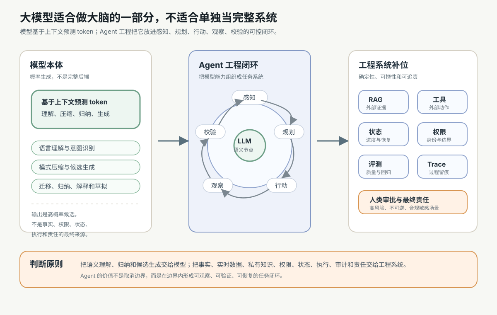
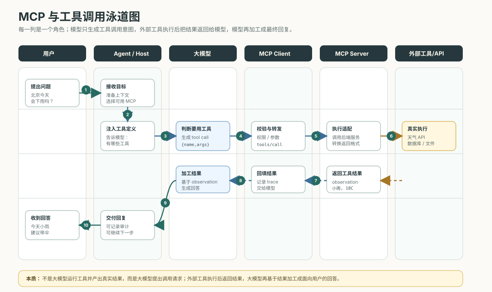

# 16. 大模型能做什么，不能做什么

[返回本章](README.md)



图解导读：能力边界不是一句“会幻觉”，而是上下文、工具、状态、权限、评测和 Agent 闭环共同决定的工程分工。

前面几节已经讲过 token、embedding、Attention、Transformer、训练、推理参数和评测。到这里需要收束成一个工程判断：大模型很强，但它不是完整的软件系统。它适合做“大脑的一部分”，不适合单独承担事实、权限、状态、执行、审计和最终责任。

本章要回答一个实际开发中最容易混淆的问题：

```text
哪些事应该交给大模型？
哪些事不能只靠大模型？
哪些事必须由工程系统补齐？
为什么后面还需要 Agent？
```

## 先给结论

大模型的本质，是一个基于上下文预测 token 的概率生成模型。它读取当前输入、历史消息、系统指令、检索材料和工具结果，把这些内容压缩成内部表示，然后预测下一个 token 的概率分布，再逐 token 生成输出。

所以它更适合承担这些语义型工作：

- 理解自然语言意图。
- 压缩和归纳上下文中的模式。
- 生成候选答案、候选代码、候选方案和候选结构。
- 根据少量示例迁移格式、风格和任务方法。
- 在模糊、开放、非结构化场景中做初步判断和解释。

但下面这些职责不能只由模型文本输出承担：

- 数据库。
- 搜索引擎。
- 权限系统。
- 状态机。
- 确定性执行器。
- 审计系统。
- 高风险场景里的最终责任主体。

一句话概括：

```text
模型负责理解、归纳、生成和提出候选；
工程系统负责事实、实时性、私有知识、权限、状态、执行、验证、审计和责任边界。
```

## 大模型是什么

大模型不是“会思考的人”被装进软件里。更准确地说，它是一个在海量数据上训练出来的概率生成模型。

它的最小工作方式可以简化为：

```text
输入上下文
→ 转成 token 和向量
→ Transformer 计算上下文关系
→ 输出下一个 token 的概率分布
→ 解码策略选择 token
→ 把新 token 追加回上下文
→ 继续预测下一个 token
```

这条最小链路可以和 next-token 循环图对应起来看：模型每一步都只是在当前上下文下预测下一个 token，然后把结果接回上下文。


这里的关键是“基于上下文”。模型每次生成都依赖它当前能看到的内容。上下文里有证据，它更可能围绕证据回答；上下文里有格式示例，它更可能模仿格式；上下文里有错误或噪声，它也可能把错误当成线索继续展开。

大模型的强项主要来自四个方面：

| 强项 | 含义 | 工程价值 |
| --- | --- | --- |
| 语言理解 | 能把自然语言意图、约束、语气和隐含目标转成可处理的任务表示 | 让用户不用学习复杂表单或命令 |
| 模式压缩 | 能从训练数据和当前上下文中压缩出常见结构、流程和表达模式 | 适合总结、分类、抽取、改写和代码草拟 |
| 候选生成 | 能在不确定问题上快速生成多个可能答案或方案 | 适合头脑风暴、规划草案、代码补全和诊断假设 |
| 迁移和归纳 | 能根据少量示例把一种格式、风格或解法迁移到新输入 | 适合 few-shot、模板泛化、跨领域解释和任务路由 |

这些能力很适合处理“输入不规整、目标有语义、答案需要组织”的问题。例如读一段需求并生成任务拆解，读一段日志并提出排查方向，读几份文档并整理成对比表，读一段代码并解释可能的 bug。

但注意：这些能力产生的是“高概率输出”，并不自动带来事实保证，也不能直接等同于可执行的业务动作。

## 大模型不是什么

很多 AI 系统的问题，不是模型不够聪明，而是把不该交给模型的职责交给了模型。

| 大模型不是什么 | 常见误用 | 为什么不可靠 | 应由谁承担 |
| --- | --- | --- | --- |
| 不是数据库 | 让模型直接回答库存、订单、余额、配置、历史记录 | 参数知识不是实时数据，也不能保证完整一致 | 数据库、缓存、业务 API |
| 不是搜索引擎 | 让模型凭记忆回答最新政策、价格、新闻、版本差异 | 模型训练有截止时间，且不会自动联网验证 | 搜索、RAG、实时数据源 |
| 不是权限系统 | 让模型判断用户能不能看某条数据、能不能执行某个动作 | 权限需要身份、角色、资源、策略和审计，不能靠概率判断 | IAM、ACL、RBAC、ABAC、业务权限层 |
| 不是状态机 | 让模型记住流程走到哪一步、哪些步骤已完成 | 聊天上下文会丢失、被截断、被污染，也不具备事务语义 | 状态表、workflow、事务系统 |
| 不是确定性执行器 | 让模型直接负责转账、发货、删库、发布、提交审批 | 模型输出不是执行，执行需要参数校验、幂等、回滚和错误处理 | 工具层、服务端逻辑、任务队列 |
| 不是审计系统 | 让模型事后解释“它为什么这么做”就当作审计记录 | 解释可能是事后生成，不等于真实执行轨迹 | 日志、trace、事件流、不可篡改记录 |
| 不是最终责任主体 | 让模型在医疗、法律、金融、安全等场景做最终决策 | 高风险决策需要责任人、制度、合规和复核 | 人类专家、组织流程、合规系统 |

把这些职责交给模型，会让系统看起来“智能”，但在生产环境里会变成不稳定、不可复现、不可审计、不可追责。

如果上表里的工程词不熟，可以先按下面的小抄理解。这里不是要求你马上掌握后端实现，而是帮助判断：哪些职责不能只交给模型文本承诺。

| 术语 | 一句话理解 |
| --- | --- |
| IAM / ACL / RBAC / ABAC | 不同类型的权限控制方法，用来判断谁能对什么资源做什么动作 |
| workflow | 把多步骤任务变成有状态、有分支、有重试的流程 |
| 状态机 | 明确记录任务处于哪个状态，以及哪些状态转换合法 |
| 幂等 | 同一个操作重复执行多次，结果仍然可控，不会重复扣款或重复提交 |
| 事务 | 一组操作要么都成功，要么都回滚，避免半完成状态 |
| 回滚 | 失败或误操作后，把系统恢复到之前的可信状态 |
| trace | 可追踪的执行轨迹，记录请求、工具调用、返回结果和错误 |

## 能做什么

大模型适合做的事情，通常有一个共同特征：它们需要语义理解、模式归纳或表达生成，但不要求模型单独提供最终事实和最终动作。

典型场景包括：

| 场景 | 模型适合承担 | 需要工程补位 |
| --- | --- | --- |
| 问答 | 理解问题、组织答案、解释证据 | 证据检索、引用来源、事实校验 |
| 总结 | 提炼重点、压缩长文、生成摘要 | 输入分块、覆盖率检查、关键事实保留 |
| 分类和抽取 | 根据语义判断类别、抽取字段 | schema 校验、置信度阈值、人工复核 |
| 写作和改写 | 调整结构、语气、风格和表达 | 事实来源、品牌规范、敏感内容审核 |
| 代码辅助 | 解释代码、生成草案、定位可能问题 | 测试、lint、类型检查、代码评审 |
| 数据分析辅助 | 生成 SQL、解释指标、提出分析路径 | 数据库执行、权限控制、结果校验 |
| 任务规划 | 拆解步骤、识别依赖、提出风险 | workflow、状态管理、工具执行和验收 |

因此，正确姿势不是问“这个任务能不能让模型做”，而是问：

```text
这个任务里，哪一部分需要语义和生成？
哪一部分需要确定性、事实性、权限、状态和执行？
```

前者可以交给模型，后者应该交给工程系统。

## 能力边界

大模型的能力边界不是一句“会幻觉”就能概括。真实工程里至少要拆成九类边界。

| 边界 | 具体表现 | 根因 | 工程处理 |
| --- | --- | --- | --- |
| 事实边界 | 生成听起来合理但不真实的事实、引用、数字或结论 | 模型预测的是高概率文本，不是查询真值表 | RAG、数据库查询、引用来源、事实校验 |
| 实时性边界 | 不知道最新价格、政策、新闻、代码版本、线上状态 | 参数知识有训练截止时间，请求时不会自动更新 | 实时搜索、API、监控数据、版本锁定 |
| 私有知识边界 | 不知道公司内部文档、用户数据、私有仓库和业务规则 | 没有被放进上下文、检索系统或工具结果 | 权限感知 RAG、内部知识库、业务 API |
| 上下文边界 | 长文中漏掉关键信息，或被无关内容干扰 | 上下文窗口有限，注意力和位置也有偏差 | 分块、摘要、重排、证据索引、上下文裁剪 |
| 随机性边界 | 同样问题多次回答不完全一致，边界题可能波动 | 解码策略、模型版本、上下文细节都会影响输出 | 降低 temperature、固定 schema、回归评测 |
| 执行边界 | 模型说“已完成”，但外部系统没有发生动作 | 生成文本不等于调用工具，更不等于事务提交 | 工具调用、结果回传、幂等、重试和回滚 |
| 权限边界 | 模型可能建议访问不该访问的数据或执行越权动作 | 模型没有天然身份、资源和策略判断能力 | 应用层鉴权、工具分级、最小权限、人审 |
| 成本和延迟边界 | 长上下文、多轮推理和工具循环带来高成本、高延迟 | token、模型规模、工具等待和重试都会累积 | 预算控制、缓存、模型路由、轮次限制 |
| 高风险责任边界 | 医疗、法律、金融、安全等场景不能由模型最终拍板 | 风险影响现实权益，需要合规、责任和复核 | 人类审批、专业审核、留痕、拒绝自动化 |

这些边界不是“模型没用”的证明，而是工程分工的起点。模型越强，越应该被放进更清晰的系统边界里使用，因为强模型会让错误更像真的，也会让越权建议更像合理方案。

这张边界图适合在这里回看：它把“事实、实时性、私有知识、上下文、执行、权限、成本、责任”等问题放到同一个系统视角里。


## 工程分工

一个可靠的 AI 应用，不能只有“用户输入 + Prompt + 模型输出”。至少要把职责拆开。

| 组件 | 负责什么 | 不负责什么 |
| --- | --- | --- |
| 模型 | 理解意图、归纳上下文、生成候选、解释结果、选择可能路径 | 不负责最终事实、权限、状态、执行和责任 |
| Prompt | 说明任务目标、角色边界、输出格式、约束和拒绝条件 | 不负责补齐缺失事实，也不能替代权限控制 |
| RAG | 检索外部知识，把相关证据放进上下文，并提供可追溯来源 | 不负责执行动作，也不保证模型一定正确引用 |
| 工具 | 调用搜索、数据库、文件系统、代码执行器、业务 API 等外部能力 | 不负责决定用户是否有权限，也不负责最终验收 |
| 状态系统 | 持久化任务进度、步骤结果、失败次数、检查点和结单状态 | 不负责生成自然语言推理 |
| 权限系统 | 判断身份、角色、资源、动作和风险级别，限制工具能力 | 不负责语义解释，也不应被模型绕过 |
| 评测系统 | 用样例、回归、指标和人工标注判断行为是否可靠 | 不负责线上每次请求的权限和状态 |
| 日志和 trace | 记录输入、输出、工具调用、观察结果、错误和审批过程 | 不负责事后编造解释，也不替代真实事件记录 |
| 人类审批 | 对高风险、不可逆、合规敏感或信息不足的动作做最终确认 | 不负责替模型完成所有低风险重复劳动 |

这张表决定了 AI 工程的基本架构：

```text
模型不是系统中心的一切
模型是系统中的一个强语义节点
```

它可以参与决策，但不能绕过业务规则；它可以提出工具调用，但不能跳过权限校验；它可以解释结果，但不能替代 trace；它可以生成方案，但不能替组织承担责任。

如果把这张分工表落到一次真实请求里，可以按控制点来检查责任有没有放错位置：

| 控制点 | 模型可以参与 | 必须由工程系统承担 | 失败时的处理 |
| --- | --- | --- | --- |
| 输入进入系统 | 理解用户意图、识别缺失信息 | 身份识别、权限上下文、输入脱敏 | 拒绝、追问或降级处理 |
| 检索和取数 | 生成检索词、解释证据差异 | 权限过滤、数据源选择、召回记录 | 返回无证据状态，不让模型凭空补 |
| 生成工具参数 | 草拟函数名、参数和值的含义 | schema 校验、类型校验、业务规则校验 | 阻止调用，要求模型修正或转人工 |
| 执行动作 | 解释为什么需要动作 | 鉴权、幂等、事务、超时、回滚 | 记录错误，恢复状态，必要时人工确认 |
| 保存进度 | 总结当前步骤和下一步建议 | 持久化状态、检查点、失败次数 | 从检查点恢复，而不是依赖聊天记忆 |
| 输出结果 | 组织语言、解释证据和限制 | 事实核验、引用、审计日志 | 标记不确定性，保留可追踪记录 |
| 复盘追踪 | 帮助归因失败类别 | 日志、trace、指标、评测集回流 | 把失败样本加入回归测试 |

这张表强调的是“模型参与语义，系统控制边界”。只要某个控制点会影响事实、权限、状态或外部副作用，就不能只靠模型文本承诺。

当这些控制点进入多轮任务时，上下文装配就变成工程核心：哪些证据、状态、工具结果和约束被放进窗口，会直接影响模型下一步的判断。


## 长上下文变便宜后，Agent 的难点会转移

长上下文效率提升，对 Agent 特别关键。因为 Agent 不只是读一段用户问题，它还要在长任务里持续保留目标、计划、工具调用历史、失败尝试、环境状态、代码上下文和验证结果。

过去上下文昂贵时，很多系统必须频繁摘要、裁剪、分块和重新检索。这样能省成本，但也容易丢细节：前面失败过的方案被遗忘，某个工具返回的错误码被压缩掉，代码仓库里的约束没有持续留在窗口里。长上下文如果更便宜，Agent 就更有机会把完整工作现场放进当前上下文，减少“因为记不住而重复犯错”。

但这不表示 Agent 会自然变可靠。失败模式会从“上下文放不下、记不住”逐渐转向另外三类问题：

| 新的关键问题 | 表现 | 工程应对 |
| --- | --- | --- |
| 会不会规划 | 有很多历史信息，但不会拆优先级、不会识别依赖 | 明确目标、计划检查点、任务分解和停止条件 |
| 会不会验证 | 读了完整上下文，却不跑测试、不核对证据、不检查工具结果 | 强制验证节点、回归测试、结构化 observation |
| 能不能持续执行 | 上下文里有失败历史，但循环修补、预算失控或状态污染 | workflow、状态机、预算限制、trace 和人工接管 |

所以长上下文不是替代 Agent 工程，而是把 Agent 工程的重点往后推了一层：少一些“记忆容量不足”的问题，多一些“规划、验证、执行纪律不足”的问题。真正可靠的 Agent 仍然需要状态系统、权限系统、工具层、评测系统和日志 trace。

## 为什么需要 Agent



MCP 图第一次读时不用理解协议细节，只看三件事：模型提出调用意图，工具层执行真实动作，执行结果再回到上下文。协议和源码实现会在后面的工具调用与 MCP 章节展开。

先用一个最小故事把分工串起来。用户说：“根据公司制度判断这张发票能不能报销，如果可以就帮我提交申请。”

```text
模型：理解用户目标，识别需要“制度、发票信息、用户身份、额度、提交动作”。
RAG：检索公司报销制度和例外条款，把证据放进上下文。
工具：读取发票字段、查询用户部门和剩余额度。
权限系统：判断当前用户是否能提交这类申请，是否需要主管审批。
状态系统：记录申请处于“待补材料 / 待审批 / 已提交 / 失败”哪一步。
评测和日志：检查模型是否引用了制度、工具参数是否正确，并记录完整 trace。
Agent：把这些步骤按目标组织起来，缺信息时追问，工具失败时恢复，高风险动作前请求确认。
```

这个例子里，模型很重要，但它只负责语义理解、解释证据和生成候选动作；事实、权限、状态、执行和审计都由工程系统承担。

如果大模型只生成一次回答，很多任务仍然完不成。真实任务往往需要多步推进：

- 先理解用户目标。
- 再判断缺什么信息。
- 需要时检索知识或读取文件。
- 需要时调用工具执行动作。
- 执行后观察结果。
- 根据结果修正计划。
- 最后验证是否达到目标。

这就是 Agent 出现的原因。但 Agent 不是让模型变成万能后端，而是把模型放进一个工程闭环里：

```text
感知
→ 规划
→ 行动
→ 观察
→ 校验
→ 必要时继续循环或转人工
```

在这个闭环中：

| 环节 | 模型的作用 | 工程系统的作用 |
| --- | --- | --- |
| 感知 | 理解用户目标、上下文和当前 observation | 收集输入、检索证据、读取状态 |
| 规划 | 生成任务拆解、候选路径和下一步建议 | 限制流程、设置预算、定义完成标准 |
| 行动 | 选择可能需要的工具和参数草案 | 校验参数、鉴权、执行工具、处理幂等 |
| 观察 | 解释工具结果、识别错误和缺口 | 返回结构化 observation、记录 trace |
| 校验 | 判断结果是否满足语义目标，提出修正 | 跑测试、查规则、做评测、触发人审 |

因此，Agent 的本质不是“更自由的模型”，而是“被工程系统组织起来的模型能力”。它把模型的语言理解、模式归纳和候选生成能力，接到 RAG、工具、状态、权限、评测和日志上，让任务可以持续推进，也可以被限制、被观察、被恢复。

闭环越长，越需要把风险显式放进系统设计里。一个 Agent 不该只定义“能调用什么”，还要定义“什么时候停、谁来验、失败后怎么恢复”：

| 闭环风险 | 常见触发方式 | 工程约束 | 是否让模型自行决定 |
| --- | --- | --- | --- |
| 目标漂移 | 多轮规划后偏离用户原始目标 | 固定任务目标、每轮对照完成标准 | 不应该，需要状态和验收规则约束 |
| 工具误用 | 选择了高风险工具或参数不完整 | 工具分级、参数 schema、权限校验 | 不应该，需要工具层拦截 |
| 死循环 | 反复检索、反复修正、无法收敛 | 最大轮次、预算、超时和停止条件 | 不应该，需要硬限制 |
| 状态污染 | 把失败中间结果当成真实状态 | 状态机、检查点、事务提交规则 | 不应该，需要系统持久化和回滚 |
| 观察误读 | 工具返回错误或空结果，模型解释成成功 | 结构化 observation、错误码、结果校验 | 不应该，需要明确成功条件 |
| 权限扩散 | 为完成任务尝试访问更多数据或工具 | 最小权限、按动作鉴权、人工审批 | 不应该，需要权限系统裁决 |
| 成本失控 | 长上下文、多工具、多次重试叠加 | token 预算、模型路由、缓存和告警 | 不应该，需要预算控制 |

这张表不是削弱 Agent，而是让 Agent 能进入生产环境。自由度越高，边界越要明确。

## 常见误区

### 误区一：模型越强，工程越少

实际相反。模型越强，能处理的任务越复杂，外部系统越要清楚地管理事实、权限、状态、成本和风险。否则模型会把复杂错误包装成流畅答案。

### 误区二：Prompt 写清楚就能解决可靠性

Prompt 能改善单次生成行为，但不能提供实时数据，不能执行事务，不能保证权限，不能保存状态，也不能自动形成审计记录。Prompt 是控制面的一部分，不是完整控制系统。

### 误区三：RAG 能解决所有幻觉

RAG 只解决“把外部证据放进上下文”的问题。它不能保证检索一定召回正确材料，也不能保证模型一定忠实使用证据。还需要检索评测、引用约束、答案校验和失败兜底。

### 误区四：工具调用等于可靠执行

工具只是让系统能连接外部世界。可靠执行还需要参数校验、权限控制、幂等、错误处理、回滚、trace 和人类审批。否则工具越多，风险入口越多。

### 误区五：Agent 就是让模型自己循环

自由循环很容易带来死循环、成本失控、状态混乱和越权尝试。生产 Agent 应该有最大轮次、预算限制、状态机、工具分级、验证节点和人工接管条件。

## 最小判断框架

设计一个大模型功能时，可以用这组问题快速拆分职责：

| 问题 | 如果答案是“是” | 应该怎么做 |
| --- | --- | --- |
| 结果依赖真实数据吗？ | 是 | 从数据库、API、搜索或 RAG 获取证据 |
| 结果依赖最新信息吗？ | 是 | 接实时数据源，不让模型凭记忆回答 |
| 涉及私有数据吗？ | 是 | 做身份鉴权、权限过滤和最小化上下文 |
| 需要跨多步完成吗？ | 是 | 用 workflow 或状态系统记录进度 |
| 会产生外部副作用吗？ | 是 | 通过工具层执行，并做确认、幂等和回滚 |
| 失败会造成严重后果吗？ | 是 | 限制自动化，加入人工审批和审计 |
| 输出需要稳定格式吗？ | 是 | 用 schema、解析器、校验器和回归测试 |
| 成本或延迟敏感吗？ | 是 | 做模型路由、缓存、轮次限制和超时控制 |

这个框架的目的，是避免把所有问题都写进 Prompt。Prompt 应该描述任务，工程系统应该承载约束。

## 本章总结

大模型是一个基于上下文预测 token 的概率生成模型。它强在语言理解、模式压缩、候选生成、迁移和归纳，所以适合承担语义理解、内容生成、任务拆解、信息抽取、代码辅助和方案草拟。

大模型不适合单独当完整系统。它不是数据库，不是搜索引擎，不是权限系统，不是状态机，不是确定性执行器，不是审计系统，也不是最终责任主体。

可靠 AI 应用的核心不是“相信模型”，而是“正确分工”：

```text
模型承担语义和生成
Prompt 约束单次行为
RAG 提供外部证据
工具连接外部系统
状态系统记录确定进度
权限系统控制动作边界
评测系统发现行为缺陷
日志和 trace 保留真实过程
人类审批处理高风险责任
```

这也是后面进入 Agent 开发的起点。Agent 不是把大模型升级成万能系统，而是把大模型放进“感知-规划-行动-观察-校验”的工程闭环，让模型成为任务系统里的强语义组件，而不是失控的唯一大脑。

---

[返回本章](README.md)
