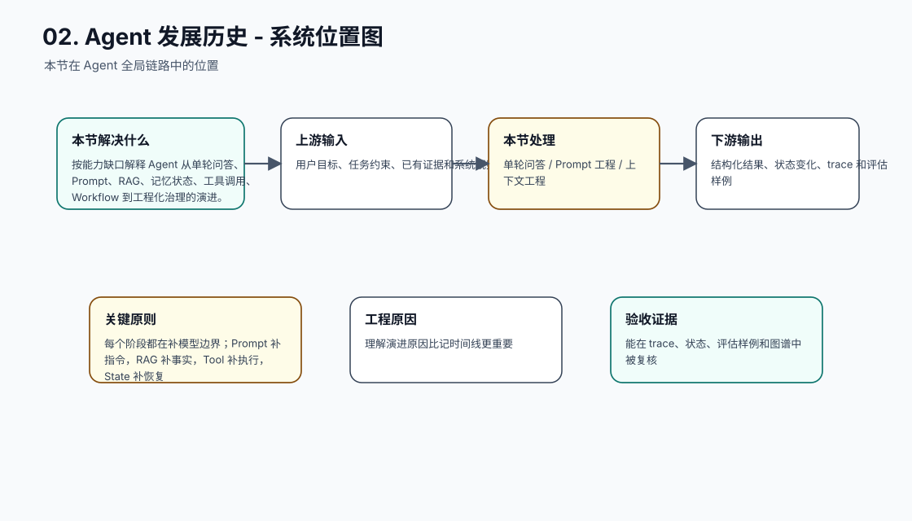
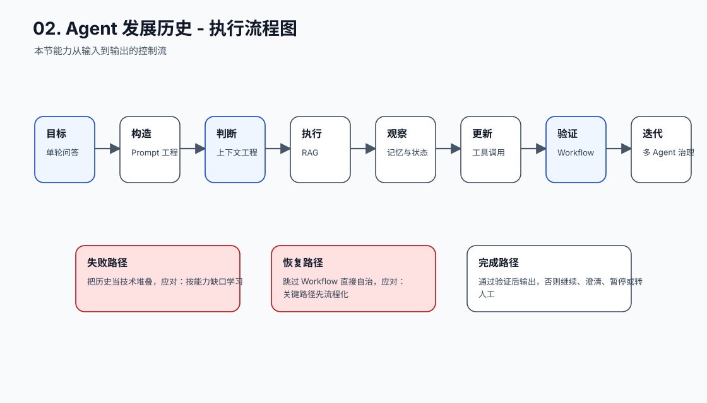
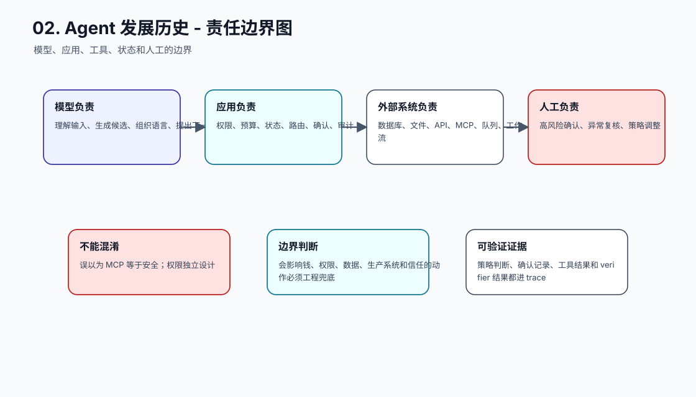
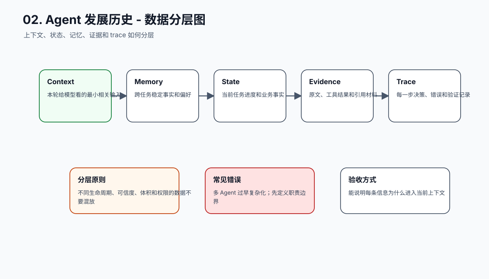
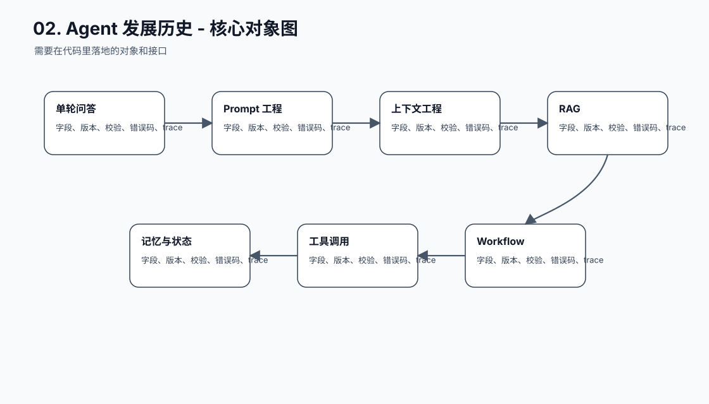
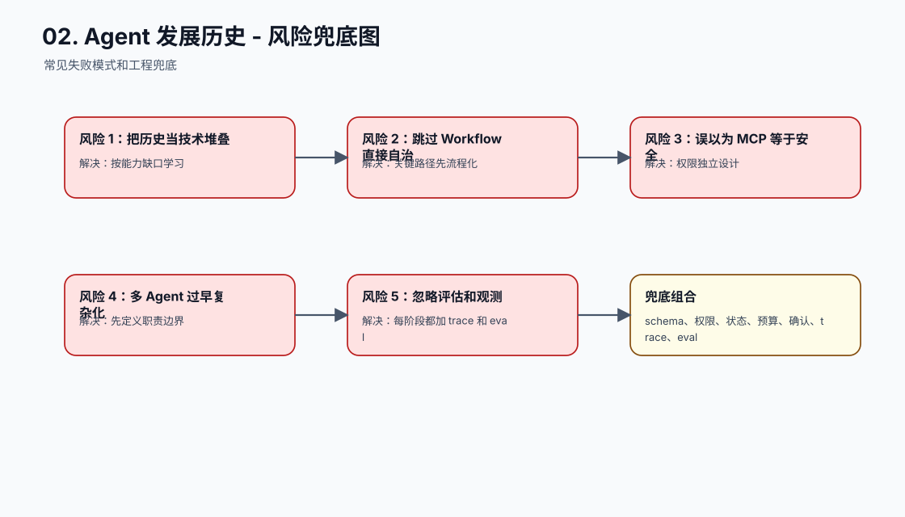
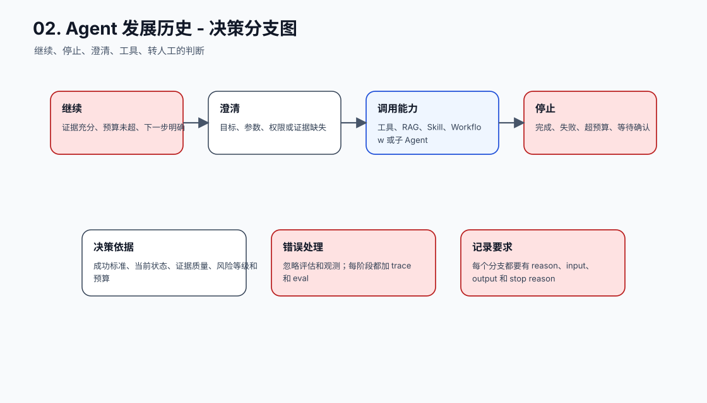
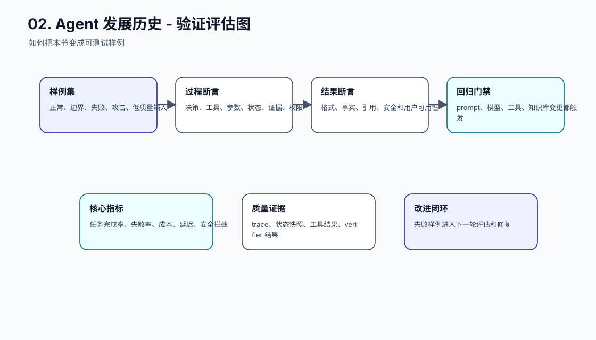
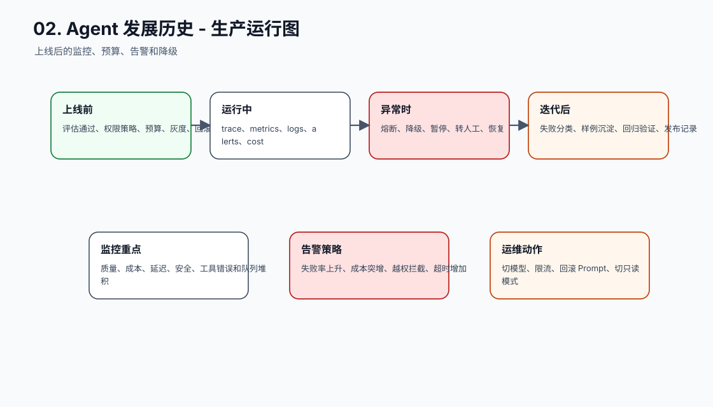
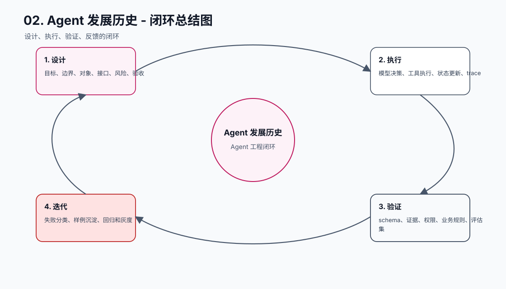

# Agent 发展历史

[返回全局摘要](../README.md)

Agent 不是突然出现的独立物种，而是大模型应用一步一步演进出来的工程形态。

```text
单轮问答
→ 多轮对话
→ Prompt 工程
→ 上下文工程
→ RAG
→ 记忆与状态管理
→ 工具调用
→ Workflow
→ Agent
→ 多 Agent 与工程化治理
```

## 为什么会这样发展

最开始，模型只负责回答问题。问题变复杂后，单次 prompt 不够，于是需要更清楚的指令、示例和输出格式。

当任务需要外部资料时，只靠模型参数不够，于是出现上下文工程和 RAG。

当任务跨多轮、跨时间推进时，只靠聊天历史不够，于是需要记忆和状态管理。

当任务需要查数据库、读文件、跑代码、调用 API 时，只让模型生成文本不够，于是出现工具调用和 MCP。

当任务流程有明确步骤和风险边界时，完全让模型自由规划不稳定，于是工程上先用 workflow 承载确定流程，再把局部判断交给模型。

## 阶段一：单轮问答

早期使用方式很简单：用户给一个问题，模型给一个答案。这个阶段的核心价值是语言理解和生成，例如总结、改写、翻译、解释概念、写一段代码草稿。

它的边界也很明显：

- 没有长期状态。
- 不知道实时事实。
- 不能可靠访问私有数据。
- 不能执行外部动作。
- 很难保证输出格式稳定。

所以单轮问答适合低风险、短上下文、只需要文本输出的任务。一旦任务需要证据、流程、工具或状态，就必须进入后续阶段。

## 阶段二：Prompt 工程

Prompt 工程解决的是“怎样把任务说清楚”。开发者开始把目标、角色、约束、示例、输出格式和失败条件写进提示词。这个阶段带来了几个重要能力：

| 能力 | 工程意义 |
| --- | --- |
| 明确任务目标 | 减少模型自由发挥 |
| 输出格式约束 | 方便下游解析 |
| few-shot 示例 | 稳定风格和边界 |
| 退出路径 | 信息不足时不编造 |

但 Prompt 不是长期知识库，也不是权限系统。它只能影响当前上下文中的模型行为，不能保证模型记住新知识，也不能替代外部系统执行检查。

## 阶段三：上下文工程与 RAG

当任务需要公司文档、产品知识、代码仓库、客户记录或实时材料时，只靠模型参数不够。RAG 把外部证据检索出来，再放进模型上下文，让模型基于证据回答。

这一阶段的关键变化是：系统开始区分“模型知道什么”和“本轮上下文提供了什么证据”。

工程重点也从“写好问题”变成“构造好上下文”：

- 文档如何切 chunk。
- query 如何改写。
- 哪些证据进入上下文。
- 证据如何引用和验证。
- 检索为空时如何拒答或澄清。
- 外部文档中的恶意指令如何防注入。

RAG 让模型能使用外部知识，但还不能让系统可靠推进长任务。因为证据解决的是“知道什么”，不解决“任务做到哪一步”和“动作能不能执行”。

## 阶段四：记忆与状态管理

多轮任务出现后，系统必须管理历史和进度。这里要区分两个概念：

| 概念 | 作用 |
| --- | --- |
| 记忆 | 跨任务复用的偏好、项目事实、长期经验 |
| 状态 | 当前任务进度、checkpoint、工具结果、审批状态 |

很多系统一开始会把所有历史消息直接追加到 Prompt。短期可用，但长期会出现成本上涨、旧信息污染、上下文溢出、中断后无法恢复等问题。

因此 Agent 工程逐步形成分层：

```text
最近对话 -> 当前上下文
长期偏好 -> 记忆库
任务进度 -> 状态库
原始证据 -> trace / artifact
```

有了记忆和状态，Agent 才能跨多轮推进任务，并在中断后恢复。

## 阶段五：工具调用与 MCP

当任务需要查数据库、读文件、跑测试、调用 API、发送消息或修改资源时，模型必须从“生成文本”扩展到“提出动作”。现代 tool use / function calling 让模型输出结构化工具调用意图，由应用层执行。

这里有一个关键分工：

```text
模型：提出想调用什么工具、传什么参数
应用：校验 schema、权限、风险和确认
工具：执行动作并返回结构化结果
Agent：把结果回填给模型，继续决策或完成任务
```

MCP 的价值，是把工具和资源暴露成更标准的协议，让 Agent 能以统一方式发现工具、读取资源和调用外部能力。但标准化连接不等于放开权限。越多系统接入 Agent，越需要严格的工具边界、确认、幂等、错误处理和 trace。

## 阶段六：Workflow 与 Agent

很多任务并不需要完全自主的 Agent。审批、报销、发布、客服升级、数据同步这类流程通常有清晰步骤，最适合先用 workflow 管理。模型只在需要理解、生成、分类、总结或局部判断的节点参与。

Workflow 和 Agent 的关系可以这样理解：

| 形态 | 适合任务 | 风险 |
| --- | --- | --- |
| Workflow | 步骤明确、规则稳定、风险边界清楚 | 灵活性较低 |
| Agent | 路径开放、需要动态规划和工具选择 | 不确定性更高 |
| Workflow + Agent | 大部分流程固定，局部交给模型判断 | 需要清晰边界 |

工程上通常应该先 workflow，再升级 Agent。因为 workflow 更容易测试、恢复、审计和回滚；只有当路径无法提前枚举，或工具选择需要动态判断时，才让 Agent 承担更多规划。

## 阶段七：多 Agent 与工程化治理

多 Agent 出现的原因不是“一个 Agent 不够聪明”，而是复杂任务需要不同职责：规划、检索、实现、审查、验证、总结、用户沟通。拆分后，每个 Agent 可以加载更少上下文、使用更窄工具集、承担更清晰责任。

但多 Agent 会带来新问题：

- 职责重叠。
- handoff 丢信息。
- 多个 Agent 输出冲突。
- 并行任务写同一资源。
- 成本和延迟上升。
- 错误在 Agent 间传播。

所以多 Agent 的核心不是数量，而是边界、交接、验证和 trace。没有这些工程治理，多 Agent 只会把单 Agent 的不确定性放大。

## 关键结论

Agent 的发展主线不是“越来越自由”，而是“让模型能力进入越来越清晰的工程边界”。

真正可落地的 Agent 通常不是纯自主系统，而是：

```text
确定性流程
+ 大模型判断
+ 工具执行
+ 状态记录
+ 权限控制
+ 过程验证
```

## 工程小结

从历史演进看，Agent 开发不是一个孤立技术点，而是一组工程能力逐步叠加：

- Prompt 解决任务表达。
- RAG 解决外部知识。
- 记忆解决跨任务连续性。
- 状态解决任务恢复。
- 工具解决外部动作。
- Workflow 解决确定流程。
- Agent 解决开放式规划。
- 多 Agent 解决复杂分工。
- Eval、trace 和反馈闭环解决可维护性。

因此，开发 Agent 时不要一开始就追求“自主”。先问清楚：这个任务到底缺知识、缺工具、缺状态、缺流程，还是缺模型判断。缺什么补什么，才是可落地的 Agent 工程路线。


## 本节图谱：10 张图讲透

这一节至少要能用图讲清楚三件事：它在 Agent 全局链路里的位置，它和模型、工具、状态、记忆、评估的边界，以及它上线后怎么被验证和运维。下面 10 张图按固定顺序展开：系统位置、执行流程、责任边界、数据分层、核心对象、风险兜底、决策分支、验证评估、生产运行、闭环总结。

**图 02-1：Agent 发展历史 - 系统位置图**  


**图 02-2：Agent 发展历史 - 执行流程图**  


**图 02-3：Agent 发展历史 - 责任边界图**  


**图 02-4：Agent 发展历史 - 数据分层图**  


**图 02-5：Agent 发展历史 - 核心对象图**  


**图 02-6：Agent 发展历史 - 风险兜底图**  


**图 02-7：Agent 发展历史 - 决策分支图**  


**图 02-8：Agent 发展历史 - 验证评估图**  


**图 02-9：Agent 发展历史 - 生产运行图**  


**图 02-10：Agent 发展历史 - 闭环总结图**  


## 补充工程表

### 模块拆解表

| 模块 | 解决的问题 | 落地要求 |
| --- | --- | --- |
| 单轮问答 | 本节链路中的关键能力 | 有输入、输出、状态变化、错误路径和 trace 记录 |
| Prompt 工程 | 本节链路中的关键能力 | 有输入、输出、状态变化、错误路径和 trace 记录 |
| 上下文工程 | 本节链路中的关键能力 | 有输入、输出、状态变化、错误路径和 trace 记录 |
| RAG | 本节链路中的关键能力 | 有输入、输出、状态变化、错误路径和 trace 记录 |
| 记忆与状态 | 本节链路中的关键能力 | 有输入、输出、状态变化、错误路径和 trace 记录 |
| 工具调用 | 本节链路中的关键能力 | 有输入、输出、状态变化、错误路径和 trace 记录 |
| Workflow | 本节链路中的关键能力 | 有输入、输出、状态变化、错误路径和 trace 记录 |
| 多 Agent 治理 | 本节链路中的关键能力 | 有输入、输出、状态变化、错误路径和 trace 记录 |

### 原则与原因表

| 工程原则 | 具体做法 | 为什么这么做 |
| --- | --- | --- |
| 每个阶段都在补模型边界 | Prompt 补指令，RAG 补事实，Tool 补执行，State 补恢复 | 理解演进原因比记时间线更重要 |
| Workflow 和 Agent 是互补关系 | 稳定路径用 Workflow，不确定判断用 Agent | 生产系统需要可控性和灵活性的组合 |
| 工程化是必然阶段 | 上线需要权限、预算、观测、回归和灰度 | 没有工程治理，能力越多风险越大 |

### 踩坑与兜底表

| 常见坑 | 兜底方式 | 为什么这么做 |
| --- | --- | --- |
| 把历史当技术堆叠 | 按能力缺口学习 | 把失败变成可定位、可恢复、可回归的工程事件 |
| 跳过 Workflow 直接自治 | 关键路径先流程化 | 把失败变成可定位、可恢复、可回归的工程事件 |
| 误以为 MCP 等于安全 | 权限独立设计 | 把失败变成可定位、可恢复、可回归的工程事件 |
| 多 Agent 过早复杂化 | 先定义职责边界 | 把失败变成可定位、可恢复、可回归的工程事件 |
| 忽略评估和观测 | 每阶段都加 trace 和 eval | 把失败变成可定位、可恢复、可回归的工程事件 |
