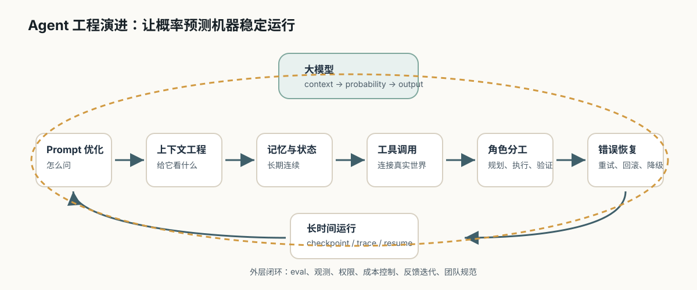

# Agent 原理

[返回全局摘要](../README.md)

Agent 是把大模型放进一个可执行任务流程里的软件系统。模型负责理解目标、生成计划、判断下一步或组织结果；应用层负责提供上下文、保存状态、调用工具、控制权限、记录过程和校验结果。

所以 Agent 不是“一个更聪明的聊天模型”，也不是“让模型自由行动”。更准确地说：

```text
Agent = 大模型决策能力 + 上下文组织 + 状态管理 + 工具执行 + 权限控制 + 过程验证
```

## 从哪里开始

Agent 不是从“全自动智能体”开始的。它的起点更朴素：用户不再只想要一个答案，而是希望 AI 围绕一个目标持续推进任务。

```text
单轮问答
→ 多轮对话
→ 带上下文的任务处理
→ 可调用工具的模型
→ 有计划、观察和恢复能力的 Agent
→ 可观测、可回放、可评估的工程系统
```

这条线要解决的核心问题是：大模型本体只生成文本，但真实任务需要查资料、读文件、调用系统、处理失败、记录状态和交付结果。

## 解决什么问题

Agent 解决的是复杂任务的组织与执行问题：

- 用户目标不只是问答，而是需要多步完成。
- 中间需要查资料、调用工具、写文件、跑代码或访问系统。
- 执行过程中可能失败，需要根据 observation 调整。
- 任务需要状态记录、风险判断和最终结单。

## 发展历史

Agent 工程的发展可以看成一层一层给大模型补能力：

| 阶段 | 为什么出现 | 核心变化 |
| --- | --- | --- |
| Prompt 阶段 | 模型需要知道任务、角色、边界和输出格式 | 用指令约束单次生成 |
| 上下文阶段 | 模型本轮只能看到输入窗口里的材料 | 开始组织资料、证据、历史和用户输入 |
| RAG 阶段 | 模型参数里的知识不够新，也不一定可靠 | 先检索证据，再让模型基于证据回答 |
| 记忆与状态阶段 | 长任务不能只依赖聊天记录 | 把偏好、事实、进度和业务状态分层保存 |
| 工具调用阶段 | 模型不能自己访问外部系统或执行动作 | 模型提出调用意图，应用或 MCP Server 执行 |
| Workflow 阶段 | 完全自由的 Agent 不稳定 | 用确定流程承载关键路径，让模型处理模糊判断 |
| 多 Agent 阶段 | 单个模型上下文和职责有限 | 拆分规划、检索、执行、审核和验证角色 |
| 工程化阶段 | 生产系统需要可靠性 | 加入 trace、权限、预算、回放、评估和失败恢复 |



## 基本循环

```text
目标
  -> 计划
  -> 选择工具或知识源
  -> 执行动作
  -> 观察结果
  -> 修正计划
  -> 完成或转人工
```

常见说法是 `plan -> act -> observe -> reflect`，但工程上不应把这个循环完全交给模型自由发挥。

## Agent 的核心能力

- 任务拆解：把目标拆成可执行步骤。
- 意图路由：判断该问答、检索、调用工具还是请求澄清。
- 工具选择：选择 RAG、MCP Tool、代码解释器或业务 API。
- 状态维护：记录当前进度、证据、失败和下一步。
- 结果整合：把多个工具结果和证据合成最终输出。
- 风险判断：识别哪些动作需要确认或禁止执行。

## 工程边界

生产环境里的 Agent 不应是完全自治的黑盒。需要：

- 用 workflow 或状态机约束关键流程。
- 限制工具权限和调用范围。
- 记录完整 trace。
- 设置最大轮次、最大成本和熔断条件。
- 对高风险动作加入人工确认。
- 对最终结果做验证和回归测试。

---

[返回全局摘要](../README.md)
