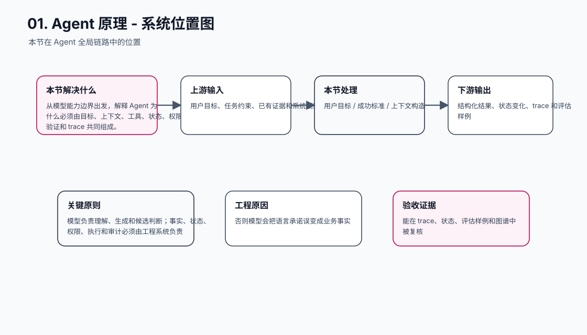
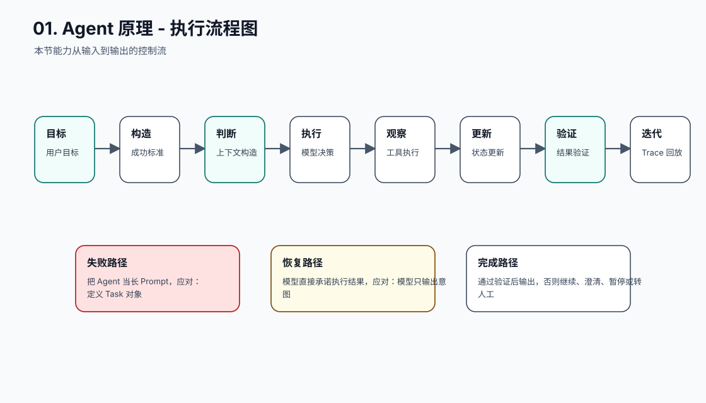
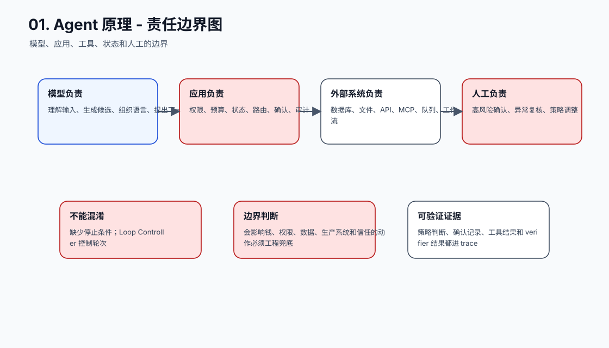
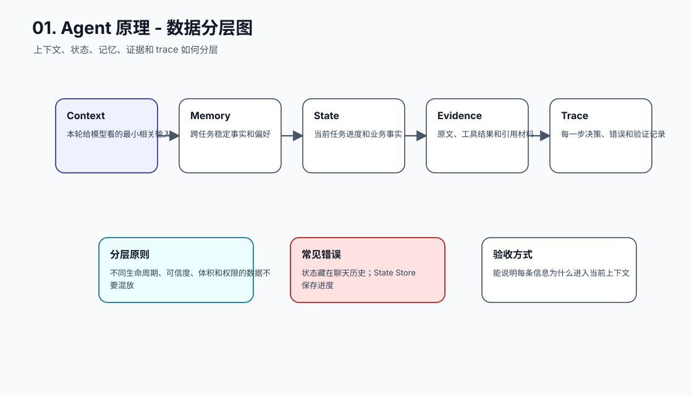
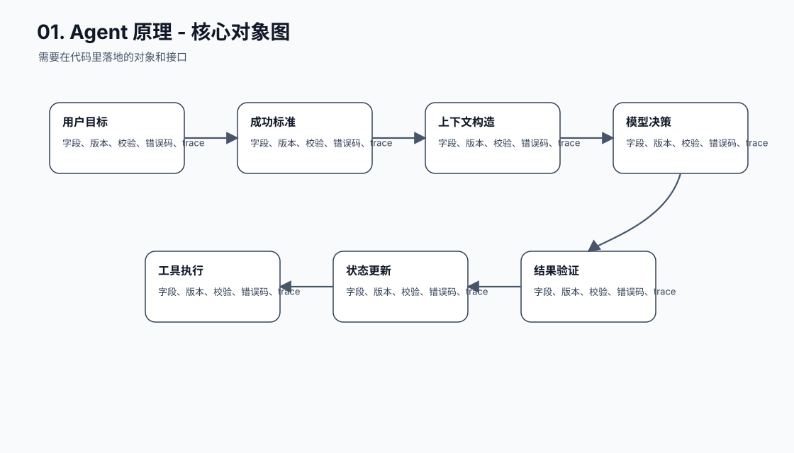
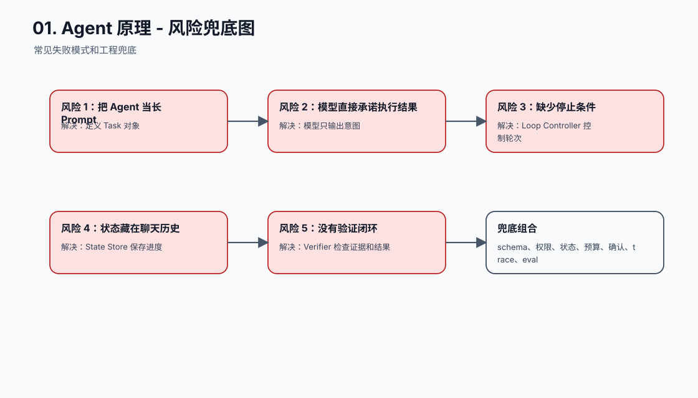
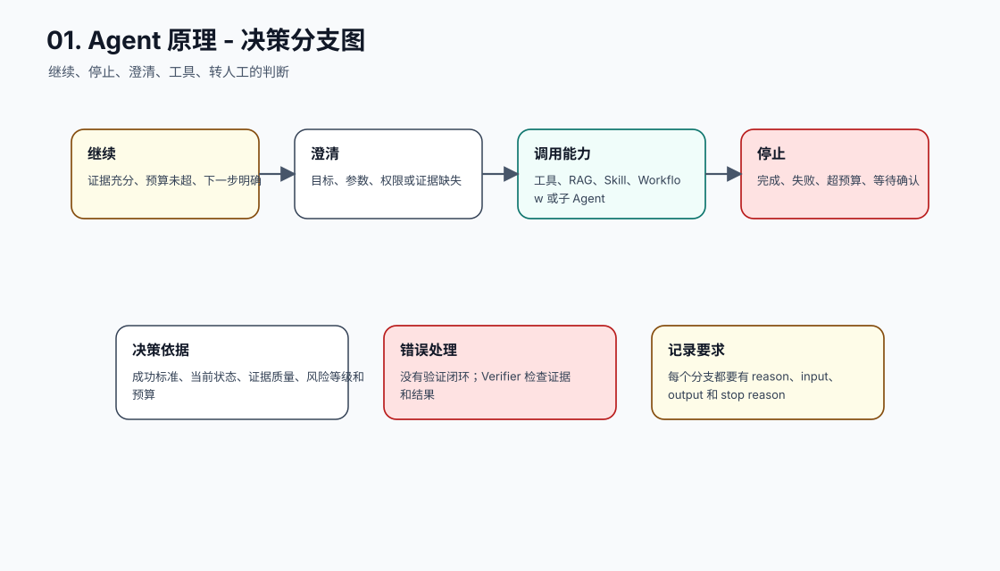
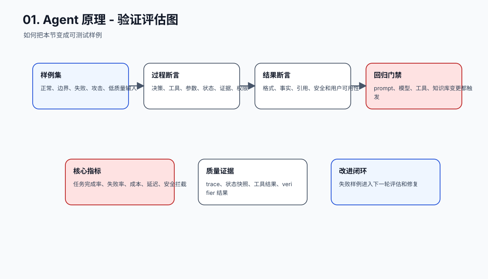
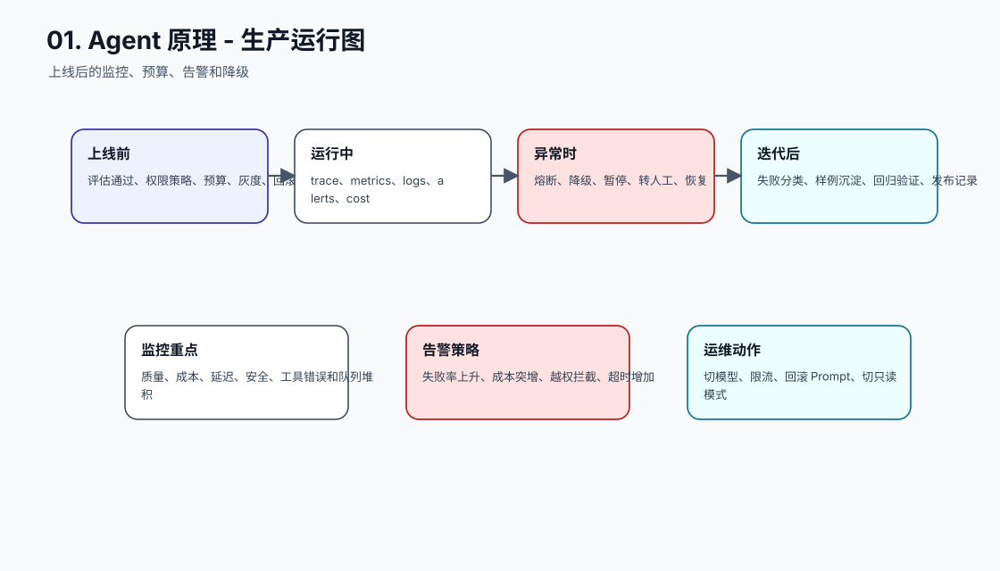
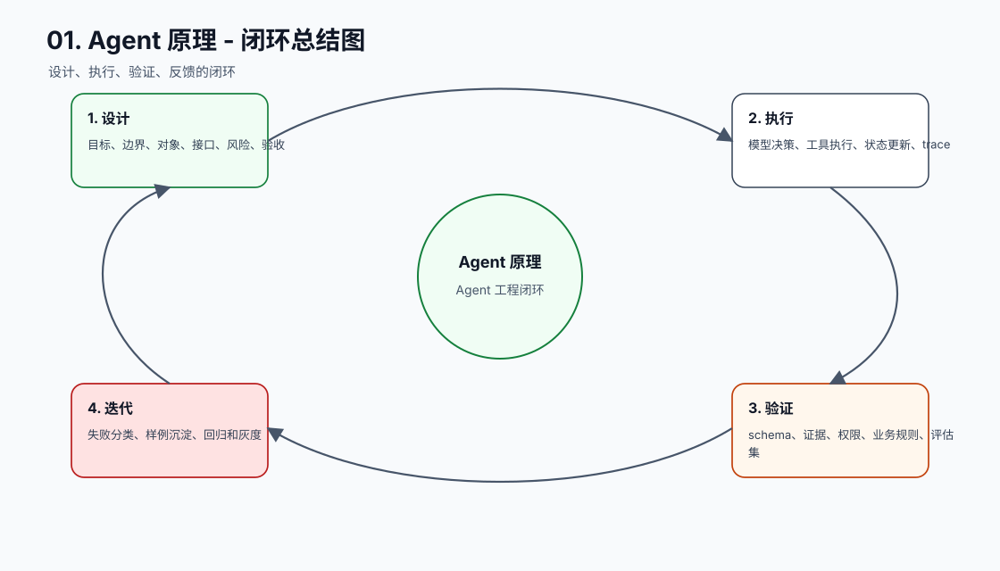

# Agent 原理

[返回全局摘要](../README.md)

Agent 是把大模型放进一个可执行任务流程里的软件系统。模型负责理解目标、生成候选计划、判断下一步或组织结果；应用层负责提供上下文、保存状态、调用工具、控制权限、记录过程和校验结果。

所以 Agent 不是“一个更聪明的聊天模型”，也不是“让模型自由行动”。更准确地说：

```text
Agent = 大模型决策能力 + 上下文组织 + 状态管理 + 工具执行 + 权限控制 + 过程验证
```

## 从哪里开始理解 Agent

Agent 开发最好的切入点，不是工具调用，也不是多 Agent，而是一个更基础的问题：

```text
用户不只是要一个回答，而是要一个可完成、可检查、可恢复的任务闭环。
```

单次大模型调用解决的是“生成一个回答”：

```text
用户输入
  ↓
模型根据上下文生成文本
  ↓
返回回答
```

Agent 解决的是“围绕目标推进任务”：

```text
用户目标
  ↓
明确成功标准
  ↓
组织上下文
  ↓
选择下一步动作
  ↓
调用工具或工作流
  ↓
观察结果
  ↓
更新状态
  ↓
验证是否完成
  ↓
输出结果或继续下一步
```

这就是 Agent 和普通聊天机器人的根本差异。聊天机器人主要处理语言交互，Agent 要处理任务执行。语言只是接口，任务闭环才是主体。

## 为什么不能只靠模型

大模型很强，但它的基本能力仍然是基于上下文生成 token。它可以理解需求、归纳材料、提出方案、组织语言，也可以在工具调用协议下生成“我想调用某个工具”的结构化意图。但真实任务还需要几类模型本身不负责的能力：

| 任务需要什么 | 为什么模型本身不够 | 应该交给谁 |
| --- | --- | --- |
| 事实 | 模型参数里的知识可能过期、缺失或不准确 | 检索、数据库、文件系统、业务 API |
| 状态 | 模型没有持久状态，本轮只能看到上下文窗口 | 任务状态表、会话存储、业务数据库 |
| 权限 | 模型不能决定自己是否有权读写资源 | 应用权限系统、用户确认、审计策略 |
| 执行 | 模型生成文本，不能直接安全地操作外部系统 | 工具层、MCP Server、workflow、job runner |
| 验证 | 模型可能给出听起来合理但不真实的结论 | 程序校验、测试、评测集、人工审核 |
| 恢复 | 模型一次失败后不会天然知道从哪里继续 | checkpoint、trace、重试策略、状态机 |

所以 Agent 工程不是“让模型更自由”，而是把模型放在一个边界清楚的执行系统里。模型负责模糊判断和语言生成，确定性系统负责事实、状态、权限、执行和验证。

## 一个最小 Agent 闭环

最小 Agent 不需要复杂框架。只要它能围绕目标形成下面这个闭环，就已经具备 Agent 的雏形：

```text
Goal
  ↓
Context
  ↓
Model Decision
  ↓
Action
  ↓
Observation
  ↓
State Update
  ↓
Verification
  ↓
Final Answer or Next Step
```

把它翻译成工程结构，大致是：

```text
Task
  ├─ goal               用户要完成什么
  ├─ success_criteria   什么叫完成
  ├─ messages           本轮给模型看的对话上下文
  ├─ state              任务进度和结构化中间结果
  ├─ tools              模型可以提出调用的工具
  ├─ trace              每一步模型输出、工具调用和观察结果
  ├─ budget             最大轮次、最大 token、最大成本
  └─ verification       判断任务是否完成
```

这里最容易误解的是 `messages` 和 `state`。`messages` 是给模型看的上下文；`state` 是系统用来恢复、调度和验证的确定性记录。把状态只写进自然语言对话历史里，短期看省事，长期会导致不可恢复、不可查询、不可测试。

## 用一个例子串起来

假设用户说：

```text
帮我分析这个项目的 README 是否需要更新，并给出修改建议。
```

如果只是一次模型调用，模型只能根据用户这句话泛泛回答：

```text
建议检查安装方式、运行命令、目录结构、环境变量和测试方式是否过期。
```

这个回答可能有道理，但没有真正完成任务。因为模型没有看项目文件，也没有证据说明 README 哪里过期。

把它改成 Agent 任务后，流程会变成：

```text
目标：分析 README 是否需要更新
成功标准：指出具体问题、引用项目证据、给出可执行修改建议
上下文：用户请求、项目根目录、当前 README 内容
动作 1：list_files 查看目录结构
观察 1：发现 package.json、scripts、doc 目录
动作 2：read_file README.md
观察 2：README 提到旧命令 npm run start
动作 3：read_file package.json
观察 3：实际脚本是 npm run docs:serve
状态更新：记录 README 命令过期
验证：建议必须引用真实文件和脚本
输出：列出过期点、证据和建议改法
```

这时 Agent 的价值不在于“回答更像人”，而在于它真的把任务向前推进了：看了文件，拿到了证据，更新了状态，最后给出可验证的结论。

## Agent 不是从全自动开始

Agent 的能力可以逐层增加：

```text
单轮问答
→ 多轮对话
→ 带上下文的任务处理
→ 可调用工具的模型
→ 有计划、观察和恢复能力的 Agent
→ 可观测、可回放、可评估的工程系统
```

这条线要解决的核心问题是：大模型本体只生成文本，但真实任务需要查资料、读文件、调用系统、处理失败、记录状态和交付结果。

每一层只增加一个能力：

| 阶段 | 新增能力 | 还没有解决什么 |
| --- | --- | --- |
| 单轮问答 | 能根据当前输入回答 | 看不到历史，不会执行动作 |
| 多轮对话 | 能看到前文 | 历史可能膨胀，也没有真实外部事实 |
| 上下文任务处理 | 能读取整理后的材料 | 不能主动获取缺失信息 |
| 工具调用 | 能提出外部动作意图 | 工具是否能执行、是否安全还要应用判断 |
| ReAct 循环 | 能多步行动和观察 | 可能循环、跑偏、成本失控 |
| Workflow + Agent | 关键路径稳定，模糊步骤交给模型 | 流程设计和状态管理更复杂 |
| 多 Agent | 复杂职责可以拆分 | 协调、合并、测试成本上升 |
| 工程化系统 | 可观测、可回放、可评估 | 需要完整的运维和质量体系 |

这也是为什么入门时不应该直接做多 Agent。多 Agent 不是“更智能”的同义词，它只是复杂任务里的职责拆分方式。如果单 Agent 的上下文、状态、工具、权限和评测还没有做好，增加更多 Agent 只会增加不可控性。

## Agent 解决什么问题

Agent 解决的是复杂任务的组织与执行问题：

- 用户目标不只是问答，而是需要多步完成。
- 中间需要查资料、调用工具、写文件、跑代码或访问系统。
- 执行过程中可能失败，需要根据 observation 调整。
- 任务需要状态记录、风险判断和最终结单。

更具体地说，Agent 主要解决四类工程问题。

### 1. 模糊目标如何变成可执行步骤

用户经常不会给出完整 SOP，只会说“帮我分析”“帮我修一下”“帮我整理成报告”。模型适合把这类模糊目标翻译成候选步骤，但步骤是否允许执行、是否需要确认、是否已经完成，不能只靠模型自说自话。

工程上需要把模型输出落成结构化计划，例如：

```json
{
  "goal": "分析 README 是否需要更新",
  "steps": [
    {"id": "s1", "action": "read_file", "target": "README.md"},
    {"id": "s2", "action": "search_code", "query": "npm run"},
    {"id": "s3", "action": "compare", "target": "README commands vs package scripts"}
  ],
  "risk_level": "read_only"
}
```

常见坑是直接让模型输出一大段计划，然后程序不解析、不校验、不记录。这样看起来有“规划”，实际没有工程价值。

### 2. 缺失信息如何被主动补齐

真实任务经常不是上下文一次给全。Agent 需要判断缺什么，再通过工具补齐。例如要分析 README，就必须读 README、配置文件和实际脚本。

这里的关键不是“工具越多越好”，而是每个工具都要小而清晰：

```text
list_files(root, depth)
read_file(path)
search_code(query, include_globs)
```

工具返回也应该结构化，方便后续验证。不要让工具返回不可控的大段文本，然后再让模型凭感觉总结。

### 3. 中间过程如何可观察、可恢复

Agent 失败时，必须知道失败发生在哪一步：

```text
step 1: list_files 成功
step 2: read_file README.md 成功
step 3: read_file package.json 失败，原因是文件不存在
```

如果没有 trace，失败后只能重跑整个任务，而且无法判断模型是工具失败、上下文缺失、权限不足，还是推理错误。

工程上至少要记录：

- 本轮模型输入的 prompt 版本和消息摘要。
- 模型输出的 tool call。
- 工具参数。
- 工具结果或错误。
- 状态更新。
- 最终验证结果。

### 4. 结果如何验证

Agent 输出不能只看“像不像”。能用程序验证的部分要尽量程序化：

- 文件路径是否存在。
- 命令是否真的在配置文件里。
- 引用证据是否来自工具结果。
- JSON 输出是否符合 schema。
- 是否越权调用了写工具。
- 是否超过最大轮次或预算。

模型可以辅助判断“建议是否清楚”“文章是否适合读者”，但不应该替代确定性校验。

## 发展历史

Agent 工程的发展可以看成一层一层给大模型补能力：

| 阶段 | 为什么出现 | 核心变化 |
| --- | --- | --- |
| Prompt 阶段 | 模型需要知道任务、角色、边界和输出格式 | 用指令约束单次生成 |
| 上下文阶段 | 模型本轮只能看到输入窗口里的材料 | 开始组织资料、证据、历史和用户输入 |
| RAG 阶段 | 模型参数里的知识不够新，也不一定可靠 | 先检索证据，再让模型基于证据回答 |
| 记忆与状态阶段 | 长任务不能只依赖聊天记录 | 把偏好、事实、进度和业务状态分层保存 |
| 工具调用阶段 | 模型不能自己访问外部系统或执行动作 | 模型提出调用意图，应用或 MCP Server 执行 |
| Workflow 阶段 | 完全自由的 Agent 不稳定 | 用确定流程承载关键路径，让模型处理模糊判断 |
| 多 Agent 阶段 | 单个模型上下文和职责有限 | 拆分规划、检索、执行、审核和验证角色 |
| 工程化阶段 | 生产系统需要可靠性 | 加入 trace、权限、预算、回放、评估和失败恢复 |


## 基本循环

```text
目标
  -> 计划
  -> 选择工具或知识源
  -> 执行动作
  -> 观察结果
  -> 修正计划
  -> 完成或转人工
```

常见说法是 `plan -> act -> observe -> reflect`，但工程上不应把这个循环完全交给模型自由发挥。

更工程化的循环通常长这样：

```text
for step in max_steps:
    context = build_context(task, state, recent_trace)
    decision = call_model(context, tools)

    if decision.type == "final":
        return verify_and_finish(decision)

    if decision.type == "tool_call":
        checked = validate_tool_call(decision.tool_call, policy)
        if checked.need_confirmation:
            return ask_user_confirmation(checked)

        result = execute_tool(checked)
        trace.append(decision, result)
        state = update_state(state, result)
        continue

    return fail("unknown decision")
```

这个伪代码里有几个关键点：

- `build_context` 是上下文工程，不是简单拼接全部历史。
- `validate_tool_call` 是权限和参数校验，不能省略。
- `trace.append` 是可观测性基础。
- `update_state` 是恢复能力基础。
- `max_steps` 是防止无限循环的最低要求。
- `verify_and_finish` 是防止“看起来完成”的最后关口。

## Agent 的核心能力

- 任务拆解：把目标拆成可执行步骤。
- 意图路由：判断该问答、检索、调用工具还是请求澄清。
- 工具选择：选择 RAG、MCP Tool、代码解释器或业务 API。
- 状态维护：记录当前进度、证据、失败和下一步。
- 结果整合：把多个工具结果和证据合成最终输出。
- 风险判断：识别哪些动作需要确认或禁止执行。

这些能力可以对应到具体工程模块：

| Agent 能力 | 工程模块 | 不能省略的细节 |
| --- | --- | --- |
| 任务拆解 | planner / workflow | 成功标准、停止条件、失败出口 |
| 意图路由 | router | 路由理由、置信度、fallback |
| 工具选择 | tool registry / dispatcher | schema、参数校验、错误返回 |
| 状态维护 | task state store | checkpoint、版本、恢复点 |
| 结果整合 | response composer | 证据引用、结构化输出 |
| 风险判断 | permission policy | 读写分级、确认 token、审计日志 |

## 工程边界

生产环境里的 Agent 不应是完全自治的黑盒。需要：

- 用 workflow 或状态机约束关键流程。
- 限制工具权限和调用范围。
- 记录完整 trace。
- 设置最大轮次、最大成本和熔断条件。
- 对高风险动作加入人工确认。
- 对最终结果做验证和回归测试。

更具体地说，需要守住三条边界。

### 事实边界

模型说出来的事实不等于真实事实。只要任务依赖外部事实，就应该尽量把事实从检索、数据库、文件系统或业务 API 里拿出来，并保留证据来源。

常见坑：

- 模型记得一个旧 API，就直接当成当前事实。
- RAG 检索到一段相似内容，就默认能支撑结论。
- 工具结果为空时，模型为了完成任务编造结果。

### 权限边界

模型可以提出“我想调用删除接口”，但不能因此获得删除权限。权限判断必须由应用层完成。

常见坑：

- 工具 schema 暴露了危险参数，但没有服务端校验。
- 用户只确认了笼统意图，没有确认具体资源和动作。
- 审计日志没有记录工具参数，事后无法追责。

### 状态边界

对话历史不是可靠状态系统。它适合给模型提供上下文，不适合承担恢复、查询、审计和并发控制。

常见坑：

- 任务做到第几步只写在上一条 assistant 消息里。
- 工具执行成功但状态没有落库，重试时重复执行。
- 多个 Agent 同时修改同一份状态，没有版本控制。

## 设计 Agent 时先问的五个问题

开始写 Agent 代码前，先回答这五个问题：

1. 这个任务的成功标准是什么？
2. 哪些信息必须来自外部事实源？
3. 哪些动作只是读取，哪些动作会产生副作用？
4. 中间状态要保存在哪里，失败后从哪里恢复？
5. 用什么方式验证最终结果和关键中间步骤？

如果这五个问题答不清楚，就不应该急着加工具、加 MCP 或拆多 Agent。否则系统会看起来很智能，但失败时很难定位和修复。

## 常见误区

| 误区 | 问题 | 更合理的做法 |
| --- | --- | --- |
| Agent 就是一个很长的 Prompt | Prompt 只能影响生成，不能提供事实、权限、状态和恢复 | Prompt 只负责指令层，其他能力交给工程系统 |
| 工具越多 Agent 越强 | 工具过多会增加选择错误、越权和上下文噪声 | 工具小而清晰，描述何时使用和何时不用 |
| 多 Agent 一定比单 Agent 强 | 多 Agent 增加协调、合并和测试复杂度 | 先做好单 Agent 闭环，再按职责拆分 |
| 让模型自己反思就能纠错 | 反思没有新证据时容易重复原错误 | 用 observation、测试和外部校验纠错 |
| 聊天历史就是记忆 | 历史会膨胀、污染上下文，也难以删除 | 区分短期上下文、长期记忆和任务状态 |
| 接入 MCP 就安全了 | MCP 是连接协议，不是权限系统 | MCP Server 和应用层都要做校验与审计 |

## 下一步怎么学

理解 Agent 原理后，后面的学习顺序应该是：

1. 先学 Prompt 与指令，明确目标、边界、输出格式和退出路径。
2. 再学上下文工程与 RAG，理解模型本轮应该看什么证据。
3. 然后学记忆与状态管理，区分对话历史、长期记忆和确定性任务状态。
4. 进入工具调用、MCP 和 workflow，学习模型如何提出动作意图，系统如何安全执行。
5. 最后学习评测、trace、反馈闭环和源码实现，让 Agent 可观测、可回放、可回归。

这条路径的重点不是追框架，而是先把任务闭环拆清楚。只要闭环清楚，后面换任何模型、框架或协议，工程判断都不会变。

---

[返回全局摘要](../README.md)


## 本节图谱：10 张图讲透

这一节至少要能用图讲清楚三件事：它在 Agent 全局链路里的位置，它和模型、工具、状态、记忆、评估的边界，以及它上线后怎么被验证和运维。下面 10 张图按固定顺序展开：系统位置、执行流程、责任边界、数据分层、核心对象、风险兜底、决策分支、验证评估、生产运行、闭环总结。

**图 01-1：Agent 原理 - 系统位置图**  


**图 01-2：Agent 原理 - 执行流程图**  


**图 01-3：Agent 原理 - 责任边界图**  


**图 01-4：Agent 原理 - 数据分层图**  


**图 01-5：Agent 原理 - 核心对象图**  


**图 01-6：Agent 原理 - 风险兜底图**  


**图 01-7：Agent 原理 - 决策分支图**  


**图 01-8：Agent 原理 - 验证评估图**  


**图 01-9：Agent 原理 - 生产运行图**  


**图 01-10：Agent 原理 - 闭环总结图**  


## 补充工程表

### 模块拆解表

| 模块 | 解决的问题 | 落地要求 |
| --- | --- | --- |
| 用户目标 | 本节链路中的关键能力 | 有输入、输出、状态变化、错误路径和 trace 记录 |
| 成功标准 | 本节链路中的关键能力 | 有输入、输出、状态变化、错误路径和 trace 记录 |
| 上下文构造 | 本节链路中的关键能力 | 有输入、输出、状态变化、错误路径和 trace 记录 |
| 模型决策 | 本节链路中的关键能力 | 有输入、输出、状态变化、错误路径和 trace 记录 |
| 工具执行 | 本节链路中的关键能力 | 有输入、输出、状态变化、错误路径和 trace 记录 |
| 状态更新 | 本节链路中的关键能力 | 有输入、输出、状态变化、错误路径和 trace 记录 |
| 结果验证 | 本节链路中的关键能力 | 有输入、输出、状态变化、错误路径和 trace 记录 |
| Trace 回放 | 本节链路中的关键能力 | 有输入、输出、状态变化、错误路径和 trace 记录 |

### 原则与原因表

| 工程原则 | 具体做法 | 为什么这么做 |
| --- | --- | --- |
| 模型负责理解、生成和候选判断 | 事实、状态、权限、执行和审计必须由工程系统负责 | 否则模型会把语言承诺误变成业务事实 |
| Agent 是任务闭环，不是聊天界面 | 至少包含 Task、Context、Tool、State、Trace、Verifier | 否则不能恢复、不能评估、不能上线 |
| 先单 Agent，再多 Agent | 多 Agent 只有在职责隔离、并行或审核有收益时才引入 | 避免用架构复杂度掩盖基础闭环缺失 |

### 踩坑与兜底表

| 常见坑 | 兜底方式 | 为什么这么做 |
| --- | --- | --- |
| 把 Agent 当长 Prompt | 定义 Task 对象 | 把失败变成可定位、可恢复、可回归的工程事件 |
| 模型直接承诺执行结果 | 模型只输出意图 | 把失败变成可定位、可恢复、可回归的工程事件 |
| 缺少停止条件 | Loop Controller 控制轮次 | 把失败变成可定位、可恢复、可回归的工程事件 |
| 状态藏在聊天历史 | State Store 保存进度 | 把失败变成可定位、可恢复、可回归的工程事件 |
| 没有验证闭环 | Verifier 检查证据和结果 | 把失败变成可定位、可恢复、可回归的工程事件 |
