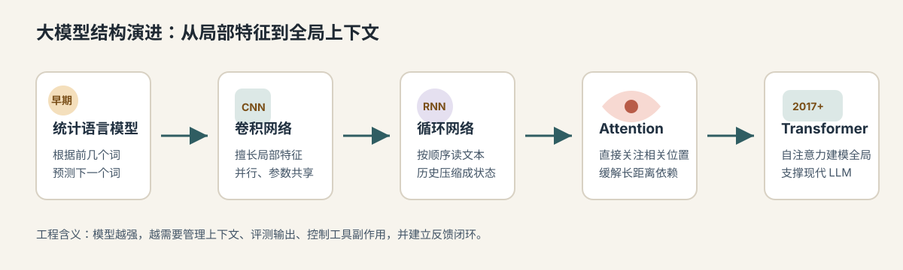

# 00.1 大模型基础

[返回全局摘要](../README.md) · [返回本组：AI 工程基础知识与原理](README.md)

大语言模型的核心能力，是在给定输入和上下文后，预测后续 token 的概率分布，并按解码策略生成文本、代码或结构化输出。它不是数据库，也不是传统意义上按规则执行的确定性程序。

## 基本概念

| 概念 | 含义 |
| --- | --- |
| Token | 模型处理文本的基本单位，可以是字、词、子词或符号片段 |
| 参数 | 模型训练后固化下来的权重，承载通用语言、知识和模式 |
| 上下文 | 每次请求传给模型的输入，包括系统指令、历史消息、文档、工具结果和用户问题 |
| 推理 | 模型根据当前输入生成输出的过程 |
| 解码 | 从概率分布中选择下一个 token 的策略，例如 greedy、temperature、top-p |

## 大模型的演变过程

大模型不是突然出现的，它是语言建模能力长期演进的结果：

| 阶段 | 核心特点 | 局限 |
| --- | --- | --- |
| 统计语言模型 | 用 n-gram 等方法根据前几个词预测下一个词 | 上下文短，语义关系弱 |
| CNN | 擅长提取局部特征，可用于短语和局部模式识别 | 不擅长长距离依赖 |
| RNN / LSTM / GRU | 按顺序读文本，用隐藏状态传递历史信息 | 难并行，长序列信息容易丢失 |
| Attention | 生成当前 token 时直接关注输入中相关位置 | 为 Transformer 铺路 |
| Transformer | 用 self-attention 建模全局 token 关系，可大规模并行训练 | 成本高，仍受上下文和数据边界限制 |

今天的大语言模型大多建立在 Transformer 或其变体之上。它们通过大规模预训练学习语言、知识、代码和模式，再通过指令微调、偏好优化、工具调用和 RAG 等工程手段适配具体任务。



## 大模型擅长什么

大模型擅长处理非结构化语言和模式匹配任务：

- 理解自然语言意图。
- 总结、改写、翻译和解释文本。
- 生成代码、SQL、配置和结构化草稿。
- 从上下文中抽取信息。
- 根据示例迁移格式和风格。
- 在不确定场景下给出候选方案。

## 大模型不擅长什么

大模型本身不可靠地承担这些职责：

- 保证事实绝对正确。
- 记住没有传入上下文的私有数据。
- 自动拥有长期记忆。
- 自动知道实时信息。
- 自动执行外部动作。
- 自动遵守业务权限。
- 对高风险操作承担最终责任。

## 能力边界

理解大模型时，要记住几个边界：

| 边界 | 说明 | 工程处理 |
| --- | --- | --- |
| 上下文依赖 | 输出质量高度依赖本轮输入、历史、工具结果和检索材料 | 做上下文工程和证据管理 |
| 幻觉 | 缺少可靠证据时，模型仍可能生成流畅但错误的内容 | 用 RAG、数据库、引用和事实校验 |
| 随机性 | 同样输入也可能因采样、模型版本和上下文细节产生差异 | 降低随机性，做 schema、eval 和回归 |
| 能力锯齿 | 难题可能答得好，简单边界题也可能出错 | 用真实样例和边界样例评测 |
| 迷失中间 | 长上下文中间的关键信息可能被忽略 | 用摘要、索引、重排和结构化上下文 |
| 权限缺失 | 模型不能充当权限系统或事务系统 | 权限、审批、审计和回滚交给应用层 |

因此 AI 工程要把大模型放进可控系统里：用上下文提供依据，用 RAG 补知识，用工具连接外部世界，用状态机管理流程，用权限系统控制动作，用评测和 trace 验证行为。

## 工程心智模型

```text
模型负责生成候选
工程系统负责事实、权限、状态、执行、验证和恢复
```

Agent 的能力上限由大模型的基座能力决定；商业化落地的下限由 AI 工程体系的完善度决定。

不要把大模型当成万能后端。更合理的定位是：它是一个强大的语言推理和生成组件，需要被软件工程体系约束和增强。

---

[返回全局摘要](../README.md) · [返回本组：AI 工程基础知识与原理](README.md)
