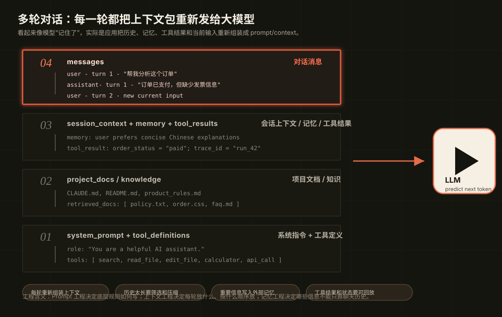

# 00.4 上下文重放与记忆

[返回本章](README.md)

大模型本身没有像人一样的持续记忆。一次模型调用结束后，模型不会自动记住刚刚发生的对话。

我们在聊天产品里看到的“连续对话”，通常是应用系统在下一次请求时，把前几轮的用户问题、模型回答、系统指令和其他上下文一起重新发给模型。模型并不是从自己的脑子里回忆上一轮，而是在这一次输入里再次读到了上一轮内容。



## 1. 多轮对话如何形成

可以把多轮对话简化成：

```text
第 1 轮：
system + user_1 -> model -> assistant_1

第 2 轮：
system + user_1 + assistant_1 + user_2 -> model -> assistant_2

第 3 轮：
system + user_1 + assistant_1 + user_2 + assistant_2 + user_3 -> model -> assistant_3
```

所以，所谓“模型记得上下文”，更准确地说，是应用把历史上下文重新喂给了模型。模型能利用这段历史，但它不拥有一个可靠、无限、自动更新的长期记忆系统。

## 2. 每轮调用都是上下文重放

后续工程实践可以直接引用这条原则：

> 大模型没有可靠的持续记忆。多轮对话看起来像“模型记住了”，本质上是应用在每一轮请求时，把系统提示词、历史问答、外部记忆、工具结果、任务状态和当前用户输入重新组装为上下文，再传给模型。

这意味着，每一次模型调用都不是简单的“用户输入 -> 模型回答”，而是：

```text
系统提示词
+ 历史问答
+ 外部记忆
+ 工具结果
+ 任务状态
+ 当前用户输入
-> 本轮上下文
-> 模型预测输出
```

## 3. 这个特性带来的工程问题

这个机制会带来几个直接问题：

- **上下文窗口有限**：历史太长时，系统必须截断、摘要或筛选，否则放不进去或成本太高。
- **历史质量会影响输出**：前面错误、含糊或被注入的内容，会影响后续概率分布。
- **重要信息可能丢失**：如果历史被截断，模型就不知道被截掉的内容。
- **长期偏好不能只靠对话历史**：用户偏好、项目规则、业务状态需要外部记忆或数据库。
- **上下文顺序会影响结果**：系统指令、用户输入、检索内容和工具结果如何排列，会改变模型注意到什么。

## 4. 为什么引出 Prompt 和上下文工程

这正好为 Prompt 工程和上下文工程埋下伏笔：既然模型每次都依赖“这一次被喂进去的内容”，那么工程师真正能控制的，不只是模型本身，而是输入给模型的上下文结构。

Prompt 工程要解决的是：系统指令、角色、任务边界、输出格式和失败路径怎么写。

上下文工程要解决的是：哪些历史、文档、工具结果、记忆和业务规则应该进入上下文，按什么顺序进入，如何压缩，如何防止污染，如何记录和回放。

长期记忆工程要解决的是：哪些信息不应该只放在聊天历史里，而应该存进可更新、可删除、可审计的外部系统。

## 5. 实践引用问题清单

凡是涉及多轮对话、长任务或 Agent 执行的系统，都必须回答这些问题：

- 哪些历史问答应该继续传入，哪些应该丢弃或摘要？
- 系统提示词应该放在哪里，如何避免被历史消息或外部文档污染？
- 外部记忆和业务状态应该如何选择、更新时间戳和置信度？
- 工具结果应该完整传入、摘要传入，还是只传结构化结果？
- 上下文太长时，如何压缩而不丢关键约束？
- 出错时，是否能回放当时传给模型的完整上下文？

这就是 Prompt 工程、上下文工程、记忆管理和 trace 设计的共同起点。

