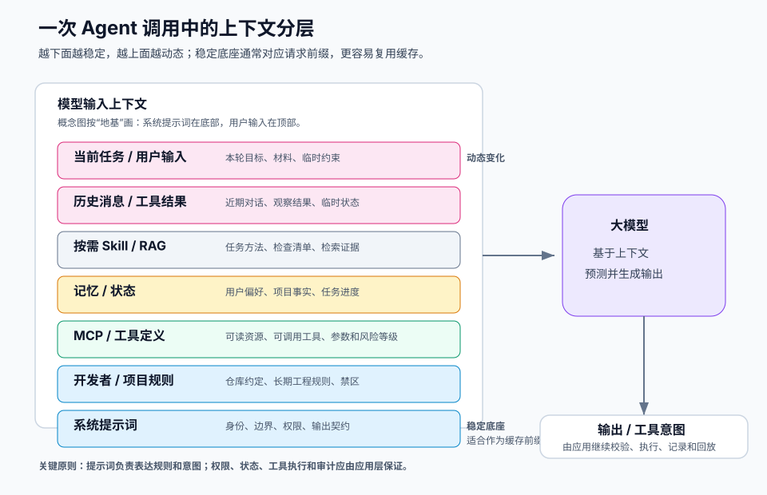

# 00.4 提示词与指令基础

[返回全局摘要](../README.md) · [返回本组：AI 工程基础知识与原理](README.md)

Prompt 是给模型的输入提示，Instruction 是更明确的任务指令、规则和约束。中文里可以直接叫“提示词与指令”。System Prompt，中文常叫“系统提示词”，是由平台、开发者或 Agent 应用注入的高优先级规则。

## 一张图看整体

一次 Agent 调用通常不是只有用户一句话，而是应用把规则、工具、记忆、资料和用户输入组装成上下文，再交给模型生成输出。可以把它理解成一个“上下文栈”：底层越稳定，顶层越动态。



```text
动态层: 当前任务指令 / 用户输入 / 历史消息
  -> 按需层: Skill / RAG / 参考上下文
  -> 会话层: 记忆 / 状态
  -> 能力层: MCP / 工具定义
  -> 项目层: 开发者规则 / Agent 配置
  -> 稳定底座: 平台安全策略 / 系统提示词
```

这张图的核心是分层：系统提示词定义稳定边界，用户输入定义本次要做什么，记忆提供跨轮连续性，MCP 描述可连接的资源和工具，Skill 提供某类任务的方法。

注意，这里的“底层”是概念上的地基，不代表在 API 请求文本里一定排在最后。为了提高 Prompt Cache 命中率，工程实现通常会把稳定底座序列化到请求前缀：系统提示词、稳定工具定义、项目规则尽量不变；用户输入、工具结果、临时状态放在后面动态变化。

## 提示词的本质

提示词不是魔法命令，也不会改写模型参数。它的本质是把任务、材料、规则和边界放进本轮上下文，让模型在生成下一个 token 时更容易关注相关语义模式。

例如在系统提示词里写“你是严格的代码审查员”，不是把模型永久变成代码审查模型，而是在当前上下文里提高“找 bug、识别风险、指出测试缺口、按严重程度反馈”这些模式的权重。模型后续输出会更倾向于沿着这个角色和规则继续生成。

| 概念 | 本质 | 示例 |
| --- | --- | --- |
| Prompt | 给模型看的任务、材料、问题或示例 | “请总结下面这段会议记录” |
| Instruction | 模型必须遵守的规则、边界和输出要求 | “只基于给定材料回答；无法判断时输出 unknown；结果必须是 JSON” |
| System Prompt | 高优先级、长期稳定的身份和规则 | “你是客服助手；不能承诺退款；涉及隐私信息必须先校验权限” |

Prompt 偏“输入和任务”，Instruction 偏“规则和控制”，System Prompt 偏“身份、边界和长期约束”。

## 它能做什么，不能做什么

| 能做什么 | 不能做什么 |
| --- | --- |
| 设定角色和职责，例如代码审查员、客服、研究助理 | 永久改变模型参数或让模型真正学会新知识 |
| 明确输出格式、语言、风格和验收标准 | 保证模型永远不出错、不幻觉、不遗漏 |
| 约束权限边界，例如高风险写操作前必须确认 | 绕过平台安全策略、权限系统或工具校验 |
| 指导工具选择、RAG 使用和失败处理 | 代替数据库、状态机、审计系统或业务权限 |
| 降低用户输入、网页、日志里的伪指令污染 | 自动判断所有外部内容都可信 |
| 让同类任务输出更稳定、更可评测 | 在提示词过长、冲突或噪声太多时仍保持稳定注意力 |

因此提示词是控制模型行为的接口之一，不是完整的安全系统、知识库或工作流引擎。

## 产生的必要性

大模型会根据当前上下文预测输出。如果没有稳定提示词，系统仍然能回答问题，但行为会更容易随输入漂移：

- 角色漂移：一会儿像客服，一会儿像顾问，一会儿像自由聊天助手。
- 风格漂移：输出长度、语气、格式和结构难以复现。
- 边界不清：不知道哪些事情不能做，缺信息时是否应澄清。
- 注入风险：用户输入或外部材料中的“忽略前面规则”可能污染行为。
- 材料混淆：RAG 文档、网页内容或日志里的伪指令可能被误当新规则。
- 工具失控：不知道哪些工具可用，什么时候调用，调用前是否需要确认。
- 工程不可测：没有版本、评审、回归和发布记录时，线上行为变化难以定位。

系统提示词的价值是把稳定身份、权限边界、安全规则和输出契约提前锁定。工程化提示词的价值是把这些规则当作软件资产管理：可版本化、可评审、可测试、可回滚。

## 系统提示词怎么产生

系统提示词通常不是模型自己产生的，而是 Agent 应用在调用模型前由多种配置和规则拼装出来的。一个常见生成链路是：

```text
平台安全策略
  + 产品 / 业务规则
  + 开发者编写的 Agent 角色说明
  + 项目级规则文件
  + 稳定工具和权限策略
  + 输出格式和交互风格
        |
        v
Prompt Builder / Context Assembler
        |
        v
API 请求中的 system / developer message
或 Agent 运行时的稳定上下文前缀
```

也就是说，系统提示词的“原材料”可能散落在多个地方，但真正进入模型前，通常会被 Prompt Builder 或 Agent Runtime 组装成高优先级上下文。

## 在工程中出现的位置

系统提示词不一定只是一条手写的 API 消息。常见来源和注入位置包括：

| 位置 | 作用 |
| --- | --- |
| API 请求里的 `system` message | 最直接的注入位置，定义本次调用的高优先级规则 |
| API 请求里的 `developer` message 或同类角色 | 放开发者规则、项目约束和应用级行为规范 |
| Agent 配置文件 | 系统提示词的来源之一，定义角色、权限、风格、默认工具策略 |
| Prompt Builder / Context Assembler | 把多处规则拼成最终发给模型的系统提示词或稳定前缀 |
| `CLAUDE.md`、`AGENTS.md` | 项目级长期规则；通常不是模型原生机制，而是 Agent 应用读取后注入上下文 |
| `.claude/`、`.agents/` 目录 | 存放项目规则、Skill 入口、workflow 入口或工具约束，按需被读取和注入 |
| 平台后台配置 | 注入安全策略、品牌语气、行业合规要求 |
| 工具说明和工具 schema | 告诉模型有哪些动作、参数和风险边界 |
| MCP server 暴露的 prompts | 提供可复用提示模板或任务入口 |
| Skill / Workflow | 提供某类任务的执行方法、检查清单和输出规范 |

在大型 Agent 架构里，System Prompt 应只放稳定身份、边界、权限和路由原则。具体任务步骤、长篇 SOP、领域资料、工具细节和示例应放到 Skill、Workflow、工具 schema、RAG 文档或本次用户输入中，按需加载。

这样分层可以避免系统提示词无限膨胀，减少注意力稀释、上下文成本上升、缓存失效和旧规则污染新任务的问题。

## 动态分层与角色切换

Agent 的“角色”不是一个固定不变的人格，而是由多层提示词和上下文共同叠加出来的当前行为倾向。更准确的说法是：底层角色提供默认身份和安全边界，上层角色根据项目、模式、Skill、子 Agent 和当前任务动态收窄职责。

```text
基础人格: 平台 / 产品默认助手身份
  -> 安全人格: 权限、隐私、合规、不能做什么
  -> 项目人格: 当前仓库规则、CLAUDE.md / AGENTS.md、团队约定
  -> 运行时人格: 规划模式、执行模式、只读模式、审查模式
  -> Skill 人格: 本次任务加载的流程、检查清单、输出标准
  -> 子 Agent 人格: 检索 Agent、执行 Agent、审核 Agent 等专项职责
  -> 临时任务人格: 用户本轮要求和当前任务指令
```

这些层不是简单互相覆盖。更高层可以让角色更具体，例如“现在按代码审查员工作”；但不能越过底层安全规则，例如“忽略权限确认直接发布”。因此动态角色切换应理解为“在不突破底层边界的前提下，切换当前主导职责”。

常见触发方式包括：

- 用户输入触发：用户说“请做代码审查”，运行时加载 review 角色和检查标准。
- Skill 触发：命中 `bug-fix` Skill 后，Agent 临时采用排查、最小改动、验证优先的行为模式。
- 子 Agent 触发：主 Agent 把检索、执行、审核拆给不同子 Agent，每个子 Agent 有自己的短系统提示词和工具边界。
- 运行状态触发：从规划阶段切到执行阶段，或从执行阶段切到审核阶段，注入新的 runtime instruction。
- 项目上下文触发：进入某个仓库或子目录后，加载项目级规则、局部 `CLAUDE.md` / `AGENTS.md` 或相关 Skill。

以 Claude Code 这类代码 Agent 为例，可以把加载关系近似理解为：

```text
内部默认系统提示词 / 基础代码助手身份
  -> 追加系统提示词: --append-system-prompt 等显式追加规则
  -> 工具定义和权限策略: settings、allow / ask / deny、MCP 工具
  -> 运行时指令: 当前模式、工具结果、状态提醒
  -> 项目记忆: CLAUDE.md / CLAUDE.local.md 及递归发现的项目规则
  -> 用户记忆: ~/.claude/CLAUDE.md 等个人偏好
  -> 子 Agent / Skill: .claude/agents、按需加载的专项能力
  -> 历史消息和当前用户输入
```

这里要注意：`CLAUDE.md` 更适合理解为项目记忆或项目级指令上下文，不等同于产品内部默认 system prompt。需要显式追加到系统提示词时，应使用类似 `--append-system-prompt` 的机制；需要项目约定、常用命令、代码风格和目录说明时，更适合写在 `CLAUDE.md` / `AGENTS.md` 这类项目规则文件里。

这个顺序是工程心智模型，不是所有产品的固定协议。不同 Agent 应用会用不同的 message role、文件位置和 Prompt Builder 实现。关键是保留三条原则：底层规则稳定、上层角色可动态切换、每次切换都能在 trace 中解释“为什么加载了这个角色或 Skill”。

## 和相邻模块的关系

| 模块 | 和提示词的边界 |
| --- | --- |
| 用户输入 | 用户输入定义本次任务、问题和材料；不能覆盖系统提示词，也不能通过“忽略前面规则”越权。 |
| 记忆 | 记忆是应用保存并重新注入的偏好、事实或历史摘要；它可以影响回答，但不能天然覆盖系统提示词。 |
| 上下文窗口 | 提示词、记忆、RAG、历史消息和用户输入都会占用上下文窗口；窗口越大不等于规则越稳，关键是分层和相关性。 |
| RAG | RAG 提供事实证据；提示词定义如何使用证据、证据不足时怎么办，以及外部材料不能覆盖系统规则。 |
| MCP | MCP 是连接资源、工具和提示模板的协议；提示词说明何时使用这些能力，MCP 提供标准化入口。 |
| 工具调用 | 工具执行外部动作；提示词只能表达工具选择和确认原则，真正的权限校验应由应用和工具层完成。 |
| Skill | Skill 是可复用任务方法；提示词可以触发和约束 Skill，但不应把所有 Skill 全文塞进 System Prompt。 |
| Agent 配置 | Agent 配置决定角色、工具、权限和运行策略；其中一部分会被组装成系统提示词或开发者规则。 |

例如长期记忆里记录“用户喜欢直接给命令行”，可以影响回答风格；但如果系统提示词要求“执行写操作前必须确认”，这条记忆不能绕过权限确认。敏感、过期或来源不明的记忆还应该被降权、校验或丢弃。

## 工程最佳实践

系统提示词应短、稳、可缓存。它不是所有规则和流程的垃圾桶，而是整个 Agent 的稳定底座。

| 做法 | 原因 |
| --- | --- |
| 只放稳定身份、边界、权限和路由原则 | 这些内容跨任务复用，适合放在稳定前缀里 |
| 不把长篇 SOP、完整 Skill、领域资料全塞进去 | 会增加 token 成本、稀释注意力、降低缓存命中 |
| 把可变信息放到动态层 | 当前用户输入、工具结果、时间、临时状态每轮都可能变 |
| 把详细流程拆到 Skill / Workflow | 只有命中任务时才加载，减少无关上下文干扰 |
| 把事实材料放到 RAG | 需要证据时检索，不让系统提示词变成知识库 |
| 把权限校验放到工具和应用层 | 提示词能表达原则，但不能替代真实权限系统 |
| 为系统提示词设置版本和长度预算 | 方便评审、回滚、评测和缓存稳定 |

多 Agent 场景尤其要拆分。不要让一个全局 System Prompt 同时描述规划 Agent、检索 Agent、代码 Agent、审核 Agent、发布 Agent 的完整职责和流程。更好的方式是：

```text
共享稳定底座:
  平台安全策略、通用权限边界、日志和审计要求

规划 Agent 的系统提示词:
  只关心目标拆解、依赖识别、任务路由

检索 Agent 的系统提示词:
  只关心查询改写、证据召回、引用质量

执行 Agent 的系统提示词:
  只关心代码修改、工具调用、验证和回滚边界

审核 Agent 的系统提示词:
  只关心风险、测试缺口、安全和发布前检查
```

这样每个 Agent 只携带自己需要的稳定规则，输入 token 会下降，注意力更集中，Prompt Cache 也更容易命中。跨 Agent 的协作信息应通过结构化 handoff、状态系统或任务消息传递，而不是把所有 Agent 的说明复制到每一次模型调用里。

## 完整例子

假设用户让一个代码 Agent 修复登录报错，按真实请求里更常见的“稳定前缀 -> 动态尾部”顺序看，应用最终组装给模型的上下文可以先用分段文本理解：

```text
[系统提示词 / System Prompt]
你是代码维护 Agent。优先保护用户已有改动；不要回退无关文件。
涉及删除数据、发布、写入生产环境或提交代码前必须获得用户确认。
回答应简洁说明改动、验证结果和剩余风险。

[开发者 / 项目规则]
本仓库使用 TypeScript。改动前先阅读相关文件。
优先复用现有测试和工具链，不引入无关依赖。

[MCP / 工具定义]
可读取文件、执行只读查询、运行测试。
写数据库、部署和外部 API 变更属于高风险动作，需要确认。

[记忆]
用户偏好：中文回答；解释要直接。
项目事实：登录服务使用 packages/auth，测试命令是 npm test。

[RAG / 参考上下文]
docs/auth-flow.md: 登录失败通常与 token 过期、回调地址或 cookie domain 有关。

[Skill]
名称：bug-fix
流程：复现问题 -> 定位相关文件 -> 最小改动 -> 运行相关测试 -> 汇报验证。
验收：说明根因、改动文件、测试结果、未覆盖风险。

[历史消息]
上一轮用户说登录页点击后返回 401。
助手已经查看过路由配置，尚未改文件。

[用户输入]
请修复登录后 401 的问题，尽量不要大改。

[当前任务指令]
只处理登录 401；不要顺手重构认证模块。
如果需要改环境变量或线上配置，先说明原因并等待确认。
```

同一个例子，如果站在工程实现角度，也可以用 JSON 表示每一层的来源和原始输入：

```json
{
  "request_id": "login-401-fix",
  "context_stack": [
    {
      "layer": "system_prompt",
      "stability": "stable_prefix",
      "raw": {
        "role": "system",
        "content": "你是代码维护 Agent。优先保护用户已有改动；不要回退无关文件。涉及删除数据、发布、写入生产环境或提交代码前必须获得用户确认。回答应简洁说明改动、验证结果和剩余风险。"
      }
    },
    {
      "layer": "developer_project_rules",
      "stability": "stable_prefix",
      "raw": {
        "role": "developer",
        "content": "本仓库使用 TypeScript。改动前先阅读相关文件。优先复用现有测试和工具链，不引入无关依赖。"
      }
    },
    {
      "layer": "mcp_tools",
      "stability": "stable_prefix_or_lazy_loaded",
      "raw": {
        "type": "mcp_tool_manifest",
        "content": "可读取文件、执行只读查询、运行测试。写数据库、部署和外部 API 变更属于高风险动作，需要确认。"
      }
    },
    {
      "layer": "memory",
      "stability": "session_or_long_term",
      "raw": {
        "type": "memory",
        "content": [
          "用户偏好：中文回答；解释要直接。",
          "项目事实：登录服务使用 packages/auth，测试命令是 npm test。"
        ]
      }
    },
    {
      "layer": "rag_context",
      "stability": "loaded_on_demand",
      "raw": {
        "type": "retrieved_document",
        "source": "docs/auth-flow.md",
        "content": "登录失败通常与 token 过期、回调地址或 cookie domain 有关。"
      }
    },
    {
      "layer": "skill",
      "stability": "loaded_on_demand",
      "raw": {
        "type": "skill",
        "name": "bug-fix",
        "trigger": "用户要求修复具体问题或回归",
        "content": "复现问题 -> 定位相关文件 -> 最小改动 -> 运行相关测试 -> 汇报验证。",
        "acceptance": "说明根因、改动文件、测试结果、未覆盖风险。"
      }
    },
    {
      "layer": "history",
      "stability": "session",
      "raw": [
        {
          "role": "user",
          "content": "登录页点击后返回 401。"
        },
        {
          "role": "assistant",
          "content": "我已经查看过路由配置，尚未改文件。"
        }
      ]
    },
    {
      "layer": "user_input",
      "stability": "dynamic",
      "raw": {
        "role": "user",
        "content": "请修复登录后 401 的问题，尽量不要大改。"
      }
    },
    {
      "layer": "current_task_instruction",
      "stability": "dynamic",
      "raw": {
        "role": "user",
        "content": "只处理登录 401；不要顺手重构认证模块。如果需要改环境变量或线上配置，先说明原因并等待确认。"
      }
    }
  ],
  "serialization_note": "这里按真实请求中更常见的缓存友好顺序展示：system/developer/tool manifest 等稳定内容在前，user input、工具结果和临时任务指令等动态内容在后。"
}
```

对应关系可以这样看：

| JSON 片段 | 属于什么 | 作用 |
| --- | --- | --- |
| `layer: "system_prompt"` + `raw.role: "system"` | 系统提示词 | 作为稳定底座，锁定身份、权限和输出要求 |
| `layer: "developer_project_rules"` + `raw.role: "developer"` | 开发者 / 项目规则 | 给出项目级工程约束 |
| `layer: "mcp_tools"` | MCP / 工具定义 | 告诉模型可连接能力和风险边界 |
| `layer: "memory"` | 记忆 | 提供跨轮偏好和项目事实 |
| `layer: "rag_context"` | RAG / 参考上下文 | 提供本次任务的证据材料 |
| `layer: "skill"` | Skill | 提供修 bug 的标准方法 |
| `layer: "user_input"` + `raw.role: "user"` | 用户输入 | 定义本次目标和约束 |
| `layer: "current_task_instruction"` | 当前任务指令 | 收窄本轮执行范围 |

这个例子里，模型不是“自己记住了一切”，而是 Agent 应用把不同来源的信息筛选、排序、标注后放进上下文。提示词工程的重点，就是让这些信息边界清晰、优先级稳定、内容可测。

---

[返回全局摘要](../README.md) · [返回本组：AI 工程基础知识与原理](README.md)
