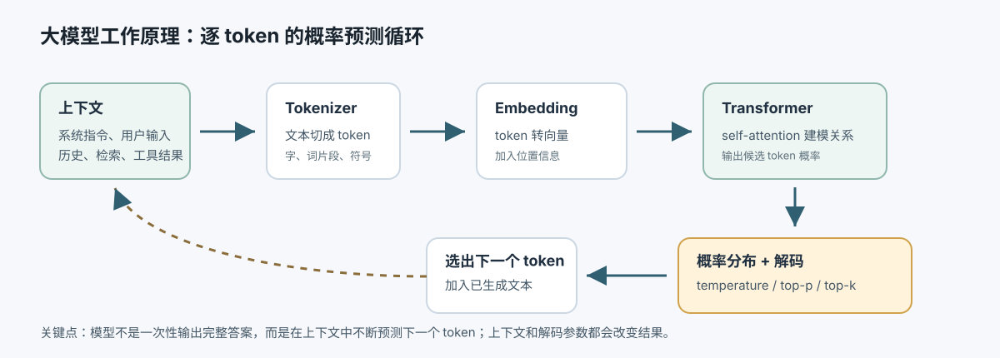

# 00.2 Transformer 的工作原理

[返回本章](README.md)

现代大语言模型的核心结构通常是 Transformer 或其变体。它的关键能力，是把输入转成 token 和向量，再通过 self-attention 计算上下文中各个 token 之间的关系，最后预测下一个 token 的概率分布。

## 1. 输入会被转换成 token

模型不是直接处理汉字、英文单词或句子，而是先把输入切成 token。token 可能是一个字、一个词、一个词片段，也可能是符号或代码片段。

例如：

```text
输入文本 -> tokenizer -> token ID -> embedding 向量
```

模型真正计算的是向量，而不是自然语言本身。

## 2. token 会变成多维向量

每个 token 会被映射成一个向量。这个向量不是人工写死的标签，而是训练出来的多维表示。

可以粗略理解为：一个 token 在很多隐藏维度上都有数值，这些维度可能和语义、语法、位置、情绪、实体类别、领域、上下文角色有关。真实模型里的维度并不会直接写着“水果维度”“手机品牌维度”，但训练会让相似上下文中的 token 在向量空间里形成可用的方向和结构。

例如“苹果”这个 token 或词片段，在不同上下文里可能同时带有多种潜在含义：

- 水果、食物、味道、口感、颜色。
- Apple 公司、手机、电脑、系统、产品体验。
- 品牌、价格、购买、维修、生态。

模型不能只靠“苹果”两个字判断意思，它必须看上下文。

## 3. 位置编码告诉模型顺序

Transformer 本身不像 RNN 那样天然按顺序读文本，所以需要加入位置信息。否则 `我喜欢苹果` 和 `苹果喜欢我` 在 token 集合上很接近，但语义完全不同。

位置编码或位置嵌入会告诉模型每个 token 在序列中的位置，让模型能同时利用“词是什么”和“词在哪里”。

## 4. Q/K/V：注意力机制的核心

模型接收系统指令、用户输入、历史消息、检索内容、工具结果等上下文。上下文不同，输出概率分布也不同。

同一个问题，在不同上下文下可能得到完全不同的答案。这不是异常，而是大模型的基本工作方式。

Transformer 的关键机制是 self-attention。每个 token 会从自己的向量出发，经过三组不同的线性变换，得到 Query、Key、Value：

```text
Q = X Wq
K = X Wk
V = X Wv
```

可以用一个不严格但好理解的比喻：

- **Query**：当前 token 想找什么信息。
- **Key**：每个 token 声明自己能被什么问题匹配到。
- **Value**：一旦被匹配，真正提供给别人的信息。

注意力计算大致是：

```text
score = Query · Key
weight = softmax(score)
output = sum(weight * Value)
```

更标准的写法是：

```text
Attention(Q, K, V) = softmax(QK^T / sqrt(d_k)) V
```

这意味着：一个 token 会拿自己的 Query 去和上下文中所有 token 的 Key 做匹配，得到一组权重，再按权重把对应的 Value 混合进来。混合后的表示，就不再只是这个 token 自己，而是带有上下文关系的新表示。

这也解释了为什么“约定角色”会影响输出。比如在系统提示词里写“你是严格的代码审查员”，并不会改变模型参数，但会把“严格审查、风险识别、测试验证、指出问题”这些语义模式放进当前上下文。后续 token 在做 Q/K/V 匹配时，更容易关注并延续这些模式，从而提高相关输出的概率。


## 5. 例子：两个“苹果”为什么含义不同

看两个句子：

```text
我喜欢苹果，它体验很好。
我喜欢苹果，它味道很美。
```

两个句子里都有“我喜欢苹果”，但后半句改变了“苹果”的语义解释。

在第一句里，“体验很好”更常和产品、设备、软件、服务搭配。这里“体验”这个 token 的 Query 会更偏向寻找产品属性、使用感受、品牌或设备相关的信息。于是“苹果”的 Key 如果在 Apple 公司、手机、电脑、系统生态这些方向上更匹配，就会获得更高注意力权重。它的 Value 传递给后续表示的，就更像“Apple 产品”。

在第二句里，“味道很美”更常和食物、水果、饮料、口感搭配。这里“味道”的 Query 会更偏向寻找食物属性、口感、气味相关的信息。于是“苹果”的 Key 如果在水果、食物、甜味、口感这些方向上更匹配，就会获得更高注意力权重。它的 Value 传递出去的，就更像“苹果水果”。

这就是“多个维度判断”的含义：模型不是只查一个词典义项，而是在高维向量空间里，根据上下文里的多个信号重新计算每个 token 之间的关系。

## 6. 多头注意力：同时从多个角度看

单个注意力头只是一种匹配方式。现代 Transformer 会使用 multi-head attention，也就是多个注意力头并行看同一段文本。

不同头可能关注不同关系：

- 有的头关注代词指代：`它` 指向谁。
- 有的头关注修饰关系：`味道` 修饰哪个对象。
- 有的头关注实体类别：`苹果` 是水果还是公司。
- 有的头关注情绪倾向：`喜欢`、`很好`、`很美` 都是正向评价。
- 有的头关注句法结构：主语、谓语、宾语、附加说明。

这些头的结果会被拼接和变换，再进入下一层。多层 Transformer 反复做这件事，低层可能偏词法和局部关系，高层可能偏语义、任务意图和抽象模式。

## 7. 前馈网络：对每个位置做非线性加工

注意力层负责让 token 之间交换信息。每一层里通常还有 feed-forward network，对每个位置的表示做进一步变换。

可以理解为：

```text
attention：从上下文取信息
feed-forward：对取到的信息做加工
```

Transformer 层还会配合残差连接、LayerNorm 等结构，让深层网络更容易训练、更稳定。

## 8. 最后输出下一个 token 的概率

经过多层 Transformer 后，每个位置都会得到一个上下文化表示。对于自回归语言模型来说，模型会用最后位置的表示去预测下一个 token。

大语言模型最核心的训练目标可以简化为：根据已有 token 预测下一个 token。

```text
P(next_token | previous_tokens)
```

当模型回答一个问题时，它不是一次性“想好整段答案”，而是不断重复：

```text
看当前上下文 -> 计算下一个 token 的概率 -> 选出一个 token -> 加回上下文 -> 继续预测
```

所以它像一个逐步展开的概率生成器。

如果上下文是：

```text
我喜欢苹果，它味道很
```

模型可能给出类似概率分布：

```text
美：0.32
好：0.21
甜：0.16
不错：0.08
糟糕：0.01
```

如果上下文是：

```text
我喜欢苹果，它体验很
```

概率分布可能变成：

```text
好：0.35
流畅：0.12
舒服：0.08
差：0.02
甜：0.01
```

这些数字只是示意，但它说明了核心逻辑：上下文改变了注意力关系，注意力关系改变了内部表示，内部表示改变了下一个 token 的概率分布。

## 9. 解码策略影响输出

模型会为每个候选 token 给出概率。系统再通过解码策略选择输出：

- temperature 越低，输出越稳定、越保守。
- temperature 越高，输出越发散、越有创造性。
- top-p / top-k 会限制候选 token 范围。
- greedy decoding 总选最高概率 token，但可能变得机械。

因此，同一个模型、同一个输入，也可能因为参数不同而输出不同答案。

## 10. 大模型不等于事实数据库

模型参数里保存的是训练中学到的统计规律、语言模式、知识关联和任务模式，不是可查询、可更新、可审计的事实表。

这会带来几个后果：

- 它可能说出流畅但错误的内容。
- 它可能不知道自己的知识是否过期。
- 它可能把相似概念混在一起。
- 它可能在信息不足时仍然补全一个看似合理的答案。

这就是幻觉问题的根源之一：模型的目标是生成高概率文本，不是天然保证事实正确。



## 11. 从微观、中观、宏观看大模型原理

理解大模型时，可以把它拆成三层：

| 层次 | 第一性原理 | 它带来的能力 | 它天然的边界 |
| --- | --- | --- | --- |
| 微观 | 概率预测：根据上下文预测下一个 token | 续写、改写、补全、分类、抽取、风格模仿 | 不是确定性程序；同一任务会受上下文、提示词和采样参数影响 |
| 中观 | 有损压缩：把文本、代码、知识和模式压进参数 | 复用大量世界知识和语言模式，能类比、解释、归纳 | 参数不是事实数据库；长尾事实、最新事实、私有知识容易不可靠 |
| 宏观 | 能力涌现：规模、数据和训练目标叠加出泛化能力 | 总结、推理、规划、代码辅助、跨领域迁移 | 更像强模式匹配和直觉推理，不等于严格可靠的证明系统 |

这三层解释了为什么大模型会同时表现出“很聪明”和“不可靠”：

- 它能快速生成流畅答案，因为微观上它很擅长预测高概率续写。
- 它能回答很多常识问题，因为中观上参数里压缩了大量知识和模式。
- 它能做归纳、类比和方案设计，因为宏观上规模化训练带来了泛化能力。
- 它会有时好、有时坏，因为概率预测不是确定性执行。
- 它会幻觉，因为有损压缩不是精确记忆。
- 它会在长链推理里走偏，因为涌现能力不等于严格推理保证。

因此，工程上不能只问“模型会不会”，还要问：

```text
这个任务依赖语言模式，还是依赖事实真值？
这个任务允许候选答案，还是要求唯一正确答案？
这个任务失败后能不能回滚？
这个任务是否需要外部系统验证？
```

如果任务只是总结、改写、草拟、分类，大模型可以直接承担更多工作；如果任务涉及事实、金额、权限、法律、医疗、生产系统或不可逆动作，就必须让外部系统补位。
