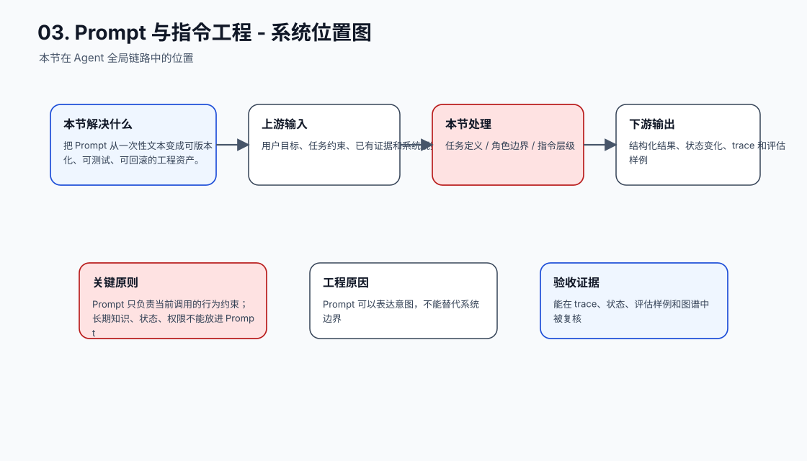
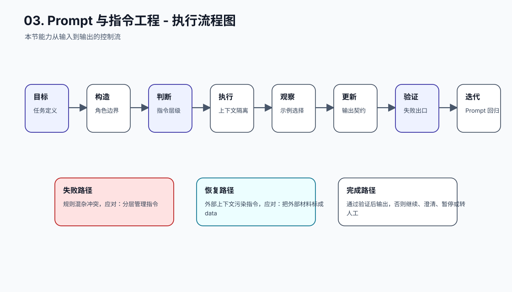
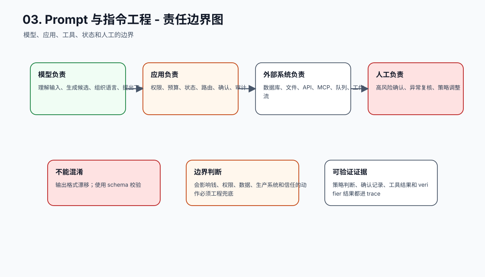
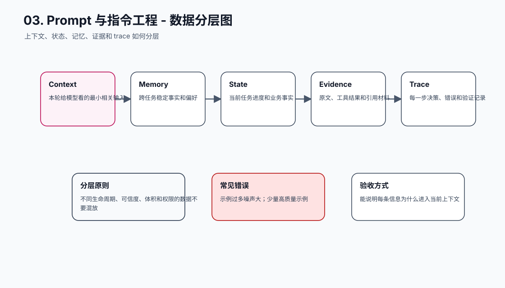
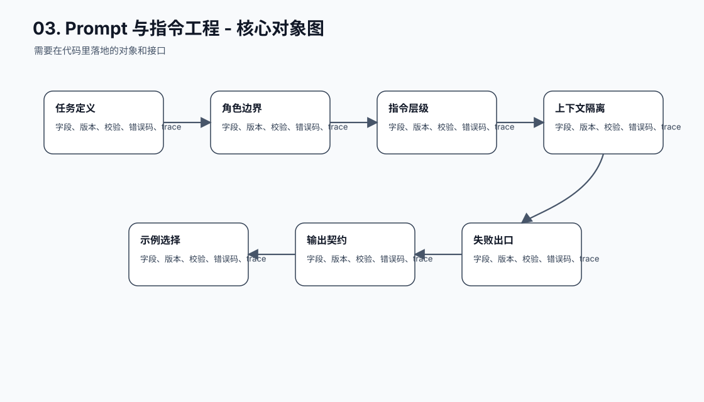
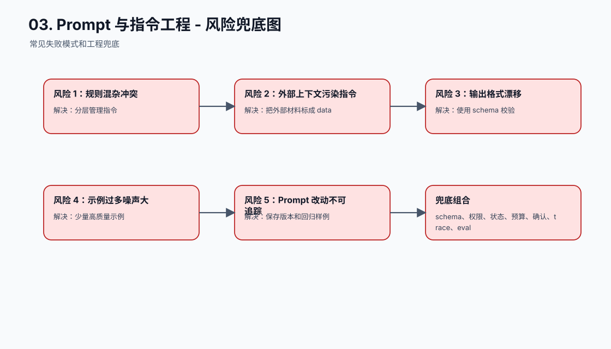
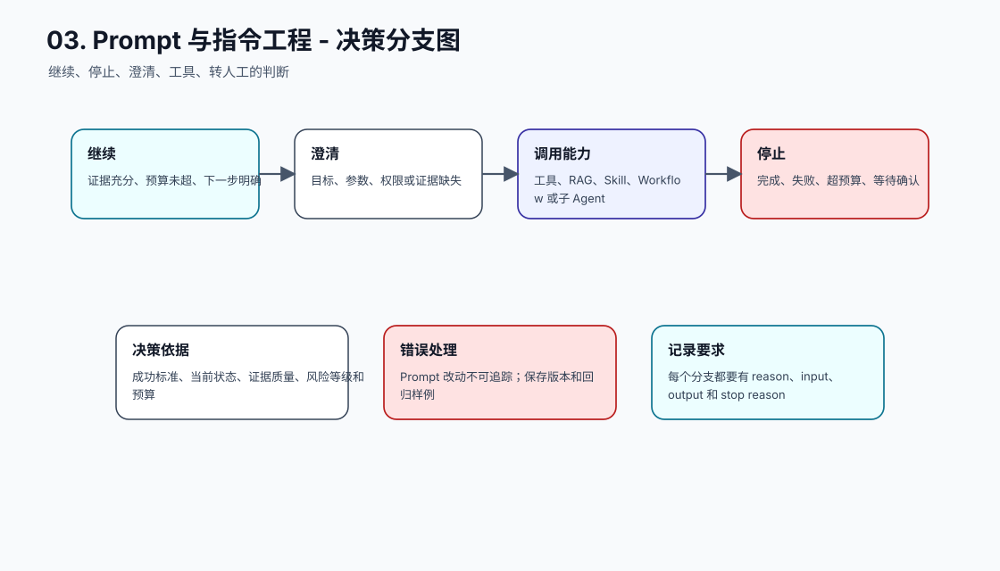
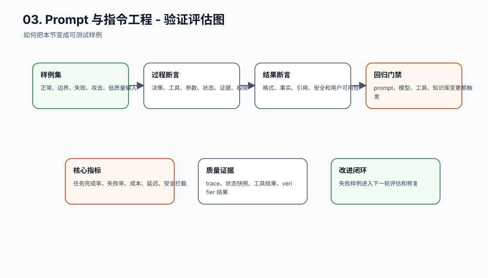
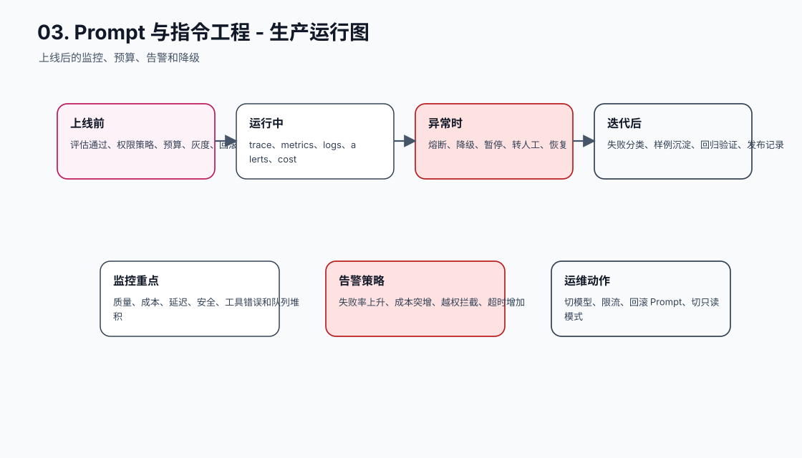
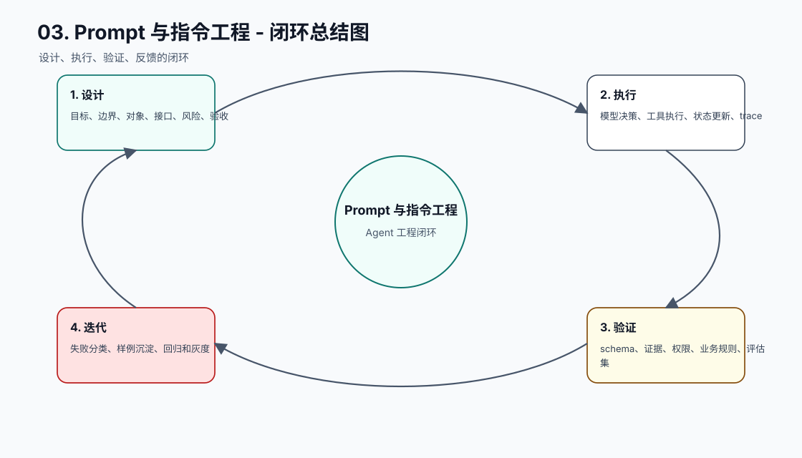

# 提示词与指令实践

[返回全局摘要](../README.md)

本模块关注 Agent 的任务定义、指令结构、输出约束和 Prompt 生命周期管理。目标是让模型行为可描述、可评审、可回归。

Prompt 不是一句“让模型更聪明”的咒语，而是 Agent 系统里最靠前的工程接口。它决定模型看到什么目标、遵守什么边界、按什么格式输出，以及在信息不足时如何退出。Prompt 写得越像可执行契约，后面的上下文、工具、状态和评测越容易接上。

学习本模块时，可以按三层理解：

| 层级 | 要解决的问题 | 对应实践 |
| --- | --- | --- |
| 任务定义 | 模型到底要完成什么，什么叫成功，什么时候该停 | 01、03、04 |
| 输入组织 | 指令、上下文、用户输入和示例如何进入模型 | 06、07、08 |
| 工程治理 | Prompt 如何版本化、测试、回滚和接入下游系统 | 02、05 |

工程上要避免两个极端：一是把 Prompt 当临时文案，线上行为变了也无法追踪；二是把所有业务流程、知识、权限和异常处理都塞进一个超长 Prompt。前者不可维护，后者会让指令冲突、上下文污染和缓存失效变得严重。更好的做法是让 Prompt 只承担当前推理所需的任务定义和行为约束，长期知识交给 RAG，状态交给确定性系统，动作权限交给应用层。

## 工程落点

一个可上线的 Prompt 至少应留下四类产物：

- Prompt 文件或模板，能被版本管理和代码评审。
- 输入输出契约，说明需要哪些上下文、允许哪些工具、输出必须符合什么 schema。
- 回归样例，覆盖正常路径、缺失信息、冲突信息、越权请求和格式边界。
- 发布记录，关联 Prompt 版本、模型版本、评测结果和线上指标。

如果这四类产物缺失，Prompt 调优就会退化成试错：看起来今天变好了，但没人知道为什么变好，也不知道下次改动会不会破坏已有行为。

## 本节图谱：10 张图讲透

这一节至少要能用图讲清楚三件事：它在 Agent 全局链路里的位置，它和模型、工具、状态、记忆、评估的边界，以及它上线后怎么被验证和运维。下面 10 张图按固定顺序展开：系统位置、执行流程、责任边界、数据分层、核心对象、风险兜底、决策分支、验证评估、生产运行、闭环总结。

**图 03-1：Prompt 与指令工程 - 系统位置图**  

**图 03-2：Prompt 与指令工程 - 执行流程图**  

**图 03-3：Prompt 与指令工程 - 责任边界图**  

**图 03-4：Prompt 与指令工程 - 数据分层图**  

**图 03-5：Prompt 与指令工程 - 核心对象图**  

**图 03-6：Prompt 与指令工程 - 风险兜底图**  

**图 03-7：Prompt 与指令工程 - 决策分支图**  

**图 03-8：Prompt 与指令工程 - 验证评估图**  

**图 03-9：Prompt 与指令工程 - 生产运行图**  

**图 03-10：Prompt 与指令工程 - 闭环总结图**  

## 补充工程表

### 模块拆解表

| 模块 | 解决的问题 | 落地要求 |
| --- | --- | --- |
| 任务定义 | 本节链路中的关键能力 | 有输入、输出、状态变化、错误路径和 trace 记录 |
| 角色边界 | 本节链路中的关键能力 | 有输入、输出、状态变化、错误路径和 trace 记录 |
| 指令层级 | 本节链路中的关键能力 | 有输入、输出、状态变化、错误路径和 trace 记录 |
| 上下文隔离 | 本节链路中的关键能力 | 有输入、输出、状态变化、错误路径和 trace 记录 |
| 示例选择 | 本节链路中的关键能力 | 有输入、输出、状态变化、错误路径和 trace 记录 |
| 输出契约 | 本节链路中的关键能力 | 有输入、输出、状态变化、错误路径和 trace 记录 |
| 失败出口 | 本节链路中的关键能力 | 有输入、输出、状态变化、错误路径和 trace 记录 |
| Prompt 回归 | 本节链路中的关键能力 | 有输入、输出、状态变化、错误路径和 trace 记录 |

### 原则与原因表

| 工程原则 | 具体做法 | 为什么这么做 |
| --- | --- | --- |
| Prompt 只负责当前调用的行为约束 | 长期知识、状态、权限不能放进 Prompt | Prompt 可以表达意图，不能替代系统边界 |
| 指令、上下文、用户输入要分离 | 每段都标明来源、可信度和用途 | 降低注入、冲突和格式漂移 |
| Prompt 要纳入变更管理 | 保存版本、hash、样例和指标 | Prompt 变化会改变 Agent 行为 |

### 踩坑与兜底表

| 常见坑 | 兜底方式 | 为什么这么做 |
| --- | --- | --- |
| 规则混杂冲突 | 分层管理指令 | 把失败变成可定位、可恢复、可回归的工程事件 |
| 外部上下文污染指令 | 把外部材料标成 data | 把失败变成可定位、可恢复、可回归的工程事件 |
| 输出格式漂移 | 使用 schema 校验 | 把失败变成可定位、可恢复、可回归的工程事件 |
| 示例过多噪声大 | 少量高质量示例 | 把失败变成可定位、可恢复、可回归的工程事件 |
| Prompt 改动不可追踪 | 保存版本和回归样例 | 把失败变成可定位、可恢复、可回归的工程事件 |
