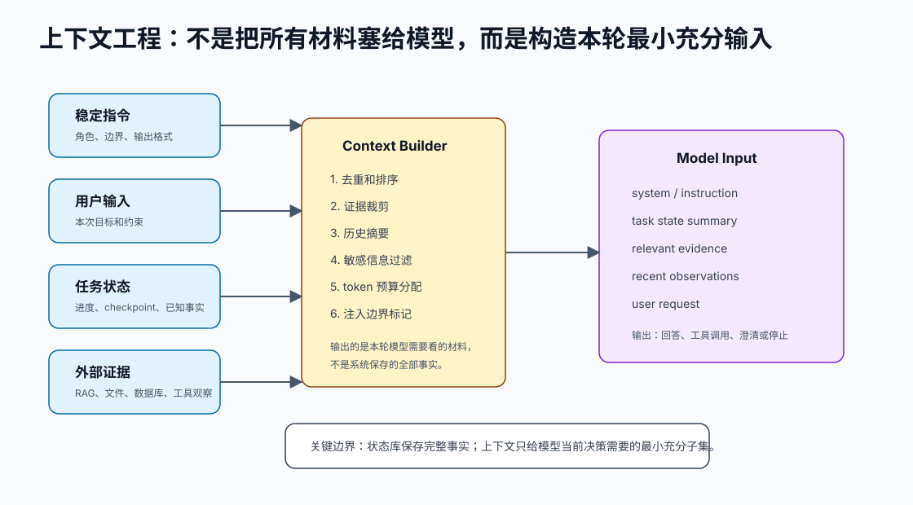

# 上下文构造可观测

[返回全局摘要](../README.md) · [返回本组：上下文工程与 RAG](README.md)


## Rule
记录上下文从查询、检索、过滤、排序到最终注入 Prompt 的全过程。



## Why
没有可观测性时，RAG 错误难以复现，无法判断问题发生在查询、索引、过滤还是生成阶段。

上下文工程不是把所有历史、工具结果和检索内容都塞进 Prompt。更准确地说，它是为当前决策构造“最小充分输入”：

```text
稳定指令
→ 用户本轮目标
→ 当前任务状态摘要
→ 相关证据
→ 最近工具观察
→ 输出格式和验证要求
```

完整事实应该保存在状态库、artifact、数据库或 trace 中；模型上下文只放本轮需要参与推理的子集。否则上下文会越来越长，旧错误会污染新判断，敏感信息也更容易泄漏。

## Optimize
- 记录 query、检索参数、候选列表、过滤原因和最终上下文。
- 保存上下文版本、权限判断和 token 使用量。
- 对长对话记录稳定前缀版本、工具定义版本、工具顺序、模型 ID、缓存命中率和首 token 延迟。
- 为线上答案保留可追溯 trace。
- 把 Context Builder 当成独立模块，而不是字符串拼接。
- 对证据做边界标记，明确外部内容只能作为证据，不能作为指令。
- 保存原始 artifact，同时只把裁剪后的片段注入模型。
- 给摘要保留来源引用，避免摘要错误后无法追溯。

Context Builder 至少应记录：

| 阶段 | 需要记录 |
| --- | --- |
| 选择 | 为什么选这些历史、证据和工具结果 |
| 过滤 | 哪些候选被丢弃，原因是什么 |
| 排序 | 相关性、时间、权限或优先级依据 |
| 裁剪 | token 预算、截断位置、摘要策略 |
| 注入 | 最终进入模型的内容、版本和边界标记 |

## Verify
- 随机抽取答案并完整回放上下文构造过程。
- 检查日志是否足以定位失败原因。
- 监控召回、过滤、注入、缓存命中和生成各阶段指标。
- 检查最终回答里的证据引用是否能回到原始 artifact。
- 检查外部资料中的“忽略之前指令”等内容是否被当作不可信证据处理。
- 检查 token 超预算时被裁剪的是低优先级材料，而不是成功标准或最新用户输入。

## References
- Trace 日志规范
- RAG 可观测面板
- 线上问题复盘

---

[返回全局摘要](../README.md) · [返回本组：上下文工程与 RAG](README.md)
