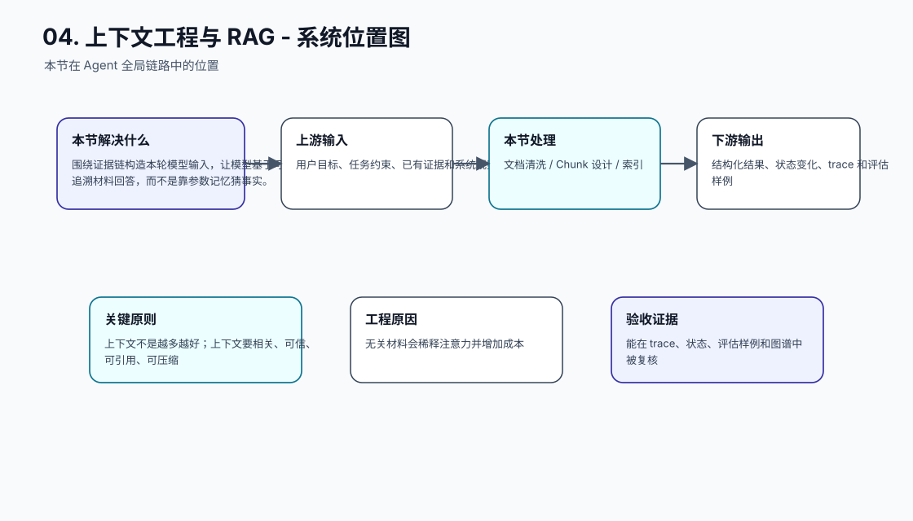
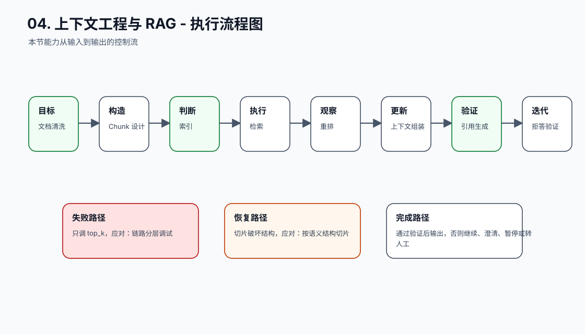
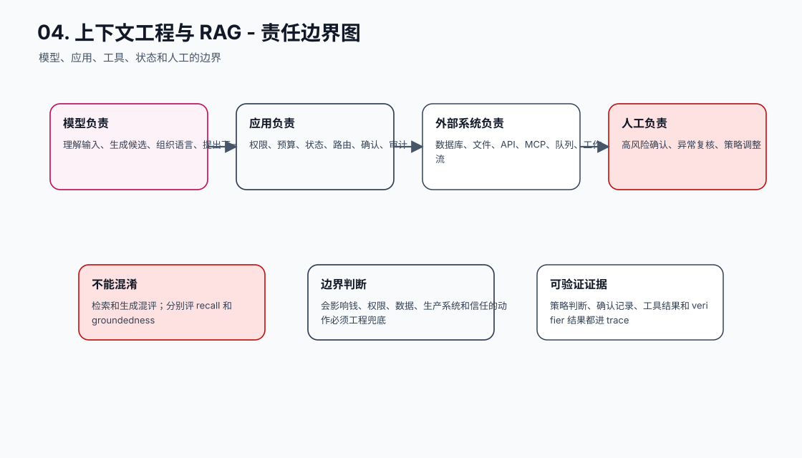
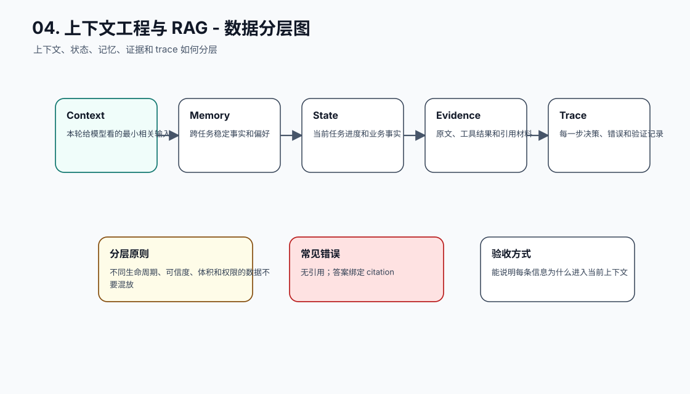
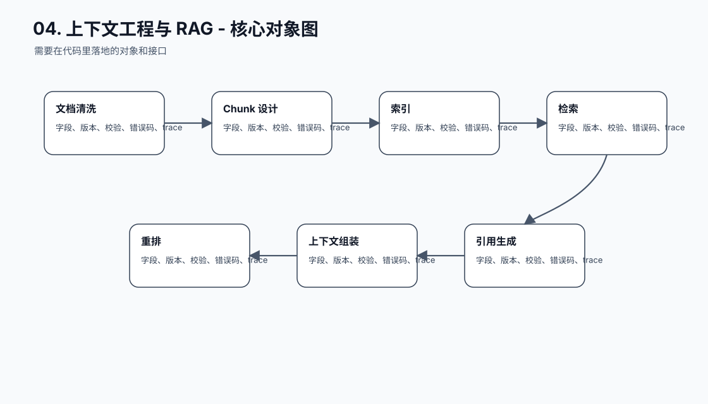
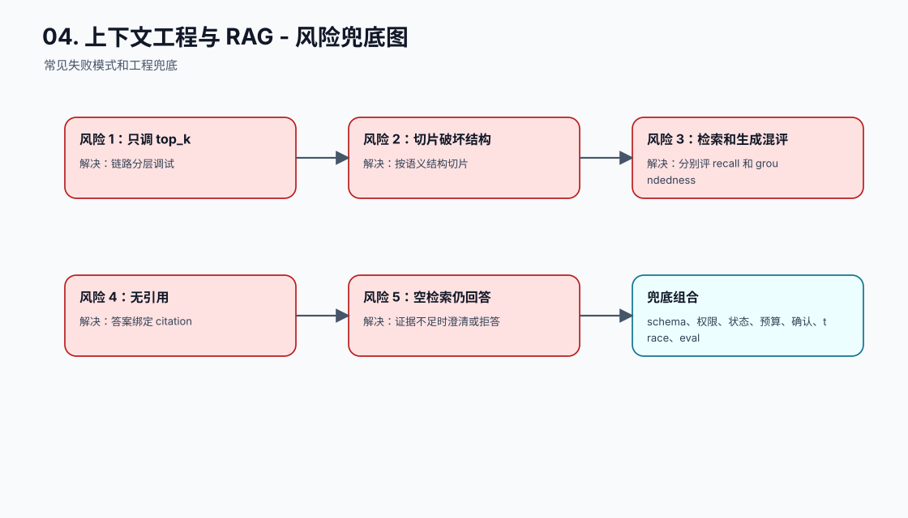
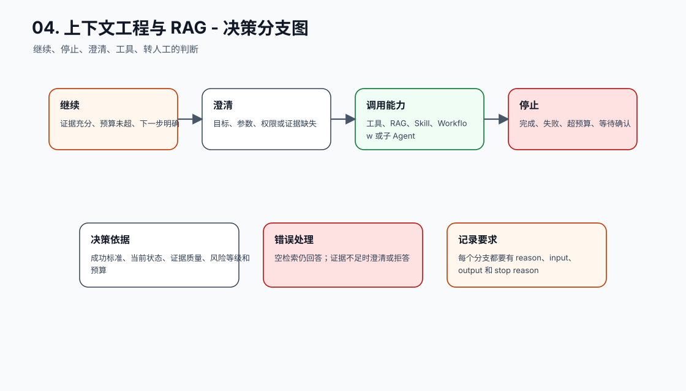
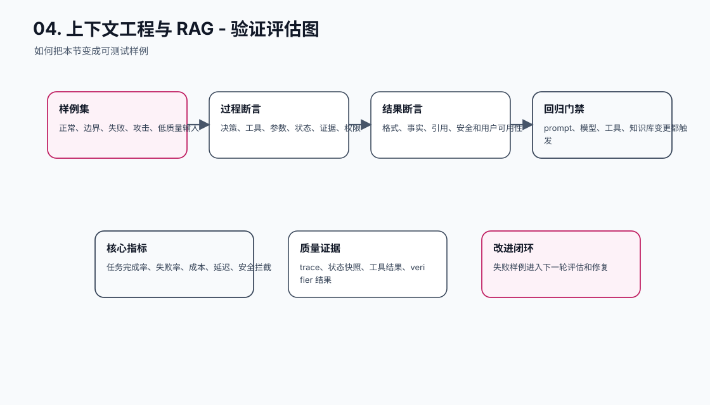
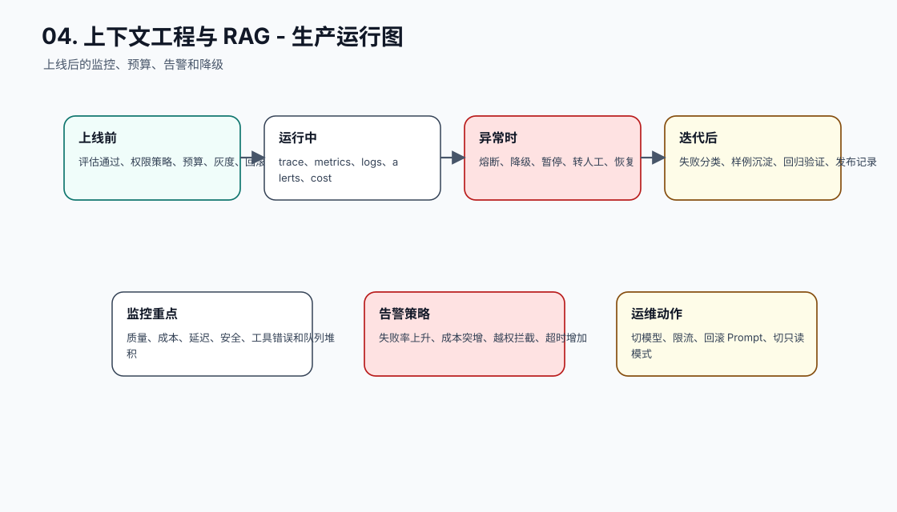
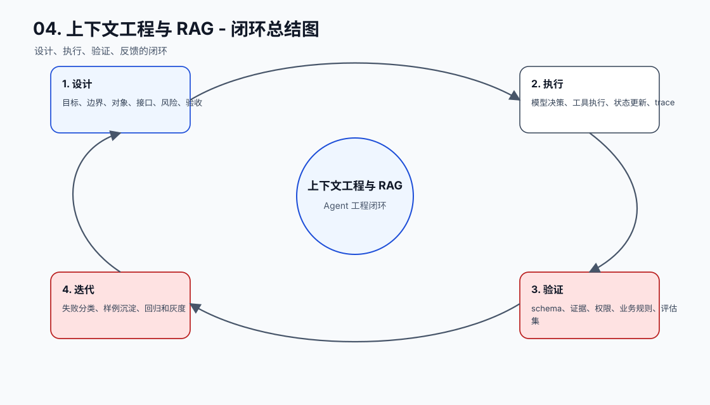

# 上下文工程与 RAG

[返回全局摘要](../README.md)

本模块关注上下文选择、检索、证据约束、注入防护和上下文构造的可观测性。目标是让模型基于合适、可信、可追踪的上下文工作。

上下文工程的核心问题不是“怎样把更多内容塞进模型”，而是“怎样把当前决策真正需要的证据、状态和约束放到正确位置”。RAG 只是上下文工程的一种来源：它从外部知识库取证据；除此之外，Agent 还会把工具结果、任务状态、历史摘要、用户偏好和输出格式一起装进上下文。

可以把本模块理解成一条链路：

```text
问题理解
-> 查询改写
-> 检索召回
-> 过滤和排序
-> 上下文扩展
-> 去重压缩
-> 注入 Prompt
-> 生成回答
-> 引用验证
-> trace 回放
```

每一层都可能失败。召回不到资料，不是生成模型能补救的；资料进了上下文但模型忽略证据，说明生成约束或验证有问题；资料本身含恶意指令，说明信任边界有问题。因此 RAG 不能只看最终答案，而要看证据是怎么被找出、筛选、使用和验证的。

## 工程落点

一个可维护的 RAG / 上下文系统至少需要这些能力：

- 文档和 chunk 有稳定 ID、来源、时间、版本和权限元数据。
- 检索和生成分开评估，能判断失败发生在哪一段。
- 空检索、低置信、证据冲突和注入攻击有明确处理策略。
- 最终回答能引用证据，证据能回到原始 artifact。
- Context Builder 能记录选择、过滤、裁剪和注入过程。
- 上下文预算可配置，避免把低相关资料、工具说明和示例全量塞入模型。

如果系统无法解释“为什么这段资料进入了 Prompt，为什么另一段被丢弃”，就还没有真正进入上下文工程阶段。


## 本节图谱：10 张图讲透

这一节至少要能用图讲清楚三件事：它在 Agent 全局链路里的位置，它和模型、工具、状态、记忆、评估的边界，以及它上线后怎么被验证和运维。下面 10 张图按固定顺序展开：系统位置、执行流程、责任边界、数据分层、核心对象、风险兜底、决策分支、验证评估、生产运行、闭环总结。

**图 04-1：上下文工程与 RAG - 系统位置图**  


**图 04-2：上下文工程与 RAG - 执行流程图**  


**图 04-3：上下文工程与 RAG - 责任边界图**  


**图 04-4：上下文工程与 RAG - 数据分层图**  


**图 04-5：上下文工程与 RAG - 核心对象图**  


**图 04-6：上下文工程与 RAG - 风险兜底图**  


**图 04-7：上下文工程与 RAG - 决策分支图**  


**图 04-8：上下文工程与 RAG - 验证评估图**  


**图 04-9：上下文工程与 RAG - 生产运行图**  


**图 04-10：上下文工程与 RAG - 闭环总结图**  


## 补充工程表

### 模块拆解表

| 模块 | 解决的问题 | 落地要求 |
| --- | --- | --- |
| 文档清洗 | 本节链路中的关键能力 | 有输入、输出、状态变化、错误路径和 trace 记录 |
| Chunk 设计 | 本节链路中的关键能力 | 有输入、输出、状态变化、错误路径和 trace 记录 |
| 索引 | 本节链路中的关键能力 | 有输入、输出、状态变化、错误路径和 trace 记录 |
| 检索 | 本节链路中的关键能力 | 有输入、输出、状态变化、错误路径和 trace 记录 |
| 重排 | 本节链路中的关键能力 | 有输入、输出、状态变化、错误路径和 trace 记录 |
| 上下文组装 | 本节链路中的关键能力 | 有输入、输出、状态变化、错误路径和 trace 记录 |
| 引用生成 | 本节链路中的关键能力 | 有输入、输出、状态变化、错误路径和 trace 记录 |
| 拒答验证 | 本节链路中的关键能力 | 有输入、输出、状态变化、错误路径和 trace 记录 |

### 原则与原因表

| 工程原则 | 具体做法 | 为什么这么做 |
| --- | --- | --- |
| 上下文不是越多越好 | 上下文要相关、可信、可引用、可压缩 | 无关材料会稀释注意力并增加成本 |
| 检索质量和生成质量分开评估 | 先看有没有检到，再看有没有用对 | 方便定位问题发生在哪一层 |
| RAG 必须有空检索策略 | 没有证据时澄清、拒答或转人工 | 事实系统不能鼓励模型补编 |

### 踩坑与兜底表

| 常见坑 | 兜底方式 | 为什么这么做 |
| --- | --- | --- |
| 只调 top_k | 链路分层调试 | 把失败变成可定位、可恢复、可回归的工程事件 |
| 切片破坏结构 | 按语义结构切片 | 把失败变成可定位、可恢复、可回归的工程事件 |
| 检索和生成混评 | 分别评 recall 和 groundedness | 把失败变成可定位、可恢复、可回归的工程事件 |
| 无引用 | 答案绑定 citation | 把失败变成可定位、可恢复、可回归的工程事件 |
| 空检索仍回答 | 证据不足时澄清或拒答 | 把失败变成可定位、可恢复、可回归的工程事件 |
