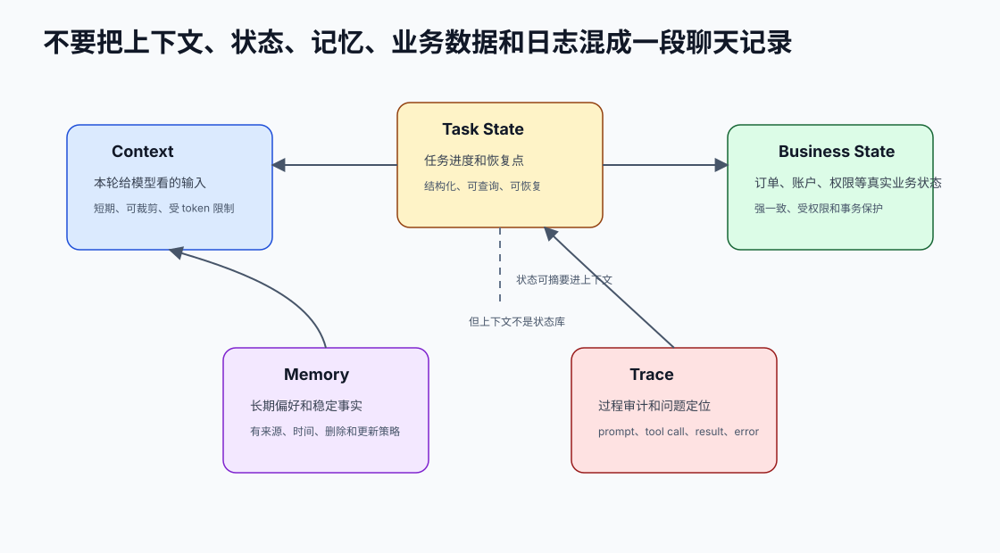

# 24. 任务状态用确定性系统管理

[返回全局摘要](../README.md) · [返回本组：记忆与状态管理](README.md)

## Status
Recommended

Category: memory-state

## Rule
任务状态用确定性系统管理，不依赖模型记忆。



## Why
模型会遗漏、压缩或误读历史。任务状态如果只存在自然语言上下文中，长流程会出现重复执行、漏步骤和错误恢复。

需要明确区分五类信息：

| 类型 | 保存什么 | 生命周期 | 用途 |
| --- | --- | --- | --- |
| Context | 本轮模型输入 | 单轮或短期 | 让模型完成当前决策 |
| Task State | 当前进度、已知事实、checkpoint | 任务期间 | 恢复、调度、验证 |
| Business State | 订单、账户、文件、数据库真实状态 | 业务生命周期 | 真实系统操作 |
| Memory | 用户偏好、稳定事实、长期经验 | 跨任务 | 个性化和连续性 |
| Trace | prompt、tool call、结果、错误 | 按审计策略保留 | 调试、回放、评测 |

对话历史可以帮助模型理解，但不能承担状态机职责。状态必须能被程序查询、更新、校验和恢复。

## Optimize
使用数据库、队列、状态机、检查清单或工作流引擎记录任务状态。模型只读取和建议下一步，状态变更由应用按规则提交。

一个任务状态可以包含：

```json
{
  "task_id": "readme_review_001",
  "status": "running",
  "progress": {
    "read_files": ["README.md", "package.json"],
    "pending_files": []
  },
  "facts": [
    {
      "claim": "README 提到 npm run start",
      "source": "README.md:18",
      "confidence": "observed"
    }
  ],
  "checkpoint": {
    "last_completed_step": "read_supporting_files",
    "next_action": "verify_findings"
  }
}
```

状态更新要注意：

- 幂等：同一工具结果重试两次，不应重复写入同一事实。
- 版本：多 Agent 或异步工具并发更新时，要有乐观锁或事务。
- 来源：每条事实都应能追溯到工具结果、文件、数据库或用户输入。
- 恢复：失败后能从 checkpoint 继续，而不是重新让模型猜。

## Verify
中断并恢复任务，确认系统能从持久状态继续，而不是靠模型猜测上次做到哪里。

还应测试：

- 工具成功但状态写入失败时，系统是否能避免重复副作用。
- 用户修正旧事实后，状态是否更新并停止使用旧事实。
- 并发更新同一任务时，是否出现覆盖或丢失。
- 任务完成前 verifier 是否能读取状态判断成功标准。

## References
- OpenAI Agents SDK: workflows and state
- Durable execution and workflow engine design patterns

---

[返回全局摘要](../README.md) · [返回本组：记忆与状态管理](README.md)
