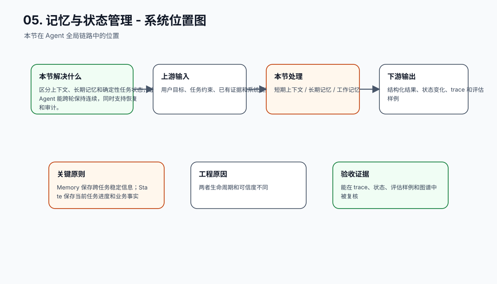
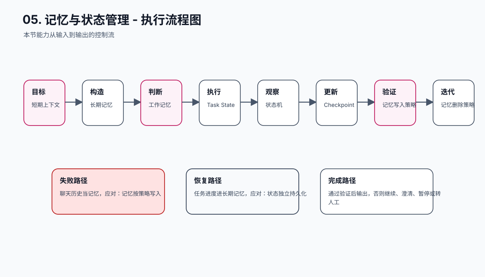
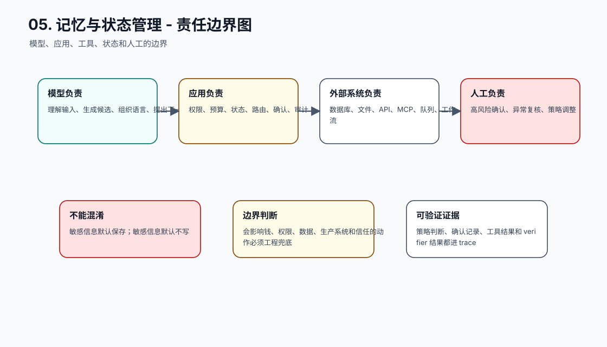
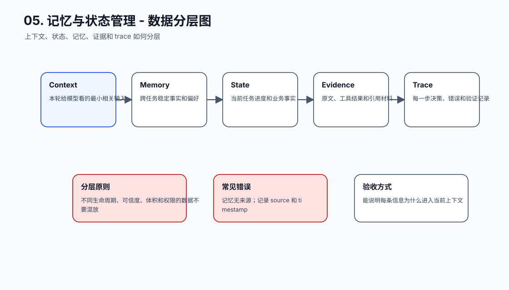
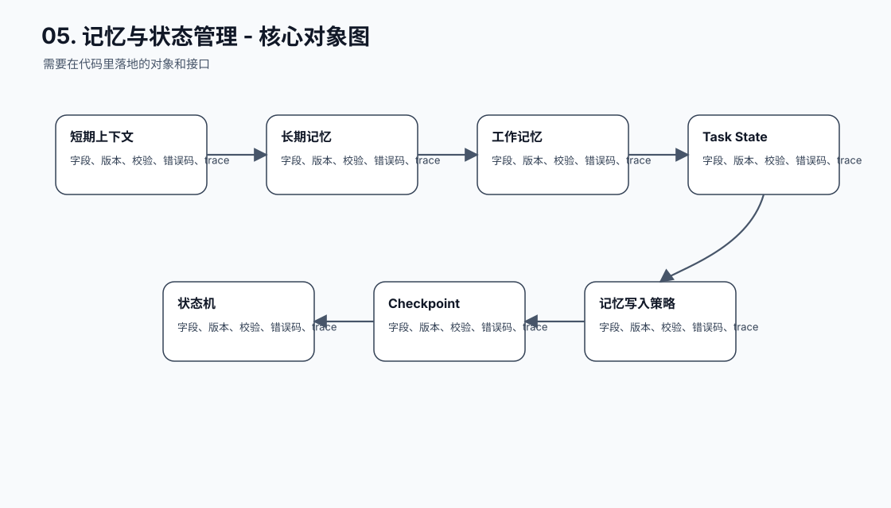
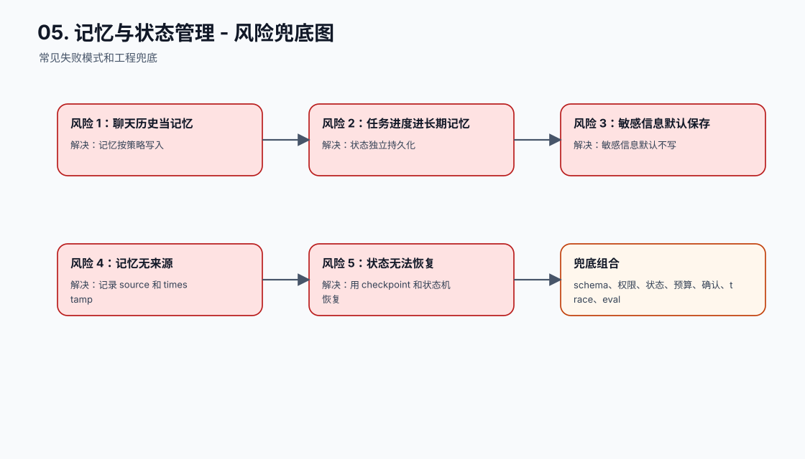
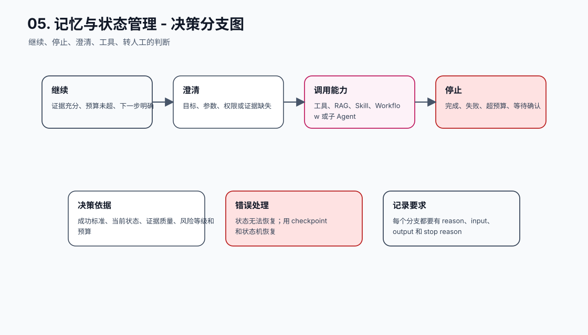
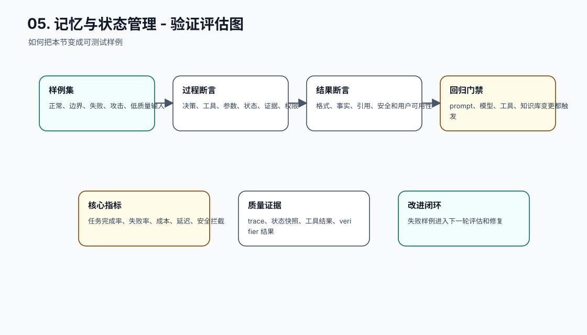
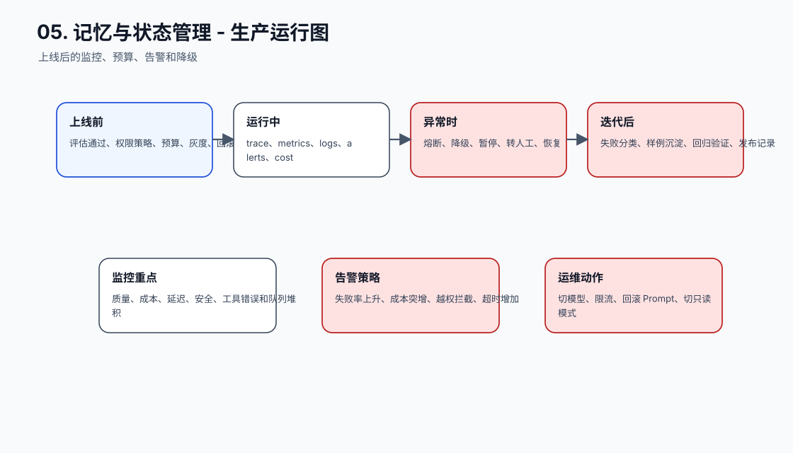
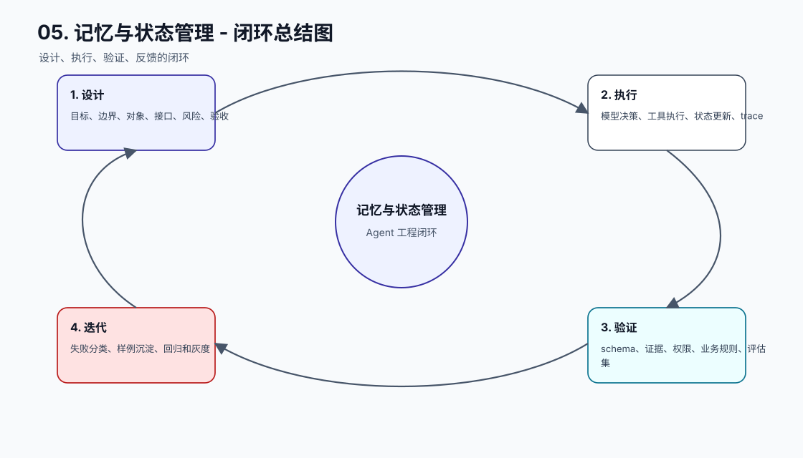

# 记忆与状态管理

[返回全局摘要](../README.md)

本模块关注短期上下文、长期记忆、结构化记忆和业务状态的边界。目标是避免让自然语言上下文承担过多记忆和状态职责，同时保留可控的个性化、任务连续性和长时运行能力。

Agent 看起来“记得”事情，工程上通常是系统在每轮请求前重新装配上下文、检索记忆、读取状态。这里必须分清三件事：

| 概念 | 作用 | 不应承担 |
| --- | --- | --- |
| 上下文 | 本轮给模型看的有限输入 | 长期存储、完整审计 |
| 记忆 | 跨任务复用的偏好、事实和经验 | 任务进度、审批状态、真实业务状态 |
| 状态 | 可查询、可恢复、可验证的任务进度 | 模糊偏好、未经确认的用户画像 |

很多 Agent 失控不是因为模型不够强，而是把这三层混在一起：用聊天记录当状态机，用长期记忆保存临时结论，用 Prompt 承担业务数据库职责。正确做法是让上下文负责当前推理，记忆负责跨任务连续性，状态负责确定性执行和恢复。

## 工程落点

记忆系统至少要实现四类控制：

- 写入控制：什么信息可以进入长期记忆，谁有权写入，是否需要用户确认。
- 读取控制：哪些任务可以读取哪些记忆，是否需要权限过滤和相关性排序。
- 更新控制：用户纠正、事实过期、来源冲突时如何改写或失效。
- 删除控制：用户要求忘记、敏感信息误写入、合规保留期到期时如何删除。

如果记忆只能追加、不能解释来源、不能删除，也不能证明为什么某条记忆影响了当前回答，它就不适合进入生产 Agent。

更完整的运行链路已经合并到 [工具调用、MCP 与多 Agent](../04-tools-agents/README.md) 小节，那里会把记忆、状态、Skill 路由、动态上下文组装和 trace 回归放在同一套 Agent 工程结构里处理。

## 本节图谱：10 张图讲透

这一节至少要能用图讲清楚三件事：它在 Agent 全局链路里的位置，它和模型、工具、状态、记忆、评估的边界，以及它上线后怎么被验证和运维。下面 10 张图按固定顺序展开：系统位置、执行流程、责任边界、数据分层、核心对象、风险兜底、决策分支、验证评估、生产运行、闭环总结。

**图 05-1：记忆与状态管理 - 系统位置图**  

**图 05-2：记忆与状态管理 - 执行流程图**  

**图 05-3：记忆与状态管理 - 责任边界图**  

**图 05-4：记忆与状态管理 - 数据分层图**  

**图 05-5：记忆与状态管理 - 核心对象图**  

**图 05-6：记忆与状态管理 - 风险兜底图**  

**图 05-7：记忆与状态管理 - 决策分支图**  

**图 05-8：记忆与状态管理 - 验证评估图**  

**图 05-9：记忆与状态管理 - 生产运行图**  

**图 05-10：记忆与状态管理 - 闭环总结图**  

## 补充工程表

### 模块拆解表

| 模块 | 解决的问题 | 落地要求 |
| --- | --- | --- |
| 短期上下文 | 本节链路中的关键能力 | 有输入、输出、状态变化、错误路径和 trace 记录 |
| 长期记忆 | 本节链路中的关键能力 | 有输入、输出、状态变化、错误路径和 trace 记录 |
| 工作记忆 | 本节链路中的关键能力 | 有输入、输出、状态变化、错误路径和 trace 记录 |
| Task State | 本节链路中的关键能力 | 有输入、输出、状态变化、错误路径和 trace 记录 |
| 状态机 | 本节链路中的关键能力 | 有输入、输出、状态变化、错误路径和 trace 记录 |
| Checkpoint | 本节链路中的关键能力 | 有输入、输出、状态变化、错误路径和 trace 记录 |
| 记忆写入策略 | 本节链路中的关键能力 | 有输入、输出、状态变化、错误路径和 trace 记录 |
| 记忆删除策略 | 本节链路中的关键能力 | 有输入、输出、状态变化、错误路径和 trace 记录 |

### 原则与原因表

| 工程原则 | 具体做法 | 为什么这么做 |
| --- | --- | --- |
| Memory 保存跨任务稳定信息 | State 保存当前任务进度和业务事实 | 两者生命周期和可信度不同 |
| 记忆必须可更新和删除 | 来源、时间、置信度、TTL 都要记录 | 长期信息会过期或被用户纠正 |
| 状态由确定性系统管理 | phase、facts、pending_actions、budget 可查询 | 长任务和工具调用依赖可恢复状态 |

### 踩坑与兜底表

| 常见坑 | 兜底方式 | 为什么这么做 |
| --- | --- | --- |
| 聊天历史当记忆 | 记忆按策略写入 | 把失败变成可定位、可恢复、可回归的工程事件 |
| 任务进度进长期记忆 | 状态独立持久化 | 把失败变成可定位、可恢复、可回归的工程事件 |
| 敏感信息默认保存 | 敏感信息默认不写 | 把失败变成可定位、可恢复、可回归的工程事件 |
| 记忆无来源 | 记录 source 和 timestamp | 把失败变成可定位、可恢复、可回归的工程事件 |
| 状态无法恢复 | 用 checkpoint 和状态机恢复 | 把失败变成可定位、可恢复、可回归的工程事件 |
