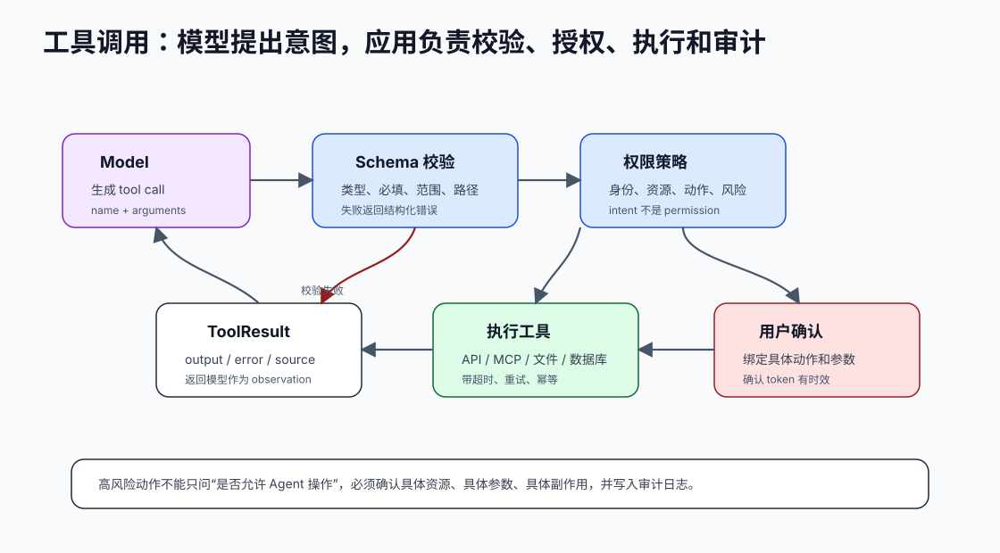

# 27. 模型只提出调用意图，应用负责权限

[返回全局摘要](../README.md) · [返回本组：MCP、工具调用与多 Agent](README.md)

## Status
Recommended

Category: tools-agents

## Rule
模型只提出工具调用意图，应用负责权限判断和执行。



## Why
模型不应成为权限边界。真正的授权、审计、速率限制和数据访问控制应在应用层执行。

模型可以生成：

```json
{
  "tool": "write_file",
  "arguments": {
    "path": "README.md",
    "content": "..."
  }
}
```

这只表示“模型建议这样做”，不表示系统应该执行。执行前必须由应用回答：

- 当前用户是谁？
- 请求哪个资源？
- 执行什么动作？
- 任务是否允许这个动作？
- 动作是只读、写入还是高风险？
- 是否需要用户确认？
- 参数是否和确认内容完全一致？

## Optimize
把工具调用拆成“模型建议”和“应用校验”。应用根据用户身份、资源权限、风险等级和策略决定是否执行、拒绝或要求确认。

推荐流程：

```text
模型生成 tool_call
→ schema 校验
→ 资源范围校验
→ 用户和租户权限校验
→ 风险分级
→ 必要时请求确认
→ 执行工具
→ 返回结构化 ToolResult
→ 写入 trace
```

高风险确认必须绑定具体动作和参数。不要只问“是否允许 Agent 修改文件”，而要问“是否允许把 README.md 中的 `npm run start` 改成 `npm run docs:serve`”。

## Verify
模拟越权资源、缺少权限和高风险操作，确认模型即使提出调用，应用也能阻止执行。

还要验证：

- 路径逃逸如 `../../.ssh/id_rsa` 是否被拒绝。
- 未注册工具是否被拒绝。
- 写工具没有确认时任务是否进入 `waiting_for_user`。
- 确认 token 是否只能用于原始工具名和参数。
- 工具失败是否以结构化 observation 返回，而不是让 Agent 编造成功。

## References
- OpenAI Agents SDK: guardrails and tool execution
- OWASP: access control principles

---

[返回全局摘要](../README.md) · [返回本组：MCP、工具调用与多 Agent](README.md)
