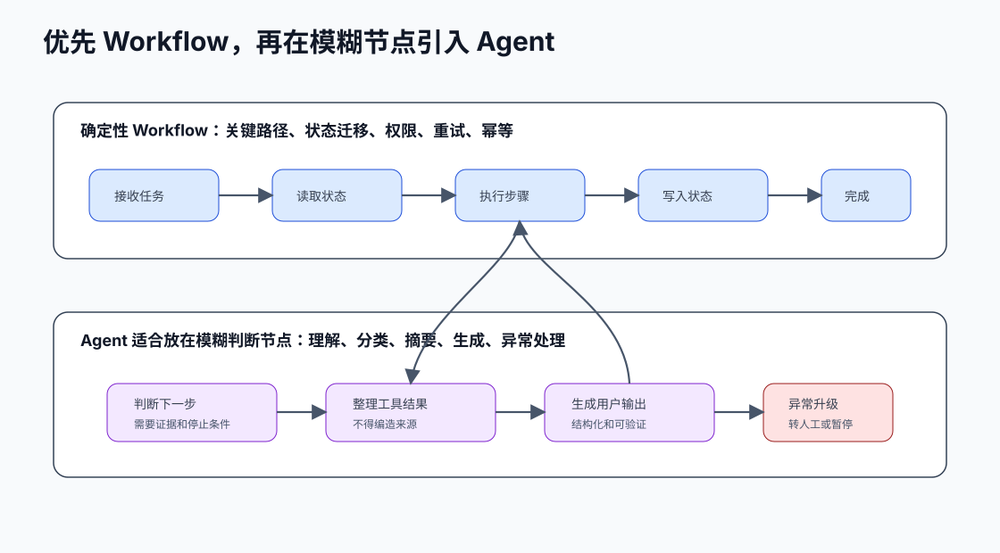

# 30. 优先 workflow，再升级 Agent

[返回全局摘要](../README.md) · [返回本组：MCP、工具调用与多 Agent](README.md)

## Status
Recommended

Category: tools-agents

## Rule
优先使用 workflow，必要时再升级为 Agent。固定流程、长文本多轮任务，以及 RAG、MCP、Skill、Tool 多模块协作，都应先设计成可观察、可恢复、可验证的工作流。



## Why
很多业务流程有清晰步骤和条件，用确定性 workflow 更容易测试、审计和控制。Agent 适合开放式判断、动态规划和工具选择。

很多 AI 应用失败，不是因为缺少 Agent，而是因为把本该由 workflow 管理的职责交给了模型自由发挥：

| 场景 | 直接交给自主 Agent 的风险 | workflow 应承担的职责 |
| --- | --- | --- |
| 固定业务流程 | 越权、漏步骤、难审计 | 状态机、权限、审批、幂等和回滚 |
| 长文本多轮任务 | 上下文爆炸、死循环、幻觉修复、无法结单 | 分块、状态表、验证、熔断和结单 |
| RAG + Tool 协作 | 分不清查知识还是执行动作 | 检索、证据引用、工具权限和任务状态分层 |
| MCP 暴露多系统 | 统一接口变成统一风险入口 | 资源、只读工具、写工具和高风险工具分级控制 |
| Skill 复用流程 | Skill 只剩角色设定，Agent 临场猜 | 触发条件、前置检查、执行步骤和质量标准；大规模 Skill 管理放到专题处理 |

## Optimize
先把稳定流程建成工作流，把模型放在需要理解、生成或决策的节点。只有当路径无法提前枚举时，再引入更自主的 Agent。

可以把 Harness Engineering 理解为 workflow-first 在复杂 Agent 里的落地外壳：它不只是一个规则文件或提示词，而是一组围绕模型外部运行链路的控制面。

| Harness 模块 | workflow 中的职责 |
| --- | --- |
| 上下文工程 | 只注入当前步骤需要的信息，隔离无关材料，维护阶段摘要和证据引用。 |
| 工具编排 | 按任务阶段、权限和风险裁剪工具集，避免把全部工具暴露给模型。 |
| 验证机制 | 用确定性规则、测试、lint、schema 和独立评估节点验收模型输出。 |
| 状态管理 | 把任务进度、检查点、开放问题和下一步动作持久化到外部系统。 |
| 可观测性 | 记录上下文、工具调用、验证反馈、错误类型和人工确认，支持 trace 回放。 |
| 人类接管 | 在高风险、不可逆、权限冲突、成本超限或反复失败时暂停自动执行。 |

这个视角的价值在于避免把 Agent 可靠性误解成“多写几条 prompt”。Prompt 可以引导单轮行为，Context 可以补充信息，但长链路任务的可靠性来自外部流程、状态、验证、回滚和审计。

工作流设计时先明确模块职责：

- Agent 负责规划、路由和整合，但不能绕过权限和状态机。
- Skill 负责流程、模板、检查清单和经验复用。
- MCP 负责标准化连接资源和工具，并暴露清晰的能力边界。
- RAG 负责提供可引用的知识证据，不负责执行动作。
- Tool 负责执行动作并返回结构化结果。
- Workflow、权限、审计和人审负责控制风险。

### 长任务 Agent 的八个工程控制点

长任务不能只让 Agent 自己“想一步做一步”。在进入执行前，应把下面八个控制点放进 workflow 设计里：

| 控制点 | 要回答的问题 | 工程做法 |
| --- | --- | --- |
| 任务拆解 | 长任务怎么拆解才不会乱？ | 把目标拆成可执行单元，定义每个单元的输入、输出、依赖、完成标准和失败条件。 |
| 上下文管理 | 上下文过载怎么高效管理？ | 区分当前工作上下文、阶段摘要、证据引用和历史归档；只把当前步骤需要的信息注入模型。 |
| 工具编排 | 工具太多怎么编排才不会错用？ | 按任务阶段、权限和风险选择工具；工具调用前校验参数，调用后记录结构化 observation。 |
| 权限设定 | 任务权限怎么设定？ | 按只读、可写、高风险、禁止执行分级；越权请求直接拒绝，高风险动作进入确认。 |
| 状态交接 | 执行状态怎么交接？ | 用状态表记录 `unit_id`、`status`、`attempts`、`last_observation`、`open_issues` 和 `next_action`，不要只靠聊天历史。 |
| 结果验证 | 任务完成怎么验证？ | 为每个单元定义验收标准，检查工具结果、证据来源、输出格式和用户目标是否满足。 |
| 失败恢复 | 失败了怎么回滚恢复？ | 把错误转成结构化 observation，限制重试次数；必要时回滚、降级、跳过、请求补充或转人工。 |
| 人机协作 | 何时必须交回控制权给人类？ | 信息不足、高风险动作、权限冲突、反复失败、成本超限或不可逆影响时，暂停自动执行并请求确认。 |

长文本或长链路任务要拆成可执行单元，并用状态表管理进度：

| 字段 | 作用 |
| --- | --- |
| `unit_id` | 当前文本块、文件、日志段或子任务 |
| `status` | pending、running、passed、failed、needs_review、skipped |
| `attempts` | 已尝试次数 |
| `last_observation` | 最近一次工具结果、错误摘要或验证反馈 |
| `evidence_refs` | 本轮结论依赖的原文位置、chunk、行号或工具输出 |
| `open_issues` | 未解决问题和阻塞点 |
| `next_action` | 下一轮要执行的动作 |

工具失败时，把错误转成结构化 observation，而不是把完整日志堆进上下文：

```json
{
  "unit_id": "file:src/report.py",
  "tool": "python_interpreter",
  "status": "failed",
  "error_type": "ZeroDivisionError",
  "traceback_excerpt": [
    "File \"report.py\", line 42",
    "rate = total / count",
    "ZeroDivisionError: division by zero"
  ],
  "attempt": 2,
  "max_attempts": 3,
  "suggested_next_action": "检查 count 为 0 的分支，不要重写无关逻辑。"
}
```

为多轮任务设置熔断条件：同一单元超过最大尝试次数、错误类型连续相同、修复没有改变根因、新错误数量增加、成本或时间超限时，停止自动推进并标记 `needs_review`。

典型协作流：

```text
用户提出目标
  -> workflow 识别任务类型和风险等级
  -> Agent 只在需要动态判断的节点规划或路由
  -> Skill 提供流程、检查项和输出标准
  -> MCP 暴露资源和工具
  -> 需要知识时调用 RAG 并记录证据
  -> 需要动作时调用 Tool 并记录结构化结果
  -> 高风险动作进入人工确认
  -> workflow 更新状态、验证结果、决定继续/熔断/结单
```

## Verify
审查每个 Agent 决策点，确认它确实需要模型动态判断，而不是可以用规则、表单或状态机完成。

验证长链路 workflow 时，不只看最终回答，还要检查：

- 分块是否完整，`unit_id` 是否覆盖所有输入。
- 状态是否可恢复，中断后不会重复或跳过单元。
- RAG 结论是否能回查到 `chunk_id` 或来源。
- 工具参数是否经过校验，错误 observation 是否清晰。
- 高风险动作是否触发确认，越权调用是否被应用层拒绝。
- 熔断是否生效，失败任务是否能结单并说明剩余风险。
- 人机协作边界是否明确：哪些场景继续自动执行，哪些场景必须暂停并交回控制权。

## References
- OpenAI Agents SDK: workflows versus agents
- Workflow engine design patterns
- Long-context task orchestration
- RAG evidence-bound generation
- MCP resources, tools and prompts
- Skill-based task reuse
- 视频提炼: `doc/video-insights/harness-engineering-deep-dive/`

---

[返回全局摘要](../README.md) · [返回本组：MCP、工具调用与多 Agent](README.md)
