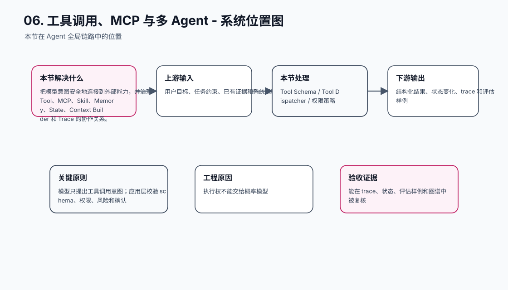
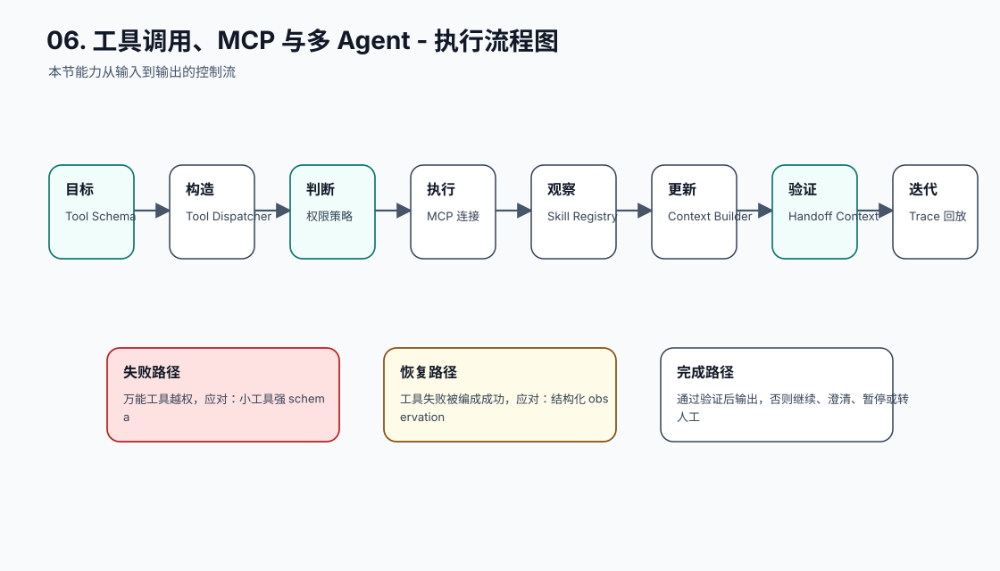
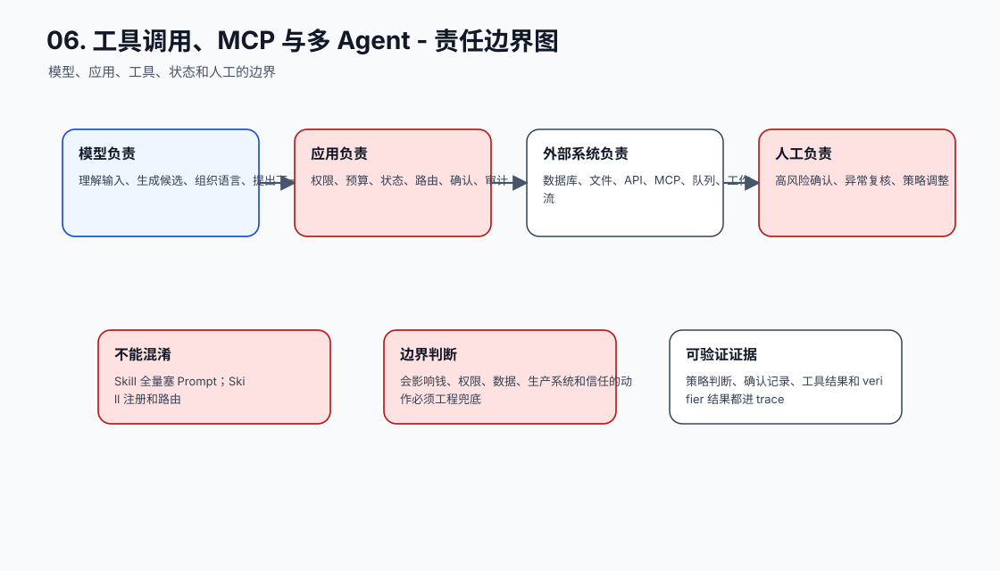
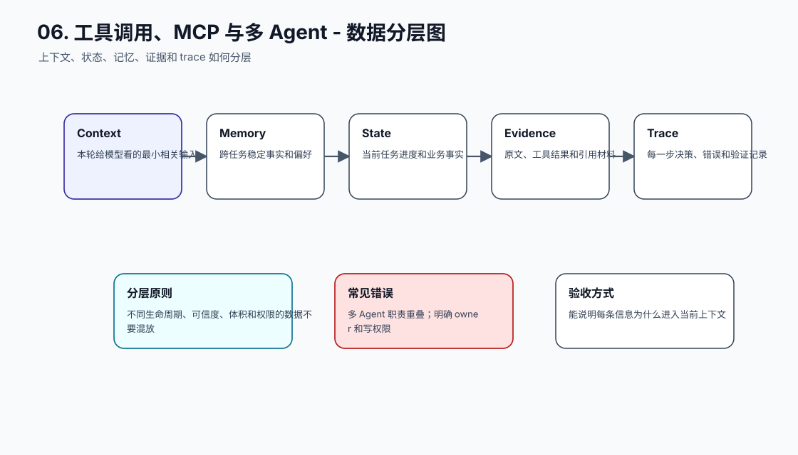
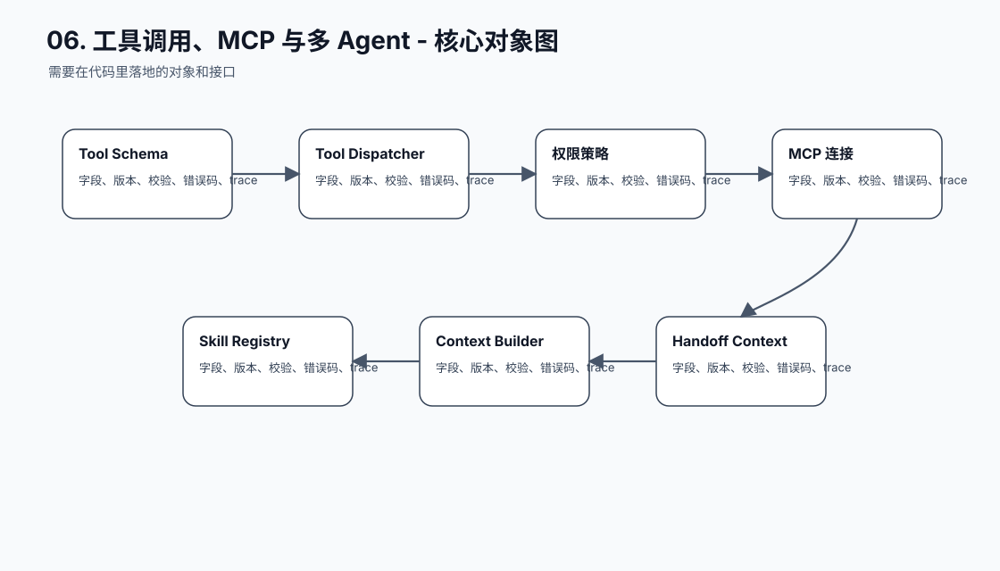
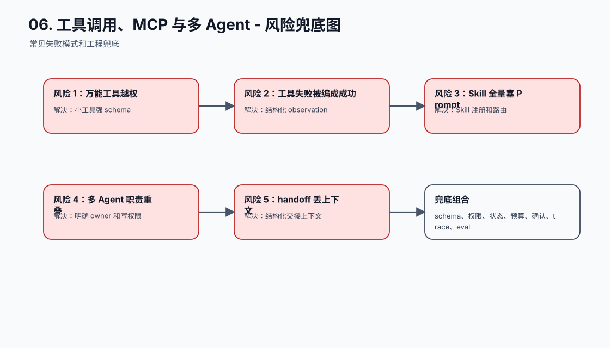
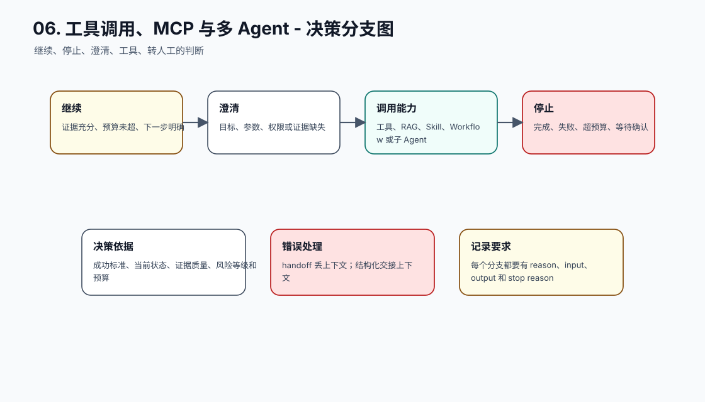
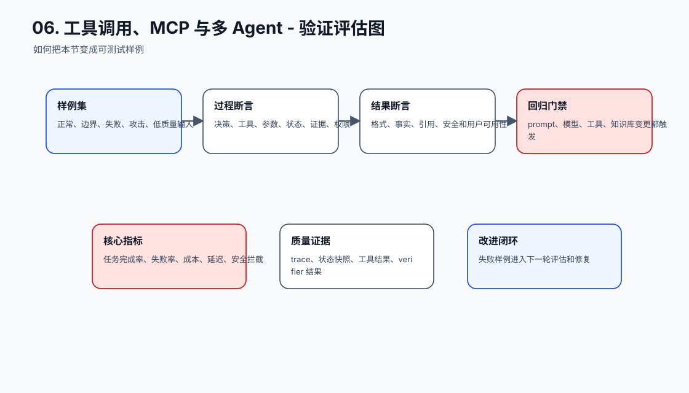
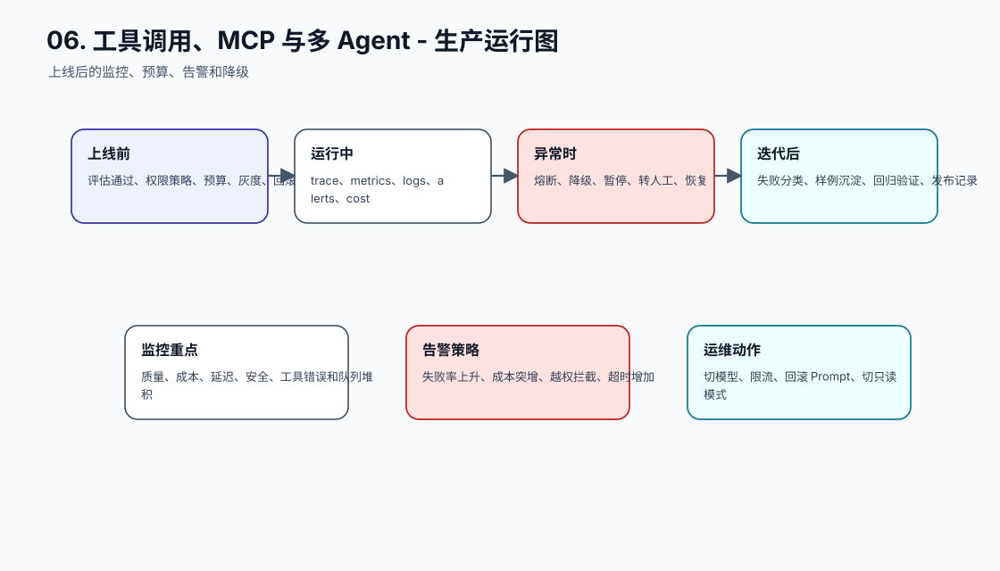
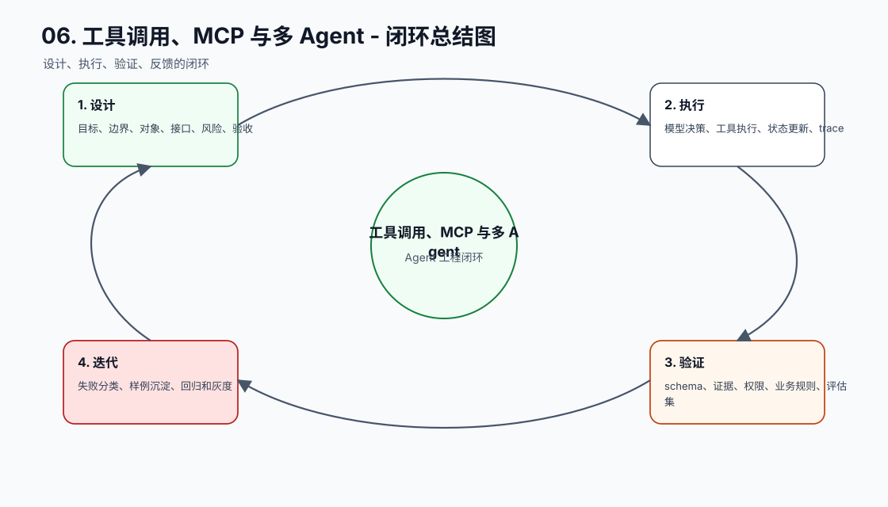

# MCP、工具调用与多 Agent

[返回全局摘要](../README.md)

本模块关注工具接口、权限边界、失败处理、多 Agent 分工、轨迹回放，以及 RAG、MCP、Agent、Skill 的工程化协作。目标是让 Agent 的行动具备可控性、可验证性和可恢复性。

工具调用让模型从“生成文本”进入“影响外部世界”。这也是 Agent 工程风险最高的部分：模型可以建议查数据库、改文件、发消息、创建订单、删除资源，但真正执行必须由应用层、权限系统、工具执行器和审计系统共同控制。

学习本模块时要抓住一条主线：

```text
模型生成调用意图
-> 应用层校验 schema、权限、风险和确认
-> 工具执行并返回结构化结果
-> Agent 根据 observation 更新状态
-> verifier 判断目标是否真正完成
-> trace 支持回放、评测和审计
```

MCP、Tool、Skill、多 Agent 都是围绕这条链路展开的工程组件。它们不是为了让系统看起来更复杂，而是为了把能力边界、执行边界和验证边界拆清楚。

## 工程落点

一个可上线的工具调用系统至少要能证明：

- 模型只能提出意图，不能绕过应用层直接执行。
- 工具 schema、参数校验、错误返回和权限策略都有版本。
- 高风险动作有确认、幂等、审计和回滚策略。
- 多 Agent 之间职责、上下文交接和写权限不重叠。
- 每次工具调用都有 trace：谁建议、谁批准、调用什么、结果如何、是否满足目标。

如果工具调用失败后系统只能显示“模型答错了”，而不能定位到工具选择、参数、权限、执行或验证哪一层出错，就说明工程边界还不够清晰。

## 能力治理：Skill、Memory、State、Context Builder 和 Trace 如何协同

当工具、Skill、记忆和状态开始同时参与任务执行时，Agent 不能再靠一段越来越长的全局 Prompt 运行。更稳的方式是把能力选择、记忆读取、状态更新、上下文组装、工具执行和验证回归拆成可记录、可解释、可测试的工程链路。

```text
用户目标
-> 成功标准和失败边界
-> 意图、领域和风险识别
-> 能力选择：Prompt / Skill / Tool / Workflow
-> 记忆、状态和证据筛选
-> Context Builder 动态组装
-> Agent / workflow 执行
-> Verifier 验证结果和过程
-> Trace、失败样例和回归集沉淀
```

这部分和工具调用放在同一节，是因为它们共享同一个核心问题：模型可以提出“想使用什么能力”，但能力是否可用、是否越权、应该注入哪些上下文、执行后如何验证，必须由工程系统控制。

| 组件 | 负责什么 | 不负责什么 |
| --- | --- | --- |
| Prompt | 当前调用的任务说明、约束、输出格式和退出路径 | 长期能力库、业务状态、权限决策 |
| Skill | 一类任务的可复用方法：触发条件、步骤、工具用法、输出标准、验证规则 | 保存用户长期事实、替代工具权限系统 |
| Memory | 跨会话可复用的稳定事实、偏好、项目背景和经验 | 任务进度、审批状态、支付状态、唯一事实来源 |
| State | 当前任务的进度、状态转移、工具结果、确认记录和恢复点 | 模糊偏好、未经确认的用户画像 |
| Tool | 对外部系统的读写动作和结构化观察结果 | 自行决定是否越权执行 |
| Trace | 记录选择、输入、输出、验证和失败原因 | 只保存最终回答 |

能力治理的关键是先进入注册表，再由运行时按任务选择，而不是把所有能力全文塞进上下文。

```text
SkillSpec
  ├─ skill_id
  ├─ title / owner / version
  ├─ trigger
  ├─ do_not_use_when
  ├─ inputs_schema / outputs_schema
  ├─ required_tools
  ├─ required_permissions
  ├─ risk_level
  ├─ context_sections
  ├─ conflicts_with
  ├─ validators
  └─ regression_cases
```

Context Builder 的任务是把庞大的规则、Skill、记忆、状态和证据压缩成本轮需要的最小有效上下文。

| 内容 | 注入方式 | 为什么 |
| --- | --- | --- |
| Skill | 只注入触发条件、关键步骤、输出契约、失败策略和少量必要示例 | 避免 Skill 全文互相冲突 |
| Memory | 只注入本轮相关摘要，带来源、时间和适用范围 | 避免旧记忆污染当前任务 |
| State | 注入当前决策需要的状态快照，完整状态仍由数据库或工作流系统保存 | 保持可恢复和可审计 |
| Evidence | 注入可引用、可验证的片段，保留来源 id | 让结论可追溯 |
| Tool result | 注入结构化 observation，不直接塞完整工具日志 | 降低 token 成本和噪声 |

上线前要检查：

| 检查项 | 不通过时的风险 | 处理方式 |
| --- | --- | --- |
| Skill 是否有触发条件和禁用条件 | 误触发、重复调用、上下文冲突 | 增加 `trigger`、`do_not_use_when` 和边界样例 |
| Memory 是否有写入、读取、更新、删除和过期策略 | 旧信息污染、敏感信息泄露 | 记录来源、时间、置信度、权限和 TTL |
| TaskState 是否由确定性系统管理 | 中断后无法恢复，多 Agent 并发覆盖 | 使用状态机、checkpoint、版本号和幂等键 |
| 高风险工具是否有确认、审计和回滚 | 误删、误发、误支付、越权操作 | 权限校验、确认 token、审计日志和补偿流程 |
| Trace 是否能回放能力选择和验证结果 | 失败无法定位，无法形成回归 | 记录能力候选、选择理由、上下文摘要、工具结果和 verifier 结果 |

如果重点是几十个 Skill 如何共存，再看 [大量 Skill 共存解决方案](large-scale-skill-engineering.md)。


## 本节图谱：10 张图讲透

这一节至少要能用图讲清楚三件事：它在 Agent 全局链路里的位置，它和模型、工具、状态、记忆、评估的边界，以及它上线后怎么被验证和运维。下面 10 张图按固定顺序展开：系统位置、执行流程、责任边界、数据分层、核心对象、风险兜底、决策分支、验证评估、生产运行、闭环总结。

**图 06-1：工具调用、MCP 与多 Agent - 系统位置图**  


**图 06-2：工具调用、MCP 与多 Agent - 执行流程图**  


**图 06-3：工具调用、MCP 与多 Agent - 责任边界图**  


**图 06-4：工具调用、MCP 与多 Agent - 数据分层图**  


**图 06-5：工具调用、MCP 与多 Agent - 核心对象图**  


**图 06-6：工具调用、MCP 与多 Agent - 风险兜底图**  


**图 06-7：工具调用、MCP 与多 Agent - 决策分支图**  


**图 06-8：工具调用、MCP 与多 Agent - 验证评估图**  


**图 06-9：工具调用、MCP 与多 Agent - 生产运行图**  


**图 06-10：工具调用、MCP 与多 Agent - 闭环总结图**  


## 补充工程表

### 模块拆解表

| 模块 | 解决的问题 | 落地要求 |
| --- | --- | --- |
| Tool Schema | 本节链路中的关键能力 | 有输入、输出、状态变化、错误路径和 trace 记录 |
| Tool Dispatcher | 本节链路中的关键能力 | 有输入、输出、状态变化、错误路径和 trace 记录 |
| 权限策略 | 本节链路中的关键能力 | 有输入、输出、状态变化、错误路径和 trace 记录 |
| MCP 连接 | 本节链路中的关键能力 | 有输入、输出、状态变化、错误路径和 trace 记录 |
| Skill Registry | 本节链路中的关键能力 | 有输入、输出、状态变化、错误路径和 trace 记录 |
| Context Builder | 本节链路中的关键能力 | 有输入、输出、状态变化、错误路径和 trace 记录 |
| Handoff Context | 本节链路中的关键能力 | 有输入、输出、状态变化、错误路径和 trace 记录 |
| Trace 回放 | 本节链路中的关键能力 | 有输入、输出、状态变化、错误路径和 trace 记录 |

### 原则与原因表

| 工程原则 | 具体做法 | 为什么这么做 |
| --- | --- | --- |
| 模型只提出工具调用意图 | 应用层校验 schema、权限、风险和确认 | 执行权不能交给概率模型 |
| MCP 是连接协议，不是安全系统 | MCP Server 和应用层都要做权限、审计和确认 | 协议标准化不等于自动可信 |
| 能力治理要动态组装上下文 | 按任务选择 Skill、Memory、State 和 Evidence | 避免全量注入造成冲突和成本膨胀 |

### 踩坑与兜底表

| 常见坑 | 兜底方式 | 为什么这么做 |
| --- | --- | --- |
| 万能工具越权 | 小工具强 schema | 把失败变成可定位、可恢复、可回归的工程事件 |
| 工具失败被编成成功 | 结构化 observation | 把失败变成可定位、可恢复、可回归的工程事件 |
| Skill 全量塞 Prompt | Skill 注册和路由 | 把失败变成可定位、可恢复、可回归的工程事件 |
| 多 Agent 职责重叠 | 明确 owner 和写权限 | 把失败变成可定位、可恢复、可回归的工程事件 |
| handoff 丢上下文 | 结构化交接上下文 | 把失败变成可定位、可恢复、可回归的工程事件 |
