# Agent 工程化

[返回全局摘要](../README.md)

Agent 工程化关注的不是“让模型更像人”，而是让一个由大模型参与的任务系统可控、可观测、可恢复、可评估。

## 工程化要解决什么

- 任务如何拆分成稳定步骤。
- 哪些步骤用 workflow 固定，哪些步骤交给模型判断。
- 工具权限如何控制。
- 上下文、记忆和状态如何分层。
- 每一步输入、输出和工具结果如何记录。
- 失败后如何重试、降级、暂停或转人工。
- 成本、延迟、轮次和风险如何限制。
- 最终结果如何验证。

## 基本结构

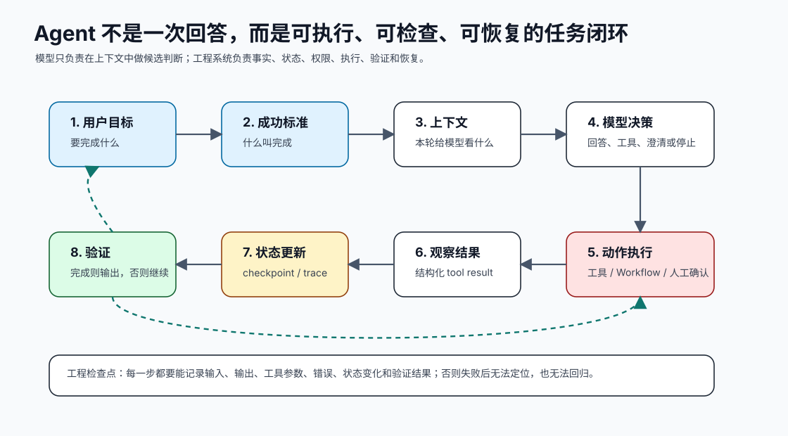

```text
用户目标
→ 任务解析
→ 上下文构造
→ 计划或路由
→ 工具调用
→ 状态更新
→ 结果验证
→ 输出或继续下一步
```

这条链路不是概念图，而是工程模块边界：

| 环节 | 工程模块 | 必须落地的细节 |
| --- | --- | --- |
| 用户目标 | Task intake | 目标、约束、风险等级、是否需要澄清 |
| 任务解析 | Planner / Router | 成功标准、候选步骤、禁止动作 |
| 上下文构造 | Context Builder | 指令、状态、证据、工具结果的分层和 token 预算 |
| 计划或路由 | Model Decision | 回答、工具调用、请求澄清、转人工或停止 |
| 工具调用 | Tool Dispatcher / MCP Client | schema 校验、权限校验、超时、错误结构化 |
| 状态更新 | State Store | 进度、事实、checkpoint、幂等键 |
| 结果验证 | Verifier | 证据、格式、权限、预算和业务标准 |
| 输出或继续 | Loop Controller | 最大轮次、熔断、暂停、完成原因 |

## 关键原则

Agent 不是把所有控制权交给模型。生产系统里，模型负责处理模糊判断和语言生成，确定性系统负责流程、权限、状态、执行和审计。

## 最小任务模型

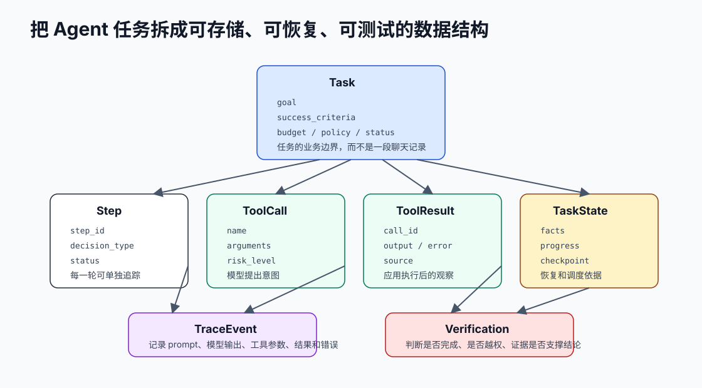

工程上不要只保存 `messages`。`messages` 只是模型本轮输入，不是任务系统。一个可恢复的 Agent 至少需要这些对象：

```text
Task
  ├─ goal               用户要完成什么
  ├─ success_criteria   什么叫完成
  ├─ state              当前进度和已知事实
  ├─ tools              本任务可用工具
  ├─ permission_policy  哪些动作允许、确认或禁止
  ├─ trace              每一步输入、输出、工具调用和错误
  ├─ budget             最大轮次、工具次数、成本和耗时
  └─ verification       完成前的验收规则
```

最容易踩的坑是把任务进度写进自然语言历史里。这样短期看起来能跑，长期会出现三个问题：中断后无法恢复，测试时无法断言中间状态，多 Agent 或异步工具并发时容易互相覆盖。

## ReAct 循环要受控制

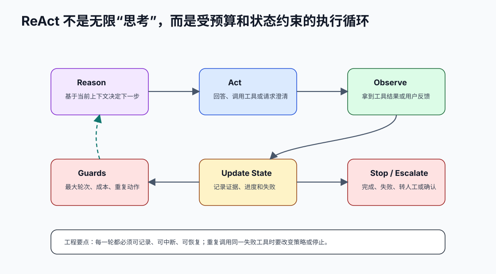

`Reason -> Act -> Observe` 不是让模型无限思考。每一轮都应该受这些工程控制：

- 最大轮次、最大工具调用次数、最大 token 和最大耗时。
- 工具调用前做 schema、权限、风险和重复动作检查。
- 工具失败后返回结构化 observation，而不是让程序崩溃。
- 同一工具同一参数连续失败时停止或换策略。
- 最终回答进入 verifier，不满足成功标准就不能结单。

一个可执行的循环更接近：

```text
for step in max_steps:
    context = build_context(task, state, trace)
    decision = call_model(context, tools)

    if decision.type == "final":
        return verify_and_finish(decision)

    if decision.type == "tool_call":
        checked = validate_tool_call(decision.tool_call, policy)
        if checked.need_confirmation:
            return pause_for_user(checked)

        result = execute_tool(checked)
        append_trace(decision, result)
        update_state(result)
        continue

    return stop("unknown_decision")
```

## 工程验收标准

一个 Agent 小闭环至少要能通过这些检查：

- 给定工具失败，系统能记录失败并停止、重试、降级或请求澄清。
- 给定没有证据的最终回答，verifier 能拒绝完成。
- 给定高风险工具调用，系统能暂停并请求确认。
- 给定中断重启，系统能从确定性状态继续，而不是靠模型猜测。
- 给定 prompt、工具 schema 或模型版本变化，回归样例能发现行为变化。

## 工程注意事项

Agent 工程化最容易犯的错，是把“模型能说出下一步”误当成“系统能可靠执行下一步”。生产实现要守住几个边界：

| 边界 | 不能交给模型的部分 |
| --- | --- |
| 事实边界 | 数据库、检索证据、工具返回、文件内容必须可追溯 |
| 权限边界 | 用户身份、资源权限、确认令牌、高风险动作由应用层判断 |
| 状态边界 | 任务进度、checkpoint、重试次数、幂等键由确定性系统保存 |
| 成本边界 | 最大轮次、最大工具次数、token 和延迟预算由 Loop Controller 控制 |
| 验证边界 | 格式、证据、业务规则和安全红线由 verifier 或规则检查 |

一个实用判断是：如果某个错误会造成钱、权限、数据、生产系统或用户信任损失，就不能只靠 Prompt 约束。Prompt 可以表达意图和偏好，但工程兜底要靠 schema、权限、状态机、确认、审计、回归和灰度。

上线前还应明确降级路径：

- 模型不可用时，是否能退回固定 workflow、人工处理或只读模式。
- 工具不可用时，是否能返回结构化错误而不是编造结果。
- 证据不足时，是否能拒答、澄清或转人工。
- 成本或轮次超限时，是否能保存进度并停止。
- 版本回滚时，Prompt、工具 schema、知识库和模型版本是否一起回滚。


## 本节图谱：10 张图讲透

这一节至少要能用图讲清楚三件事：它在 Agent 全局链路里的位置，它和模型、工具、状态、记忆、评估的边界，以及它上线后怎么被验证和运维。下面 10 张图按固定顺序展开：系统位置、执行流程、责任边界、数据分层、核心对象、风险兜底、决策分支、验证评估、生产运行、闭环总结。

**图 07-1：Agent 工程化 - 系统位置图**  
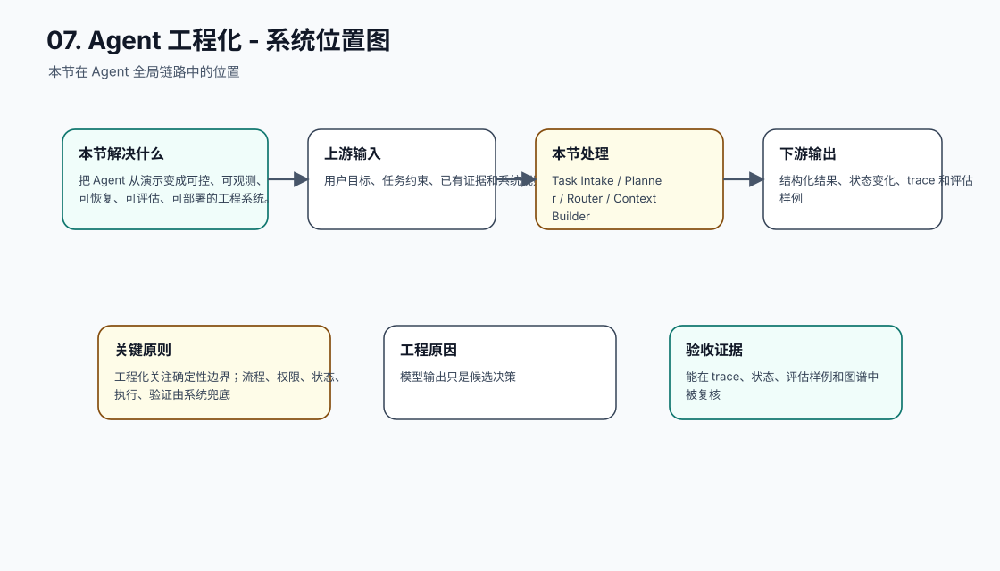

**图 07-2：Agent 工程化 - 执行流程图**  
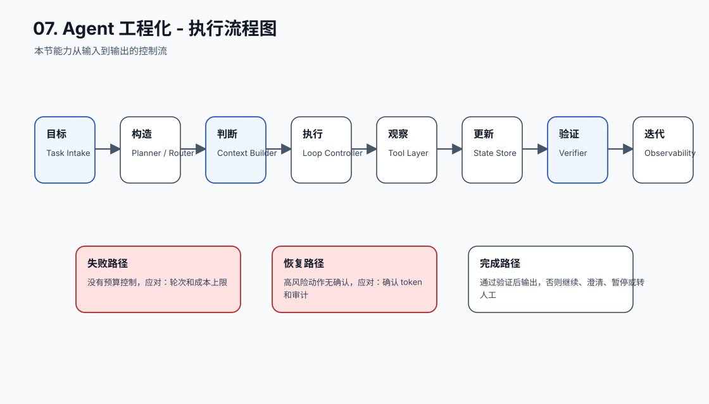

**图 07-3：Agent 工程化 - 责任边界图**  
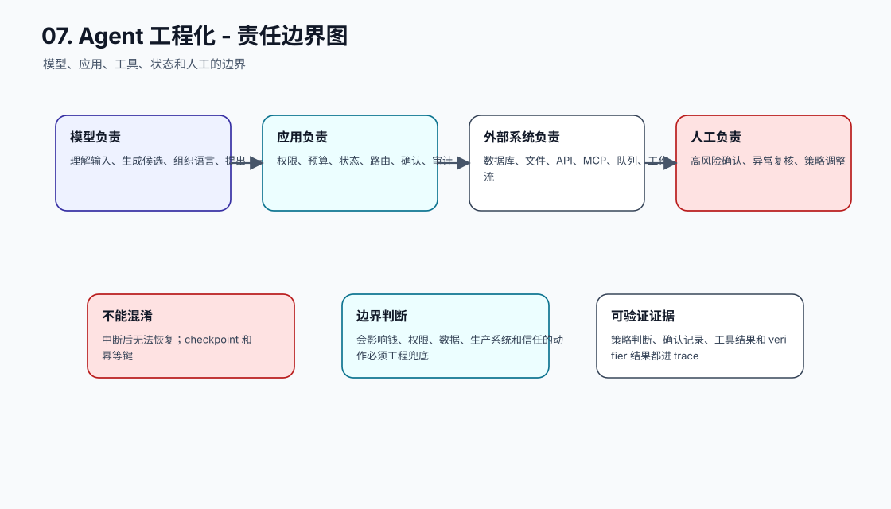

**图 07-4：Agent 工程化 - 数据分层图**  
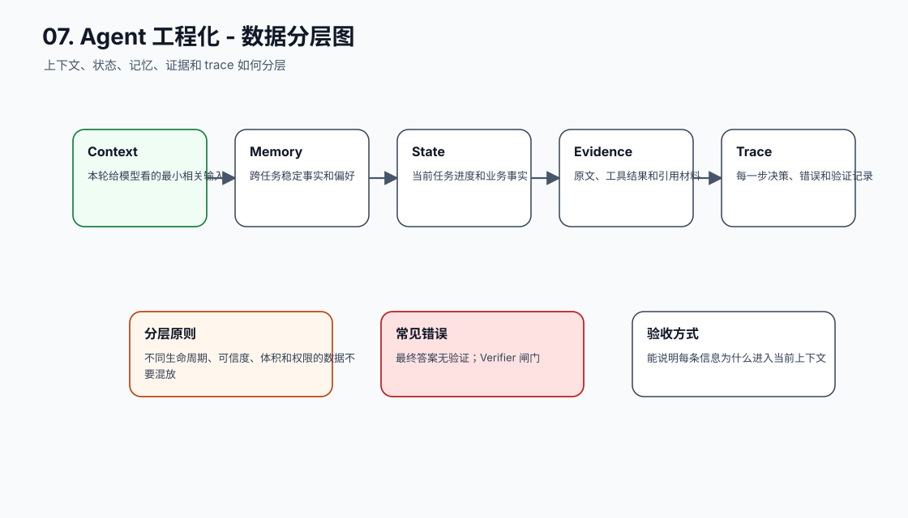

**图 07-5：Agent 工程化 - 核心对象图**  
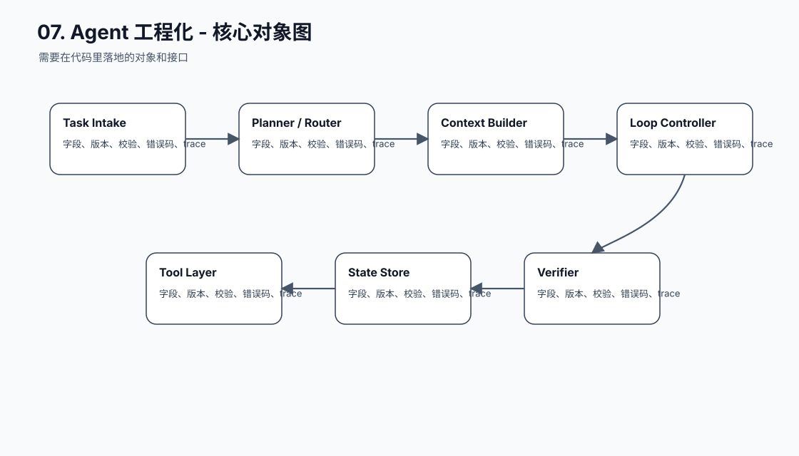

**图 07-6：Agent 工程化 - 风险兜底图**  
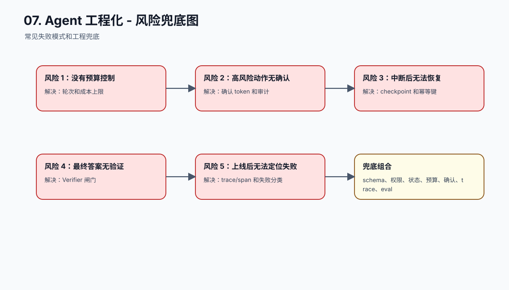

**图 07-7：Agent 工程化 - 决策分支图**  
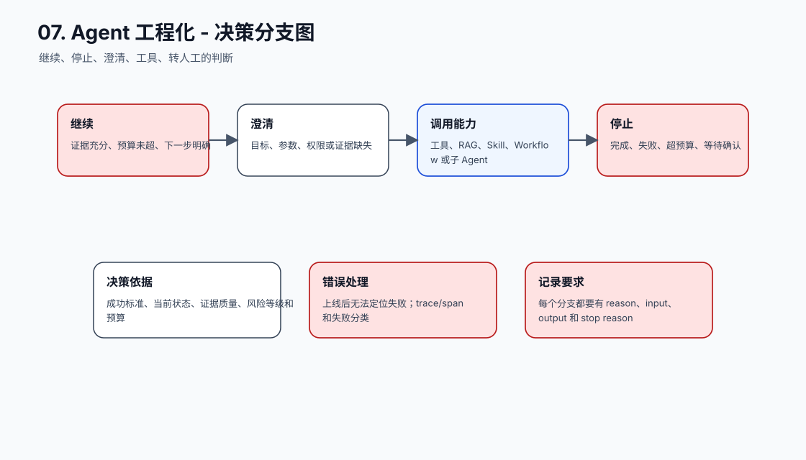

**图 07-8：Agent 工程化 - 验证评估图**  
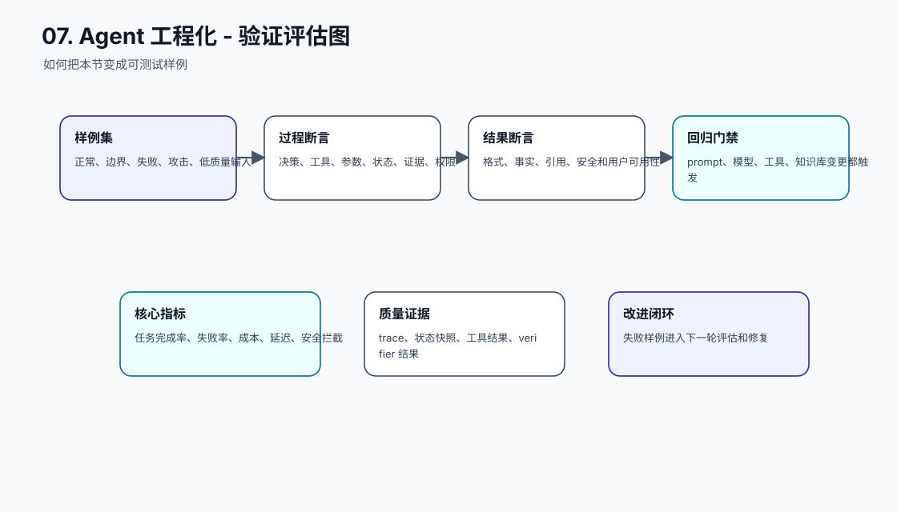

**图 07-9：Agent 工程化 - 生产运行图**  
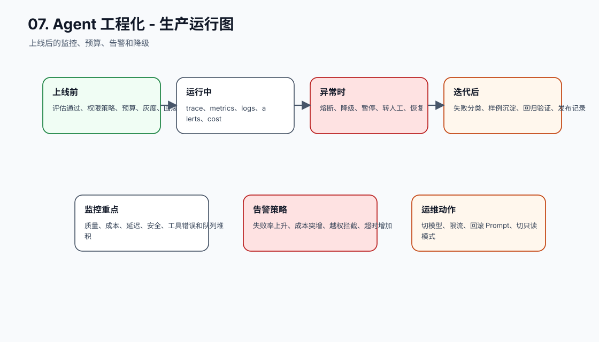

**图 07-10：Agent 工程化 - 闭环总结图**  
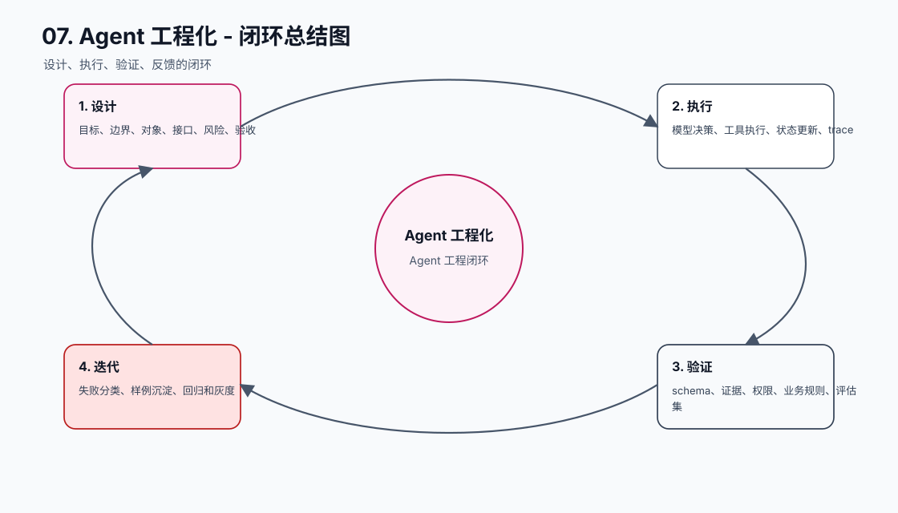

## 补充工程表

### 模块拆解表

| 模块 | 解决的问题 | 落地要求 |
| --- | --- | --- |
| Task Intake | 本节链路中的关键能力 | 有输入、输出、状态变化、错误路径和 trace 记录 |
| Planner / Router | 本节链路中的关键能力 | 有输入、输出、状态变化、错误路径和 trace 记录 |
| Context Builder | 本节链路中的关键能力 | 有输入、输出、状态变化、错误路径和 trace 记录 |
| Loop Controller | 本节链路中的关键能力 | 有输入、输出、状态变化、错误路径和 trace 记录 |
| Tool Layer | 本节链路中的关键能力 | 有输入、输出、状态变化、错误路径和 trace 记录 |
| State Store | 本节链路中的关键能力 | 有输入、输出、状态变化、错误路径和 trace 记录 |
| Verifier | 本节链路中的关键能力 | 有输入、输出、状态变化、错误路径和 trace 记录 |
| Observability | 本节链路中的关键能力 | 有输入、输出、状态变化、错误路径和 trace 记录 |

### 原则与原因表

| 工程原则 | 具体做法 | 为什么这么做 |
| --- | --- | --- |
| 工程化关注确定性边界 | 流程、权限、状态、执行、验证由系统兜底 | 模型输出只是候选决策 |
| Agent Runtime 要可恢复 | 保存 task、state、trace、budget、artifact | 生产任务会中断、重试和跨版本运行 |
| 上线前必须有评估和观测 | 回归样例、trace、指标、告警、降级 | 否则无法持续改进 |

### 踩坑与兜底表

| 常见坑 | 兜底方式 | 为什么这么做 |
| --- | --- | --- |
| 没有预算控制 | 轮次和成本上限 | 把失败变成可定位、可恢复、可回归的工程事件 |
| 高风险动作无确认 | 确认 token 和审计 | 把失败变成可定位、可恢复、可回归的工程事件 |
| 中断后无法恢复 | checkpoint 和幂等键 | 把失败变成可定位、可恢复、可回归的工程事件 |
| 最终答案无验证 | Verifier 闸门 | 把失败变成可定位、可恢复、可回归的工程事件 |
| 上线后无法定位失败 | trace/span 和失败分类 | 把失败变成可定位、可恢复、可回归的工程事件 |
