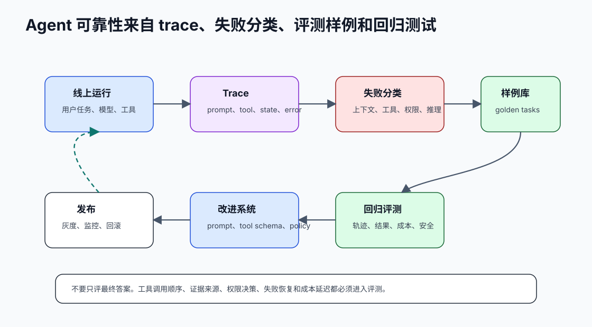

# 37 不只测最终答案也测中间过程

[返回全局摘要](../README.md) · [返回本组：测试、评测与验证](README.md)


## Rule
评测应检查中间过程，包括任务分解、检索依据、工具参数、权限判断、引用来源和拒答路径。



## Why
最终答案正确不代表过程可靠。错误的工具调用、伪造依据或绕过权限可能暂时给出可用答案，却会在生产中放大风险。

Agent 的失败经常发生在中间过程：

- 没有读取必要文件，却给出确定结论。
- 使用了不相关检索结果。
- 工具失败后编造成功。
- 没有确认就执行写操作。
- 重复调用同一个失败工具，成本持续上升。
- 最终答案引用的证据并不来自工具结果。

## Optimize
为关键链路增加结构化 trace，并在 eval 中断言关键步骤是否发生、顺序是否正确、参数是否符合约束。

最小 trace 应覆盖：

```json
{
  "task_id": "readme_review_001",
  "step_id": "s2",
  "event_type": "tool_call",
  "tool": "read_file",
  "arguments": {"path": "README.md"},
  "policy_result": "allowed",
  "prompt_version": "agent_readme_v1",
  "model": "claude-sonnet-4-5"
}
```

评测不要只判断最终文案，而要断言过程：

| 断言 | 示例 |
| --- | --- |
| 必须发生 | README 分析任务必须读取 README.md |
| 必须禁止 | 未确认时不能调用 write_file |
| 顺序正确 | 先检索证据，再生成结论 |
| 参数合法 | 路径不能越出工作区 |
| 结果可追溯 | 结论引用必须来自 tool result |
| 成本受控 | step 数和 tool call 数不超过预算 |

## Verify
抽查失败和成功样例的 trace，确认评测能识别“答案对但过程错”的情况。

回归样例应覆盖：

- 答案看似正确但没证据。
- 工具失败后是否停止或请求澄清。
- 高风险动作是否被确认流程拦截。
- prompt 或工具 schema 修改后，中间轨迹是否发生不期望变化。

## References
- Agent tracing practices
- Tool-use evaluation patterns
- Chain-of-thought privacy and process supervision research

---

[返回全局摘要](../README.md) · [返回本组：测试、评测与验证](README.md)
