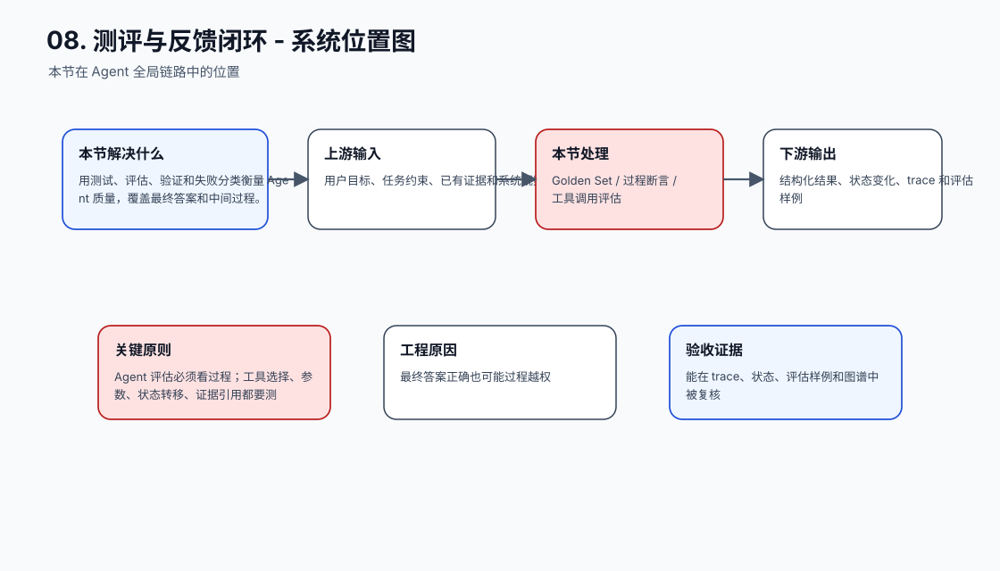
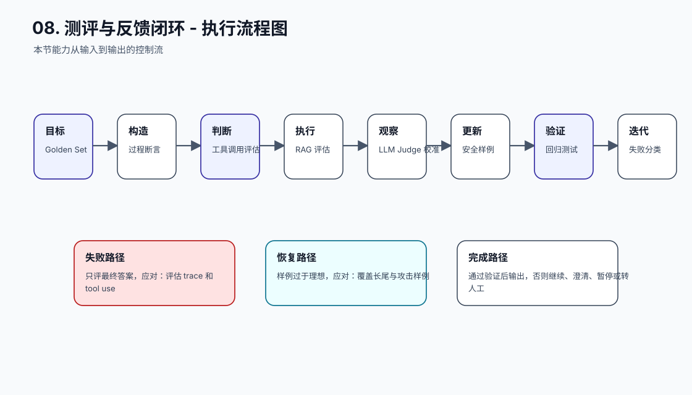
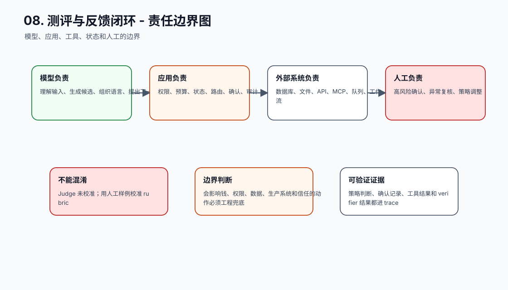
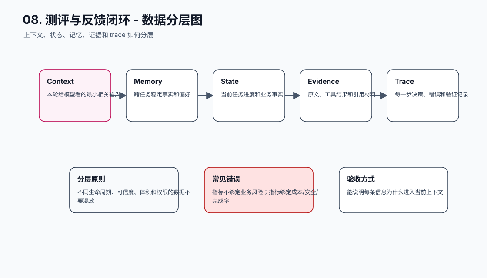
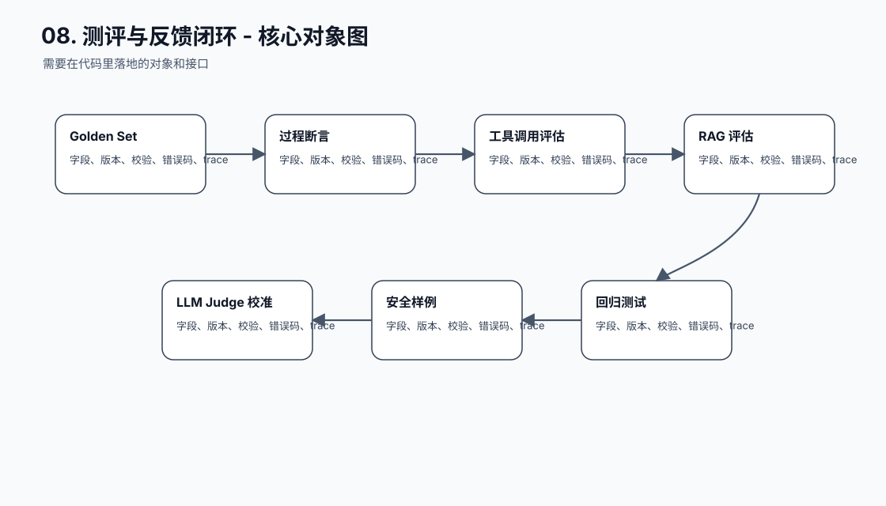
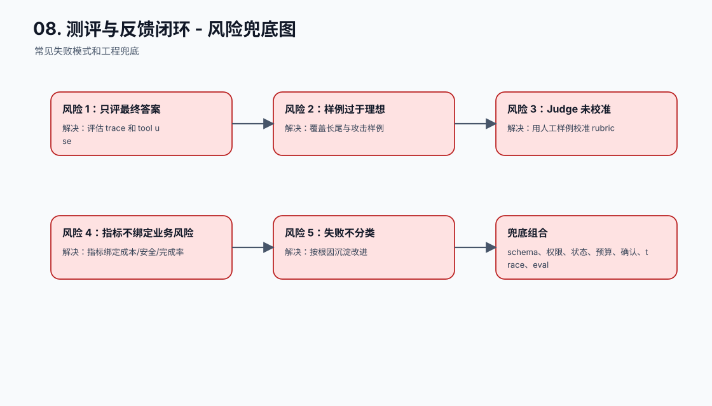
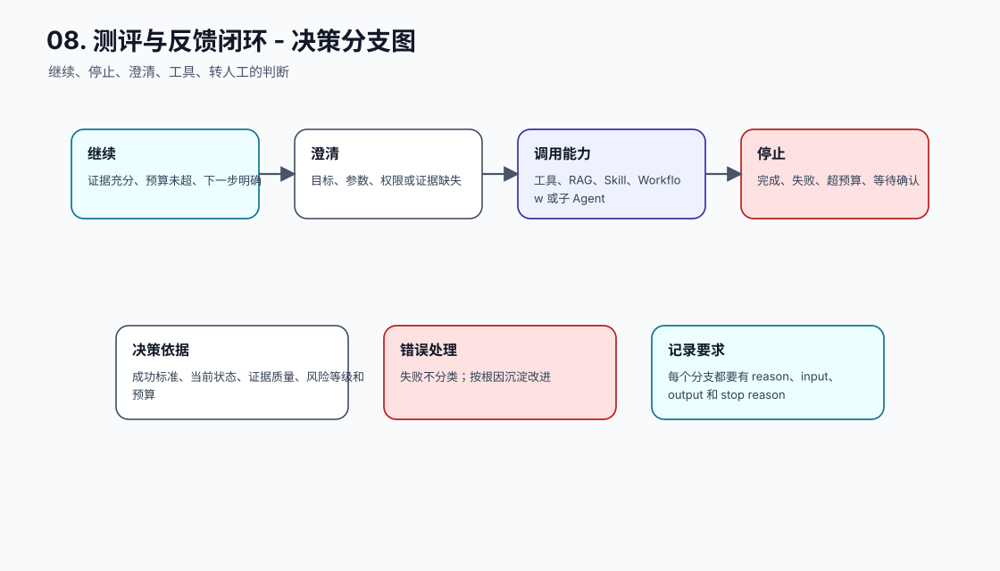
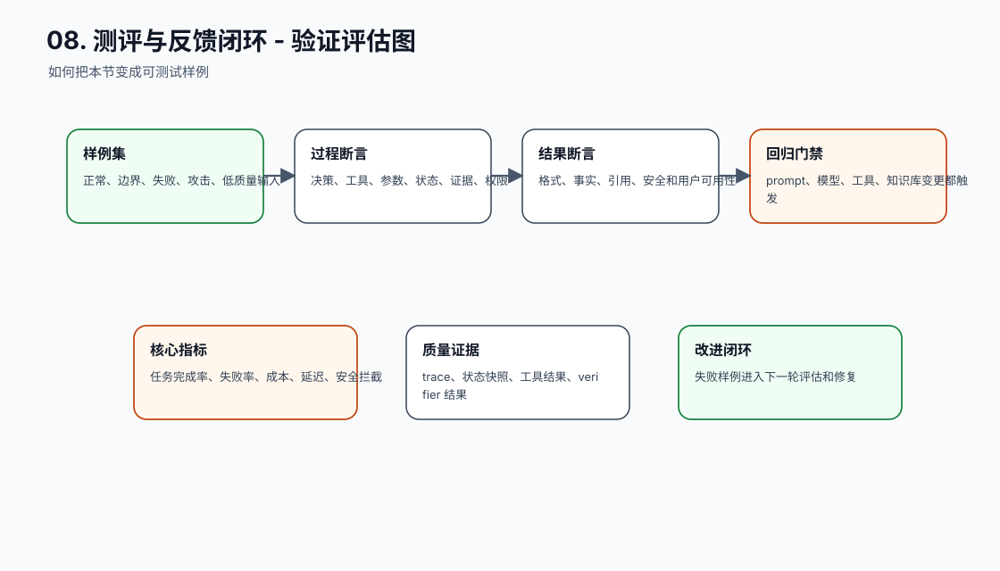
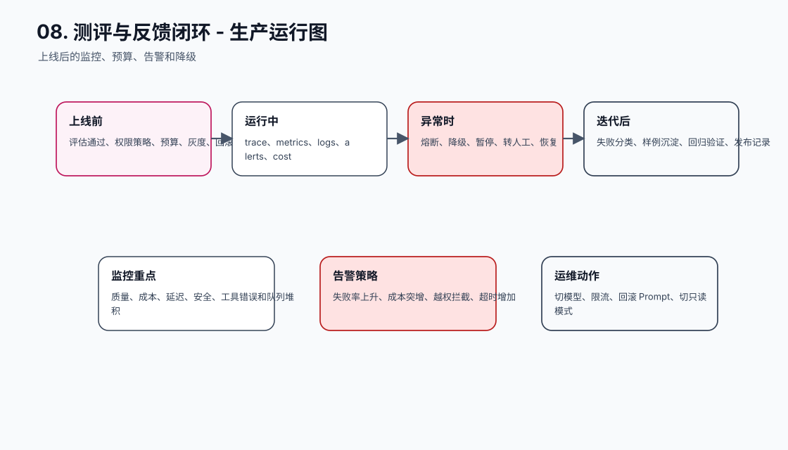
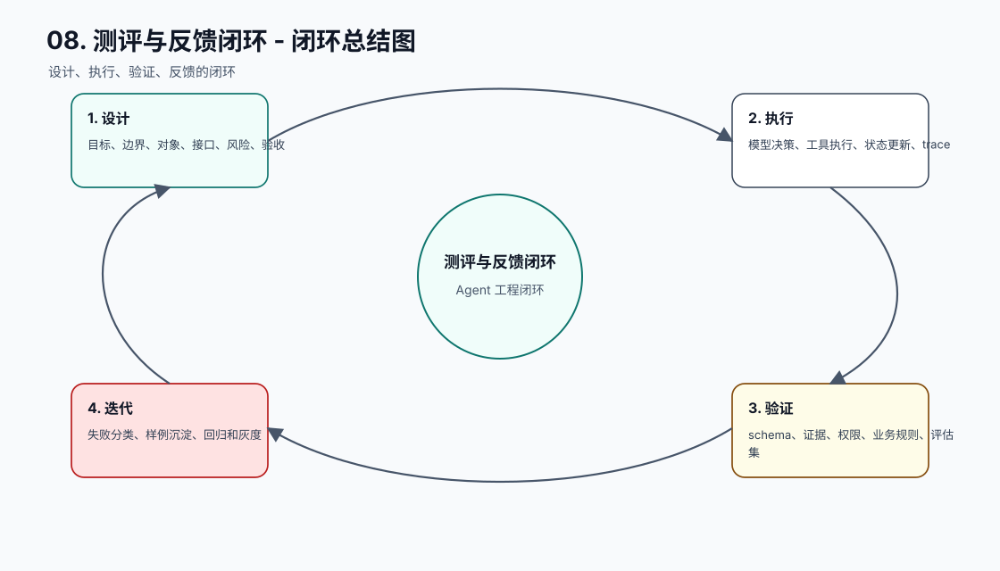

# 安全、调优与测评

[返回全局摘要](../README.md)

这一模块不应该被理解成一组零散编号。它真正解决的是三个问题：系统是否安全，调优是否真的带来收益，以及如何用测评判断 AI 系统是否可靠。

Agent 系统的评测不能只问“答案像不像正确答案”。它还要检查上下文是否正确、工具是否合规、权限是否生效、失败是否可恢复、成本和延迟是否可接受。因为模型输出具有概率性，任何 Prompt、模型、知识库、工具 schema 或编排逻辑变化，都可能改变整条链路。

本模块建议用三个问题贯穿：

```text
有没有守住安全边界？
有没有真实提升目标指标？
有没有形成可回归的验证体系？
```

## 三个分类

| 分类 | 关注点 | 相关实践 |
| --- | --- | --- |
| 安全 | 防止幻觉、注入、越权、数据泄露和高风险误操作 | [41. 验证要包含反例和攻击样例](41-counterexample-attack-samples.md)、[42. 把失败分类，而不是只记录失败率](42-failure-taxonomy.md) |
| 调优 | 判断 Prompt、RAG、模型、工具和流程变更是否真实改善系统 | [39. 评测指标和业务风险绑定](39-metrics-bind-business-risk.md)、[40. 影响输出的变更都要跑回归](40-run-regression-on-changes.md)、[42A. 可观测性要区分测试驱动和目标驱动](42A-observability-test-goal-driven.md) |
| 测评 | 建立 eval 数据、过程测试、LLM-as-judge 和测试金字塔 | [35. AI 系统需要扩展测试金字塔](35-extended-test-pyramid.md)、[36. Eval 数据集覆盖真实分布和边界](36-eval-data-real-boundary.md)、[37. 不只测最终答案，也测中间过程](37-test-intermediate-process.md)、[38. LLM-as-judge 需要校准](38-calibrate-llm-as-judge.md) |

## 工程判断

安全、调优和测评不是上线前才补的检查项，而是 AI 工程系统的一部分：

- 安全决定系统能不能在真实环境里承受错误输入、恶意输入和高风险动作。
- 调优决定每次修改是否有证据支撑，而不是靠主观感觉判断“好像变好了”。
- 测评决定模型输出、检索过程、工具调用和中间轨迹是否能被持续验证。

这三类能力合在一起，才能让 Agent 系统从 demo 进入可维护、可回归、可迭代的工程状态。

## 最小验收闭环

上线前至少要能回答：

- 关键任务是否有端到端 eval。
- 高风险任务是否有反例、攻击样例和权限样例。
- 检索、工具调用、权限判断和最终答案是否都有 trace。
- LLM-as-judge 是否经过人工金标集校准。
- 每次影响输出的变更是否触发对应回归。
- 失败是否能归类，并进入后续修复和验证流程。


## 本节图谱：10 张图讲透

这一节至少要能用图讲清楚三件事：它在 Agent 全局链路里的位置，它和模型、工具、状态、记忆、评估的边界，以及它上线后怎么被验证和运维。下面 10 张图按固定顺序展开：系统位置、执行流程、责任边界、数据分层、核心对象、风险兜底、决策分支、验证评估、生产运行、闭环总结。

**图 08-1：测评与反馈闭环 - 系统位置图**  


**图 08-2：测评与反馈闭环 - 执行流程图**  


**图 08-3：测评与反馈闭环 - 责任边界图**  


**图 08-4：测评与反馈闭环 - 数据分层图**  


**图 08-5：测评与反馈闭环 - 核心对象图**  


**图 08-6：测评与反馈闭环 - 风险兜底图**  


**图 08-7：测评与反馈闭环 - 决策分支图**  


**图 08-8：测评与反馈闭环 - 验证评估图**  


**图 08-9：测评与反馈闭环 - 生产运行图**  


**图 08-10：测评与反馈闭环 - 闭环总结图**  


## 补充工程表

### 模块拆解表

| 模块 | 解决的问题 | 落地要求 |
| --- | --- | --- |
| Golden Set | 本节链路中的关键能力 | 有输入、输出、状态变化、错误路径和 trace 记录 |
| 过程断言 | 本节链路中的关键能力 | 有输入、输出、状态变化、错误路径和 trace 记录 |
| 工具调用评估 | 本节链路中的关键能力 | 有输入、输出、状态变化、错误路径和 trace 记录 |
| RAG 评估 | 本节链路中的关键能力 | 有输入、输出、状态变化、错误路径和 trace 记录 |
| LLM Judge 校准 | 本节链路中的关键能力 | 有输入、输出、状态变化、错误路径和 trace 记录 |
| 安全样例 | 本节链路中的关键能力 | 有输入、输出、状态变化、错误路径和 trace 记录 |
| 回归测试 | 本节链路中的关键能力 | 有输入、输出、状态变化、错误路径和 trace 记录 |
| 失败分类 | 本节链路中的关键能力 | 有输入、输出、状态变化、错误路径和 trace 记录 |

### 原则与原因表

| 工程原则 | 具体做法 | 为什么这么做 |
| --- | --- | --- |
| Agent 评估必须看过程 | 工具选择、参数、状态转移、证据引用都要测 | 最终答案正确也可能过程越权 |
| 评估集要来自真实边界 | 线上失败、低质量输入、攻击样例都要进入回归 | 真实风险通常发生在边界场景 |
| LLM-as-judge 需要校准 | rubric、人工样例、一致性检查不可少 | Judge 本身也是概率模型 |

### 踩坑与兜底表

| 常见坑 | 兜底方式 | 为什么这么做 |
| --- | --- | --- |
| 只评最终答案 | 评估 trace 和 tool use | 把失败变成可定位、可恢复、可回归的工程事件 |
| 样例过于理想 | 覆盖长尾与攻击样例 | 把失败变成可定位、可恢复、可回归的工程事件 |
| Judge 未校准 | 用人工样例校准 rubric | 把失败变成可定位、可恢复、可回归的工程事件 |
| 指标不绑定业务风险 | 指标绑定成本/安全/完成率 | 把失败变成可定位、可恢复、可回归的工程事件 |
| 失败不分类 | 按根因沉淀改进 | 把失败变成可定位、可恢复、可回归的工程事件 |
