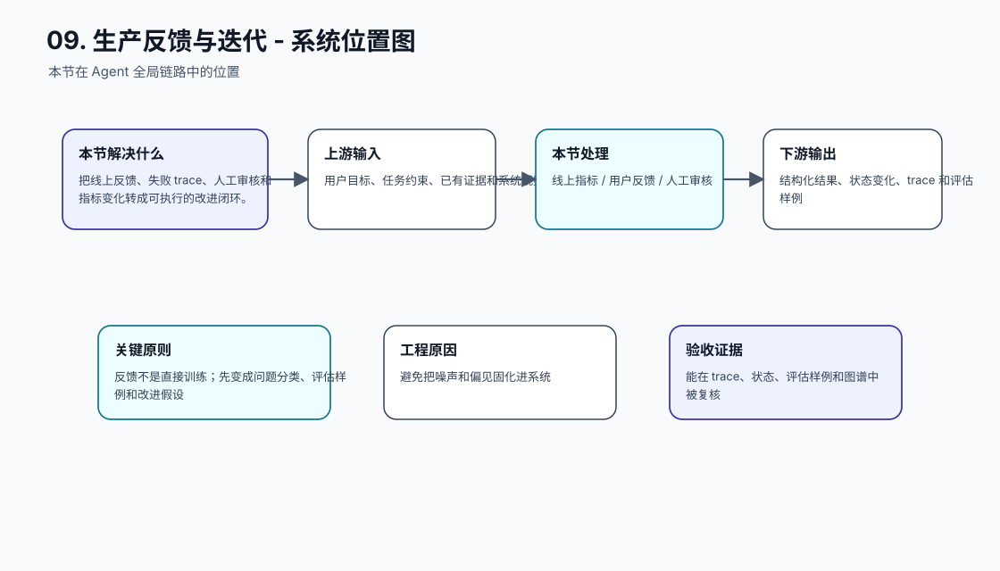
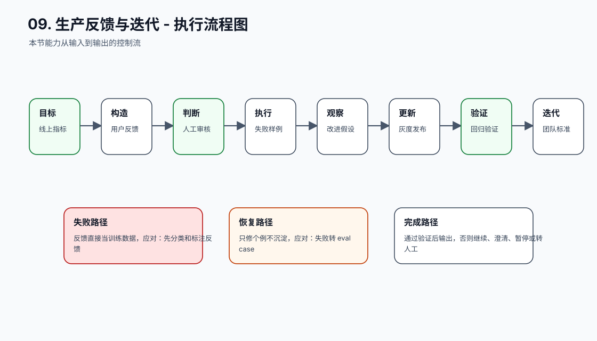
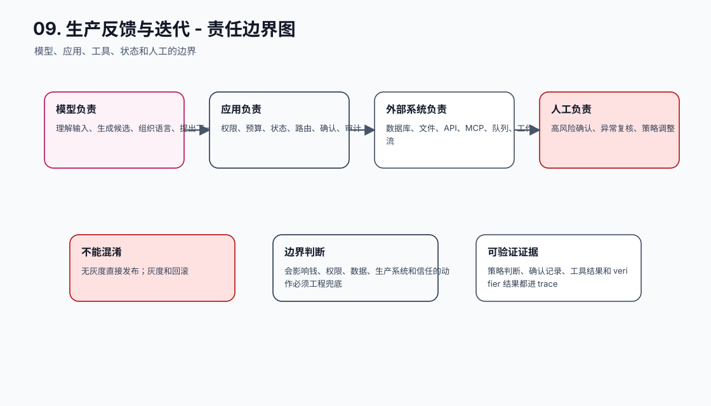
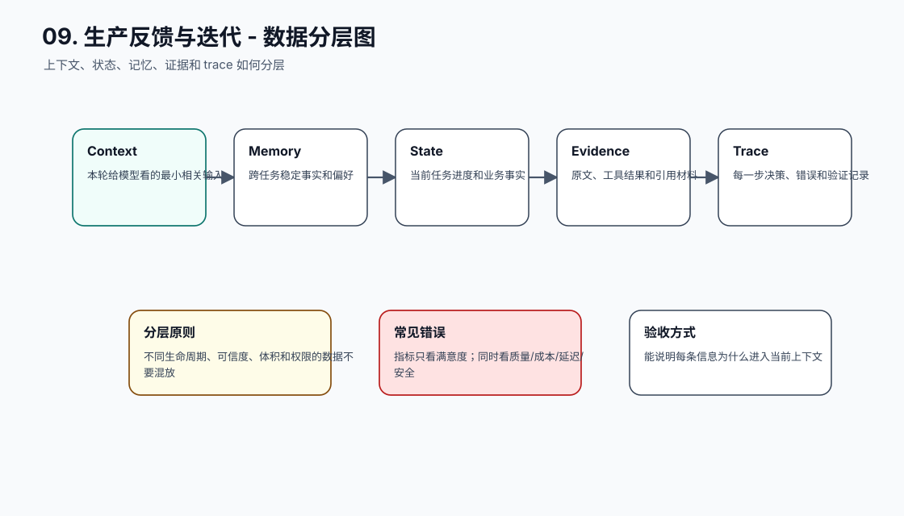
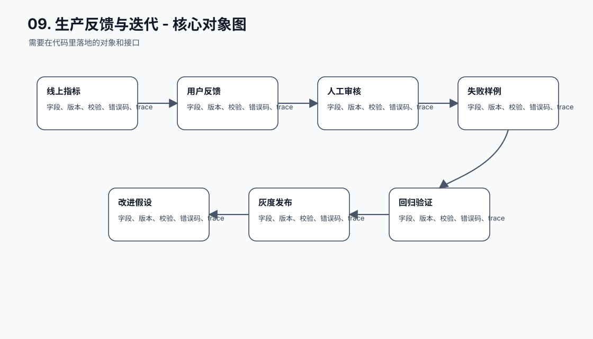
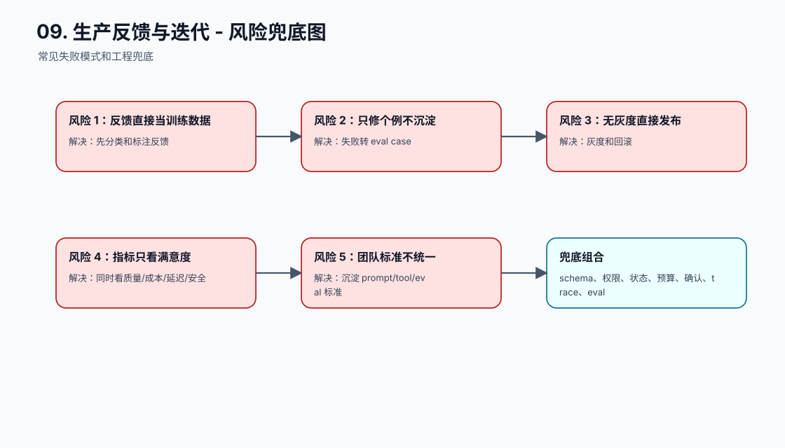
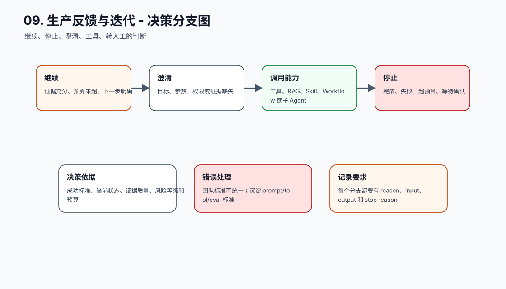
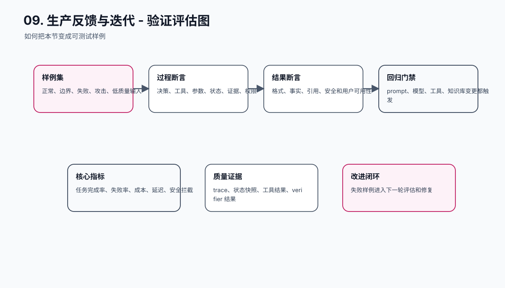
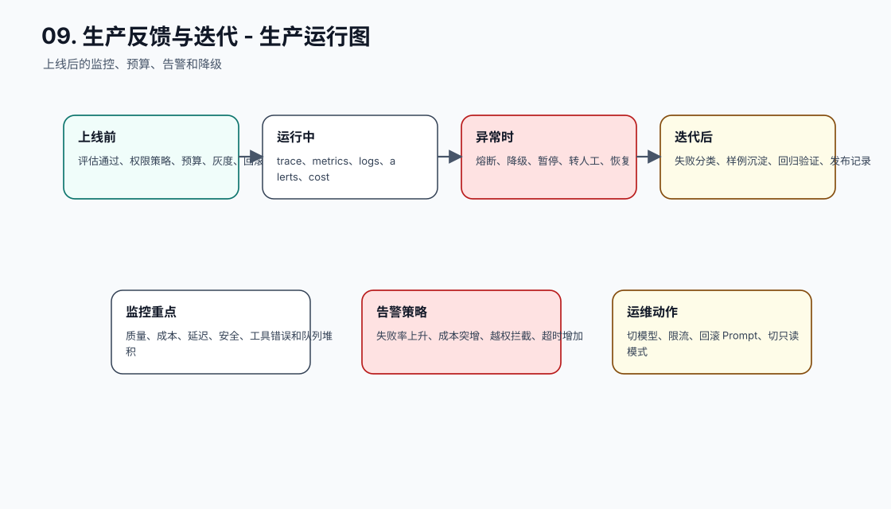
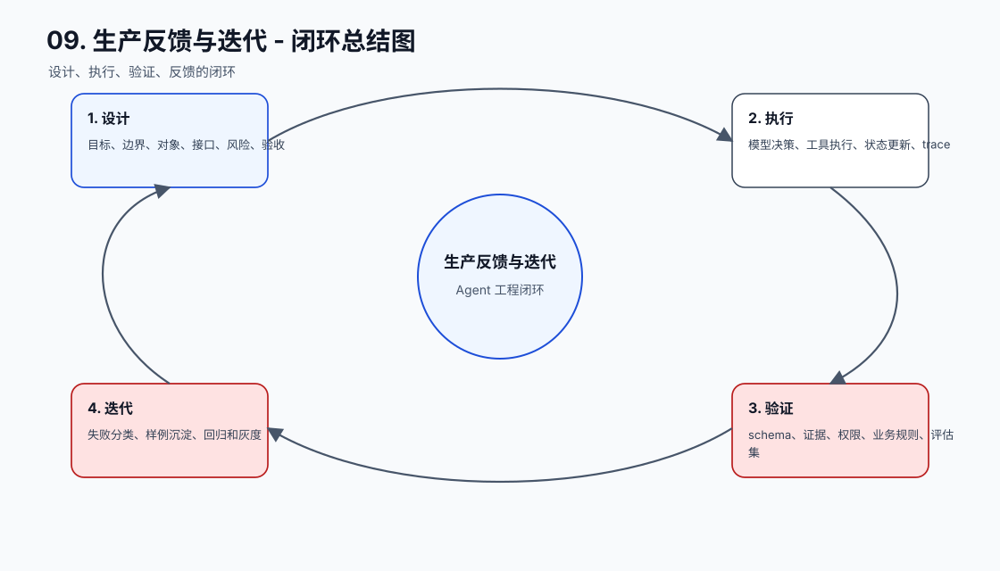

# 反馈闭环与迭代

[返回全局摘要](../README.md)

本模块关注生产反馈、失败归因、灰度发布和团队规范沉淀。目标是把真实使用中的问题转化为可验证的系统改进。

Agent 上线后，质量不再只来自离线评测。真实用户会带来新输入、新文档、新权限边界、新工具失败和新的攻击方式。如果生产反馈只停留在客服记录或群聊讨论里，系统会重复犯同类错误。

反馈闭环的核心是把“线上现象”转成“工程资产”：

```text
用户反馈 / 人工审核 / 日志异常
-> 归类和定级
-> 复现 trace
-> 根因分析
-> 修复 Prompt / RAG / 工具 / 状态 / 权限 / 产品流程
-> 加入 eval 和回归
-> 灰度发布
-> 线上指标验证
-> 固化团队规范
```

## 工程落点

反馈闭环至少要形成三类沉淀：

- 样例沉淀：线上失败进入 eval、回归集和攻击样例。
- 机制沉淀：修复不只改 Prompt，还可能改检索、工具、权限、状态、验证或产品流程。
- 规范沉淀：反复验证有效的做法进入模板、检查清单和发布门禁。

如果反馈只产生一次性修复，没有进入评测和规范，团队就会在下一轮模型、Prompt 或知识库变更时重新踩坑。


## 本节图谱：10 张图讲透

这一节至少要能用图讲清楚三件事：它在 Agent 全局链路里的位置，它和模型、工具、状态、记忆、评估的边界，以及它上线后怎么被验证和运维。下面 10 张图按固定顺序展开：系统位置、执行流程、责任边界、数据分层、核心对象、风险兜底、决策分支、验证评估、生产运行、闭环总结。

**图 09-1：生产反馈与迭代 - 系统位置图**  


**图 09-2：生产反馈与迭代 - 执行流程图**  


**图 09-3：生产反馈与迭代 - 责任边界图**  


**图 09-4：生产反馈与迭代 - 数据分层图**  


**图 09-5：生产反馈与迭代 - 核心对象图**  


**图 09-6：生产反馈与迭代 - 风险兜底图**  


**图 09-7：生产反馈与迭代 - 决策分支图**  


**图 09-8：生产反馈与迭代 - 验证评估图**  


**图 09-9：生产反馈与迭代 - 生产运行图**  


**图 09-10：生产反馈与迭代 - 闭环总结图**  


## 补充工程表

### 模块拆解表

| 模块 | 解决的问题 | 落地要求 |
| --- | --- | --- |
| 线上指标 | 本节链路中的关键能力 | 有输入、输出、状态变化、错误路径和 trace 记录 |
| 用户反馈 | 本节链路中的关键能力 | 有输入、输出、状态变化、错误路径和 trace 记录 |
| 人工审核 | 本节链路中的关键能力 | 有输入、输出、状态变化、错误路径和 trace 记录 |
| 失败样例 | 本节链路中的关键能力 | 有输入、输出、状态变化、错误路径和 trace 记录 |
| 改进假设 | 本节链路中的关键能力 | 有输入、输出、状态变化、错误路径和 trace 记录 |
| 灰度发布 | 本节链路中的关键能力 | 有输入、输出、状态变化、错误路径和 trace 记录 |
| 回归验证 | 本节链路中的关键能力 | 有输入、输出、状态变化、错误路径和 trace 记录 |
| 团队标准 | 本节链路中的关键能力 | 有输入、输出、状态变化、错误路径和 trace 记录 |

### 原则与原因表

| 工程原则 | 具体做法 | 为什么这么做 |
| --- | --- | --- |
| 反馈不是直接训练 | 先变成问题分类、评估样例和改进假设 | 避免把噪声和偏见固化进系统 |
| 每次事故都要进入回归 | trace、根因、修复方案、验证样例一起保存 | 让系统越修越稳 |
| 迭代必须小步灰度 | 先局部发布、看指标、可回滚 | Agent 行为受多个组件影响 |

### 踩坑与兜底表

| 常见坑 | 兜底方式 | 为什么这么做 |
| --- | --- | --- |
| 反馈直接当训练数据 | 先分类和标注反馈 | 把失败变成可定位、可恢复、可回归的工程事件 |
| 只修个例不沉淀 | 失败转 eval case | 把失败变成可定位、可恢复、可回归的工程事件 |
| 无灰度直接发布 | 灰度和回滚 | 把失败变成可定位、可恢复、可回归的工程事件 |
| 指标只看满意度 | 同时看质量/成本/延迟/安全 | 把失败变成可定位、可恢复、可回归的工程事件 |
| 团队标准不统一 | 沉淀 prompt/tool/eval 标准 | 把失败变成可定位、可恢复、可回归的工程事件 |
