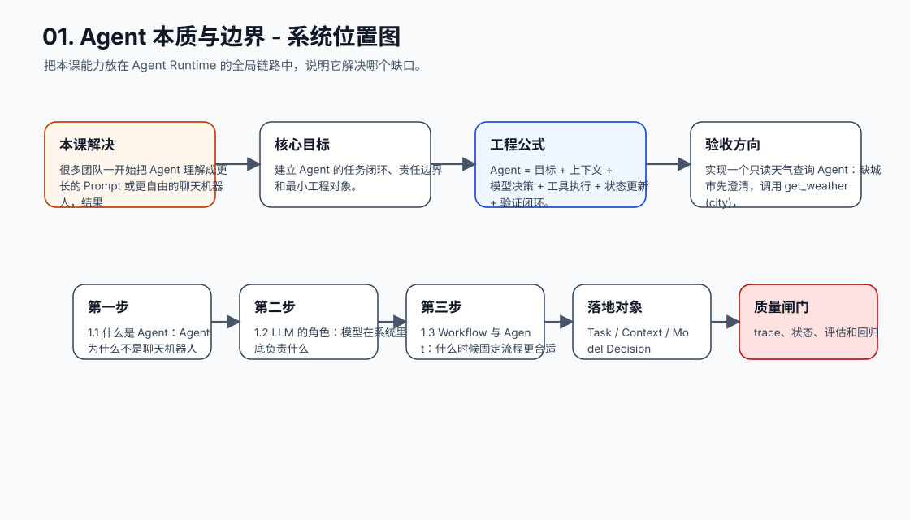
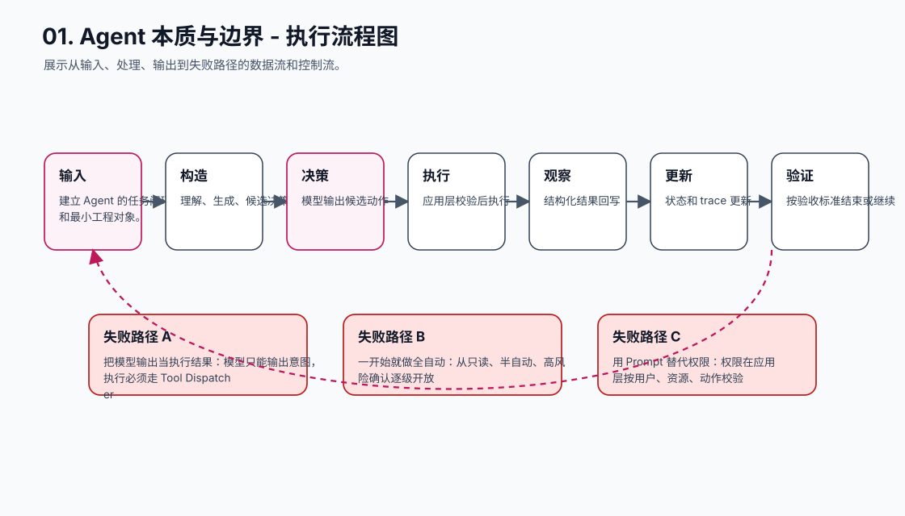
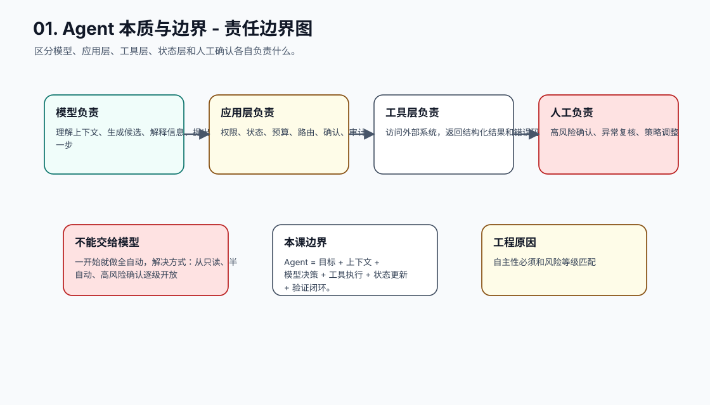
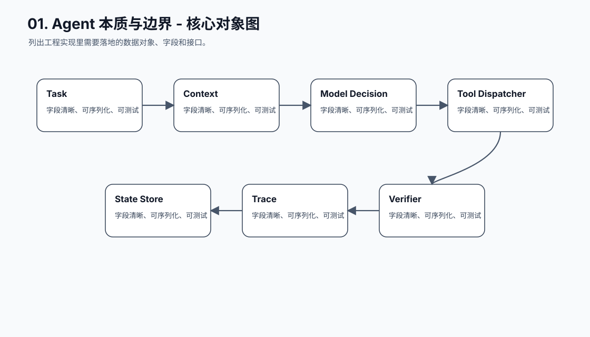
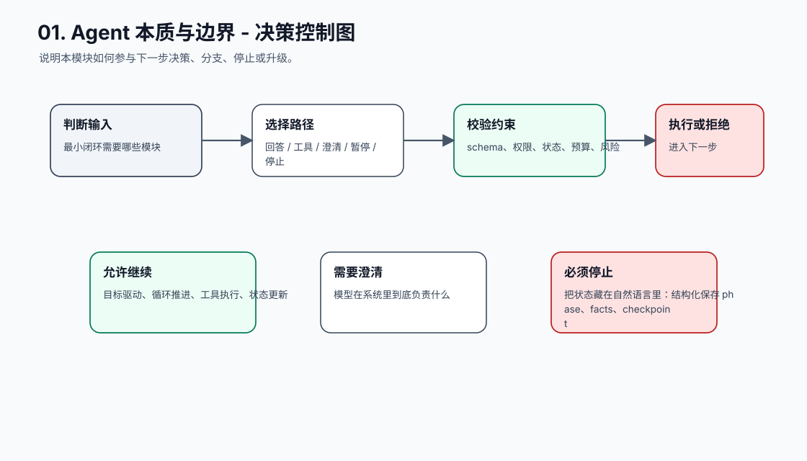
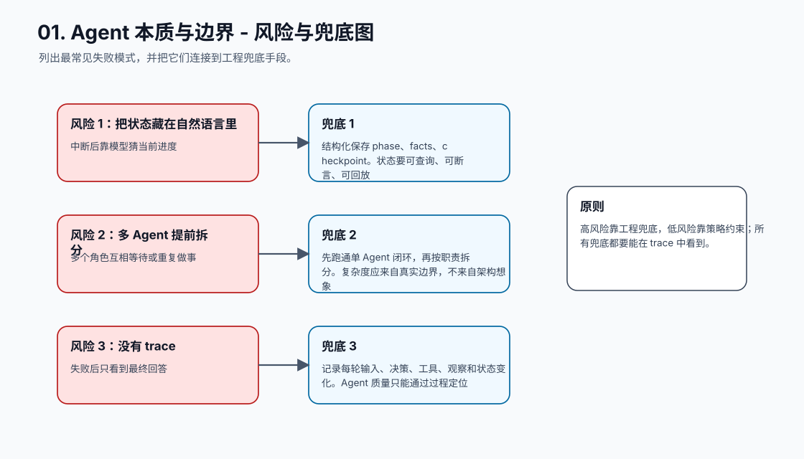
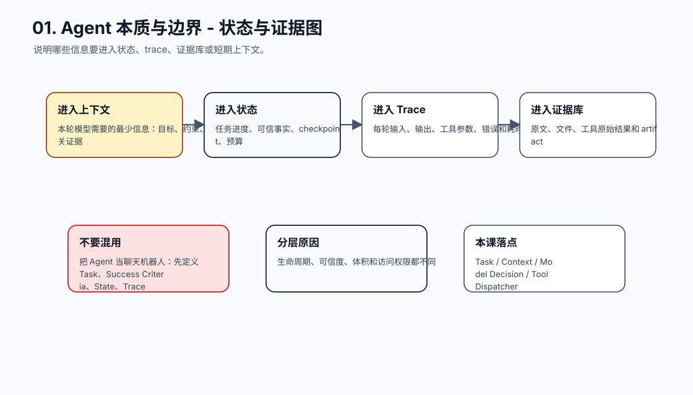
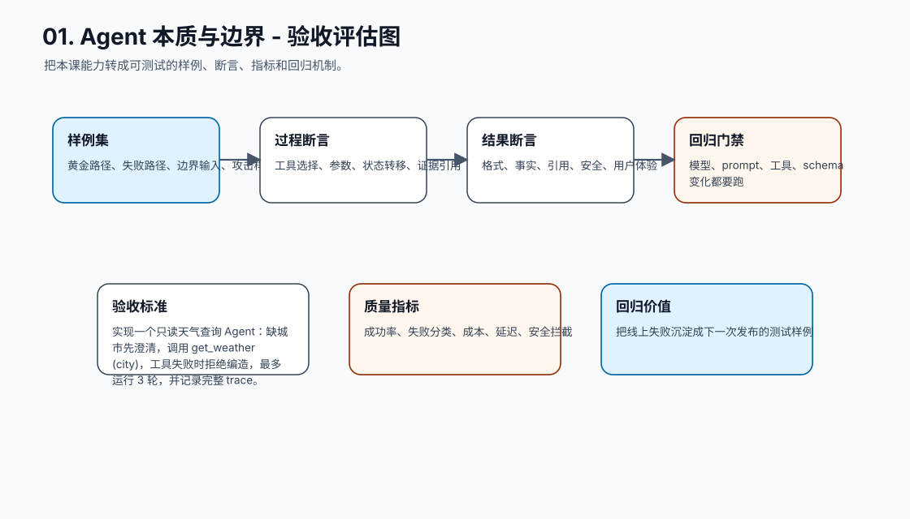
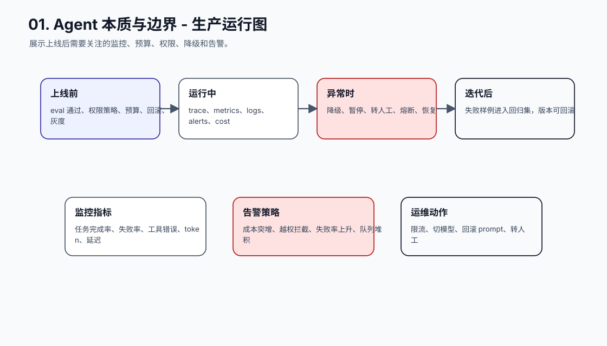
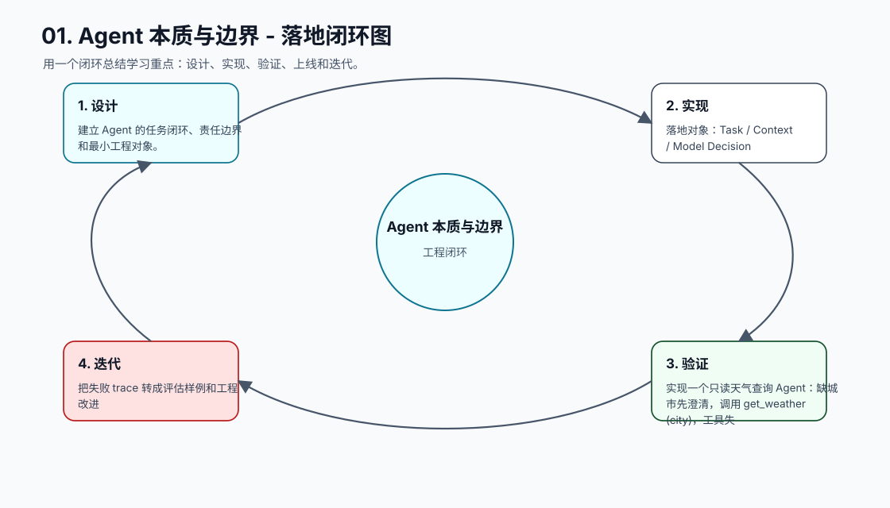

# 01. Agent 本质与边界

[返回课程目录](README.md)

## 本课定位

定义 Agent 开发的底层边界，先把 LLM、Workflow 和 Agent 分清楚，再决定哪些能力应该由模型承担，哪些必须由程序兜底。

很多团队一开始把 Agent 理解成更长的 Prompt 或更自由的聊天机器人，结果系统看起来聪明，但状态、权限、执行和审计全部失控。

本课的目标是：建立 Agent 的任务闭环、责任边界和最小工程对象。

核心公式：`Agent = 目标 + 上下文 + 模型决策 + 工具执行 + 状态更新 + 验证闭环。`

## 学习目标

- 能解释本课模块解决 Agent 系统里的哪个缺口。
- 能画出本课模块在完整 Agent Runtime 中的位置。
- 能把关键对象、接口、状态和错误路径写成可执行设计。
- 能识别工程中常见失败模式，并给出可落地的兜底方案。
- 能用 trace、评估样例和验收标准证明方案有效。

## 小节拆解

| 小节 | 先回答的问题 | 必须讲透的知识点 | 工程落地要求 | 练习 |
| --- | --- | --- | --- | --- |
| 1.1 什么是 Agent | Agent 为什么不是聊天机器人 | 目标驱动、循环推进、工具执行、状态更新 | 对象、接口、状态和错误路径都要能落到代码 | 画出一个查订单 Agent 的闭环 |
| 1.2 LLM 的角色 | 模型在系统里到底负责什么 | 理解、生成、候选决策、自然语言归纳 | 对象、接口、状态和错误路径都要能落到代码 | 把回答型应用改成任务型应用 |
| 1.3 Workflow 与 Agent | 什么时候固定流程更合适 | 固定流程与运行时决策的边界 | 对象、接口、状态和错误路径都要能落到代码 | 给 10 个业务需求分类 |
| 1.4 Agent 的工程边界 | 哪些责任不能交给模型 | 权限、状态、执行、验证、审计 | 对象、接口、状态和错误路径都要能落到代码 | 列出付款 Agent 的禁止动作 |
| 1.5 最小 Agent 架构 | 最小闭环需要哪些模块 | Task、Context、Tool、State、Trace、Verifier | 对象、接口、状态和错误路径都要能落到代码 | 设计最小对象模型 |

## 知识点深拆

### 1.1 什么是 Agent
这一小节先回答：Agent 为什么不是聊天机器人。不要从框架名词开始，而要从任务系统缺什么开始理解。对工程团队来说，目标驱动、循环推进、工具执行、状态更新 不是概念装饰，而是决定系统能不能被测试、恢复和上线的边界。
落地时先写清输入、输出、状态变化和失败路径。输入要能被 schema 或类型系统描述，输出要能被下游程序校验，状态变化要能进入 trace，失败路径要能转成明确的 stop reason、retry policy 或 human review。
练习：画出一个查订单 Agent 的闭环。验收时不要只看模型回答是否自然，要检查 trace 里是否出现正确决策、是否遵守权限和预算、是否在证据不足时选择澄清或拒绝。
### 1.2 LLM 的角色
这一小节先回答：模型在系统里到底负责什么。不要从框架名词开始，而要从任务系统缺什么开始理解。对工程团队来说，理解、生成、候选决策、自然语言归纳 不是概念装饰，而是决定系统能不能被测试、恢复和上线的边界。
落地时先写清输入、输出、状态变化和失败路径。输入要能被 schema 或类型系统描述，输出要能被下游程序校验，状态变化要能进入 trace，失败路径要能转成明确的 stop reason、retry policy 或 human review。
练习：把回答型应用改成任务型应用。验收时不要只看模型回答是否自然，要检查 trace 里是否出现正确决策、是否遵守权限和预算、是否在证据不足时选择澄清或拒绝。
### 1.3 Workflow 与 Agent
这一小节先回答：什么时候固定流程更合适。不要从框架名词开始，而要从任务系统缺什么开始理解。对工程团队来说，固定流程与运行时决策的边界 不是概念装饰，而是决定系统能不能被测试、恢复和上线的边界。
落地时先写清输入、输出、状态变化和失败路径。输入要能被 schema 或类型系统描述，输出要能被下游程序校验，状态变化要能进入 trace，失败路径要能转成明确的 stop reason、retry policy 或 human review。
练习：给 10 个业务需求分类。验收时不要只看模型回答是否自然，要检查 trace 里是否出现正确决策、是否遵守权限和预算、是否在证据不足时选择澄清或拒绝。
### 1.4 Agent 的工程边界
这一小节先回答：哪些责任不能交给模型。不要从框架名词开始，而要从任务系统缺什么开始理解。对工程团队来说，权限、状态、执行、验证、审计 不是概念装饰，而是决定系统能不能被测试、恢复和上线的边界。
落地时先写清输入、输出、状态变化和失败路径。输入要能被 schema 或类型系统描述，输出要能被下游程序校验，状态变化要能进入 trace，失败路径要能转成明确的 stop reason、retry policy 或 human review。
练习：列出付款 Agent 的禁止动作。验收时不要只看模型回答是否自然，要检查 trace 里是否出现正确决策、是否遵守权限和预算、是否在证据不足时选择澄清或拒绝。
### 1.5 最小 Agent 架构
这一小节先回答：最小闭环需要哪些模块。不要从框架名词开始，而要从任务系统缺什么开始理解。对工程团队来说，Task、Context、Tool、State、Trace、Verifier 不是概念装饰，而是决定系统能不能被测试、恢复和上线的边界。
落地时先写清输入、输出、状态变化和失败路径。输入要能被 schema 或类型系统描述，输出要能被下游程序校验，状态变化要能进入 trace，失败路径要能转成明确的 stop reason、retry policy 或 human review。
练习：设计最小对象模型。验收时不要只看模型回答是否自然，要检查 trace 里是否出现正确决策、是否遵守权限和预算、是否在证据不足时选择澄清或拒绝。

## 核心工程对象

| 对象 | 它解决什么 | 落地要求 |
| --- | --- | --- |
| Task | Task 是本课需要落地的工程对象，不应该只停留在 Prompt 文本里。 | 有结构、有版本、有校验、有 trace 记录 |
| Context | Context 是本课需要落地的工程对象，不应该只停留在 Prompt 文本里。 | 有结构、有版本、有校验、有 trace 记录 |
| Model Decision | Model Decision 是本课需要落地的工程对象，不应该只停留在 Prompt 文本里。 | 有结构、有版本、有校验、有 trace 记录 |
| Tool Dispatcher | Tool Dispatcher 是本课需要落地的工程对象，不应该只停留在 Prompt 文本里。 | 有结构、有版本、有校验、有 trace 记录 |
| State Store | State Store 是本课需要落地的工程对象，不应该只停留在 Prompt 文本里。 | 有结构、有版本、有校验、有 trace 记录 |
| Trace | Trace 是本课需要落地的工程对象，不应该只停留在 Prompt 文本里。 | 有结构、有版本、有校验、有 trace 记录 |
| Verifier | Verifier 是本课需要落地的工程对象，不应该只停留在 Prompt 文本里。 | 有结构、有版本、有校验、有 trace 记录 |

## 本课图谱：10 张图讲清楚

下面 10 张图对应本课从宏观定位到生产落地的完整拆解。读图顺序固定为：系统位置、执行流程、责任边界、核心对象、决策控制、风险兜底、状态证据、验收评估、生产运行、落地闭环。

**图 01-1：Agent 本质与边界 - 系统位置图**  

**图 01-2：Agent 本质与边界 - 执行流程图**  

**图 01-3：Agent 本质与边界 - 责任边界图**  

**图 01-4：Agent 本质与边界 - 核心对象图**  

**图 01-5：Agent 本质与边界 - 决策控制图**  

**图 01-6：Agent 本质与边界 - 风险与兜底图**  

**图 01-7：Agent 本质与边界 - 状态与证据图**  

**图 01-8：Agent 本质与边界 - 验收评估图**  

**图 01-9：Agent 本质与边界 - 生产运行图**  

**图 01-10：Agent 本质与边界 - 落地闭环图**  

## 工程踩坑与处理方式

| 工程坑 | 典型表现 | 解决方式 | 为什么这么做 |
| --- | --- | --- | --- |
| 把 Agent 当聊天机器人 | 只保存 messages，没有任务对象和状态 | 先定义 Task、Success Criteria、State、Trace | 任务系统必须能恢复和验收，聊天历史做不到 |
| 把模型输出当执行结果 | 模型说“已退款”，但系统没有真实调用退款接口 | 模型只能输出意图，执行必须走 Tool Dispatcher | 避免语言承诺绕过真实业务系统 |
| 一开始就做全自动 | 缺少预算、停止条件和确认机制 | 从只读、半自动、高风险确认逐级开放 | 自主性必须和风险等级匹配 |
| 用 Prompt 替代权限 | 提示词写“不要越权”，但工具仍可访问所有数据 | 权限在应用层按用户、资源、动作校验 | 权限是确定性判断，不是语言偏好 |
| 没有完成定义 | Agent 一直循环或过早回答 | 写清 success_criteria 和 done condition | 没有验收标准就无法判断任务是否完成 |
| 把状态藏在自然语言里 | 中断后靠模型猜当前进度 | 结构化保存 phase、facts、checkpoint | 状态要可查询、可断言、可回放 |
| 多 Agent 提前拆分 | 多个角色互相等待或重复做事 | 先跑通单 Agent 闭环，再按职责拆分 | 复杂度应来自真实边界，不来自架构想象 |
| 没有 trace | 失败后只看到最终回答 | 记录每轮输入、决策、工具、观察和状态变化 | Agent 质量只能通过过程定位 |

## 最小实现闭环

实现一个只读天气查询 Agent：缺城市先澄清，调用 get_weather(city)，工具失败时拒绝编造，最多运行 3 轮，并记录完整 trace。

建议验收方式：

- 至少准备 5 条正常样例、5 条边界样例、3 条失败样例。
- 每条样例都保存输入、模型决策、工具调用、状态变化、最终输出和错误信息。
- 能用程序断言的地方不要只靠人工阅读，例如 schema、状态字段、错误码、引用 id、权限结果和停止原因。
- 修改 prompt、工具 schema、模型参数或状态结构后，必须跑回归样例。

## 章节总结

本课的关键不是写出复杂框架，而是建立一个基本判断：模型擅长不确定性判断，工程系统负责确定性边界。后续所有工具、状态、记忆、RAG 和多 Agent，都是在这个闭环上继续加能力。

学完这一课后，应能把它放回完整 Agent 链路里：它接收什么输入，改变什么状态，调用什么能力，产生什么证据，失败时如何停止或恢复，以及上线后如何观测和评估。
