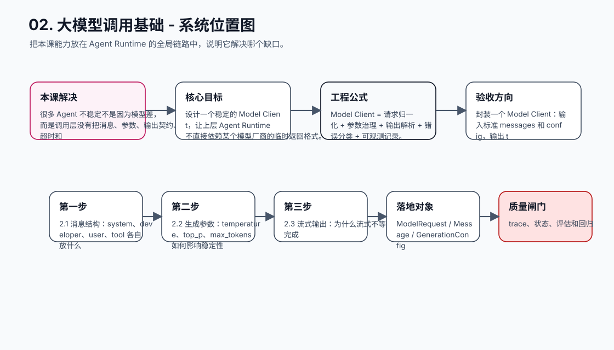
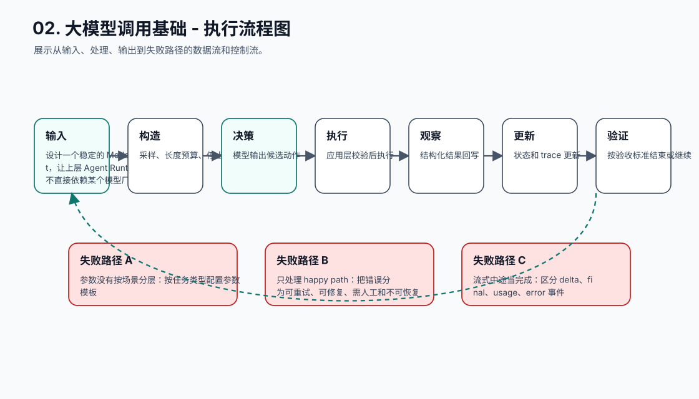
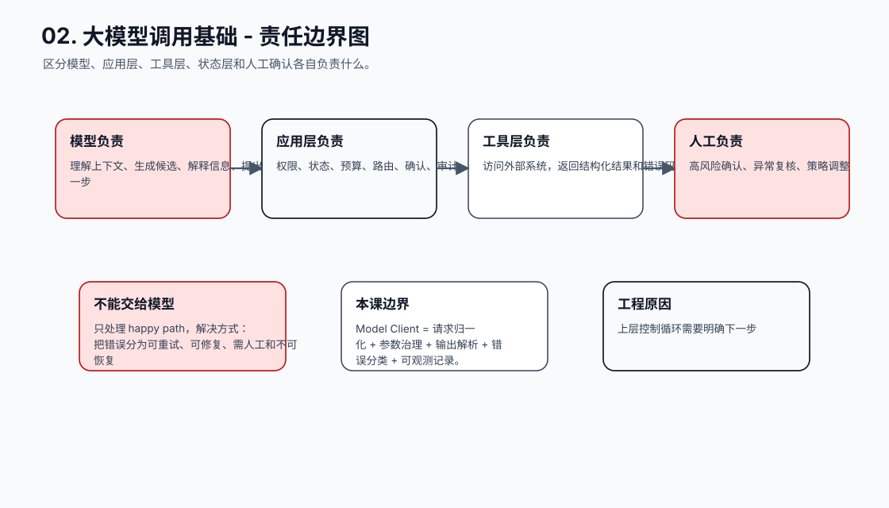
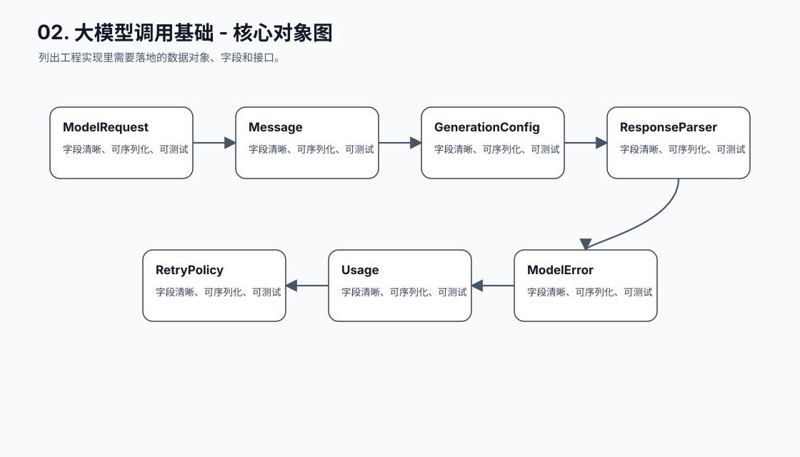
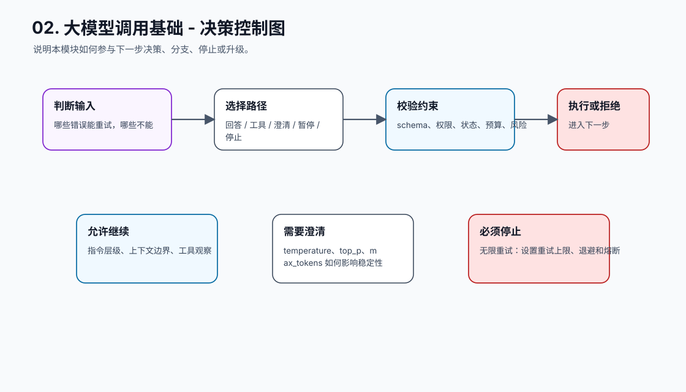
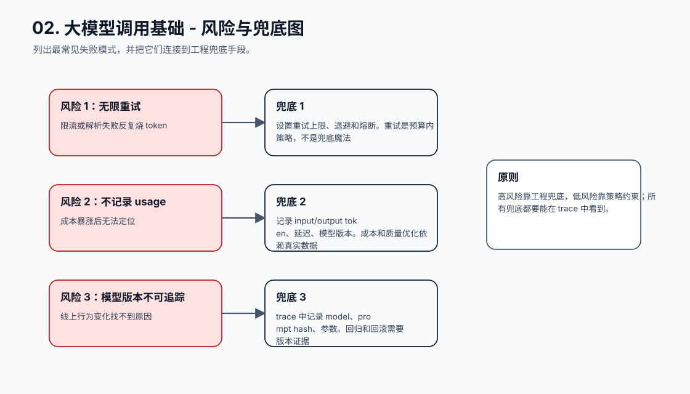
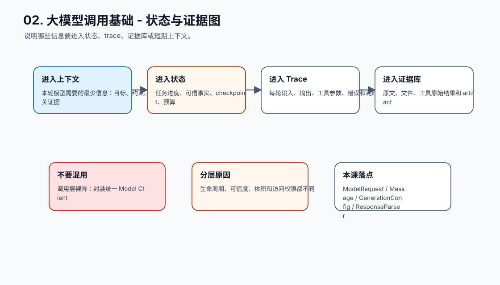
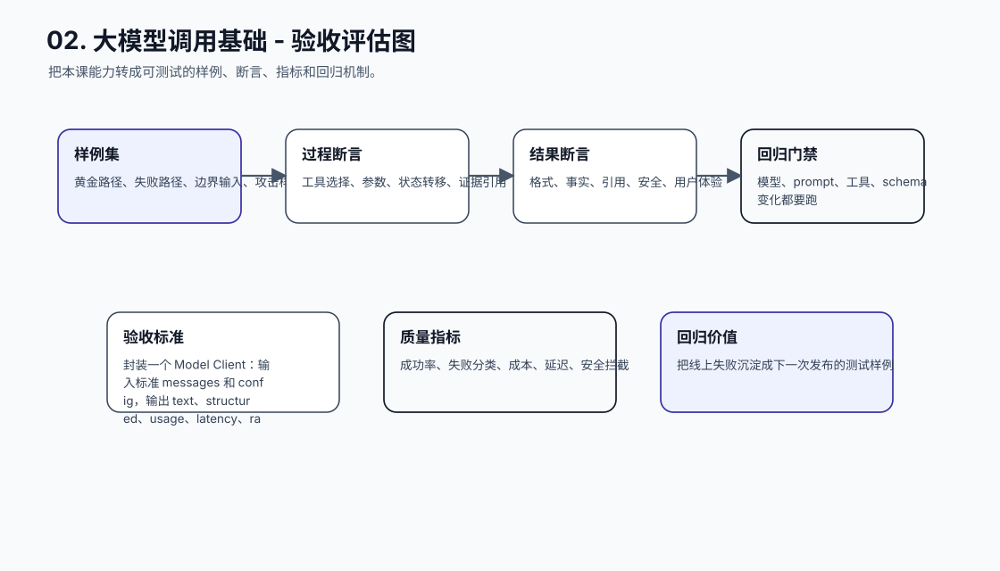
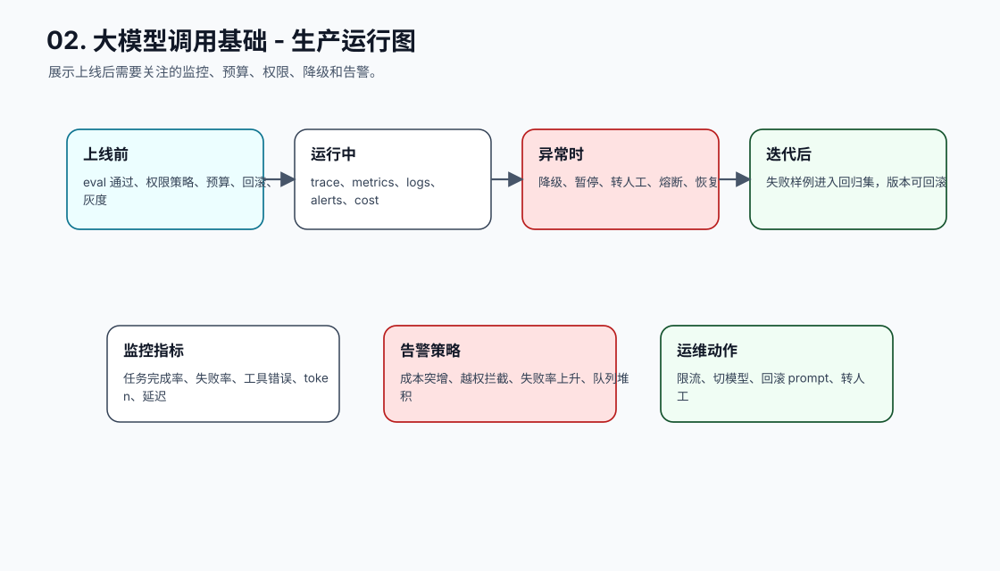
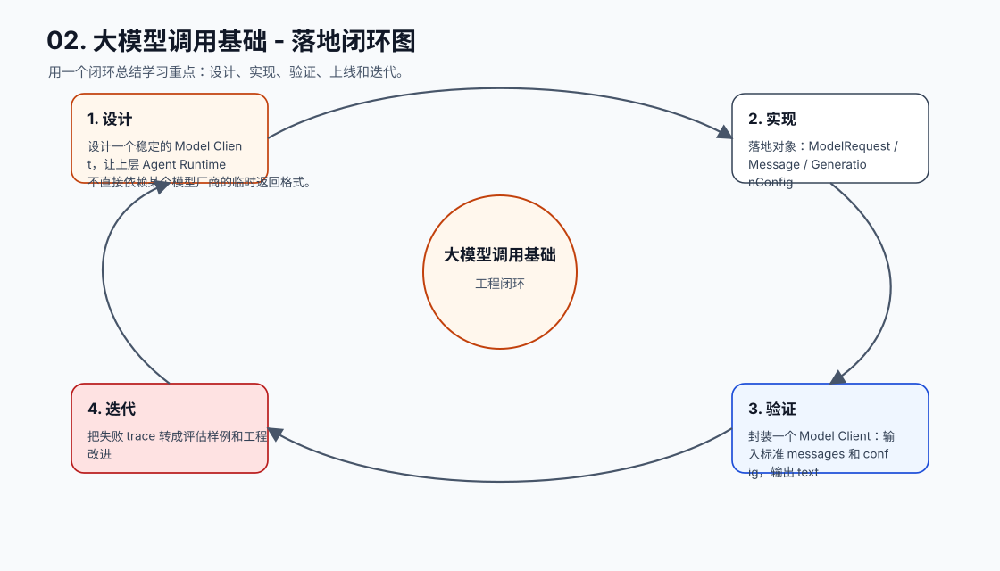

# 02. 大模型调用基础

[返回课程目录](README.md)

## 本课定位

把模型调用从“发一个 prompt”升级为可控接口：消息分层、参数控制、结构化输出、流式响应、错误处理和重试策略。

很多 Agent 不稳定不是因为模型差，而是调用层没有把消息、参数、输出契约、超时和错误路径设计清楚。

本课的目标是：设计一个稳定的 Model Client，让上层 Agent Runtime 不直接依赖某个模型厂商的临时返回格式。

核心公式：`Model Client = 请求归一化 + 参数治理 + 输出解析 + 错误分类 + 可观测记录。`

## 学习目标

- 能解释本课模块解决 Agent 系统里的哪个缺口。
- 能画出本课模块在完整 Agent Runtime 中的位置。
- 能把关键对象、接口、状态和错误路径写成可执行设计。
- 能识别工程中常见失败模式，并给出可落地的兜底方案。
- 能用 trace、评估样例和验收标准证明方案有效。

## 小节拆解

| 小节 | 先回答的问题 | 必须讲透的知识点 | 工程落地要求 | 练习 |
| --- | --- | --- | --- | --- |
| 2.1 消息结构 | system、developer、user、tool 各自放什么 | 指令层级、上下文边界、工具观察 | 对象、接口、状态和错误路径都要能落到代码 | 重写一个混乱 prompt |
| 2.2 生成参数 | temperature、top_p、max_tokens 如何影响稳定性 | 采样、长度预算、停止条件 | 对象、接口、状态和错误路径都要能落到代码 | 为客服场景设置参数 |
| 2.3 流式输出 | 为什么流式不等于任务完成 | 增量 token、最终事件、取消控制 | 对象、接口、状态和错误路径都要能落到代码 | 实现 CLI streaming |
| 2.4 结构化输出 | 如何让结果可解析可验证 | JSON Schema、解析、修复、拒绝 | 对象、接口、状态和错误路径都要能落到代码 | 返回标准 TaskDecision |
| 2.5 错误与重试 | 哪些错误能重试，哪些不能 | 超时、限流、内容过滤、解析失败 | 对象、接口、状态和错误路径都要能落到代码 | 设计错误分类表 |

## 知识点深拆

### 2.1 消息结构
这一小节先回答：system、developer、user、tool 各自放什么。不要从框架名词开始，而要从任务系统缺什么开始理解。对工程团队来说，指令层级、上下文边界、工具观察 不是概念装饰，而是决定系统能不能被测试、恢复和上线的边界。
落地时先写清输入、输出、状态变化和失败路径。输入要能被 schema 或类型系统描述，输出要能被下游程序校验，状态变化要能进入 trace，失败路径要能转成明确的 stop reason、retry policy 或 human review。
练习：重写一个混乱 prompt。验收时不要只看模型回答是否自然，要检查 trace 里是否出现正确决策、是否遵守权限和预算、是否在证据不足时选择澄清或拒绝。
### 2.2 生成参数
这一小节先回答：temperature、top_p、max_tokens 如何影响稳定性。不要从框架名词开始，而要从任务系统缺什么开始理解。对工程团队来说，采样、长度预算、停止条件 不是概念装饰，而是决定系统能不能被测试、恢复和上线的边界。
落地时先写清输入、输出、状态变化和失败路径。输入要能被 schema 或类型系统描述，输出要能被下游程序校验，状态变化要能进入 trace，失败路径要能转成明确的 stop reason、retry policy 或 human review。
练习：为客服场景设置参数。验收时不要只看模型回答是否自然，要检查 trace 里是否出现正确决策、是否遵守权限和预算、是否在证据不足时选择澄清或拒绝。
### 2.3 流式输出
这一小节先回答：为什么流式不等于任务完成。不要从框架名词开始，而要从任务系统缺什么开始理解。对工程团队来说，增量 token、最终事件、取消控制 不是概念装饰，而是决定系统能不能被测试、恢复和上线的边界。
落地时先写清输入、输出、状态变化和失败路径。输入要能被 schema 或类型系统描述，输出要能被下游程序校验，状态变化要能进入 trace，失败路径要能转成明确的 stop reason、retry policy 或 human review。
练习：实现 CLI streaming。验收时不要只看模型回答是否自然，要检查 trace 里是否出现正确决策、是否遵守权限和预算、是否在证据不足时选择澄清或拒绝。
### 2.4 结构化输出
这一小节先回答：如何让结果可解析可验证。不要从框架名词开始，而要从任务系统缺什么开始理解。对工程团队来说，JSON Schema、解析、修复、拒绝 不是概念装饰，而是决定系统能不能被测试、恢复和上线的边界。
落地时先写清输入、输出、状态变化和失败路径。输入要能被 schema 或类型系统描述，输出要能被下游程序校验，状态变化要能进入 trace，失败路径要能转成明确的 stop reason、retry policy 或 human review。
练习：返回标准 TaskDecision。验收时不要只看模型回答是否自然，要检查 trace 里是否出现正确决策、是否遵守权限和预算、是否在证据不足时选择澄清或拒绝。
### 2.5 错误与重试
这一小节先回答：哪些错误能重试，哪些不能。不要从框架名词开始，而要从任务系统缺什么开始理解。对工程团队来说，超时、限流、内容过滤、解析失败 不是概念装饰，而是决定系统能不能被测试、恢复和上线的边界。
落地时先写清输入、输出、状态变化和失败路径。输入要能被 schema 或类型系统描述，输出要能被下游程序校验，状态变化要能进入 trace，失败路径要能转成明确的 stop reason、retry policy 或 human review。
练习：设计错误分类表。验收时不要只看模型回答是否自然，要检查 trace 里是否出现正确决策、是否遵守权限和预算、是否在证据不足时选择澄清或拒绝。

## 核心工程对象

| 对象 | 它解决什么 | 落地要求 |
| --- | --- | --- |
| ModelRequest | ModelRequest 是本课需要落地的工程对象，不应该只停留在 Prompt 文本里。 | 有结构、有版本、有校验、有 trace 记录 |
| Message | Message 是本课需要落地的工程对象，不应该只停留在 Prompt 文本里。 | 有结构、有版本、有校验、有 trace 记录 |
| GenerationConfig | GenerationConfig 是本课需要落地的工程对象，不应该只停留在 Prompt 文本里。 | 有结构、有版本、有校验、有 trace 记录 |
| ResponseParser | ResponseParser 是本课需要落地的工程对象，不应该只停留在 Prompt 文本里。 | 有结构、有版本、有校验、有 trace 记录 |
| RetryPolicy | RetryPolicy 是本课需要落地的工程对象，不应该只停留在 Prompt 文本里。 | 有结构、有版本、有校验、有 trace 记录 |
| Usage | Usage 是本课需要落地的工程对象，不应该只停留在 Prompt 文本里。 | 有结构、有版本、有校验、有 trace 记录 |
| ModelError | ModelError 是本课需要落地的工程对象，不应该只停留在 Prompt 文本里。 | 有结构、有版本、有校验、有 trace 记录 |

## 本课图谱：10 张图讲清楚

下面 10 张图对应本课从宏观定位到生产落地的完整拆解。读图顺序固定为：系统位置、执行流程、责任边界、核心对象、决策控制、风险兜底、状态证据、验收评估、生产运行、落地闭环。

**图 02-1：大模型调用基础 - 系统位置图**  

**图 02-2：大模型调用基础 - 执行流程图**  

**图 02-3：大模型调用基础 - 责任边界图**  

**图 02-4：大模型调用基础 - 核心对象图**  

**图 02-5：大模型调用基础 - 决策控制图**  

**图 02-6：大模型调用基础 - 风险与兜底图**  

**图 02-7：大模型调用基础 - 状态与证据图**  

**图 02-8：大模型调用基础 - 验收评估图**  

**图 02-9：大模型调用基础 - 生产运行图**  

**图 02-10：大模型调用基础 - 落地闭环图**  

## 工程踩坑与处理方式

| 工程坑 | 典型表现 | 解决方式 | 为什么这么做 |
| --- | --- | --- | --- |
| 调用层裸奔 | 业务代码到处直接调模型 SDK | 封装统一 Model Client | 隔离厂商差异，便于审计和替换 |
| 参数没有按场景分层 | 创作、客服、工具决策用同一套 temperature | 按任务类型配置参数模板 | 不同任务对创造性和稳定性的要求不同 |
| 只处理 happy path | 解析失败时程序崩溃或吞错 | 把错误分为可重试、可修复、需人工和不可恢复 | 上层控制循环需要明确下一步 |
| 流式中途当完成 | 前端收到部分文本就写入最终状态 | 区分 delta、final、usage、error 事件 | 最终状态只能由完成事件或 verifier 写入 |
| 结构化输出没有校验 | 模型返回像 JSON 的文本就直接用 | 用 schema 校验并记录解析错误 | 工具调用和状态更新必须依赖合法结构 |
| 无限重试 | 限流或解析失败反复烧 token | 设置重试上限、退避和熔断 | 重试是预算内策略，不是兜底魔法 |
| 不记录 usage | 成本暴涨后无法定位 | 记录 input/output token、延迟、模型版本 | 成本和质量优化依赖真实数据 |
| 模型版本不可追踪 | 线上行为变化找不到原因 | trace 中记录 model、prompt hash、参数 | 回归和回滚需要版本证据 |

## 最小实现闭环

封装一个 Model Client：输入标准 messages 和 config，输出 text、structured、usage、latency、raw_response、error，并支持超时、重试和解析失败记录。

建议验收方式：

- 至少准备 5 条正常样例、5 条边界样例、3 条失败样例。
- 每条样例都保存输入、模型决策、工具调用、状态变化、最终输出和错误信息。
- 能用程序断言的地方不要只靠人工阅读，例如 schema、状态字段、错误码、引用 id、权限结果和停止原因。
- 修改 prompt、工具 schema、模型参数或状态结构后，必须跑回归样例。

## 章节总结

模型调用层是 Agent Runtime 的地基。地基稳定后，后面的工具调用、状态机和评估才有可控输入；否则每一层都会被模型返回格式和临时错误拖垮。

学完这一课后，应能把它放回完整 Agent 链路里：它接收什么输入，改变什么状态，调用什么能力，产生什么证据，失败时如何停止或恢复，以及上线后如何观测和评估。
