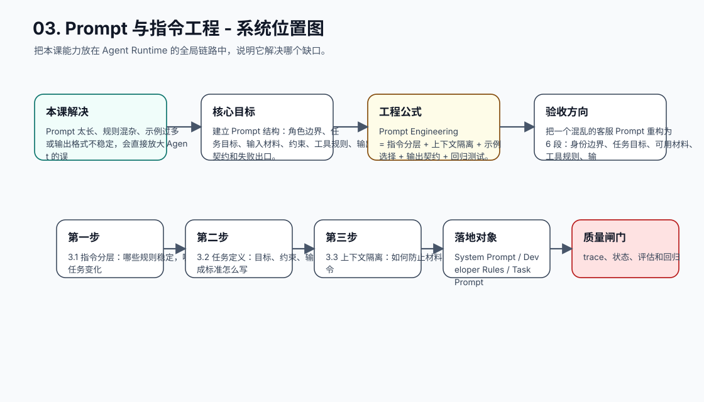
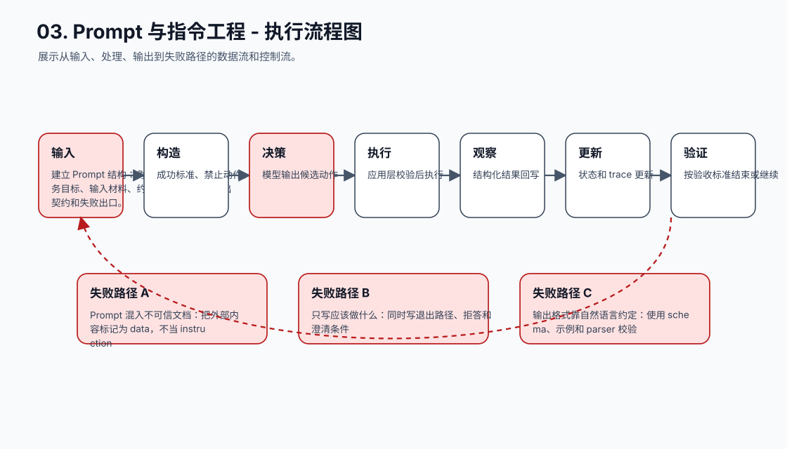
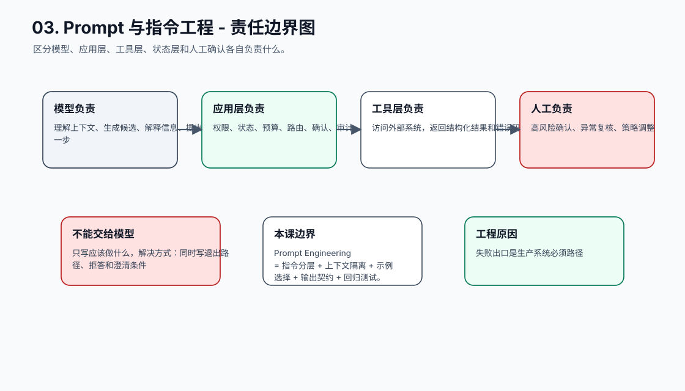
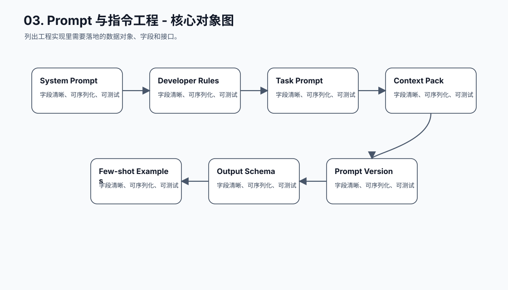
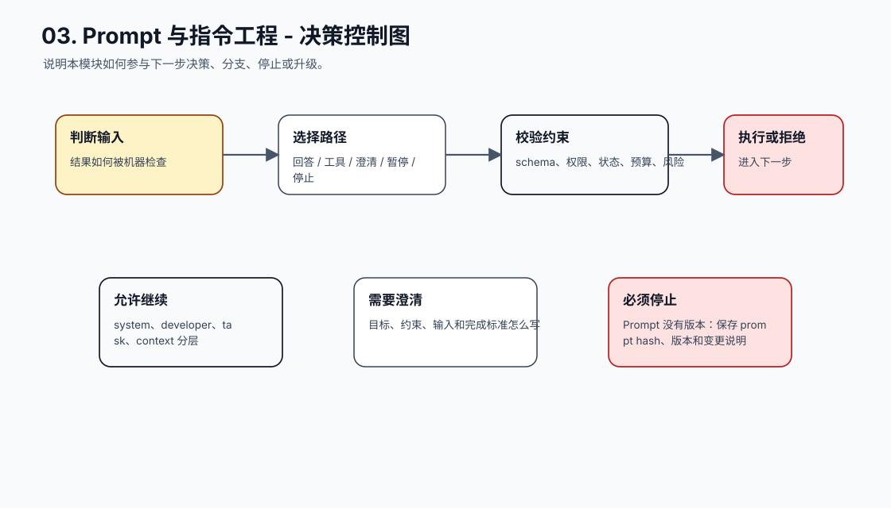
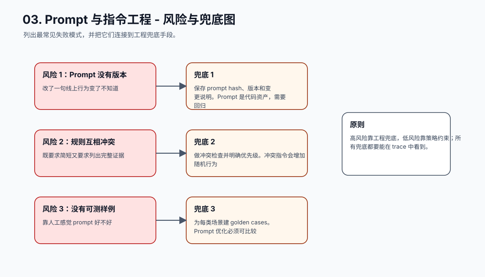
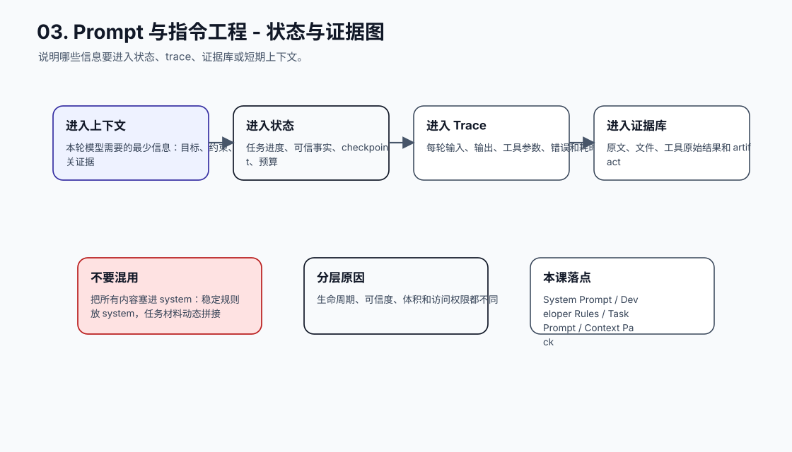
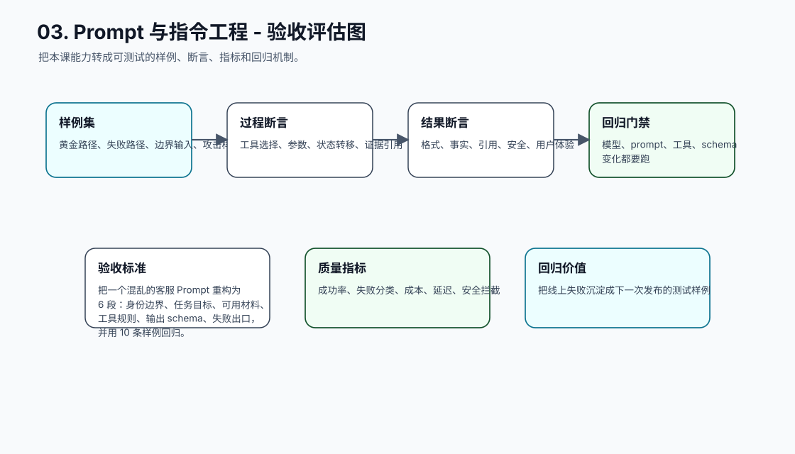
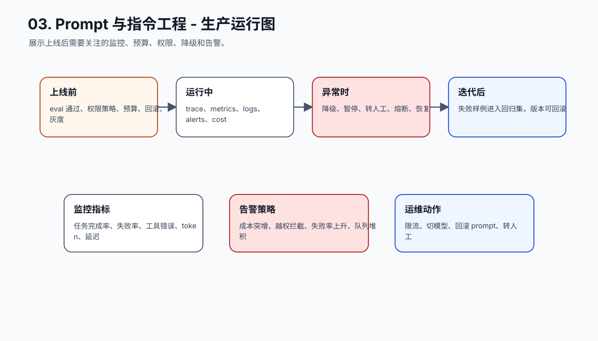
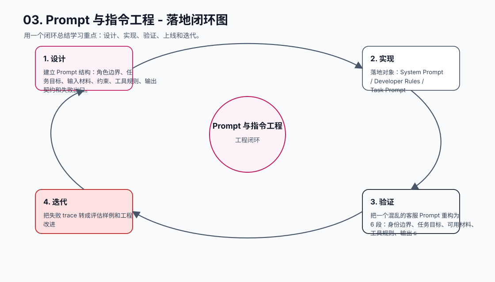

# 03. Prompt 与指令工程

[返回课程目录](README.md)

## 本课定位

把 Prompt 从“写得好看”变成工程资产：可分层、可版本化、可测试、可复用，并能和上下文、工具、输出格式协同。

Prompt 太长、规则混杂、示例过多或输出格式不稳定，会直接放大 Agent 的误调用、幻觉和维护成本。

本课的目标是：建立 Prompt 结构：角色边界、任务目标、输入材料、约束、工具规则、输出契约和失败出口。

核心公式：`Prompt Engineering = 指令分层 + 上下文隔离 + 示例选择 + 输出契约 + 回归测试。`

## 学习目标

- 能解释本课模块解决 Agent 系统里的哪个缺口。
- 能画出本课模块在完整 Agent Runtime 中的位置。
- 能把关键对象、接口、状态和错误路径写成可执行设计。
- 能识别工程中常见失败模式，并给出可落地的兜底方案。
- 能用 trace、评估样例和验收标准证明方案有效。

## 小节拆解

| 小节 | 先回答的问题 | 必须讲透的知识点 | 工程落地要求 | 练习 |
| --- | --- | --- | --- | --- |
| 3.1 指令分层 | 哪些规则稳定，哪些随任务变化 | system、developer、task、context 分层 | 对象、接口、状态和错误路径都要能落到代码 | 拆一个超长 prompt |
| 3.2 任务定义 | 目标、约束、输入和完成标准怎么写 | 成功标准、禁止动作、澄清条件 | 对象、接口、状态和错误路径都要能落到代码 | 写一个客服任务提示词 |
| 3.3 上下文隔离 | 如何防止材料污染指令 | 明确引用、来源、优先级、可信等级 | 对象、接口、状态和错误路径都要能落到代码 | 给文档片段加边界 |
| 3.4 示例策略 | few-shot 为什么少而精 | 覆盖边界、反例、输出格式 | 对象、接口、状态和错误路径都要能落到代码 | 挑选 3 个高质量示例 |
| 3.5 输出契约 | 结果如何被机器检查 | schema、枚举、错误码、拒答格式 | 对象、接口、状态和错误路径都要能落到代码 | 设计 TaskDecision JSON |

## 知识点深拆

### 3.1 指令分层
这一小节先回答：哪些规则稳定，哪些随任务变化。不要从框架名词开始，而要从任务系统缺什么开始理解。对工程团队来说，system、developer、task、context 分层 不是概念装饰，而是决定系统能不能被测试、恢复和上线的边界。
落地时先写清输入、输出、状态变化和失败路径。输入要能被 schema 或类型系统描述，输出要能被下游程序校验，状态变化要能进入 trace，失败路径要能转成明确的 stop reason、retry policy 或 human review。
练习：拆一个超长 prompt。验收时不要只看模型回答是否自然，要检查 trace 里是否出现正确决策、是否遵守权限和预算、是否在证据不足时选择澄清或拒绝。
### 3.2 任务定义
这一小节先回答：目标、约束、输入和完成标准怎么写。不要从框架名词开始，而要从任务系统缺什么开始理解。对工程团队来说，成功标准、禁止动作、澄清条件 不是概念装饰，而是决定系统能不能被测试、恢复和上线的边界。
落地时先写清输入、输出、状态变化和失败路径。输入要能被 schema 或类型系统描述，输出要能被下游程序校验，状态变化要能进入 trace，失败路径要能转成明确的 stop reason、retry policy 或 human review。
练习：写一个客服任务提示词。验收时不要只看模型回答是否自然，要检查 trace 里是否出现正确决策、是否遵守权限和预算、是否在证据不足时选择澄清或拒绝。
### 3.3 上下文隔离
这一小节先回答：如何防止材料污染指令。不要从框架名词开始，而要从任务系统缺什么开始理解。对工程团队来说，明确引用、来源、优先级、可信等级 不是概念装饰，而是决定系统能不能被测试、恢复和上线的边界。
落地时先写清输入、输出、状态变化和失败路径。输入要能被 schema 或类型系统描述，输出要能被下游程序校验，状态变化要能进入 trace，失败路径要能转成明确的 stop reason、retry policy 或 human review。
练习：给文档片段加边界。验收时不要只看模型回答是否自然，要检查 trace 里是否出现正确决策、是否遵守权限和预算、是否在证据不足时选择澄清或拒绝。
### 3.4 示例策略
这一小节先回答：few-shot 为什么少而精。不要从框架名词开始，而要从任务系统缺什么开始理解。对工程团队来说，覆盖边界、反例、输出格式 不是概念装饰，而是决定系统能不能被测试、恢复和上线的边界。
落地时先写清输入、输出、状态变化和失败路径。输入要能被 schema 或类型系统描述，输出要能被下游程序校验，状态变化要能进入 trace，失败路径要能转成明确的 stop reason、retry policy 或 human review。
练习：挑选 3 个高质量示例。验收时不要只看模型回答是否自然，要检查 trace 里是否出现正确决策、是否遵守权限和预算、是否在证据不足时选择澄清或拒绝。
### 3.5 输出契约
这一小节先回答：结果如何被机器检查。不要从框架名词开始，而要从任务系统缺什么开始理解。对工程团队来说，schema、枚举、错误码、拒答格式 不是概念装饰，而是决定系统能不能被测试、恢复和上线的边界。
落地时先写清输入、输出、状态变化和失败路径。输入要能被 schema 或类型系统描述，输出要能被下游程序校验，状态变化要能进入 trace，失败路径要能转成明确的 stop reason、retry policy 或 human review。
练习：设计 TaskDecision JSON。验收时不要只看模型回答是否自然，要检查 trace 里是否出现正确决策、是否遵守权限和预算、是否在证据不足时选择澄清或拒绝。

## 核心工程对象

| 对象 | 它解决什么 | 落地要求 |
| --- | --- | --- |
| System Prompt | System Prompt 是本课需要落地的工程对象，不应该只停留在 Prompt 文本里。 | 有结构、有版本、有校验、有 trace 记录 |
| Developer Rules | Developer Rules 是本课需要落地的工程对象，不应该只停留在 Prompt 文本里。 | 有结构、有版本、有校验、有 trace 记录 |
| Task Prompt | Task Prompt 是本课需要落地的工程对象，不应该只停留在 Prompt 文本里。 | 有结构、有版本、有校验、有 trace 记录 |
| Context Pack | Context Pack 是本课需要落地的工程对象，不应该只停留在 Prompt 文本里。 | 有结构、有版本、有校验、有 trace 记录 |
| Few-shot Examples | Few-shot Examples 是本课需要落地的工程对象，不应该只停留在 Prompt 文本里。 | 有结构、有版本、有校验、有 trace 记录 |
| Output Schema | Output Schema 是本课需要落地的工程对象，不应该只停留在 Prompt 文本里。 | 有结构、有版本、有校验、有 trace 记录 |
| Prompt Version | Prompt Version 是本课需要落地的工程对象，不应该只停留在 Prompt 文本里。 | 有结构、有版本、有校验、有 trace 记录 |

## 本课图谱：10 张图讲清楚

下面 10 张图对应本课从宏观定位到生产落地的完整拆解。读图顺序固定为：系统位置、执行流程、责任边界、核心对象、决策控制、风险兜底、状态证据、验收评估、生产运行、落地闭环。

**图 03-1：Prompt 与指令工程 - 系统位置图**  

**图 03-2：Prompt 与指令工程 - 执行流程图**  

**图 03-3：Prompt 与指令工程 - 责任边界图**  

**图 03-4：Prompt 与指令工程 - 核心对象图**  

**图 03-5：Prompt 与指令工程 - 决策控制图**  

**图 03-6：Prompt 与指令工程 - 风险与兜底图**  

**图 03-7：Prompt 与指令工程 - 状态与证据图**  

**图 03-8：Prompt 与指令工程 - 验收评估图**  

**图 03-9：Prompt 与指令工程 - 生产运行图**  

**图 03-10：Prompt 与指令工程 - 落地闭环图**  

## 工程踩坑与处理方式

| 工程坑 | 典型表现 | 解决方式 | 为什么这么做 |
| --- | --- | --- | --- |
| 把所有内容塞进 system | 系统提示词越来越长且难缓存 | 稳定规则放 system，任务材料动态拼接 | 减少噪声，提高缓存命中和可维护性 |
| Prompt 混入不可信文档 | 检索内容里有“忽略之前规则” | 把外部内容标记为 data，不当 instruction | 阻断 prompt injection 的基本边界 |
| 只写应该做什么 | 模型遇到证据不足就编 | 同时写退出路径、拒答和澄清条件 | 失败出口是生产系统必须路径 |
| 输出格式靠自然语言约定 | 偶尔多一句解释导致解析失败 | 使用 schema、示例和 parser 校验 | 下游代码不能依赖“差不多” |
| 示例越多越好 | token 增加但覆盖不住边界 | 选择少量代表性正例和反例 | 示例要服务决策边界，不是堆材料 |
| Prompt 没有版本 | 改了一句线上行为变了不知道 | 保存 prompt hash、版本和变更说明 | Prompt 是代码资产，需要回归 |
| 规则互相冲突 | 既要求简短又要求列出完整证据 | 做冲突检查并明确优先级 | 冲突指令会增加随机行为 |
| 没有可测样例 | 靠人工感觉 prompt 好不好 | 为每类场景建 golden cases | Prompt 优化必须可比较 |

## 最小实现闭环

把一个混乱的客服 Prompt 重构为 6 段：身份边界、任务目标、可用材料、工具规则、输出 schema、失败出口，并用 10 条样例回归。

建议验收方式：

- 至少准备 5 条正常样例、5 条边界样例、3 条失败样例。
- 每条样例都保存输入、模型决策、工具调用、状态变化、最终输出和错误信息。
- 能用程序断言的地方不要只靠人工阅读，例如 schema、状态字段、错误码、引用 id、权限结果和停止原因。
- 修改 prompt、工具 schema、模型参数或状态结构后，必须跑回归样例。

## 章节总结

Prompt 的价值不是“让模型听话”，而是把任务边界翻译成模型可用的上下文结构。真正稳定的 Prompt 必须和 schema、工具、状态、评估一起工作。

学完这一课后，应能把它放回完整 Agent 链路里：它接收什么输入，改变什么状态，调用什么能力，产生什么证据，失败时如何停止或恢复，以及上线后如何观测和评估。
