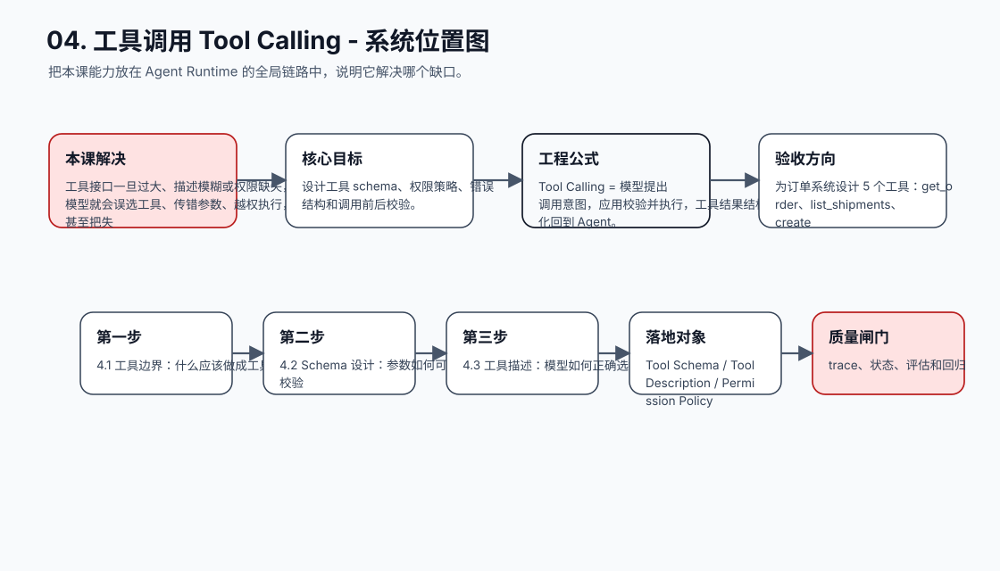
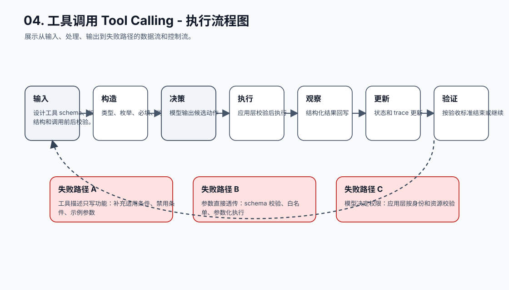
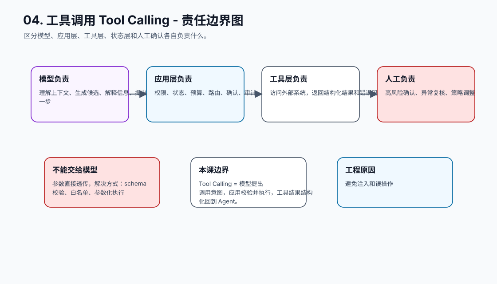
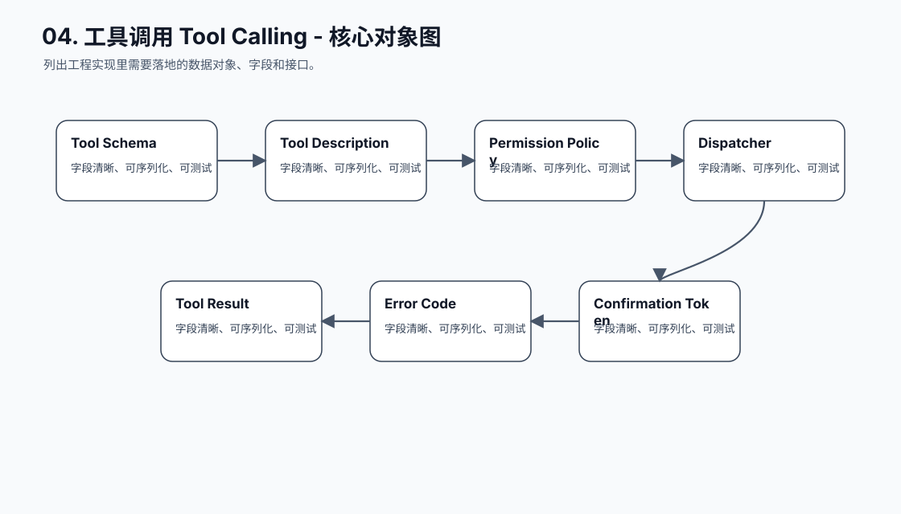
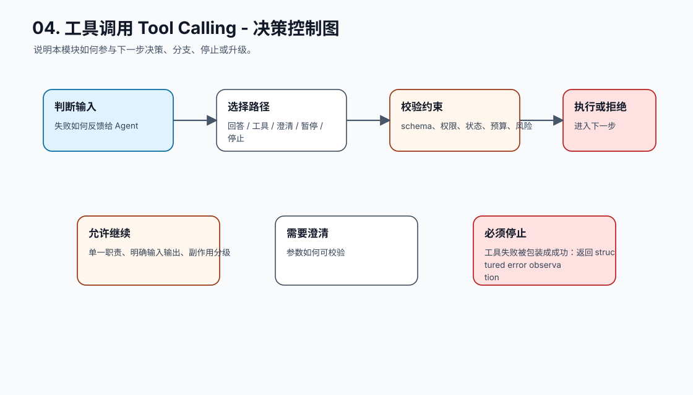
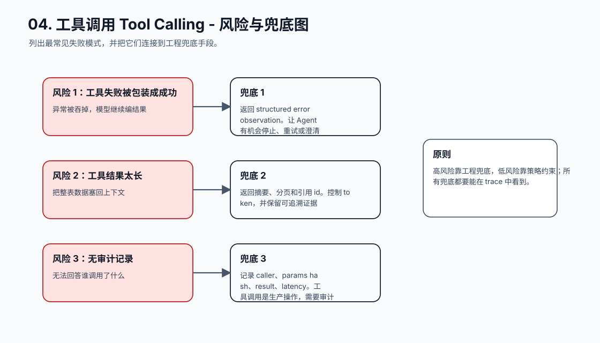
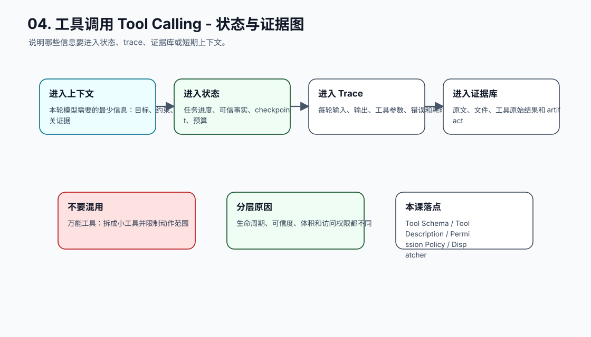
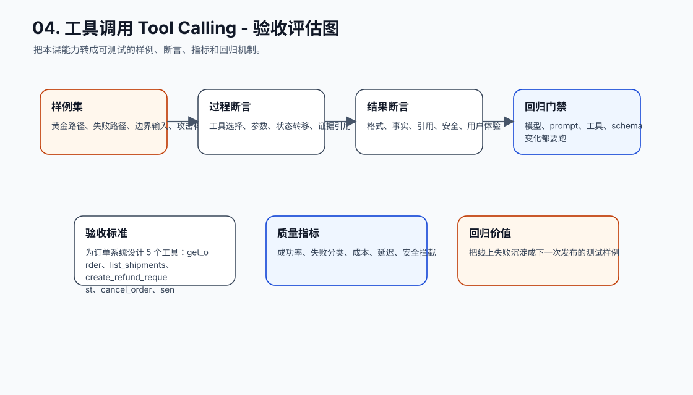
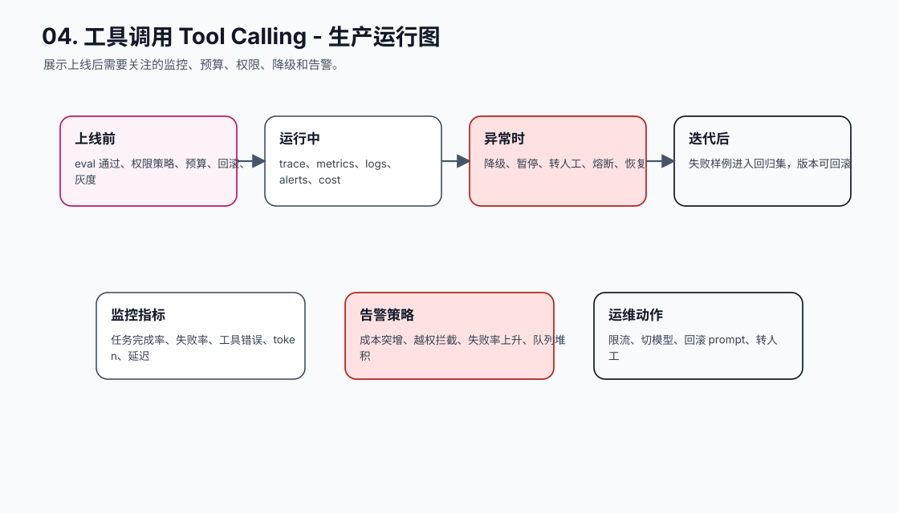
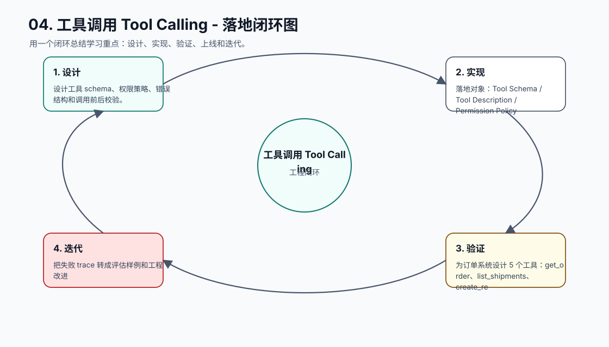

# 04. 工具调用 Tool Calling

[返回课程目录](README.md)

## 本课定位

让 Agent 通过小而清晰的工具访问外部系统，同时把权限、参数、错误、审计和确认放在应用层。

工具接口一旦过大、描述模糊或权限缺失，模型就会误选工具、传错参数、越权执行，甚至把失败工具结果解释成成功。

本课的目标是：设计工具 schema、权限策略、错误结构和调用前后校验。

核心公式：`Tool Calling = 模型提出调用意图，应用校验并执行，工具结果结构化回到 Agent。`

## 学习目标

- 能解释本课模块解决 Agent 系统里的哪个缺口。
- 能画出本课模块在完整 Agent Runtime 中的位置。
- 能把关键对象、接口、状态和错误路径写成可执行设计。
- 能识别工程中常见失败模式，并给出可落地的兜底方案。
- 能用 trace、评估样例和验收标准证明方案有效。

## 小节拆解

| 小节 | 先回答的问题 | 必须讲透的知识点 | 工程落地要求 | 练习 |
| --- | --- | --- | --- | --- |
| 4.1 工具边界 | 什么应该做成工具 | 单一职责、明确输入输出、副作用分级 | 对象、接口、状态和错误路径都要能落到代码 | 拆分一个万能工具 |
| 4.2 Schema 设计 | 参数如何可校验 | 类型、枚举、必填、约束、默认值 | 对象、接口、状态和错误路径都要能落到代码 | 写 get_order schema |
| 4.3 工具描述 | 模型如何正确选择工具 | 何时使用、何时不用、失败含义 | 对象、接口、状态和错误路径都要能落到代码 | 优化工具说明 |
| 4.4 权限和确认 | 哪些调用必须拦截 | 用户、资源、动作、风险等级 | 对象、接口、状态和错误路径都要能落到代码 | 给 refund 加确认 |
| 4.5 工具错误 | 失败如何反馈给 Agent | 结构化 observation、可重试标记 | 对象、接口、状态和错误路径都要能落到代码 | 设计错误码 |

## 知识点深拆

### 4.1 工具边界
这一小节先回答：什么应该做成工具。不要从框架名词开始，而要从任务系统缺什么开始理解。对工程团队来说，单一职责、明确输入输出、副作用分级 不是概念装饰，而是决定系统能不能被测试、恢复和上线的边界。
落地时先写清输入、输出、状态变化和失败路径。输入要能被 schema 或类型系统描述，输出要能被下游程序校验，状态变化要能进入 trace，失败路径要能转成明确的 stop reason、retry policy 或 human review。
练习：拆分一个万能工具。验收时不要只看模型回答是否自然，要检查 trace 里是否出现正确决策、是否遵守权限和预算、是否在证据不足时选择澄清或拒绝。
### 4.2 Schema 设计
这一小节先回答：参数如何可校验。不要从框架名词开始，而要从任务系统缺什么开始理解。对工程团队来说，类型、枚举、必填、约束、默认值 不是概念装饰，而是决定系统能不能被测试、恢复和上线的边界。
落地时先写清输入、输出、状态变化和失败路径。输入要能被 schema 或类型系统描述，输出要能被下游程序校验，状态变化要能进入 trace，失败路径要能转成明确的 stop reason、retry policy 或 human review。
练习：写 get_order schema。验收时不要只看模型回答是否自然，要检查 trace 里是否出现正确决策、是否遵守权限和预算、是否在证据不足时选择澄清或拒绝。
### 4.3 工具描述
这一小节先回答：模型如何正确选择工具。不要从框架名词开始，而要从任务系统缺什么开始理解。对工程团队来说，何时使用、何时不用、失败含义 不是概念装饰，而是决定系统能不能被测试、恢复和上线的边界。
落地时先写清输入、输出、状态变化和失败路径。输入要能被 schema 或类型系统描述，输出要能被下游程序校验，状态变化要能进入 trace，失败路径要能转成明确的 stop reason、retry policy 或 human review。
练习：优化工具说明。验收时不要只看模型回答是否自然，要检查 trace 里是否出现正确决策、是否遵守权限和预算、是否在证据不足时选择澄清或拒绝。
### 4.4 权限和确认
这一小节先回答：哪些调用必须拦截。不要从框架名词开始，而要从任务系统缺什么开始理解。对工程团队来说，用户、资源、动作、风险等级 不是概念装饰，而是决定系统能不能被测试、恢复和上线的边界。
落地时先写清输入、输出、状态变化和失败路径。输入要能被 schema 或类型系统描述，输出要能被下游程序校验，状态变化要能进入 trace，失败路径要能转成明确的 stop reason、retry policy 或 human review。
练习：给 refund 加确认。验收时不要只看模型回答是否自然，要检查 trace 里是否出现正确决策、是否遵守权限和预算、是否在证据不足时选择澄清或拒绝。
### 4.5 工具错误
这一小节先回答：失败如何反馈给 Agent。不要从框架名词开始，而要从任务系统缺什么开始理解。对工程团队来说，结构化 observation、可重试标记 不是概念装饰，而是决定系统能不能被测试、恢复和上线的边界。
落地时先写清输入、输出、状态变化和失败路径。输入要能被 schema 或类型系统描述，输出要能被下游程序校验，状态变化要能进入 trace，失败路径要能转成明确的 stop reason、retry policy 或 human review。
练习：设计错误码。验收时不要只看模型回答是否自然，要检查 trace 里是否出现正确决策、是否遵守权限和预算、是否在证据不足时选择澄清或拒绝。

## 核心工程对象

| 对象 | 它解决什么 | 落地要求 |
| --- | --- | --- |
| Tool Schema | Tool Schema 是本课需要落地的工程对象，不应该只停留在 Prompt 文本里。 | 有结构、有版本、有校验、有 trace 记录 |
| Tool Description | Tool Description 是本课需要落地的工程对象，不应该只停留在 Prompt 文本里。 | 有结构、有版本、有校验、有 trace 记录 |
| Permission Policy | Permission Policy 是本课需要落地的工程对象，不应该只停留在 Prompt 文本里。 | 有结构、有版本、有校验、有 trace 记录 |
| Dispatcher | Dispatcher 是本课需要落地的工程对象，不应该只停留在 Prompt 文本里。 | 有结构、有版本、有校验、有 trace 记录 |
| Tool Result | Tool Result 是本课需要落地的工程对象，不应该只停留在 Prompt 文本里。 | 有结构、有版本、有校验、有 trace 记录 |
| Error Code | Error Code 是本课需要落地的工程对象，不应该只停留在 Prompt 文本里。 | 有结构、有版本、有校验、有 trace 记录 |
| Confirmation Token | Confirmation Token 是本课需要落地的工程对象，不应该只停留在 Prompt 文本里。 | 有结构、有版本、有校验、有 trace 记录 |

## 本课图谱：10 张图讲清楚

下面 10 张图对应本课从宏观定位到生产落地的完整拆解。读图顺序固定为：系统位置、执行流程、责任边界、核心对象、决策控制、风险兜底、状态证据、验收评估、生产运行、落地闭环。

**图 04-1：工具调用 Tool Calling - 系统位置图**  

**图 04-2：工具调用 Tool Calling - 执行流程图**  

**图 04-3：工具调用 Tool Calling - 责任边界图**  

**图 04-4：工具调用 Tool Calling - 核心对象图**  

**图 04-5：工具调用 Tool Calling - 决策控制图**  

**图 04-6：工具调用 Tool Calling - 风险与兜底图**  

**图 04-7：工具调用 Tool Calling - 状态与证据图**  

**图 04-8：工具调用 Tool Calling - 验收评估图**  

**图 04-9：工具调用 Tool Calling - 生产运行图**  

**图 04-10：工具调用 Tool Calling - 落地闭环图**  

## 工程踩坑与处理方式

| 工程坑 | 典型表现 | 解决方式 | 为什么这么做 |
| --- | --- | --- | --- |
| 万能工具 | 一个 execute_sql 能做所有事 | 拆成小工具并限制动作范围 | 工具越泛化，越难校验和授权 |
| 工具描述只写功能 | 模型不知道什么时候不用 | 补充适用条件、禁用条件、示例参数 | 选择正确工具依赖边界描述 |
| 参数直接透传 | 字符串拼 SQL 或路径 | schema 校验、白名单、参数化执行 | 避免注入和误操作 |
| 模型决定权限 | 模型认为用户可以就执行 | 应用层按身份和资源校验 | 模型不能作为安全主体 |
| 高风险动作无确认 | 删除、付款、发布直接执行 | 生成确认摘要和 token，用户确认后执行 | 降低不可逆动作风险 |
| 工具失败被包装成成功 | 异常被吞掉，模型继续编结果 | 返回 structured error observation | 让 Agent 有机会停止、重试或澄清 |
| 工具结果太长 | 把整表数据塞回上下文 | 返回摘要、分页和引用 id | 控制 token，并保留可追溯证据 |
| 无审计记录 | 无法回答谁调用了什么 | 记录 caller、params hash、result、latency | 工具调用是生产操作，需要审计 |

## 最小实现闭环

为订单系统设计 5 个工具：get_order、list_shipments、create_refund_request、cancel_order、send_message，并为每个工具写 schema、权限等级、错误码和确认策略。

建议验收方式：

- 至少准备 5 条正常样例、5 条边界样例、3 条失败样例。
- 每条样例都保存输入、模型决策、工具调用、状态变化、最终输出和错误信息。
- 能用程序断言的地方不要只靠人工阅读，例如 schema、状态字段、错误码、引用 id、权限结果和停止原因。
- 修改 prompt、工具 schema、模型参数或状态结构后，必须跑回归样例。

## 章节总结

工具是 Agent 接触外部世界的边界。工具设计越小、越明确、越可校验，模型就越容易正确使用，系统也越容易控制风险。

学完这一课后，应能把它放回完整 Agent 链路里：它接收什么输入，改变什么状态，调用什么能力，产生什么证据，失败时如何停止或恢复，以及上线后如何观测和评估。
