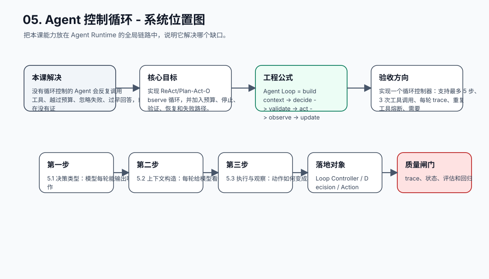
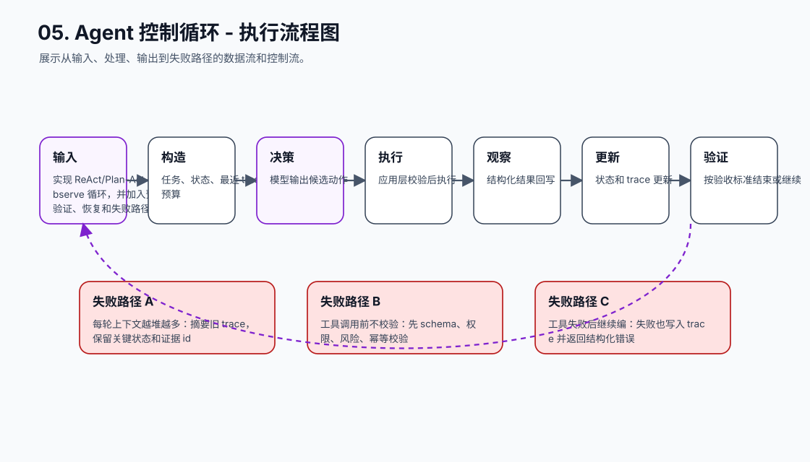
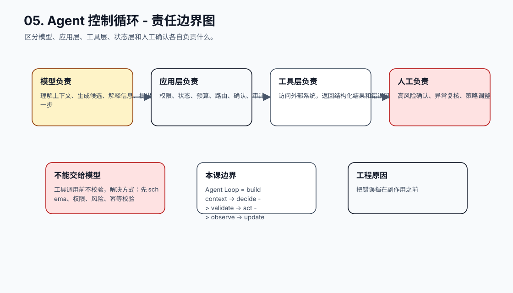
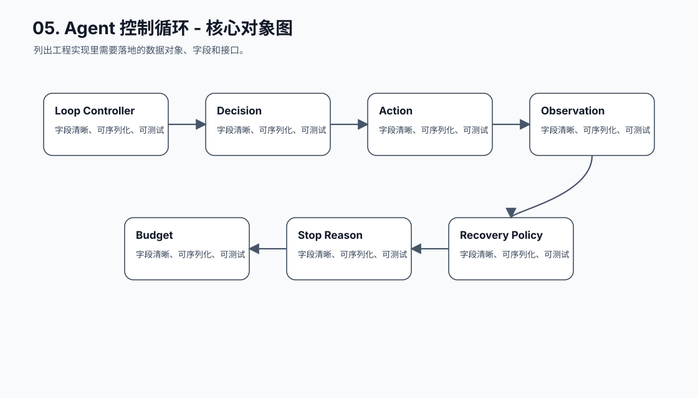
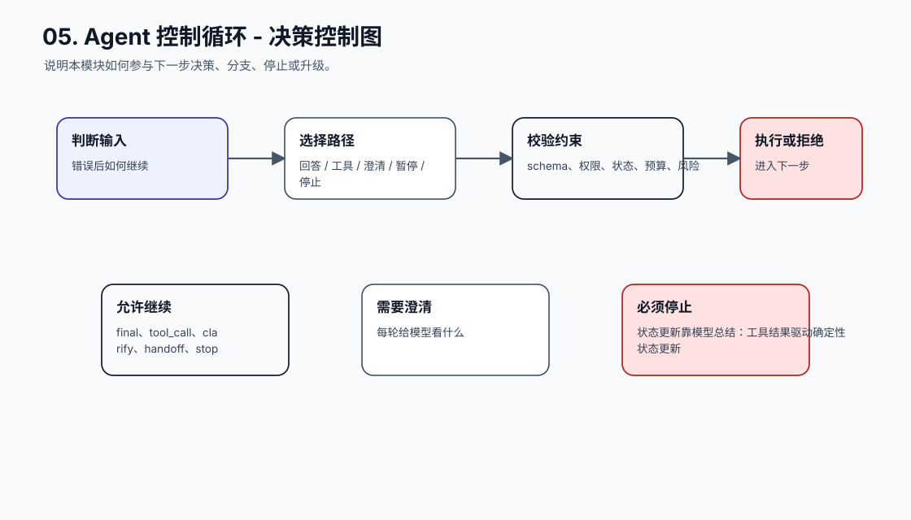
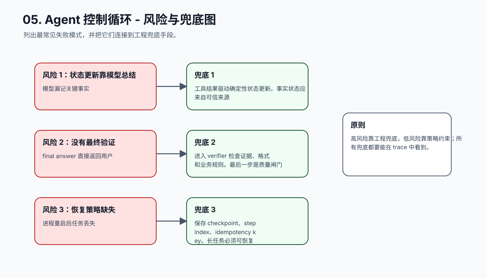
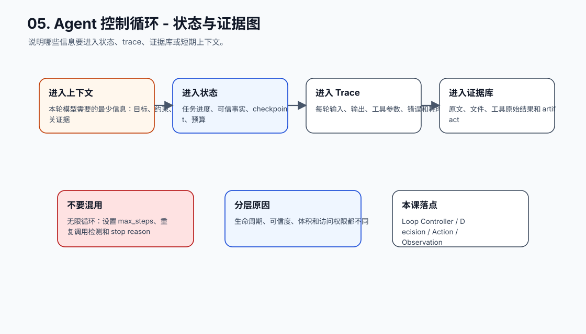
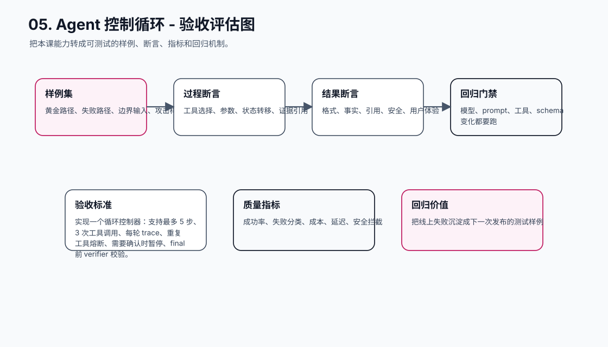
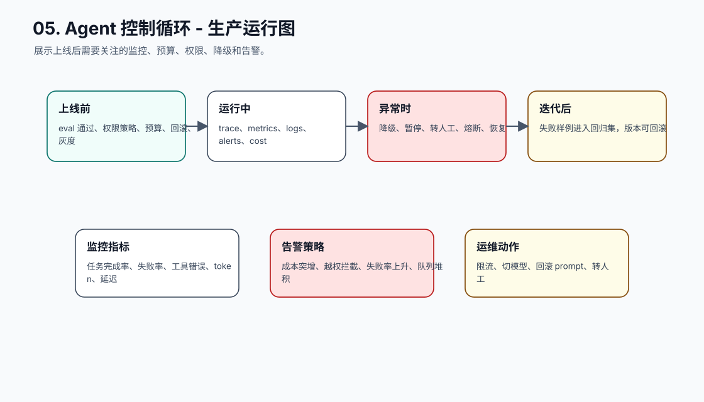
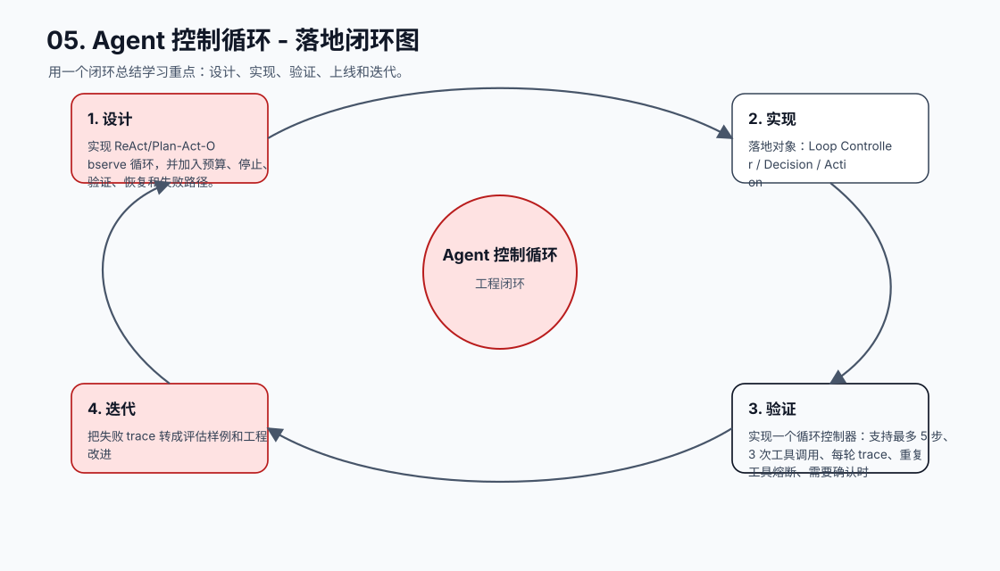

# 05. Agent 控制循环

[返回课程目录](README.md)

## 本课定位

把模型决策、工具调用、观察结果、状态更新和停止条件组织成可控循环，而不是让模型无限“思考”。

没有循环控制的 Agent 会反复调用工具、越过预算、忽略失败、过早回答，或在没有证据时生成自信结论。

本课的目标是：实现 ReAct/Plan-Act-Observe 循环，并加入预算、停止、验证、恢复和失败路径。

核心公式：`Agent Loop = build context -> decide -> validate -> act -> observe -> update state -> verify/continue。`

## 学习目标

- 能解释本课模块解决 Agent 系统里的哪个缺口。
- 能画出本课模块在完整 Agent Runtime 中的位置。
- 能把关键对象、接口、状态和错误路径写成可执行设计。
- 能识别工程中常见失败模式，并给出可落地的兜底方案。
- 能用 trace、评估样例和验收标准证明方案有效。

## 小节拆解

| 小节 | 先回答的问题 | 必须讲透的知识点 | 工程落地要求 | 练习 |
| --- | --- | --- | --- | --- |
| 5.1 决策类型 | 模型每轮能输出哪些动作 | final、tool_call、clarify、handoff、stop | 对象、接口、状态和错误路径都要能落到代码 | 定义 Decision 枚举 |
| 5.2 上下文构造 | 每轮给模型看什么 | 任务、状态、最近 trace、可用工具、预算 | 对象、接口、状态和错误路径都要能落到代码 | 写 build_context |
| 5.3 执行与观察 | 动作如何变成事实 | 校验、执行、结构化 observation | 对象、接口、状态和错误路径都要能落到代码 | 接入两个工具 |
| 5.4 停止条件 | 什么时候必须停 | 完成、预算、失败、需要确认、无法推进 | 对象、接口、状态和错误路径都要能落到代码 | 设计 stop reason |
| 5.5 失败恢复 | 错误后如何继续 | 重试、换策略、澄清、转人工、暂停 | 对象、接口、状态和错误路径都要能落到代码 | 实现恢复策略 |

## 知识点深拆

### 5.1 决策类型
这一小节先回答：模型每轮能输出哪些动作。不要从框架名词开始，而要从任务系统缺什么开始理解。对工程团队来说，final、tool_call、clarify、handoff、stop 不是概念装饰，而是决定系统能不能被测试、恢复和上线的边界。
落地时先写清输入、输出、状态变化和失败路径。输入要能被 schema 或类型系统描述，输出要能被下游程序校验，状态变化要能进入 trace，失败路径要能转成明确的 stop reason、retry policy 或 human review。
练习：定义 Decision 枚举。验收时不要只看模型回答是否自然，要检查 trace 里是否出现正确决策、是否遵守权限和预算、是否在证据不足时选择澄清或拒绝。
### 5.2 上下文构造
这一小节先回答：每轮给模型看什么。不要从框架名词开始，而要从任务系统缺什么开始理解。对工程团队来说，任务、状态、最近 trace、可用工具、预算 不是概念装饰，而是决定系统能不能被测试、恢复和上线的边界。
落地时先写清输入、输出、状态变化和失败路径。输入要能被 schema 或类型系统描述，输出要能被下游程序校验，状态变化要能进入 trace，失败路径要能转成明确的 stop reason、retry policy 或 human review。
练习：写 build_context。验收时不要只看模型回答是否自然，要检查 trace 里是否出现正确决策、是否遵守权限和预算、是否在证据不足时选择澄清或拒绝。
### 5.3 执行与观察
这一小节先回答：动作如何变成事实。不要从框架名词开始，而要从任务系统缺什么开始理解。对工程团队来说，校验、执行、结构化 observation 不是概念装饰，而是决定系统能不能被测试、恢复和上线的边界。
落地时先写清输入、输出、状态变化和失败路径。输入要能被 schema 或类型系统描述，输出要能被下游程序校验，状态变化要能进入 trace，失败路径要能转成明确的 stop reason、retry policy 或 human review。
练习：接入两个工具。验收时不要只看模型回答是否自然，要检查 trace 里是否出现正确决策、是否遵守权限和预算、是否在证据不足时选择澄清或拒绝。
### 5.4 停止条件
这一小节先回答：什么时候必须停。不要从框架名词开始，而要从任务系统缺什么开始理解。对工程团队来说，完成、预算、失败、需要确认、无法推进 不是概念装饰，而是决定系统能不能被测试、恢复和上线的边界。
落地时先写清输入、输出、状态变化和失败路径。输入要能被 schema 或类型系统描述，输出要能被下游程序校验，状态变化要能进入 trace，失败路径要能转成明确的 stop reason、retry policy 或 human review。
练习：设计 stop reason。验收时不要只看模型回答是否自然，要检查 trace 里是否出现正确决策、是否遵守权限和预算、是否在证据不足时选择澄清或拒绝。
### 5.5 失败恢复
这一小节先回答：错误后如何继续。不要从框架名词开始，而要从任务系统缺什么开始理解。对工程团队来说，重试、换策略、澄清、转人工、暂停 不是概念装饰，而是决定系统能不能被测试、恢复和上线的边界。
落地时先写清输入、输出、状态变化和失败路径。输入要能被 schema 或类型系统描述，输出要能被下游程序校验，状态变化要能进入 trace，失败路径要能转成明确的 stop reason、retry policy 或 human review。
练习：实现恢复策略。验收时不要只看模型回答是否自然，要检查 trace 里是否出现正确决策、是否遵守权限和预算、是否在证据不足时选择澄清或拒绝。

## 核心工程对象

| 对象 | 它解决什么 | 落地要求 |
| --- | --- | --- |
| Loop Controller | Loop Controller 是本课需要落地的工程对象，不应该只停留在 Prompt 文本里。 | 有结构、有版本、有校验、有 trace 记录 |
| Decision | Decision 是本课需要落地的工程对象，不应该只停留在 Prompt 文本里。 | 有结构、有版本、有校验、有 trace 记录 |
| Action | Action 是本课需要落地的工程对象，不应该只停留在 Prompt 文本里。 | 有结构、有版本、有校验、有 trace 记录 |
| Observation | Observation 是本课需要落地的工程对象，不应该只停留在 Prompt 文本里。 | 有结构、有版本、有校验、有 trace 记录 |
| Budget | Budget 是本课需要落地的工程对象，不应该只停留在 Prompt 文本里。 | 有结构、有版本、有校验、有 trace 记录 |
| Stop Reason | Stop Reason 是本课需要落地的工程对象，不应该只停留在 Prompt 文本里。 | 有结构、有版本、有校验、有 trace 记录 |
| Recovery Policy | Recovery Policy 是本课需要落地的工程对象，不应该只停留在 Prompt 文本里。 | 有结构、有版本、有校验、有 trace 记录 |
| Verifier | Verifier 是本课需要落地的工程对象，不应该只停留在 Prompt 文本里。 | 有结构、有版本、有校验、有 trace 记录 |

## 本课图谱：10 张图讲清楚

下面 10 张图对应本课从宏观定位到生产落地的完整拆解。读图顺序固定为：系统位置、执行流程、责任边界、核心对象、决策控制、风险兜底、状态证据、验收评估、生产运行、落地闭环。

**图 05-1：Agent 控制循环 - 系统位置图**  

**图 05-2：Agent 控制循环 - 执行流程图**  

**图 05-3：Agent 控制循环 - 责任边界图**  

**图 05-4：Agent 控制循环 - 核心对象图**  

**图 05-5：Agent 控制循环 - 决策控制图**  

**图 05-6：Agent 控制循环 - 风险与兜底图**  

**图 05-7：Agent 控制循环 - 状态与证据图**  

**图 05-8：Agent 控制循环 - 验收评估图**  

**图 05-9：Agent 控制循环 - 生产运行图**  

**图 05-10：Agent 控制循环 - 落地闭环图**  

## 工程踩坑与处理方式

| 工程坑 | 典型表现 | 解决方式 | 为什么这么做 |
| --- | --- | --- | --- |
| 无限循环 | 模型反复调用同一工具 | 设置 max_steps、重复调用检测和 stop reason | 循环必须受预算控制 |
| 每轮上下文越堆越多 | trace 全量塞入导致成本和噪声增加 | 摘要旧 trace，保留关键状态和证据 id | 控制上下文质量而不是长度 |
| 工具调用前不校验 | 非法参数进入执行层 | 先 schema、权限、风险、幂等校验 | 把错误挡在副作用之前 |
| 工具失败后继续编 | 没有 observation 反馈 | 失败也写入 trace 并返回结构化错误 | 失败是正常路径，不是异常旁路 |
| 停止原因只有 success | 失败、超时、等待确认都混成结束 | 枚举 completed、blocked、failed、paused、budget_exceeded | 不同停止原因对应不同产品体验 |
| 状态更新靠模型总结 | 模型漏记关键事实 | 工具结果驱动确定性状态更新 | 事实状态应来自可信来源 |
| 没有最终验证 | final answer 直接返回用户 | 进入 verifier 检查证据、格式和业务规则 | 最后一步是质量闸门 |
| 恢复策略缺失 | 进程重启后任务丢失 | 保存 checkpoint、step index、idempotency key | 长任务必须可恢复 |

## 最小实现闭环

实现一个循环控制器：支持最多 5 步、3 次工具调用、每轮 trace、重复工具熔断、需要确认时暂停、final 前 verifier 校验。

建议验收方式：

- 至少准备 5 条正常样例、5 条边界样例、3 条失败样例。
- 每条样例都保存输入、模型决策、工具调用、状态变化、最终输出和错误信息。
- 能用程序断言的地方不要只靠人工阅读，例如 schema、状态字段、错误码、引用 id、权限结果和停止原因。
- 修改 prompt、工具 schema、模型参数或状态结构后，必须跑回归样例。

## 章节总结

Agent 循环不是模型自由行动，而是工程系统给模型一次次有限决策机会。每一轮都要能解释、能停止、能恢复、能验证。

学完这一课后，应能把它放回完整 Agent 链路里：它接收什么输入，改变什么状态，调用什么能力，产生什么证据，失败时如何停止或恢复，以及上线后如何观测和评估。
