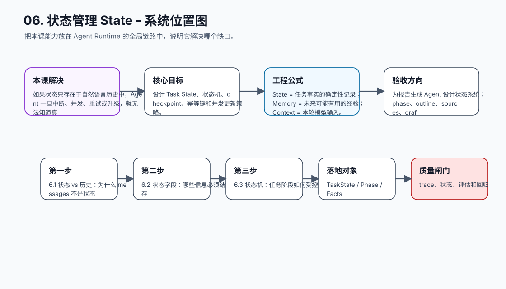
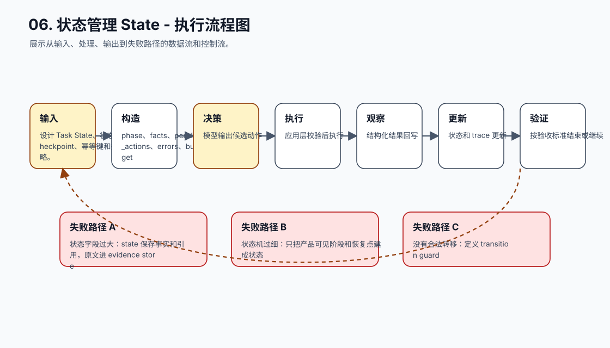
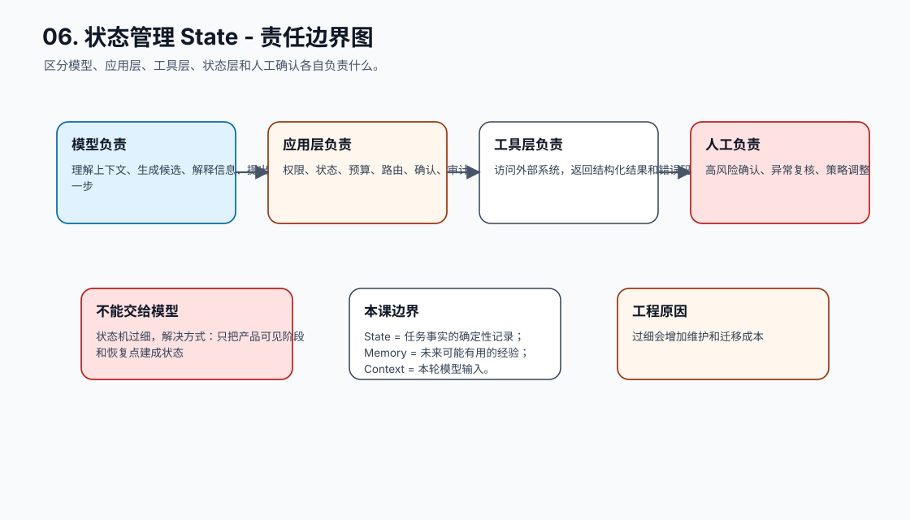
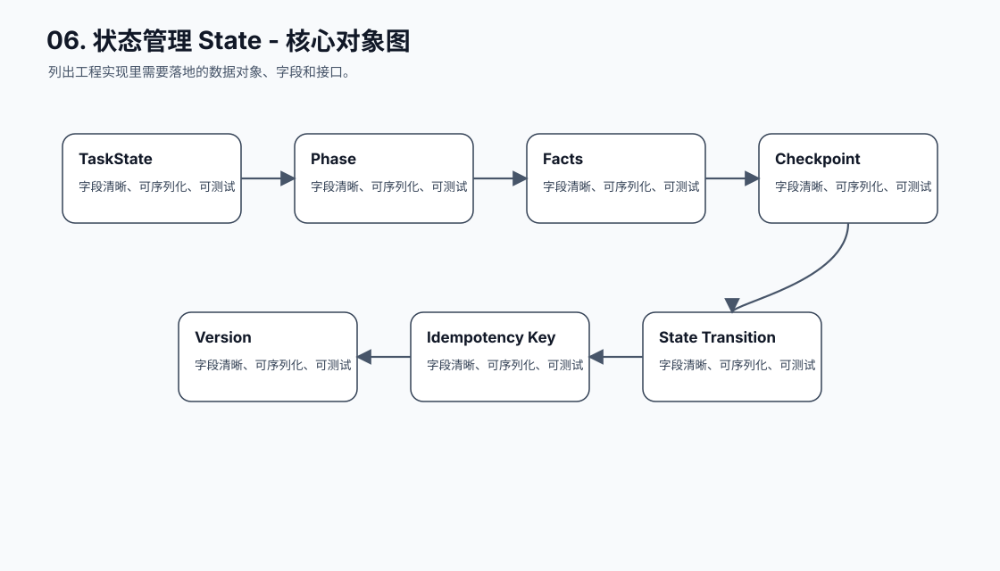
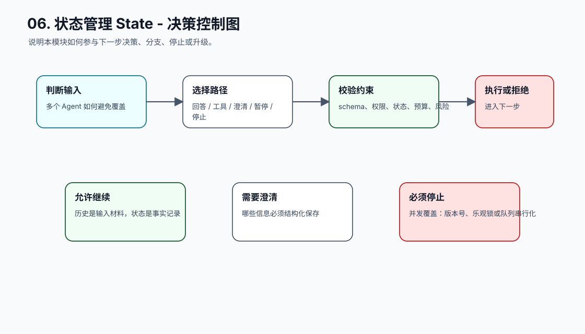
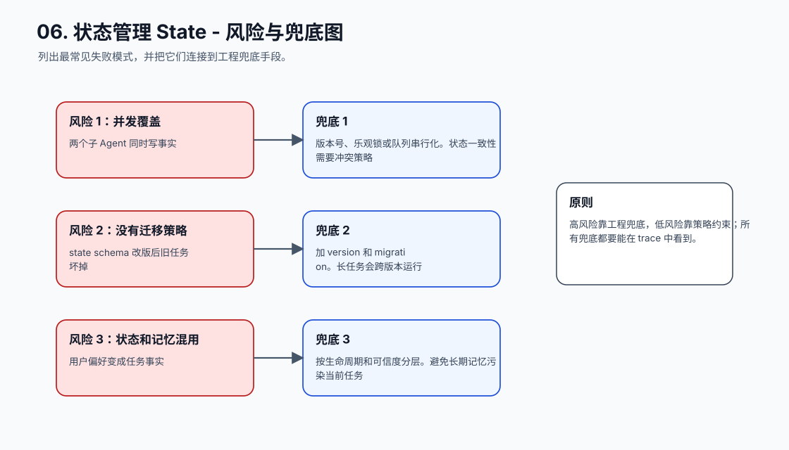
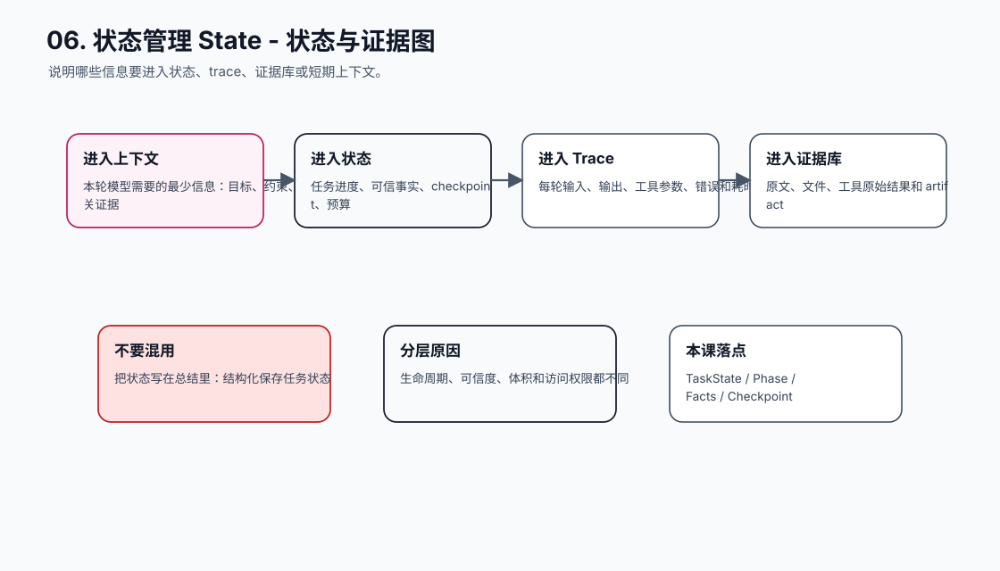
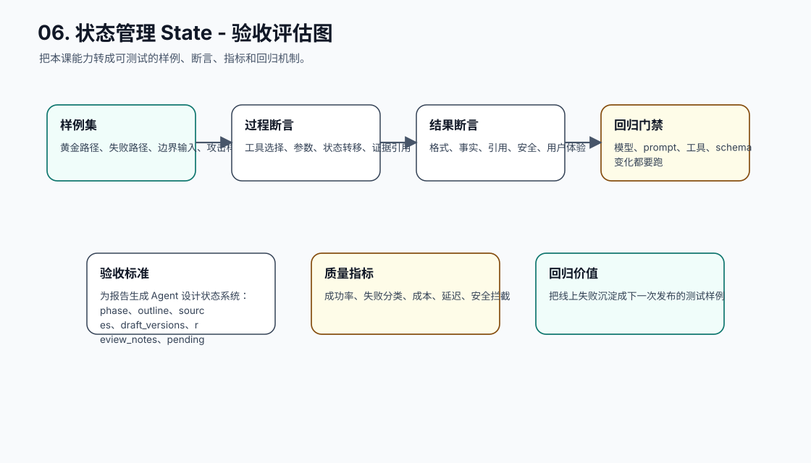
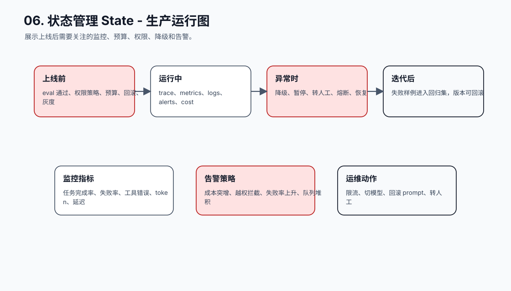
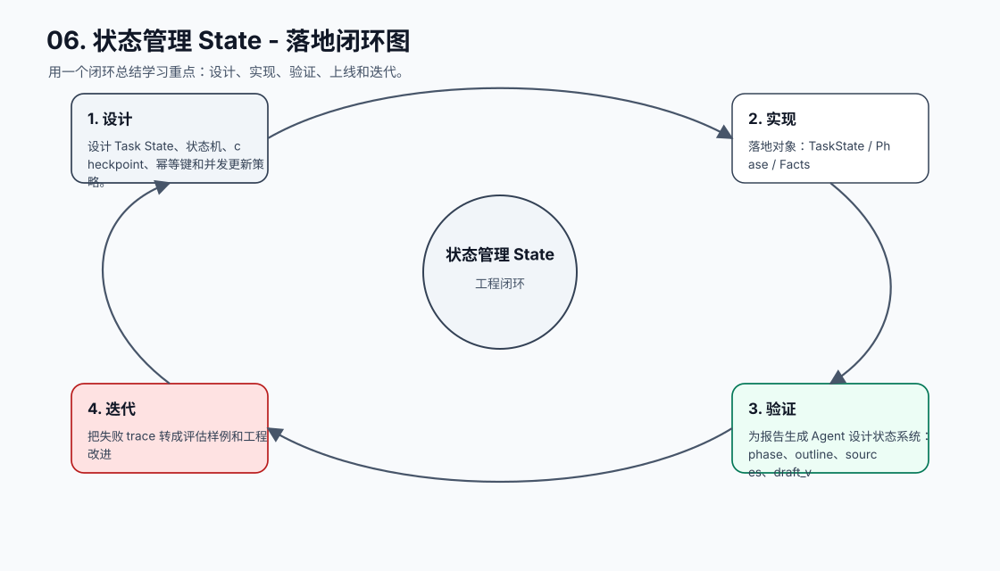

# 06. 状态管理 State

[返回课程目录](README.md)

## 本课定位

把任务进度、业务事实、检查点、重试次数和并发控制从聊天历史里拆出来，放进确定性状态系统。

如果状态只存在于自然语言历史中，Agent 一旦中断、并发、重试或升级，就无法知道真实进度，也无法做自动化验收。

本课的目标是：设计 Task State、状态机、checkpoint、幂等键和并发更新策略。

核心公式：`State = 任务事实的确定性记录；Memory = 未来可能有用的经验；Context = 本轮模型输入。`

## 学习目标

- 能解释本课模块解决 Agent 系统里的哪个缺口。
- 能画出本课模块在完整 Agent Runtime 中的位置。
- 能把关键对象、接口、状态和错误路径写成可执行设计。
- 能识别工程中常见失败模式，并给出可落地的兜底方案。
- 能用 trace、评估样例和验收标准证明方案有效。

## 小节拆解

| 小节 | 先回答的问题 | 必须讲透的知识点 | 工程落地要求 | 练习 |
| --- | --- | --- | --- | --- |
| 6.1 状态 vs 历史 | 为什么 messages 不是状态 | 历史是输入材料，状态是事实记录 | 对象、接口、状态和错误路径都要能落到代码 | 拆出任务状态对象 |
| 6.2 状态字段 | 哪些信息必须结构化保存 | phase、facts、pending_actions、errors、budget | 对象、接口、状态和错误路径都要能落到代码 | 设计 State schema |
| 6.3 状态机 | 任务阶段如何受控流转 | 有限状态、合法转移、守卫条件 | 对象、接口、状态和错误路径都要能落到代码 | 定义订单状态机 |
| 6.4 幂等和恢复 | 重试如何不重复执行 | idempotency key、checkpoint、resume | 对象、接口、状态和错误路径都要能落到代码 | 模拟重启恢复 |
| 6.5 并发控制 | 多个 Agent 如何避免覆盖 | 版本号、锁、事务、冲突合并 | 对象、接口、状态和错误路径都要能落到代码 | 处理并发更新 |

## 知识点深拆

### 6.1 状态 vs 历史
这一小节先回答：为什么 messages 不是状态。不要从框架名词开始，而要从任务系统缺什么开始理解。对工程团队来说，历史是输入材料，状态是事实记录 不是概念装饰，而是决定系统能不能被测试、恢复和上线的边界。
落地时先写清输入、输出、状态变化和失败路径。输入要能被 schema 或类型系统描述，输出要能被下游程序校验，状态变化要能进入 trace，失败路径要能转成明确的 stop reason、retry policy 或 human review。
练习：拆出任务状态对象。验收时不要只看模型回答是否自然，要检查 trace 里是否出现正确决策、是否遵守权限和预算、是否在证据不足时选择澄清或拒绝。
### 6.2 状态字段
这一小节先回答：哪些信息必须结构化保存。不要从框架名词开始，而要从任务系统缺什么开始理解。对工程团队来说，phase、facts、pending_actions、errors、budget 不是概念装饰，而是决定系统能不能被测试、恢复和上线的边界。
落地时先写清输入、输出、状态变化和失败路径。输入要能被 schema 或类型系统描述，输出要能被下游程序校验，状态变化要能进入 trace，失败路径要能转成明确的 stop reason、retry policy 或 human review。
练习：设计 State schema。验收时不要只看模型回答是否自然，要检查 trace 里是否出现正确决策、是否遵守权限和预算、是否在证据不足时选择澄清或拒绝。
### 6.3 状态机
这一小节先回答：任务阶段如何受控流转。不要从框架名词开始，而要从任务系统缺什么开始理解。对工程团队来说，有限状态、合法转移、守卫条件 不是概念装饰，而是决定系统能不能被测试、恢复和上线的边界。
落地时先写清输入、输出、状态变化和失败路径。输入要能被 schema 或类型系统描述，输出要能被下游程序校验，状态变化要能进入 trace，失败路径要能转成明确的 stop reason、retry policy 或 human review。
练习：定义订单状态机。验收时不要只看模型回答是否自然，要检查 trace 里是否出现正确决策、是否遵守权限和预算、是否在证据不足时选择澄清或拒绝。
### 6.4 幂等和恢复
这一小节先回答：重试如何不重复执行。不要从框架名词开始，而要从任务系统缺什么开始理解。对工程团队来说，idempotency key、checkpoint、resume 不是概念装饰，而是决定系统能不能被测试、恢复和上线的边界。
落地时先写清输入、输出、状态变化和失败路径。输入要能被 schema 或类型系统描述，输出要能被下游程序校验，状态变化要能进入 trace，失败路径要能转成明确的 stop reason、retry policy 或 human review。
练习：模拟重启恢复。验收时不要只看模型回答是否自然，要检查 trace 里是否出现正确决策、是否遵守权限和预算、是否在证据不足时选择澄清或拒绝。
### 6.5 并发控制
这一小节先回答：多个 Agent 如何避免覆盖。不要从框架名词开始，而要从任务系统缺什么开始理解。对工程团队来说，版本号、锁、事务、冲突合并 不是概念装饰，而是决定系统能不能被测试、恢复和上线的边界。
落地时先写清输入、输出、状态变化和失败路径。输入要能被 schema 或类型系统描述，输出要能被下游程序校验，状态变化要能进入 trace，失败路径要能转成明确的 stop reason、retry policy 或 human review。
练习：处理并发更新。验收时不要只看模型回答是否自然，要检查 trace 里是否出现正确决策、是否遵守权限和预算、是否在证据不足时选择澄清或拒绝。

## 核心工程对象

| 对象 | 它解决什么 | 落地要求 |
| --- | --- | --- |
| TaskState | TaskState 是本课需要落地的工程对象，不应该只停留在 Prompt 文本里。 | 有结构、有版本、有校验、有 trace 记录 |
| Phase | Phase 是本课需要落地的工程对象，不应该只停留在 Prompt 文本里。 | 有结构、有版本、有校验、有 trace 记录 |
| Facts | Facts 是本课需要落地的工程对象，不应该只停留在 Prompt 文本里。 | 有结构、有版本、有校验、有 trace 记录 |
| Checkpoint | Checkpoint 是本课需要落地的工程对象，不应该只停留在 Prompt 文本里。 | 有结构、有版本、有校验、有 trace 记录 |
| Version | Version 是本课需要落地的工程对象，不应该只停留在 Prompt 文本里。 | 有结构、有版本、有校验、有 trace 记录 |
| Idempotency Key | Idempotency Key 是本课需要落地的工程对象，不应该只停留在 Prompt 文本里。 | 有结构、有版本、有校验、有 trace 记录 |
| State Transition | State Transition 是本课需要落地的工程对象，不应该只停留在 Prompt 文本里。 | 有结构、有版本、有校验、有 trace 记录 |

## 本课图谱：10 张图讲清楚

下面 10 张图对应本课从宏观定位到生产落地的完整拆解。读图顺序固定为：系统位置、执行流程、责任边界、核心对象、决策控制、风险兜底、状态证据、验收评估、生产运行、落地闭环。

**图 06-1：状态管理 State - 系统位置图**  

**图 06-2：状态管理 State - 执行流程图**  

**图 06-3：状态管理 State - 责任边界图**  

**图 06-4：状态管理 State - 核心对象图**  

**图 06-5：状态管理 State - 决策控制图**  

**图 06-6：状态管理 State - 风险与兜底图**  

**图 06-7：状态管理 State - 状态与证据图**  

**图 06-8：状态管理 State - 验收评估图**  

**图 06-9：状态管理 State - 生产运行图**  

**图 06-10：状态管理 State - 落地闭环图**  

## 工程踩坑与处理方式

| 工程坑 | 典型表现 | 解决方式 | 为什么这么做 |
| --- | --- | --- | --- |
| 把状态写在总结里 | 模型总结漏掉关键字段 | 结构化保存任务状态 | 程序需要可断言的状态 |
| 状态字段过大 | 把全文、工具原始结果都塞进 state | state 保存事实和引用，原文进 evidence store | 状态要轻、准、可恢复 |
| 状态机过细 | 每个小动作都一个状态 | 只把产品可见阶段和恢复点建成状态 | 过细会增加维护和迁移成本 |
| 没有合法转移 | 任何阶段都能跳到完成 | 定义 transition guard | 防止乱序和越权完成 |
| 重试产生副作用 | 重复创建退款或发消息 | 使用幂等键和执行记录 | 重试必须安全 |
| 并发覆盖 | 两个子 Agent 同时写事实 | 版本号、乐观锁或队列串行化 | 状态一致性需要冲突策略 |
| 没有迁移策略 | state schema 改版后旧任务坏掉 | 加 version 和 migration | 长任务会跨版本运行 |
| 状态和记忆混用 | 用户偏好变成任务事实 | 按生命周期和可信度分层 | 避免长期记忆污染当前任务 |

## 最小实现闭环

为报告生成 Agent 设计状态系统：phase、outline、sources、draft_versions、review_notes、pending_confirmation、errors、budget，并支持中断恢复。

建议验收方式：

- 至少准备 5 条正常样例、5 条边界样例、3 条失败样例。
- 每条样例都保存输入、模型决策、工具调用、状态变化、最终输出和错误信息。
- 能用程序断言的地方不要只靠人工阅读，例如 schema、状态字段、错误码、引用 id、权限结果和停止原因。
- 修改 prompt、工具 schema、模型参数或状态结构后，必须跑回归样例。

## 章节总结

状态管理决定 Agent 是否能从演示走向生产。能恢复、能断言、能并发控制的系统，才有资格执行长任务和高风险任务。

学完这一课后，应能把它放回完整 Agent 链路里：它接收什么输入，改变什么状态，调用什么能力，产生什么证据，失败时如何停止或恢复，以及上线后如何观测和评估。
