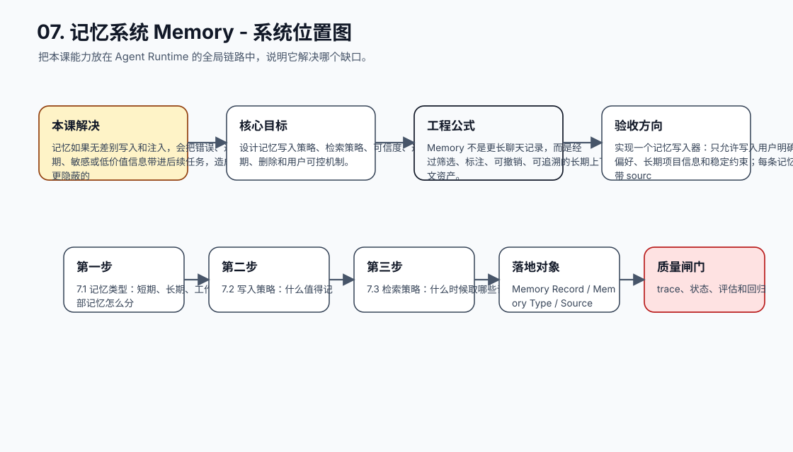
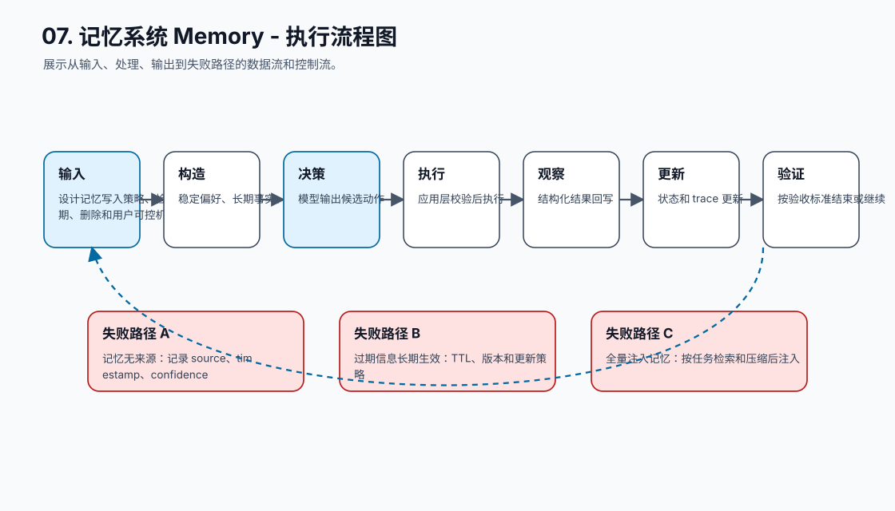
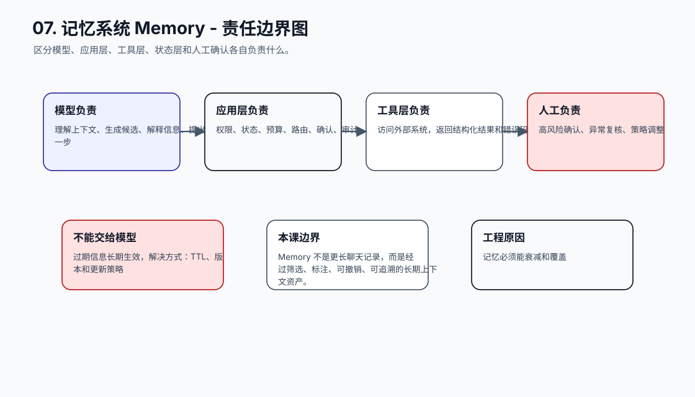
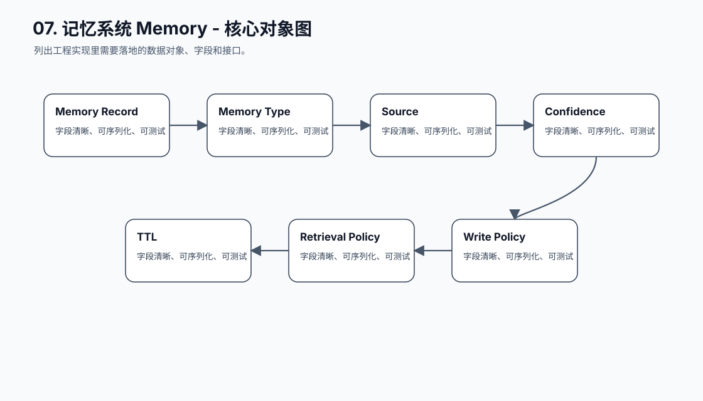
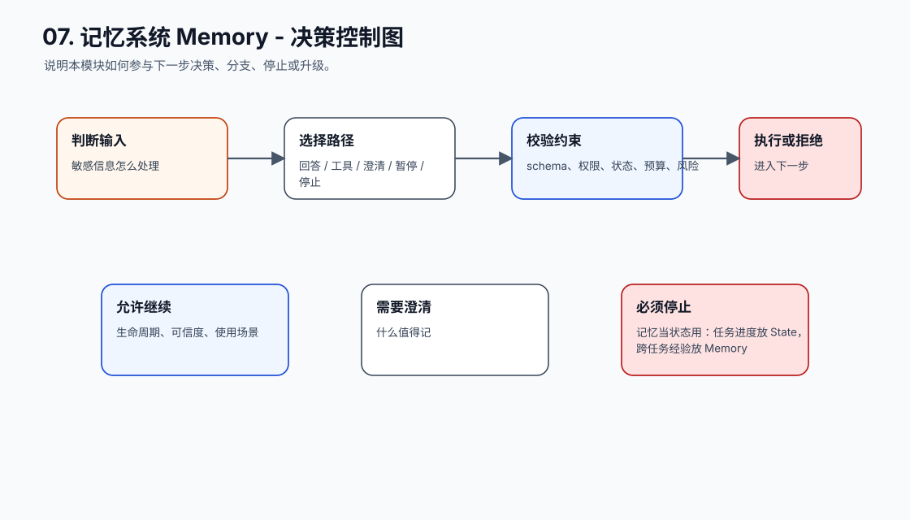
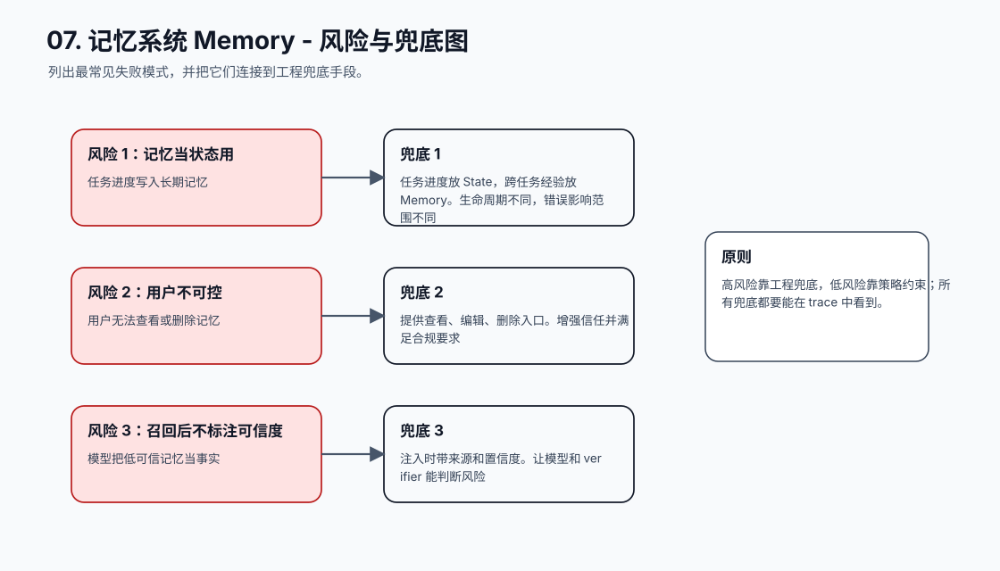
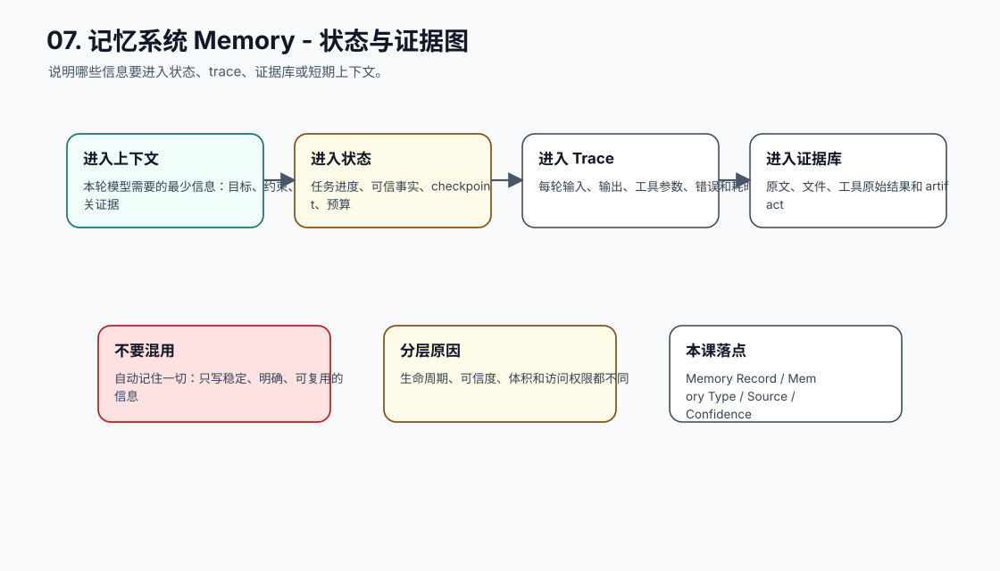
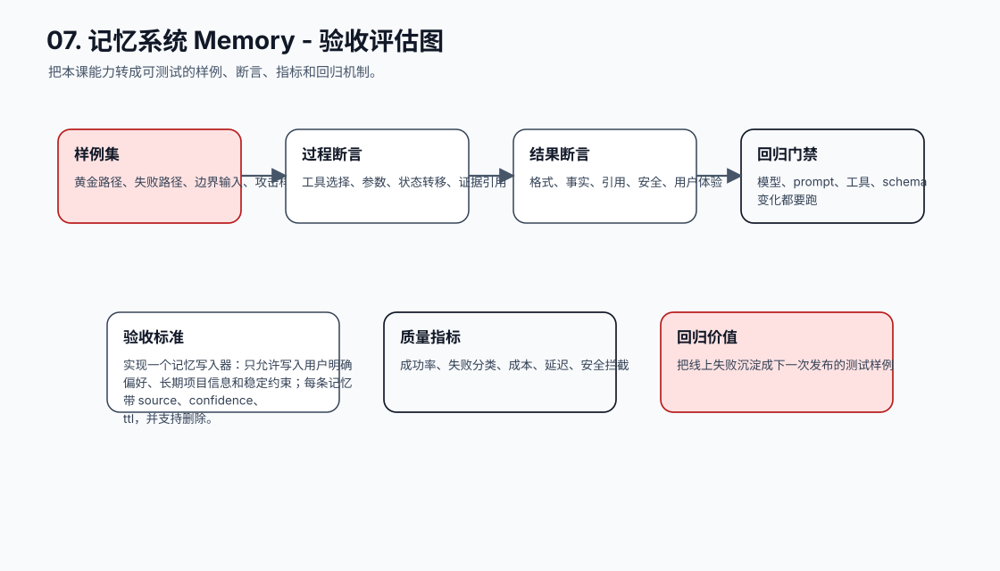
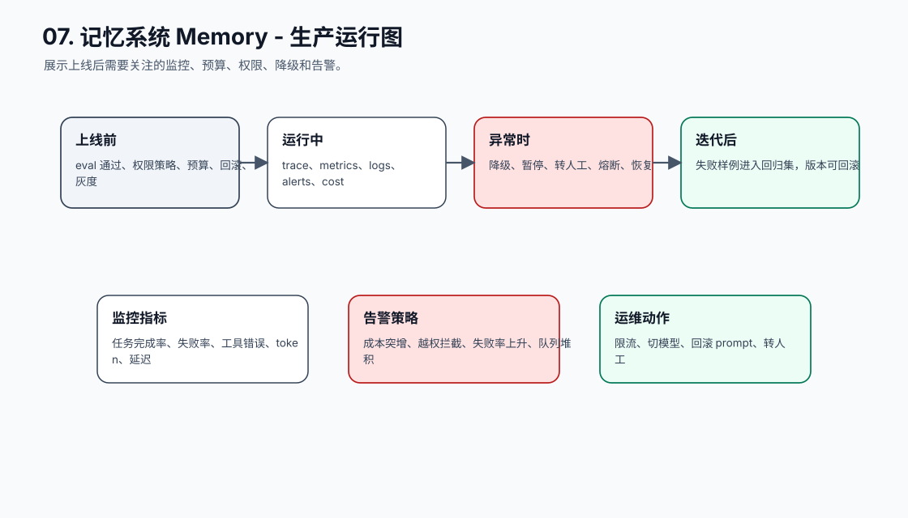
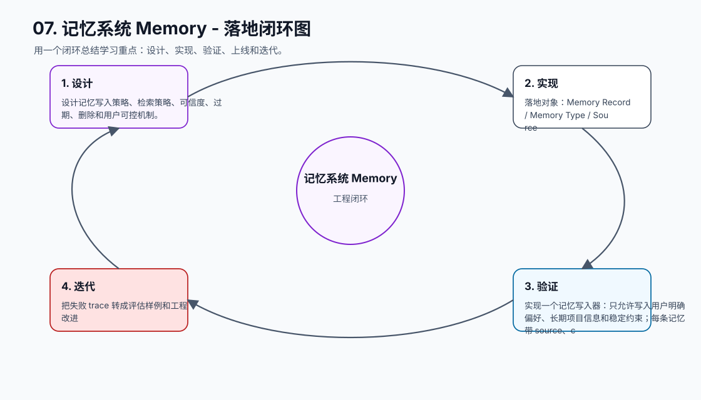

# 07. 记忆系统 Memory

[返回课程目录](README.md)

## 本课定位

建立短期、长期、工作记忆和外部知识的边界，让 Agent 在跨会话任务中保留有价值信息，同时避免污染上下文。

记忆如果无差别写入和注入，会把错误、过期、敏感或低价值信息带进后续任务，造成更隐蔽的失败。

本课的目标是：设计记忆写入策略、检索策略、可信度、过期、删除和用户可控机制。

核心公式：`Memory 不是更长聊天记录，而是经过筛选、标注、可撤销、可追溯的长期上下文资产。`

## 学习目标

- 能解释本课模块解决 Agent 系统里的哪个缺口。
- 能画出本课模块在完整 Agent Runtime 中的位置。
- 能把关键对象、接口、状态和错误路径写成可执行设计。
- 能识别工程中常见失败模式，并给出可落地的兜底方案。
- 能用 trace、评估样例和验收标准证明方案有效。

## 小节拆解

| 小节 | 先回答的问题 | 必须讲透的知识点 | 工程落地要求 | 练习 |
| --- | --- | --- | --- | --- |
| 7.1 记忆类型 | 短期、长期、工作、外部记忆怎么分 | 生命周期、可信度、使用场景 | 对象、接口、状态和错误路径都要能落到代码 | 给 20 条信息分类 |
| 7.2 写入策略 | 什么值得记 | 稳定偏好、长期事实、明确用户授权 | 对象、接口、状态和错误路径都要能落到代码 | 设计 write policy |
| 7.3 检索策略 | 什么时候取哪些记忆 | 任务相关性、时间、来源、可信度 | 对象、接口、状态和错误路径都要能落到代码 | 实现 memory retrieval |
| 7.4 更新和删除 | 记忆如何纠错 | 版本、覆盖、过期、用户删除 | 对象、接口、状态和错误路径都要能落到代码 | 处理过期偏好 |
| 7.5 隐私安全 | 敏感信息怎么处理 | 最小化、加密、访问控制、审计 | 对象、接口、状态和错误路径都要能落到代码 | 设计敏感信息规则 |

## 知识点深拆

### 7.1 记忆类型
这一小节先回答：短期、长期、工作、外部记忆怎么分。不要从框架名词开始，而要从任务系统缺什么开始理解。对工程团队来说，生命周期、可信度、使用场景 不是概念装饰，而是决定系统能不能被测试、恢复和上线的边界。
落地时先写清输入、输出、状态变化和失败路径。输入要能被 schema 或类型系统描述，输出要能被下游程序校验，状态变化要能进入 trace，失败路径要能转成明确的 stop reason、retry policy 或 human review。
练习：给 20 条信息分类。验收时不要只看模型回答是否自然，要检查 trace 里是否出现正确决策、是否遵守权限和预算、是否在证据不足时选择澄清或拒绝。
### 7.2 写入策略
这一小节先回答：什么值得记。不要从框架名词开始，而要从任务系统缺什么开始理解。对工程团队来说，稳定偏好、长期事实、明确用户授权 不是概念装饰，而是决定系统能不能被测试、恢复和上线的边界。
落地时先写清输入、输出、状态变化和失败路径。输入要能被 schema 或类型系统描述，输出要能被下游程序校验，状态变化要能进入 trace，失败路径要能转成明确的 stop reason、retry policy 或 human review。
练习：设计 write policy。验收时不要只看模型回答是否自然，要检查 trace 里是否出现正确决策、是否遵守权限和预算、是否在证据不足时选择澄清或拒绝。
### 7.3 检索策略
这一小节先回答：什么时候取哪些记忆。不要从框架名词开始，而要从任务系统缺什么开始理解。对工程团队来说，任务相关性、时间、来源、可信度 不是概念装饰，而是决定系统能不能被测试、恢复和上线的边界。
落地时先写清输入、输出、状态变化和失败路径。输入要能被 schema 或类型系统描述，输出要能被下游程序校验，状态变化要能进入 trace，失败路径要能转成明确的 stop reason、retry policy 或 human review。
练习：实现 memory retrieval。验收时不要只看模型回答是否自然，要检查 trace 里是否出现正确决策、是否遵守权限和预算、是否在证据不足时选择澄清或拒绝。
### 7.4 更新和删除
这一小节先回答：记忆如何纠错。不要从框架名词开始，而要从任务系统缺什么开始理解。对工程团队来说，版本、覆盖、过期、用户删除 不是概念装饰，而是决定系统能不能被测试、恢复和上线的边界。
落地时先写清输入、输出、状态变化和失败路径。输入要能被 schema 或类型系统描述，输出要能被下游程序校验，状态变化要能进入 trace，失败路径要能转成明确的 stop reason、retry policy 或 human review。
练习：处理过期偏好。验收时不要只看模型回答是否自然，要检查 trace 里是否出现正确决策、是否遵守权限和预算、是否在证据不足时选择澄清或拒绝。
### 7.5 隐私安全
这一小节先回答：敏感信息怎么处理。不要从框架名词开始，而要从任务系统缺什么开始理解。对工程团队来说，最小化、加密、访问控制、审计 不是概念装饰，而是决定系统能不能被测试、恢复和上线的边界。
落地时先写清输入、输出、状态变化和失败路径。输入要能被 schema 或类型系统描述，输出要能被下游程序校验，状态变化要能进入 trace，失败路径要能转成明确的 stop reason、retry policy 或 human review。
练习：设计敏感信息规则。验收时不要只看模型回答是否自然，要检查 trace 里是否出现正确决策、是否遵守权限和预算、是否在证据不足时选择澄清或拒绝。

## 核心工程对象

| 对象 | 它解决什么 | 落地要求 |
| --- | --- | --- |
| Memory Record | Memory Record 是本课需要落地的工程对象，不应该只停留在 Prompt 文本里。 | 有结构、有版本、有校验、有 trace 记录 |
| Memory Type | Memory Type 是本课需要落地的工程对象，不应该只停留在 Prompt 文本里。 | 有结构、有版本、有校验、有 trace 记录 |
| Source | Source 是本课需要落地的工程对象，不应该只停留在 Prompt 文本里。 | 有结构、有版本、有校验、有 trace 记录 |
| Confidence | Confidence 是本课需要落地的工程对象，不应该只停留在 Prompt 文本里。 | 有结构、有版本、有校验、有 trace 记录 |
| TTL | TTL 是本课需要落地的工程对象，不应该只停留在 Prompt 文本里。 | 有结构、有版本、有校验、有 trace 记录 |
| Retrieval Policy | Retrieval Policy 是本课需要落地的工程对象，不应该只停留在 Prompt 文本里。 | 有结构、有版本、有校验、有 trace 记录 |
| Write Policy | Write Policy 是本课需要落地的工程对象，不应该只停留在 Prompt 文本里。 | 有结构、有版本、有校验、有 trace 记录 |
| Deletion Policy | Deletion Policy 是本课需要落地的工程对象，不应该只停留在 Prompt 文本里。 | 有结构、有版本、有校验、有 trace 记录 |

## 本课图谱：10 张图讲清楚

下面 10 张图对应本课从宏观定位到生产落地的完整拆解。读图顺序固定为：系统位置、执行流程、责任边界、核心对象、决策控制、风险兜底、状态证据、验收评估、生产运行、落地闭环。

**图 07-1：记忆系统 Memory - 系统位置图**  

**图 07-2：记忆系统 Memory - 执行流程图**  

**图 07-3：记忆系统 Memory - 责任边界图**  

**图 07-4：记忆系统 Memory - 核心对象图**  

**图 07-5：记忆系统 Memory - 决策控制图**  

**图 07-6：记忆系统 Memory - 风险与兜底图**  

**图 07-7：记忆系统 Memory - 状态与证据图**  

**图 07-8：记忆系统 Memory - 验收评估图**  

**图 07-9：记忆系统 Memory - 生产运行图**  

**图 07-10：记忆系统 Memory - 落地闭环图**  

## 工程踩坑与处理方式

| 工程坑 | 典型表现 | 解决方式 | 为什么这么做 |
| --- | --- | --- | --- |
| 自动记住一切 | 短期闲聊变成长久偏好 | 只写稳定、明确、可复用的信息 | 降低污染和隐私风险 |
| 记忆无来源 | 不知道谁在何时说过 | 记录 source、timestamp、confidence | 可追溯才能纠错 |
| 过期信息长期生效 | 用户改了职位仍用旧信息 | TTL、版本和更新策略 | 记忆必须能衰减和覆盖 |
| 全量注入记忆 | 每次调用都塞所有记忆 | 按任务检索和压缩后注入 | 减少 token 噪声和冲突 |
| 敏感信息明文长期存储 | 泄露风险扩大 | 最小化存储、加密、权限和删除 | 记忆系统是数据资产 |
| 记忆当状态用 | 任务进度写入长期记忆 | 任务进度放 State，跨任务经验放 Memory | 生命周期不同，错误影响范围不同 |
| 用户不可控 | 用户无法查看或删除记忆 | 提供查看、编辑、删除入口 | 增强信任并满足合规要求 |
| 召回后不标注可信度 | 模型把低可信记忆当事实 | 注入时带来源和置信度 | 让模型和 verifier 能判断风险 |

## 最小实现闭环

实现一个记忆写入器：只允许写入用户明确偏好、长期项目信息和稳定约束；每条记忆带 source、confidence、ttl，并支持删除。

建议验收方式：

- 至少准备 5 条正常样例、5 条边界样例、3 条失败样例。
- 每条样例都保存输入、模型决策、工具调用、状态变化、最终输出和错误信息。
- 能用程序断言的地方不要只靠人工阅读，例如 schema、状态字段、错误码、引用 id、权限结果和停止原因。
- 修改 prompt、工具 schema、模型参数或状态结构后，必须跑回归样例。

## 章节总结

记忆的目标不是让 Agent “什么都记得”，而是让它在合适时看见可靠、相关、可追溯的信息。记忆越克制，系统越稳定。

学完这一课后，应能把它放回完整 Agent 链路里：它接收什么输入，改变什么状态，调用什么能力，产生什么证据，失败时如何停止或恢复，以及上线后如何观测和评估。
