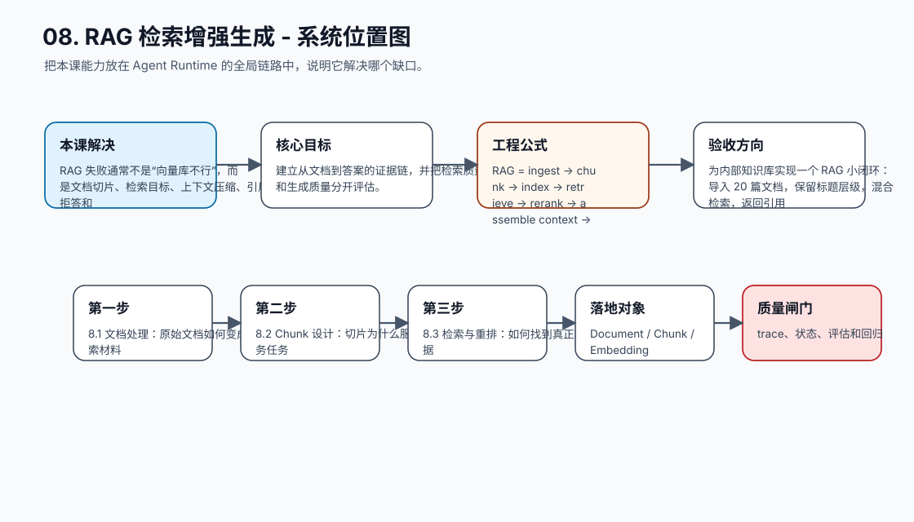
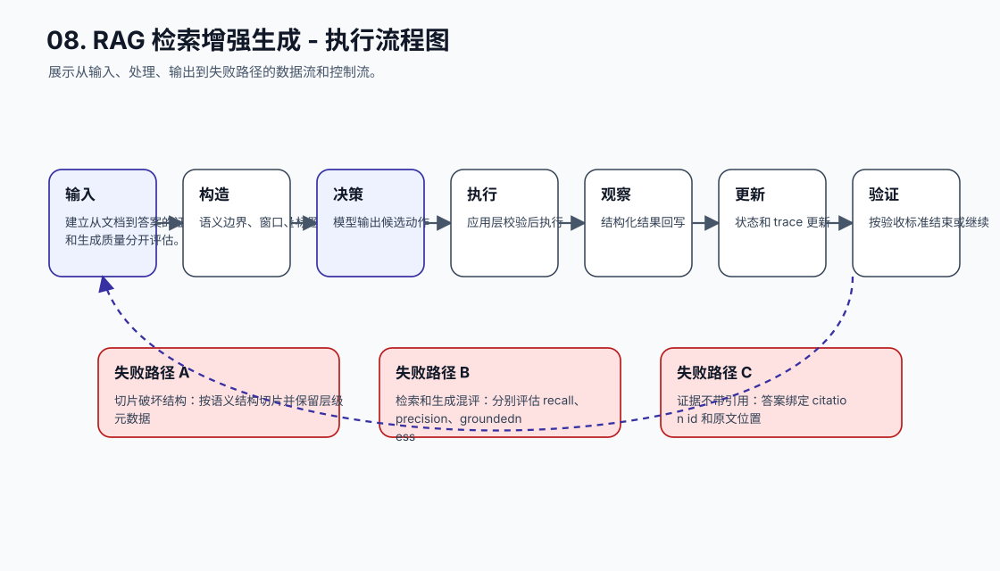
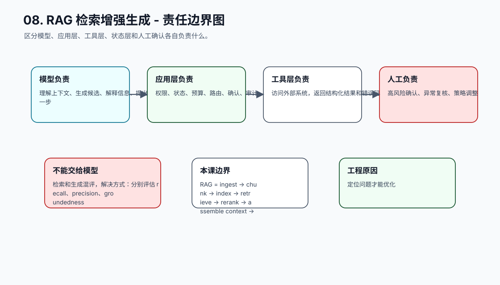
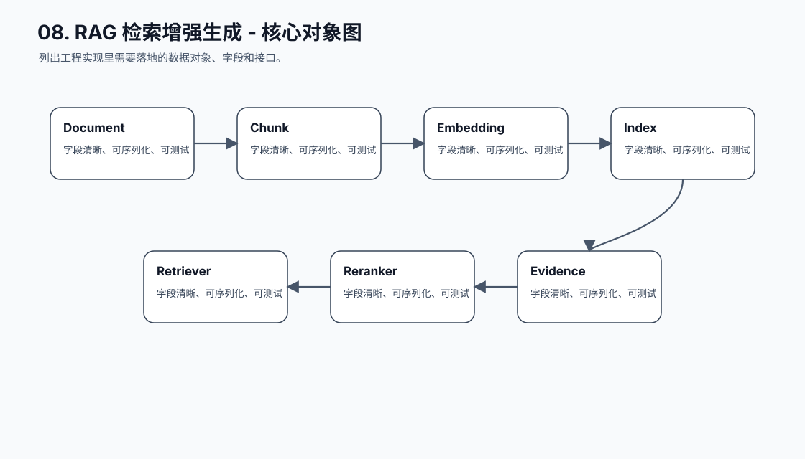
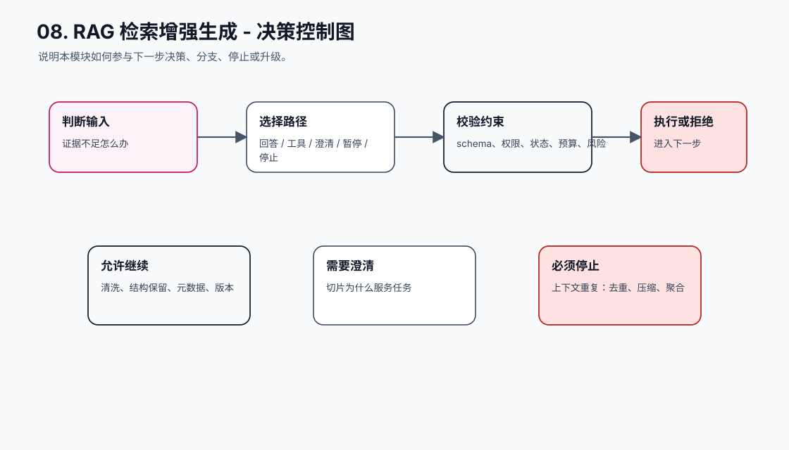
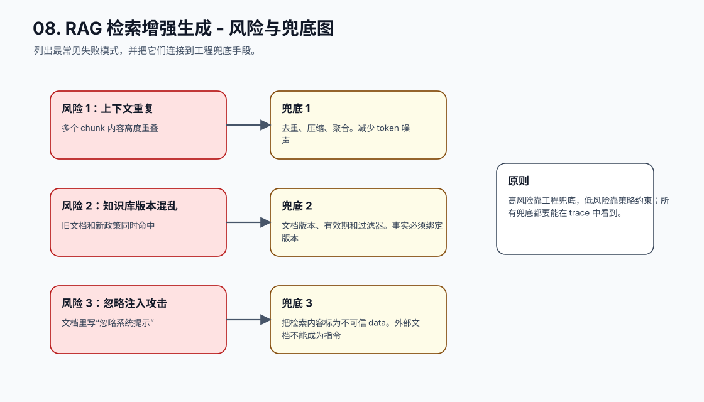
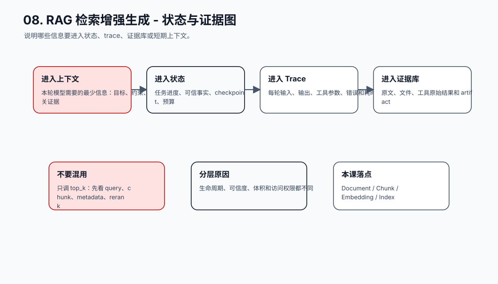
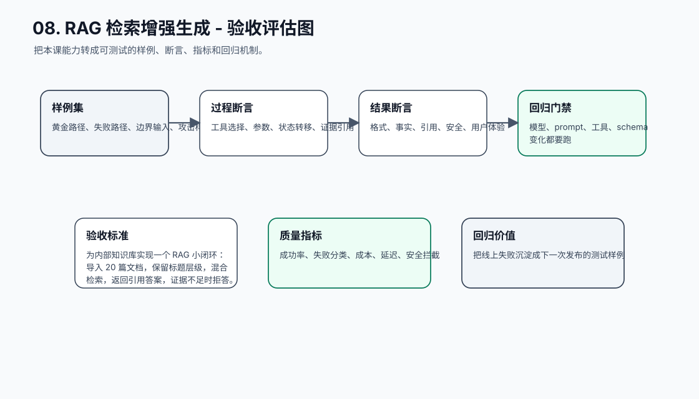
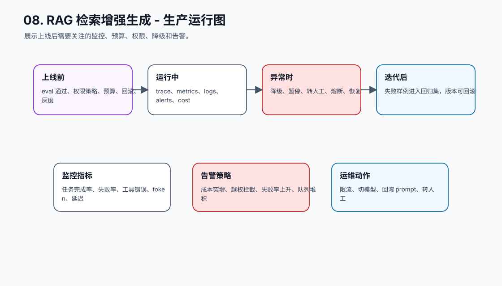
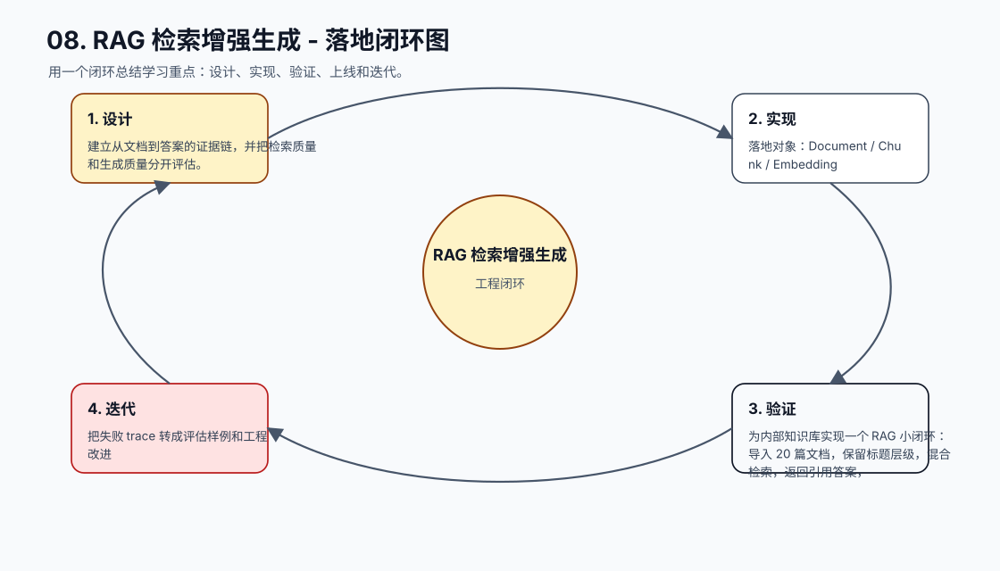

# 08. RAG 检索增强生成

[返回课程目录](README.md)

## 本课定位

用检索、重排、证据引用和拒答策略补足模型事实边界，让 Agent 能围绕外部知识做可追溯回答。

RAG 失败通常不是“向量库不行”，而是文档切片、检索目标、上下文压缩、引用、拒答和评估没有一起设计。

本课的目标是：建立从文档到答案的证据链，并把检索质量和生成质量分开评估。

核心公式：`RAG = ingest -> chunk -> index -> retrieve -> rerank -> assemble context -> generate with citations -> verify。`

## 学习目标

- 能解释本课模块解决 Agent 系统里的哪个缺口。
- 能画出本课模块在完整 Agent Runtime 中的位置。
- 能把关键对象、接口、状态和错误路径写成可执行设计。
- 能识别工程中常见失败模式，并给出可落地的兜底方案。
- 能用 trace、评估样例和验收标准证明方案有效。

## 小节拆解

| 小节 | 先回答的问题 | 必须讲透的知识点 | 工程落地要求 | 练习 |
| --- | --- | --- | --- | --- |
| 8.1 文档处理 | 原始文档如何变成可检索材料 | 清洗、结构保留、元数据、版本 | 对象、接口、状态和错误路径都要能落到代码 | 处理一批 FAQ |
| 8.2 Chunk 设计 | 切片为什么服务任务 | 语义边界、窗口、标题、重叠 | 对象、接口、状态和错误路径都要能落到代码 | 比较两种切片 |
| 8.3 检索与重排 | 如何找到真正相关证据 | 召回、精排、过滤、混合检索 | 对象、接口、状态和错误路径都要能落到代码 | 调试召回结果 |
| 8.4 上下文组装 | 证据如何进入模型 | 去重、压缩、引用、优先级 | 对象、接口、状态和错误路径都要能落到代码 | 构造 evidence pack |
| 8.5 拒答与验证 | 证据不足怎么办 | 空检索、低置信、矛盾证据、引用检查 | 对象、接口、状态和错误路径都要能落到代码 | 实现拒答策略 |

## 知识点深拆

### 8.1 文档处理
这一小节先回答：原始文档如何变成可检索材料。不要从框架名词开始，而要从任务系统缺什么开始理解。对工程团队来说，清洗、结构保留、元数据、版本 不是概念装饰，而是决定系统能不能被测试、恢复和上线的边界。
落地时先写清输入、输出、状态变化和失败路径。输入要能被 schema 或类型系统描述，输出要能被下游程序校验，状态变化要能进入 trace，失败路径要能转成明确的 stop reason、retry policy 或 human review。
练习：处理一批 FAQ。验收时不要只看模型回答是否自然，要检查 trace 里是否出现正确决策、是否遵守权限和预算、是否在证据不足时选择澄清或拒绝。
### 8.2 Chunk 设计
这一小节先回答：切片为什么服务任务。不要从框架名词开始，而要从任务系统缺什么开始理解。对工程团队来说，语义边界、窗口、标题、重叠 不是概念装饰，而是决定系统能不能被测试、恢复和上线的边界。
落地时先写清输入、输出、状态变化和失败路径。输入要能被 schema 或类型系统描述，输出要能被下游程序校验，状态变化要能进入 trace，失败路径要能转成明确的 stop reason、retry policy 或 human review。
练习：比较两种切片。验收时不要只看模型回答是否自然，要检查 trace 里是否出现正确决策、是否遵守权限和预算、是否在证据不足时选择澄清或拒绝。
### 8.3 检索与重排
这一小节先回答：如何找到真正相关证据。不要从框架名词开始，而要从任务系统缺什么开始理解。对工程团队来说，召回、精排、过滤、混合检索 不是概念装饰，而是决定系统能不能被测试、恢复和上线的边界。
落地时先写清输入、输出、状态变化和失败路径。输入要能被 schema 或类型系统描述，输出要能被下游程序校验，状态变化要能进入 trace，失败路径要能转成明确的 stop reason、retry policy 或 human review。
练习：调试召回结果。验收时不要只看模型回答是否自然，要检查 trace 里是否出现正确决策、是否遵守权限和预算、是否在证据不足时选择澄清或拒绝。
### 8.4 上下文组装
这一小节先回答：证据如何进入模型。不要从框架名词开始，而要从任务系统缺什么开始理解。对工程团队来说，去重、压缩、引用、优先级 不是概念装饰，而是决定系统能不能被测试、恢复和上线的边界。
落地时先写清输入、输出、状态变化和失败路径。输入要能被 schema 或类型系统描述，输出要能被下游程序校验，状态变化要能进入 trace，失败路径要能转成明确的 stop reason、retry policy 或 human review。
练习：构造 evidence pack。验收时不要只看模型回答是否自然，要检查 trace 里是否出现正确决策、是否遵守权限和预算、是否在证据不足时选择澄清或拒绝。
### 8.5 拒答与验证
这一小节先回答：证据不足怎么办。不要从框架名词开始，而要从任务系统缺什么开始理解。对工程团队来说，空检索、低置信、矛盾证据、引用检查 不是概念装饰，而是决定系统能不能被测试、恢复和上线的边界。
落地时先写清输入、输出、状态变化和失败路径。输入要能被 schema 或类型系统描述，输出要能被下游程序校验，状态变化要能进入 trace，失败路径要能转成明确的 stop reason、retry policy 或 human review。
练习：实现拒答策略。验收时不要只看模型回答是否自然，要检查 trace 里是否出现正确决策、是否遵守权限和预算、是否在证据不足时选择澄清或拒绝。

## 核心工程对象

| 对象 | 它解决什么 | 落地要求 |
| --- | --- | --- |
| Document | Document 是本课需要落地的工程对象，不应该只停留在 Prompt 文本里。 | 有结构、有版本、有校验、有 trace 记录 |
| Chunk | Chunk 是本课需要落地的工程对象，不应该只停留在 Prompt 文本里。 | 有结构、有版本、有校验、有 trace 记录 |
| Embedding | Embedding 是本课需要落地的工程对象，不应该只停留在 Prompt 文本里。 | 有结构、有版本、有校验、有 trace 记录 |
| Index | Index 是本课需要落地的工程对象，不应该只停留在 Prompt 文本里。 | 有结构、有版本、有校验、有 trace 记录 |
| Retriever | Retriever 是本课需要落地的工程对象，不应该只停留在 Prompt 文本里。 | 有结构、有版本、有校验、有 trace 记录 |
| Reranker | Reranker 是本课需要落地的工程对象，不应该只停留在 Prompt 文本里。 | 有结构、有版本、有校验、有 trace 记录 |
| Evidence | Evidence 是本课需要落地的工程对象，不应该只停留在 Prompt 文本里。 | 有结构、有版本、有校验、有 trace 记录 |
| Citation | Citation 是本课需要落地的工程对象，不应该只停留在 Prompt 文本里。 | 有结构、有版本、有校验、有 trace 记录 |
| Empty Retrieval Policy | Empty Retrieval Policy 是本课需要落地的工程对象，不应该只停留在 Prompt 文本里。 | 有结构、有版本、有校验、有 trace 记录 |

## 本课图谱：10 张图讲清楚

下面 10 张图对应本课从宏观定位到生产落地的完整拆解。读图顺序固定为：系统位置、执行流程、责任边界、核心对象、决策控制、风险兜底、状态证据、验收评估、生产运行、落地闭环。

**图 08-1：RAG 检索增强生成 - 系统位置图**  

**图 08-2：RAG 检索增强生成 - 执行流程图**  

**图 08-3：RAG 检索增强生成 - 责任边界图**  

**图 08-4：RAG 检索增强生成 - 核心对象图**  

**图 08-5：RAG 检索增强生成 - 决策控制图**  

**图 08-6：RAG 检索增强生成 - 风险与兜底图**  

**图 08-7：RAG 检索增强生成 - 状态与证据图**  

**图 08-8：RAG 检索增强生成 - 验收评估图**  

**图 08-9：RAG 检索增强生成 - 生产运行图**  

**图 08-10：RAG 检索增强生成 - 落地闭环图**  

## 工程踩坑与处理方式

| 工程坑 | 典型表现 | 解决方式 | 为什么这么做 |
| --- | --- | --- | --- |
| 只调 top_k | 问题没变只改检索数量 | 先看 query、chunk、metadata、rerank | RAG 是链路问题，不是单参数问题 |
| 切片破坏结构 | 表格、标题、步骤被切碎 | 按语义结构切片并保留层级元数据 | 生成需要上下文关系 |
| 检索和生成混评 | 答案错了不知道是没检到还是没用好 | 分别评估 recall、precision、groundedness | 定位问题才能优化 |
| 证据不带引用 | 用户无法核对来源 | 答案绑定 citation id 和原文位置 | 可追溯是 RAG 的核心价值 |
| 空检索仍回答 | 模型用常识补全企业事实 | 设置 empty retrieval policy | 证据不足要澄清或拒答 |
| 上下文重复 | 多个 chunk 内容高度重叠 | 去重、压缩、聚合 | 减少 token 噪声 |
| 知识库版本混乱 | 旧文档和新政策同时命中 | 文档版本、有效期和过滤器 | 事实必须绑定版本 |
| 忽略注入攻击 | 文档里写“忽略系统提示” | 把检索内容标为不可信 data | 外部文档不能成为指令 |

## 最小实现闭环

为内部知识库实现一个 RAG 小闭环：导入 20 篇文档，保留标题层级，混合检索，返回引用答案，证据不足时拒答。

建议验收方式：

- 至少准备 5 条正常样例、5 条边界样例、3 条失败样例。
- 每条样例都保存输入、模型决策、工具调用、状态变化、最终输出和错误信息。
- 能用程序断言的地方不要只靠人工阅读，例如 schema、状态字段、错误码、引用 id、权限结果和停止原因。
- 修改 prompt、工具 schema、模型参数或状态结构后，必须跑回归样例。

## 章节总结

RAG 的本质是把“模型知道什么”改成“系统能提供哪些证据”。只有证据链可追溯，Agent 才能在事实任务中可靠。

学完这一课后，应能把它放回完整 Agent 链路里：它接收什么输入，改变什么状态，调用什么能力，产生什么证据，失败时如何停止或恢复，以及上线后如何观测和评估。
