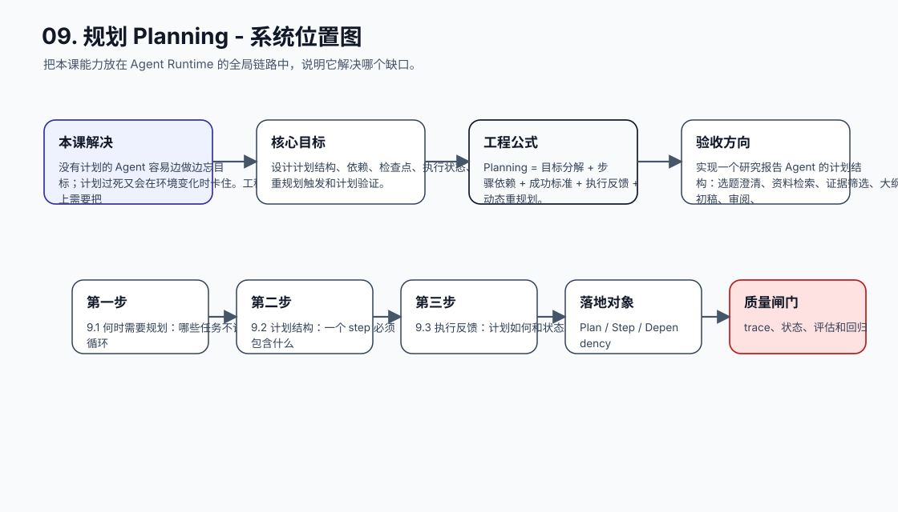
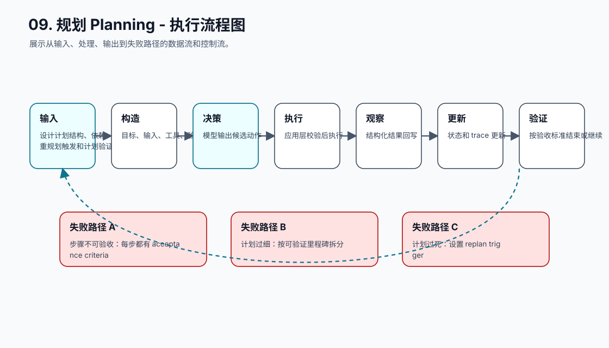
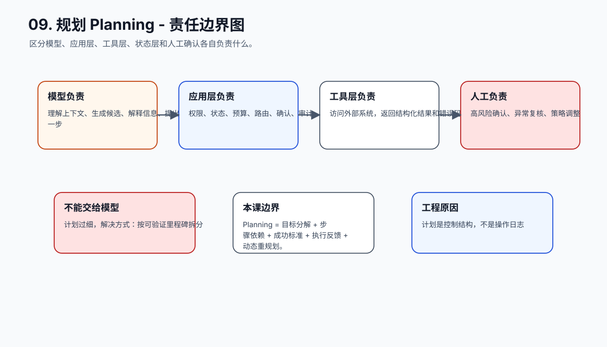
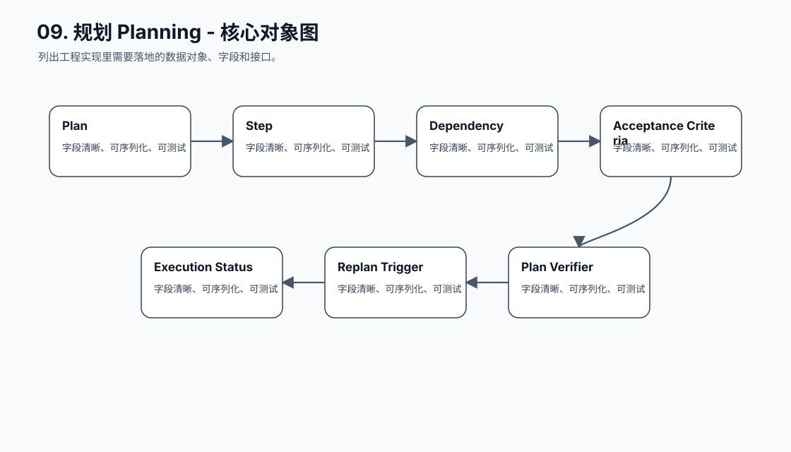
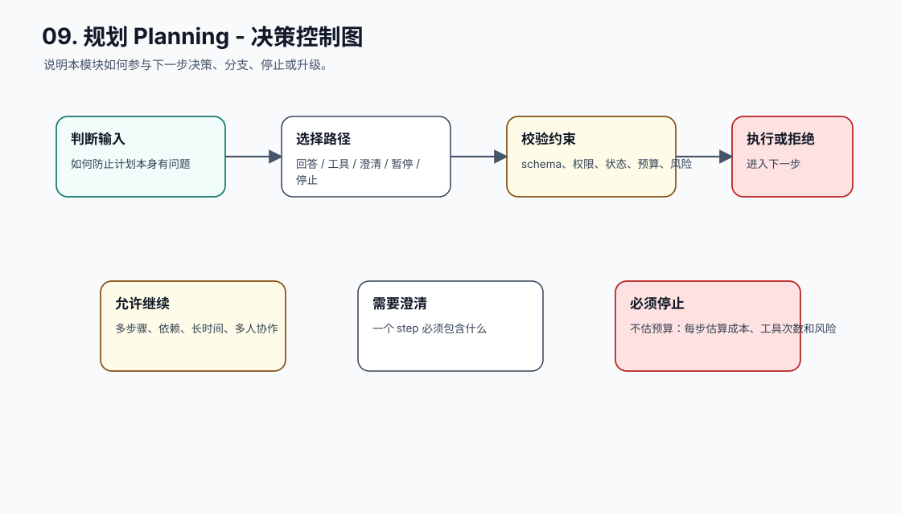
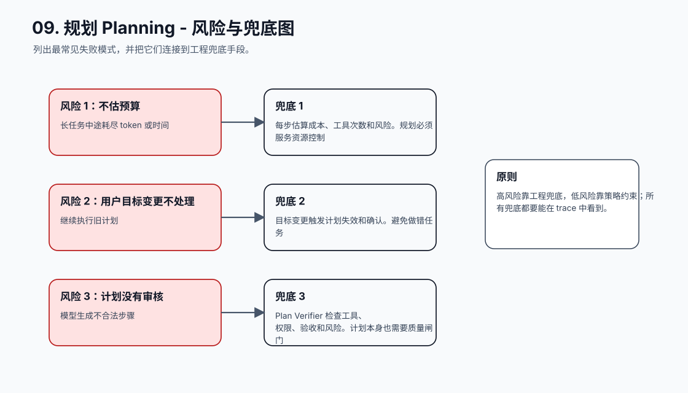
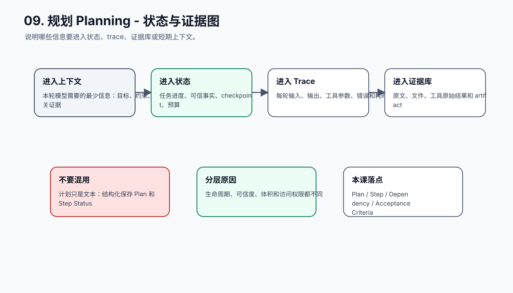
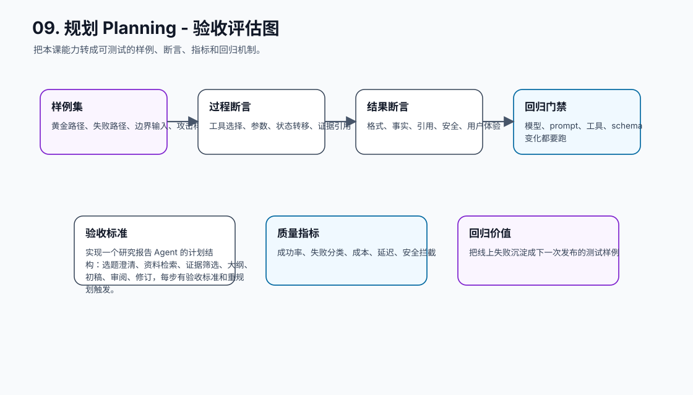
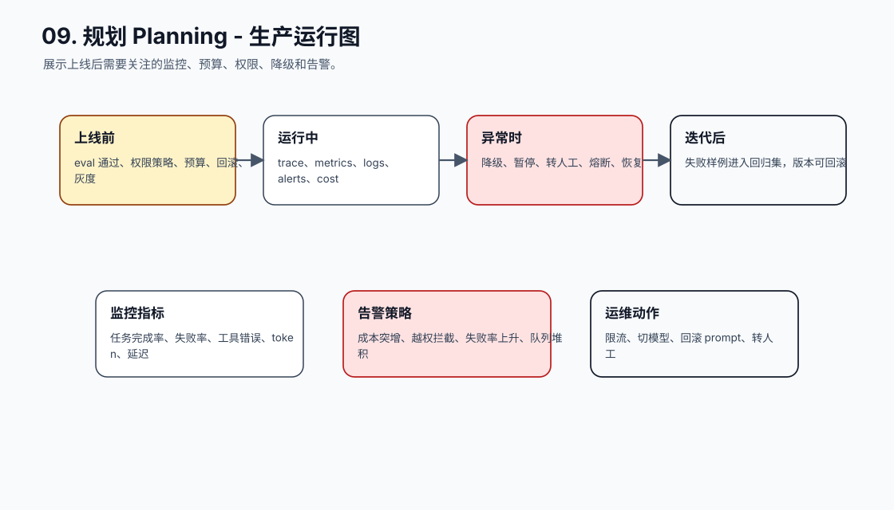
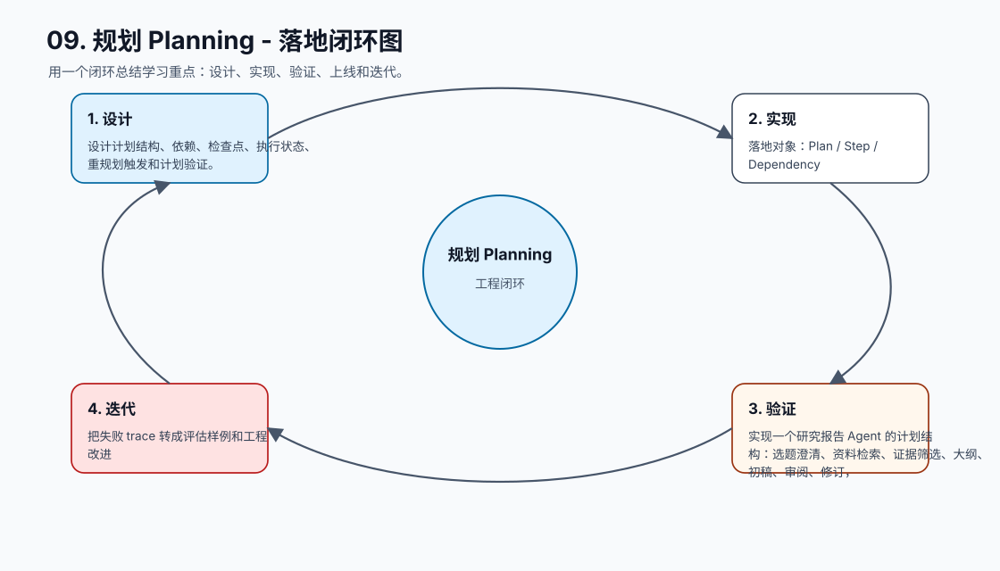

# 09. 规划 Planning

[返回课程目录](README.md)

## 本课定位

把复杂目标拆成可执行、可验证、可更新的计划，让 Agent 在长任务中有方向、有检查点、有重规划机制。

没有计划的 Agent 容易边做边忘目标；计划过死又会在环境变化时卡住。工程上需要把计划作为状态对象而不是一段自然语言。

本课的目标是：设计计划结构、依赖、检查点、执行状态、重规划触发和计划验证。

核心公式：`Planning = 目标分解 + 步骤依赖 + 成功标准 + 执行反馈 + 动态重规划。`

## 学习目标

- 能解释本课模块解决 Agent 系统里的哪个缺口。
- 能画出本课模块在完整 Agent Runtime 中的位置。
- 能把关键对象、接口、状态和错误路径写成可执行设计。
- 能识别工程中常见失败模式，并给出可落地的兜底方案。
- 能用 trace、评估样例和验收标准证明方案有效。

## 小节拆解

| 小节 | 先回答的问题 | 必须讲透的知识点 | 工程落地要求 | 练习 |
| --- | --- | --- | --- | --- |
| 9.1 何时需要规划 | 哪些任务不该直接循环 | 多步骤、依赖、长时间、多人协作 | 对象、接口、状态和错误路径都要能落到代码 | 给需求判断是否需要计划 |
| 9.2 计划结构 | 一个 step 必须包含什么 | 目标、输入、工具、验收、风险、依赖 | 对象、接口、状态和错误路径都要能落到代码 | 设计 Plan JSON |
| 9.3 执行反馈 | 计划如何和状态联动 | step status、evidence、errors、artifacts | 对象、接口、状态和错误路径都要能落到代码 | 更新计划状态 |
| 9.4 重规划 | 什么时候调整路线 | 阻塞、证据冲突、预算变化、用户改目标 | 对象、接口、状态和错误路径都要能落到代码 | 写 replan 条件 |
| 9.5 计划验证 | 如何防止计划本身有问题 | 可执行性、依赖、风险、缺口检查 | 对象、接口、状态和错误路径都要能落到代码 | 审核一个坏计划 |

## 知识点深拆

### 9.1 何时需要规划
这一小节先回答：哪些任务不该直接循环。不要从框架名词开始，而要从任务系统缺什么开始理解。对工程团队来说，多步骤、依赖、长时间、多人协作 不是概念装饰，而是决定系统能不能被测试、恢复和上线的边界。
落地时先写清输入、输出、状态变化和失败路径。输入要能被 schema 或类型系统描述，输出要能被下游程序校验，状态变化要能进入 trace，失败路径要能转成明确的 stop reason、retry policy 或 human review。
练习：给需求判断是否需要计划。验收时不要只看模型回答是否自然，要检查 trace 里是否出现正确决策、是否遵守权限和预算、是否在证据不足时选择澄清或拒绝。
### 9.2 计划结构
这一小节先回答：一个 step 必须包含什么。不要从框架名词开始，而要从任务系统缺什么开始理解。对工程团队来说，目标、输入、工具、验收、风险、依赖 不是概念装饰，而是决定系统能不能被测试、恢复和上线的边界。
落地时先写清输入、输出、状态变化和失败路径。输入要能被 schema 或类型系统描述，输出要能被下游程序校验，状态变化要能进入 trace，失败路径要能转成明确的 stop reason、retry policy 或 human review。
练习：设计 Plan JSON。验收时不要只看模型回答是否自然，要检查 trace 里是否出现正确决策、是否遵守权限和预算、是否在证据不足时选择澄清或拒绝。
### 9.3 执行反馈
这一小节先回答：计划如何和状态联动。不要从框架名词开始，而要从任务系统缺什么开始理解。对工程团队来说，step status、evidence、errors、artifacts 不是概念装饰，而是决定系统能不能被测试、恢复和上线的边界。
落地时先写清输入、输出、状态变化和失败路径。输入要能被 schema 或类型系统描述，输出要能被下游程序校验，状态变化要能进入 trace，失败路径要能转成明确的 stop reason、retry policy 或 human review。
练习：更新计划状态。验收时不要只看模型回答是否自然，要检查 trace 里是否出现正确决策、是否遵守权限和预算、是否在证据不足时选择澄清或拒绝。
### 9.4 重规划
这一小节先回答：什么时候调整路线。不要从框架名词开始，而要从任务系统缺什么开始理解。对工程团队来说，阻塞、证据冲突、预算变化、用户改目标 不是概念装饰，而是决定系统能不能被测试、恢复和上线的边界。
落地时先写清输入、输出、状态变化和失败路径。输入要能被 schema 或类型系统描述，输出要能被下游程序校验，状态变化要能进入 trace，失败路径要能转成明确的 stop reason、retry policy 或 human review。
练习：写 replan 条件。验收时不要只看模型回答是否自然，要检查 trace 里是否出现正确决策、是否遵守权限和预算、是否在证据不足时选择澄清或拒绝。
### 9.5 计划验证
这一小节先回答：如何防止计划本身有问题。不要从框架名词开始，而要从任务系统缺什么开始理解。对工程团队来说，可执行性、依赖、风险、缺口检查 不是概念装饰，而是决定系统能不能被测试、恢复和上线的边界。
落地时先写清输入、输出、状态变化和失败路径。输入要能被 schema 或类型系统描述，输出要能被下游程序校验，状态变化要能进入 trace，失败路径要能转成明确的 stop reason、retry policy 或 human review。
练习：审核一个坏计划。验收时不要只看模型回答是否自然，要检查 trace 里是否出现正确决策、是否遵守权限和预算、是否在证据不足时选择澄清或拒绝。

## 核心工程对象

| 对象 | 它解决什么 | 落地要求 |
| --- | --- | --- |
| Plan | Plan 是本课需要落地的工程对象，不应该只停留在 Prompt 文本里。 | 有结构、有版本、有校验、有 trace 记录 |
| Step | Step 是本课需要落地的工程对象，不应该只停留在 Prompt 文本里。 | 有结构、有版本、有校验、有 trace 记录 |
| Dependency | Dependency 是本课需要落地的工程对象，不应该只停留在 Prompt 文本里。 | 有结构、有版本、有校验、有 trace 记录 |
| Acceptance Criteria | Acceptance Criteria 是本课需要落地的工程对象，不应该只停留在 Prompt 文本里。 | 有结构、有版本、有校验、有 trace 记录 |
| Execution Status | Execution Status 是本课需要落地的工程对象，不应该只停留在 Prompt 文本里。 | 有结构、有版本、有校验、有 trace 记录 |
| Replan Trigger | Replan Trigger 是本课需要落地的工程对象，不应该只停留在 Prompt 文本里。 | 有结构、有版本、有校验、有 trace 记录 |
| Plan Verifier | Plan Verifier 是本课需要落地的工程对象，不应该只停留在 Prompt 文本里。 | 有结构、有版本、有校验、有 trace 记录 |

## 本课图谱：10 张图讲清楚

下面 10 张图对应本课从宏观定位到生产落地的完整拆解。读图顺序固定为：系统位置、执行流程、责任边界、核心对象、决策控制、风险兜底、状态证据、验收评估、生产运行、落地闭环。

**图 09-1：规划 Planning - 系统位置图**  

**图 09-2：规划 Planning - 执行流程图**  

**图 09-3：规划 Planning - 责任边界图**  

**图 09-4：规划 Planning - 核心对象图**  

**图 09-5：规划 Planning - 决策控制图**  

**图 09-6：规划 Planning - 风险与兜底图**  

**图 09-7：规划 Planning - 状态与证据图**  

**图 09-8：规划 Planning - 验收评估图**  

**图 09-9：规划 Planning - 生产运行图**  

**图 09-10：规划 Planning - 落地闭环图**  

## 工程踩坑与处理方式

| 工程坑 | 典型表现 | 解决方式 | 为什么这么做 |
| --- | --- | --- | --- |
| 计划只是文本 | 无法知道哪一步完成 | 结构化保存 Plan 和 Step Status | 计划需要被程序更新和验证 |
| 步骤不可验收 | 写“优化系统”但无标准 | 每步都有 acceptance criteria | 无法验收就无法推进 |
| 计划过细 | 几十个微步骤增加上下文负担 | 按可验证里程碑拆分 | 计划是控制结构，不是操作日志 |
| 计划过死 | 遇到工具失败仍按原计划走 | 设置 replan trigger | 环境变化必须反馈到计划 |
| 忽略依赖 | 后置步骤先执行 | 显式 dependency 和 guard | 防止乱序副作用 |
| 不估预算 | 长任务中途耗尽 token 或时间 | 每步估算成本、工具次数和风险 | 规划必须服务资源控制 |
| 用户目标变更不处理 | 继续执行旧计划 | 目标变更触发计划失效和确认 | 避免做错任务 |
| 计划没有审核 | 模型生成不合法步骤 | Plan Verifier 检查工具、权限、验收和风险 | 计划本身也需要质量闸门 |

## 最小实现闭环

实现一个研究报告 Agent 的计划结构：选题澄清、资料检索、证据筛选、大纲、初稿、审阅、修订，每步有验收标准和重规划触发。

建议验收方式：

- 至少准备 5 条正常样例、5 条边界样例、3 条失败样例。
- 每条样例都保存输入、模型决策、工具调用、状态变化、最终输出和错误信息。
- 能用程序断言的地方不要只靠人工阅读，例如 schema、状态字段、错误码、引用 id、权限结果和停止原因。
- 修改 prompt、工具 schema、模型参数或状态结构后，必须跑回归样例。

## 章节总结

规划让 Agent 从“下一步反应”升级为“面向目标推进”。计划不是一次性生成后放着，而是和状态、证据、预算一起动态更新。

学完这一课后，应能把它放回完整 Agent 链路里：它接收什么输入，改变什么状态，调用什么能力，产生什么证据，失败时如何停止或恢复，以及上线后如何观测和评估。
