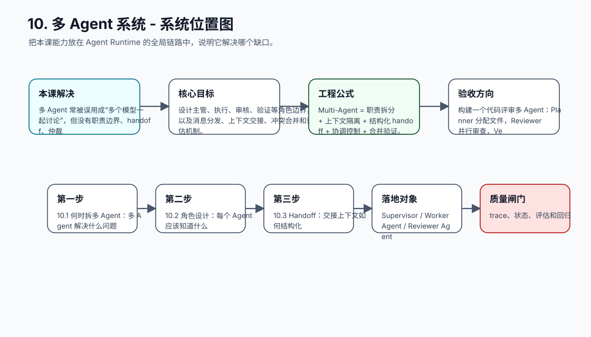
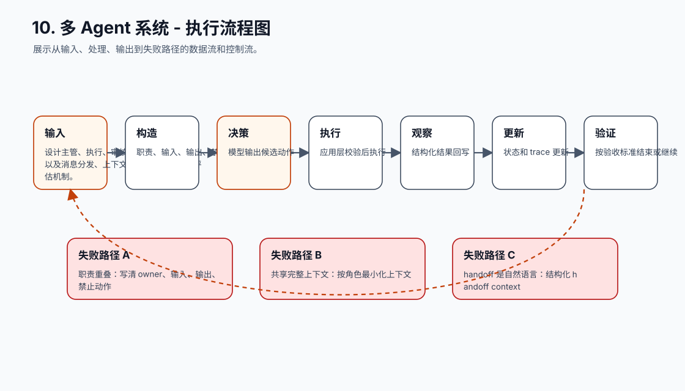
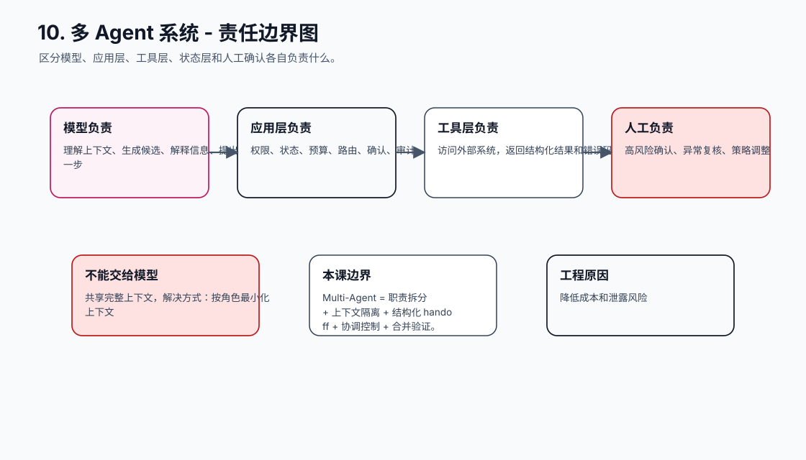
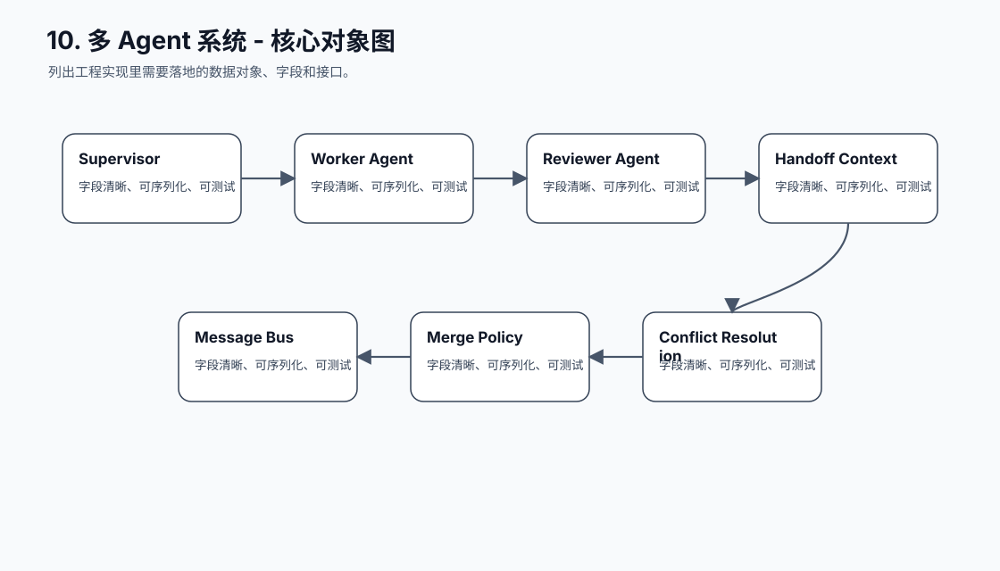
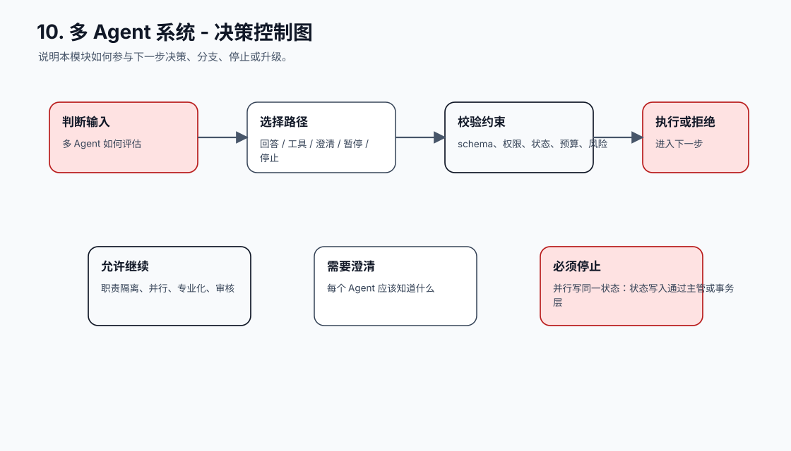
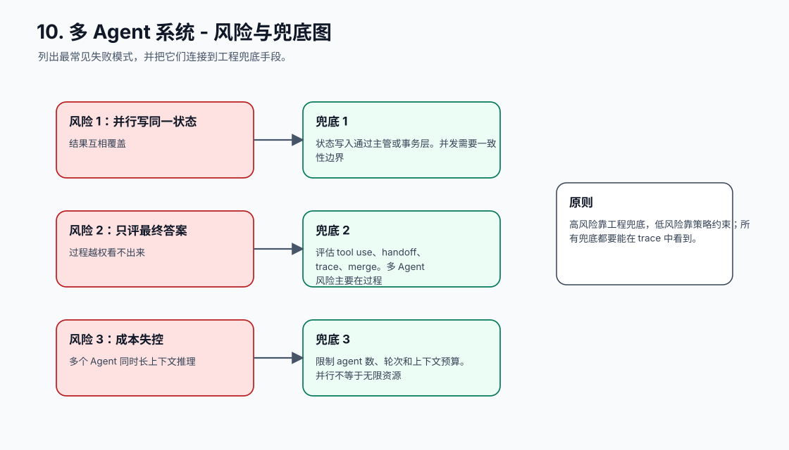
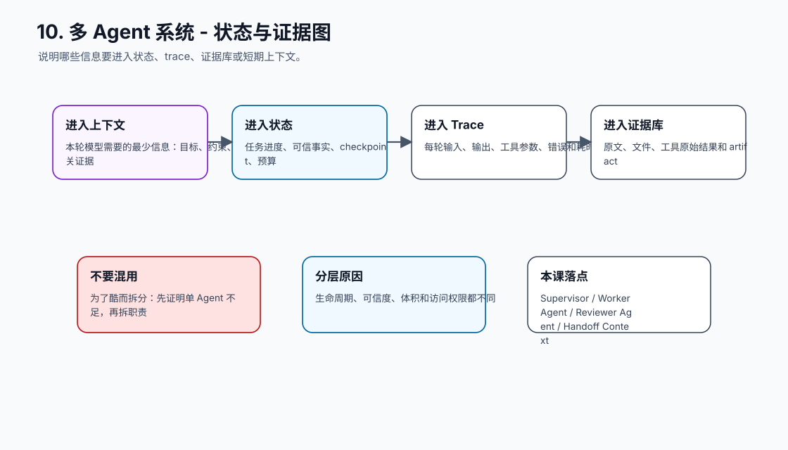
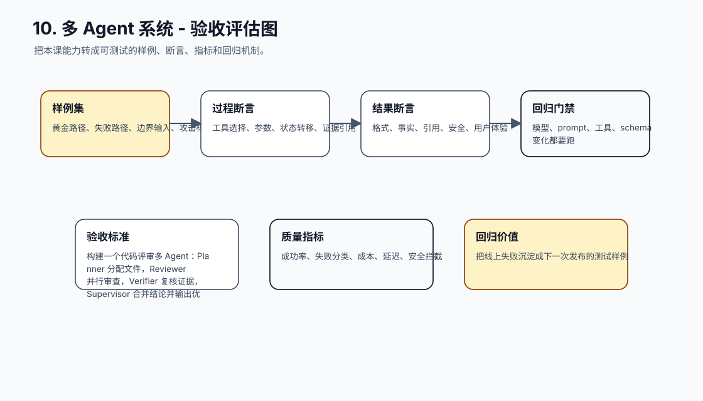
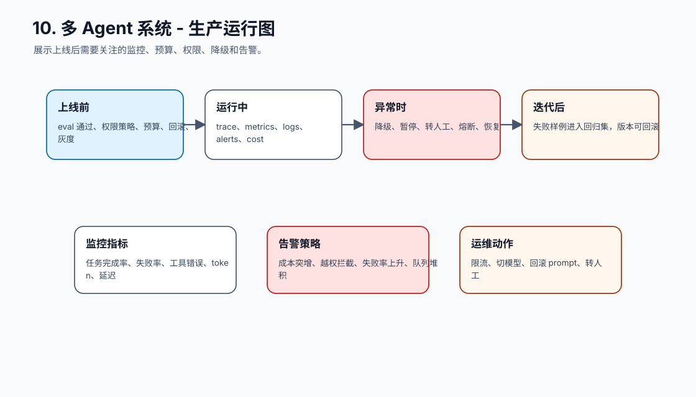
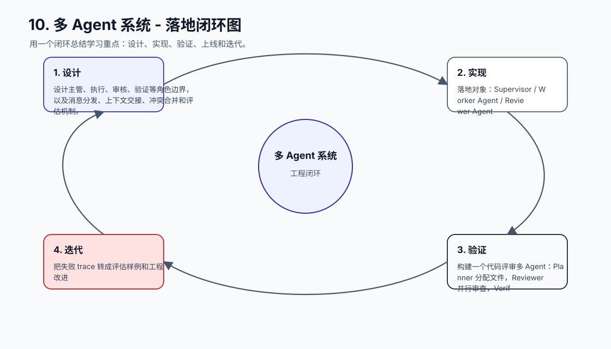

# 10. 多 Agent 系统

[返回课程目录](README.md)

## 本课定位

在单 Agent 闭环稳定后，用多 Agent 按职责隔离上下文、并行处理任务、互相审核和合并结果。

多 Agent 常被误用成“多个模型一起讨论”，但没有职责边界、handoff、仲裁和测试时，只会增加成本和不可控性。

本课的目标是：设计主管、执行、审核、验证等角色边界，以及消息分发、上下文交接、冲突合并和评估机制。

核心公式：`Multi-Agent = 职责拆分 + 上下文隔离 + 结构化 handoff + 协调控制 + 合并验证。`

## 学习目标

- 能解释本课模块解决 Agent 系统里的哪个缺口。
- 能画出本课模块在完整 Agent Runtime 中的位置。
- 能把关键对象、接口、状态和错误路径写成可执行设计。
- 能识别工程中常见失败模式，并给出可落地的兜底方案。
- 能用 trace、评估样例和验收标准证明方案有效。

## 小节拆解

| 小节 | 先回答的问题 | 必须讲透的知识点 | 工程落地要求 | 练习 |
| --- | --- | --- | --- | --- |
| 10.1 何时拆多 Agent | 多 Agent 解决什么问题 | 职责隔离、并行、专业化、审核 | 对象、接口、状态和错误路径都要能落到代码 | 判断 10 个场景 |
| 10.2 角色设计 | 每个 Agent 应该知道什么 | 职责、输入、输出、禁止动作、工具范围 | 对象、接口、状态和错误路径都要能落到代码 | 写角色卡 |
| 10.3 Handoff | 交接上下文如何结构化 | 目标、已知事实、证据、待办、风险 | 对象、接口、状态和错误路径都要能落到代码 | 设计 handoff schema |
| 10.4 并行和合并 | 多个结果如何合并 | 分片、去重、冲突、仲裁、验证 | 对象、接口、状态和错误路径都要能落到代码 | 实现结果合并 |
| 10.5 测试与治理 | 多 Agent 如何评估 | 单角色测试、交互测试、轨迹回放 | 对象、接口、状态和错误路径都要能落到代码 | 建立回归集 |

## 知识点深拆

### 10.1 何时拆多 Agent
这一小节先回答：多 Agent 解决什么问题。不要从框架名词开始，而要从任务系统缺什么开始理解。对工程团队来说，职责隔离、并行、专业化、审核 不是概念装饰，而是决定系统能不能被测试、恢复和上线的边界。
落地时先写清输入、输出、状态变化和失败路径。输入要能被 schema 或类型系统描述，输出要能被下游程序校验，状态变化要能进入 trace，失败路径要能转成明确的 stop reason、retry policy 或 human review。
练习：判断 10 个场景。验收时不要只看模型回答是否自然，要检查 trace 里是否出现正确决策、是否遵守权限和预算、是否在证据不足时选择澄清或拒绝。
### 10.2 角色设计
这一小节先回答：每个 Agent 应该知道什么。不要从框架名词开始，而要从任务系统缺什么开始理解。对工程团队来说，职责、输入、输出、禁止动作、工具范围 不是概念装饰，而是决定系统能不能被测试、恢复和上线的边界。
落地时先写清输入、输出、状态变化和失败路径。输入要能被 schema 或类型系统描述，输出要能被下游程序校验，状态变化要能进入 trace，失败路径要能转成明确的 stop reason、retry policy 或 human review。
练习：写角色卡。验收时不要只看模型回答是否自然，要检查 trace 里是否出现正确决策、是否遵守权限和预算、是否在证据不足时选择澄清或拒绝。
### 10.3 Handoff
这一小节先回答：交接上下文如何结构化。不要从框架名词开始，而要从任务系统缺什么开始理解。对工程团队来说，目标、已知事实、证据、待办、风险 不是概念装饰，而是决定系统能不能被测试、恢复和上线的边界。
落地时先写清输入、输出、状态变化和失败路径。输入要能被 schema 或类型系统描述，输出要能被下游程序校验，状态变化要能进入 trace，失败路径要能转成明确的 stop reason、retry policy 或 human review。
练习：设计 handoff schema。验收时不要只看模型回答是否自然，要检查 trace 里是否出现正确决策、是否遵守权限和预算、是否在证据不足时选择澄清或拒绝。
### 10.4 并行和合并
这一小节先回答：多个结果如何合并。不要从框架名词开始，而要从任务系统缺什么开始理解。对工程团队来说，分片、去重、冲突、仲裁、验证 不是概念装饰，而是决定系统能不能被测试、恢复和上线的边界。
落地时先写清输入、输出、状态变化和失败路径。输入要能被 schema 或类型系统描述，输出要能被下游程序校验，状态变化要能进入 trace，失败路径要能转成明确的 stop reason、retry policy 或 human review。
练习：实现结果合并。验收时不要只看模型回答是否自然，要检查 trace 里是否出现正确决策、是否遵守权限和预算、是否在证据不足时选择澄清或拒绝。
### 10.5 测试与治理
这一小节先回答：多 Agent 如何评估。不要从框架名词开始，而要从任务系统缺什么开始理解。对工程团队来说，单角色测试、交互测试、轨迹回放 不是概念装饰，而是决定系统能不能被测试、恢复和上线的边界。
落地时先写清输入、输出、状态变化和失败路径。输入要能被 schema 或类型系统描述，输出要能被下游程序校验，状态变化要能进入 trace，失败路径要能转成明确的 stop reason、retry policy 或 human review。
练习：建立回归集。验收时不要只看模型回答是否自然，要检查 trace 里是否出现正确决策、是否遵守权限和预算、是否在证据不足时选择澄清或拒绝。

## 核心工程对象

| 对象 | 它解决什么 | 落地要求 |
| --- | --- | --- |
| Supervisor | Supervisor 是本课需要落地的工程对象，不应该只停留在 Prompt 文本里。 | 有结构、有版本、有校验、有 trace 记录 |
| Worker Agent | Worker Agent 是本课需要落地的工程对象，不应该只停留在 Prompt 文本里。 | 有结构、有版本、有校验、有 trace 记录 |
| Reviewer Agent | Reviewer Agent 是本课需要落地的工程对象，不应该只停留在 Prompt 文本里。 | 有结构、有版本、有校验、有 trace 记录 |
| Handoff Context | Handoff Context 是本课需要落地的工程对象，不应该只停留在 Prompt 文本里。 | 有结构、有版本、有校验、有 trace 记录 |
| Message Bus | Message Bus 是本课需要落地的工程对象，不应该只停留在 Prompt 文本里。 | 有结构、有版本、有校验、有 trace 记录 |
| Merge Policy | Merge Policy 是本课需要落地的工程对象，不应该只停留在 Prompt 文本里。 | 有结构、有版本、有校验、有 trace 记录 |
| Conflict Resolution | Conflict Resolution 是本课需要落地的工程对象，不应该只停留在 Prompt 文本里。 | 有结构、有版本、有校验、有 trace 记录 |

## 本课图谱：10 张图讲清楚

下面 10 张图对应本课从宏观定位到生产落地的完整拆解。读图顺序固定为：系统位置、执行流程、责任边界、核心对象、决策控制、风险兜底、状态证据、验收评估、生产运行、落地闭环。

**图 10-1：多 Agent 系统 - 系统位置图**  

**图 10-2：多 Agent 系统 - 执行流程图**  

**图 10-3：多 Agent 系统 - 责任边界图**  

**图 10-4：多 Agent 系统 - 核心对象图**  

**图 10-5：多 Agent 系统 - 决策控制图**  

**图 10-6：多 Agent 系统 - 风险与兜底图**  

**图 10-7：多 Agent 系统 - 状态与证据图**  

**图 10-8：多 Agent 系统 - 验收评估图**  

**图 10-9：多 Agent 系统 - 生产运行图**  

**图 10-10：多 Agent 系统 - 落地闭环图**  

## 工程踩坑与处理方式

| 工程坑 | 典型表现 | 解决方式 | 为什么这么做 |
| --- | --- | --- | --- |
| 为了酷而拆分 | 简单任务也开多个 Agent | 先证明单 Agent 不足，再拆职责 | 多 Agent 增加协调和测试成本 |
| 职责重叠 | 多个 Agent 都能规划和执行 | 写清 owner、输入、输出、禁止动作 | 减少冲突和重复劳动 |
| 共享完整上下文 | 每个 Agent 都看到所有材料 | 按角色最小化上下文 | 降低成本和泄露风险 |
| handoff 是自然语言 | 交接漏掉事实和约束 | 结构化 handoff context | 跨 Agent 传递必须可验证 |
| 没有仲裁机制 | 两个结论冲突直接拼接 | 设置 reviewer 或 merge policy | 合并不是复制粘贴 |
| 并行写同一状态 | 结果互相覆盖 | 状态写入通过主管或事务层 | 并发需要一致性边界 |
| 只评最终答案 | 过程越权看不出来 | 评估 tool use、handoff、trace、merge | 多 Agent 风险主要在过程 |
| 成本失控 | 多个 Agent 同时长上下文推理 | 限制 agent 数、轮次和上下文预算 | 并行不等于无限资源 |

## 最小实现闭环

构建一个代码评审多 Agent：Planner 分配文件，Reviewer 并行审查，Verifier 复核证据，Supervisor 合并结论并输出优先级。

建议验收方式：

- 至少准备 5 条正常样例、5 条边界样例、3 条失败样例。
- 每条样例都保存输入、模型决策、工具调用、状态变化、最终输出和错误信息。
- 能用程序断言的地方不要只靠人工阅读，例如 schema、状态字段、错误码、引用 id、权限结果和停止原因。
- 修改 prompt、工具 schema、模型参数或状态结构后，必须跑回归样例。

## 章节总结

多 Agent 的核心不是“更多智能”，而是工程上的职责隔离和并行协作。只有单 Agent 闭环、状态、工具和评估稳定后，多 Agent 才有意义。

学完这一课后，应能把它放回完整 Agent 链路里：它接收什么输入，改变什么状态，调用什么能力，产生什么证据，失败时如何停止或恢复，以及上线后如何观测和评估。
