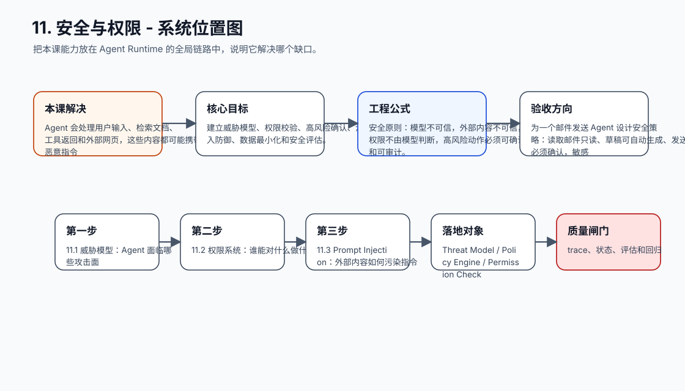
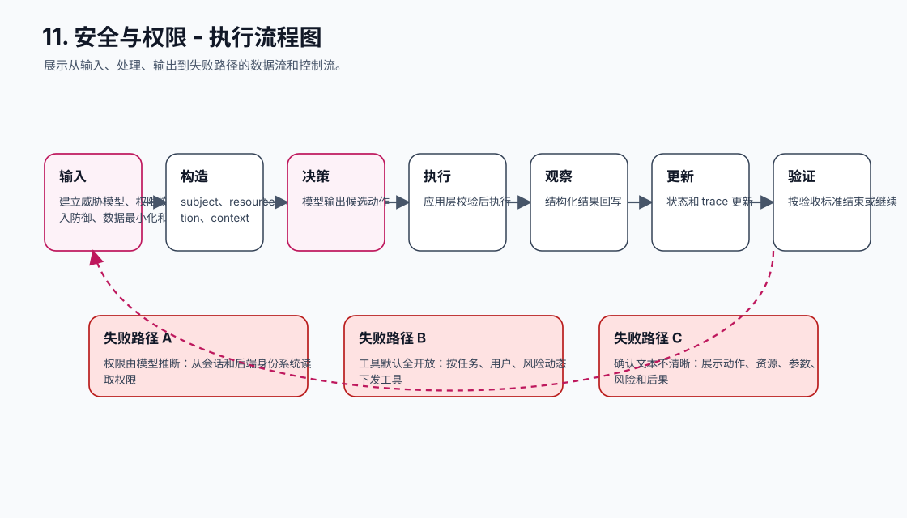
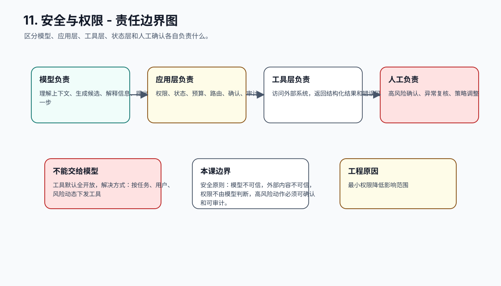
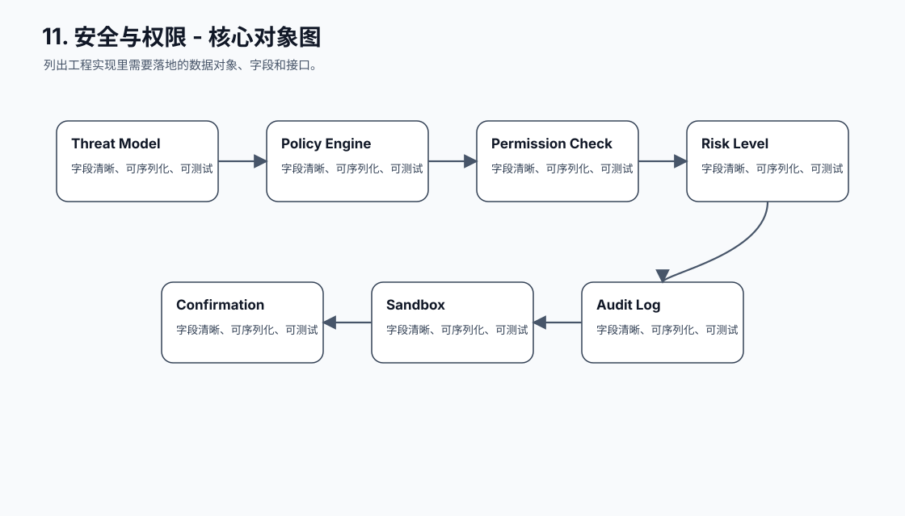
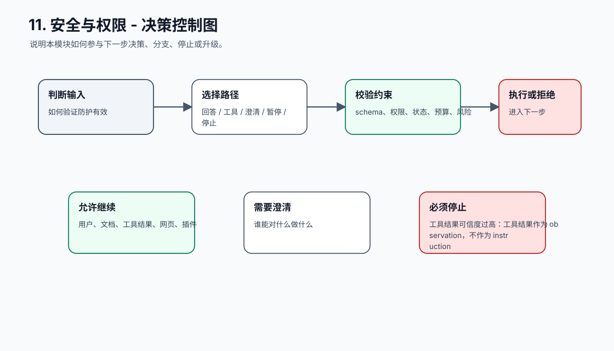
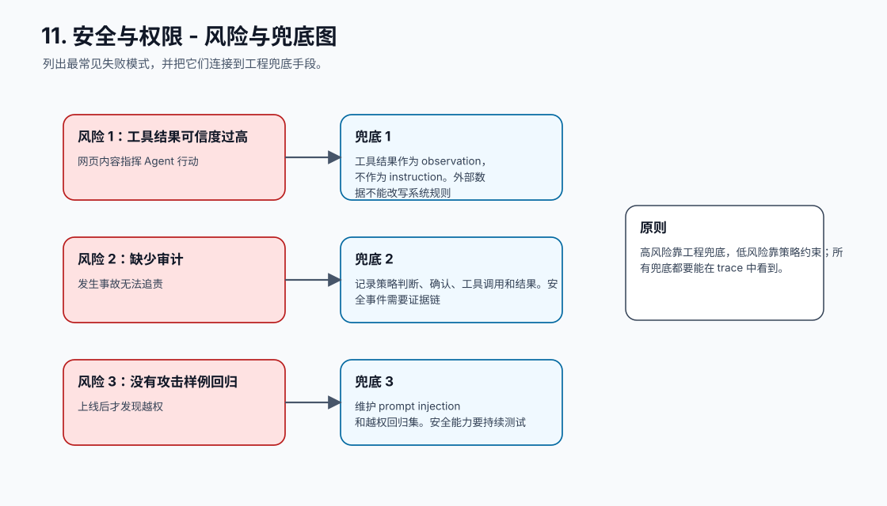
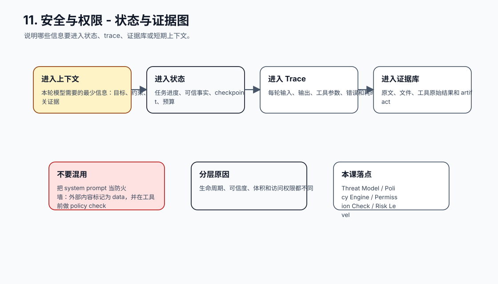
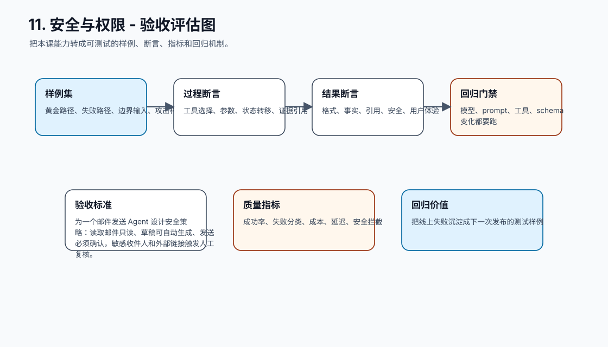
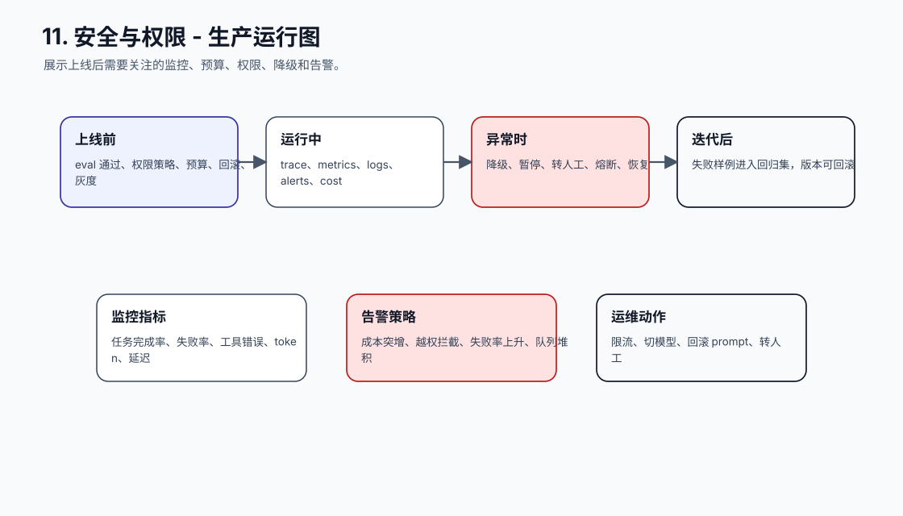
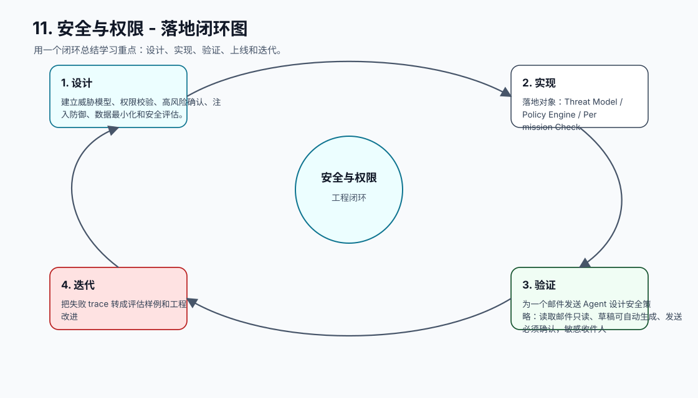

# 11. 安全与权限

[返回课程目录](README.md)

## 本课定位

把 Agent 的信任边界从 Prompt 移到工程系统：身份、资源、工具、副作用、敏感数据和外部内容都要有明确控制。

Agent 会处理用户输入、检索文档、工具返回和外部网页，这些内容都可能携带恶意指令；如果系统信任模型，就会出现越权和数据泄露。

本课的目标是：建立威胁模型、权限校验、高风险确认、注入防御、数据最小化和安全评估。

核心公式：`安全原则：模型不可信，外部内容不可信，权限不由模型判断，高风险动作必须可确认和可审计。`

## 学习目标

- 能解释本课模块解决 Agent 系统里的哪个缺口。
- 能画出本课模块在完整 Agent Runtime 中的位置。
- 能把关键对象、接口、状态和错误路径写成可执行设计。
- 能识别工程中常见失败模式，并给出可落地的兜底方案。
- 能用 trace、评估样例和验收标准证明方案有效。

## 小节拆解

| 小节 | 先回答的问题 | 必须讲透的知识点 | 工程落地要求 | 练习 |
| --- | --- | --- | --- | --- |
| 11.1 威胁模型 | Agent 面临哪些攻击面 | 用户、文档、工具结果、网页、插件 | 对象、接口、状态和错误路径都要能落到代码 | 画攻击面 |
| 11.2 权限系统 | 谁能对什么做什么 | subject、resource、action、context | 对象、接口、状态和错误路径都要能落到代码 | 写 policy check |
| 11.3 Prompt Injection | 外部内容如何污染指令 | 指令/数据隔离、引用标记、拒绝执行 | 对象、接口、状态和错误路径都要能落到代码 | 设计防护提示和规则 |
| 11.4 高风险动作 | 哪些操作需要确认 | 删除、付款、发布、发邮件、改权限 | 对象、接口、状态和错误路径都要能落到代码 | 实现确认令牌 |
| 11.5 安全测试 | 如何验证防护有效 | 攻击样例、越权样例、敏感信息样例 | 对象、接口、状态和错误路径都要能落到代码 | 建立红队集 |

## 知识点深拆

### 11.1 威胁模型
这一小节先回答：Agent 面临哪些攻击面。不要从框架名词开始，而要从任务系统缺什么开始理解。对工程团队来说，用户、文档、工具结果、网页、插件 不是概念装饰，而是决定系统能不能被测试、恢复和上线的边界。
落地时先写清输入、输出、状态变化和失败路径。输入要能被 schema 或类型系统描述，输出要能被下游程序校验，状态变化要能进入 trace，失败路径要能转成明确的 stop reason、retry policy 或 human review。
练习：画攻击面。验收时不要只看模型回答是否自然，要检查 trace 里是否出现正确决策、是否遵守权限和预算、是否在证据不足时选择澄清或拒绝。
### 11.2 权限系统
这一小节先回答：谁能对什么做什么。不要从框架名词开始，而要从任务系统缺什么开始理解。对工程团队来说，subject、resource、action、context 不是概念装饰，而是决定系统能不能被测试、恢复和上线的边界。
落地时先写清输入、输出、状态变化和失败路径。输入要能被 schema 或类型系统描述，输出要能被下游程序校验，状态变化要能进入 trace，失败路径要能转成明确的 stop reason、retry policy 或 human review。
练习：写 policy check。验收时不要只看模型回答是否自然，要检查 trace 里是否出现正确决策、是否遵守权限和预算、是否在证据不足时选择澄清或拒绝。
### 11.3 Prompt Injection
这一小节先回答：外部内容如何污染指令。不要从框架名词开始，而要从任务系统缺什么开始理解。对工程团队来说，指令/数据隔离、引用标记、拒绝执行 不是概念装饰，而是决定系统能不能被测试、恢复和上线的边界。
落地时先写清输入、输出、状态变化和失败路径。输入要能被 schema 或类型系统描述，输出要能被下游程序校验，状态变化要能进入 trace，失败路径要能转成明确的 stop reason、retry policy 或 human review。
练习：设计防护提示和规则。验收时不要只看模型回答是否自然，要检查 trace 里是否出现正确决策、是否遵守权限和预算、是否在证据不足时选择澄清或拒绝。
### 11.4 高风险动作
这一小节先回答：哪些操作需要确认。不要从框架名词开始，而要从任务系统缺什么开始理解。对工程团队来说，删除、付款、发布、发邮件、改权限 不是概念装饰，而是决定系统能不能被测试、恢复和上线的边界。
落地时先写清输入、输出、状态变化和失败路径。输入要能被 schema 或类型系统描述，输出要能被下游程序校验，状态变化要能进入 trace，失败路径要能转成明确的 stop reason、retry policy 或 human review。
练习：实现确认令牌。验收时不要只看模型回答是否自然，要检查 trace 里是否出现正确决策、是否遵守权限和预算、是否在证据不足时选择澄清或拒绝。
### 11.5 安全测试
这一小节先回答：如何验证防护有效。不要从框架名词开始，而要从任务系统缺什么开始理解。对工程团队来说，攻击样例、越权样例、敏感信息样例 不是概念装饰，而是决定系统能不能被测试、恢复和上线的边界。
落地时先写清输入、输出、状态变化和失败路径。输入要能被 schema 或类型系统描述，输出要能被下游程序校验，状态变化要能进入 trace，失败路径要能转成明确的 stop reason、retry policy 或 human review。
练习：建立红队集。验收时不要只看模型回答是否自然，要检查 trace 里是否出现正确决策、是否遵守权限和预算、是否在证据不足时选择澄清或拒绝。

## 核心工程对象

| 对象 | 它解决什么 | 落地要求 |
| --- | --- | --- |
| Threat Model | Threat Model 是本课需要落地的工程对象，不应该只停留在 Prompt 文本里。 | 有结构、有版本、有校验、有 trace 记录 |
| Policy Engine | Policy Engine 是本课需要落地的工程对象，不应该只停留在 Prompt 文本里。 | 有结构、有版本、有校验、有 trace 记录 |
| Permission Check | Permission Check 是本课需要落地的工程对象，不应该只停留在 Prompt 文本里。 | 有结构、有版本、有校验、有 trace 记录 |
| Risk Level | Risk Level 是本课需要落地的工程对象，不应该只停留在 Prompt 文本里。 | 有结构、有版本、有校验、有 trace 记录 |
| Confirmation | Confirmation 是本课需要落地的工程对象，不应该只停留在 Prompt 文本里。 | 有结构、有版本、有校验、有 trace 记录 |
| Sandbox | Sandbox 是本课需要落地的工程对象，不应该只停留在 Prompt 文本里。 | 有结构、有版本、有校验、有 trace 记录 |
| Audit Log | Audit Log 是本课需要落地的工程对象，不应该只停留在 Prompt 文本里。 | 有结构、有版本、有校验、有 trace 记录 |
| Red Team Case | Red Team Case 是本课需要落地的工程对象，不应该只停留在 Prompt 文本里。 | 有结构、有版本、有校验、有 trace 记录 |

## 本课图谱：10 张图讲清楚

下面 10 张图对应本课从宏观定位到生产落地的完整拆解。读图顺序固定为：系统位置、执行流程、责任边界、核心对象、决策控制、风险兜底、状态证据、验收评估、生产运行、落地闭环。

**图 11-1：安全与权限 - 系统位置图**  

**图 11-2：安全与权限 - 执行流程图**  

**图 11-3：安全与权限 - 责任边界图**  

**图 11-4：安全与权限 - 核心对象图**  

**图 11-5：安全与权限 - 决策控制图**  

**图 11-6：安全与权限 - 风险与兜底图**  

**图 11-7：安全与权限 - 状态与证据图**  

**图 11-8：安全与权限 - 验收评估图**  

**图 11-9：安全与权限 - 生产运行图**  

**图 11-10：安全与权限 - 落地闭环图**  

## 工程踩坑与处理方式

| 工程坑 | 典型表现 | 解决方式 | 为什么这么做 |
| --- | --- | --- | --- |
| 把 system prompt 当防火墙 | 恶意文档仍诱导工具调用 | 外部内容标记为 data，并在工具前做 policy check | 安全不能只靠模型服从 |
| 权限由模型推断 | 模型说用户是管理员就放行 | 从会话和后端身份系统读取权限 | 身份必须来自可信系统 |
| 工具默认全开放 | 任何任务都能调用写操作 | 按任务、用户、风险动态下发工具 | 最小权限降低影响范围 |
| 确认文本不清晰 | 用户不知道确认什么 | 展示动作、资源、参数、风险和后果 | 确认必须是知情确认 |
| 敏感数据进 prompt | 模型和日志都暴露隐私 | 脱敏、最小化、按需取数 | 减少数据扩散面 |
| 工具结果可信度过高 | 网页内容指挥 Agent 行动 | 工具结果作为 observation，不作为 instruction | 外部数据不能改写系统规则 |
| 缺少审计 | 发生事故无法追责 | 记录策略判断、确认、工具调用和结果 | 安全事件需要证据链 |
| 没有攻击样例回归 | 上线后才发现越权 | 维护 prompt injection 和越权回归集 | 安全能力要持续测试 |

## 最小实现闭环

为一个邮件发送 Agent 设计安全策略：读取邮件只读、草稿可自动生成、发送必须确认，敏感收件人和外部链接触发人工复核。

建议验收方式：

- 至少准备 5 条正常样例、5 条边界样例、3 条失败样例。
- 每条样例都保存输入、模型决策、工具调用、状态变化、最终输出和错误信息。
- 能用程序断言的地方不要只靠人工阅读，例如 schema、状态字段、错误码、引用 id、权限结果和停止原因。
- 修改 prompt、工具 schema、模型参数或状态结构后，必须跑回归样例。

## 章节总结

Agent 安全的核心是不要把信任交给模型。模型可以理解风险，但最终的权限、确认、隔离和审计必须由确定性系统执行。

学完这一课后，应能把它放回完整 Agent 链路里：它接收什么输入，改变什么状态，调用什么能力，产生什么证据，失败时如何停止或恢复，以及上线后如何观测和评估。
