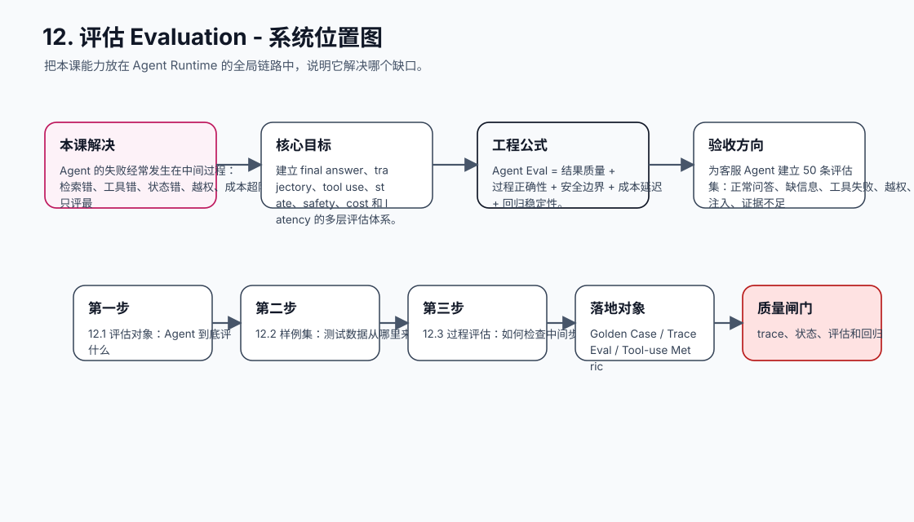
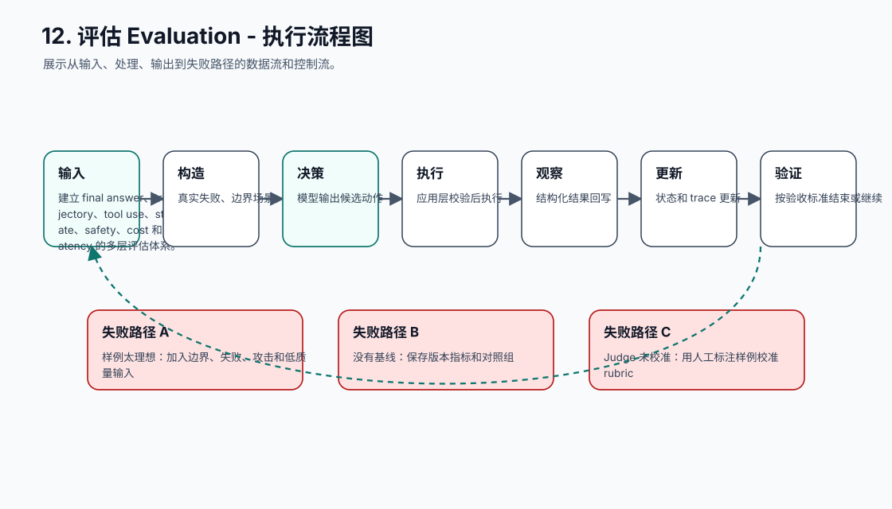
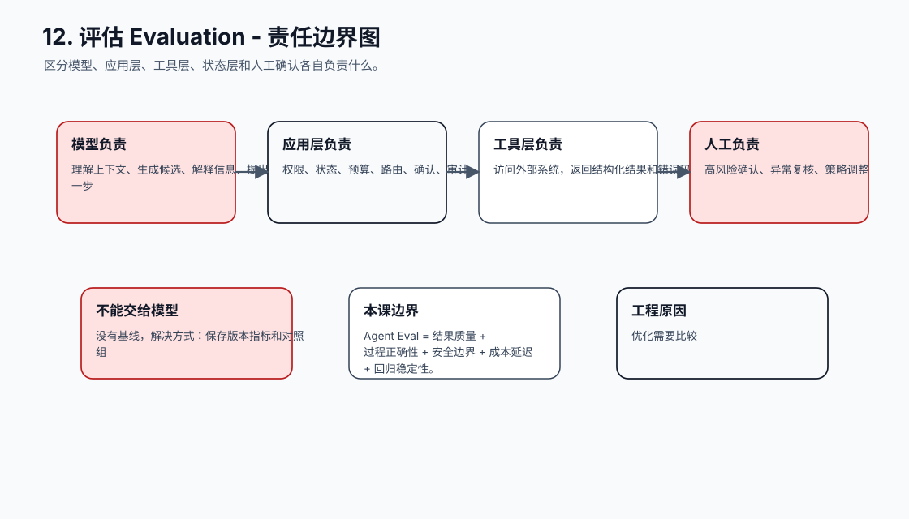
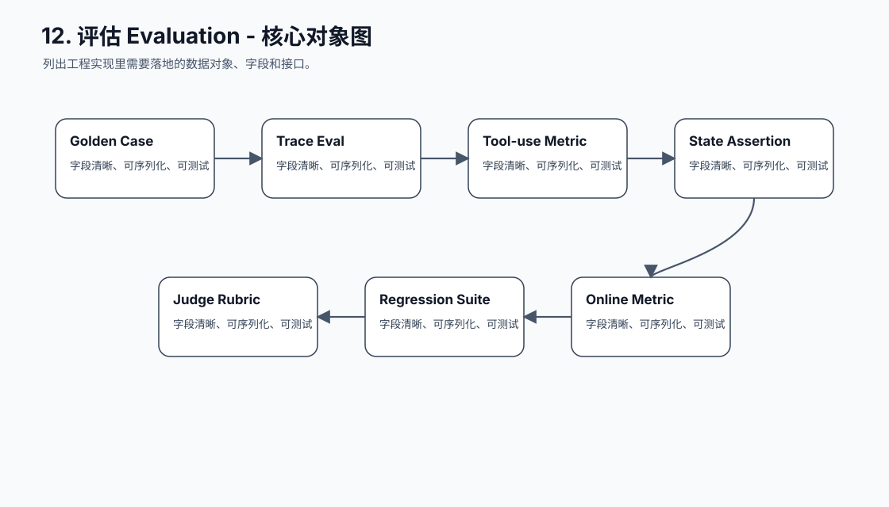
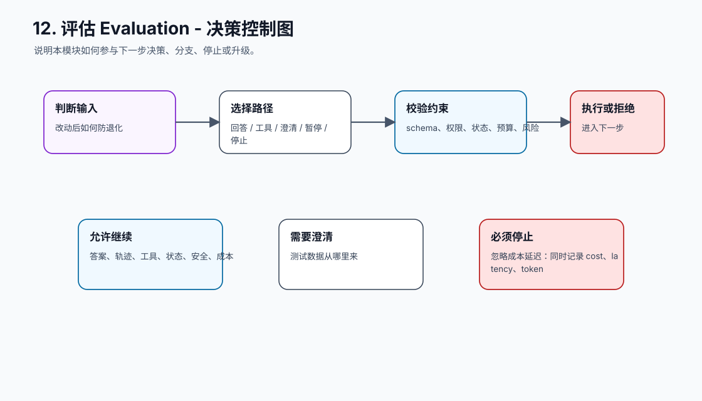
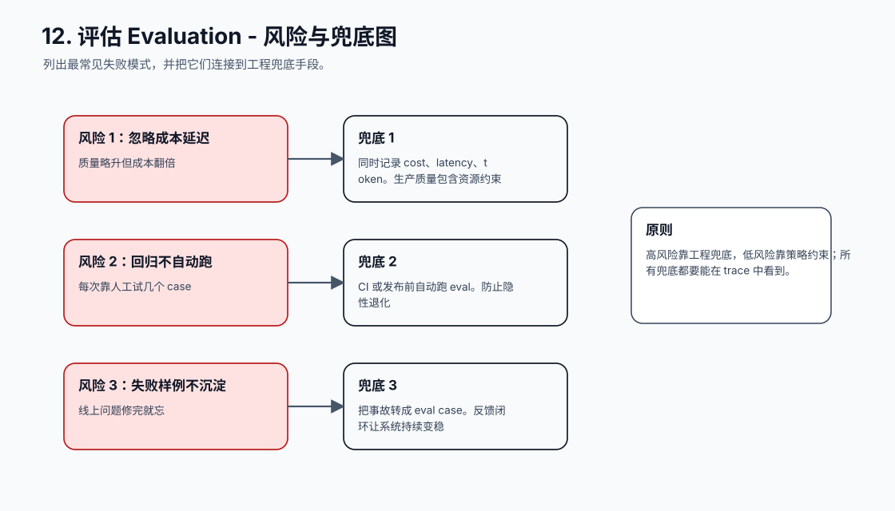
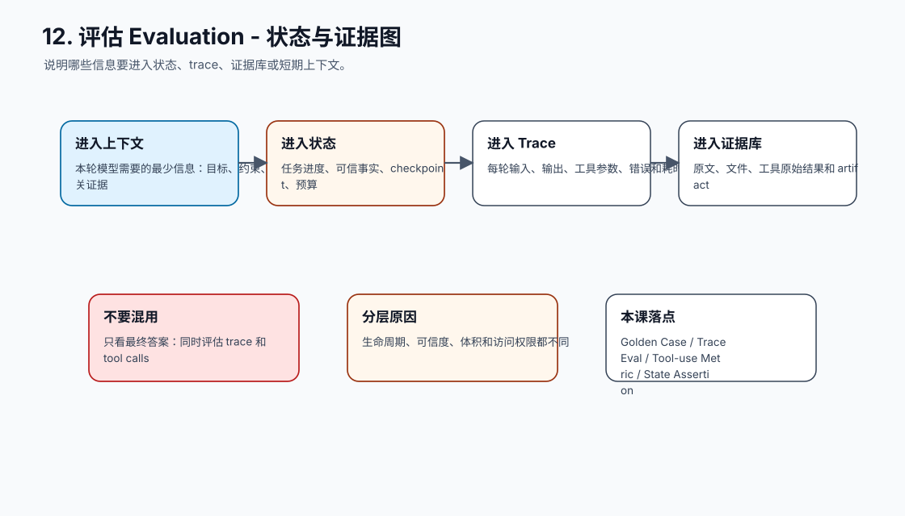
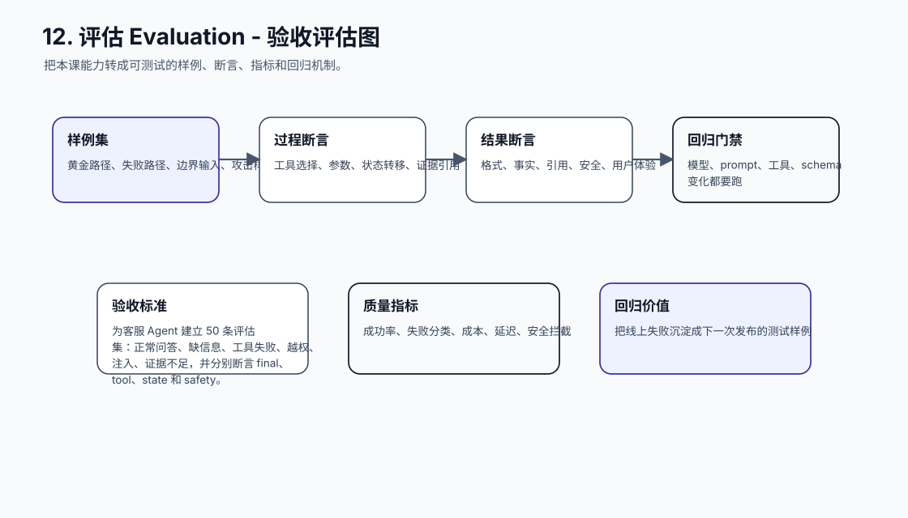
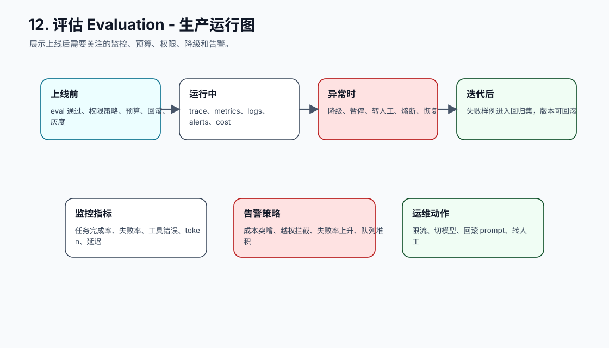
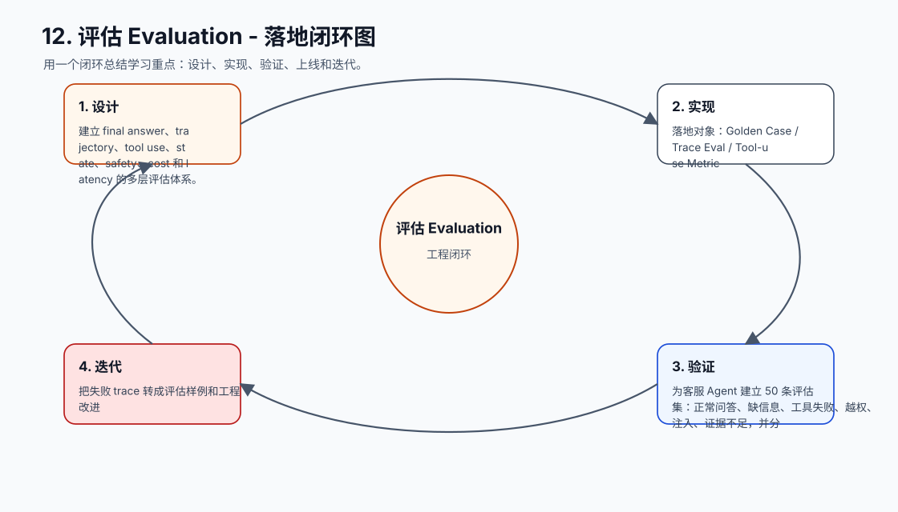

# 12. 评估 Evaluation

[返回课程目录](README.md)

## 本课定位

用样例集、轨迹评估、工具调用评估、状态评估和线上指标证明 Agent 质量，而不是只看最终回答是否顺眼。

Agent 的失败经常发生在中间过程：检索错、工具错、状态错、越权、成本超限。只评最终答案会漏掉真正风险。

本课的目标是：建立 final answer、trajectory、tool use、state、safety、cost 和 latency 的多层评估体系。

核心公式：`Agent Eval = 结果质量 + 过程正确性 + 安全边界 + 成本延迟 + 回归稳定性。`

## 学习目标

- 能解释本课模块解决 Agent 系统里的哪个缺口。
- 能画出本课模块在完整 Agent Runtime 中的位置。
- 能把关键对象、接口、状态和错误路径写成可执行设计。
- 能识别工程中常见失败模式，并给出可落地的兜底方案。
- 能用 trace、评估样例和验收标准证明方案有效。

## 小节拆解

| 小节 | 先回答的问题 | 必须讲透的知识点 | 工程落地要求 | 练习 |
| --- | --- | --- | --- | --- |
| 12.1 评估对象 | Agent 到底评什么 | 答案、轨迹、工具、状态、安全、成本 | 对象、接口、状态和错误路径都要能落到代码 | 标注一条 trace |
| 12.2 样例集 | 测试数据从哪里来 | 真实失败、边界场景、攻击样例、黄金路径 | 对象、接口、状态和错误路径都要能落到代码 | 建设 golden set |
| 12.3 过程评估 | 如何检查中间步骤 | 工具选择、参数、证据、状态转移 | 对象、接口、状态和错误路径都要能落到代码 | 写 trace assertions |
| 12.4 LLM Judge | 什么时候能用模型评估 | rubric、校准、抽检、一致性 | 对象、接口、状态和错误路径都要能落到代码 | 校准 judge |
| 12.5 回归机制 | 改动后如何防退化 | prompt/model/tool/schema 变更触发回归 | 对象、接口、状态和错误路径都要能落到代码 | 跑 CI eval |

## 知识点深拆

### 12.1 评估对象
这一小节先回答：Agent 到底评什么。不要从框架名词开始，而要从任务系统缺什么开始理解。对工程团队来说，答案、轨迹、工具、状态、安全、成本 不是概念装饰，而是决定系统能不能被测试、恢复和上线的边界。
落地时先写清输入、输出、状态变化和失败路径。输入要能被 schema 或类型系统描述，输出要能被下游程序校验，状态变化要能进入 trace，失败路径要能转成明确的 stop reason、retry policy 或 human review。
练习：标注一条 trace。验收时不要只看模型回答是否自然，要检查 trace 里是否出现正确决策、是否遵守权限和预算、是否在证据不足时选择澄清或拒绝。
### 12.2 样例集
这一小节先回答：测试数据从哪里来。不要从框架名词开始，而要从任务系统缺什么开始理解。对工程团队来说，真实失败、边界场景、攻击样例、黄金路径 不是概念装饰，而是决定系统能不能被测试、恢复和上线的边界。
落地时先写清输入、输出、状态变化和失败路径。输入要能被 schema 或类型系统描述，输出要能被下游程序校验，状态变化要能进入 trace，失败路径要能转成明确的 stop reason、retry policy 或 human review。
练习：建设 golden set。验收时不要只看模型回答是否自然，要检查 trace 里是否出现正确决策、是否遵守权限和预算、是否在证据不足时选择澄清或拒绝。
### 12.3 过程评估
这一小节先回答：如何检查中间步骤。不要从框架名词开始，而要从任务系统缺什么开始理解。对工程团队来说，工具选择、参数、证据、状态转移 不是概念装饰，而是决定系统能不能被测试、恢复和上线的边界。
落地时先写清输入、输出、状态变化和失败路径。输入要能被 schema 或类型系统描述，输出要能被下游程序校验，状态变化要能进入 trace，失败路径要能转成明确的 stop reason、retry policy 或 human review。
练习：写 trace assertions。验收时不要只看模型回答是否自然，要检查 trace 里是否出现正确决策、是否遵守权限和预算、是否在证据不足时选择澄清或拒绝。
### 12.4 LLM Judge
这一小节先回答：什么时候能用模型评估。不要从框架名词开始，而要从任务系统缺什么开始理解。对工程团队来说，rubric、校准、抽检、一致性 不是概念装饰，而是决定系统能不能被测试、恢复和上线的边界。
落地时先写清输入、输出、状态变化和失败路径。输入要能被 schema 或类型系统描述，输出要能被下游程序校验，状态变化要能进入 trace，失败路径要能转成明确的 stop reason、retry policy 或 human review。
练习：校准 judge。验收时不要只看模型回答是否自然，要检查 trace 里是否出现正确决策、是否遵守权限和预算、是否在证据不足时选择澄清或拒绝。
### 12.5 回归机制
这一小节先回答：改动后如何防退化。不要从框架名词开始，而要从任务系统缺什么开始理解。对工程团队来说，prompt/model/tool/schema 变更触发回归 不是概念装饰，而是决定系统能不能被测试、恢复和上线的边界。
落地时先写清输入、输出、状态变化和失败路径。输入要能被 schema 或类型系统描述，输出要能被下游程序校验，状态变化要能进入 trace，失败路径要能转成明确的 stop reason、retry policy 或 human review。
练习：跑 CI eval。验收时不要只看模型回答是否自然，要检查 trace 里是否出现正确决策、是否遵守权限和预算、是否在证据不足时选择澄清或拒绝。

## 核心工程对象

| 对象 | 它解决什么 | 落地要求 |
| --- | --- | --- |
| Golden Case | Golden Case 是本课需要落地的工程对象，不应该只停留在 Prompt 文本里。 | 有结构、有版本、有校验、有 trace 记录 |
| Trace Eval | Trace Eval 是本课需要落地的工程对象，不应该只停留在 Prompt 文本里。 | 有结构、有版本、有校验、有 trace 记录 |
| Tool-use Metric | Tool-use Metric 是本课需要落地的工程对象，不应该只停留在 Prompt 文本里。 | 有结构、有版本、有校验、有 trace 记录 |
| State Assertion | State Assertion 是本课需要落地的工程对象，不应该只停留在 Prompt 文本里。 | 有结构、有版本、有校验、有 trace 记录 |
| Judge Rubric | Judge Rubric 是本课需要落地的工程对象，不应该只停留在 Prompt 文本里。 | 有结构、有版本、有校验、有 trace 记录 |
| Regression Suite | Regression Suite 是本课需要落地的工程对象，不应该只停留在 Prompt 文本里。 | 有结构、有版本、有校验、有 trace 记录 |
| Online Metric | Online Metric 是本课需要落地的工程对象，不应该只停留在 Prompt 文本里。 | 有结构、有版本、有校验、有 trace 记录 |

## 本课图谱：10 张图讲清楚

下面 10 张图对应本课从宏观定位到生产落地的完整拆解。读图顺序固定为：系统位置、执行流程、责任边界、核心对象、决策控制、风险兜底、状态证据、验收评估、生产运行、落地闭环。

**图 12-1：评估 Evaluation - 系统位置图**  

**图 12-2：评估 Evaluation - 执行流程图**  

**图 12-3：评估 Evaluation - 责任边界图**  

**图 12-4：评估 Evaluation - 核心对象图**  

**图 12-5：评估 Evaluation - 决策控制图**  

**图 12-6：评估 Evaluation - 风险与兜底图**  

**图 12-7：评估 Evaluation - 状态与证据图**  

**图 12-8：评估 Evaluation - 验收评估图**  

**图 12-9：评估 Evaluation - 生产运行图**  

**图 12-10：评估 Evaluation - 落地闭环图**  

## 工程踩坑与处理方式

| 工程坑 | 典型表现 | 解决方式 | 为什么这么做 |
| --- | --- | --- | --- |
| 只看最终答案 | 工具越权但回答正确 | 同时评估 trace 和 tool calls | 过程风险不能被最终文本掩盖 |
| 样例太理想 | 全是正常问题 | 加入边界、失败、攻击和低质量输入 | 真实系统主要输在边界 |
| 没有基线 | 不知道改动变好还是变坏 | 保存版本指标和对照组 | 优化需要比较 |
| Judge 未校准 | LLM 打分漂移 | 用人工标注样例校准 rubric | Judge 也是模型，也会错 |
| 指标和业务无关 | 分数高但用户仍投诉 | 绑定任务完成率、转人工率、事故率 | 评估要服务业务风险 |
| 忽略成本延迟 | 质量略升但成本翻倍 | 同时记录 cost、latency、token | 生产质量包含资源约束 |
| 回归不自动跑 | 每次靠人工试几个 case | CI 或发布前自动跑 eval | 防止隐性退化 |
| 失败样例不沉淀 | 线上问题修完就忘 | 把事故转成 eval case | 反馈闭环让系统持续变稳 |

## 最小实现闭环

为客服 Agent 建立 50 条评估集：正常问答、缺信息、工具失败、越权、注入、证据不足，并分别断言 final、tool、state 和 safety。

建议验收方式：

- 至少准备 5 条正常样例、5 条边界样例、3 条失败样例。
- 每条样例都保存输入、模型决策、工具调用、状态变化、最终输出和错误信息。
- 能用程序断言的地方不要只靠人工阅读，例如 schema、状态字段、错误码、引用 id、权限结果和停止原因。
- 修改 prompt、工具 schema、模型参数或状态结构后，必须跑回归样例。

## 章节总结

评估是 Agent 工程的质量仪表盘。没有评估，所有 Prompt、模型和工具改动都只是凭感觉；有了评估，系统才能持续迭代。

学完这一课后，应能把它放回完整 Agent 链路里：它接收什么输入，改变什么状态，调用什么能力，产生什么证据，失败时如何停止或恢复，以及上线后如何观测和评估。
