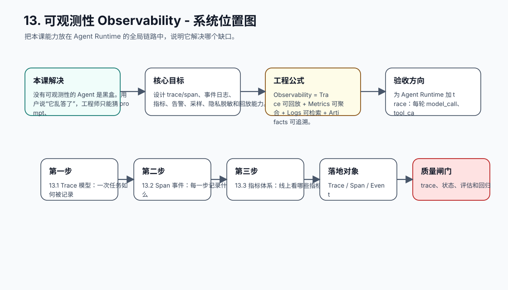
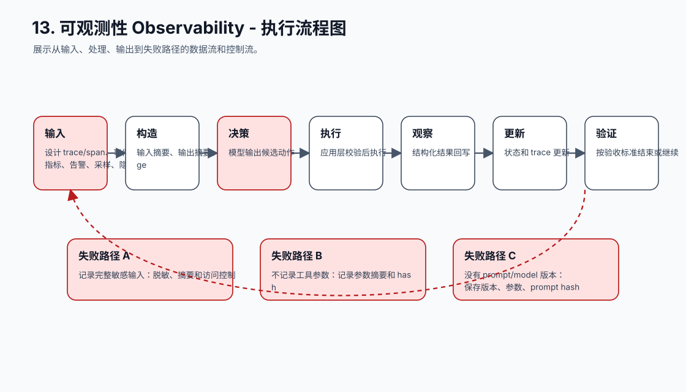
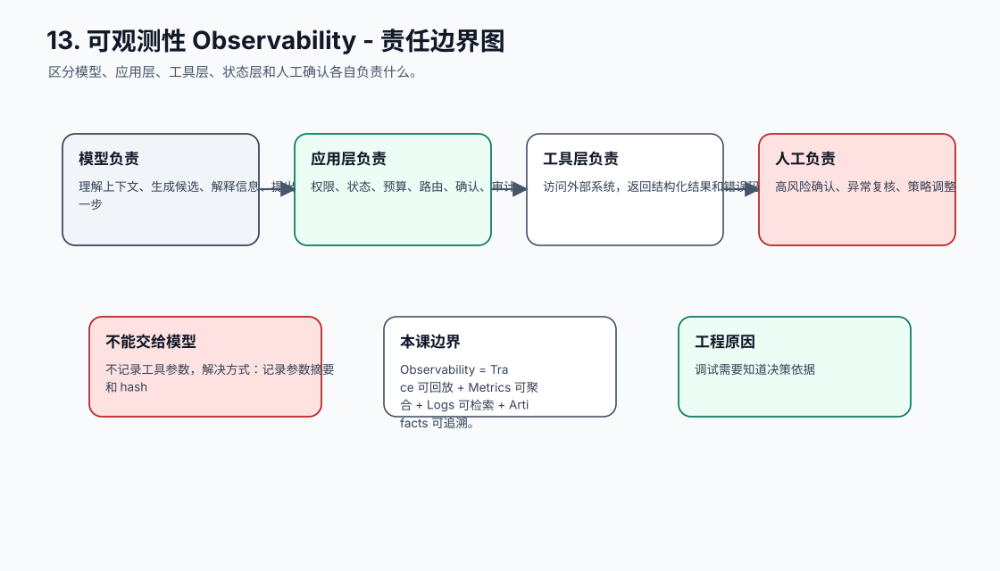
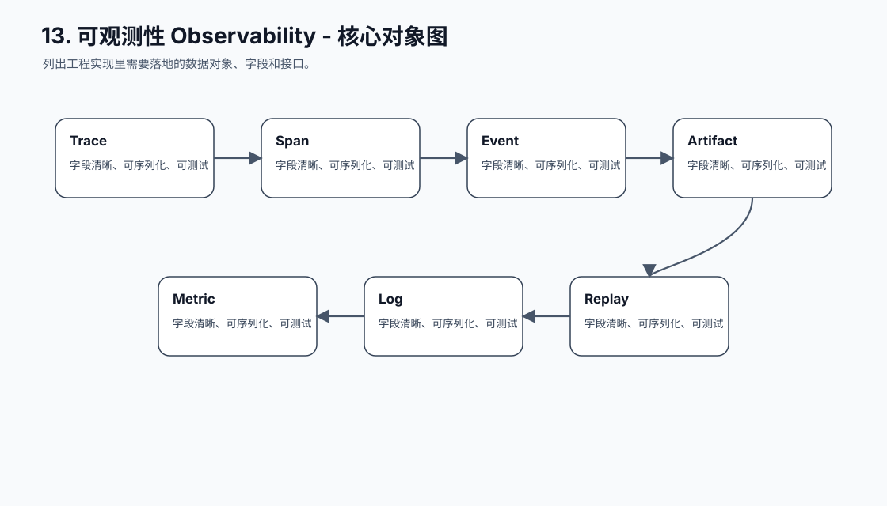
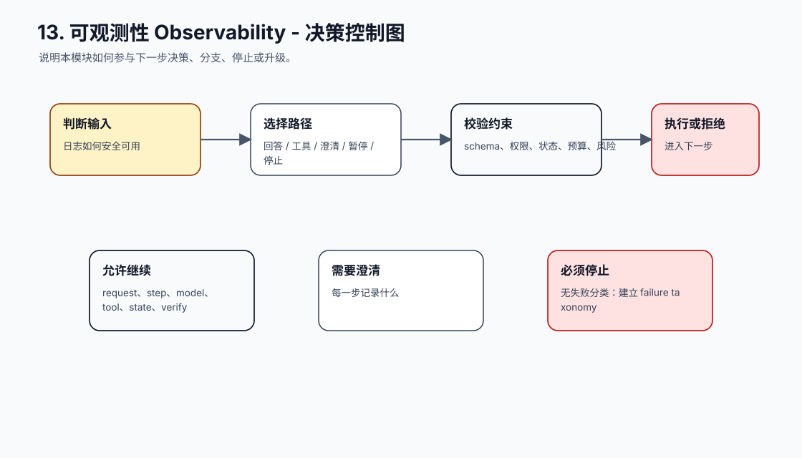
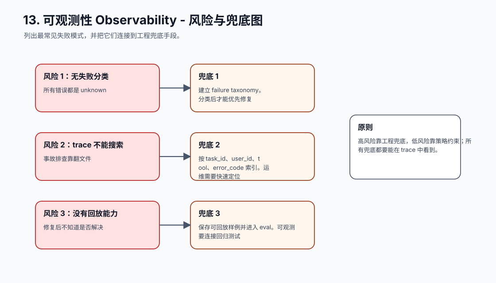
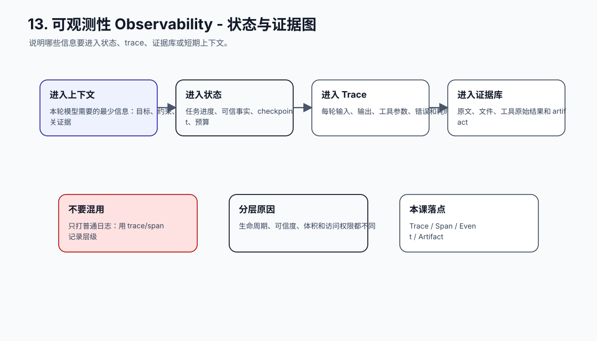
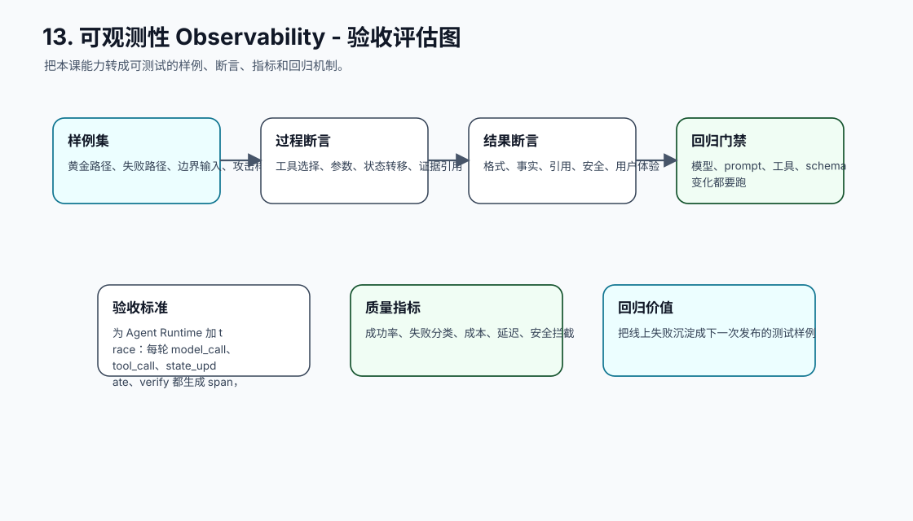
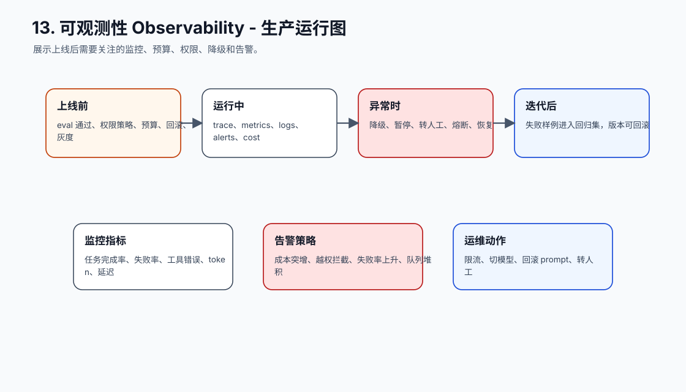
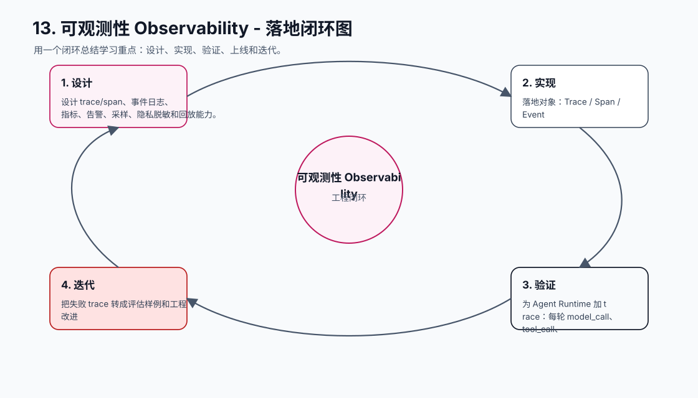

# 13. 可观测性 Observability

[返回课程目录](README.md)

## 本课定位

把 Agent 每一步的输入、决策、工具、观察、状态、成本和错误记录成可查询 trace，用事实定位问题。

没有可观测性的 Agent 是黑盒。用户说“它乱答了”，工程师只能猜 prompt、模型、检索、工具还是状态哪里出错。

本课的目标是：设计 trace/span、事件日志、指标、告警、采样、隐私脱敏和回放能力。

核心公式：`Observability = Trace 可回放 + Metrics 可聚合 + Logs 可检索 + Artifacts 可追溯。`

## 学习目标

- 能解释本课模块解决 Agent 系统里的哪个缺口。
- 能画出本课模块在完整 Agent Runtime 中的位置。
- 能把关键对象、接口、状态和错误路径写成可执行设计。
- 能识别工程中常见失败模式，并给出可落地的兜底方案。
- 能用 trace、评估样例和验收标准证明方案有效。

## 小节拆解

| 小节 | 先回答的问题 | 必须讲透的知识点 | 工程落地要求 | 练习 |
| --- | --- | --- | --- | --- |
| 13.1 Trace 模型 | 一次任务如何被记录 | request、step、model、tool、state、verify | 对象、接口、状态和错误路径都要能落到代码 | 设计 trace schema |
| 13.2 Span 事件 | 每一步记录什么 | 输入摘要、输出摘要、耗时、错误、usage | 对象、接口、状态和错误路径都要能落到代码 | 记录 model span |
| 13.3 指标体系 | 线上看哪些指标 | 完成率、失败率、转人工、成本、延迟、安全拦截 | 对象、接口、状态和错误路径都要能落到代码 | 设计 dashboard |
| 13.4 回放调试 | 如何复现问题 | 固定 prompt、上下文、工具结果、模型版本 | 对象、接口、状态和错误路径都要能落到代码 | 实现 replay |
| 13.5 隐私和采样 | 日志如何安全可用 | 脱敏、访问控制、采样、保留周期 | 对象、接口、状态和错误路径都要能落到代码 | 制定日志策略 |

## 知识点深拆

### 13.1 Trace 模型
这一小节先回答：一次任务如何被记录。不要从框架名词开始，而要从任务系统缺什么开始理解。对工程团队来说，request、step、model、tool、state、verify 不是概念装饰，而是决定系统能不能被测试、恢复和上线的边界。
落地时先写清输入、输出、状态变化和失败路径。输入要能被 schema 或类型系统描述，输出要能被下游程序校验，状态变化要能进入 trace，失败路径要能转成明确的 stop reason、retry policy 或 human review。
练习：设计 trace schema。验收时不要只看模型回答是否自然，要检查 trace 里是否出现正确决策、是否遵守权限和预算、是否在证据不足时选择澄清或拒绝。
### 13.2 Span 事件
这一小节先回答：每一步记录什么。不要从框架名词开始，而要从任务系统缺什么开始理解。对工程团队来说，输入摘要、输出摘要、耗时、错误、usage 不是概念装饰，而是决定系统能不能被测试、恢复和上线的边界。
落地时先写清输入、输出、状态变化和失败路径。输入要能被 schema 或类型系统描述，输出要能被下游程序校验，状态变化要能进入 trace，失败路径要能转成明确的 stop reason、retry policy 或 human review。
练习：记录 model span。验收时不要只看模型回答是否自然，要检查 trace 里是否出现正确决策、是否遵守权限和预算、是否在证据不足时选择澄清或拒绝。
### 13.3 指标体系
这一小节先回答：线上看哪些指标。不要从框架名词开始，而要从任务系统缺什么开始理解。对工程团队来说，完成率、失败率、转人工、成本、延迟、安全拦截 不是概念装饰，而是决定系统能不能被测试、恢复和上线的边界。
落地时先写清输入、输出、状态变化和失败路径。输入要能被 schema 或类型系统描述，输出要能被下游程序校验，状态变化要能进入 trace，失败路径要能转成明确的 stop reason、retry policy 或 human review。
练习：设计 dashboard。验收时不要只看模型回答是否自然，要检查 trace 里是否出现正确决策、是否遵守权限和预算、是否在证据不足时选择澄清或拒绝。
### 13.4 回放调试
这一小节先回答：如何复现问题。不要从框架名词开始，而要从任务系统缺什么开始理解。对工程团队来说，固定 prompt、上下文、工具结果、模型版本 不是概念装饰，而是决定系统能不能被测试、恢复和上线的边界。
落地时先写清输入、输出、状态变化和失败路径。输入要能被 schema 或类型系统描述，输出要能被下游程序校验，状态变化要能进入 trace，失败路径要能转成明确的 stop reason、retry policy 或 human review。
练习：实现 replay。验收时不要只看模型回答是否自然，要检查 trace 里是否出现正确决策、是否遵守权限和预算、是否在证据不足时选择澄清或拒绝。
### 13.5 隐私和采样
这一小节先回答：日志如何安全可用。不要从框架名词开始，而要从任务系统缺什么开始理解。对工程团队来说，脱敏、访问控制、采样、保留周期 不是概念装饰，而是决定系统能不能被测试、恢复和上线的边界。
落地时先写清输入、输出、状态变化和失败路径。输入要能被 schema 或类型系统描述，输出要能被下游程序校验，状态变化要能进入 trace，失败路径要能转成明确的 stop reason、retry policy 或 human review。
练习：制定日志策略。验收时不要只看模型回答是否自然，要检查 trace 里是否出现正确决策、是否遵守权限和预算、是否在证据不足时选择澄清或拒绝。

## 核心工程对象

| 对象 | 它解决什么 | 落地要求 |
| --- | --- | --- |
| Trace | Trace 是本课需要落地的工程对象，不应该只停留在 Prompt 文本里。 | 有结构、有版本、有校验、有 trace 记录 |
| Span | Span 是本课需要落地的工程对象，不应该只停留在 Prompt 文本里。 | 有结构、有版本、有校验、有 trace 记录 |
| Event | Event 是本课需要落地的工程对象，不应该只停留在 Prompt 文本里。 | 有结构、有版本、有校验、有 trace 记录 |
| Artifact | Artifact 是本课需要落地的工程对象，不应该只停留在 Prompt 文本里。 | 有结构、有版本、有校验、有 trace 记录 |
| Metric | Metric 是本课需要落地的工程对象，不应该只停留在 Prompt 文本里。 | 有结构、有版本、有校验、有 trace 记录 |
| Log | Log 是本课需要落地的工程对象，不应该只停留在 Prompt 文本里。 | 有结构、有版本、有校验、有 trace 记录 |
| Replay | Replay 是本课需要落地的工程对象，不应该只停留在 Prompt 文本里。 | 有结构、有版本、有校验、有 trace 记录 |
| Alert | Alert 是本课需要落地的工程对象，不应该只停留在 Prompt 文本里。 | 有结构、有版本、有校验、有 trace 记录 |

## 本课图谱：10 张图讲清楚

下面 10 张图对应本课从宏观定位到生产落地的完整拆解。读图顺序固定为：系统位置、执行流程、责任边界、核心对象、决策控制、风险兜底、状态证据、验收评估、生产运行、落地闭环。

**图 13-1：可观测性 Observability - 系统位置图**  

**图 13-2：可观测性 Observability - 执行流程图**  

**图 13-3：可观测性 Observability - 责任边界图**  

**图 13-4：可观测性 Observability - 核心对象图**  

**图 13-5：可观测性 Observability - 决策控制图**  

**图 13-6：可观测性 Observability - 风险与兜底图**  

**图 13-7：可观测性 Observability - 状态与证据图**  

**图 13-8：可观测性 Observability - 验收评估图**  

**图 13-9：可观测性 Observability - 生产运行图**  

**图 13-10：可观测性 Observability - 落地闭环图**  

## 工程踩坑与处理方式

| 工程坑 | 典型表现 | 解决方式 | 为什么这么做 |
| --- | --- | --- | --- |
| 只打普通日志 | 无法还原任务步骤 | 用 trace/span 记录层级 | Agent 行为是链路，不是单行日志 |
| 记录完整敏感输入 | 日志变成数据泄露点 | 脱敏、摘要和访问控制 | 可观测也要最小化数据 |
| 不记录工具参数 | 无法判断是否误调用 | 记录参数摘要和 hash | 调试需要知道决策依据 |
| 没有 prompt/model 版本 | 回放结果不一致 | 保存版本、参数、prompt hash | 复现依赖完整环境 |
| 指标只看调用量 | 看不到质量风险 | 加入任务完成、失败分类、安全拦截 | 业务质量需要质量指标 |
| 无失败分类 | 所有错误都是 unknown | 建立 failure taxonomy | 分类后才能优先修复 |
| trace 不能搜索 | 事故排查靠翻文件 | 按 task_id、user_id、tool、error_code 索引 | 运维需要快速定位 |
| 没有回放能力 | 修复后不知道是否解决 | 保存可回放样例并进入 eval | 可观测要连接回归测试 |

## 最小实现闭环

为 Agent Runtime 加 trace：每轮 model_call、tool_call、state_update、verify 都生成 span，并能按 task_id 回放失败任务。

建议验收方式：

- 至少准备 5 条正常样例、5 条边界样例、3 条失败样例。
- 每条样例都保存输入、模型决策、工具调用、状态变化、最终输出和错误信息。
- 能用程序断言的地方不要只靠人工阅读，例如 schema、状态字段、错误码、引用 id、权限结果和停止原因。
- 修改 prompt、工具 schema、模型参数或状态结构后，必须跑回归样例。

## 章节总结

可观测性让 Agent 从“看起来随机”变成“可以解释”。只要 trace 足够完整，失败就能变成样例，样例就能变成评估和修复。

学完这一课后，应能把它放回完整 Agent 链路里：它接收什么输入，改变什么状态，调用什么能力，产生什么证据，失败时如何停止或恢复，以及上线后如何观测和评估。
