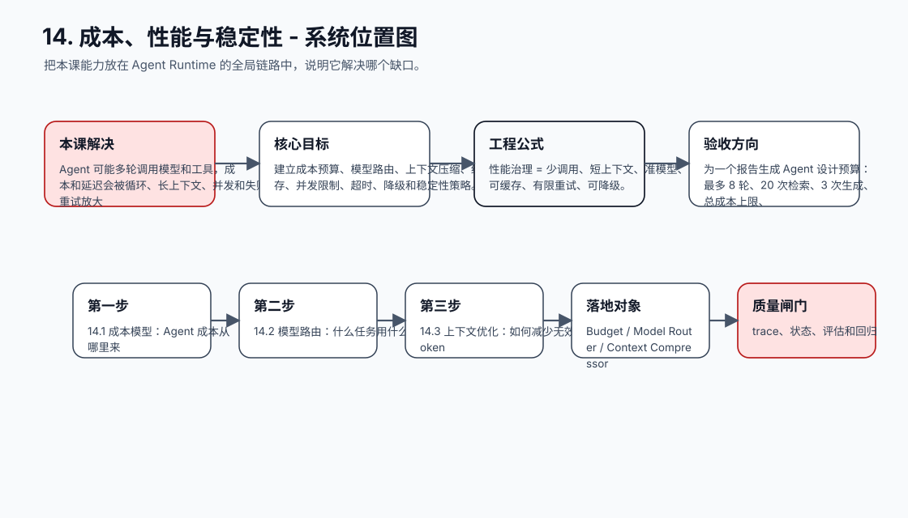
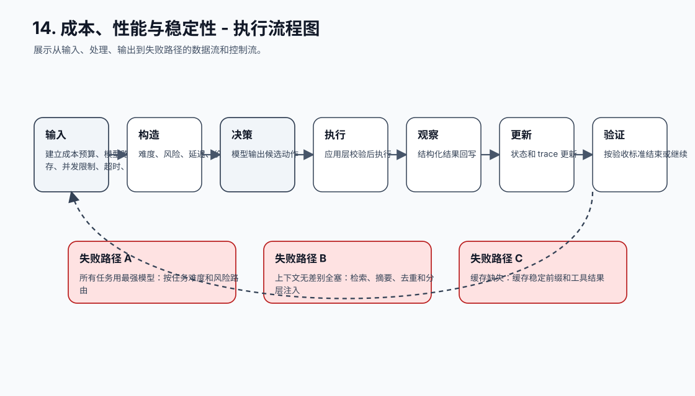
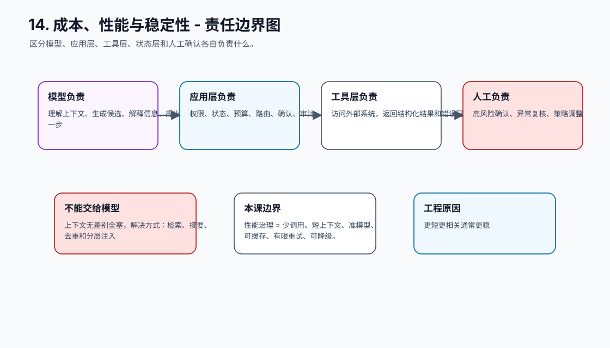
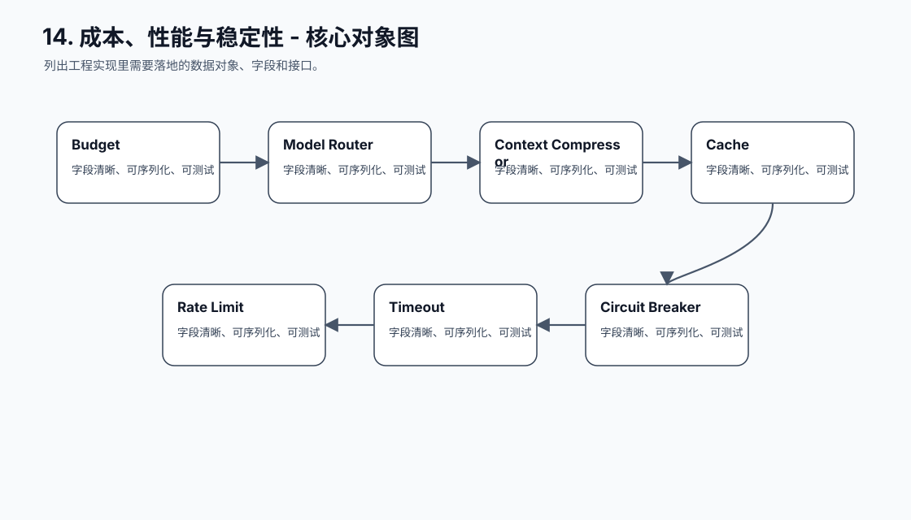
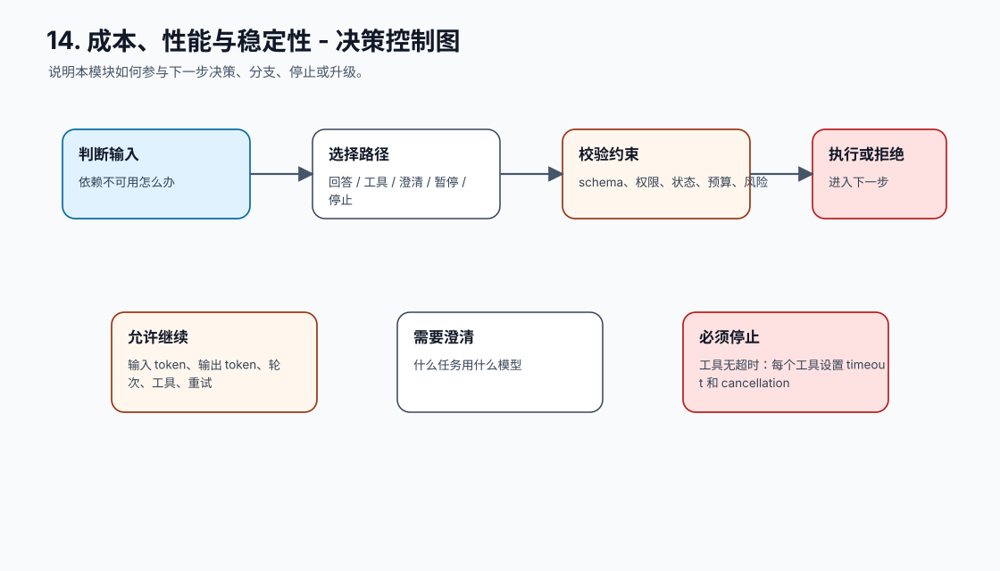
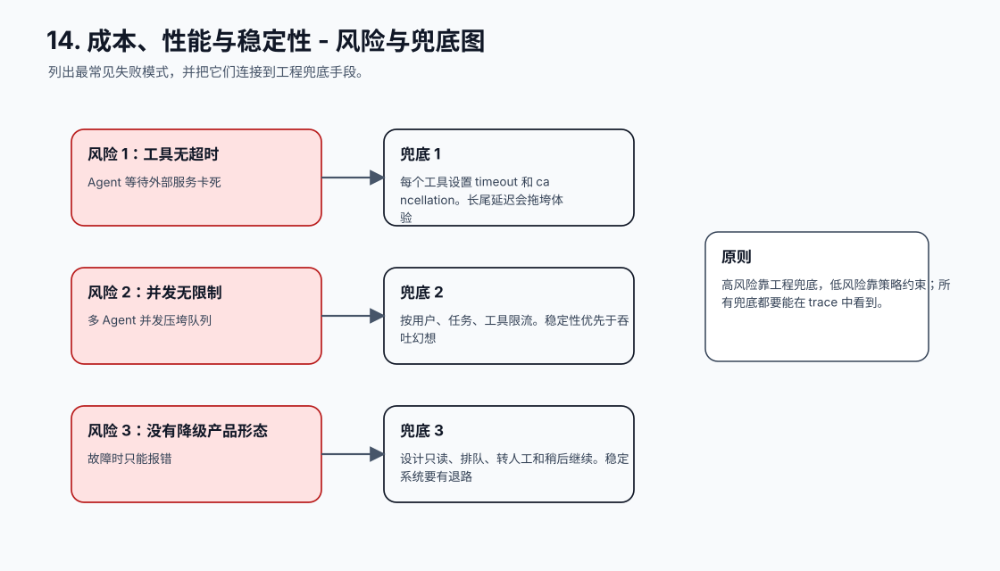
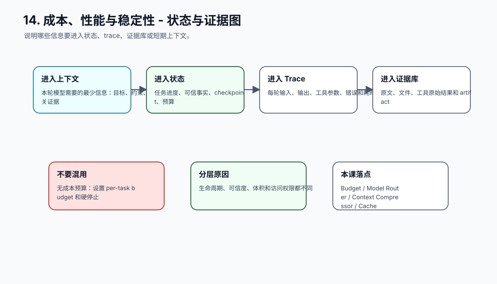
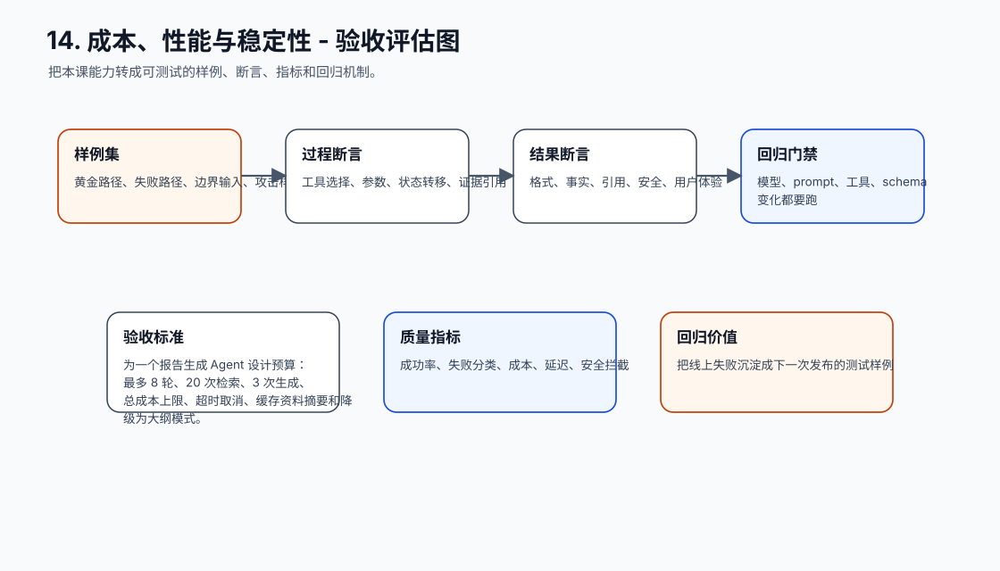
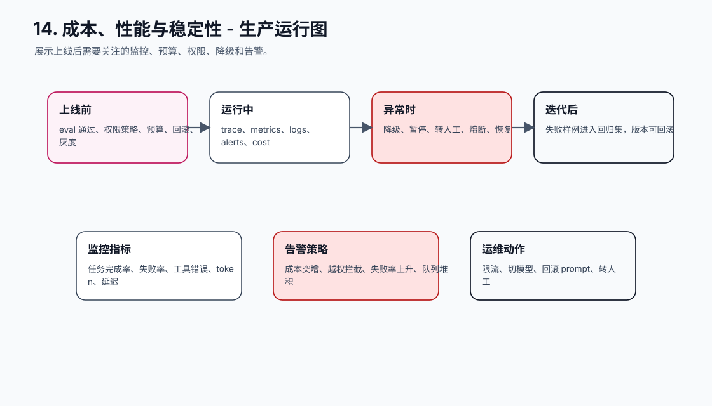
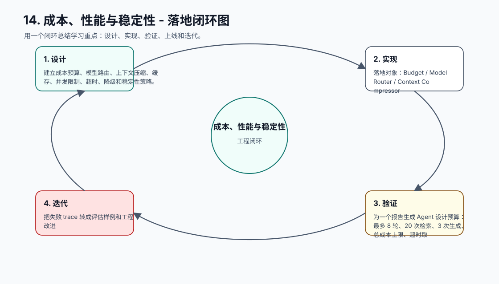

# 14. 成本、性能与稳定性

[返回课程目录](README.md)

## 本课定位

在质量、安全和体验之外，控制 token、模型选择、缓存、并发、超时、降级和重试，让 Agent 可规模化运行。

Agent 可能多轮调用模型和工具，成本和延迟会被循环、长上下文、并发和失败重试放大；没有预算控制就无法上线。

本课的目标是：建立成本预算、模型路由、上下文压缩、缓存、并发限制、超时、降级和稳定性策略。

核心公式：`性能治理 = 少调用、短上下文、准模型、可缓存、有限重试、可降级。`

## 学习目标

- 能解释本课模块解决 Agent 系统里的哪个缺口。
- 能画出本课模块在完整 Agent Runtime 中的位置。
- 能把关键对象、接口、状态和错误路径写成可执行设计。
- 能识别工程中常见失败模式，并给出可落地的兜底方案。
- 能用 trace、评估样例和验收标准证明方案有效。

## 小节拆解

| 小节 | 先回答的问题 | 必须讲透的知识点 | 工程落地要求 | 练习 |
| --- | --- | --- | --- | --- |
| 14.1 成本模型 | Agent 成本从哪里来 | 输入 token、输出 token、轮次、工具、重试 | 对象、接口、状态和错误路径都要能落到代码 | 估算任务成本 |
| 14.2 模型路由 | 什么任务用什么模型 | 难度、风险、延迟、价格、上下文长度 | 对象、接口、状态和错误路径都要能落到代码 | 设计 routing policy |
| 14.3 上下文优化 | 如何减少无效 token | 摘要、检索、去重、缓存、分层 | 对象、接口、状态和错误路径都要能落到代码 | 压缩 context pack |
| 14.4 并发和超时 | 如何防止拖垮系统 | 队列、限流、超时、取消、熔断 | 对象、接口、状态和错误路径都要能落到代码 | 加 rate limit |
| 14.5 降级策略 | 依赖不可用怎么办 | 小模型、固定 workflow、只读模式、人工 | 对象、接口、状态和错误路径都要能落到代码 | 设计 fallback |

## 知识点深拆

### 14.1 成本模型
这一小节先回答：Agent 成本从哪里来。不要从框架名词开始，而要从任务系统缺什么开始理解。对工程团队来说，输入 token、输出 token、轮次、工具、重试 不是概念装饰，而是决定系统能不能被测试、恢复和上线的边界。
落地时先写清输入、输出、状态变化和失败路径。输入要能被 schema 或类型系统描述，输出要能被下游程序校验，状态变化要能进入 trace，失败路径要能转成明确的 stop reason、retry policy 或 human review。
练习：估算任务成本。验收时不要只看模型回答是否自然，要检查 trace 里是否出现正确决策、是否遵守权限和预算、是否在证据不足时选择澄清或拒绝。
### 14.2 模型路由
这一小节先回答：什么任务用什么模型。不要从框架名词开始，而要从任务系统缺什么开始理解。对工程团队来说，难度、风险、延迟、价格、上下文长度 不是概念装饰，而是决定系统能不能被测试、恢复和上线的边界。
落地时先写清输入、输出、状态变化和失败路径。输入要能被 schema 或类型系统描述，输出要能被下游程序校验，状态变化要能进入 trace，失败路径要能转成明确的 stop reason、retry policy 或 human review。
练习：设计 routing policy。验收时不要只看模型回答是否自然，要检查 trace 里是否出现正确决策、是否遵守权限和预算、是否在证据不足时选择澄清或拒绝。
### 14.3 上下文优化
这一小节先回答：如何减少无效 token。不要从框架名词开始，而要从任务系统缺什么开始理解。对工程团队来说，摘要、检索、去重、缓存、分层 不是概念装饰，而是决定系统能不能被测试、恢复和上线的边界。
落地时先写清输入、输出、状态变化和失败路径。输入要能被 schema 或类型系统描述，输出要能被下游程序校验，状态变化要能进入 trace，失败路径要能转成明确的 stop reason、retry policy 或 human review。
练习：压缩 context pack。验收时不要只看模型回答是否自然，要检查 trace 里是否出现正确决策、是否遵守权限和预算、是否在证据不足时选择澄清或拒绝。
### 14.4 并发和超时
这一小节先回答：如何防止拖垮系统。不要从框架名词开始，而要从任务系统缺什么开始理解。对工程团队来说，队列、限流、超时、取消、熔断 不是概念装饰，而是决定系统能不能被测试、恢复和上线的边界。
落地时先写清输入、输出、状态变化和失败路径。输入要能被 schema 或类型系统描述，输出要能被下游程序校验，状态变化要能进入 trace，失败路径要能转成明确的 stop reason、retry policy 或 human review。
练习：加 rate limit。验收时不要只看模型回答是否自然，要检查 trace 里是否出现正确决策、是否遵守权限和预算、是否在证据不足时选择澄清或拒绝。
### 14.5 降级策略
这一小节先回答：依赖不可用怎么办。不要从框架名词开始，而要从任务系统缺什么开始理解。对工程团队来说，小模型、固定 workflow、只读模式、人工 不是概念装饰，而是决定系统能不能被测试、恢复和上线的边界。
落地时先写清输入、输出、状态变化和失败路径。输入要能被 schema 或类型系统描述，输出要能被下游程序校验，状态变化要能进入 trace，失败路径要能转成明确的 stop reason、retry policy 或 human review。
练习：设计 fallback。验收时不要只看模型回答是否自然，要检查 trace 里是否出现正确决策、是否遵守权限和预算、是否在证据不足时选择澄清或拒绝。

## 核心工程对象

| 对象 | 它解决什么 | 落地要求 |
| --- | --- | --- |
| Budget | Budget 是本课需要落地的工程对象，不应该只停留在 Prompt 文本里。 | 有结构、有版本、有校验、有 trace 记录 |
| Model Router | Model Router 是本课需要落地的工程对象，不应该只停留在 Prompt 文本里。 | 有结构、有版本、有校验、有 trace 记录 |
| Context Compressor | Context Compressor 是本课需要落地的工程对象，不应该只停留在 Prompt 文本里。 | 有结构、有版本、有校验、有 trace 记录 |
| Cache | Cache 是本课需要落地的工程对象，不应该只停留在 Prompt 文本里。 | 有结构、有版本、有校验、有 trace 记录 |
| Rate Limit | Rate Limit 是本课需要落地的工程对象，不应该只停留在 Prompt 文本里。 | 有结构、有版本、有校验、有 trace 记录 |
| Timeout | Timeout 是本课需要落地的工程对象，不应该只停留在 Prompt 文本里。 | 有结构、有版本、有校验、有 trace 记录 |
| Circuit Breaker | Circuit Breaker 是本课需要落地的工程对象，不应该只停留在 Prompt 文本里。 | 有结构、有版本、有校验、有 trace 记录 |
| Fallback | Fallback 是本课需要落地的工程对象，不应该只停留在 Prompt 文本里。 | 有结构、有版本、有校验、有 trace 记录 |

## 本课图谱：10 张图讲清楚

下面 10 张图对应本课从宏观定位到生产落地的完整拆解。读图顺序固定为：系统位置、执行流程、责任边界、核心对象、决策控制、风险兜底、状态证据、验收评估、生产运行、落地闭环。

**图 14-1：成本、性能与稳定性 - 系统位置图**  

**图 14-2：成本、性能与稳定性 - 执行流程图**  

**图 14-3：成本、性能与稳定性 - 责任边界图**  

**图 14-4：成本、性能与稳定性 - 核心对象图**  

**图 14-5：成本、性能与稳定性 - 决策控制图**  

**图 14-6：成本、性能与稳定性 - 风险与兜底图**  

**图 14-7：成本、性能与稳定性 - 状态与证据图**  

**图 14-8：成本、性能与稳定性 - 验收评估图**  

**图 14-9：成本、性能与稳定性 - 生产运行图**  

**图 14-10：成本、性能与稳定性 - 落地闭环图**  

## 工程踩坑与处理方式

| 工程坑 | 典型表现 | 解决方式 | 为什么这么做 |
| --- | --- | --- | --- |
| 无成本预算 | 单任务循环烧掉大量 token | 设置 per-task budget 和硬停止 | 预算是产品和工程边界 |
| 所有任务用最强模型 | 简单分类也走昂贵模型 | 按任务难度和风险路由 | 质量成本要匹配 |
| 上下文无差别全塞 | 延迟高且注意力分散 | 检索、摘要、去重和分层注入 | 更短更相关通常更稳 |
| 缓存缺失 | 重复 system prompt 和知识片段反复计费 | 缓存稳定前缀和工具结果 | 减少重复计算 |
| 重试风暴 | 上游限流后所有请求同时重试 | 指数退避、抖动、熔断 | 保护系统和上游服务 |
| 工具无超时 | Agent 等待外部服务卡死 | 每个工具设置 timeout 和 cancellation | 长尾延迟会拖垮体验 |
| 并发无限制 | 多 Agent 并发压垮队列 | 按用户、任务、工具限流 | 稳定性优先于吞吐幻想 |
| 没有降级产品形态 | 故障时只能报错 | 设计只读、排队、转人工和稍后继续 | 稳定系统要有退路 |

## 最小实现闭环

为一个报告生成 Agent 设计预算：最多 8 轮、20 次检索、3 次生成、总成本上限、超时取消、缓存资料摘要和降级为大纲模式。

建议验收方式：

- 至少准备 5 条正常样例、5 条边界样例、3 条失败样例。
- 每条样例都保存输入、模型决策、工具调用、状态变化、最终输出和错误信息。
- 能用程序断言的地方不要只靠人工阅读，例如 schema、状态字段、错误码、引用 id、权限结果和停止原因。
- 修改 prompt、工具 schema、模型参数或状态结构后，必须跑回归样例。

## 章节总结

成本和性能不是上线后才优化的细节，而是 Agent 架构的一部分。循环、上下文和多 Agent 都必须受预算约束。

学完这一课后，应能把它放回完整 Agent 链路里：它接收什么输入，改变什么状态，调用什么能力，产生什么证据，失败时如何停止或恢复，以及上线后如何观测和评估。
