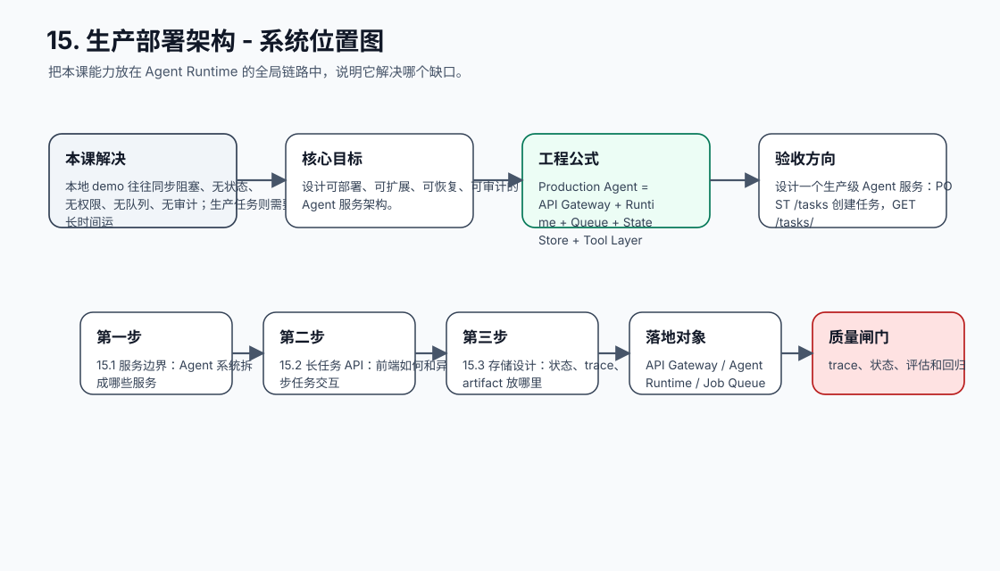
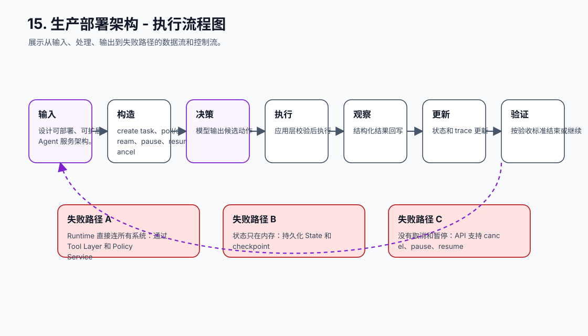
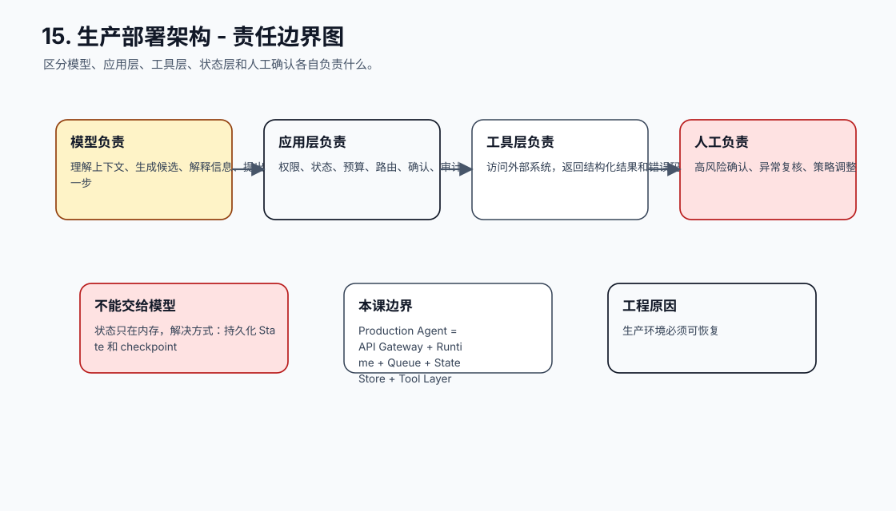
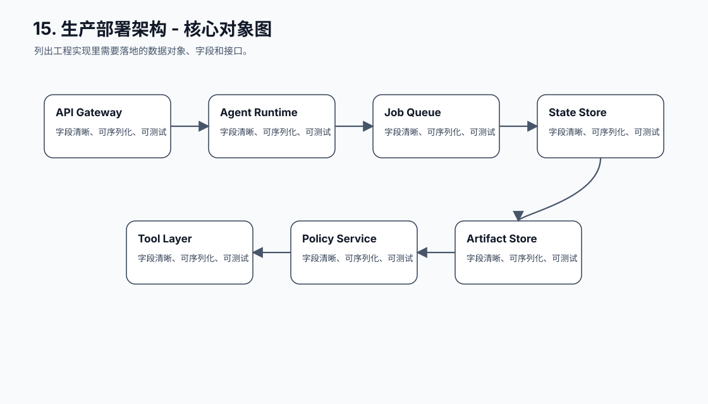
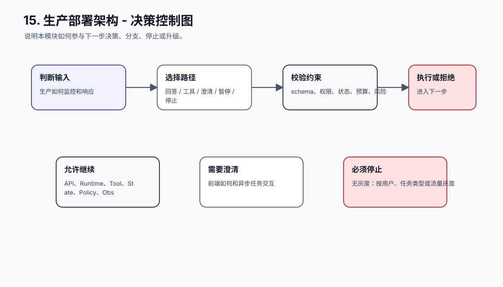
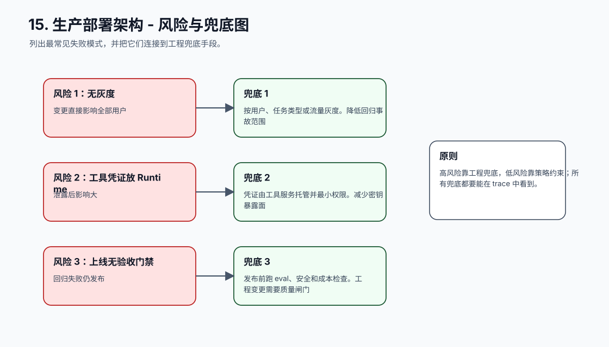
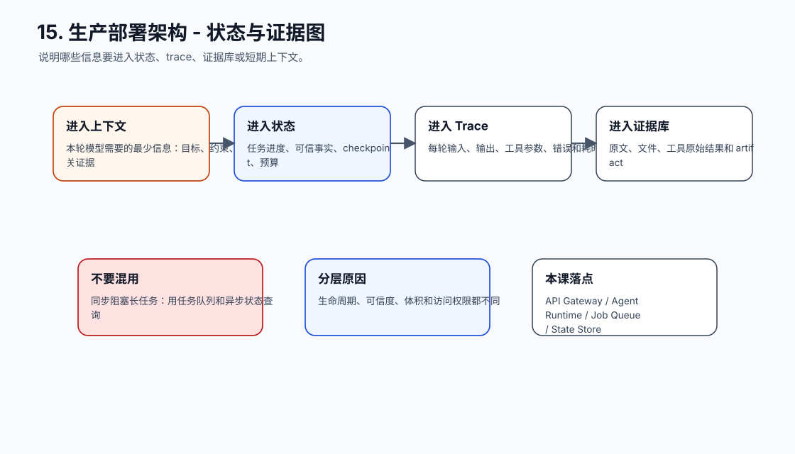
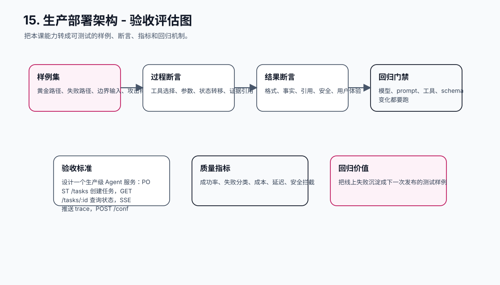
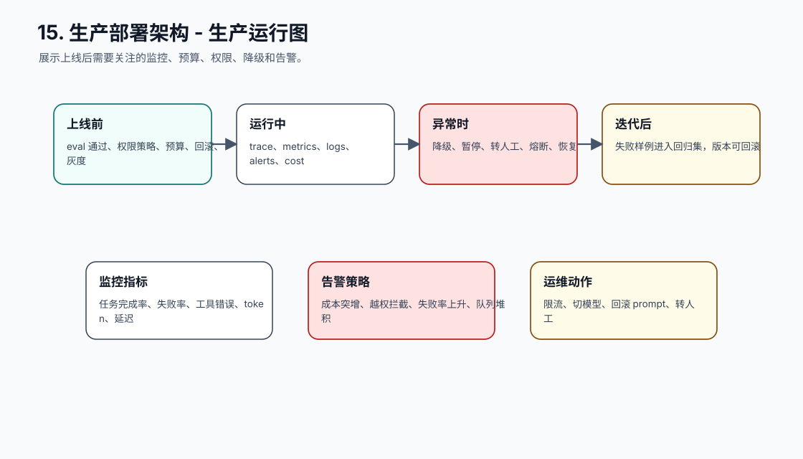
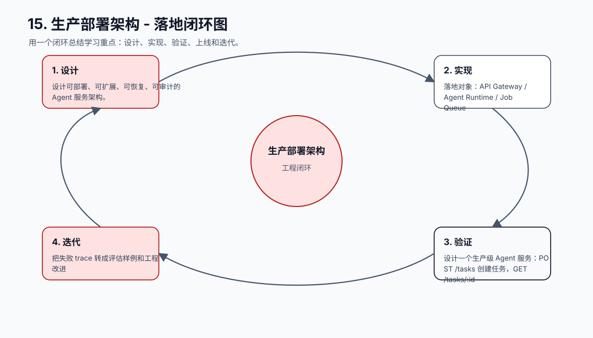

# 15. 生产部署架构

[返回课程目录](README.md)

## 本课定位

把 Agent Runtime 放进真实服务架构：API、队列、工具层、状态存储、对象存储、权限系统、观测系统和发布流程。

本地 demo 往往同步阻塞、无状态、无权限、无队列、无审计；生产任务则需要长时间运行、暂停确认、失败恢复和灰度发布。

本课的目标是：设计可部署、可扩展、可恢复、可审计的 Agent 服务架构。

核心公式：`Production Agent = API Gateway + Runtime + Queue + State Store + Tool Layer + Policy + Observability + Eval Gate。`

## 学习目标

- 能解释本课模块解决 Agent 系统里的哪个缺口。
- 能画出本课模块在完整 Agent Runtime 中的位置。
- 能把关键对象、接口、状态和错误路径写成可执行设计。
- 能识别工程中常见失败模式，并给出可落地的兜底方案。
- 能用 trace、评估样例和验收标准证明方案有效。

## 小节拆解

| 小节 | 先回答的问题 | 必须讲透的知识点 | 工程落地要求 | 练习 |
| --- | --- | --- | --- | --- |
| 15.1 服务边界 | Agent 系统拆成哪些服务 | API、Runtime、Tool、State、Policy、Obs | 对象、接口、状态和错误路径都要能落到代码 | 画部署架构 |
| 15.2 长任务 API | 前端如何和异步任务交互 | create task、poll/stream、pause、resume、cancel | 对象、接口、状态和错误路径都要能落到代码 | 设计 API |
| 15.3 存储设计 | 状态、trace、artifact 放哪里 | 事务库、对象存储、日志系统、向量库 | 对象、接口、状态和错误路径都要能落到代码 | 选存储 |
| 15.4 发布与回滚 | 如何安全上线变更 | 版本、灰度、eval gate、回滚包 | 对象、接口、状态和错误路径都要能落到代码 | 设计发布流程 |
| 15.5 运维与治理 | 生产如何监控和响应 | 告警、限流、人工介入、事故复盘 | 对象、接口、状态和错误路径都要能落到代码 | 写上线清单 |

## 知识点深拆

### 15.1 服务边界
这一小节先回答：Agent 系统拆成哪些服务。不要从框架名词开始，而要从任务系统缺什么开始理解。对工程团队来说，API、Runtime、Tool、State、Policy、Obs 不是概念装饰，而是决定系统能不能被测试、恢复和上线的边界。
落地时先写清输入、输出、状态变化和失败路径。输入要能被 schema 或类型系统描述，输出要能被下游程序校验，状态变化要能进入 trace，失败路径要能转成明确的 stop reason、retry policy 或 human review。
练习：画部署架构。验收时不要只看模型回答是否自然，要检查 trace 里是否出现正确决策、是否遵守权限和预算、是否在证据不足时选择澄清或拒绝。
### 15.2 长任务 API
这一小节先回答：前端如何和异步任务交互。不要从框架名词开始，而要从任务系统缺什么开始理解。对工程团队来说，create task、poll/stream、pause、resume、cancel 不是概念装饰，而是决定系统能不能被测试、恢复和上线的边界。
落地时先写清输入、输出、状态变化和失败路径。输入要能被 schema 或类型系统描述，输出要能被下游程序校验，状态变化要能进入 trace，失败路径要能转成明确的 stop reason、retry policy 或 human review。
练习：设计 API。验收时不要只看模型回答是否自然，要检查 trace 里是否出现正确决策、是否遵守权限和预算、是否在证据不足时选择澄清或拒绝。
### 15.3 存储设计
这一小节先回答：状态、trace、artifact 放哪里。不要从框架名词开始，而要从任务系统缺什么开始理解。对工程团队来说，事务库、对象存储、日志系统、向量库 不是概念装饰，而是决定系统能不能被测试、恢复和上线的边界。
落地时先写清输入、输出、状态变化和失败路径。输入要能被 schema 或类型系统描述，输出要能被下游程序校验，状态变化要能进入 trace，失败路径要能转成明确的 stop reason、retry policy 或 human review。
练习：选存储。验收时不要只看模型回答是否自然，要检查 trace 里是否出现正确决策、是否遵守权限和预算、是否在证据不足时选择澄清或拒绝。
### 15.4 发布与回滚
这一小节先回答：如何安全上线变更。不要从框架名词开始，而要从任务系统缺什么开始理解。对工程团队来说，版本、灰度、eval gate、回滚包 不是概念装饰，而是决定系统能不能被测试、恢复和上线的边界。
落地时先写清输入、输出、状态变化和失败路径。输入要能被 schema 或类型系统描述，输出要能被下游程序校验，状态变化要能进入 trace，失败路径要能转成明确的 stop reason、retry policy 或 human review。
练习：设计发布流程。验收时不要只看模型回答是否自然，要检查 trace 里是否出现正确决策、是否遵守权限和预算、是否在证据不足时选择澄清或拒绝。
### 15.5 运维与治理
这一小节先回答：生产如何监控和响应。不要从框架名词开始，而要从任务系统缺什么开始理解。对工程团队来说，告警、限流、人工介入、事故复盘 不是概念装饰，而是决定系统能不能被测试、恢复和上线的边界。
落地时先写清输入、输出、状态变化和失败路径。输入要能被 schema 或类型系统描述，输出要能被下游程序校验，状态变化要能进入 trace，失败路径要能转成明确的 stop reason、retry policy 或 human review。
练习：写上线清单。验收时不要只看模型回答是否自然，要检查 trace 里是否出现正确决策、是否遵守权限和预算、是否在证据不足时选择澄清或拒绝。

## 核心工程对象

| 对象 | 它解决什么 | 落地要求 |
| --- | --- | --- |
| API Gateway | API Gateway 是本课需要落地的工程对象，不应该只停留在 Prompt 文本里。 | 有结构、有版本、有校验、有 trace 记录 |
| Agent Runtime | Agent Runtime 是本课需要落地的工程对象，不应该只停留在 Prompt 文本里。 | 有结构、有版本、有校验、有 trace 记录 |
| Job Queue | Job Queue 是本课需要落地的工程对象，不应该只停留在 Prompt 文本里。 | 有结构、有版本、有校验、有 trace 记录 |
| State Store | State Store 是本课需要落地的工程对象，不应该只停留在 Prompt 文本里。 | 有结构、有版本、有校验、有 trace 记录 |
| Tool Layer | Tool Layer 是本课需要落地的工程对象，不应该只停留在 Prompt 文本里。 | 有结构、有版本、有校验、有 trace 记录 |
| Policy Service | Policy Service 是本课需要落地的工程对象，不应该只停留在 Prompt 文本里。 | 有结构、有版本、有校验、有 trace 记录 |
| Artifact Store | Artifact Store 是本课需要落地的工程对象，不应该只停留在 Prompt 文本里。 | 有结构、有版本、有校验、有 trace 记录 |
| Deployment Pipeline | Deployment Pipeline 是本课需要落地的工程对象，不应该只停留在 Prompt 文本里。 | 有结构、有版本、有校验、有 trace 记录 |

## 本课图谱：10 张图讲清楚

下面 10 张图对应本课从宏观定位到生产落地的完整拆解。读图顺序固定为：系统位置、执行流程、责任边界、核心对象、决策控制、风险兜底、状态证据、验收评估、生产运行、落地闭环。

**图 15-1：生产部署架构 - 系统位置图**  

**图 15-2：生产部署架构 - 执行流程图**  

**图 15-3：生产部署架构 - 责任边界图**  

**图 15-4：生产部署架构 - 核心对象图**  

**图 15-5：生产部署架构 - 决策控制图**  

**图 15-6：生产部署架构 - 风险与兜底图**  

**图 15-7：生产部署架构 - 状态与证据图**  

**图 15-8：生产部署架构 - 验收评估图**  

**图 15-9：生产部署架构 - 生产运行图**  

**图 15-10：生产部署架构 - 落地闭环图**  

## 工程踩坑与处理方式

| 工程坑 | 典型表现 | 解决方式 | 为什么这么做 |
| --- | --- | --- | --- |
| 同步阻塞长任务 | HTTP 超时后任务状态丢失 | 用任务队列和异步状态查询 | 长任务需要后台执行 |
| Runtime 直接连所有系统 | 权限和审计散落各处 | 通过 Tool Layer 和 Policy Service | 集中控制工具边界 |
| 状态只在内存 | 进程重启任务丢失 | 持久化 State 和 checkpoint | 生产环境必须可恢复 |
| 没有取消和暂停 | 用户无法停止错误任务 | API 支持 cancel、pause、resume | 用户控制是安全边界 |
| 发布只改 prompt | 模型、prompt、tool schema 不一致 | 把版本作为发布单元 | Agent 行为由多组件共同决定 |
| 无灰度 | 变更直接影响全部用户 | 按用户、任务类型或流量灰度 | 降低回归事故范围 |
| 工具凭证放 Runtime | 泄露后影响大 | 凭证由工具服务托管并最小权限 | 减少密钥暴露面 |
| 上线无验收门禁 | 回归失败仍发布 | 发布前跑 eval、安全和成本检查 | 工程变更需要质量闸门 |

## 最小实现闭环

设计一个生产级 Agent 服务：POST /tasks 创建任务，GET /tasks/:id 查询状态，SSE 推送 trace，POST /confirm 执行确认，支持失败恢复和灰度发布。

建议验收方式：

- 至少准备 5 条正常样例、5 条边界样例、3 条失败样例。
- 每条样例都保存输入、模型决策、工具调用、状态变化、最终输出和错误信息。
- 能用程序断言的地方不要只靠人工阅读，例如 schema、状态字段、错误码、引用 id、权限结果和停止原因。
- 修改 prompt、工具 schema、模型参数或状态结构后，必须跑回归样例。

## 章节总结

生产部署的重点不是把 demo 放到服务器，而是把 Agent 放进可运维的系统边界里。队列、状态、权限、观测和发布流程缺一不可。

学完这一课后，应能把它放回完整 Agent 链路里：它接收什么输入，改变什么状态，调用什么能力，产生什么证据，失败时如何停止或恢复，以及上线后如何观测和评估。
