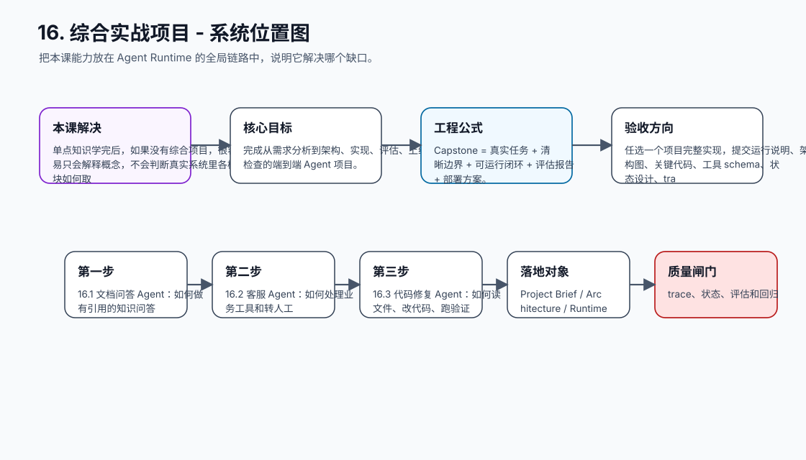
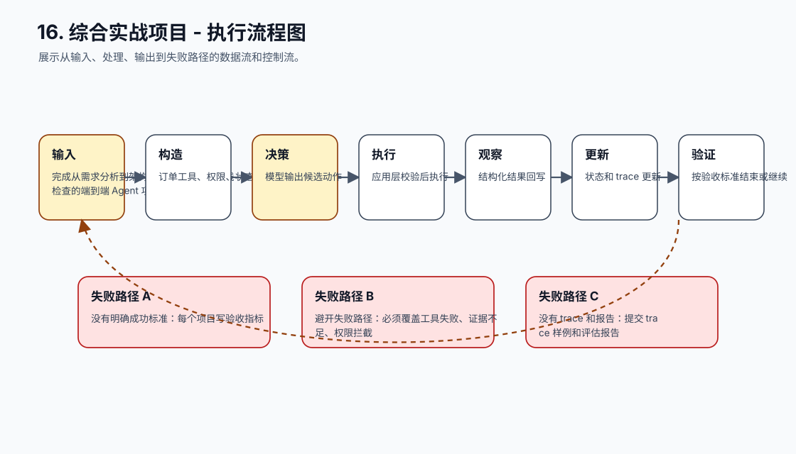
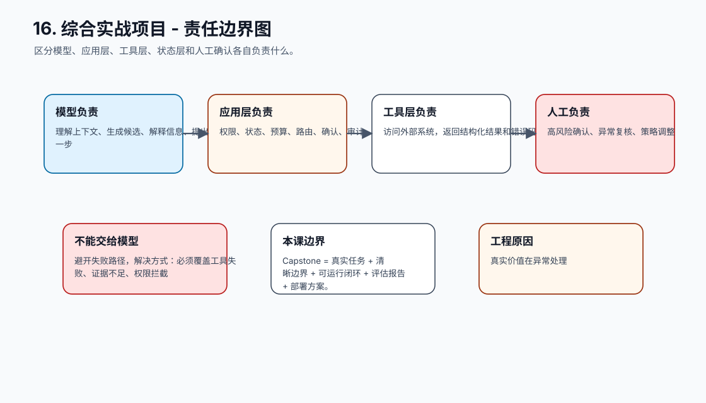
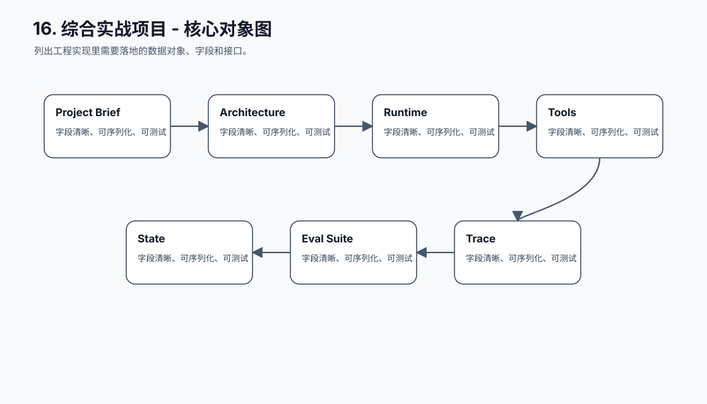
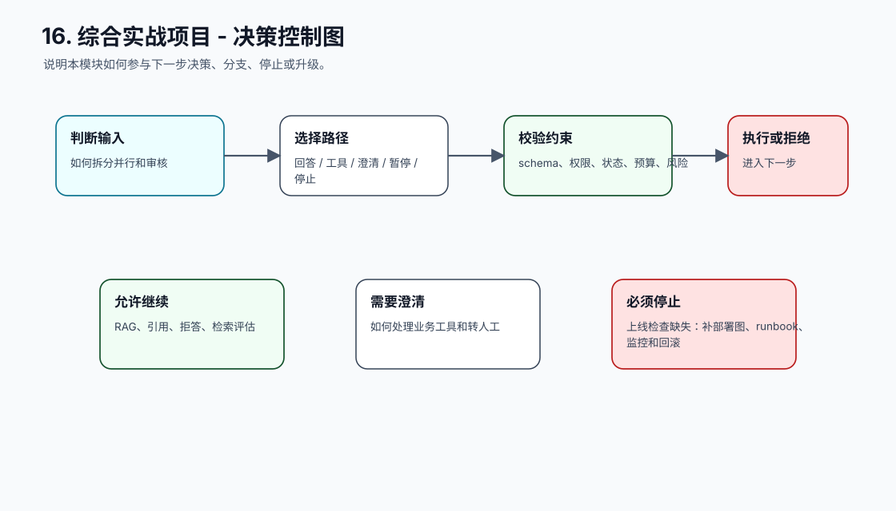
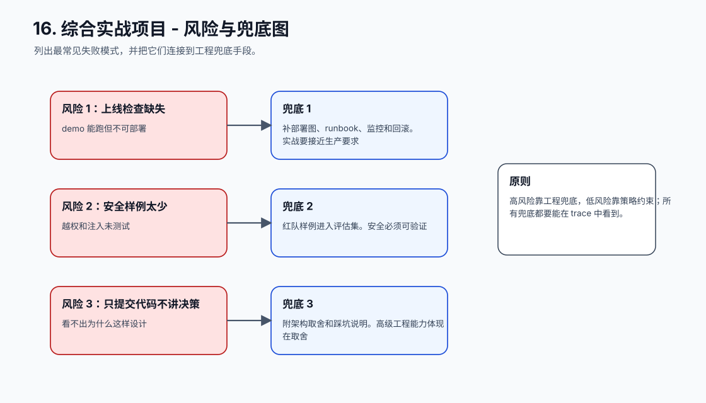
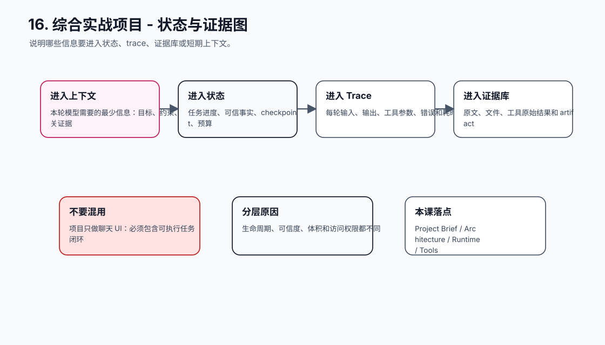
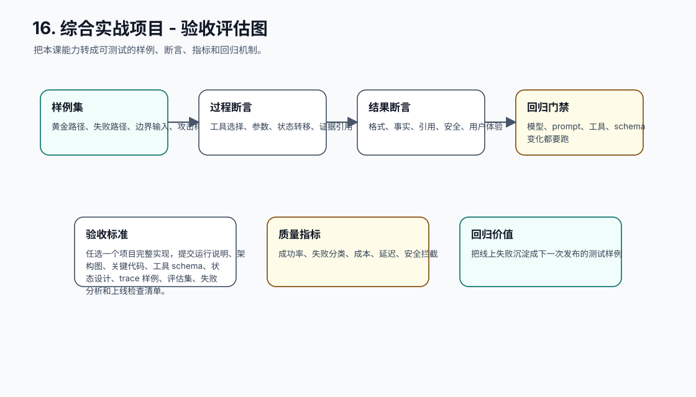
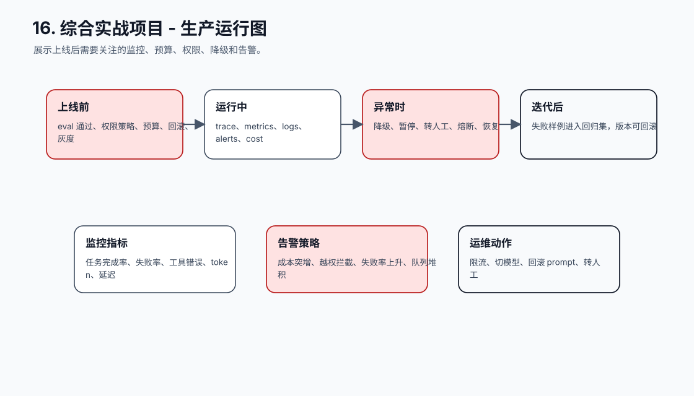
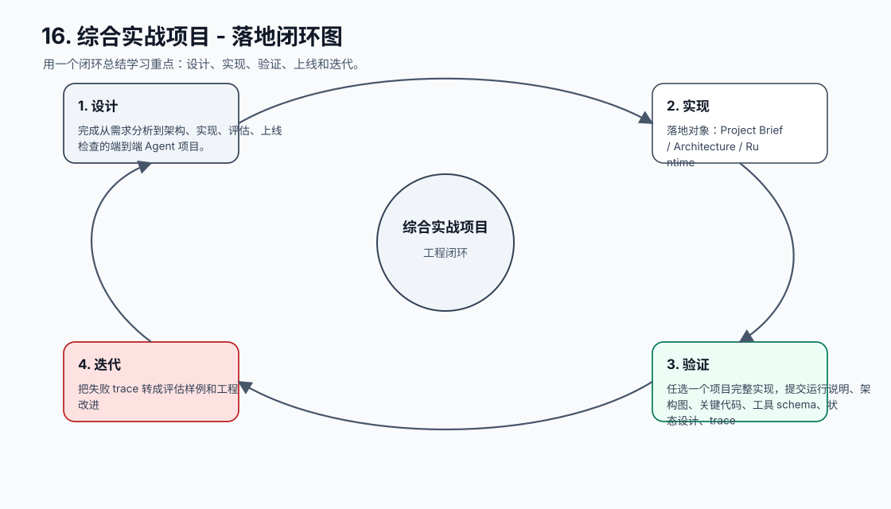

# 16. 综合实战项目

[返回课程目录](README.md)

## 本课定位

用完整项目把模型调用、Prompt、工具、状态、记忆、RAG、规划、安全、评估、观测和部署串成真实闭环。

单点知识学完后，如果没有综合项目，很容易只会解释概念，不会判断真实系统里各模块如何取舍和协同。

本课的目标是：完成从需求分析到架构、实现、评估、上线检查的端到端 Agent 项目。

核心公式：`Capstone = 真实任务 + 清晰边界 + 可运行闭环 + 评估报告 + 部署方案。`

## 学习目标

- 能解释本课模块解决 Agent 系统里的哪个缺口。
- 能画出本课模块在完整 Agent Runtime 中的位置。
- 能把关键对象、接口、状态和错误路径写成可执行设计。
- 能识别工程中常见失败模式，并给出可落地的兜底方案。
- 能用 trace、评估样例和验收标准证明方案有效。

## 小节拆解

| 小节 | 先回答的问题 | 必须讲透的知识点 | 工程落地要求 | 练习 |
| --- | --- | --- | --- | --- |
| 16.1 文档问答 Agent | 如何做有引用的知识问答 | RAG、引用、拒答、检索评估 | 对象、接口、状态和错误路径都要能落到代码 | 实现文档问答 |
| 16.2 客服 Agent | 如何处理业务工具和转人工 | 订单工具、权限、状态、话术、评估 | 对象、接口、状态和错误路径都要能落到代码 | 实现客服闭环 |
| 16.3 代码修复 Agent | 如何读文件、改代码、跑验证 | 文件工具、计划、补丁、测试、回滚 | 对象、接口、状态和错误路径都要能落到代码 | 实现代码修复 |
| 16.4 研究报告 Agent | 如何做长任务和资料合成 | 规划、检索、草稿、审核、artifact | 对象、接口、状态和错误路径都要能落到代码 | 实现报告生成 |
| 16.5 多 Agent 协作 | 如何拆分并行和审核 | 主管、执行、验证、合并、trace | 对象、接口、状态和错误路径都要能落到代码 | 实现多角色工作流 |

## 知识点深拆

### 16.1 文档问答 Agent
这一小节先回答：如何做有引用的知识问答。不要从框架名词开始，而要从任务系统缺什么开始理解。对工程团队来说，RAG、引用、拒答、检索评估 不是概念装饰，而是决定系统能不能被测试、恢复和上线的边界。
落地时先写清输入、输出、状态变化和失败路径。输入要能被 schema 或类型系统描述，输出要能被下游程序校验，状态变化要能进入 trace，失败路径要能转成明确的 stop reason、retry policy 或 human review。
练习：实现文档问答。验收时不要只看模型回答是否自然，要检查 trace 里是否出现正确决策、是否遵守权限和预算、是否在证据不足时选择澄清或拒绝。
### 16.2 客服 Agent
这一小节先回答：如何处理业务工具和转人工。不要从框架名词开始，而要从任务系统缺什么开始理解。对工程团队来说，订单工具、权限、状态、话术、评估 不是概念装饰，而是决定系统能不能被测试、恢复和上线的边界。
落地时先写清输入、输出、状态变化和失败路径。输入要能被 schema 或类型系统描述，输出要能被下游程序校验，状态变化要能进入 trace，失败路径要能转成明确的 stop reason、retry policy 或 human review。
练习：实现客服闭环。验收时不要只看模型回答是否自然，要检查 trace 里是否出现正确决策、是否遵守权限和预算、是否在证据不足时选择澄清或拒绝。
### 16.3 代码修复 Agent
这一小节先回答：如何读文件、改代码、跑验证。不要从框架名词开始，而要从任务系统缺什么开始理解。对工程团队来说，文件工具、计划、补丁、测试、回滚 不是概念装饰，而是决定系统能不能被测试、恢复和上线的边界。
落地时先写清输入、输出、状态变化和失败路径。输入要能被 schema 或类型系统描述，输出要能被下游程序校验，状态变化要能进入 trace，失败路径要能转成明确的 stop reason、retry policy 或 human review。
练习：实现代码修复。验收时不要只看模型回答是否自然，要检查 trace 里是否出现正确决策、是否遵守权限和预算、是否在证据不足时选择澄清或拒绝。
### 16.4 研究报告 Agent
这一小节先回答：如何做长任务和资料合成。不要从框架名词开始，而要从任务系统缺什么开始理解。对工程团队来说，规划、检索、草稿、审核、artifact 不是概念装饰，而是决定系统能不能被测试、恢复和上线的边界。
落地时先写清输入、输出、状态变化和失败路径。输入要能被 schema 或类型系统描述，输出要能被下游程序校验，状态变化要能进入 trace，失败路径要能转成明确的 stop reason、retry policy 或 human review。
练习：实现报告生成。验收时不要只看模型回答是否自然，要检查 trace 里是否出现正确决策、是否遵守权限和预算、是否在证据不足时选择澄清或拒绝。
### 16.5 多 Agent 协作
这一小节先回答：如何拆分并行和审核。不要从框架名词开始，而要从任务系统缺什么开始理解。对工程团队来说，主管、执行、验证、合并、trace 不是概念装饰，而是决定系统能不能被测试、恢复和上线的边界。
落地时先写清输入、输出、状态变化和失败路径。输入要能被 schema 或类型系统描述，输出要能被下游程序校验，状态变化要能进入 trace，失败路径要能转成明确的 stop reason、retry policy 或 human review。
练习：实现多角色工作流。验收时不要只看模型回答是否自然，要检查 trace 里是否出现正确决策、是否遵守权限和预算、是否在证据不足时选择澄清或拒绝。

## 核心工程对象

| 对象 | 它解决什么 | 落地要求 |
| --- | --- | --- |
| Project Brief | Project Brief 是本课需要落地的工程对象，不应该只停留在 Prompt 文本里。 | 有结构、有版本、有校验、有 trace 记录 |
| Architecture | Architecture 是本课需要落地的工程对象，不应该只停留在 Prompt 文本里。 | 有结构、有版本、有校验、有 trace 记录 |
| Runtime | Runtime 是本课需要落地的工程对象，不应该只停留在 Prompt 文本里。 | 有结构、有版本、有校验、有 trace 记录 |
| Tools | Tools 是本课需要落地的工程对象，不应该只停留在 Prompt 文本里。 | 有结构、有版本、有校验、有 trace 记录 |
| State | State 是本课需要落地的工程对象，不应该只停留在 Prompt 文本里。 | 有结构、有版本、有校验、有 trace 记录 |
| Eval Suite | Eval Suite 是本课需要落地的工程对象，不应该只停留在 Prompt 文本里。 | 有结构、有版本、有校验、有 trace 记录 |
| Trace | Trace 是本课需要落地的工程对象，不应该只停留在 Prompt 文本里。 | 有结构、有版本、有校验、有 trace 记录 |
| Runbook | Runbook 是本课需要落地的工程对象，不应该只停留在 Prompt 文本里。 | 有结构、有版本、有校验、有 trace 记录 |

## 本课图谱：10 张图讲清楚

下面 10 张图对应本课从宏观定位到生产落地的完整拆解。读图顺序固定为：系统位置、执行流程、责任边界、核心对象、决策控制、风险兜底、状态证据、验收评估、生产运行、落地闭环。

**图 16-1：综合实战项目 - 系统位置图**  

**图 16-2：综合实战项目 - 执行流程图**  

**图 16-3：综合实战项目 - 责任边界图**  

**图 16-4：综合实战项目 - 核心对象图**  

**图 16-5：综合实战项目 - 决策控制图**  

**图 16-6：综合实战项目 - 风险与兜底图**  

**图 16-7：综合实战项目 - 状态与证据图**  

**图 16-8：综合实战项目 - 验收评估图**  

**图 16-9：综合实战项目 - 生产运行图**  

**图 16-10：综合实战项目 - 落地闭环图**  

## 工程踩坑与处理方式

| 工程坑 | 典型表现 | 解决方式 | 为什么这么做 |
| --- | --- | --- | --- |
| 项目只做聊天 UI | 没有工具、状态和评估 | 必须包含可执行任务闭环 | 课程目标是工程落地 |
| 没有明确成功标准 | 展示时靠主观感觉 | 每个项目写验收指标 | 综合项目要可评分 |
| 避开失败路径 | 只演示顺利样例 | 必须覆盖工具失败、证据不足、权限拦截 | 真实价值在异常处理 |
| 没有 trace 和报告 | 无法复盘过程 | 提交 trace 样例和评估报告 | 工程成果需要证据 |
| 所有项目同一架构 | 不按场景取舍 | 按风险、时长、工具和证据设计架构 | Agent 架构没有万能模板 |
| 上线检查缺失 | demo 能跑但不可部署 | 补部署图、runbook、监控和回滚 | 实战要接近生产要求 |
| 安全样例太少 | 越权和注入未测试 | 红队样例进入评估集 | 安全必须可验证 |
| 只提交代码不讲决策 | 看不出为什么这样设计 | 附架构取舍和踩坑说明 | 高级工程能力体现在取舍 |

## 最小实现闭环

任选一个项目完整实现，提交运行说明、架构图、关键代码、工具 schema、状态设计、trace 样例、评估集、失败分析和上线检查清单。

建议验收方式：

- 至少准备 5 条正常样例、5 条边界样例、3 条失败样例。
- 每条样例都保存输入、模型决策、工具调用、状态变化、最终输出和错误信息。
- 能用程序断言的地方不要只靠人工阅读，例如 schema、状态字段、错误码、引用 id、权限结果和停止原因。
- 修改 prompt、工具 schema、模型参数或状态结构后，必须跑回归样例。

## 章节总结

综合实战用于检验你是否真正理解 Agent 工程：不是知道每个模块的名字，而是能在一个具体任务里把模块放到正确位置，并解释取舍。

学完这一课后，应能把它放回完整 Agent 链路里：它接收什么输入，改变什么状态，调用什么能力，产生什么证据，失败时如何停止或恢复，以及上线后如何观测和评估。
