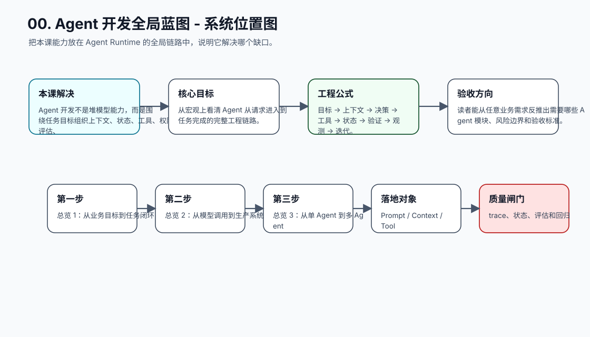
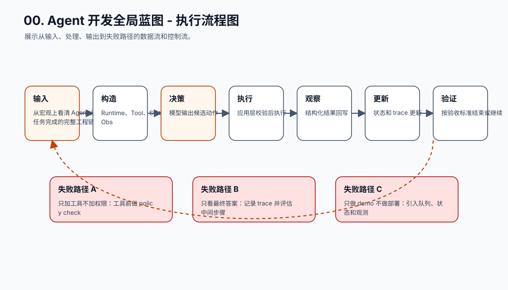
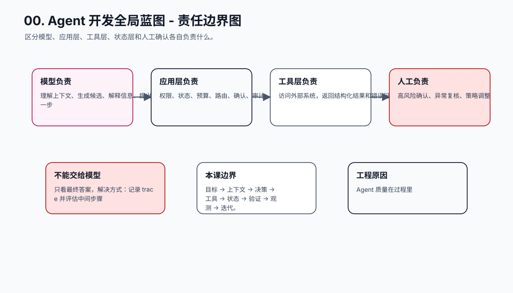
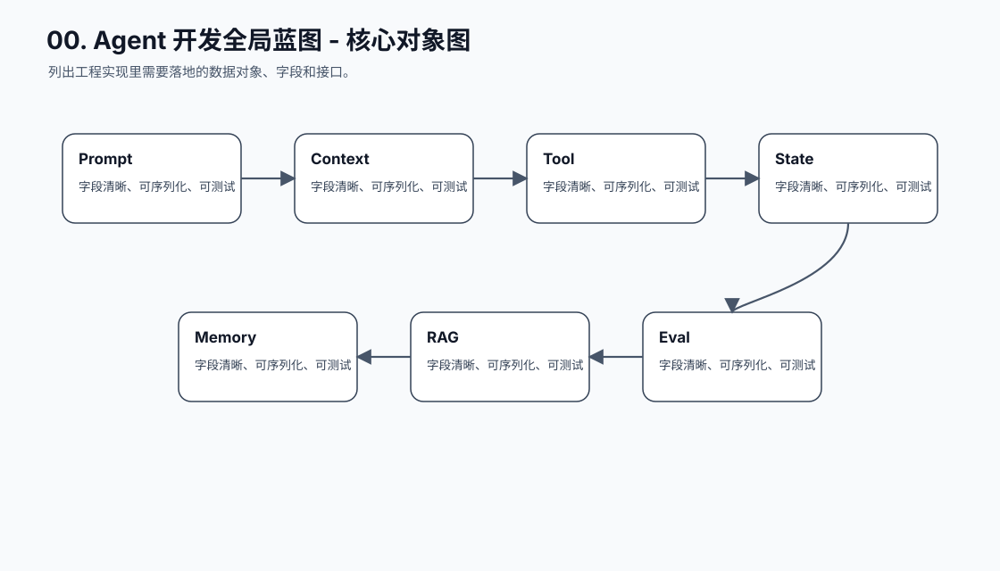
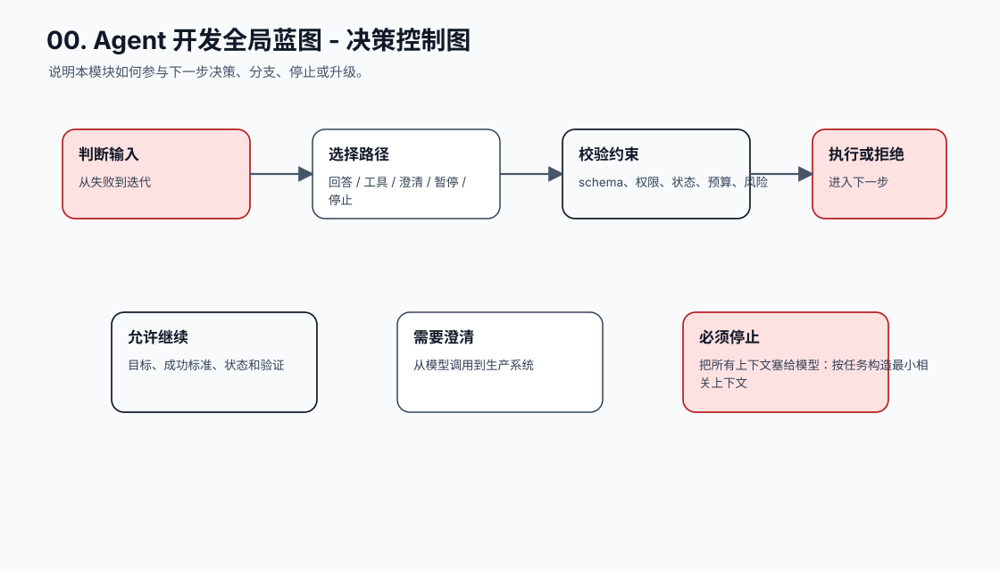
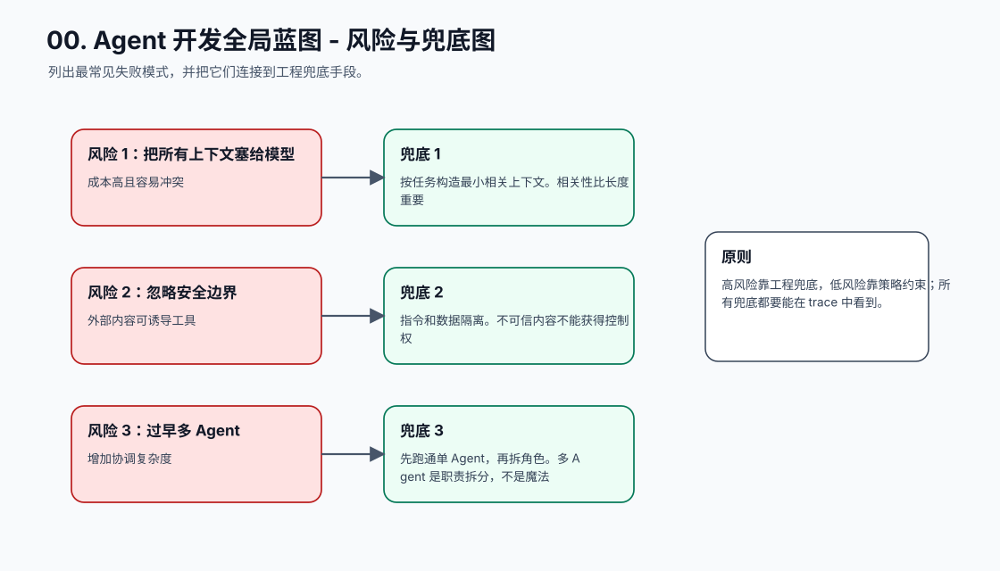
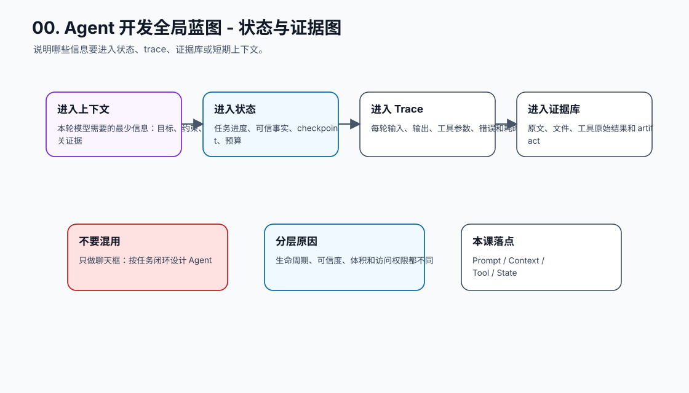
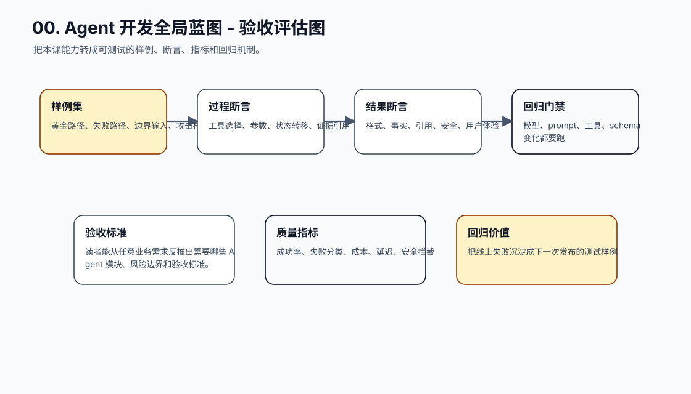
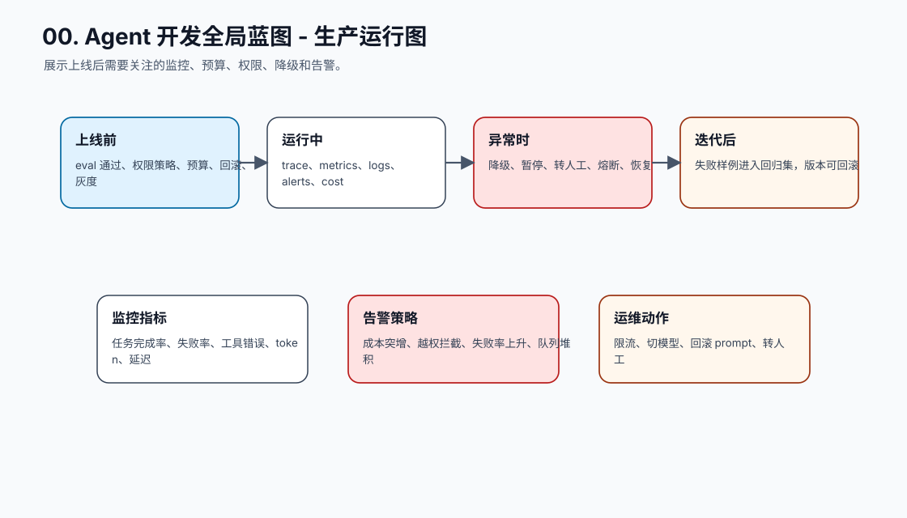
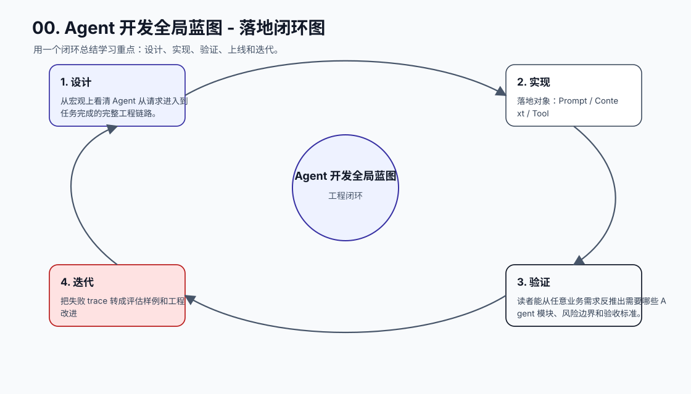

# Agent 开发课程系列：从模型调用到生产级 Agent

[返回全局摘要](../README.md)

这套课程把 Agent 开发拆成一条由浅入深的工程主线：先理解模型调用，再逐步补齐 Prompt、工具、控制循环、状态、记忆、RAG、规划、多 Agent、安全、评估、可观测性、成本性能和生产部署。目标不是堆术语，而是让读者能回答三个问题：系统为什么能推进任务，失败会发生在哪里，工程上怎么兜底和验证。

本课程把 16 课作为 Agent 开发章节的 16 个可读小节。每一课都补齐 10 张工程图、知识点深拆、踩坑表、最小实现闭环和章节总结，形成“宏观全局 -> 单点拆解 -> 工程验证 -> 综合实战”的学习路径。

## 宏观全局：Agent 开发到底在开发什么

Agent 开发不是训练一个新模型，也不是写一个更长的 Prompt。它是在模型外面搭一个任务执行系统：模型负责理解上下文、生成候选计划、选择下一步和组织语言；工程系统负责提供事实、保存状态、执行工具、控制权限、记录过程、验证结果和处理失败。

```text
业务目标
-> 任务对象 Task
-> 上下文构造 Context Builder
-> 模型决策 Model Decision
-> 工具 / Workflow / MCP 执行
-> 观察结果 Observation
-> 状态更新 State Update
-> 验证 Verifier
-> 输出、继续、暂停、转人工或失败恢复
```

这条链路里的关键判断是：凡是会影响钱、权限、数据、生产系统、用户信任或合规风险的动作，都不能只靠模型“听话”。模型可以提出意图，系统必须校验、确认、执行、记录和验证。

## 10 张全局图谱

**图 1：Agent 开发课程 - 系统位置图**  


**图 2：Agent 开发课程 - 执行流程图**  


**图 3：Agent 开发课程 - 责任边界图**  


**图 4：Agent 开发课程 - 核心对象图**  


**图 5：Agent 开发课程 - 决策控制图**  


**图 6：Agent 开发课程 - 风险与兜底图**  


**图 7：Agent 开发课程 - 状态与证据图**  


**图 8：Agent 开发课程 - 验收评估图**  


**图 9：Agent 开发课程 - 生产运行图**  


**图 10：Agent 开发课程 - 落地闭环图**  


## 课程目标

学完后，学员应该能独立完成这些工作：

- 设计一个可控的 Agent 控制循环。
- 为工具调用定义 schema、权限、错误和审计边界。
- 区分上下文、记忆、任务状态和业务数据。
- 为 RAG 系统设计切片、检索、重排、引用和拒答策略。
- 为长任务设计状态机、队列、恢复和用户确认。
- 为 Agent 建立测试集、轨迹日志、回归评估和线上监控。
- 在成本、延迟、安全和任务完成率之间做工程取舍。

## 学习主线

| 阶段 | 课程 | 先解决什么 | 学完后的能力 |
| --- | --- | --- | --- |
| 入门边界 | 01-03 | Agent 是什么、模型如何调用、Prompt 如何工程化 | 能写出稳定的模型调用层和任务指令 |
| 执行闭环 | 04-06 | 工具、循环、状态如何协同 | 能让 Agent 真正推进任务并可恢复 |
| 知识与长期性 | 07-09 | 记忆、RAG、规划如何补齐上下文和长任务 | 能处理跨轮、跨文档和多步骤任务 |
| 复杂协作与安全 | 10-11 | 多 Agent 如何拆分，安全权限如何兜底 | 能在复杂任务里控制职责、风险和权限 |
| 质量与上线 | 12-15 | 评估、观测、性能、部署如何支撑生产 | 能用数据证明质量并稳定运行 |
| 综合实战 | 16 | 把所有能力组合成项目 | 能完成端到端 Agent 工程方案 |

## 总体路径

| 序号 | 模块 | 核心能力 | 关键工程问题 |
| --- | --- | --- | --- |
| 01 | [Agent 本质与边界](01-agent-foundation.md) | 区分 LLM、Workflow 和 Agent，建立工程边界 | 模型能做什么，系统必须兜底什么 |
| 02 | [大模型调用基础](02-model-calling.md) | 掌握消息、参数、上下文、流式和结构化输出 | 调用层如何稳定、可观测、可替换 |
| 03 | [Prompt 与指令工程](03-prompt-engineering.md) | 把任务、上下文、约束和输出格式变成可维护指令 | Prompt 如何版本化、分层和回归 |
| 04 | [工具调用 Tool Calling](04-tool-calling.md) | 设计小而清晰的工具接口，处理权限和错误 | 模型意图如何安全变成真实动作 |
| 05 | [Agent 控制循环](05-agent-loop.md) | 实现 ReAct、循环控制、停止条件和失败恢复 | Agent 如何继续、停止、重试或暂停 |
| 06 | [状态管理 State](06-state-management.md) | 用确定性状态记录任务进度，而不是依赖聊天历史 | 中断、并发、重试时如何不丢进度 |
| 07 | [记忆系统 Memory](07-memory-system.md) | 设计短期、长期、工作和外部记忆的写入与检索策略 | 什么信息值得长期保存，如何避免污染 |
| 08 | [RAG 检索增强生成](08-rag.md) | 建立从文档到答案的证据链 | 如何检索、引用、拒答和评估证据 |
| 09 | [规划 Planning](09-planning.md) | 把复杂目标拆成可执行、可验证、可更新的计划 | 长任务如何有检查点和重规划机制 |
| 10 | [多 Agent 系统](10-multi-agent.md) | 设计主管、执行、审核和并行协作边界 | 多角色如何 handoff、合并和测试 |
| 11 | [安全与权限](11-security-permission.md) | 防 Prompt Injection、越权工具调用和敏感信息泄露 | 信任边界如何从 Prompt 移到工程系统 |
| 12 | [评估 Evaluation](12-evaluation.md) | 用测试集、轨迹评估和回归机制衡量 Agent 质量 | 如何评估最终答案和中间过程 |
| 13 | [可观测性 Observability](13-observability.md) | 记录 request、trace、tool call、state 和成本链路 | 失败后如何定位、回放和沉淀样例 |
| 14 | [成本、性能与稳定性](14-cost-performance.md) | 控制 token、模型选择、并发、缓存、超时和降级 | 如何在质量、成本和延迟之间取舍 |
| 15 | [生产部署架构](15-production-deployment.md) | 设计 API、Agent Runtime、Tool Layer、Queue 和存储 | Demo 如何变成可运维生产系统 |
| 16 | [综合实战项目](16-capstone-projects.md) | 用项目把课程能力串成完整系统 | 如何证明自己能端到端落地 |

## 统一小节模板

每一课都按同一条工程逻辑展开：

```text
1. 本课定位：这个模块在 Agent 全局链路中解决什么缺口
2. 小节拆解：每个知识点先回答什么问题
3. 知识点深拆：原理、对象、接口、状态、失败路径和验收
4. 10 张图谱：从宏观、流程、边界、对象、风险到生产运行
5. 踩坑表：工程中会怎么错，怎么解决，为什么这么做
6. 最小实现闭环：能跑、能测、能回放的小任务
7. 章节总结：把本课重新放回完整 Agent 系统
```

## 工程踩坑总表

| 高发问题 | 会造成什么后果 | 通用解决方式 | 为什么这么做 |
| --- | --- | --- | --- |
| 把 Agent 当长 Prompt | 无状态、不可恢复、不可测试 | 定义 Task、State、Trace、Verifier | Agent 是任务系统，不是文本模板 |
| 模型直接决定权限 | 越权调用工具或泄露数据 | 应用层 Policy Engine 校验 | 权限必须来自可信系统 |
| 工具接口过大 | 模型误用、参数难校验 | 小工具、强 schema、明确禁用条件 | 工具越小越容易测试和授权 |
| 状态放在聊天历史 | 中断后无法恢复，回归无法断言 | 结构化状态、checkpoint、幂等键 | 状态必须被程序读写 |
| RAG 没有引用和拒答 | 幻觉答案看起来像事实 | 证据引用、空检索策略、groundedness 检查 | 事实任务需要证据链 |
| 多 Agent 职责不清 | 成本升高、冲突增多 | 明确 owner、handoff schema、merge policy | 多 Agent 是职责拆分，不是堆模型 |
| 只评最终回答 | 过程越权或错误工具调用被掩盖 | 评估 trace、tool use、state transition | Agent 风险常在中间过程 |
| 无观测和回放 | 线上失败无法定位 | trace/span、版本记录、失败样例沉淀 | 可观测性是迭代入口 |
| 无预算和降级 | 成本、延迟和可用性失控 | token/轮次/工具预算、超时、熔断、fallback | 生产系统必须受资源约束 |
| 无发布门禁 | Prompt 或模型变更引发回归 | eval gate、灰度、回滚包 | Agent 行为由多组件共同决定 |

## 总结

Agent 开发的主线可以压缩成一句话：用模型处理不确定性，用工程系统控制确定性边界。Prompt、RAG、记忆、状态、工具、多 Agent、评估和可观测性不是并列术语，而是围绕同一个任务闭环补能力。只要每一层都能回答“输入是什么、输出是什么、谁负责校验、失败怎么恢复、上线后怎么评估”，Agent 系统就会从演示走向可维护工程。
