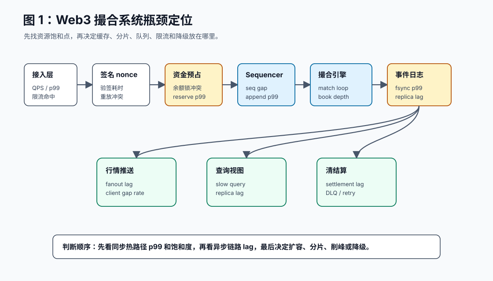
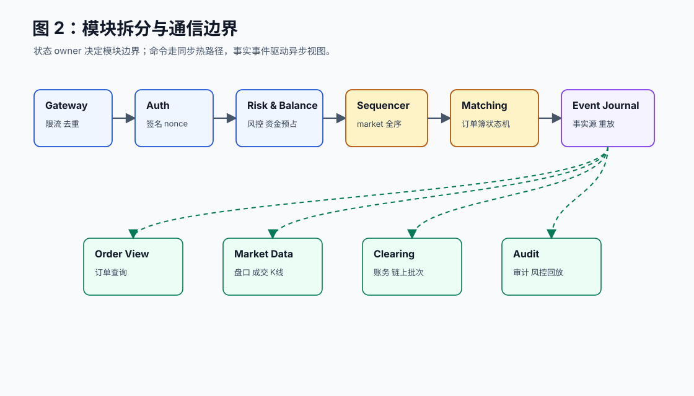
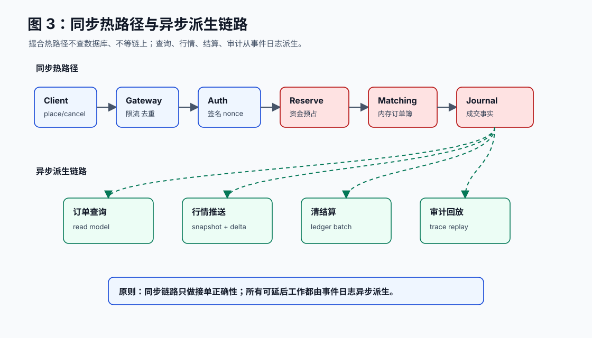
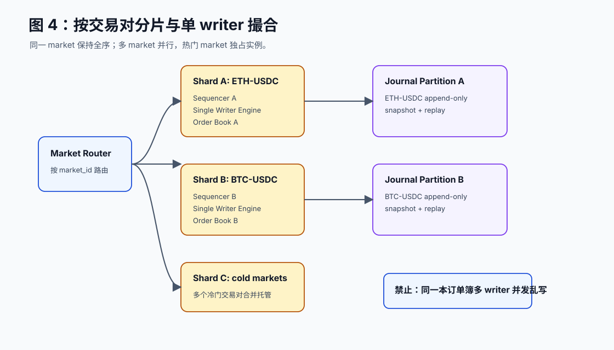
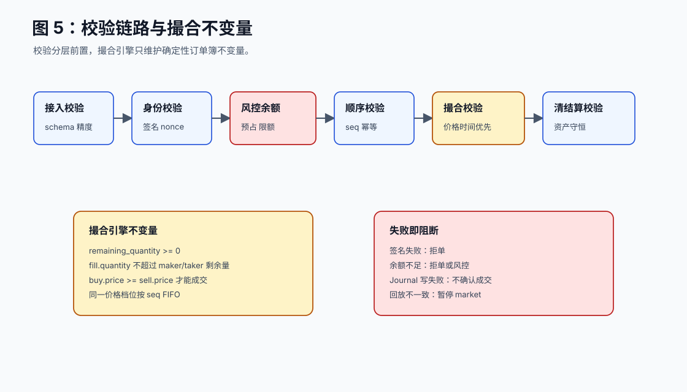

# 01. Web3 高并发撮合与订单簿架构设计

[返回全局摘要](../README.md) · [返回本组：架构设计](README.md)

## 先定位瓶颈

高级架构设计不是先说“上 MQ、上缓存、分库分表”。先问四件事：

```text
1. 哪条链路必须同步完成？
2. 哪个模块拥有核心状态？
3. 哪个资源先饱和？
4. 哪些动作允许异步、排队、降级或最终一致？
```

在 Web3 订单簿交易系统里，核心瓶颈通常不在普通 CRUD，而在这几处：

| 位置 | 为什么容易成为瓶颈 | 关键指标 | 通常处理 |
| --- | --- | --- | --- |
| 签名与 nonce 校验 | 每笔订单都要防伪造、防重放 | auth p99、nonce conflict、invalid signature rate | 本地缓存、公钥预热、nonce 原子更新、失败快速返回 |
| 资金预占 | 成交前必须保证可用余额足够 | reserve p99、余额锁冲突、insufficient rate | 余额服务分片、冻结余额、幂等预占、撤单释放 |
| 订单顺序 | 同一交易对必须有全序 | seq append latency、seq gap、partition lag | 按 market 分区、单调递增序号、顺序日志 |
| 撮合引擎 | 订单簿是强一致内存状态 | commands/s、match loop p99、book depth | 单 market 单 writer、多 market 并行、快照 + 重放 |
| 事件日志 | 成交事实必须持久化 | write p99、fsync、replication lag | append-only journal、分区复制、批量刷盘 |
| 行情推送 | 高频成交会放大 fanout | websocket lag、gap rate、snapshot size | 快照 + 增量、分层广播、客户端补 gap |
| 清结算 | 链上确认慢且不可控 | settlement lag、retry、finality time | 异步批处理、幂等提交、重试和对账 |

**图 1：瓶颈定位图**  


## 常见手段放在哪里

读写分离、分库分表、削峰填谷都要放在正确的位置。放错了，会让系统更复杂但不解决核心问题。

| 手段 | 应该放的位置 | 不该指望它解决什么 |
| --- | --- | --- |
| 读写分离 | 订单查询、成交历史、资产视图、报表 | 不能加速撮合热路径 |
| 分库分表 | 历史订单、成交、账务、审计日志 | 不能破坏同一 market 的撮合全序 |
| 削峰填谷 | 链上结算、通知、报表、K 线、审计 | 不能让实时下单无限排队 |
| 缓存 | market config、费率、权限、行情快照 | 不能缓存最终余额判断 |
| 限流 | API、用户、market、撤单频率、行情订阅 | 不能替代资金校验和风控 |
| 熔断降级 | 链上 RPC、行情推送、非核心查询 | 不能让撮合结果丢失事实源 |

## 架构目标

这里设计的是链下高性能订单簿交易系统：用户提交限价单、市价单和撤单；系统完成签名校验、资金预占、撮合、事件持久化、行情推送和链上/链下清结算。

核心目标：

| 目标 | 要求 |
| --- | --- |
| 正确性 | 同一交易对严格价格优先、时间优先 |
| 高并发 | 接入水平扩展，撮合按 market 分片 |
| 低延迟 | 撮合热路径不查数据库、不等链上 |
| 可恢复 | 通过 snapshot + event log 恢复订单簿 |
| 高安全 | 签名、nonce、余额、权限、风控在撮合前完成 |
| 可验证 | 每笔订单、成交、撤单、余额变更可回放和对账 |

## 模块拆分

拆模块的依据是“状态 owner”。谁拥有状态，谁就负责该状态的变更顺序和不变量。

| 模块 | 职责 | 状态 owner | 通信 |
| --- | --- | --- | --- |
| API Gateway | 接入、限流、请求去重、基础参数校验 | request_id、rate limit bucket | 同步 RPC |
| Signature/Auth | 钱包签名、chain_id、nonce、防重放 | nonce、api key 权限 | 同步 RPC / 本地缓存 |
| Risk & Balance | 风控、余额/保证金预占、额度检查 | 可用余额、冻结余额、风险额度 | 同步 RPC |
| Order Sequencer | 给同一 market 分配严格递增序号 | market_seq、idempotency key | 顺序追加日志 |
| Matching Engine | 维护订单簿，执行撮合和撤单 | order book、active orders | 单 writer 消费分片事件 |
| Event Journal | 保存命令和撮合事实，支持重放 | append-only event stream | 顺序写入 |
| Order Projector | 生成订单查询视图 | order read model | 异步订阅事件 |
| Market Data | 盘口、成交、ticker、K 线 | depth snapshot、trade stream | 异步订阅事件 |
| Clearing | 账务、手续费、冻结释放、链上批次 | ledger entries、settlement batch | 异步事件 + 幂等执行 |
| Audit | 风控审计、异常交易、回放校验 | audit trace、risk alert | 异步订阅事件 |

**图 2：模块拆分与通信图**  


## 同步热路径

下单热路径只保留必须同步完成的动作：

```text
Client
-> API Gateway
-> Signature/Auth
-> Risk & Balance reserve
-> Order Sequencer
-> Matching Engine
-> Event Journal
-> Ack / Fill response
```

异步派生链路：

```text
Event Journal
-> Order Projector
-> Market Data
-> Clearing / Settlement
-> Audit
-> Data Warehouse
```

撮合引擎不查数据库、不调链、不调远程风控。它只消费已经排序、已经校验、已经预占资金的命令。

**图 3：同步热路径与异步派生链路**  


## 撮合分片

撮合层不是“同一个订单簿多线程乱写”。正确做法是按 `market_id` 分片：

- 同一 `market_id` 进入同一个 sequencer 和 matching engine。
- 一个 market 内单 writer 保证价格时间优先。
- 多个 market 可以并行部署在不同核心、进程或机器。
- 热门 market 可以独占实例，冷门 market 可以合并托管。

为什么不先把同一个 ETH-USDC 订单簿拆成多 writer：

- 订单簿是有序状态，同一价格档位要保持 FIFO。
- 市价单可能扫多个价格档位，跨 writer 合并会引入一致性问题。
- 锁竞争会直接进入 p99 延迟。
- 比起多 writer，优先优化内存结构、快照、顺序日志和 CPU 亲和性。

**图 4：按交易对分片与单 writer 撮合**  


## 校验与不变量

校验要分层，不要全塞到撮合引擎。

| 阶段 | 校验内容 | 失败处理 |
| --- | --- | --- |
| 接入校验 | schema、tick size、min quantity、market status | 直接拒单 |
| 身份校验 | wallet signature、chain_id、nonce、api key | 直接拒单并记录审计 |
| 风控余额 | 可用余额、保证金、限额、自成交策略 | 拒单或进入人工风控 |
| 顺序校验 | command_id 幂等、market seq 单调递增 | 重复返回原结果，断序暂停 |
| 撮合校验 | 价格时间优先、数量非负、订单状态合法 | 触发熔断和回放检查 |
| 清结算校验 | 资产守恒、手续费正确、冻结释放正确 | 暂停结算批次，对账修复 |
| 链上校验 | tx 状态、finality、reorg、合约事件 | 等待 finality 或回滚未确认状态 |

撮合引擎的不变量：

```text
remaining_quantity >= 0
fill.quantity <= maker.remaining_quantity
fill.quantity <= taker.remaining_quantity
buy.price >= sell.price 才能成交
同一 price level 内按 seq 保持 FIFO
每个 order_id 只能处于一个最终状态
replay(event_log) 后订单簿状态必须一致
```

**图 5：校验链路与不变量**  


## 判断依据

架构师不能靠“感觉像瓶颈”做判断。每个模块都有明确指标：

| 模块 | 观察指标 | 说明 |
| --- | --- | --- |
| Gateway | request p99、限流命中、拒绝率 | 判断入口是否过载 |
| Auth | signature p99、nonce conflict | 判断签名和防重放是否拖慢 |
| Balance | reserve p99、lock conflict、余额失败率 | 判断资金预占是否瓶颈 |
| Sequencer | append p99、seq gap、partition lag | 判断顺序边界是否瓶颈 |
| Matching | commands/s、match loop p99、book depth | 判断撮合循环是否饱和 |
| Journal | write p99、fsync、replication lag | 判断事实源是否拖慢确认 |
| Market Data | fanout lag、client gap rate | 判断行情推送是否落后 |
| Clearing | settlement lag、retry、DLQ | 判断清结算是否积压 |

压测也要拆开：

- 接入压测：签名、限流、鉴权能扛多少 QPS。
- 撮合压测：单 market 每秒能处理多少下单和撤单。
- 行情压测：盘口高频变化时 WebSocket fanout 能否跟上。
- 结算压测：成交峰值后账务和链上批次多久消化。
- 恢复压测：从 snapshot + event log 恢复订单簿耗时多少。

## 故障处理

| 故障 | 处理 |
| --- | --- |
| Matching Engine 崩溃 | 从最近 snapshot + event log 重放恢复 |
| Sequencer 不可用 | 对应 market 暂停接单，不走无序旁路 |
| Journal 写失败 | 不确认订单，避免产生无事实源成交 |
| Balance 服务不可用 | 新订单拒绝或只允许撤单 |
| Market Data 落后 | 客户端按 seq 检测 gap 后重拉 snapshot |
| Clearing 积压 | 撮合继续，提现/链上结算排队并告警 |
| 链上 reorg | 按 finality 确认，回滚未最终确认批次 |

## 架构评审问题

一个 Web3 撮合架构至少要回答：

- 同一个 `market_id` 的全序由谁保证？
- 余额预占在哪里完成，如何防止成交后资金不足？
- 撮合引擎热路径是否访问数据库或链上 RPC？
- 查询、行情、结算和审计落后时，是否影响撮合核心链路？
- 同一订单重复提交、重复事件消费、重复链上提交如何幂等？
- 重启后订单簿如何恢复，恢复耗时是多少？
- p99 延迟、撮合吞吐、journal 写入延迟、队列 lag、账务对账差异如何监控？
- 撮合结果能否通过 event log 完整回放并得到一致订单簿？

如果方案只说“用 MQ 削峰、Redis 缓存、MySQL 分库分表”，却回答不了这些问题，就还不是交易系统架构。
