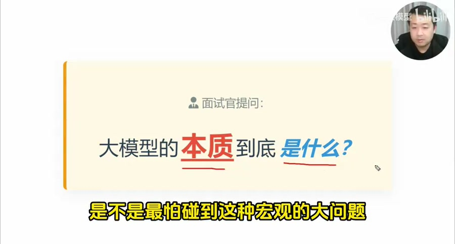
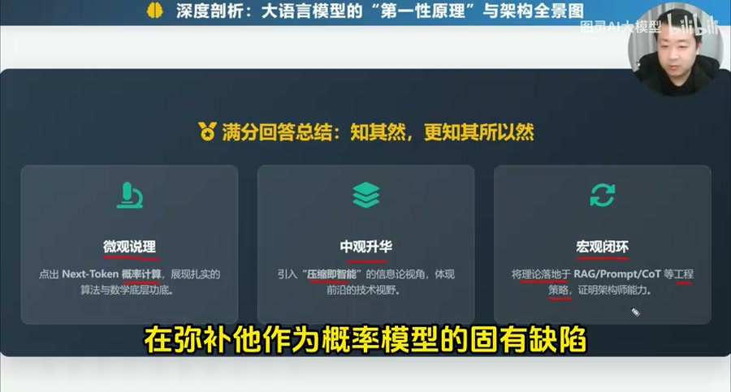
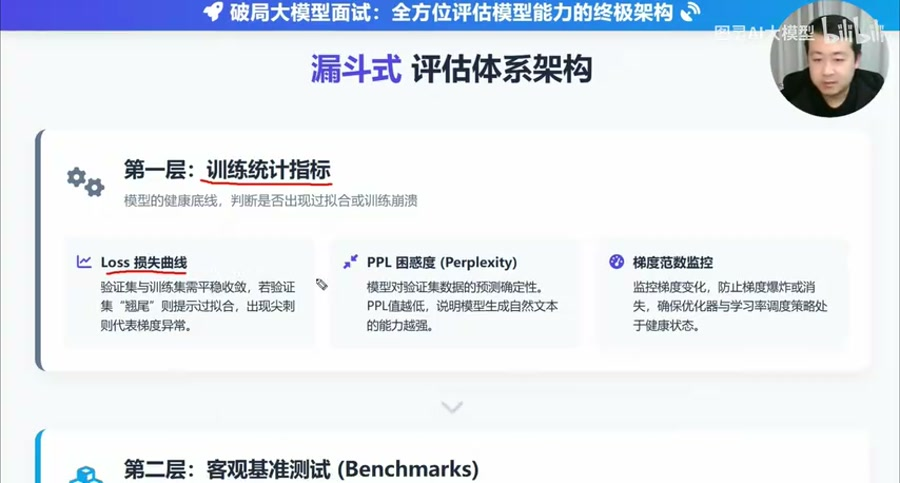
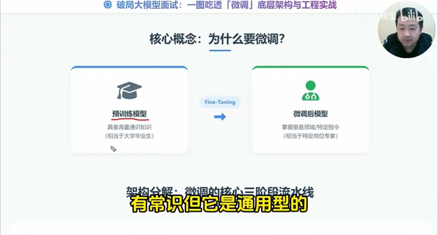
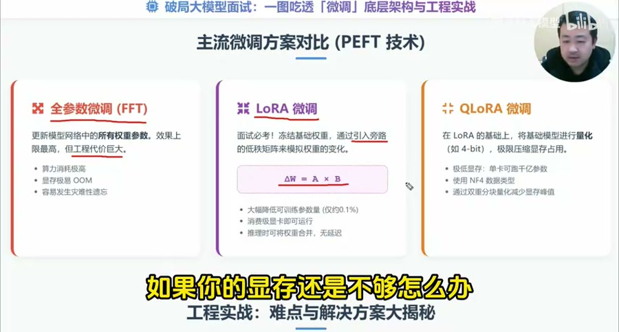
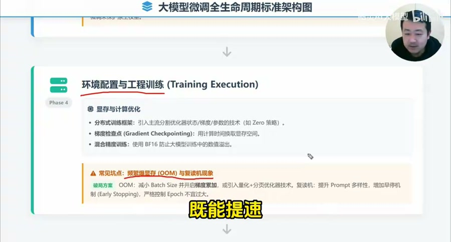
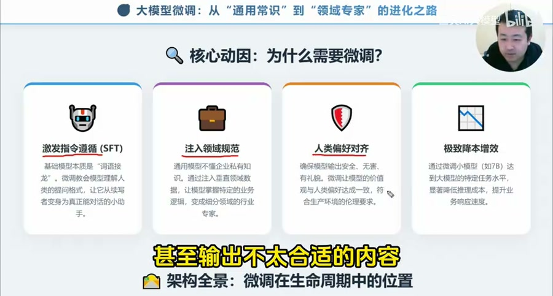
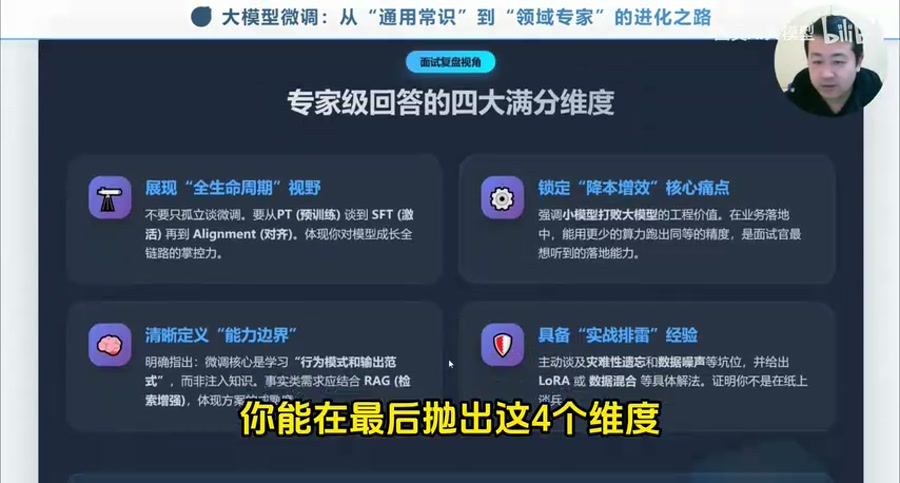

# AI 大模型微调的六个核心问题

来源: https://www.bilibili.com/video/BV1beAnzhEB7  
作者: 图灵AI大模型  
发布时间: 2026-03-20  
时长: 24:15  
处理方式: 下载完整视频后使用本地 `faster-whisper` 转写，结合关键帧整理为面试复习笔记。原始转写见 `raw/transcript.txt`。

## 一句话概括

这期视频把“大模型微调”拆成 6 个面试高频问题：大模型本质、优质参数来源、模型评估、微调定义、微调标准流程、为什么需要微调。最值得提炼的是一套面试表达框架：不要只背概念，要能从底层原理讲到训练流水线、工程约束、评估闭环和业务落地。



## 六个问题总览

| 问题 | 标准回答抓手 | 需要展开的关键词 |
| --- | --- | --- |
| 大模型的本质是什么 | 微观是概率预测，中观是知识压缩，宏观是能力涌现 | next token prediction、Transformer、自注意力、scaling laws、RAG、Prompt、CoT |
| 优质参数怎么来 | 不是“拿到”的，是通过数据、算力、算法和对齐流水线训练出来的 | 数据清洗、MinHash 去重、去污染、预训练、SFT、RLHF/DPO |
| 怎么判断模型学得好 | 不能只看 loss 或榜单，要看漏斗式评估体系 | loss、PPL、梯度、Benchmarks、LLM-as-a-Judge、A/B 测试、ROI |
| 什么是微调 | 让通用模型从“懂语言”变成“懂业务、懂规矩” | SFT、Reward Model、RLHF、DPO、LoRA、QLoRA |
| 标准流程是什么 | 明确目标、准备数据、选择策略、训练、评估、部署、反馈迭代 | instruction-input-output、chat template、PEFT、DeepSpeed ZeRO、BF16、数据飞轮 |
| 为什么需要微调 | 解决指令遵循、领域规范、偏好对齐和降本增效 | 小模型专用化、业务格式、价值观、安全性、推理成本 |

## 1. 大模型的本质是什么

视频给出的回答分三层：

1. 微观上，大模型是条件概率分布引擎。它核心做的是 `next token prediction`，即根据上下文预测下一个 token。
2. 中观上，大模型是知识的有损压缩。它通过海量语料训练，把规律、模式和知识压进参数里，但不会逐字节记住所有事实，因此会产生幻觉。
3. 宏观上，大模型是涌现出来的直觉推理系统。当算力、数据和参数规模超过阈值后，会出现更强的通用模式识别和泛化能力。



### 从第一性原理推能力边界

理解大模型时，最重要的是不要把它当成“真正理解世界的人”，而要从它的生成机制反推它能做什么、不能稳定做什么，以及为什么会出问题。

| 层次 | 第一性原理 | 能力来源 | 能力边界 | 典型问题 |
| --- | --- | --- | --- | --- |
| 微观 | 概率预测 | 根据上下文预测最可能的下一个 token | 不是确定性推理机，同一问题可能因上下文、采样、提示差异而表现波动 | 有时答得好、有时答得差；格式漂移；推理链中途走偏 |
| 中观 | 有损压缩 | 把海量文本、代码、知识和模式压进参数 | 记住的是规律和分布，不是完整数据库或事实原文 | 幻觉、张冠李戴、编造来源、过时知识 |
| 宏观 | 能力涌现 | 规模、数据和训练目标叠加后出现泛化、迁移和类推能力 | 涌现的是强模式匹配和直觉推理，不等于始终可靠的逻辑证明 | 看起来很聪明，但在边界条件、长链推理、低频知识上失误 |

#### 什么时候体现为“概率预测”

当任务主要依赖语言模式、上下文续写、风格模仿、常见问答、代码补全时，大模型的概率预测机制会表现得很强。因为这些任务本质上就是在给定上下文后生成高概率的合理续写。

但同样因为它是概率预测，所以会出现不稳定：

- 提示词稍微变化，模型激活的分布不同，答案可能明显变化。
- 上下文里有噪声或暗示，模型可能顺着错误模式续写。
- 问题本身有多个可能方向时，模型可能选择一个看似合理但不是用户真正想要的方向。
- 采样温度较高时，输出更发散；温度较低时，输出更稳定但可能更死板。

所以微观层面的结论是：大模型擅长生成“高概率合理答案”，但不天然保证“唯一正确答案”。

#### 什么时候会产生幻觉

幻觉主要来自中观层面的有损压缩。模型参数保存的是知识模式和统计关联，而不是一套可精确查询的事实数据库。

典型触发场景：

- 问题涉及模型训练后才发生的新信息。
- 问题涉及公司内部、私有文档、长尾领域或低频事实。
- 用户要求给出具体数字、论文、链接、法律条款、API 参数、版本差异等精确信息。
- 检索依据不足，但用户语气暗示“必须回答”。
- 上下文中混入错误材料，模型没有能力自动区分真假。
- 多个相似实体容易混淆，例如同名公司、相近 API、相似论文。

幻觉不是模型“故意撒谎”，而是在缺少可靠事实锚点时，它仍然按语言分布生成了一个看起来合理的答案。

因此，凡是涉及事实准确性、时效性、私有知识、引用来源、执行风险的场景，都应该用 RAG、数据库查询、工具调用或人工审核补上事实锚点。

#### 什么时候会显得特别聪明

大模型在宏观层面会表现出“聪明”，主要因为规模化训练让它学到了大量抽象模式。

它特别擅长：

- 归纳总结：从大量文本中抽取主题、结构和观点。
- 类比迁移：把一个领域的方法迁移到另一个领域。
- 模式补全：根据已有代码、文档、表格补齐缺失部分。
- 语言转换：改写、翻译、风格迁移、格式转换。
- 常见推理：处理训练分布中大量出现过的常见逻辑、代码和数学模式。
- 方案生成：基于已有工程经验组合出可行的初版设计。

但这种聪明更像“高维模式匹配 + 直觉推理”，不是严格意义上的可验证推理系统。它在以下场景容易暴露边界：

- 长链条推理，中间一步错了后面全错。
- 需要精确计算、精确枚举或严格证明。
- 需求里存在隐藏约束或冲突目标。
- 任务需要真实世界状态，例如当前库存、权限、线上日志、最新价格。
- 输出会触发真实操作，例如删库、发邮件、下单、发布内容。

所以宏观层面的结论是：大模型可以很聪明地提出候选答案，但关键结论、关键事实和关键动作需要外部校验。

#### 能力边界的工程推论

从这三层原理可以推出一套工程原则：

- 概率预测导致不稳定，所以要用结构化提示、低温度、固定输出 schema、测试集和评估来收敛行为。
- 有损压缩导致幻觉，所以要用 RAG、数据库、搜索、引用、工具调用和人工审核补事实。
- 能力涌现带来泛化，所以可以让模型做理解、拆解、总结、生成和候选方案设计。
- 涌现不等于可靠，所以高风险场景要有工作流约束、权限控制、回滚机制和 `Human-in-the-loop`。
- 模型擅长语言和模式，不擅长保证真实世界状态，所以凡是“事实、金额、权限、法律、医疗、线上操作”都要接外部系统验证。

#### 针对不同问题的工程解法

不要把 RAG、few-shot、CoT、工具调用混成一类。它们分别在补不同的短板。

| 问题表现 | 底层原因 | 工程解法 | 解决的核心点 | 适用场景 |
| --- | --- | --- | --- | --- |
| 输出不稳定，同一个问题有时好有时坏 | 微观层面是概率预测，容易受提示、上下文和采样影响 | 结构化提示、低温度、固定输出 schema、few-shot 示例、自动评估集 | 收敛输出分布，让模型更稳定地走到目标模式 | 格式化输出、分类、抽取、固定风格生成 |
| 不知道也硬答，编造事实 | 中观层面是有损压缩，参数不是事实数据库 | RAG、数据库查询、搜索、引用来源、事实校验器 | 给模型外部事实锚点，避免只靠参数“猜” | 企业知识库、法律条款、API 文档、实时信息、私有数据 |
| 看起来会推理，但中间步骤容易错 | 宏观层面偏直觉式快思考，不天然做严格慢推理 | CoT/思维链、scratchpad、分步验证、代码执行器、数学工具 | 把隐式推理显式化，让中间过程可检查、可纠错 | 数学题、复杂逻辑、规划、多步骤分析 |
| 会调用工具但参数经常错 | 模型生成的是文本，不天然理解外部系统约束 | 清晰 OpenAPI 描述、参数 schema、工具参数校验、错误反馈重试 | 把工具调用从自由文本变成受约束的结构化动作 | API 调用、数据库查询、自动化办公、代码执行 |
| 长任务中途忘记目标或状态 | 上下文窗口有限，长程状态维护弱 | 工作流/状态机、任务状态表、短期记忆 + 长期记忆、检查点 | 把任务状态外置，不依赖模型自己记住全部过程 | Agent、多轮任务、项目执行、长文档处理 |
| 结果可能造成真实损失 | 模型输出不等于可靠决策，且无法承担责任 | 权限控制、最小权限、审批、审计日志、回滚机制 | 把模型限制在可控边界内 | 发邮件、删改数据、付款、发布、医疗/法律建议 |

这里最容易混淆的是 few-shot、RAG 和 CoT：

- `few-shot` 解决的是“模型该按什么模式回答”。它用少量示例激活参数空间里的目标模式，适合稳定格式、语气、分类标准和抽取方式。
- `RAG` 解决的是“模型该依据什么事实回答”。它把外部知识检索进上下文，适合补私有知识、最新知识和可引用证据。
- `CoT` 或分步推理解决的是“模型该如何一步步想”。它把快思考变成可观察的中间过程，适合多步推理、规划、数学和复杂判断。

一个简单判断法：

```text
如果答案风格不稳定，用 few-shot 和 schema。
如果事实来源不可靠，用 RAG 和工具查询。
如果推理过程容易跳步，用 CoT、分步验证或代码执行器。
如果执行动作有风险，用权限、审批和工作流。
```

面试回答可以这样组织：

```text
我会从三层理解大模型。微观上，它是基于上下文预测下一个 token 的概率模型，所以它擅长生成高概率的合理答案，但会受上下文和采样影响而波动。中观上，它通过参数对世界知识做有损压缩，所以能复用大量知识模式，但在事实不充分、知识过时或长尾问题上容易幻觉。宏观上，规模化训练带来了能力涌现，让模型具备归纳、类比、迁移和方案生成能力，但这种能力更接近直觉推理，不等于严格可靠的证明系统。因此工程上的 RAG、Prompt、CoT、工具调用和人工审批，本质上都是在利用它的生成与泛化能力，同时补齐事实、推理和执行边界。
```

可展开的工程映射：

- 因为模型是概率预测，所以需要结构化提示、输出 schema、低温度和评估集来降低波动。
- 因为知识是有损压缩，所以需要 RAG、数据库、搜索和引用来锚定事实。
- 因为 few-shot 可以激活参数空间里的特定模式，所以示例比抽象要求更能稳定输出。
- 因为模型偏系统一式直觉输出，所以需要 CoT、工具调用、代码执行器或验证器增强推理过程。
- 因为模型不能感知真实世界状态，所以涉及权限、金额、法律、医疗和线上操作时要接外部系统和人工审核。

## 2. 大模型如何获得优质参数

视频强调：优质参数不是直接获取的，而是训练出来的。

完整链路包括：

1. 数据淬炼：启发式清洗低质量内容，使用 MinHash 去重，做测试集去污染，并控制代码、数学、通用文本等数据配比。
2. 规模预训练：通过 next token prediction 学习知识和模式，依赖 scaling laws 让能力随规模提升。
3. 稳定性保障：使用 BF16、并行训练、梯度裁剪、checkpoint 等技术避免 loss 爆炸、训练中断或数值异常。
4. 指令微调 SFT：用高质量指令样本让模型学会按人类期望的格式交互。
5. 偏好对齐：通过 RLHF 或 DPO 学习人类偏好，让模型更有用、更诚实、更安全。

高分回答的关键不是“预训练 + 微调”这几个词，而是讲出瓶颈和解法：

- 高质量数据耗尽：用合成数据补充，但要防止污染。
- 训练不稳定：梯度裁剪、高频 checkpoint、并行策略和数值格式要做好。
- 对齐税和灾难性遗忘：混入部分高质量预训练数据，保住基础能力。
- 幻觉问题：对常识知识做上采样，并结合 RAG，让模型不要硬背事实。

## 3. 如何判断模型是否学得好

视频反复提醒：只说看 loss 或榜单分数，会显得很浅。更好的回答是“漏斗式评估体系”。



### 第一层：训练统计指标

- 训练集和验证集 loss 是否平稳下降。
- 验证集 loss 是否上升，以判断是否过拟合。
- PPL 是否下降，以判断模型预测下一个 token 的确定性。
- 梯度范数是否稳定，以防止梯度爆炸或消失。

### 第二层：客观 Benchmarks

用通识、学科、数学推理、代码生成与执行等基准测试评估泛化能力。代码能力特别重要，因为代码能检验模型是否具备严谨结构化推理，而不是只会语言拟合。

### 第三层：主观对齐与人类偏好

看模型是否有用、诚实、无害。可使用 `LLM-as-a-Judge`、双盲对战、Elo 排名等方式比较回答质量。

### 第四层：业务 ROI

模型最终要落地到真实业务中，看 A/B 测试、用户采纳率、留存率、推理速度、显存占用、并发吞吐和成本收益。

面试回答模板：

```text
我不会只看 loss。判断模型是否学得好，要从训练健康度、客观能力、主观偏好和业务 ROI 四层评估。底层看 loss、PPL、梯度；中层看知识、推理、代码等 benchmarks；再往上看有用性、诚实性、无害性和人类偏好；最终看真实业务 A/B 测试和成本收益。
```

## 4. 什么是微调

视频把微调解释为：让模型从“懂语言”变成“懂规矩、懂业务”。



可以按三阶段解释：

- SFT: 用高质量问答对让模型学会听话、遵循指令格式。
- Reward Model: 训练一个裁判，学习人类对回答好坏的偏好。
- RLHF/DPO: 基于偏好进一步对齐，让模型更安全、更有用，减少幻觉和不合适输出。

工程上要补充 PEFT：



- 全参数微调: 效果强，但显存、算力成本高，也更容易灾难性遗忘。
- LoRA: 冻结原模型参数，只训练低秩增量矩阵，训练成本低，推理时可合并权重。
- QLoRA: 在 LoRA 基础上进一步量化到 4-bit，适合显存紧张场景。

这里最容易被追问的是 LoRA 原理。可以这样答：

```text
LoRA 的核心是冻结基座模型的大权重矩阵，只训练一个低秩增量 ΔW = A × B。这样训练参数量大幅减少，既降低显存需求，也减少对基座模型能力的破坏。
```

## 5. 大模型微调的标准流程

标准流程不能只说“准备数据、开始训练”，要讲成工程生命周期。

### 1. 明确场景和目标

先判断微调目的：

- 是注入垂直领域能力？
- 是提升某个任务能力，例如信息抽取、代码生成？
- 是做输出格式和语气对齐？
- 是降低成本，让小模型在特定任务接近大模型效果？

目标不同，路线不同。可能是继续预训练，也可能是任务导向 SFT。

### 2. 数据准备

关键不是多，而是质量、格式和覆盖。

- 清洗噪声、去重、去污染。
- 构造 `instruction / input / output` 样本。
- 对齐基座模型的 chat template，避免乱码、复读或停不下来。
- 混入一定比例通用数据，降低灾难性遗忘风险。

### 3. 选择微调策略

资源充足可以考虑全参数微调；多数业务场景优先 LoRA/QLoRA。资源紧张时要考虑显存、训练速度、推理部署和权重合并成本。

### 4. 环境配置与工程训练



常见技术点：

- DeepSpeed ZeRO 做参数、梯度和优化器状态切分。
- Gradient Checkpointing 用计算换显存。
- BF16 混合精度提速并降低数值溢出风险。
- 梯度累加在小显存下模拟更大 batch。
- 早停和权重衰减控制过拟合。

### 5. 多维评估

训练 loss 低不等于能力强。要结合 benchmarks、LLM-as-a-Judge、人工验收和业务小流量测试。

如果模型仍然严重幻觉，需要补充拒答样本、事实性样本，或者把微调和 RAG 结合。

### 6. 部署与持续迭代

如果用 LoRA，要先考虑是否合并增量权重，再接入推理加速引擎。上线后收集坏案例，清洗后进入下一轮微调，形成数据飞轮。

## 6. 为什么需要微调



视频给出四个动机：

1. 激发指令遵循。原生模型只是续写机器，SFT 让它学会按任务回答。
2. 注入领域规范。通用模型不懂公司业务、医疗、法律、金融等特定格式和规则。
3. 人类偏好对齐。让模型输出更安全、更礼貌、更符合价值观和生产要求。
4. 降本增效。用 7B/8B 小模型在特定任务上达到大模型效果，降低推理成本、提升速度。

面试回答不要说“为了让模型更聪明”。更准确的说法是：

```text
预训练决定模型上限，微调决定模型能否落地。微调的目标不是简单增加知识，而是让模型学会特定任务的行为模式、输出范式、业务规则和人类偏好。在生产环境中，它还承担降本增效的作用。
```

## 高频坑点与优化方案

| 坑点 | 表现 | 优化方案 |
| --- | --- | --- |
| 数据质量差 | 微调后幻觉更多、格式混乱 | 强清洗、去重、去污染，用强模型辅助打分和合成高质量数据 |
| 对话模板不匹配 | 输出乱码、复读、停不下来 | 严格匹配基座模型 chat template |
| 显存不足 OOM | 训练无法启动或中途崩溃 | QLoRA、Gradient Checkpointing、梯度累加、DeepSpeed ZeRO |
| 灾难性遗忘 | 学会新任务但丢失通用能力 | LoRA、混入 10%-20% 通用数据、降低学习率、早停 |
| 过拟合 | 训练 loss 下降但泛化变差 | 验证集监控、早停、权重衰减、扩充数据多样性 |
| 幻觉难控 | 不知道也硬答 | 加入拒答数据、事实性校验、RAG、外部知识对照评估 |

## 最适合提炼复用的内容

这期视频最适合沉淀为三类材料：

1. 面试回答模板  
   每个问题都可以按“定义 -> 原理 -> 工程实践 -> 坑点 -> 业务价值”的顺序回答。

2. 微调项目检查清单  
   从需求分析、数据准备、策略选择、训练执行、评估、部署和反馈闭环逐项检查。

3. 术语解释卡片  
   把 SFT、RLHF、DPO、LoRA、QLoRA、PPL、MinHash、BF16、DeepSpeed ZeRO、Gradient Checkpointing、RAG 分别整理成一句话解释和适用场景。

## 结论



这期视频的主线不是单纯讲“微调是什么”，而是训练一种面试表达方式：把微调放进大模型全生命周期里讲。

高分回答要覆盖四个维度：

- 全生命周期视野：从预训练、SFT、对齐到部署迭代。
- 降本增效价值：小模型专用化，降低推理成本。
- 能力边界意识：微调主要学习行为模式和输出范式，最新知识应配合 RAG。
- 实战经验：能主动讲数据质量、OOM、LoRA/QLoRA、灾难性遗忘和评估闭环。

最终记住一句话：预训练决定模型上限，微调决定模型能否真正落地。
